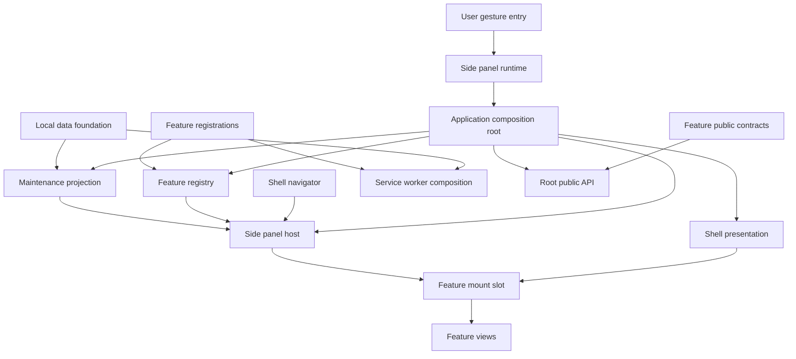
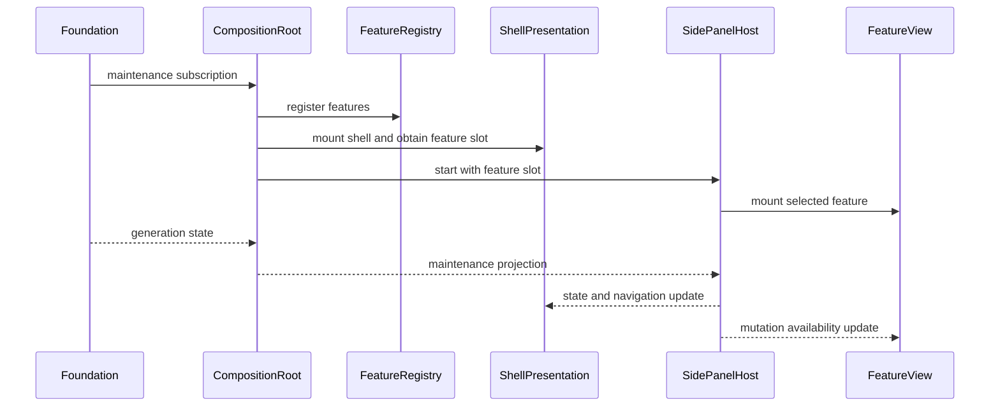

# 設計書

## 概要

application shellは、Chrome extensionのside panelをfeature-neutralなhostとして構成し、登録済みfeatureのナビゲーションとlifecycleを管理する。単一のcomposition rootがfoundationのmaintenance projectionとfeature registrationを合成し、共有runtime入口とroot公開APIの所有権を一元化する。

設計はRegistry + Composition Rootパターンを採用する。feature固有のview、状態、業務処理、永続化はshellへ持ち込まず、型付きportを介して参加させる。

### 目標
- featureが共有ファイルを変更せず独立して登録・検証できる。
- 利用可能性、失敗、maintenanceをside panel全体で一貫して表示する。
- maintenance通知の世代順序を守りmutation操作を共通抑止する。

### 非目標
- feature固有のview/state/業務規則の実装。
- Repository、write authority、maintenance lease、復元処理の実装。
- Chrome Web Store公開、他ブラウザ対応、旧major互換。

## 境界コミットメント

### このspecが所有するもの
- `application-shell/public.ts`に現れる常設／一過性区分、常設だけをnavigation・初期選択・fallbackへ載せるsteady-state shell lifecycle、およびその受け入れ回帰。`presentation`導入と一過性controller実装は`transient-feature-surface`が所有する。
- `transientNotice`を常設navigationと併存させ安全なテキストとして描画するsteady-state受け入れ。notice導入実装は`transient-feature-surface`が所有する。
- `ui-messages`が解決したナビゲーションラベル・共通状態文言の描画、およびsettingsを常設featureとして受け入れるhost契約。settings回復案内・header撤去・具体composition変更は`settings-screen`が所有する。
- `ShellNavigator`、feature-neutralな`FeatureActivationIntent`、activation配送順序と失敗分離。
- side panel host、ナビゲーション、共通loading/error/maintenance React viewとroot adapter。
- `ApplicationCompositionRoot`とroot公開APIの合成。
- 世代付きmaintenance状態のread-only projectionとUI mutation gate。
- 共有runtime入口、HTML host、shell統合test kit。
- shell containerとfeature mount containerを分離するpresentation lifecycle契約。
- foundationと下流registrationを一度だけ合成するproduction application composition module。
- MV3 service worker contextでfoundation worker registrationとfeature catalogのworker contributionを一度だけ合成するproduction worker composition。

### 境界外
- feature固有のDOM、state、domain error、保存可否判断。
- maintenance leaseの取得・更新・owner fencing・commit直前検証。
- Storage API、Repository、復元、商品抽出、互換性判定。
- feature公開契約の内容そのもの。
- feature固有のactivation payload、targetの意味、payloadからfeature stateへの変換。
- 一過性featureの起動世代、固定tab、寿命監視、gesture ingressおよびstore。これらは`transient-feature-surface`が所有する。
- Repository、Chrome Storage adapter、canonical maintenance sourceを生成するfoundation runtime factoryの実装。foundationは公開runtime contributionとして提供し、shellはそのhandleだけを利用する。
- 表示言語の意味・保存・解決、言語control、settings画面layout、backup区画、メッセージカタログの内容と言語別値（`settings-screen`、`ui-messages`、`ui-language`、`backup-restore`所有）。shellヘッダへ言語controlを配置しない。

### 許可する依存
- local data foundationの公開型、canonical `Result<T, E>`、query契約、および完了済み`local-data-foundation` task 5.5が公開するread-only `MaintenanceSnapshotSource`。
- local data foundationが公開済みの`initializeProductionFoundationRuntimeContribution()`。このfactoryは`MaintenanceSnapshotSource`、foundation worker registration、disposeを一つのhandleとして返し、shellへRepositoryやStorage adapterを露出しない。
- 下流featureのregistration moduleと`public.ts`（composition rootからのみ参照）。
- Chrome 116以降のManifest V3 Side Panel API、React 19系、React DOM、CSS。
- dependency direction: `contracts → registry/state → host → React view/root adapter → composition → runtime/root entry`。逆向きimportは禁止する。
- `src/runtime/side-panel.ts`と`side-panel-bootstrap.ts`はapplication-shellのproduction composition factory、ui-language所有の`runtime.ts` composition seam、および一過性surface用runtime adapterだけをimportする。foundation factory、具体feature registration、worker registration、ui-languageのstore・document sync・preference実装を直接importしない。
- `src/runtime/service-worker.ts`はproduction worker compositionとChrome message target adapterだけを所有し、Storage、Repository、foundation内部、DOM、Reactをimportしない。
- production composition modulesだけがfoundationの公開factoryと下流featureの`public.ts`またはregistration公開入口を具体依存として知る。下流feature内部へのdeep importは禁止する。
- `ui-messages`の公開型`MessageKey`・`MessageDescriptor`と解決契約`useMessages()`（`src/ui-messages/public.ts`）。ナビゲーションラベルと共通状態文言（`ShellViewState`/`ShellMaintenanceState`のmessage）の表示文字列化にだけ使用し、カタログの内部実装・言語別値へdeep importしない。
- `ui-language`の公開Provider`LanguageProvider`（`src/ui-language/public.ts`）と、shell所有runtime入口だけが利用するcomposition seam（`src/ui-language/runtime.ts`）。shell viewはProviderだけを組み込み、`LanguageSelectControl`の配置はsettings featureへ委ねる。runtime入口もpreference store実装へ直接deep importせず、runtime seamから初期化する。
- `transient-feature-surface`が確定した`PersistentApplicationFeatureRegistration`／`TransientApplicationFeatureRegistration`判別共用体、`isPersistent`型述語、`TransientNotice`、typed activation連携。shellは表示区分を解釈してhostへ投影するが、起動世代やChrome gestureを再実装しない。
- `settings-screen`が提供するpersistent settings contribution。shellはcompositionとnavigation到達だけを所有し、settings内部の言語・backup能力を解釈しない。

### 再検証トリガー
- registration、mount context、availability、activation、public API registryの型変更。
- foundationのmaintenance世代・購読契約の変更。
- root entry、side panel起動順序、`sidePanel.open()` gesture入口の変更。
- shellとfeature間のファイル所有権または依存方向の変更。
- foundationの`MaintenanceSnapshot`または`MaintenanceSnapshotSource`公開契約、`local-data-foundation` task 5.5の完了状態が変更された場合。
- shell presentation handle、feature slot生成時点、persistent navigation判定、初期選択・fallback、`transientNotice`、production contribution一覧の変更。
- `ui-messages`の`MessageKey`/`MessageDescriptor`/`useMessages()`公開契約、`ui-language`の`LanguageProvider`公開契約、またはsettings回復案内の配置状態の変更。
- worker-safe `feature-contribution-catalog.ts`とUI専用`side-panel-contributions.ts`の分離、または`TransientGestureRegistrationPort`のworker composition接続を変更する場合は`source-price-refresh`を再検証する。

## アーキテクチャ

### 既存アーキテクチャ分析

- `src/domain/`と`src/persistence/`にはstrict TypeScriptのlocal data foundation、canonical `Result<T, E>`、永続maintenance state、query/mutation portが実装済みである。
- `manifest.json`、esbuildによるChrome 116 target、Node test、Playwright、artifact/boundary検査は既存基盤として維持する。
- application shell task 3.4までにcontracts、registry、maintenance projection、mutation gate、ShellView、ReactShellRoot、SidePanelHost、composition root、runtime bootstrapと対応testが実装済みである。
- `src/runtime/side-panel.ts`はproduction side panel compositionとbootstrapへ接続済みであり、仮maintenance sourceやnoop observerを持たない。残るproduction gapはfoundation worker registrationのservice worker接続である。
- 現行composition rootとSidePanelHostは一つのcontainerをfeature mountへ渡す。shell React rootも同じcontainerを所有するため、task 4.1ではshell専用rootとfeature専用outletを分離する必要がある。
- foundationは`src/persistence/public.ts`から引数なしproduction factoryを公開済みであり、検証済みread-only `MaintenanceSnapshotSource`、単数の`DataWorkerRegistration`、冪等`dispose`を返す。application-shellはStorage実装へdeep importせず、各MV3 contextからこの公開factoryを利用する。

### Architecture Pattern & Boundary Map



- **選択パターン**: Registry + Composition Root。登録・状態・表示を分離し、compositionだけが具体featureを知る。
- **境界**: shellはfeatureの契約を呼ぶが業務データを解釈しない。foundation状態を表示へ写像するがleaseを操作しない。
- **新規component**: Registry、MaintenanceProjection、Host、CompositionRoot、PublicApiRegistryはそれぞれ一つの共有責務を持つ。

### Technology Stack

| Layer | 選択 / Version | 役割 | 注記 |
|---|---|---|---|
| 言語 | TypeScript 7.0.2 | 型付き契約とruntime実装 | 既存固定version、`any`禁止、strict mode |
| UI | React 19系 / React DOM / CSS | side panel host、共通表示、feature viewの宣言的描画 | production bundleへ同梱、JSXを使用 |
| Runtime | Chrome 116+ Manifest V3 | Side Panel APIとgesture entry | 実行コードを同梱 |
| Build/Test | esbuild 0.28.1、Node 26.5.0 test、Playwright 1.61.1 | bundle、unit/integration、MV3 E2E | DOM test環境はReact導入時に互換性確認して固定 |

## ファイル構造計画

```text
side-panel.html                         # shellが所有するside panel document
src/
├── application-shell/
│   ├── contracts.ts                   # 常設／一過性registration判別共用体、mount、availability、maintenance、transientNotice型
│   ├── feature-registry.ts            # 区分別登録検証、一意性、snapshotと購読
│   ├── maintenance-projection.ts      # 世代付き状態の単調projection
│   ├── mutation-gate.ts               # UI操作種別とmaintenance抑止判定
│   ├── activation-router.ts            # feature-neutral intentの対象解決と一回配送
│   ├── side-panel-host.ts             # navigationとfeature lifecycle調停
│   ├── worker-composition.ts          # feature提供worker registrationの一回限り合成
│   ├── shell-view.tsx                  # loading/error/maintenance/navigation/transientNoticeのReact表示。loading/startup errorでは二言語settings回復案内を描画する
│   ├── react-shell-root.tsx            # shell用React rootとcleanup adapter。ProviderはLanguageProvider（MessageProviderを内包）
│   ├── error-boundary.tsx              # component描画失敗のfeature単位隔離
│   ├── composition-root.ts            # foundation、feature、hostの一回限り合成
│   ├── shell-presentation.tsx          # shell root、navigation command、feature専用slotの接続
│   ├── application-composition.ts      # canonical foundationと公開registrationのproduction合成
│   ├── production-worker-composition.ts # foundation message registrationとcatalog workerのcontext別合成
│   ├── feature-contribution-catalog.ts # contribution契約とworker安全なcatalog（DOM/React非依存）
│   ├── side-panel-contributions.ts     # side panel専用contribution factoryの唯一の集約点
│   └── public-api-registry.ts          # feature public contractの型付き合成
├── runtime/
│   ├── side-panel.ts                  # side panel bootstrap入口
│   ├── service-worker.ts              # Chrome message targetとproduction worker bootstrap入口
│   └── open-side-panel.ts             # user gesture内のSide Panel API adapter
└── index.ts                           # root公開APIの唯一のbarrel
tests/
├── application-shell/                 # component unit tests
├── contracts/                         # downstream registration contract test kit
└── application-shell/application-shell-integration.test.ts # bootstrap、遷移、障害、maintenance統合
```

既存の`react-shell-root.tsx`、`shell-view.tsx`、`shell-view.css`、`feature-registry.ts`、`side-panel-host.ts`、`shell-presentation.tsx`、`application-composition.ts`を常設／一過性混在とsettings回復表示へ改訂する。`feature-contribution-catalog.ts`はworker registrationだけを含められるworker-safe graphを維持し、`side-panel-contributions.ts`だけがsettingsを含むUI contributionを参照する。`src/domain/`と`src/persistence/`の実装は変更対象外である。各下流featureの登録ファイルと`public.ts`は各feature specが所有し、このspecは変更しない。仮のmaintenance sourceへのfallbackは許可しない。

#### Feature contribution composition

下流feature未実装時の空catalogはfeature実装前の暫定production状態であり、実装済みfeatureが存在する時点でproduction compositionへ接続されていなければならない。空catalogのままstartedになるだけのshellはfeature完成の証拠として扱わない。

feature contributionは値ではなくfactoryとして登録し、production compositionが解決した合成contextを受け取る。

```typescript
interface FeatureCompositionContext {
  readonly data: FoundationScopedDataPort;   // local-data-foundation所有
  readonly navigator: ShellNavigator;        // application-shell所有（遅延bind）
}

type FeatureContributionFactory<
  TKey extends string,
  TPublic extends object,
  TActivation = unknown,
> = (context: FeatureCompositionContext) =>
  FeatureContribution<TKey, TPublic, TActivation>;
```

backup/restoreが必要とする完全`FoundationDataPort`と、一過性featureが必要とするlifecycle portは、全feature factory共通の`FeatureCompositionContext`へ含めない。application-shellの具体side-panel compositionだけが`SidePanelContributionDependencies`として受け取り、backup sectionとproduct-capture contributionへ個別に渡す。

- `feature-contribution-catalog.ts`はcontribution型、決定順序helper、およびworker contributionだけを持つworker安全なcatalogを所有する。この moduleはDOM、React、feature UI moduleへ到達してはならない。`src/runtime/service-worker.ts`はこのcatalogだけを参照する。
- `side-panel-contributions.ts`はUI contributionを具体合成する唯一の面とし、settingsをpersistent、product-capture等をtransientとして受け入れる。source-price-refreshのcontext menu worker contributionはここへ混在させない。
- `side-panel-contributions.ts`はside panel専用のcontribution factory列を所有する唯一のfileであり、featureの`feature-contribution.ts`公開入口だけをimportする。React依存はこのmodule graphへ閉じ込め、worker bundleへ混入させない。
- `navigator`はcomposition rootのactivate経路へ遅延委譲するobjectとして構築し、feature公開APIとcomposition rootの循環依存を作らない。
- `src/index.ts`はcatalogから導出した`ApplicationApi`型と、合成contextを受け取る`composeApplicationApi(context)`を公開する。data portなしに実featureを実体化できないため、root barrelは即時値を公開しない。
- feature側CSSは、side panel entryのmodule graphからimportして`dist/side-panel.css`へbundleし、shellが所有する`side-panel.html`から参照する。`src/application-shell/side-panel.css`から`src/ui-language/language-select.css`へのimportはsettings内language controlをbundleへ到達させる明示的CSS composition seamであり、shell header layout ownershipを意味しない。どのentryからも到達しないCSSはproduction artifactに含まれないため、設計上の記載と実体を一致させる。

## システムフロー



起動は冪等であり、二回目の`start`は既存instanceを返すか明示的な`already_started`結果を返す。feature切替では前viewのunmount完了後に次viewをmountする。persistent navigationによる切替でtarget mountが失敗した場合、shellは直前のpersistent registrationを新しいmount handleとして復元し、targetの部分表示を残さない。復元にも失敗した場合だけrecoverable error stateを表示する。mount失敗はhost全体を停止させない。

## 要件トレーサビリティ

| 要件 | 概要 | Components | Interfaces / Flows |
|---|---|---|---|
| 1.1, 1.2, 1.3, 1.4, 1.5, 1.7, 1.8 | 常設navigationと単一主表示 | FeatureRegistry, SidePanelHost, ShellView, ReactShellRoot | `ApplicationFeatureRegistration.presentation`, RegistrySnapshot, FeatureMount |
| 1.6 | ナビゲーションラベルの表示言語追随 | ShellView | `ShellNavigationItem.labelKey`, `useMessages()` |
| 2.1, 2.2, 2.3, 2.4, 2.5, 2.6 | 区分とnavigationの整合が型で閉じた常設／一過性feature登録 | FeatureRegistry | ApplicationFeatureRegistration discriminated union, isPersistent |
| 3.1, 3.2, 3.3, 3.4 | compositionと公開API | CompositionRoot, PublicApiRegistry | start, composePublicApi |
| 3.5, 3.6, 3.7 | feature contribution合成、worker bundle分離、catalog由来の公開API型 | ProductionWorkerComposition, PublicApiRegistry | FeatureCompositionContext, feature-contribution-catalog.ts, composeApplicationApi |
| 4.1, 4.2, 4.3, 4.4, 4.5, 4.6, 4.7 | 共通状態、notice、settings回復案内 | ShellView, ReactShellRoot, ShellErrorBoundary, SidePanelHost | ShellViewState, TransientNotice |
| 5.1, 5.2, 5.3, 5.4, 5.5, 5.6, 5.7 | maintenance抑止とmutation可否変化の購読 | MaintenanceProjection, MutationGate | MaintenanceSnapshotSource, OperationPolicy.subscribe |
| 6.1, 6.2, 6.3, 6.4 | runtimeと検証 | RuntimeAdapters, ContractTestKit | Chrome adapter, integration flow |
| 7.1, 7.2, 7.3, 7.4, 7.5, 7.6, 7.7, 7.8 | 常設／一過性feature間activation | ActivationRouter, SidePanelHost | FeatureActivationIntent, ShellNavigator, FeatureActivationAdapter, TransientSurfaceLifecyclePort |
| 8.1, 8.2 | persistent settingsの選択・到達 | FeatureRegistry, SidePanelHost, ShellView | PersistentApplicationFeatureRegistration, ShellNavigator |
| 8.3, 8.4 | header撤去とsettings非再mount | ShellView, ReactShellRoot | LanguageProvider, persistent navigation |

## Components and Interfaces

| Component | Layer | Intent | 要件 | 主な依存 | 契約 |
|---|---|---|---|---|---|
| FeatureRegistry | Core | 判別共用体に沿う登録の検証・一意性・変更通知 | 2.1–2.6 | contracts P0 | Service, State |
| MaintenanceProjection | Core | 世代付き状態を単調に投影 | 5.1, 5.4–5.6 | foundation P0 | Service, State |
| MutationGate | Core | 操作分類から可否を判定し、可否変化を再mountなしで購読者へ通知する | 5.2–5.3, 5.7 | projection P0 | Service |
| SidePanelHost | UI orchestration | persistent navigation、一過性起動、単一mount lifecycle | 1.1–1.5, 1.7–1.8, 2.4, 4.2–4.5, 8.1–8.2 | registry P0, ReactShellRoot P0 | Service, State |
| WorkerComposition | Runtime composition | feature worker registrationを共有service workerへ合成 | 3.1, 3.3, 3.4, 6.1–6.4 | worker registrations P0 | Service |
| ShellView | UI | navigation、共通状態、safe-text notice、二言語settings回復案内を描画する | 1.6, 4.1–4.7, 5.1–5.3, 8.2–8.3 | React P0, ui-messages `useMessages()` P0 | State |
| ReactShellRoot | UI adapter | shell stateをReact rootへ接続し、header controlなしでcleanupする | 1.1–1.8, 4.1–4.7, 8.4 | React DOM P0, Host P0, ui-language `LanguageProvider` P0 | Service |
| ShellErrorBoundary | UI | component描画失敗をfeature単位で隔離する | 4.2–4.4 | React P0 | State |
| CompositionRoot | Composition | 一度だけ全依存を合成 | 3.1, 3.3–3.4 | 全component P0 | Service |
| PublicApiRegistry | Composition | feature公開契約をrootへ合成 | 3.2, 3.4 | feature public P0 | Service |
| RuntimeAdapters | Runtime | bootstrapとgesture APIを分離 | 6.1–6.3 | Chrome P0 | Service |
| ShellPresentation | UI adapter | shell stateとnavigationを描画しfeature専用slotを公開 | 1.1–1.5, 4.1–4.4, 5.1 | ReactShellRoot P0 | Service, State |
| ApplicationComposition | Composition | canonical foundationと公開registrationをproduction runtimeへ一度だけ接続 | 2.1, 3.1–3.4, 5.6, 6.1 | Foundation/feature public P0 | Service |
| ProductionWorkerComposition | Runtime composition | worker contextでfoundation command handlerとcatalog worker contributionを一度だけ接続 | 3.1, 3.3, 3.4, 6.1–6.4 | Foundation public P0, catalog P0, Chrome message target P0 | Service |
| ActivationRouter | UI orchestration | feature-neutral intentを常設／一過性registrationへ検証付きで一度配送 | 7.1–7.8 | FeatureRegistry P0, SidePanelHost P0 | Service |

### Core contracts

```typescript
type FeatureId = string & { readonly __brand: "FeatureId" };
type OperationKind = "read" | "mutation";
type Availability =
  | { readonly status: "available" }
  | { readonly status: "unavailable"; readonly reason: string };

interface FeatureMountContext {
  readonly container: HTMLElement;
  readonly operationPolicy: { isAllowed(kind: OperationKind): boolean };
  readonly reportError: (message: string) => void;
}

interface FeatureActivationIntent {
  readonly featureId: FeatureId;
  readonly target: string;
  readonly payload: unknown;
}

type FeatureActivationError =
  | { readonly kind: "feature_not_found"; readonly featureId: FeatureId }
  | { readonly kind: "feature_unavailable"; readonly featureId: FeatureId }
  | { readonly kind: "invalid_activation"; readonly detail: string }
  | { readonly kind: "mount_failed"; readonly featureId: FeatureId }
  | { readonly kind: "activation_failed"; readonly detail: string };

interface FeatureActivationAdapter<TActivation> {
  validate(intent: FeatureActivationIntent): Result<TActivation, FeatureActivationError>;
  activate(input: TActivation): Promise<Result<void, FeatureActivationError>>;
}

interface ShellNavigator {
  activate(intent: FeatureActivationIntent): Promise<Result<void, FeatureActivationError>>;
}

interface FeatureRegistrationBase<
  TPublic extends object = object,
  TActivation = never,
> {
  readonly id: FeatureId;
  readonly publicApi: TPublic;
  getAvailability(): Availability;
  subscribeAvailability(listener: (value: Availability) => void): () => void;
  mount(context: FeatureMountContext): Promise<FeatureMountHandle>;
  readonly activation?: FeatureActivationAdapter<TActivation>;
}

interface ShellNavigationMetadata {
  readonly labelKey: MessageKey;
  readonly order: number;
  readonly icon?: string;
}

interface PersistentApplicationFeatureRegistration<
  TPublic extends object = object,
  TActivation = never,
> extends FeatureRegistrationBase<TPublic, TActivation> {
  readonly presentation: "persistent";
  readonly navigation: ShellNavigationMetadata;
}

interface TransientApplicationFeatureRegistration<
  TPublic extends object = object,
  TActivation = never,
> extends FeatureRegistrationBase<TPublic, TActivation> {
  readonly presentation: "transient";
  readonly navigation?: never;
}

type ApplicationFeatureRegistration<
  TPublic extends object = object,
  TActivation = never,
> =
  | PersistentApplicationFeatureRegistration<TPublic, TActivation>
  | TransientApplicationFeatureRegistration<TPublic, TActivation>;

const isPersistent = <TPublic extends object, TActivation>(
  registration: ApplicationFeatureRegistration<TPublic, TActivation>,
): registration is PersistentApplicationFeatureRegistration<TPublic, TActivation> =>
  registration.presentation === "persistent";

interface ApplicationWorkerRegistration {
  readonly id: FeatureId;
  register(context: WorkerRegistrationContext): Result<() => void, RegistrationError>;
}

interface WorkerRegistrationContext {
  readonly addActionHandler: (id: FeatureId, handler: () => Promise<void>) => () => void;
  readonly reportError: (message: string) => void;
}

type RegistrationError =
  | { readonly kind: "invalid_registration"; readonly detail: string }
  | { readonly kind: "duplicate_feature_id"; readonly id: FeatureId };

interface FeatureRegistry {
  register<TPublic extends object, TActivation>(
    feature: ApplicationFeatureRegistration<TPublic, TActivation>,
  ): Result<void, RegistrationError>;
  snapshot(): readonly ApplicationFeatureRegistration[];
  subscribe(listener: () => void): () => void;
}
```

`Result<T, E>`はlocal data foundationが所有するcanonical型を利用し、shell内で再定義しない。`MessageKey`は`ui-messages`が所有するcanonical型を利用し、shell内で再定義しない。常設navigationは`isPersistent`で絞り込んだ後に`navigation.order`、同値時は`id`で決定的に並べる。一過性registrationのsnapshot順は`id`で決定し、navigation metadataを参照しない。listener解除とview unmountは複数回呼んでも安全である。

worker registrationは同じfeature idで一意にし、共有`src/runtime/service-worker.ts`をfeatureから編集させずcomposition rootだけが登録する。登録解除は冪等で、途中失敗時は登録済みhandlerを逆順に解除する。

`FeatureActivationIntent.payload`はshell境界では常に`unknown`である。対象registrationのadapterだけがtargetとpayloadを検証し、検証済みfeature固有型へ変換する。feature固有の型安全なintent builderは各featureの`public.ts`が所有する。

別featureへのactivationでは、shellは入力元のmounted handleからopaqueなstate snapshotを取得してからunmountする。snapshotを提供できない、または取得に失敗した入力元からのactivationは表示変更前に拒否する。targetのmountまたはactivation失敗時はtargetを完全にunmountしてから、snapshotを入力元へ渡して再mountする。shellはsnapshotの形状を解釈しない。target cleanupが失敗した場合はtarget handleの所有権を保持し、入力元を再mountせずcleanup failureを返す。mount待機中はlifecycle epoch、stopped状態、availabilityを再検証し、stale handleをcleanupしてからrollbackする。同一featureへのactivationはsnapshot・unmountを行わず一回だけ配送する。

### MaintenanceProjection and MutationGate

```typescript
import type {
  MaintenanceSnapshot as FoundationMaintenanceSnapshot,
  MaintenanceSnapshotSource,
} from "../persistence/public.js";

type MaintenanceCursor = {
  readonly generation: number;
  readonly revision: number;
};
type ShellMaintenanceState =
  | { readonly status: "inactive"; readonly cursor: MaintenanceCursor }
  | { readonly status: "active"; readonly cursor: MaintenanceCursor; readonly message: string };

interface MaintenancePresentationPort {
  getSnapshot(): ShellMaintenanceState;
  subscribe(listener: (state: ShellMaintenanceState) => void): () => void;
}

interface MaintenanceProjection {
  accept(next: FoundationMaintenanceSnapshot): "applied" | "stale_ignored";
  getSnapshot(): ShellMaintenanceState;
  subscribe(listener: (state: ShellMaintenanceState) => void): () => void;
}

interface OperationPolicy {
  isAllowed(kind: OperationKind): boolean;
  /** Notifies when the allowed operation set changes while a feature stays mounted. */
  subscribe(listener: () => void): () => void;
}

interface MutationGate extends OperationPolicy {}
```

全registrationは`presentation`を明示する。常設branchだけが`navigation`を必須とし、一過性branchは`navigation` property自体を許可しない。runtime validatorもこの相関を検証し、常設のnavigation欠損、一過性のnavigation混入、未知presentationを隔離する。`isPersistent`をnavigation catalog生成、通常`select()`、初期選択、availability fallbackの単一型述語にし、transient registrationはtyped activationまたは上流の一過性controllerからのみ表示する。`ApplicationWorkerRegistration`はUI registrationとは独立したままにし、worker-safe catalogからDOM、React、side panel contributionへ到達させない。

- `(generation, revision)`を辞書順の単調cursorとして比較し、現在cursor以下の通知を無視する。foundationはmaintenance開始・更新・終了ごとにrevisionを増加させるため、同一generationの正当な終了と遅延した開始通知を決定的に区別できる。generationまたはrevisionが負、あるいは有限整数でない通知は契約違反として拒否する。
- gateは`read`を常に許可し、`mutation`をactive中だけ拒否する。shellはdomain側の最終的なwrite拒否を代替しない。
- shellはmaintenance遷移でfeatureを再mountしないため、gateはmount中のfeatureが観測できる唯一の可否source of truthである。よってgateは値の提供だけでなく変更通知も所有する。`subscribe`はprojectionの購読を内部に隠し、`isAllowed("mutation")`の結果が実際に変化したときだけ通知する。同一generationのrevision前進などで可否が変わらない通知は購読者へ伝播させない。最初の購読でprojectionへ接続し、最後の解除で切断する冪等なlifecycleを持つ。
- featureはmount時に`FeatureMountContext.operationPolicy`を購読し、unmountで解除する。shellはfeature側の表示更新方法を解釈しない。
- `FoundationMaintenanceSnapshot`はfoundationのcanonical `MaintenanceSnapshot`をalias importした型であり、`MaintenanceSnapshotSource`とともにshell内で再定義しない。sourceは`generation`、root `revision`、`active`だけを通知する。
- shellはsourceの初期snapshot取得失敗をstartup failureへ変換し、成功snapshotを単調projectionへ渡す。active表示文言はshell所有の固定安全文字列から生成し、foundationへmessage責務を追加しない。

### SidePanelHost and Presentation

```typescript
type ShellViewState =
  | { readonly kind: "loading" }
  | { readonly kind: "ready"; readonly selected: FeatureId | null; readonly transientNotice?: TransientNotice }
  | { readonly kind: "maintenance"; readonly selected: FeatureId | null; readonly message: string; readonly transientNotice?: TransientNotice }
  | { readonly kind: "error"; readonly message: string; readonly recoverable: boolean };

interface TransientNotice {
  readonly message: MessageDescriptor;
  readonly recoverable: true;
}

interface SidePanelHost {
  start(): Promise<Result<void, { readonly kind: "startup_failed"; readonly message: string }>>;
  select(id: FeatureId): Promise<Result<void, { readonly kind: "unavailable" | "mount_failed"; readonly message: string }>>;
  activate(intent: FeatureActivationIntent): Promise<Result<void, FeatureActivationError>>;
  stop(): Promise<void>;
}
```

ShellViewと各feature viewは外部由来文字列を通常のJSX childとして描画し、`dangerouslySetInnerHTML`、`innerHTML`、inline event handlerを使用しない。ReactShellRootはside panel host containerへ`createRoot`し、停止時に`root.unmount()`を一度だけ呼ぶ。`FeatureMountContext`と`ApplicationFeatureRegistration.mount/unmount`の公開契約は変更せず、各feature registrationのUI adapterが受け取ったcontainerへReact rootを作成・破棄する。選択中featureが不可になった場合はunmountし、利用可能なpersistent featureだけから次を決定する。transient featureをfallbackへ選ばない。該当がなければ理由付きempty stateを表示する。

`ShellView`は`useMessages()`を用い、`ShellNavigationItem.labelKey`と`ShellViewState`/`ShellMaintenanceState`のmessage記述子を、現在の表示言語の文字列へ解決してから描画する（1.6）。カタログ自体の内容・言語別値には関与せず、解決契約を呼び出すだけである。

`ShellView`は共通ヘッダ領域と`LanguageSelectControl`を撤去する。ready、maintenance、feature-local failureではpersistent navigationを維持し、settingsへ到達させる。loadingとglobal startup errorでは操作不能なselectを描画せず、status内にカタログ解決済みの「設定 / Settings」案内と既存retryを表示する（4.6、4.7、8.1–8.3）。

`transientNotice`はready／maintenanceにだけ付加でき、navigation・主表示slotと独立したbannerへ解決済みテキストとして描画する。noticeは一過性起動障害を示しても選択中のpersistent featureを置き換えず、外部値をmarkupとして解釈しない（4.5）。

`ReactShellRoot`は`LanguageProvider`を維持し、表示言語変更をcontext更新としてnavigationと状態文言へ反映する。言語controlはsettings featureが所有するため、shell rootはその配置を知らない。Provider更新でsettingsを含む選択中feature rootを再mountしない（8.4）。

### CompositionRoot and PublicApiRegistry

```typescript
interface ApplicationCompositionRoot<TRootApi extends object> {
  start(): Promise<Result<{ readonly api: TRootApi }, { readonly kind: "missing_dependency" | "startup_failed"; readonly message: string }>>;
}

interface PublicApiRegistry<TEntries extends Record<string, object>> {
  compose(entries: TEntries): Readonly<TEntries>;
}
```

CompositionRootだけが具体的なfoundation adapterとfeature registrationをimportする。起動途中に失敗した場合、購読解除とmount済みviewのunmountを逆順に行う。root `src/index.ts`は合成済み型付き契約だけをexportする。

### ShellPresentation and production runtime composition

```typescript
interface ShellPresentationHandle {
  readonly featureContainer: HTMLElement;
  publish(state: ShellViewState, navigation: readonly ShellNavigationItem[]): void;
  stop(): void;
}

interface ShellPresentationAdapter {
  mount(input: {
    readonly shellContainer: HTMLElement;
    readonly onNavigate: (id: FeatureId) => void;
    readonly onRetry: () => void;
  }): Result<ShellPresentationHandle, { readonly kind: "presentation_failed" }>;
}

interface ApplicationRuntimeContributions<
  TFeatures extends readonly CompositionFeature[],
> {
  readonly features: TFeatures;
  readonly workerRegistrations: readonly ApplicationWorkerRegistration[];
}

interface ProductionApplicationCompositionOptions<
  TFeatures extends readonly CompositionFeature[],
> {
  readonly shellContainer: HTMLElement;
  readonly initializeFoundation: () => Promise<Result<FoundationCompositionHandle, FoundationStartupError>>;
  readonly contributions: ApplicationRuntimeContributions<TFeatures>;
  readonly presentation: ShellPresentationAdapter;
}

interface FoundationRuntimeContribution {
  readonly maintenanceSource: MaintenanceSnapshotSource;
  readonly workerRegistration: DataWorkerRegistration;
  dispose(): void | Promise<void>;
}

interface FoundationWorkerMessageTarget {
  addHandler(handler: FoundationWorkerMessageHandler): () => void;
}

interface DataWorkerRegistration {
  register(target: FoundationWorkerMessageTarget): Promise<
    Result<() => void, FoundationWorkerRegistrationError>
  >;
}

function initializeProductionFoundationRuntimeContribution(): Promise<
  Result<FoundationRuntimeContribution, FoundationStartupError>
>;

interface ChromeFoundationMessageTargetAdapter {
  readonly target: FoundationWorkerMessageTarget;
}

interface ProductionWorkerComposition {
  start(): Promise<Result<void, ProductionWorkerStartupError>>;
  stop(): Promise<void>;
}
```

`DataWorkerRegistration`はfoundation command用の非同期契約であり、feature catalogの同期`ApplicationWorkerRegistration`とは別々に合成する。`ChromeFoundationMessageTargetAdapter` は`chrome.runtime.onMessage`のlistenerを追加し、`query-root`、`mutate-root`、`assess-replacement`、`replace-root`、`run-maintenance`の既知foundation command kindだけをroutingする。対象messageはmessageと分類済みcallerをfoundation handlerへ渡し、handlerのPromise完了Resultを`sendResponse`へ一度だけ渡してlistenerから`true`を返す。非foundation messageはhandlerも`sendResponse`も呼ばず`undefined`を返し、catalog action listenerへ委ねる。handler rejectionは未信頼値を露出しない安定したfailure responseへ正規化し、disposerは対応listenerだけを一度解除する。

- `ShellPresentationAdapter.mount`はshell React rootを先にmountし、そのrootが所有する専用slotだけを`featureContainer`として返す。`featureContainer !== shellContainer`を起動時に検証する。
- `SidePanelHost`へ渡すcontainerは常に`featureContainer`であり、feature registrationはshell navigationやstatus DOMを変更しない。公開`FeatureMountContext`は変更しない。
- navigation commandはpresentationからcomposition/integrationの`select`へ型付きで渡す。stateとregistry snapshotは逆方向に`publish`され、React componentがhost serviceを直接importしない。
- production composition modulesだけがfoundationの公開factoryと、存在する下流featureの公開registration・worker registrationを合成する。`src/runtime/side-panel.ts`はDOM hostを解決し、production factory、ui-languageのruntime seam、一過性surface用runtime adapterを合成してbootstrapする。仮maintenance source、具体feature registration、ui-languageのstore実装へのdeep importを持たない。
- MV3のside panelとservice workerはobject lifecycleを共有できないため、各contextがfoundationのno-arg production factoryから独立handleを初期化する。side panel compositionはmaintenance sourceとdisposeを所有し、production worker compositionはfoundation worker registration、catalog worker contribution、disposeを所有する。
- `feature-contribution-catalog.ts`はworker registrationとworker-safe metadataだけをreadonly catalogとして公開する。product-captureの一過性surface IDもfeature-owned worker contributionからこのcatalogへ提供し、共有service worker入口は具体feature IDを直接importしない。side panel registrationとpublic API keyは`side-panel-contributions.ts`が具体合成し、worker側へHTMLElementまたはReact依存を持ち込まない。
- 空catalogでの起動は成功し、navigationを表示せず安全なempty stateを提示する。後続feature specは自身の公開registrationをcatalogへ追加する統合だけを要求され、application-shellのhost、runtime entry、root公開機構を変更しない。
- 起動順序はfoundation初期化、registry登録、shell presentation mount、feature host start、worker registrationの順とする。停止とrollbackはworker解除、feature unmount、maintenance購読解除、shell presentation stop、foundation disposeの逆依存順で全件best-effortに実行する。
- worker contextの起動順はfoundation初期化、非同期foundation message registration、同期catalog registrationsとし、それぞれのtyped failureを`ProductionWorkerStartupError`へ正規化する。失敗時と停止はcatalog解除、foundation handler解除、foundation disposeの逆順・全件best-effort・冪等とする。start中のstopはepochを無効化し、遅延したfoundation registrationの完了後にcatalog登録せず即座cleanupする。concurrent startは単一Promiseを共有する。
- Chrome message senderのclassificationはservice worker runtime adapterが所有する。`sender.id === chrome.runtime.id`、`sender.tab` なし、`sender.url`が`chrome.runtime.getURL("")`以下の場合だけ`trusted-extension`、同一extensionでtabありは`content-script`、それ以外は`web-page`とし、分類済みcallerをfoundation handlerへ渡す。runtime API欠落、URL欠落・getter例外・parse失敗は`trusted-extension`にせず、adapter初期化失敗または`web-page`へfail closedに分類する。
- canonical `MaintenanceSnapshotSource`は`initializeFoundation`の成功handleからだけ取得する。shellはinactive stubへのfallbackやStorage API直接購読を行わず、取得不能時はfeatureをmountせず共通startup errorを表示する。
- `initializeProductionFoundationRuntimeContribution()`の実装と公開はlocal-data-foundation所有であり、task 5.8・6.8で公開・統合検証済みである。application-shellは公開consumer型だけを利用し、persistence内部へdeep importして回避しない。

## エラー処理

- 不正・重複登録: 該当featureを隔離し型付きdiagnosticを返す。
- 必須foundation初期化失敗: hostをerror stateにしてfeatureをmountしない。
- feature mount/unmount失敗: persistent navigationのtarget mount失敗では直前のpersistent featureを再mountして表示を復元し、その復元にも失敗した場合は安全なテキストmessageを表示する。cleanup失敗時は未解放handleの所有権を保持し、重複mountせず再試行可能にする。他featureのnavigationは維持する。
- 一過性起動情報の読出し失敗: persistent表示を維持し、`transientNotice`だけをsafe-text bannerとして提示する。
- startup failure: settingsを利用可能と偽らず、「設定 / Settings」と既存retryを同じstatusへ提示する。
- stale maintenance通知: stateを変更せず診断hookへ記録する。
- runtime終了: unsubscribe/unmountをbest-effortで全件実行し、複数失敗を一つの失敗で隠さない。

## テスト戦略

### Unit Tests
- FeatureRegistryの不正値、重複、未知／欠損presentation、常設navigation欠損、一過性navigation混入、常設だけの決定的navigation順序、購読解除（1.1, 1.7, 2.1–2.6）。
- MaintenanceProjectionの世代前進・stale拒否・終了反映（5.1, 5.4–5.5）。
- MutationGateのread維持とmutation抑止（5.2–5.3）。
- ShellViewが外部文字列と`transientNotice`を通常のJSX textとして描画し、危険なHTML APIを使用しないこと（4.4–4.5）。
- ReactShellRootとfeature adapterが再mount、切替、停止時にReact rootと購読を確実にcleanupすること（1.2–1.5, 6.4）。
- ShellViewが`labelKey`と`message`記述子を`useMessages()`経由で現在の表示言語の文字列へ解決して描画すること（1.6）。
- ShellViewがheader言語controlを描画せず、loading／startup errorで二言語settings案内、ready／maintenance／feature failureでpersistent navigationを維持すること（4.6–4.7, 8.1–8.3）。

### Integration Tests
- compositionが一回だけ実行され、root APIがfeature単位で合成される（3.1–3.4）。
- persistent／transient混在時もfeature切替でunmount→mount順序となり同時表示が発生せず、transientをnavigation・初期選択・fallbackへ載せない（1.1–1.5, 1.7–1.8）。
- persistent navigationのtarget mount失敗時は直前featureを新しいhandleで復元し、targetの部分DOMを残さない。復元失敗時も別featureへ遷移できる（4.2–4.3）。
- maintenance通知が全navigationへ反映され、readは維持されmutationが無効になる（5.1–5.5）。
- foundation通知portの初期snapshot、順序逆転、購読解除を模擬し、shellがStorage APIを直接参照しないことをcontract/boundary testで確認する（5.1, 5.4, 5.5, 5.6）。
- production-shaped fixtureでshell React rootとfeature outletが別DOM要素であること、2つの模擬featureが独立rootを切替時にunmountすること、navigation clickがhost selectionへ届くことを確認する（1.1–1.5, 3.1, 6.1, 6.4）。
- settingsでの言語変更時に`LanguageProvider`がnavigationを更新し、選択中settings feature rootを再mountしないことを確認する（8.4）。
- side panelのUI contributionとservice workerのworker-safe catalogを分離し、worker bundleへsettings、feature UI、DOM、React依存を含めないことを確認する（2.1, 3.1, 3.4, 3.6, 6.3）。
- 既存typed activationが一過性featureをnavigationなしで起動でき、一過性から常設へのhandoff成功時は引き渡し先だけを保持し、失敗時は既存rollbackを維持することを確認する（7.1–7.8）。
- 実service worker入口がno-arg foundation factoryをworker contextで初期化し、foundation command handlerとcatalog workerを順序どおり登録すること、sender classification、途中rollback、停止の逆順cleanupをproduction-shaped testで確認する（3.1, 3.3, 3.4, 6.1, 6.3, 6.4）。

### E2E / Runtime
- Chrome 116+相当のMV3 fixtureでside panel bootstrapとnavigationを検証する（6.1）。
- user gesture handler内でSide Panel APIが同期呼出しされることをadapter spyで検証する（6.2）。
- package outputにremote script、inline script、dynamic evaluationがないことを検査する（6.3）。
- production bundleへReact/React DOMが同梱され、MV3の`script-src 'self'`でside panelが起動することを検査する（6.1, 6.3）。
- contract test kitで模擬featureの登録、availability変更、失敗、cleanupを決定的に観測する（6.4）。
- production-shaped catalogでsettingsがpersistent navigation・初期選択・fallbackに入り、product-capture等のtransient featureと独立backup navigationが入らないことを検証する（1.1, 1.7, 8.1–8.3）。
- artifact/boundary検査でdummy inactive maintenance source、noop shell state observer、下流featureから共有runtime/root entryへのimportを拒否する。空production catalogは許可し、empty stateと型付き空root APIが成立することを検証する（1.1, 3.1, 3.2, 3.4, 5.6, 6.3）。

## セキュリティ考慮事項

- shellはStorage APIやページDOMを直接読まない。
- 表示文字列は通常のJSX childとして扱い、`dangerouslySetInnerHTML`、`innerHTML`、inline handlerを使用しない。
- React、React DOMと全UI codeはproduction bundleへ同梱し、CDN、remote module、runtime JSX変換、動的評価を使用しない。
- feature registrationは信頼済み同梱moduleのみからcomposition rootが受け付け、runtime messageから任意登録しない。
