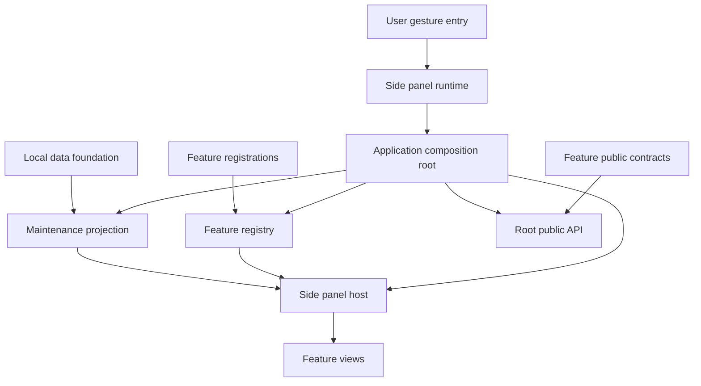
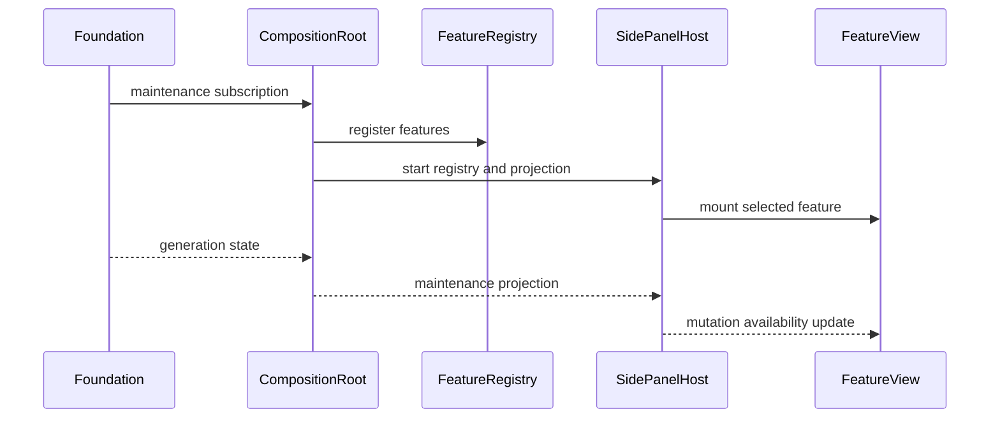

# 設計書

## 概要

application shellは、Chrome extensionのside panelをfeature-neutralなhostとして構成し、登録済みfeatureのナビゲーションとlifecycleを管理する。単一のcomposition rootがfoundationのmaintenance projectionとfeature registrationを合成し、共有runtime入口とroot公開APIの所有権を一元化する。

設計はRegistry + Composition Rootパターンを採用する。feature固有のview、状態、業務処理、永続化はshellへ持ち込まず、型付きportを介して参加させる。

### 目標
- featureが共有ファイルを変更せず独立して登録・検証できる。
- 利用可能性、失敗、maintenanceをside panel全体で一貫して表示する。
- maintenance通知の世代順序を守りmutation操作を共通抑止する。

### 非目標
- feature固有のview/state/業務規則の実装。
- Repository、write authority、maintenance lease、復元処理の実装。
- Chrome Web Store公開、他ブラウザ対応、旧major互換。

## 境界コミットメント

### このspecが所有するもの
- `ApplicationFeatureRegistration`とshell lifecycle契約。
- side panel host、ナビゲーション、共通loading/error/maintenance React viewとroot adapter。
- `ApplicationCompositionRoot`とroot公開APIの合成。
- 世代付きmaintenance状態のread-only projectionとUI mutation gate。
- 共有runtime入口、HTML host、shell統合test kit。

### 境界外
- feature固有のDOM、state、domain error、保存可否判断。
- maintenance leaseの取得・更新・owner fencing・commit直前検証。
- Storage API、Repository、復元、商品抽出、互換性判定。
- feature公開契約の内容そのもの。

### 許可する依存
- `local-data-foundation`の公開型、maintenance state購読、write authorityの公開契約。
- 下流featureのregistration moduleと`public.ts`（composition rootからのみ参照）。
- Chrome 116以降のManifest V3 Side Panel API、React 19系、React DOM、CSS。
- dependency direction: `contracts → registry/state → host → React view/root adapter → composition → runtime/root entry`。逆向きimportは禁止する。

### 再検証トリガー
- registration、mount context、availability、public API registryの型変更。
- foundationのmaintenance世代・購読契約の変更。
- root entry、side panel起動順序、`sidePanel.open()` gesture入口の変更。
- shellとfeature間のファイル所有権または依存方向の変更。

## アーキテクチャ

### Architecture Pattern & Boundary Map



- **選択パターン**: Registry + Composition Root。登録・状態・表示を分離し、compositionだけが具体featureを知る。
- **境界**: shellはfeatureの契約を呼ぶが業務データを解釈しない。foundation状態を表示へ写像するがleaseを操作しない。
- **新規component**: Registry、MaintenanceProjection、Host、CompositionRoot、PublicApiRegistryはそれぞれ一つの共有責務を持つ。

### Technology Stack

| Layer | 選択 / Version | 役割 | 注記 |
|---|---|---|---|
| 言語 | TypeScript 最新stable major | 型付き契約とruntime実装 | `any`禁止、strict mode |
| UI | React 19系 / React DOM / CSS | side panel host、共通表示、feature viewの宣言的描画 | production bundleへ同梱、JSXを使用 |
| Runtime | Chrome 116+ Manifest V3 | Side Panel APIとgesture entry | 実行コードを同梱 |
| Test | 実装開始時点の最新stable test runner + DOM環境 | unit/integration | Node互換性を導入時検証 |

## ファイル構造計画

```text
side-panel.html                         # shellが所有するside panel document
src/
├── application-shell/
│   ├── contracts.ts                   # registration、mount、availability、maintenance型
│   ├── feature-registry.ts            # 登録検証、一意性、snapshotと購読
│   ├── maintenance-projection.ts      # 世代付き状態の単調projection
│   ├── mutation-gate.ts               # UI操作種別とmaintenance抑止判定
│   ├── side-panel-host.ts             # navigationとfeature lifecycle調停
│   ├── worker-composition.ts          # feature提供worker registrationの一回限り合成
│   ├── shell-view.tsx                  # loading/error/maintenance/navigationのReact表示
│   ├── react-shell-root.tsx            # shell用React rootとcleanup adapter
│   ├── error-boundary.tsx              # component描画失敗のfeature単位隔離
│   ├── composition-root.ts            # foundation、feature、hostの一回限り合成
│   └── public-api-registry.ts          # feature public contractの型付き合成
├── runtime/
│   ├── side-panel.ts                  # side panel bootstrap入口
│   └── open-side-panel.ts             # user gesture内のSide Panel API adapter
└── index.ts                           # root公開APIの唯一のbarrel
tests/
├── application-shell/                 # component unit tests
├── contracts/                         # downstream registration contract test kit
└── integration/application-shell.test.ts # bootstrap、遷移、障害、maintenance統合
```

新規greenfieldのため、上記はすべて新規作成対象である。各下流featureの登録ファイルと`public.ts`は各feature specが所有し、このspecは変更しない。

## システムフロー



起動は冪等であり、二回目の`start`は既存instanceを返すか明示的な`already_started`結果を返す。feature切替では前viewのunmount完了後に次viewをmountする。mount失敗はhost全体を停止させない。

## 要件トレーサビリティ

| 要件 | 概要 | Components | Interfaces / Flows |
|---|---|---|---|
| 1.1–1.5 | hostとnavigation | SidePanelHost, ShellView, ReactShellRoot | RegistrySnapshot, FeatureMount |
| 2.1–2.5 | feature登録 | FeatureRegistry | ApplicationFeatureRegistration |
| 3.1–3.4 | compositionと公開API | CompositionRoot, PublicApiRegistry | start, composePublicApi |
| 4.1–4.4 | 共通状態と障害分離 | ShellView, ReactShellRoot, ShellErrorBoundary, SidePanelHost | ShellViewState |
| 5.1–5.6 | maintenance抑止 | MaintenanceProjection, MutationGate | MaintenancePresentationPort |
| 6.1–6.4 | runtimeと検証 | RuntimeAdapters, ContractTestKit | Chrome adapter, integration flow |

## Components and Interfaces

| Component | Layer | Intent | 要件 | 主な依存 | 契約 |
|---|---|---|---|---|---|
| FeatureRegistry | Core | 登録の検証・一意性・変更通知 | 2.1–2.5 | contracts P0 | Service, State |
| MaintenanceProjection | Core | 世代付き状態を単調に投影 | 5.1, 5.4–5.6 | foundation P0 | Service, State |
| MutationGate | Core | 操作分類から可否を判定 | 5.2–5.3 | projection P0 | Service |
| SidePanelHost | UI orchestration | navigationとmount lifecycle | 1.1–1.5, 2.4, 4.2–4.3 | registry P0, ReactShellRoot P0 | Service, State |
| WorkerComposition | Runtime composition | feature worker registrationを共有service workerへ合成 | 3.1, 3.3, 3.4, 6.1–6.4 | worker registrations P0 | Service |
| ShellView | UI | 共通状態をReactで安全に描画 | 4.1–4.4, 5.1–5.3 | React P0 | State |
| ReactShellRoot | UI adapter | shell stateをReact rootへ接続しcleanupする | 1.1–1.5, 4.1–4.4 | React DOM P0, Host P0 | Service |
| ShellErrorBoundary | UI | component描画失敗をfeature単位で隔離する | 4.2–4.4 | React P0 | State |
| CompositionRoot | Composition | 一度だけ全依存を合成 | 3.1, 3.3–3.4 | 全component P0 | Service |
| PublicApiRegistry | Composition | feature公開契約をrootへ合成 | 3.2, 3.4 | feature public P0 | Service |
| RuntimeAdapters | Runtime | bootstrapとgesture APIを分離 | 6.1–6.3 | Chrome P0 | Service |

### Core contracts

```typescript
type FeatureId = string & { readonly __brand: "FeatureId" };
type OperationKind = "read" | "mutation";
type Availability =
  | { readonly status: "available" }
  | { readonly status: "unavailable"; readonly reason: string };

interface FeatureMountContext {
  readonly container: HTMLElement;
  readonly operationPolicy: { isAllowed(kind: OperationKind): boolean };
  readonly reportError: (message: string) => void;
}

interface ApplicationFeatureRegistration<TPublic extends object = object> {
  readonly id: FeatureId;
  readonly navigation: { readonly label: string; readonly order: number };
  readonly publicApi: TPublic;
  getAvailability(): Availability;
  subscribeAvailability(listener: (value: Availability) => void): () => void;
  mount(context: FeatureMountContext): Promise<{ unmount(): Promise<void> }>;
}

interface ApplicationWorkerRegistration {
  readonly id: FeatureId;
  register(context: WorkerRegistrationContext): Result<() => void, RegistrationError>;
}

interface WorkerRegistrationContext {
  readonly addActionHandler: (id: FeatureId, handler: () => Promise<void>) => () => void;
  readonly reportError: (message: string) => void;
}

type RegistrationError =
  | { readonly kind: "invalid_registration"; readonly detail: string }
  | { readonly kind: "duplicate_feature_id"; readonly id: FeatureId };

interface FeatureRegistry {
  register<TPublic extends object>(feature: ApplicationFeatureRegistration<TPublic>): Result<void, RegistrationError>;
  snapshot(): readonly ApplicationFeatureRegistration[];
  subscribe(listener: () => void): () => void;
}
```

`Result<T, E>`はlocal data foundationが所有するcanonical型を利用し、shell内で再定義しない。登録順序は`navigation.order`、同値時は`id`で決定的に並べる。listener解除とview unmountは複数回呼んでも安全である。

worker registrationは同じfeature idで一意にし、共有`src/runtime/service-worker.ts`をfeatureから編集させずcomposition rootだけが登録する。登録解除は冪等で、途中失敗時は登録済みhandlerを逆順に解除する。

### MaintenanceProjection and MutationGate

```typescript
type MaintenanceCursor = {
  readonly generation: number;
  readonly revision: number;
};
type MaintenanceState =
  | { readonly status: "inactive"; readonly cursor: MaintenanceCursor }
  | { readonly status: "active"; readonly cursor: MaintenanceCursor; readonly message: string };

interface MaintenancePresentationPort {
  getSnapshot(): MaintenanceState;
  subscribe(listener: (state: MaintenanceState) => void): () => void;
}

interface MaintenanceProjection {
  accept(next: MaintenanceState): "applied" | "stale_ignored";
  getSnapshot(): MaintenanceState;
  subscribe(listener: (state: MaintenanceState) => void): () => void;
}

interface MutationGate {
  isAllowed(kind: OperationKind): boolean;
}
```

- `(generation, revision)`を辞書順の単調cursorとして比較し、現在cursor以下の通知を無視する。foundationはmaintenance開始・更新・終了ごとにrevisionを増加させるため、同一generationの正当な終了と遅延した開始通知を決定的に区別できる。generationまたはrevisionが負、あるいは有限整数でない通知は契約違反として拒否する。
- gateは`read`を常に許可し、`mutation`をactive中だけ拒否する。shellはdomain側の最終的なwrite拒否を代替しない。

### SidePanelHost and Presentation

```typescript
type ShellViewState =
  | { readonly kind: "loading" }
  | { readonly kind: "ready"; readonly selected: FeatureId | null }
  | { readonly kind: "maintenance"; readonly selected: FeatureId | null; readonly message: string }
  | { readonly kind: "error"; readonly message: string; readonly recoverable: boolean };

interface SidePanelHost {
  start(): Promise<Result<void, { readonly kind: "startup_failed"; readonly message: string }>>;
  select(id: FeatureId): Promise<Result<void, { readonly kind: "unavailable" | "mount_failed"; readonly message: string }>>;
  stop(): Promise<void>;
}
```

ShellViewと各feature viewは外部由来文字列を通常のJSX childとして描画し、`dangerouslySetInnerHTML`、`innerHTML`、inline event handlerを使用しない。ReactShellRootはside panel host containerへ`createRoot`し、停止時に`root.unmount()`を一度だけ呼ぶ。`FeatureMountContext`と`ApplicationFeatureRegistration.mount/unmount`の公開契約は変更せず、各feature registrationのUI adapterが受け取ったcontainerへReact rootを作成・破棄する。選択中featureが不可になった場合はunmountし、次の利用可能featureを決定順で選ぶ。該当がなければ理由付きempty stateを表示する。

### CompositionRoot and PublicApiRegistry

```typescript
interface ApplicationCompositionRoot<TRootApi extends object> {
  start(): Promise<Result<{ readonly api: TRootApi }, { readonly kind: "missing_dependency" | "startup_failed"; readonly message: string }>>;
}

interface PublicApiRegistry<TEntries extends Record<string, object>> {
  compose(entries: TEntries): Readonly<TEntries>;
}
```

CompositionRootだけが具体的なfoundation adapterとfeature registrationをimportする。起動途中に失敗した場合、購読解除とmount済みviewのunmountを逆順に行う。root `src/index.ts`は合成済み型付き契約だけをexportする。

## エラー処理

- 不正・重複登録: 該当featureを隔離し型付きdiagnosticを返す。
- 必須foundation初期化失敗: hostをerror stateにしてfeatureをmountしない。
- feature mount/unmount失敗: 安全なテキストmessageを表示し、他featureのnavigationを維持する。
- stale maintenance通知: stateを変更せず診断hookへ記録する。
- runtime終了: unsubscribe/unmountをbest-effortで全件実行し、複数失敗を一つの失敗で隠さない。

## テスト戦略

### Unit Tests
- FeatureRegistryの不正値、重複、決定的順序、購読解除（2.1–2.4）。
- MaintenanceProjectionの世代前進・stale拒否・終了反映（5.1, 5.4–5.5）。
- MutationGateのread維持とmutation抑止（5.2–5.3）。
- ShellViewが外部文字列を通常のJSX textとして描画し、危険なHTML APIを使用しないこと（4.4）。
- ReactShellRootとfeature adapterが再mount、切替、停止時にReact rootと購読を確実にcleanupすること（1.2–1.5, 6.4）。

### Integration Tests
- compositionが一回だけ実行され、root APIがfeature単位で合成される（3.1–3.4）。
- feature切替でunmount→mount順序となり同時表示が発生しない（1.2–1.5）。
- mount失敗後も別featureへ遷移できる（4.2–4.3）。
- maintenance通知が全navigationへ反映され、readは維持されmutationが無効になる（5.1–5.5）。

### E2E / Runtime
- Chrome 116+相当のMV3 fixtureでside panel bootstrapとnavigationを検証する（6.1）。
- user gesture handler内でSide Panel APIが同期呼出しされることをadapter spyで検証する（6.2）。
- package outputにremote script、inline script、dynamic evaluationがないことを検査する（6.3）。
- production bundleへReact/React DOMが同梱され、MV3の`script-src 'self'`でside panelが起動することを検査する（6.1, 6.3）。
- contract test kitで模擬featureの登録、availability変更、失敗、cleanupを決定的に観測する（6.4）。

## セキュリティ考慮事項

- shellはStorage APIやページDOMを直接読まない。
- 表示文字列は通常のJSX childとして扱い、`dangerouslySetInnerHTML`、`innerHTML`、inline handlerを使用しない。
- React、React DOMと全UI codeはproduction bundleへ同梱し、CDN、remote module、runtime JSX変換、動的評価を使用しない。
- feature registrationは信頼済み同梱moduleのみからcomposition rootが受け付け、runtime messageから任意登録しない。
