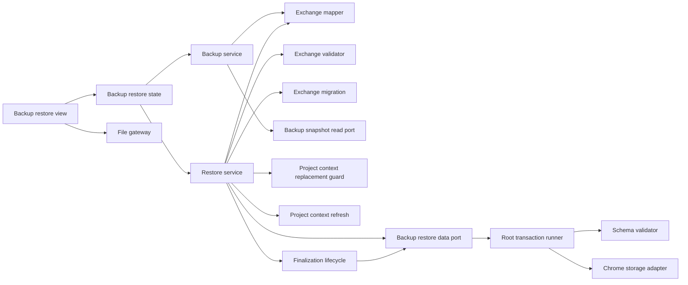
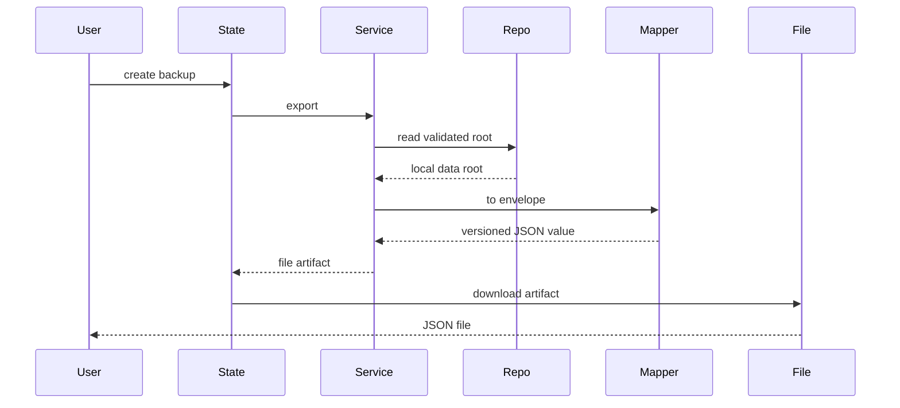
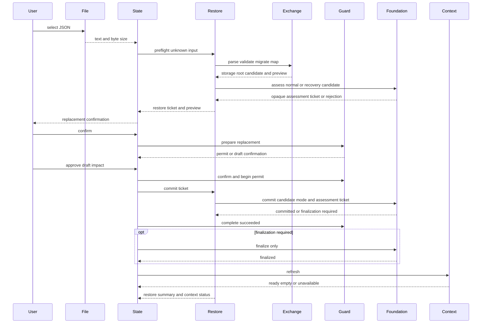

# Design Document

## Overview

本機能は、ローカルファーストのChrome拡張利用者へ、全プロジェクト、候補パーツ、現在構成を一つのバージョン付きJSONへ退避し、安全に一括復元する機能を提供する。操作面は`settings-screen`が所有する設定画面の区画へ、`BackupRestoreSectionMount`を介して埋め込む。ブラウザ標準のファイルAPIでユーザー操作による入出力を行う。

設計は交換形式、検証・変換、復元調整、UI状態を分離する。永続化モデルを直接公開せず、入力を`unknown`として検証した後に現行`LocalDataRoot`へ変換し、Foundationのcommit point付き単一置換契約で保存する。root write前の失敗では復元前データを維持し、write後のcleanup失敗は復元成功を取り消さずfinalize-only retryへ分離する。

### Goals
- 保存実装から独立した版付き交換形式で全データを往復可能にする
- 不正形式、非対応版、参照不整合、容量超過を永続状態変更前に拒否する
- 確認済みデータだけを一回のroot writeで置換し、commit前失敗時は既存データを保持する
- バックアップの限界、置換影響、処理結果を設定画面内の区画で明示する
- バックアップ内部を公開せず、任意containerへ安全にmount・cleanupできるsection契約を提供する

### Non-Goals
- 自動、定期、差分、クラウド、同期、圧縮バックアップ
- 複数バックアップのマージ、CSV入出力、商品カタログ配布
- 候補や現在構成の業務規則、互換性判定、ブラウザ外の保管
- 設定画面、常設ナビゲーション、言語区画、shell compositionの所有

## Boundary Commitments

### This Spec Owns
- `BackupEnvelope`交換形式、形式版、旧交換形式から現行形式への移行
- 全保存データと交換データ間の変換、交換形式検証、復元プレビュー
- バックアップ生成と検証済みルートの復元調整
- 正常root置換と破損・未対応root回復の経路選択、およびcommit pointまでの調整
- catalog全体置換前のproject-context guard lifecycleと、置換成功後のcontext refresh・refresh-only retry
- 設定画面内へ埋め込む区画のファイル選択、確認、処理状態、警告、結果表示
- `BackupRestoreSectionMount`とfactory、およびmountされたReact rootのcleanup
- Foundationのcommit point付きbackup portを用いた復元commitとfinalize-only retryの調整
- Foundationのbackup専用portを用いた正常置換・異常回復の調整
- Foundationが返すcommit pointを保持し、置換済みcleanupだけを再試行するfinalization lifecycle

### Out of Boundary
- `Project`、`CandidatePart`、`CurrentBuild`の所有権と業務規則
- Foundationの保存スキーマ、通常CRUD、Chrome Storage APIアダプター
- ファイルの保存先、保持期間、自動化、暗号化、クラウド転送
- 復元時のマージ、部分選択、互換性結果の再計算
- settings feature registration、設定layout、navigation metadata、shell host lifecycle
- feature-owned draftの内容・保存・破棄判断、project-contextのguard registryとselection fallback
- Foundationのraw root分類、fingerprint、RecoveryControl、置換・回復原子性、commit/finalization token生成
- 破損・未対応rootを検出したside panelのdegraded startupと`recovery`操作分類（application-shell owner）

### Allowed Dependencies
- Foundationの`LocalDataRoot`、`Result`、エラー契約。export用の`BackupSnapshotReadPort`と、commit pointを判別する`BackupRestoreDataPort`
- runtime-schema-validationのconfigured Zod Mini入口、strict plain object・JSON safety primitive、owner error/path変換helper。Zod packageや他feature schemaをdeep importしない
- ui-messagesの公開`MessageKey`・`MessageResolver`・`useMessages()`。利用者向け案内とerror policyは日本語・英語カタログで完全性を保ち、言語別カタログ実装へdeep importしない
- project-contextの`ProjectContextReplacementGuardPort`と`ProjectContextCommandPort.refresh`。guard registry、draft、selection stateへdeep importしない
- Candidate managementとCurrent build managementが定義する保存済みデータ契約
- `settings-screen`が提供する空の区画containerとsection lifecycle
- 信頼済みextension page
- Chrome 116以降のFile、Blob、URL、TextEncoder、React 19系/React DOM
- application shellの`FeatureMountContext`、`FeatureMountHandle`、operation policy
- application shellの`recovery` operation kindと、`corrupt-data | unsupported-version`時にもsettingsをmountするdegraded startup契約

依存方向は`Domain contracts → Configured runtime-schema primitives → Owner-local exchange schema and migration → Mapper → Foundation data port（参照・置換・保守）→ Backup and Restore services → State → View and File gateway → Section mount adapter`とし、右側は左側だけへ依存する。File gatewayはFoundation portへ直接アクセスせず、settingsは公開section adapterより内側へ依存しない。

### Revalidation Triggers
- `LocalDataRoot`、カテゴリ、候補所属、現在構成参照、read-only root queryまたはRepositoryエラーの形状変更
- `BackupRestoreDataPort`、正常/回復assessment、commit outcome、異常root分類の形状変更
- `BackupRestoreCommitOutcome`、opaque finalization ticket、finalize-only retryの形状変更
- `ProjectContextReplacementGuardPort`のpermit lifecycle、`ProjectContextCommandPort.refresh`、snapshotのready/empty/unavailable規則の変更
- 交換形式の追加・削除、形式版の変更、旧版サポート範囲の変更
- 保存が単一キー一括書込でなくなる変更、容量上限または書込原子性の変更
- `BackupRestoreSectionMount`、`FeatureMountContext`、settings-owned host lifecycle、File API前提、信頼済みコンテキスト設定の変更
- application shellのdegraded startup、`recovery`操作可否、正常snapshot復帰通知の変更
- ui-messagesの`MessageKey`、placeholder、日英catalog parity、言語切替時のProvider契約の変更

## Architecture

### Existing Architecture Analysis

Foundationは`LocalDataRoot`を単一キーで保存し、読取・保存時にスキーマと参照を検証する。Candidate managementはプロジェクトと候補、Current build managementは構成参照と数量を所有し、どちらもRepositoryを介して保存する。本仕様はこれらの公開保存値だけを入力とし、業務サービスやStorage APIへ直接依存しない。

Foundationは`BackupRestoreDataPort`から、正常rootと破損/未対応rootのassessment、commit pointを判別する置換、opaque ticketによるfinalize-only retryを用途限定で提供する。内部では同じ`WriteAuthority`とWeb Lockへ委譲され、本機能はraw root、Storage、lock、fence、通常CRUDへ到達しない。project-contextはcatalog全体置換用permitとsuccess/failure completion、置換後refreshを能力別portで提供する。本機能は両上流契約を順序付けるが、guard registry、draft内容、selection fallback、原子的writeを再実装しない。

破損・未対応rootでは通常のmaintenance snapshotを構築できない。application shellはこの二つのtyped failureだけを`recovery-required`へ写像し、通常mutationをfail closedで抑止したままsettingsをmountする。backup-restoreのcommitは`recovery` operationとして許可され、その他のstartup failureでは従来どおりglobal startup errorに留まる。Foundationから最初の正常snapshotを受信した時点でshellは通常projectionへ復帰する。

### Architecture Pattern & Boundary Map



- **Selected pattern**: 機能サービスとポート・アダプター。交換形式の純粋処理とブラウザI/Oを分離する。
- **Existing patterns preserved**: `unknown`入力検証、判別可能な`Result`、Repository経由の保存、UI stateとDOM viewの分離。
- **New components rationale**: Exchange componentsは保存版との分離に、RestoreServiceは交換層検証とFoundation置換・保守呼び出しの順序調整に、FileGatewayはDOM固有処理の隔離に必要である。置換・保守・単一writeの原子性はFoundationが所有し新設しない。
- **Steering compliance**: MV3同梱コード、最小権限、10MB上限、架空fixture、service worker寿命への非依存を維持する。

### Technology Stack

| Layer | Choice / Version | Role in Feature | Notes |
|---|---|---|---|
| Language | TypeScript 7.x strict | 交換形式、結果、状態契約 | `any`禁止、入力は`unknown` |
| Runtime validation | configured Zod Mini 4.4.3 | 交換形式のstrict shape、JSON safety、型推論 | canonical入口だけを利用し、Zod issueを公開しない |
| UI | React 19系 / React DOM / CSS | 管理操作、確認、案内 | 既存mount契約を維持 |
| Messages | ui-messages public resolver / 日英catalog | 案内、操作、分類済みerror、再試行方針 | `useMessages()`だけを利用しcatalog parityを維持 |
| File I/O | File、Blob、URL、TextEncoder | 読取、生成、UTF-8サイズ | Chrome 116標準、新規依存なし |
| Data | `BackupSnapshotReadPort` / `BackupRestoreDataPort` | export参照、commit point付き正常置換・異常root回復 | 通常CRUD・Storage API・fence直接利用なし |
| Context | project-context public ports | 置換前guard、成功後refresh | registry・draft・preference非公開 |
| Test | Node test runner / jsdom / Playwright | 純粋契約、統合、UI検証 | 架空データのみ |

## File Structure Plan

```text
src/features/backup-restore/contracts.ts           # Envelope、preview、commit outcome、finalization、error契約
src/features/backup-restore/public.ts              # BackupRestoreSectionMount、factory、最小dependency inputの唯一の公開入口
src/features/backup-restore/section-mount.ts       # section依存組立、mount handle、冪等cleanup
src/features/backup-restore/exchange.ts            # configured schema primitiveを使うowner-local交換形式検証、形式移行、LocalDataRoot変換
src/features/backup-restore/service.ts             # バックアップ生成と復元preflight・commit・finalize
src/features/backup-restore/context-lifecycle.ts   # replacement guardとpost-commit refreshの順序調整
src/features/backup-restore/file-gateway.ts        # File読取とBlobダウンロード
src/features/backup-restore/state.ts               # 選択、検証、確認、commit、finalize-only、refresh-only状態
src/features/backup-restore/view.tsx                # 管理UI、警告、preview、確認のReact component
src/features/backup-restore/react-root.tsx          # FeatureMountContextとReact rootの接続・cleanup
src/features/backup-restore/styles.css             # 管理セクションと状態表現
src/ui-messages/catalog/ja/backup.ts               # 既存backup keyに回復・finalization・refresh・再試行案内を追加
src/ui-messages/catalog/en/backup.ts               # 日本語と同一key・placeholderの英語メッセージを追加
tests/fixtures/backup.ts                           # 架空の現行・旧版・不正Envelope
tests/features/backup-restore/exchange.test.ts     # 形式検証、移行、往復、参照検証
tests/features/backup-restore/service.test.ts      # export、preflight、commit、失敗不変性
tests/features/backup-restore/file-gateway.test.ts # UTF-8読取、ファイル名、Blob生成
tests/features/backup-restore/state.test.ts        # 状態遷移、確認、重複抑止、再試行
tests/features/backup-restore/view.test.tsx        # 区画の案内、preview、エラー、操作可否
tests/features/backup-restore/section-mount.test.tsx # 公開mount、失敗、cleanup、二重cleanup
tests/features/backup-restore/integration.test.ts  # 全データ往復とRepository回帰
tests/features/backup-restore/backup-restore-flow.integration.test.tsx # sectionからの復元全体flow
tests/features/backup-restore/recovery.integration.test.ts # degraded startupからの明示的回復とfinalize-only retry
tests/features/backup-restore/project-context-lifecycle.test.ts # guard、finalization、refresh-only retry
tests/ui-messages/catalog-parity.test.ts            # backup日英key・placeholder parity
e2e/backup-restore.spec.ts                         # settings経由のexport→改変→復元→再起動
```

新規作成は`context-lifecycle.ts`、`recovery.integration.test.ts`、`project-context-lifecycle.test.ts`の3ファイルである。既存の`contracts.ts`、`service.ts`、`state.ts`、`view.tsx`、`section-mount.ts`、`public.ts`、日英の`backup.ts`メッセージカタログと対応testを変更する。`exchange.ts`、`file-gateway.ts`、`react-root.tsx`、`styles.css`は契約追従が必要な場合だけ局所変更し、交換形式やFile APIの責務を広げない。削除対象はない。

`project-context`の内部ロジックは変更せず、公開された`ProjectContextReplacementGuardPort`と`ProjectContextCommandPort`だけを消費する。実装順は、(1) runtime schema同等性gate、(2) Foundationのassessment ticket付き`BackupRestoreDataPort`とproject-context public ports、(3) application-shell ownerによる`OperationKind`・`recovery-required`のcontract/gate、(4) 本specのfeature実装、(5) application-shell ownerによるproduction wiringとする。手順3は型・gate契約だけを先行し、手順5のcompositionは本specの完成後に行うため、roadmap上の循環依存を作らない。

`src/application-shell/side-panel-contributions.ts`と`application-composition.ts`のproduction wiring変更はapplication-shell ownerのdownstream taskとし、本specのfeature file ownershipへ含めない。settings内部へは完成済みsection mountだけを注入し、read/data/context capabilityを渡さない。

## System Flows

### バックアップ生成



### 復元



`RestoreTicket`はcandidate、preview、`normal | recovery` mode、Foundation発行のopaque `BackupRestoreAssessmentTicket`だけを非永続stateへ保持する。preflightは正常assessmentを先に試し、current rootが`corrupt-data | unsupported-version`の場合だけ同じcandidateを`assessRecovery`へ渡す。candidate拒否をcurrent anomalyと混同しない。commit前にreplacement guardをprepare/confirmし、`begin`成功後だけFoundation commitを開始する。guard拒否・取消・staleではticketと現在選択を保持する。

Foundationはcommit開始時に同じ固定名Web Lock内でassessment ticketのroot revisionまたはraw fingerprint、candidate digest、modeを再照合する。preflight後からこの線形化点までに通常mutationが確定していれば`stale-assessment`としてwrite前に拒否し、その変更を上書きしない。照合成功と同じ排他区間でpersistent maintenance/recovery controlをactiveにし、以後の通常mutationはroot writeとcleanupが完了するまでFoundationで拒否する。shell gateはこの状態のUI projectionであり、排他の認可根拠にはしない。

Foundationはmode別の再assessment、root write、cleanupを一つのcommit protocolとして実行し、root write前の失敗を`Result`のerror、root write後を`committed`または`committed-finalization-required`として返す。後者のopaque ticketはcleanupだけを再開でき、root writeを実行できない。両committed outcomeでguardを`complete("succeeded")`し、finalization完了後にだけcontext `refresh()`を呼ぶ。finalizationまたはrefresh失敗は復元成功を取り消さず、それぞれ`restored-finalization-required`、`restored-context-unavailable`へ移す。再試行は対応する`finalize()`または`refresh()`だけを呼び、Foundation commitを再実行しない。

## Requirements Traceability

| Requirement | Summary | Components | Interfaces | Flows |
|---|---|---|---|---|
| 1.1, 1.2, 1.4, 1.6 | 全データEnvelope生成 | BackupService、ExchangeMapper | export | バックアップ生成 |
| 1.3 | ファイル名 | FileGateway | download | バックアップ生成 |
| 1.5 | 読取失敗 | BackupService、BackupRestoreState | BackupError | バックアップ生成 |
| 2.1, 2.2, 2.3 | 交換契約 | ExchangeValidator、ExchangeMapper | BackupEnvelope | 両フロー |
| 2.4, 2.5 | 形式版と移行 | ExchangeMigration | migrate | 復元 |
| 3.1, 3.2, 3.3, 3.5 | 事前検証 | RestoreService、ExchangeValidator | preflight | 復元 |
| 3.4 | 容量拒否 | RestoreService、BackupRestoreDataPort | assessReplacement / assessRecovery | 復元 |
| 3.6 | preview | RestoreService、BackupRestoreView | RestorePreview | 復元 |
| 4.1, 4.2 | 置換確認と取消時保持 | BackupRestoreState、BackupRestoreView | RestoreTicket | 復元 |
| 4.3, 4.5, 4.6 | 全体置換と共通操作ロック | RestoreService、BackupRestoreDataPort、application shell | commit / finalize-only retry | 復元 |
| 4.4 | 成功反映 | BackupRestoreState、BackupRestoreSectionMount | RestoreSummary | 復元 |
| 4.7, 4.8 | 未保存編集保護 | RestoreContextLifecycle、BackupRestoreState | ProjectContextReplacementGuardPort | guarded restore |
| 5.1, 5.2, 5.3, 5.4 | 原子的失敗回復 | RestoreService、BackupRestoreDataPort | not-committed / committed outcome | 復元 |
| 5.5 | ticket保持と再試行 | BackupRestoreState | retryRestore / finalize | 復元 |
| 5.6, 5.7 | 破損・未対応rootからの明示的回復 | RestoreService、BackupRestoreDataPort、BackupRestoreView、application shell | degraded startup / recovery commit | recovery restore |
| 6.1, 6.2, 6.3, 6.4 | 設定内の区画と案内 | BackupRestoreView、BackupRestoreState、BackupRestoreSectionMount | ViewState、FeatureMountContext | 両フロー |
| 6.5 | 値を露出しない診断 | 全検証・サービス・View | 分類済みerror code | 両フロー |
| 6.6 | 非永続ドラフト | BackupRestoreState | transient state | 復元 |
| 6.7 | 独立navigationを要求しない埋め込み | BackupRestoreSectionMount | mount | Settings mount |
| 6.8 | context unavailable時の到達性 | BackupRestoreSectionMount、BackupRestoreView、application shell | recovery-required mount | Settings mount |
| 6.9, 6.10, 6.11 | 置換後refreshと単独再試行 | RestoreContextLifecycle、BackupRestoreState、BackupRestoreView | ProjectContextCommandPort.refresh | post-restore refresh |

## Components and Interfaces

| Component | Domain/Layer | Intent | Req Coverage | Key Dependencies | Contracts |
|---|---|---|---|---|---|
| ExchangeValidator | Exchange | unknownからEnvelopeを交換形式専用規則で検証 | 2.1–3.3, 6.5 | Exchange contracts P0 | Service |
| ExchangeMigration | Exchange | 対応旧形式を現行へ変換 | 2.4, 2.5, 5.3 | ExchangeValidator P0 | Service |
| ExchangeMapper | Exchange | Envelopeと保存ルートを相互変換 | 1.1–2.3 | DomainModel P0 | Service |
| BackupService | Feature | 検証済みデータをfile artifact化 | 1.1–1.6 | BackupSnapshotReadPort P0、Mapper P0 | Service |
| RestoreService | Feature | preflightと正常/回復commitを調整 | 3.1–5.7 | Exchange P0、BackupRestoreDataPort P0 | Service |
| RestoreContextLifecycle | Feature | replacement guardとpost-commit refreshを順序付け | 4.7, 4.8, 6.9–6.11 | project-context ports P0 | Service, State |
| BackupRestoreDataPort | Foundation port | commit point付き置換とfinalize-only retryだけを公開 | 3.1–5.7 | Foundation authority P0 | Service |
| BackupSnapshotReadPort | Persistence (read-only) | export用の検証済みsnapshot参照 | 1.1, 1.4, 1.5 | FoundationScopedDataPort P0 | Service |
| FileGateway | UI adapter | extension pageのファイルI/O | 1.3, 3.1 | Web API P0 | Service |
| BackupRestoreState | UI state | ticket、guard、commit、finalize-only・refresh-only retry状態 | 1.5, 3.5–6.11 | Services P0 | State |
| BackupRestoreView | UI | 操作、案内、preview、guard確認、回復・refresh状態 | 3.2, 3.6, 4.1–6.11 | State P0 | State |
| BackupRestoreSectionMount | UI adapter | context状態に依存せずsection lifecycleを提供 | 1.1–6.11 | FeatureMountContext P0、BackupRestoreView P0 | Service, State |

### Exchange Layer

#### ExchangeValidator and Migration

```typescript
interface ExchangeValidator {
  validate(input: unknown): Result<CurrentBackupEnvelope, ExchangeValidationError>;
}

interface ExchangeMigration {
  toCurrent(input: unknown): Result<CurrentBackupEnvelope, ExchangeVersionError | ExchangeValidationError>;
}
```

- `ExchangeValidationError`は`path`と`code`だけを公開し、問題値を含めない。
- JSON object自身のプロパティだけを読み、未知必須版、危険な余剰内容、非JSON値を拒否する。
- 旧版移行は連続する純粋関数とし、各段階を再検証する。将来版は変換しない。

#### ExchangeMapper

```typescript
interface ExchangeMapper {
  fromRoot(root: LocalDataRoot, createdAt: UtcIsoDateTime): CurrentBackupEnvelope;
  toRoot(envelope: CurrentBackupEnvelope): Result<LocalDataRoot, ExchangeMappingError>;
}
```

MapperはID、日時、確認値、出典、正規化属性、候補所属、構成参照を保持する。保存`schemaVersion`は交換データから信頼せず、現行保存スキーマ版を用いて保存root候補を構築する。この候補は`unknown`として`BackupRestoreDataPort`へ渡し、最終的なschema検証・参照整合性・容量判定はFoundationが行う（feature側でSchemaValidatorや容量判定を重複実行しない）。

### Feature Layer

#### BackupService

```typescript
interface BackupService {
  create(): Promise<Result<BackupArtifact, BackupError>>;
}

interface BackupArtifact {
  readonly filename: string;
  readonly mimeType: "application/json";
  readonly json: string;
  readonly byteLength: number;
}
```

`BackupSnapshotReadPort`から検証済みルートを読み、現在時刻でEnvelopeを作り、決定的なJSONへ直列化する。読取、変換、直列化の失敗時はartifactを返さない。

#### RestoreService

```typescript
interface RestoreService {
  preflight(input: RestoreInput): Promise<Result<RestoreTicket, RestoreError>>;
  commit(ticket: RestoreTicket): Promise<Result<RestoreCommitOutcome, RestoreError>>;
  finalize(ticket: RestoreFinalizationTicket): Promise<Result<RestoreSummary, RestoreFinalizationError>>;
}

type RestoreCommitOutcome =
  | { readonly kind: "committed"; readonly summary: RestoreSummary }
  | {
      readonly kind: "committed-finalization-required";
      readonly summary: RestoreSummary;
      readonly finalization: RestoreFinalizationTicket;
    };

interface RestoreFinalizationTicket {
  readonly id: string;
}

interface RestoreTicket {
  readonly candidate: unknown;
  readonly preview: RestorePreview;
  readonly mode: "normal" | "recovery";
  readonly assessment: BackupRestoreAssessmentTicket;
}

interface RestoreInput {
  readonly text: string;
  readonly byteLength: number;
}
```

`preflight`は交換層の検証後、正常assessmentを試す。current anomalyだけを表す`corrupt-data | unsupported-version`ではrecovery assessmentへ切り替え、candidate rejection、quota、storage failureでは切り替えない。assessmentの必要bytesとcurrent anomaly分類だけをpreview/ticketへ写し、fingerprint、assessment、cursor、fenceは保持しない。

`commit`はcandidateと期待modeをFoundationへ渡す。Foundationはmode別protocolを実行し、root write前の失敗だけをerrorとして返す。root write後は必ずcommitted outcomeとなり、cleanup未完了時は値やfenceを含まないopaque `RestoreFinalizationTicket`へ写像する。`finalize`はこのticketでcleanupと通常query確認だけを再試行し、root write、guard prepare、利用者の置換確認を繰り返さない。失敗時は元のrestore ticketまたはfinalization ticketを状態に応じて保持する。

#### RestoreContextLifecycle

```typescript
interface RestoreContextLifecycle {
  prepare(): Promise<Result<RestoreGuardPreparation, RestoreContextError>>;
  confirm(confirmationId: string): Promise<Result<RestoreGuardPermit, RestoreContextError>>;
  cancel(confirmationId: string): Result<void, RestoreContextError>;
  begin(permitId: string): Result<void, RestoreContextError>;
  complete(permitId: string, outcome: "succeeded" | "failed" | "cancelled"): Promise<Result<void, RestoreContextError>>;
  refresh(): Promise<Result<ProjectContextSnapshot, RestoreContextError>>;
}
```

これはproject-context public portsを順序付けるowner-local adapterであり、独自registryを持たない。guard permitの`begin`後だけRestoreServiceを呼ぶ。commit前失敗・取消では対応outcomeでpermitを閉じ、ticketとselectionを保持する。committed outcomeでは`succeeded` completionを一度だけ呼ぶ。上流`complete`は通知前にpermitをterminal closedへ遷移させるため、notification失敗でも排他状態は残らない。finalizationが必要なら先にfinalize-only状態へ移り、完了後にだけrefreshする。completion/notification失敗とrefresh失敗はいずれも成功済みrootをrollbackせず、安全な診断とpost-commit stateへ写像する。retryはpermitまたはFoundation commitを再使用しない。

### Persistence Layer

#### Foundation contracts consumed

exportでは通常feature向けportから切り出したread-only viewを、restoreではFoundationが公開するbackup専用契約を消費する。compositionだけが元のportを保持し、feature内部へ通常mutation能力を渡さない。

```typescript
interface BackupSnapshotReadPort {
  query<T>(query: RootQuery<T>): Promise<Result<T, FoundationError>>;
}

interface BackupRestoreDataPort {
  assessReplacement(input: unknown): Promise<Result<BackupRestoreAssessment, FoundationError>>;
  assessRecovery(candidate: unknown): Promise<Result<BackupRestoreAssessment, RecoveryAssessmentError | FoundationError>>;
  commit(command: BackupRestoreCommitCommand): Promise<Result<BackupRestoreCommitOutcome, FoundationError>>;
  finalize(ticket: BackupRestoreFinalizationTicket): Promise<Result<ReplacementReceipt, FoundationError>>;
}
```

`BackupRestoreAssessment`はpreview用のmode・必要bytes・current anomalyとopaque ticketだけを公開し、root revision、raw fingerprint、candidate digest、cursorを公開しない。`BackupRestoreCommitCommand`はcandidate、expected mode、assessment ticketを必須とする。`BackupRestoreCommitOutcome`は`committed | committed-finalization-required`の判別共用体であり、Foundationだけがroot writeのcommit pointを判定する。finalization ticketは対応するcommitとcleanup世代へ結び付くopaque値で、`finalize`はrootを再置換できない。このportはquery、mutate、raw root、Storage、lock、Repository、fence、authority factoryを公開しない。正常/回復の両経路は同じWeb Lock、validation、capacity、assessment ticket再照合、owner/generation再検証、単一root writeを使用する。

composition ownerは`FoundationScopedDataPort.query`だけをfrozen `BackupSnapshotReadPort`へ狭め、`BackupRestoreDataPort`とproject-contextのreplacement/command capabilityとともに本機能のsection factoryへ供給する。settingsには`BackupRestoreSectionMount`だけを渡し、read/data/context port、finalization ticket、stateを露出しない。

### UI Layer

#### FileGateway

```typescript
interface FileGateway {
  read(file: File): Promise<Result<RestoreInput, FileError>>;
  download(artifact: BackupArtifact): Result<void, FileError>;
}
```

JSONファイルを一つだけ受け、サイズを読取前に確認する。ダウンロード用object URLは操作後に破棄する。内容解釈やRepositoryアクセスはしない。

#### BackupRestoreState and View

stateは`idle`、`exporting`、`validating`、`awaiting-replacement-confirmation`、`awaiting-draft-confirmation`、`restoring`、`restored-finalization-required`、`refreshing-context`、`succeeded`、`restored-context-unavailable`、`failed`の判別共用体とする。取消、guard拒否、commit前失敗ではrestore ticketと有効previewを保持する。commit後cleanup失敗ではsummaryとfinalization ticketだけを保持し、復元の再実行操作を公開しない。`restored-finalization-required`はfinalize-only、`restored-context-unavailable`はrefresh-onlyへretry actionを固定する。ファイル再選択とsection unmountでだけ未commit ticketを破棄する。

失敗状態は表示codeだけでなく`retryPolicy`を保持する。`retryable`は同じartifact生成または未commit ticketによる再試行、`action-required`は別file選択・未保存編集の保存/破棄・容量確保など利用者操作後の再試行、`unsupported`は同一入力の再実行を許可しない。commit後はこの一般policyへ戻さず、finalize-onlyまたはrefresh-onlyの専用actionを維持する。

viewはバックアップと復元をReact componentの別領域として表示し、消失リスク、自動保存・同期なし、置換確認、件数summary、分類済みエラーと再試行方針を`ui-messages` public resolverの`MessageKey`へ写像する。日本語・英語で同一keyとplaceholderを保ち、`useMessages()`で解決した固定安全文言を通常のJSX childとして描画する。内部validation path、商品値、完全URL、fingerprintは表示しない。settingsの`h3`区画見出し配下へ埋め込まれるexport／restore見出しは`h4`とし、owner内部で見出し階層を維持する。

#### BackupRestoreSectionMount

```typescript
export interface BackupRestoreSectionMount {
  mount(context: FeatureMountContext): Promise<FeatureMountHandle>;
}

export interface BackupRestoreSectionDependencies {
  readonly read: BackupSnapshotReadPort;
  readonly restore: BackupRestoreDataPort;
  readonly replacementGuard: ProjectContextReplacementGuardPort;
  readonly projectContext: Pick<ProjectContextCommandPort, "refresh">;
  readonly state?: BackupRestoreState;
}

export function createBackupRestoreSectionMount(
  dependencies: BackupRestoreSectionDependencies,
): BackupRestoreSectionMount;
```

factoryは`BackupService`、`RestoreService`、`RestoreContextLifecycle`、`BackupRestoreState`、`FileGateway`を構成し、`context.container`へReact rootを一つだけmountする。project-context snapshotまたは保存rootがunavailableでもmountを拒否せず、file選択・preflight・recovery commitを利用可能にする。`state?`はcontract test用注入seamであり、productionはmountごとに新しいidle stateを生成する。`context.operationPolicy`ではrestore commitを`recovery`として判定し、通常maintenance中は拒否、`recovery-required`では許可する。section表示、backup export、file選択、preflightはread-onlyとして維持する。公開入口はこのinterface、factory、factory入力型だけとし、read/data/context port、React component、service、state accessorをsettingsへ公開しない。既存のrollback、冪等cleanup、再試行可能なunmount ownershipを維持する。

## Data Models

```typescript
interface CurrentBackupEnvelope {
  readonly product: "pc-build-planner";
  readonly formatVersion: 1;
  readonly createdAt: UtcIsoDateTime;
  readonly data: BackupDataV1;
}

interface BackupDataV1 {
  readonly projects: readonly BackupProject[];
  readonly parts: readonly BackupCandidatePart[];
  readonly currentBuilds: readonly BackupCurrentBuild[];
}

interface RestorePreview {
  readonly createdAt: UtcIsoDateTime;
  readonly formatVersion: number;
  readonly projectCount: number;
  readonly partCount: number;
  readonly currentBuildCount: number;
  readonly estimatedBytes: number;
  readonly mode: "normal" | "recovery";
  readonly currentAnomaly?: "corrupt-data" | "unsupported-version";
}

type RestoreCompletion =
  | { readonly kind: "restored"; readonly summary: RestoreSummary; readonly context: "ready" | "empty" }
  | {
      readonly kind: "restored-finalization-required";
      readonly summary: RestoreSummary;
      readonly finalization: RestoreFinalizationTicket;
    }
  | { readonly kind: "restored-context-unavailable"; readonly summary: RestoreSummary };

type RetryPolicy =
  | { readonly kind: "retryable"; readonly action: "retry-export" | "retry-restore" }
  | {
      readonly kind: "action-required";
      readonly action: "select-another-file" | "resolve-draft" | "free-storage";
    }
  | { readonly kind: "unsupported" };
```

交換エンティティはFoundationの値をJSON互換の読み取り専用フィールドへ写像するが、保存ルートの`schemaVersion`を含めない。配列内IDは一意、候補の`projectId`は存在するProject、構成の`projectId`と各`partId`は同じProject内を参照し、数量は正整数とする。互換性結果、生HTML、画像バイナリ、実行可能値は契約外である。

## Error Handling

- `FileError`: 未選択、複数選択、読取不能、事前サイズ超過。
- `ExchangeError`: JSON解析、必須構造、非対応版、path付き値・参照問題。入力値は表示しない。
- `RestoreError`: 上記に加え`quota`、`storage`、`candidate-invalid`、`current-corrupt`、`current-unsupported`、`maintenance-active`、`recovery-active`、`stale-assessment`、`stale-recovery-state`、`stale-ticket`を判別する。current anomalyとcandidate rejectionを別fieldで保持し、値やfingerprintは表示しない。
- `RestoreContextError`: `guard-failed`、`confirmation-stale`、`permit-stale`、`context-unavailable`、`refresh-failed`を判別する。guard失敗はcommit前、refresh失敗はcommit後としてstate遷移を分ける。
- `RestoreFinalizationError`: root write済みであることを保持したまま`cleanup-unavailable | finalization-stale`を判別し、同じopaque ticketによるfinalize-only retryだけを許可する。
- `BackupError`: `corrupt-current-data`、`unsupported-current-data`、`storage`、`serialization`を判別する。
- commit前失敗ではticketを保持した`failed`へ遷移する。Foundationがcommitted outcomeを返した後は復元失敗へ戻さず、cleanup未完了、guard notification失敗、refresh失敗をsummary付きのpost-commit stateへ分離する。

commit前のerror codeと許可actionは次の単一対応表で固定する。stateとViewは個別判定を重複せず、このpolicyを介して理由と再試行可能性を表示する。

| Error category | Retry policy | Allowed action |
|---|---|---|
| 一時的なread・storage・lock失敗、stale assessment | `retryable` | `retry-export` または保持中ticketの`retry-restore` |
| quota超過 | `action-required` | 容量確保後に保持中ticketを再試行 |
| guard拒否・未保存draft | `action-required` | 保存または破棄後に新しいpermitで再試行 |
| file読取・JSON・構造・参照・容量問題 | `action-required` | `select-another-file`。現在の永続rootと選択は不変 |
| 将来の交換版・移行経路のない旧版・serialization契約違反 | `unsupported` | 同一入力の再実行を無効化し、対応版または別fileを案内 |

root write後の`committed-finalization-required`とcontext refresh失敗は上表のcommit前policyに写像せず、それぞれfinalize-only、refresh-onlyだけを許可する。

利用者向け診断とログは分類済みエラーcodeを基準とし、検証用pathは内部結果に留めて表示・記録しない。商品名、URL、価格、ファイル本文を含めない。

## Testing Strategy

- **Unit**: Envelope全フィールド、未知・旧・将来版、非JSON値、禁止内容、ID重複、孤立候補、別プロジェクト構成参照、Mapper往復同値性を検証する。
- **Foundation port integration**: 正常/異常rootでassessment→commit point→finalizationを検証する。preflight後に先行mutationが確定した場合はassessment ticketをstale拒否して先行変更を保持し、commit線形化後の後続mutationはmaintenance/recovery controlで拒否する。候補不正、容量超過、stale cursor、write前失敗では元rootが不変であり、write後cleanup失敗では`committed-finalization-required`だけを返し、finalize retryでroot writeが0件であることを確認する（3.1–5.7）。
- **Guard/context integration**: guard拒否・取消・staleでticket/selection/rootを保持し、begin前commitを禁止する。committed outcomeではfinalization状態にかかわらずcomplete succeededを一度だけ呼び、finalization完了後だけrefreshする。finalize/refresh retryがFoundation commitを再呼出ししないことを検証する（4.7, 4.8, 6.9–6.11）。
- **Service integration**: 空・全データexport、決定的ファイル名、normal/recovery preflight分岐、preview件数、ticket保持、両commit成功と全失敗点の不変性を検証する。
- **State/React UI**: 二段階確認、処理中抑止、取消時ticket保持、異常root回復案内、restore summaryを保持したfinalization/context unavailable、finalize-only/refresh-only retry、settings配下の`h4`、再表示時の未選択状態、cleanup再試行を検証する。
- **E2E**: settingsから通常export/restoreを完了し、別シナリオで架空のcorrupt/future rootからdegraded shellを起動して正常backupを復元する。finalization/refresh失敗後は置換せず対応retryだけを行い、候補管理を再開する（5.6, 5.7, 6.8–6.11）。
- **Regression**: 復元後にCandidateQueryとCurrentBuildQueryが同じ所属・候補ID・数量を返し、通常CRUDを継続できることを検証する。

## Security Considerations

選択ファイルは未信頼入力として`unknown`から検証し、UIへは値、path、raw fingerprintを渡さず分類済みcodeに対応する固定文言だけを出す。`BackupRestoreDataPort`から通常CRUD・raw root・Storageへ到達せず、project-contextからguard registry・draft・preferenceへ到達しない。表示値は通常のJSX childとして扱い、`dangerouslySetInnerHTML`、`innerHTML`、inline handlerを使用しない。ファイル本文、ticket、permitをcontent scriptやページへ公開せず、Blob URLは直ちに破棄する。

## Performance & Capacity

入力ファイルはUTF-8で10 MiB（`10 * 1024 * 1024` bytes）を1 byteでも超えた時点で本文読取前に拒否し、Envelope分の追加許容は設けない。変換後rootはFoundation容量契約で独立に10 MiB上限を判定し、commit時にも再判定する。MVPでは圧縮・streamingを導入せず、同一区画の重複操作はstate、全featureの競合mutationはassessment ticketとFoundationのpersistent maintenance/recovery controlで抑止する。
