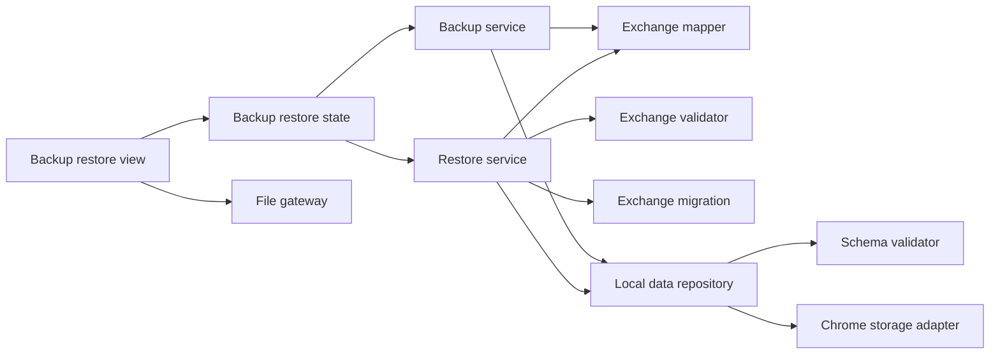
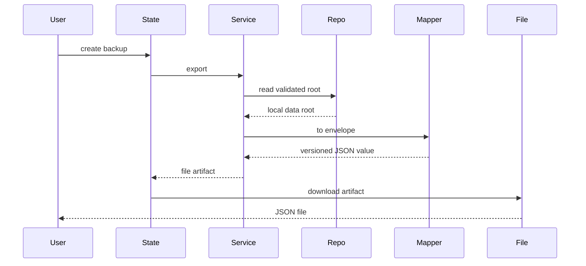
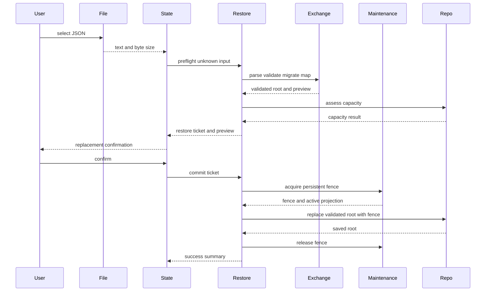

# Design Document

## Overview

本機能は、ローカルファーストのChrome拡張利用者へ、全プロジェクト、候補パーツ、現在構成を一つのバージョン付きJSONへ退避し、安全に一括復元する管理機能を提供する。既存side panelへ管理セクションを追加し、ブラウザ標準のファイルAPIでユーザー操作による入出力を行う。

設計は交換形式、検証・変換、復元調整、UI状態を分離する。永続化モデルを直接公開せず、入力を`unknown`として検証した後に現行`LocalDataRoot`へ変換し、Repositoryの単一置換契約で保存する。これにより、解析、形式移行、容量判定、書込のどこで失敗しても復元前データを維持する。

### Goals
- 保存実装から独立した版付き交換形式で全データを往復可能にする
- 不正形式、非対応版、参照不整合、容量超過を永続状態変更前に拒否する
- 確認済みデータだけを一回のRepository更新で置換し、失敗時の既存データを保持する
- バックアップの限界、置換影響、処理結果を管理画面で明示する

### Non-Goals
- 自動、定期、差分、クラウド、同期、圧縮バックアップ
- 複数バックアップのマージ、CSV入出力、商品カタログ配布
- 候補や現在構成の業務規則、互換性判定、ブラウザ外の保管

## Boundary Commitments

### This Spec Owns
- `BackupEnvelope`交換形式、形式版、旧交換形式から現行形式への移行
- 全保存データと交換データ間の変換、交換形式検証、復元プレビュー
- バックアップ生成と検証済みルートの復元調整
- 管理画面のファイル選択、確認、処理状態、警告、結果表示
- Repositoryへ追加する検証済みルートの原子的置換ユースケース

### Out of Boundary
- `Project`、`CandidatePart`、`CurrentBuild`の所有権と業務規則
- Foundationの保存スキーマ、通常CRUD、Chrome Storage APIアダプター
- ファイルの保存先、保持期間、自動化、暗号化、クラウド転送
- 復元時のマージ、部分選択、互換性結果の再計算

### Allowed Dependencies
- Foundationの`LocalDataRoot`、`SchemaValidator`、`LocalDataRepository`、`Result`、容量・エラー契約、maintenance acquire/renew/release/fence契約とread-only状態購読
- Candidate managementとCurrent build managementが定義する保存済みデータ契約
- 既存side panelランタイムと信頼済みextension page
- Chrome 116以降のFile、Blob、URL、TextEncoder、React 19系/React DOM
- application shellの`ApplicationFeatureRegistration`、`FeatureMountContext`、operation policy、contract test kit

依存方向は`Domain contracts → Exchange validation and migration → Mapper → Repository → Backup and Restore services → State → View and File gateway → Runtime integration`とし、右側は左側だけへ依存する。File gatewayはRepositoryへ直接アクセスしない。

### Revalidation Triggers
- `LocalDataRoot`、カテゴリ、候補所属、現在構成参照、Repositoryエラーの形状変更
- 交換形式の追加・削除、形式版の変更、旧版サポート範囲の変更
- 保存が単一キー一括書込でなくなる変更、容量上限または書込原子性の変更
- side panel以外への管理画面移動、File API前提、信頼済みコンテキスト設定の変更

## Architecture

### Existing Architecture Analysis

Foundationは`LocalDataRoot`を単一キーで保存し、読取・保存時にスキーマと参照を検証する。Candidate managementはプロジェクトと候補、Current build managementは構成参照と数量を所有し、どちらもRepositoryを介して保存する。本仕様はこれらの公開保存値だけを入力とし、業務サービスやStorage APIへ直接依存しない。

既存Repositoryには全ルート読取はあるが、検証済み全ルートの一括置換契約がない。個別CRUDの連続実行は部分復元を生むため、Repository境界へ`replaceRoot`を追加し、既存の直列化、Validator、容量確認、単一writeを再利用する。

### Architecture Pattern & Boundary Map



- **Selected pattern**: 機能サービスとポート・アダプター。交換形式の純粋処理とブラウザI/Oを分離する。
- **Existing patterns preserved**: `unknown`入力検証、判別可能な`Result`、Repository経由の保存、UI stateとDOM viewの分離。
- **New components rationale**: Exchange componentsは保存版との分離に、RestoreServiceは検証順序と一回のcommitに、FileGatewayはDOM固有処理の隔離に必要である。
- **Steering compliance**: MV3同梱コード、最小権限、10MB上限、架空fixture、service worker寿命への非依存を維持する。

### Technology Stack

| Layer | Choice / Version | Role in Feature | Notes |
|---|---|---|---|
| Language | TypeScript 5.x strict | 交換形式、結果、状態契約 | `any`禁止、入力は`unknown` |
| UI | React 19系 / React DOM / CSS | 管理操作、確認、案内 | 既存mount契約を維持 |
| File I/O | File、Blob、URL、TextEncoder | 読取、生成、UTF-8サイズ | Chrome 116標準、新規依存なし |
| Data | 既存Repository / Chrome storage local | 読取、容量、単一置換 | Storage API直接利用なし |
| Test | Vitest 3.x / DOM test環境 | 純粋契約、統合、UI検証 | 架空データのみ |

## File Structure Plan

```text
src/persistence/repository.ts                     # 検証済みルートのreplaceRoot契約と実装を追加
src/features/backup-restore/contracts.ts           # Envelope、preview、command、error契約
src/features/backup-restore/public.ts              # バックアップ・復元公開契約の唯一の入口
src/features/backup-restore/registration.ts        # shellへ渡すfeature registrationと依存組立
src/features/backup-restore/exchange.ts            # 交換形式検証、形式移行、LocalDataRoot変換
src/features/backup-restore/service.ts             # バックアップ生成と復元preflight・commit
src/features/backup-restore/file-gateway.ts        # File読取とBlobダウンロード
src/features/backup-restore/state.ts               # 選択、検証、確認、処理中、結果状態
src/features/backup-restore/view.tsx                # 管理UI、警告、preview、確認のReact component
src/features/backup-restore/react-root.tsx          # FeatureMountContextとReact rootの接続・cleanup
src/features/backup-restore/styles.css             # 管理セクションと状態表現
tests/fixtures/backup.ts                           # 架空の現行・旧版・不正Envelope
tests/features/backup-restore/exchange.test.ts     # 形式検証、移行、往復、参照検証
tests/features/backup-restore/service.test.ts      # export、preflight、commit、失敗不変性
tests/features/backup-restore/file-gateway.test.ts # UTF-8読取、ファイル名、Blob生成
tests/features/backup-restore/state.test.ts        # 状態遷移、確認、重複抑止、再試行
tests/features/backup-restore/view.test.ts         # 案内、preview、エラー、操作可否
tests/features/backup-restore/integration.test.ts  # 全データ往復とRepository回帰
```

`repository.ts`の変更は保存境界内の一回の置換だけとし、交換形式をFoundationへ持ち込まない。共有side panel runtime、`side-panel.html`、root `src/index.ts`は変更せず、application shellが`registration.ts`と`public.ts`をcompositionする。

## System Flows

### バックアップ生成



### 復元



`RestoreTicket`は検証済みルートとその内容ハッシュ相当の不変tokenをstate内だけに保持する。ファイルを変更・再選択した場合はticketを破棄し、commit時にもSchemaValidatorと容量を再確認する。commitはFoundationの永続maintenance fenceを取得してから置換し、成功・失敗・取消の全経路でreleaseまたはabortする。application shellは同じFoundationのread-only maintenance購読を投影するため、復元featureが他featureのUIを直接操作せず全mutationを共通抑止できる。

## Requirements Traceability

| Requirement | Summary | Components | Interfaces | Flows |
|---|---|---|---|---|
| 1.1, 1.2, 1.4, 1.6 | 全データEnvelope生成 | BackupService、ExchangeMapper | export | バックアップ生成 |
| 1.3 | ファイル名 | FileGateway | download | バックアップ生成 |
| 1.5 | 読取失敗 | BackupService、BackupRestoreState | BackupError | バックアップ生成 |
| 2.1, 2.2, 2.3 | 交換契約 | ExchangeValidator、ExchangeMapper | BackupEnvelope | 両フロー |
| 2.4, 2.5 | 形式版と移行 | ExchangeMigration | migrate | 復元 |
| 3.1, 3.2, 3.3, 3.5 | 事前検証 | RestoreService、ExchangeValidator | preflight | 復元 |
| 3.4 | 容量拒否 | RestoreService、LocalDataRepository | assessRestore | 復元 |
| 3.6 | preview | RestoreService、BackupRestoreView | RestorePreview | 復元 |
| 4.1, 4.2 | 確認 | BackupRestoreState、BackupRestoreView | RestoreTicket | 復元 |
| 4.3, 4.5, 4.6 | 全体置換と共通操作ロック | RestoreService、MaintenanceSessionPort、LocalDataRepository、application shell | maintenance fence、replaceRoot | 復元 |
| 4.4 | 成功反映 | BackupRestoreState、RuntimeIntegration | RestoreSummary | 復元 |
| 5.1, 5.2, 5.3, 5.4 | 原子的失敗回復 | RestoreService、LocalDataRepository | replaceRoot、RestoreError | 復元 |
| 5.5 | 再試行 | BackupRestoreState | resetSelection | 復元 |
| 6.1, 6.2, 6.3, 6.4 | 管理画面と案内 | BackupRestoreView、BackupRestoreState | ViewState | 両フロー |
| 6.5 | 値を露出しない診断 | 全検証・サービス | path based errors | 両フロー |
| 6.6 | 非永続ドラフト | BackupRestoreState | transient state | 復元 |

## Components and Interfaces

| Component | Domain/Layer | Intent | Req Coverage | Key Dependencies | Contracts |
|---|---|---|---|---|---|
| ExchangeValidator | Exchange | unknownからEnvelopeを検証 | 2.1–3.3, 6.5 | SchemaValidator P0 | Service |
| ExchangeMigration | Exchange | 対応旧形式を現行へ変換 | 2.4, 2.5, 5.3 | ExchangeValidator P0 | Service |
| ExchangeMapper | Exchange | Envelopeと保存ルートを相互変換 | 1.1–2.3 | DomainModel P0 | Service |
| BackupService | Feature | 検証済みデータをfile artifact化 | 1.1–1.6 | Repository P0、Mapper P0 | Service |
| RestoreService | Feature | preflightとfence付きcommitを調整 | 3.1–5.5 | Exchange P0、Repository P0、MaintenanceSessionPort P0 | Service |
| MaintenanceSessionPort | Foundation port | 永続maintenance fenceの取得・更新・解放 | 4.3, 4.5, 5.1–5.5 | write authority P0 | Service, State |
| LocalDataRepository | Persistence | 容量確認付き単一置換 | 3.4, 4.3, 5.1–5.4 | Validator P0、Storage P0 | Service |
| FileGateway | UI adapter | extension pageのファイルI/O | 1.3, 3.1 | Web API P0 | Service |
| BackupRestoreState | UI state | 処理状態、ticket、再試行 | 1.5, 3.5–6.6 | Services P0 | State |
| BackupRestoreView | UI | 操作、案内、preview、確認 | 3.2, 3.6, 4.1–6.5 | State P0 | State |
| BackupRestoreFeatureRegistration | UI adapter | state/view/public APIをshell登録契約へ接続 | 1.1–6.6 | ApplicationFeatureRegistration P0、BackupRestoreView P0 | Service |

### Exchange Layer

#### ExchangeValidator and Migration

```typescript
interface ExchangeValidator {
  validate(input: unknown): Result<CurrentBackupEnvelope, ExchangeValidationError>;
}

interface ExchangeMigration {
  toCurrent(input: unknown): Result<CurrentBackupEnvelope, ExchangeVersionError | ExchangeValidationError>;
}
```

- `ExchangeValidationError`は`path`と`code`だけを公開し、問題値を含めない。
- JSON object自身のプロパティだけを読み、未知必須版、危険な余剰内容、非JSON値を拒否する。
- 旧版移行は連続する純粋関数とし、各段階を再検証する。将来版は変換しない。

#### ExchangeMapper

```typescript
interface ExchangeMapper {
  fromRoot(root: LocalDataRoot, createdAt: UtcIsoDateTime): CurrentBackupEnvelope;
  toRoot(envelope: CurrentBackupEnvelope): Result<LocalDataRoot, ExchangeMappingError>;
}
```

MapperはID、日時、確認値、出典、正規化属性、候補所属、構成参照を保持する。保存`schemaVersion`は交換データから信頼せず、現行保存スキーマ版を用いてルートを構築し、SchemaValidatorで最終検証する。

### Feature Layer

#### BackupService

```typescript
interface BackupService {
  create(): Promise<Result<BackupArtifact, BackupError>>;
}

interface BackupArtifact {
  readonly filename: string;
  readonly mimeType: "application/json";
  readonly json: string;
  readonly byteLength: number;
}
```

Repositoryから検証済みルートを読み、現在時刻でEnvelopeを作り、決定的なJSONへ直列化する。読取、変換、直列化の失敗時はartifactを返さない。

#### RestoreService

```typescript
interface RestoreService {
  preflight(input: RestoreInput): Promise<Result<RestoreTicket, RestoreError>>;
  commit(ticket: RestoreTicket): Promise<Result<RestoreSummary, RestoreError>>;
}

interface MaintenanceSessionPort {
  acquire(ownerId: MaintenanceOwnerId, leaseMs: number): Promise<Result<MaintenanceFence, RestoreError>>;
  renew(fence: MaintenanceFence, leaseMs: number): Promise<Result<MaintenanceFence, RestoreError>>;
  release(fence: MaintenanceFence): Promise<Result<void, RestoreError>>;
  abort(fence: MaintenanceFence): Promise<Result<void, RestoreError>>;
}

interface RestoreInput {
  readonly text: string;
  readonly byteLength: number;
}
```

`preflight`はサイズ上限、JSON解析、形式移行、交換検証、保存ルート変換、SchemaValidator、容量見積りの順に実行する。`commit`は永続maintenance fenceを取得し、必要ならleaseを更新しながらticketの検証済みルートとfenceをRepositoryへ渡し、再検証と再容量判定後の成功だけを返す。成功・失敗・取消の全経路でfenceをreleaseまたはabortし、解放失敗を成功として隠さない。ticketはUI state外へ永続化しない。

### Persistence Layer

#### LocalDataRepository Extension

```typescript
interface LocalDataRepository {
  read(): Promise<Result<LocalDataRoot, RepositoryError>>;
  capacity(): Promise<Result<CapacityStatus, RepositoryError>>;
  assessReplacement(root: LocalDataRoot): Promise<Result<ReplacementCapacity, RepositoryError>>;
  replaceRoot(root: LocalDataRoot, fence: MaintenanceFence): Promise<Result<LocalDataRoot, RepositoryError>>;
}
```

`replaceRoot`は既存更新キュー内で入力再検証、最新容量確認、単一キーへの一回のwrite、保存後結果返却を行う。書込前に現在値を変更せず、write失敗を成功へ変換しない。Chrome Storage APIへの追加アクセス経路は作らない。

### UI Layer

#### FileGateway

```typescript
interface FileGateway {
  read(file: File): Promise<Result<RestoreInput, FileError>>;
  download(artifact: BackupArtifact): Result<void, FileError>;
}
```

JSONファイルを一つだけ受け、サイズを読取前に確認する。ダウンロード用object URLは操作後に破棄する。内容解釈やRepositoryアクセスはしない。

#### BackupRestoreState and View

stateは`idle`、`exporting`、`validating`、`awaiting-confirmation`、`restoring`、`succeeded`、`failed`の判別共用体とし、成功時だけpreview・summaryを更新する。ファイル再選択、取消、画面再生成でticketを破棄する。feature内の重複要求はstateで抑止し、他featureを含むmutation抑止はFoundationの永続maintenance状態をapplication shellのMutationGateへ投影して実現する。

viewはバックアップと復元をReact componentの別領域として表示し、消失リスク、自動保存・同期なし、置換確認、件数summary、pathベースのエラーを通常のJSX childとして描画する。

## Data Models

```typescript
interface CurrentBackupEnvelope {
  readonly product: "pc-build-planner";
  readonly formatVersion: 1;
  readonly createdAt: UtcIsoDateTime;
  readonly data: BackupDataV1;
}

interface BackupDataV1 {
  readonly projects: readonly BackupProject[];
  readonly parts: readonly BackupCandidatePart[];
  readonly currentBuilds: readonly BackupCurrentBuild[];
}

interface RestorePreview {
  readonly createdAt: UtcIsoDateTime;
  readonly formatVersion: number;
  readonly projectCount: number;
  readonly partCount: number;
  readonly currentBuildCount: number;
  readonly estimatedBytes: number;
}
```

交換エンティティはFoundationの値をJSON互換の読み取り専用フィールドへ写像するが、保存ルートの`schemaVersion`を含めない。配列内IDは一意、候補の`projectId`は存在するProject、構成の`projectId`と各`partId`は同じProject内を参照し、数量は正整数とする。互換性結果、生HTML、画像バイナリ、実行可能値は契約外である。

## Error Handling

- `FileError`: 未選択、複数選択、読取不能、事前サイズ超過。
- `ExchangeError`: JSON解析、必須構造、非対応版、path付き値・参照問題。入力値は表示しない。
- `RestoreError`: 上記に加え`quota`、`storage`、`corrupt-current-data`、`stale-ticket`を判別する。
- `BackupError`: `corrupt-current-data`、`unsupported-current-data`、`storage`、`serialization`を判別する。
- 失敗時は永続スナップショットを更新せず、stateは再選択・再試行可能な`failed`へ遷移する。

ログは操作種別、エラーcode、path、形式版、件数だけを含め、商品名、URL、価格、ファイル本文を含めない。

## Testing Strategy

- **Unit**: Envelope全フィールド、未知・旧・将来版、非JSON値、禁止内容、ID重複、孤立候補、別プロジェクト構成参照、Mapper往復同値性を検証する。
- **Repository integration**: `replaceRoot`の再検証、容量境界、単一write、書込失敗時の保存値不変、管理更新との直列化を検証する。
- **Maintenance integration**: acquire後だけfence付き置換を許可し、renew、成功release、失敗abort、shell全体のmutation抑止とread-only navigation維持を検証する。
- **Service integration**: 空・全データexport、決定的ファイル名、preflight順序、preview件数、stale ticket、commit成功と全失敗点の不変性を検証する。
- **State/React UI**: 処理中抑止、取消、再選択、確認前commit不可、警告文、値を露出しないエラー、再表示時の未選択状態、unmount cleanupを検証する。
- **E2E**: 架空データでプロジェクト、候補、現在構成を作成し、export、既存変更、import確認、再起動後の完全復元を検証する。
- **Regression**: 復元後にCandidateQueryとCurrentBuildQueryが同じ所属・候補ID・数量を返し、通常CRUDを継続できることを検証する。

## Security Considerations

選択ファイルは未信頼入力として`unknown`から検証し、UIへは値でなくcodeとpathだけを出す。React componentはframework非依存のBackupRestoreState、service、FileGateway portだけに依存し、表示値は通常のJSX childとして扱う。`dangerouslySetInnerHTML`、`innerHTML`、inline handlerを使用しない。ファイル処理は信頼済みextension page内で行い、content scriptやページへRepository、ticket、ファイル本文を公開しない。Blob URLは直ちに破棄し、Reactをproduction bundleへ同梱し、リモートコード、動的評価、インラインスクリプト、runtime JSX変換を追加しない。

## Performance & Capacity

入力ファイルは保存上限10MBを基準に、Envelopeの余裕を含む実装定数で読取前に拒否する。UTF-8直列化後の保存見積りを`TextEncoder`とRepository容量契約で確認し、commit時に再判定する。MVPでは圧縮・streamingを導入せず、処理中操作ロックにより同一画面の競合を防ぐ。
