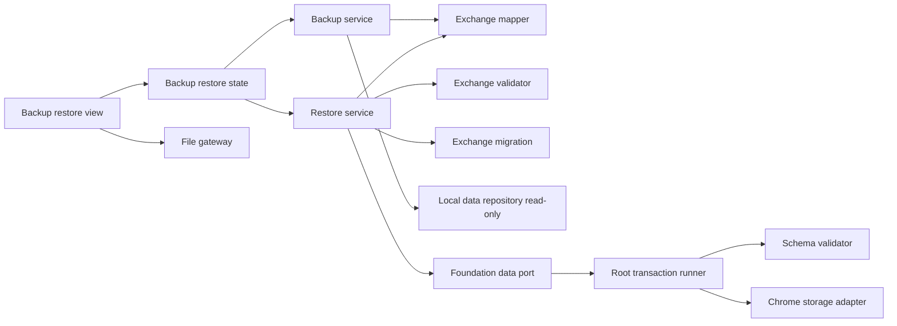
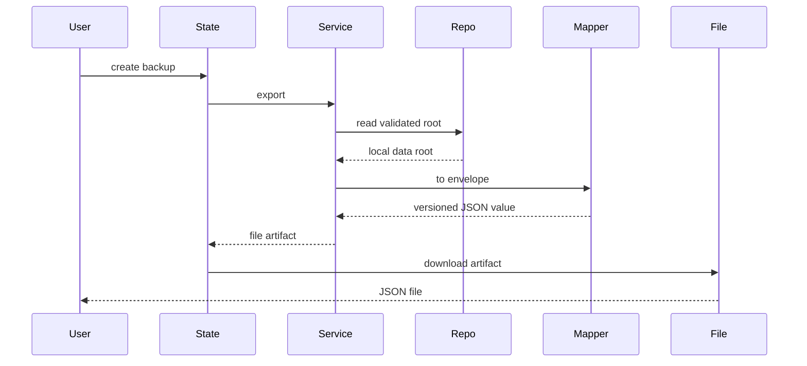
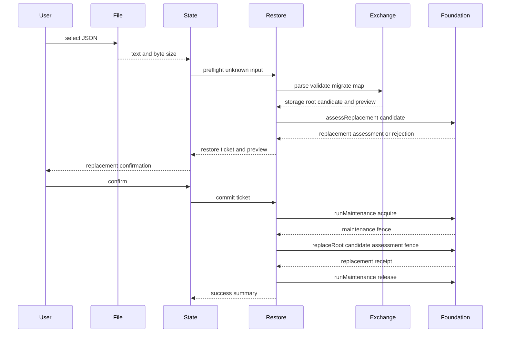

# Design Document

## Overview

本機能は、ローカルファーストのChrome拡張利用者へ、全プロジェクト、候補パーツ、現在構成を一つのバージョン付きJSONへ退避し、安全に一括復元する機能を提供する。操作面は`settings-screen`が所有する設定画面の区画へ、`BackupRestoreSectionMount`を介して埋め込む。ブラウザ標準のファイルAPIでユーザー操作による入出力を行う。

設計は交換形式、検証・変換、復元調整、UI状態を分離する。永続化モデルを直接公開せず、入力を`unknown`として検証した後に現行`LocalDataRoot`へ変換し、Repositoryの単一置換契約で保存する。これにより、解析、形式移行、容量判定、書込のどこで失敗しても復元前データを維持する。

### Goals
- 保存実装から独立した版付き交換形式で全データを往復可能にする
- 不正形式、非対応版、参照不整合、容量超過を永続状態変更前に拒否する
- 確認済みデータだけを一回のRepository更新で置換し、失敗時の既存データを保持する
- バックアップの限界、置換影響、処理結果を設定画面内の区画で明示する
- バックアップ内部を公開せず、任意containerへ安全にmount・cleanupできるsection契約を提供する

### Non-Goals
- 自動、定期、差分、クラウド、同期、圧縮バックアップ
- 複数バックアップのマージ、CSV入出力、商品カタログ配布
- 候補や現在構成の業務規則、互換性判定、ブラウザ外の保管
- 設定画面、常設ナビゲーション、言語区画、shell compositionの所有

## Boundary Commitments

### This Spec Owns
- `BackupEnvelope`交換形式、形式版、旧交換形式から現行形式への移行
- 全保存データと交換データ間の変換、交換形式検証、復元プレビュー
- バックアップ生成と検証済みルートの復元調整
- 設定画面内へ埋め込む区画のファイル選択、確認、処理状態、警告、結果表示
- `BackupRestoreSectionMount`とfactory、およびmountされたReact rootのcleanup
- Foundationの置換・保守portを用いた復元commitの調整（fence取得→replaceRoot→解放）

### Out of Boundary
- `Project`、`CandidatePart`、`CurrentBuild`の所有権と業務規則
- Foundationの保存スキーマ、通常CRUD、Chrome Storage APIアダプター
- ファイルの保存先、保持期間、自動化、暗号化、クラウド転送
- 復元時のマージ、部分選択、互換性結果の再計算
- settings feature registration、設定layout、navigation metadata、shell host lifecycle

### Allowed Dependencies
- Foundationの`LocalDataRoot`、`Result`、エラー契約。read-only参照は`LocalDataRepository`（`query`/`readRoot`）、置換・保守は`FoundationDataPort`の`assessReplacement`/`replaceRoot`/`runMaintenance`（`ReplacementAssessment`、`ReplacementCommand`、`MaintenanceCommand`、`MaintenanceFence`契約）とread-only maintenance状態購読
- Candidate managementとCurrent build managementが定義する保存済みデータ契約
- `settings-screen`が提供する空の区画containerとsection lifecycle
- 信頼済みextension page
- Chrome 116以降のFile、Blob、URL、TextEncoder、React 19系/React DOM
- application shellの`FeatureMountContext`、`FeatureMountHandle`、operation policy

依存方向は`Domain contracts → Exchange validation and migration → Mapper → Foundation data port（参照・置換・保守）→ Backup and Restore services → State → View and File gateway → Section mount adapter`とし、右側は左側だけへ依存する。File gatewayはFoundation portへ直接アクセスせず、settingsは公開section adapterより内側へ依存しない。

### Revalidation Triggers
- `LocalDataRoot`、カテゴリ、候補所属、現在構成参照、`FoundationDataPort`（`assessReplacement`/`replaceRoot`/`runMaintenance`）またはRepositoryエラーの形状変更
- 交換形式の追加・削除、形式版の変更、旧版サポート範囲の変更
- 保存が単一キー一括書込でなくなる変更、容量上限または書込原子性の変更
- `BackupRestoreSectionMount`、`FeatureMountContext`、settings-owned host lifecycle、File API前提、信頼済みコンテキスト設定の変更

## Architecture

### Existing Architecture Analysis

Foundationは`LocalDataRoot`を単一キーで保存し、読取・保存時にスキーマと参照を検証する。Candidate managementはプロジェクトと候補、Current build managementは構成参照と数量を所有し、どちらもRepositoryを介して保存する。本仕様はこれらの公開保存値だけを入力とし、業務サービスやStorage APIへ直接依存しない。

Foundationは検証済み全ルートの原子的置換を`FoundationDataPort`の`assessReplacement`（migration・schema検証・容量見積り・digest付きassessment生成）と`replaceRoot`（assessment再検証・fence認可・容量再判定・単一write）として既に提供し、`runMaintenance`でacquire/renew/release/abortのfenceライフサイクルを扱う。いずれも単一write queueと`RootWriteLock`で直列化される。本機能はこれらを再実装せず消費し、`persistence`への書込追加やStorage APIの新経路は作らない。read-only参照だけ`LocalDataRepository`を使う。

### Architecture Pattern & Boundary Map



- **Selected pattern**: 機能サービスとポート・アダプター。交換形式の純粋処理とブラウザI/Oを分離する。
- **Existing patterns preserved**: `unknown`入力検証、判別可能な`Result`、Repository経由の保存、UI stateとDOM viewの分離。
- **New components rationale**: Exchange componentsは保存版との分離に、RestoreServiceは交換層検証とFoundation置換・保守呼び出しの順序調整に、FileGatewayはDOM固有処理の隔離に必要である。置換・保守・単一writeの原子性はFoundationが所有し新設しない。
- **Steering compliance**: MV3同梱コード、最小権限、10MB上限、架空fixture、service worker寿命への非依存を維持する。

### Technology Stack

| Layer | Choice / Version | Role in Feature | Notes |
|---|---|---|---|
| Language | TypeScript 7.x strict | 交換形式、結果、状態契約 | `any`禁止、入力は`unknown` |
| UI | React 19系 / React DOM / CSS | 管理操作、確認、案内 | 既存mount契約を維持 |
| File I/O | File、Blob、URL、TextEncoder | 読取、生成、UTF-8サイズ | Chrome 116標準、新規依存なし |
| Data | `LocalDataRepository`（read-only）/ `FoundationDataPort` | 参照、容量見積り、原子的置換、保守fence | Storage API直接利用なし |
| Test | Node test runner / jsdom / Playwright | 純粋契約、統合、UI検証 | 架空データのみ |

## File Structure Plan

```text
src/features/backup-restore/contracts.ts           # Envelope、preview、command、error契約
src/features/backup-restore/public.ts              # BackupRestoreSectionMountとfactoryの唯一の公開入口
src/features/backup-restore/section-mount.ts       # section依存組立、mount handle、冪等cleanup
src/features/backup-restore/registration.ts        # settings composition切替後に削除する旧独立registration
src/features/backup-restore/feature-contribution.ts # settings composition切替後に削除する旧独立contribution
src/features/backup-restore/exchange.ts            # 交換形式検証、形式移行、LocalDataRoot変換
src/features/backup-restore/service.ts             # バックアップ生成と復元preflight・commit
src/features/backup-restore/file-gateway.ts        # File読取とBlobダウンロード
src/features/backup-restore/state.ts               # 選択、検証、確認、処理中、結果状態
src/features/backup-restore/view.tsx                # 管理UI、警告、preview、確認のReact component
src/features/backup-restore/react-root.tsx          # FeatureMountContextとReact rootの接続・cleanup
src/features/backup-restore/styles.css             # 管理セクションと状態表現
tests/fixtures/backup.ts                           # 架空の現行・旧版・不正Envelope
tests/features/backup-restore/exchange.test.ts     # 形式検証、移行、往復、参照検証
tests/features/backup-restore/service.test.ts      # export、preflight、commit、失敗不変性
tests/features/backup-restore/file-gateway.test.ts # UTF-8読取、ファイル名、Blob生成
tests/features/backup-restore/state.test.ts        # 状態遷移、確認、重複抑止、再試行
tests/features/backup-restore/view.test.ts         # 区画の案内、preview、エラー、操作可否
tests/features/backup-restore/section-mount.test.ts # 公開mount、失敗、cleanup、二重cleanup
tests/features/backup-restore/registration.test.tsx # section contract testへ置換して削除する旧registration test
tests/features/backup-restore/integration.test.ts  # 全データ往復とRepository回帰
e2e/backup-restore.spec.ts                         # settings経由のexport→改変→復元→再起動
```

`persistence`のwrite経路・ロジックは変更せず、既存の`FoundationDataPort`（`assessReplacement`/`replaceRoot`/`runMaintenance`）をそのまま消費して交換形式をFoundationへ持ち込まない。共有side panel runtime、settings registration、navigation catalog、`side-panel.html`、root `src/index.ts`は変更しない。`settings-screen`のcomposition ownerが完全data portを`createBackupRestoreSectionMount`へだけ渡し、settings内部へは返されたsection mountだけを注入する。

## System Flows

### バックアップ生成



### 復元



`RestoreTicket`は交換層が生成したcandidateと利用者確認用previewだけをstate内に保持する。preflight時の`ReplacementAssessment`は容量見積りをpreviewへ写すために使い、ticketへ保持しない。`acquire`自体がrevisionを進めるため、commitはmaintenance fence取得後にcandidateを再評価し、その時点のassessmentを`replaceRoot`へ渡す。preview表示後に現行rootが変化していても、その変更だけを理由にticketを失効させず、commit時の再検証・容量再判定・fence認可を通過した場合は利用者が確認した全置換を続行する。ファイルを変更・再選択した場合はticketを破棄する。commitは成功・失敗の全経路で`release`または`abort`する。application shellは同じFoundationのread-only maintenance購読を投影するため、復元featureが他featureのUIを直接操作せず全mutationを共通抑止できる。

## Requirements Traceability

| Requirement | Summary | Components | Interfaces | Flows |
|---|---|---|---|---|
| 1.1, 1.2, 1.4, 1.6 | 全データEnvelope生成 | BackupService、ExchangeMapper | export | バックアップ生成 |
| 1.3 | ファイル名 | FileGateway | download | バックアップ生成 |
| 1.5 | 読取失敗 | BackupService、BackupRestoreState | BackupError | バックアップ生成 |
| 2.1, 2.2, 2.3 | 交換契約 | ExchangeValidator、ExchangeMapper | BackupEnvelope | 両フロー |
| 2.4, 2.5 | 形式版と移行 | ExchangeMigration | migrate | 復元 |
| 3.1, 3.2, 3.3, 3.5 | 事前検証 | RestoreService、ExchangeValidator | preflight | 復元 |
| 3.4 | 容量拒否 | RestoreService、FoundationDataPort | assessReplacement | 復元 |
| 3.6 | preview | RestoreService、BackupRestoreView | RestorePreview | 復元 |
| 4.1, 4.2 | 確認 | BackupRestoreState、BackupRestoreView | RestoreTicket | 復元 |
| 4.3, 4.5, 4.6 | 全体置換と共通操作ロック | RestoreService、FoundationDataPort、application shell | runMaintenance、replaceRoot | 復元 |
| 4.4 | 成功反映 | BackupRestoreState、BackupRestoreSectionMount | RestoreSummary | 復元 |
| 5.1, 5.2, 5.3, 5.4 | 原子的失敗回復 | RestoreService、FoundationDataPort | replaceRoot、RestoreError | 復元 |
| 5.5 | 再試行 | BackupRestoreState | resetSelection | 復元 |
| 6.1, 6.2, 6.3, 6.4 | 設定内の区画と案内 | BackupRestoreView、BackupRestoreState、BackupRestoreSectionMount | ViewState、FeatureMountContext | 両フロー |
| 6.5 | 値を露出しない診断 | 全検証・サービス・View | 分類済みerror code | 両フロー |
| 6.6 | 非永続ドラフト | BackupRestoreState | transient state | 復元 |
| 6.7 | 独立navigationを要求しない埋め込み | BackupRestoreSectionMount | mount | Settings mount |

## Components and Interfaces

| Component | Domain/Layer | Intent | Req Coverage | Key Dependencies | Contracts |
|---|---|---|---|---|---|
| ExchangeValidator | Exchange | unknownからEnvelopeを交換形式専用規則で検証 | 2.1–3.3, 6.5 | Exchange contracts P0 | Service |
| ExchangeMigration | Exchange | 対応旧形式を現行へ変換 | 2.4, 2.5, 5.3 | ExchangeValidator P0 | Service |
| ExchangeMapper | Exchange | Envelopeと保存ルートを相互変換 | 1.1–2.3 | DomainModel P0 | Service |
| BackupService | Feature | 検証済みデータをfile artifact化 | 1.1–1.6 | Repository P0、Mapper P0 | Service |
| RestoreService | Feature | preflightとfence付きcommitを調整 | 3.1–5.5 | Exchange P0、FoundationDataPort P0 | Service |
| FoundationDataPort | Foundation port | 参照・原子的置換・保守fenceの単一write authority | 3.1–5.5 | RootTransactionRunner P0 | Service |
| LocalDataRepository | Persistence (read-only) | 検証済みsnapshotの参照 | 1.1, 1.4 | Storage P0 | Service |
| FileGateway | UI adapter | extension pageのファイルI/O | 1.3, 3.1 | Web API P0 | Service |
| BackupRestoreState | UI state | 処理状態、ticket、再試行 | 1.5, 3.5–6.6 | Services P0 | State |
| BackupRestoreView | UI | 操作、案内、preview、確認 | 3.2, 3.6, 4.1–6.5 | State P0 | State |
| BackupRestoreSectionMount | UI adapter | state/viewを任意containerへ接続し公開section lifecycleを提供 | 1.1–6.7 | FeatureMountContext P0、BackupRestoreView P0 | Service, State |

### Exchange Layer

#### ExchangeValidator and Migration

```typescript
interface ExchangeValidator {
  validate(input: unknown): Result<CurrentBackupEnvelope, ExchangeValidationError>;
}

interface ExchangeMigration {
  toCurrent(input: unknown): Result<CurrentBackupEnvelope, ExchangeVersionError | ExchangeValidationError>;
}
```

- `ExchangeValidationError`は`path`と`code`だけを公開し、問題値を含めない。
- JSON object自身のプロパティだけを読み、未知必須版、危険な余剰内容、非JSON値を拒否する。
- 旧版移行は連続する純粋関数とし、各段階を再検証する。将来版は変換しない。

#### ExchangeMapper

```typescript
interface ExchangeMapper {
  fromRoot(root: LocalDataRoot, createdAt: UtcIsoDateTime): CurrentBackupEnvelope;
  toRoot(envelope: CurrentBackupEnvelope): Result<LocalDataRoot, ExchangeMappingError>;
}
```

MapperはID、日時、確認値、出典、正規化属性、候補所属、構成参照を保持する。保存`schemaVersion`は交換データから信頼せず、現行保存スキーマ版を用いて保存root候補を構築する。この候補は`unknown`として`FoundationDataPort.assessReplacement`へ渡し、最終的なschema検証・参照整合性・容量判定はFoundationが行う（feature側でSchemaValidatorや容量判定を重複実行しない）。

### Feature Layer

#### BackupService

```typescript
interface BackupService {
  create(): Promise<Result<BackupArtifact, BackupError>>;
}

interface BackupArtifact {
  readonly filename: string;
  readonly mimeType: "application/json";
  readonly json: string;
  readonly byteLength: number;
}
```

Repositoryから検証済みルートを読み、現在時刻でEnvelopeを作り、決定的なJSONへ直列化する。読取、変換、直列化の失敗時はartifactを返さない。

#### RestoreService

```typescript
interface RestoreService {
  preflight(input: RestoreInput): Promise<Result<RestoreTicket, RestoreError>>;
  commit(ticket: RestoreTicket): Promise<Result<RestoreSummary, RestoreError>>;
}

// Foundation所有。本機能はこのportを消費するだけで再定義しない。
interface FoundationDataPort {
  assessReplacement(input: unknown): Promise<Result<ReplacementAssessment, FoundationError>>;
  replaceRoot(command: ReplacementCommand): Promise<Result<ReplacementReceipt, FoundationError>>;
  runMaintenance(command: MaintenanceCommand): Promise<Result<MaintenanceReceipt, FoundationError>>;
}

interface RestoreTicket {
  readonly candidate: unknown;                 // ExchangeMapperが生成した保存root候補
  readonly preview: RestorePreview;
}

interface RestoreInput {
  readonly text: string;
  readonly byteLength: number;
}
```

`preflight`はサイズ上限、JSON解析、交換形式移行、交換検証、保存root候補への変換の順に交換層で行い、続けて`FoundationDataPort.assessReplacement(candidate)`へ渡す。保存schema検証（参照整合性含む）・容量見積り・digest付きassessment生成はFoundationが担い、非対応版・破損・容量超過はここで拒否される。assessmentの`requiredBytes`だけをpreviewへ写し、assessment自体はticketへ保持しない。`commit`は`runMaintenance({type:"acquire", leaseMs: 30_000})`でfenceを取得し、利用者待機やnetwork I/Oを挟まず、再評価と一回の`replaceRoot`を行う。30秒lease内の短いcommit区間として扱うため`RestoreService`はrenewしない。実測または実行環境変更で30秒以内を保証できなくなった場合は、lease値だけを延ばさずrenew policyと進行表示を再設計する。commit時assessmentのstale検出・容量再判定・単一writeはFoundation内部で完結する。成功・失敗の全経路で`runMaintenance({type:"release"|"abort"})`を呼ぶ。`ownerId`は復元セッションごとに生成したUUIDを用い、ticketはUI state外へ永続化しない。

`acquire`と`replaceRoot`はいずれもrevisionを進めるため、commitは(1) acquire後に`assessReplacement`を再実行してから`replaceRoot`へ渡し、(2) `replaceRoot`が返した新revisionをfenceへ反映してから`release`する。これを怠ると前者は常に`stale-assessment`、後者は`stale-fence`で保守が解放されないまま残る。

commitの最終結果は`replaceRoot`の成否だけを表し、`release`/`abort`自体の失敗で成功した置換を失敗へ、失敗した置換を成功へ変換しない。cleanup失敗は商品値を含まないerror codeだけを診断hookへ報告する。置換失敗時のstateは元の分類済みerrorで再選択・再試行可能に戻り、cleanupできなかった場合の即時再試行はFoundationの`maintenance-active`を安全な一時失敗として示す。置換成功時は成功summaryを維持し、shellのmaintenance表示とmutation抑止は最長30秒のlease自然失効まで残り得るがread-only navigationは継続する。いずれも既存rootを追加変更せず、lease失効後は通常操作と再試行が自動的に回復する。

### Persistence Layer

#### Foundation contracts consumed（persistenceは変更しない）

本機能はpersistenceへ手を加えず、Foundationが既に公開する契約をそのまま消費する。

```typescript
// 既存。参照はread-only。
interface LocalDataRepository {
  readRoot(): Promise<Result<LocalDataRoot, RepositoryError>>;
  query<T>(query: RootQuery<T>): Promise<Result<T, RepositoryError>>;
}

// 既存。置換command。candidateはunknownとして検証される。
interface ReplacementCommand {
  readonly candidate: unknown;
  readonly assessment: ReplacementAssessment;
  readonly fence: MaintenanceFence;
}

// 既存。保守command。
type MaintenanceCommand =
  | { readonly type: "acquire"; readonly ownerId: MaintenanceOwnerId; readonly leaseMs: number }
  | { readonly type: "renew"; readonly fence: MaintenanceFence; readonly leaseMs: number }
  | { readonly type: "release" | "abort"; readonly fence: MaintenanceFence };
```

`assessReplacement`と`replaceRoot`は既存の単一write queueと`RootWriteLock`内で、migration・schema検証・容量確認・digest照合・fence認可・単一writeを行い、書込前に現在値を変更せず、write失敗を成功へ変換しない。Chrome Storage APIへの追加アクセス経路は作らない。

composition ownerは置換・保守capabilityを含む完全data portを本機能のsection factoryへだけ供給する。settingsには`BackupRestoreSectionMount`だけを渡し、FoundationDataPort、maintenance fence、backup stateを露出しない。

### UI Layer

#### FileGateway

```typescript
interface FileGateway {
  read(file: File): Promise<Result<RestoreInput, FileError>>;
  download(artifact: BackupArtifact): Result<void, FileError>;
}
```

JSONファイルを一つだけ受け、サイズを読取前に確認する。ダウンロード用object URLは操作後に破棄する。内容解釈やRepositoryアクセスはしない。

#### BackupRestoreState and View

stateは`idle`、`exporting`、`validating`、`awaiting-confirmation`、`restoring`、`succeeded`、`failed`の判別共用体とし、成功時だけpreview・summaryを更新する。ファイル再選択、取消、画面再生成でticketを破棄する。feature内の重複要求はstateで抑止し、他featureを含むmutation抑止はFoundationの永続maintenance状態をapplication shellのMutationGateへ投影して実現する。

viewはバックアップと復元をReact componentの別領域として表示し、消失リスク、自動保存・同期なし、置換確認、件数summary、pathベースのエラーを通常のJSX childとして描画する。

#### BackupRestoreSectionMount

```typescript
export interface BackupRestoreSectionMount {
  mount(context: FeatureMountContext): Promise<FeatureMountHandle>;
}

export interface BackupRestoreSectionDependencies {
  readonly data: FoundationDataPort;
  readonly state?: BackupRestoreState;
}

export function createBackupRestoreSectionMount(
  dependencies: BackupRestoreSectionDependencies,
): BackupRestoreSectionMount;
```

factoryは既存`BackupService`、`RestoreService`、`BackupRestoreState`、`FileGateway`を構成し、`context.container`へReact rootを一つだけmountする。`state?`はsettings-screenで確定済みの正確なfactory契約と既存contract testを保つ注入seamであり、production compositionは指定せずmountごとに新しいidle stateを生成する。stateを戻り値やsettings public APIとして公開する能力ではない。`context.operationPolicy`をそのままviewへ渡し、settings独自のmutation判定を導入しない。mount成功後のhandleは購読とDOMを一度だけcleanupし、二重unmountを安全に無視する。mount途中の失敗では取得済みresourceを解放して失敗を返す。公開入口はこのinterface、factory、factory入力型だけとし、独立feature registration、navigation metadata、public API entry、React component、service、state accessorを公開しない。

## Data Models

```typescript
interface CurrentBackupEnvelope {
  readonly product: "pc-build-planner";
  readonly formatVersion: 1;
  readonly createdAt: UtcIsoDateTime;
  readonly data: BackupDataV1;
}

interface BackupDataV1 {
  readonly projects: readonly BackupProject[];
  readonly parts: readonly BackupCandidatePart[];
  readonly currentBuilds: readonly BackupCurrentBuild[];
}

interface RestorePreview {
  readonly createdAt: UtcIsoDateTime;
  readonly formatVersion: number;
  readonly projectCount: number;
  readonly partCount: number;
  readonly currentBuildCount: number;
  readonly estimatedBytes: number;
}
```

交換エンティティはFoundationの値をJSON互換の読み取り専用フィールドへ写像するが、保存ルートの`schemaVersion`を含めない。配列内IDは一意、候補の`projectId`は存在するProject、構成の`projectId`と各`partId`は同じProject内を参照し、数量は正整数とする。互換性結果、生HTML、画像バイナリ、実行可能値は契約外である。

## Error Handling

- `FileError`: 未選択、複数選択、読取不能、事前サイズ超過。
- `ExchangeError`: JSON解析、必須構造、非対応版、path付き値・参照問題。入力値は表示しない。
- `RestoreError`: 上記に加え`quota`、`storage`、`corrupt-current-data`、`unsupported-version`、`stale-ticket`を判別し、Foundationの`quota-exceeded`/`storage-unavailable`/`unsupported-version`/`stale-assessment`/`validation`等を対応するfeature codeへ写像する（値は露出しない）。
- `BackupError`: `corrupt-current-data`、`unsupported-current-data`、`storage`、`serialization`を判別する。
- 失敗時は永続スナップショットを更新せず、stateは再選択・再試行可能な`failed`へ遷移する。

利用者向け診断とログは分類済みエラーcodeを基準とし、検証用pathは内部結果に留めて表示・記録しない。商品名、URL、価格、ファイル本文を含めない。

## Testing Strategy

- **Unit**: Envelope全フィールド、未知・旧・将来版、非JSON値、禁止内容、ID重複、孤立候補、別プロジェクト構成参照、Mapper往復同値性を検証する。
- **Foundation port integration**: `assessReplacement`/`replaceRoot`経由の再検証、容量境界、単一write、書込失敗時の保存値不変、通常mutationとの直列化を、本機能の呼び出し経路で検証する（Foundation内部実装は再テストせず消費側契約を対象とする）。
- **Maintenance integration**: 30秒leaseのacquire後だけfence付き置換を許可し、commit中にrenewしないこと、成功release、失敗abort、cleanup失敗時の診断・最長30秒後の回復、shell全体のmutation抑止とread-only navigation維持を検証する。
- **Service integration**: 空・全データexport、決定的ファイル名、preflight順序、preview件数、stale ticket、commit成功と全失敗点の不変性を検証する。
- **State/React UI**: 処理中抑止、取消、再選択、確認前commit不可、警告文、値を露出しないエラー、再表示時の未選択状態、unmount cleanupを検証する。
- **E2E**: 設定画面のバックアップ・復元区画を架空データで操作し、export、既存変更、import確認、再起動後の完全復元を検証する。
- **Regression**: 復元後にCandidateQueryとCurrentBuildQueryが同じ所属・候補ID・数量を返し、通常CRUDを継続できることを検証する。

## Security Considerations

選択ファイルは未信頼入力として`unknown`から検証し、UIへは値やpathを渡さず分類済みcodeに対応する固定文言だけを出す。React componentはframework非依存のBackupRestoreState、service、FileGateway portだけに依存し、表示値は通常のJSX childとして扱う。`dangerouslySetInnerHTML`、`innerHTML`、inline handlerを使用しない。ファイル処理は信頼済みextension page内で行い、content scriptやページへRepository、ticket、ファイル本文を公開しない。Blob URLは直ちに破棄し、Reactをproduction bundleへ同梱し、リモートコード、動的評価、インラインスクリプト、runtime JSX変換を追加しない。

## Performance & Capacity

入力ファイルは保存上限10MBを基準に、Envelopeの余裕を含む実装定数で読取前に拒否する。UTF-8直列化後の保存見積りを`TextEncoder`とRepository容量契約で確認し、commit時に再判定する。MVPでは圧縮・streamingを導入せず、処理中操作ロックにより同一画面の競合を防ぐ。
