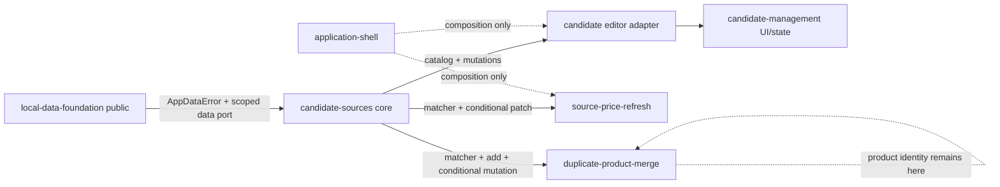
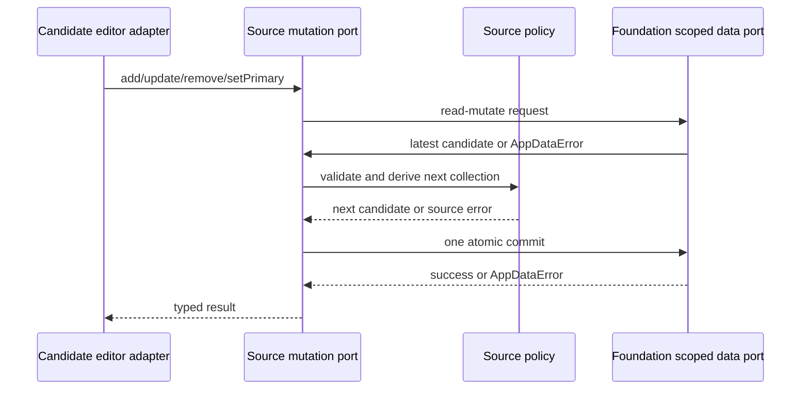

# 設計文書

## 概要

`candidate-source-bookmarks`を候補管理内部のfacetから独立した取得元共有coreへ移す。coreはsource型・policy・catalog・mutation・URL identity・明示scope matcherを一つの公開入口から提供し、候補editor、価格更新、重複統合の各consumerはその公開契約だけを利用する。保存基盤の失敗はfoundation所有の`AppDataError`を意味変更せず投影し、source固有のvalidation・not-found・primary・precondition・ambiguityは独立して維持する。

## Change Integration

- **Change Brief**: `v0.5.0-boundary-reconciliation`
- **In-scope design delta**: 独立source core/public entry、source型・policy、catalog/reference/mutation、URL identity、scope matcher、条件付き価格patch、`AppDataErrorProjection`、candidate editor consumer adapter、contract/tooling test。
- **Out-of-scope preservation**: price extraction/workflow、candidate editor UI/state ownership、product identity/matcher、foundation error定義・mapping、保存schema意味変更、application-shell compositionを実装しない。既存source UX、1:N、primary導出、atomic mutation、URL safety、error semanticsを非回帰とする。

## 目標と非目標

### 目標

- sourceのcanonicalな共有型・policy・公開portを一か所へ集約する。
- URL identityを決定的に正規化し、全候補または指定候補scopeで0件・一意・曖昧を明示する。
- source変更を候補aggregateの一回のfoundation mutationとして確定する。
- candidate editorを公開portのconsumerへ縮小し、既存UIとdraft保持を維持する。
- foundationの`AppDataError`とsource固有errorを所有権どおり分離する。

### 非目標

- 価格抽出、再取得のschedule/retry/progress、価格履歴。
- 同一商品の判定、統合候補、identity normalization。
- source editor UI、candidate CRUD、project lifecycleの所有。
- root schema、migration、backup形式の意味変更。
- production runtime、feature registration、shell wiring。

## 境界コミットメント

### 本specが所有するもの

- `CandidateSource`に関する公開value/reference/input/result型とsource collection policy。
- `CandidateSourceCatalogPort`、`CandidateSourceMutationPort`、`CandidateSourceMatcherPort`。
- HTTP/HTTPS source URLのidentity規則と明示scope matcher。
- source追加・更新・削除・primary変更・条件付き価格patchのdomain/service実装。
- `AppDataError`をsource公開errorへexhaustiveに投影するconsumer adapter。
- candidate editorが利用するsource port adapterの供給契約。

### 境界外

- candidate CRUD、source editor state/view/layout、product identity、重複統合計画・確認、価格抽出workflow。
- `AppDataError`定義と`FoundationError` mapping、保存root/schema/migration/backup形式の意味。
- application shellのproduction composition、runtime singleton、feature registration。

### 許可する依存

- local-data-foundationのdomain公開入口が提供するcanonical candidate/source shape、scoped data port、`Result<T, E>`、`AppDataError`。
- product-capture公開入口のmanufacturer-domain classifier contract。map・抽出実装へdeep importしない。
- TypeScript 7 strict、標準`URL` API、既存Node test/tooling gate。
- 下流consumerは`candidate-sources/public.ts`だけへ依存し、本coreからcandidate-management、source-price-refresh、duplicate-product-merge、application-shellへ依存しない。

### 再検証トリガー

- canonical candidate source shape、primary参照、foundation scoped mutationまたは`AppDataError` variant/payloadが変わる場合。
- source URL identity、scope、0/1/many result、add/update/remove/setPrimary/conditional patchの公開契約が変わる場合。
- candidate editor adapter、source-price workflow、duplicate merge workflowが必要とする公開能力またはfail-closed規則が変わる場合。
- manufacturer classifier、HTTP/HTTPS safety、追加権限、保存schema/backup意味のいずれかが変わる場合。

### 隣接owner

- `local-data-foundation`: `AppDataError`、`FoundationError` mapping、root/schema/validation/write authority。
- `project-candidate-management`: candidate CRUD、pre-edit、draft guard、current project binding、source editor UI/stateとerror表示。
- `source-price-refresh`: 価格抽出、更新workflow、eligibility、retry/progress、UI。
- `duplicate-product-merge`: product identity、同一商品判断、統合計画・確認・UX。本specのmatcher/add/conditional mutationをconsumerとして利用する。
- `product-capture`: メーカー登録ドメインmapと商品取り込み。
- `application-shell`: production composition、public port注入、feature lifecycle。

### 禁止依存

- candidate-management内部service/state/viewからsource coreへの逆向きowner依存。
- foundation内部module、`FoundationError` mapper、root/revisionへのdeep import。
- source-price-refreshのextractor/workflow、duplicate-product-mergeのidentity実装。
- application-shellのcomposition moduleやruntime singleton。

## アーキテクチャ

### 境界マップ



`candidate-sources`は共有domain coreであり、UIを持たない。永続entityはfoundationが所有するcanonical candidate shapeを参照し、source policyとportの型だけをsource公開面に定義する。これにより保存schemaのownerを移さず、source操作規則のownerを独立させる。

### ファイル構成計画

```text
src/
├── candidate-sources/
│   ├── model.ts                       # source公開型・reference・scope・result
│   ├── policy.ts                      # 1:N、primary、代表値の純粋policy
│   ├── url-identity.ts                # HTTP/HTTPS source URL identity
│   ├── matcher.ts                     # 0/1/manyの明示scope照合
│   ├── catalog.ts                     # read-only projection
│   ├── mutations.ts                   # source mutation service
│   ├── app-data-error-projection.ts   # AppDataError consumer projection
│   └── public.ts                      # 唯一のconsumer入口
├── features/candidate-management/
│   └── candidate-source-editor-adapter.ts # 隣接ownerが実装するeditor consumer seam
└── consumer-contract-tests/
    ├── candidate-source-editor.ts      # editor adapter向け公開shape fixture
    ├── source-price-refresh.ts         # matcher + conditional patch consumer fixture
    └── duplicate-product-merge.ts      # candidate matcher + add/conditional mutation consumer fixture
```

既存の候補UI、state、view、message、runtime tab adapterと`candidate-source-editor-adapter.ts`の実装はcandidate-management側に残る。旧candidate-owned source core/facetの撤去と実adapterは`project-candidate-management`の更新taskが所有し、本specは利用する公開shapeと完了後のnegative contractを定義する。candidate public APIからsource coreを再exportしない。application-shellのファイルは本specの変更対象に含めない。

## システムフロー

### source mutation



validation、primary-required、not-foundはcommit前に返す。foundation失敗は`AppDataErrorProjection`がvariant/payload/contextを変えず公開resultへ載せる。candidate editor adapterは失敗時にdraftと既存表示を保持し、旧実装へfallbackしない。

### 条件付き価格patch

価格更新consumerはcandidate/source ID、期待するraw URL、期待kind=`retail`、新price/capturedAtを渡す。mutation serviceは最新snapshotをcommit内で読み、対象存在、raw URL、kindを検証する。一致時だけprice/capturedAtを更新してsiteNameなどの後発編集を保持する。不一致は`precondition-failed`、revision競合は`AppDataError`側の既存`conflict`として区別し、いずれもpatch由来の書込みを行わない。

### URL identityと照合

1. 入力を標準`URL`で解析し、HTTP/HTTPSだけを許可する。
2. scheme/hostの標準正規化、default port除去、空pathの`/`化を利用し、fragmentとuserinfoをidentityから除外する。
3. queryはsource URLの一部として保持する。商品identityを推測してtracking parameterを削除したり、query意味を変更したりしない。
4. callerが指定した`all-candidates`または`candidate` scopeの全referenceへ同じidentity規則を適用する。
5. 0件は`no-match`、1件は`unique`、複数件は全referenceを含む`ambiguous-match`を返す。primary、配列順、kind、価格で選択しない。

invalidな保存URLはcatalog列挙自体を破壊せずreferenceとして返せるが、matcherのidentity候補にはならず診断可能なsource validation resultとして扱う。matcherは商品同一性を返さない。

## コンポーネントとインターフェース

### 公開型

```ts
type CandidateSourceKind = "retail" | "manufacturer";

interface CandidateSourceReference {
  readonly candidateId: CandidateId;
  readonly sourceId: CandidateSourceId;
  readonly pageUrl?: string;
  readonly kind?: CandidateSourceKind;
  readonly isPrimary: boolean;
}

type CandidateSourceScope =
  | { readonly kind: "all-candidates" }
  | { readonly kind: "candidate"; readonly candidateId: CandidateId };

type SourceMatchResult =
  | { readonly kind: "no-match" }
  | { readonly kind: "unique"; readonly reference: CandidateSourceReference }
  | { readonly kind: "ambiguous-match"; readonly references: readonly CandidateSourceReference[] };
```

referenceはroot、revision、draft、price、capturedAt、product identityを含めない。保存entityとeditor draftの代用にしない。

### CandidateSourceCatalogPort

```ts
interface CandidateSourceCatalogPort {
  listSourceReferences(input: {
    readonly scope: CandidateSourceScope;
  }): Promise<Result<readonly CandidateSourceReference[], CandidateSourcePublicError>>;

  getSourceReference(input: {
    readonly candidateId: CandidateId;
    readonly sourceId: CandidateSourceId;
  }): Promise<Result<CandidateSourceReference, CandidateSourcePublicError>>;
}
```

一回の検証済みsnapshotから完全なreference集合を保存順で投影する。sourceなしは空配列、candidate/source不在はentityを区別した`not-found`である。catalogは重複を除去しない。

### CandidateSourceMatcherPort

```ts
interface CandidateSourceMatcherPort {
  matchByPageUrl(input: {
    readonly scope: CandidateSourceScope;
    readonly pageUrl: string;
  }): Promise<Result<SourceMatchResult, CandidateSourcePublicError>>;
}
```

matcherはcatalogと同じ公開coreに属し、source identityだけを判断する。retail eligibilityは価格更新workflowがmatch結果とsource kindから判断する。duplicate workflowは商品identityによる統合先確定後の同一URL振り分けにcandidate限定matcherを利用できるが、matcher結果を同一商品判断として扱わない。

### CandidateSourceMutationPort

```ts
interface CandidateSourceMutationPort {
  addSource(input: AddCandidateSourceInput): Promise<Result<CandidatePart, CandidateSourcePublicError>>;
  updateSource(input: UpdateCandidateSourceInput): Promise<Result<CandidatePart, CandidateSourcePublicError>>;
  removeSource(input: RemoveCandidateSourceInput): Promise<Result<CandidatePart, CandidateSourcePublicError>>;
  setPrimarySource(input: SetPrimarySourceInput): Promise<Result<CandidatePart, CandidateSourcePublicError>>;
  patchSourcePrice(input: PatchCandidateSourcePriceInput): Promise<Result<CandidatePart, CandidateSourcePublicError>>;
}
```

全操作はfoundationのscoped data port経由でcandidate aggregateを一回だけmutationする。新規sourceのkind未指定時だけ注入済みmanufacturer-domain classifierを利用し、利用者上書きを再分類しない。

### AppDataErrorProjection

```ts
type CandidateSourcePublicError =
  | { readonly kind: "data"; readonly error: AppDataError }
  | CandidateSourceValidationError
  | CandidateSourceNotFoundError
  | PrimarySourceRequiredError
  | SourcePatchPreconditionError
  | SourceIdentityError;

function projectAppDataError(error: AppDataError): CandidateSourcePublicError;
```

`AppDataError`は`src/domain/public.ts`からtype-onlyで消費し、全variantをexhaustiveに扱う。canonical定義、`FoundationError` mapping、message縮退、variant統合、candidate-owned alias/re-exportを作らない。source固有errorはdata errorへ吸収しない。

### CandidateSourceEditorAdapter

candidate-managementが所有するstate/viewへcatalog/mutation/page-open resultを適合するconsumer seamである。source entity、identity、matcher、mutationを実装・再公開しない。port欠落または失敗時はdraftと表示を保持し、旧candidate-owned coreへfallbackしない。既存のfield error、primary replacement、再訪errorの表示shapeを保つ。

## データと一貫性

- canonical `CandidatePart.sources`と`primarySourceId`はfoundationの現行保存契約をそのまま利用する。
- 0件ならprimaryなし、1件以上なら存在するsource IDを一つ参照する。
- 代表URL/価格は保存せずprimaryから導出する。価格欠損時のfallbackはしない。
- source追加・更新・削除・primary変更・価格patchは候補aggregateの一回のmutationである。
- root schema version、backup format、migration step、reference repair規則を本変更で変えない。

## エラー処理

| 分類 | owner | 公開動作 |
|---|---|---|
| storage/conflict/maintenance/quota/unsupported等 | local-data-foundation | `AppDataError`を一対一で保持 |
| field validation / unsafe URL | candidate-sources | pathまたはreason付きsource validation |
| candidate/source不在 | candidate-sources | entityを区別したnot-found |
| primary削除時replacement欠落 | candidate-sources | primary-required、書込みなし |
| conditional patch前提不一致 | candidate-sources | precondition-failed、書込みなし |
| URL match複数 | candidate-sources matcher | 全候補付きambiguous-match、暗黙選択なし |
| price extraction/workflow失敗 | source-price-refresh | 本公開errorへ取り込まない |

完全URL、userinfo、外部siteName、抽出値、root payloadをlogへ出さない。未知data errorを既知variantへ推測しない。

## 要件トレーサビリティ

| 要件 | 設計要素 | 検証 |
|---|---|---|
| 1.1, 1.2, 1.3, 1.4, 1.5 | Source model / policy | type・policy unit |
| 2.1, 2.2, 2.3, 2.4, 2.5 | Primary policy / projection | policy・query contract |
| 3.1, 3.2, 3.3, 3.4, 3.5, 3.6, 3.7, 3.8 | Mutation port / editor adapter | service integration・DOM regression |
| 4.1, 4.2, 4.3, 4.4, 4.5 | Manufacturer classifier seam | classifier contract・UI regression |
| 5.1, 5.2, 5.3, 5.4, 5.5 | URL validation / page-open consumer | adapter・permission・browser regression |
| 6.1, 6.2, 6.3, 6.4, 6.5, 6.6, 6.7 | Atomic mutation / foundation contract | transaction・conflict・schema regression |
| 7.1, 7.2, 7.3, 7.4, 7.5 | AppDataErrorProjection / source errors | exhaustive type fixture・error characterization |
| 8.1, 8.2, 8.3, 8.4, 8.5, 8.6, 8.7, 8.8 | Public source core / consumer ports | public import・boundary・cycle contract |
| 9.1, 9.2, 9.3, 9.4, 9.5, 9.6, 9.7, 9.8 | UrlIdentity / Matcher | normalization・scope・0/1/many contract |

## テスト戦略

### Unit

- source collection、primary切替・削除、代表値非fallback、入力不変性。
- URL identityのscheme/host/default port/path/fragment/userinfo/query規則とunsafe URL拒否。
- matcherの全候補・候補限定scope、0/1/many、重複保持、暗黙選択禁止。
- `AppDataErrorProjection`のexhaustivenessとsource固有error分離。

### Integration / contract

- catalogの空・全件・候補限定・candidate/source not-found。
- add/update/remove/setPrimaryが一回のroot mutationで、失敗時に旧candidateを保持すること。
- conditional patchがprice/capturedAtだけを変更し、後発siteNameを保持すること。
- raw URL/kind/source不一致はprecondition、revision競合は既存`AppDataError` conflictであること。
- 正常consumerは`candidate-sources/public.ts`とfoundation domain publicだけを利用し、candidate内部、foundation内部、隣接ownerへdeep importしないこと。
- duplicate positive fixtureはcandidate限定`matchByPageUrl`、`addSource`、必要なconditional mutationを同じ`candidate-sources/public.ts`から取得し、read-only referenceだけでは統合routeを構成できない誤った契約を拒否すること。
- negative fixtureはcandidate-owned source re-export、`ManagementError`、FoundationError mapper、product identity混入、shell compositionを一違反ずつ拒否すること。

### UI / browser regression

- 既存source追加・編集・削除・primary replacement・種別上書き・入力保持・error表示。
- 一覧primaryと任意sourceの新規tab再訪、side panel/draft保持、unsafe URLでtab API非呼出。
- production composition検証はapplication-shell更新後の統合gateで実行し、本specは公開seamのfixtureだけを所有する。

## 実装順序と移行seam

1. `local-data-foundation`の`AppDataError`公開契約が利用可能であることを確認する。
2. 独立source public types、error projection、URL identity/matcherを追加する。
3. catalog/mutation/conditional patchを独立coreへ移し、contract testを通す。
4. `project-candidate-management` Task 13.3がeditor adapterを公開portへ接続するためのconsumer contractを固定する。
5. `project-candidate-management` Task 14.3がeditor adapterと既存state/viewをcanonical portへ接続し、旧coreはまだ撤去しない。
6. source-price-refresh 7.2が`createCanonicalSourcePriceRefreshService` / `createCanonicalSourcePriceRefreshContribution`を加算的に公開し、duplicate-product-merge 6.2、product-page-capture 12.1が各owner内のcanonical source consumer shapeを確定する。
7. application-shell 12.1がsource限定production seamとしてcanonical catalog、matcher、mutationの各portを構築・注入する。
8. source-price-refresh 7.3がproduction切替後に旧source依存とlegacy factoryを撤去する。
9. `project-candidate-management` Task 14.5が全consumer移行後に旧candidate-owned source facet/coreを撤去し、本specと隣接specの最終gateが二重ownerのない境界を検証する。

移行中も旧ownerを先行削除しないが、最終状態でfallbackや二重ownerを残さない。本specは下流実装やshell wiringを代行せず、各ownerが公開seamを消費する順序だけを開始条件で固定する。

## セキュリティと性能

- HTTP/HTTPS以外をidentity化・再訪しない。URLは外部文字列として扱いHTMLへ解釈しない。
- 追加host/tabs permissionを要求しない。
- matcherは一回のcatalog snapshotを線形走査する。source件数はローカル候補規模を前提とし、root全体やprice payloadを公開しない。
- 曖昧時はfail closedし、primaryや順序による誤更新を防ぐ。
