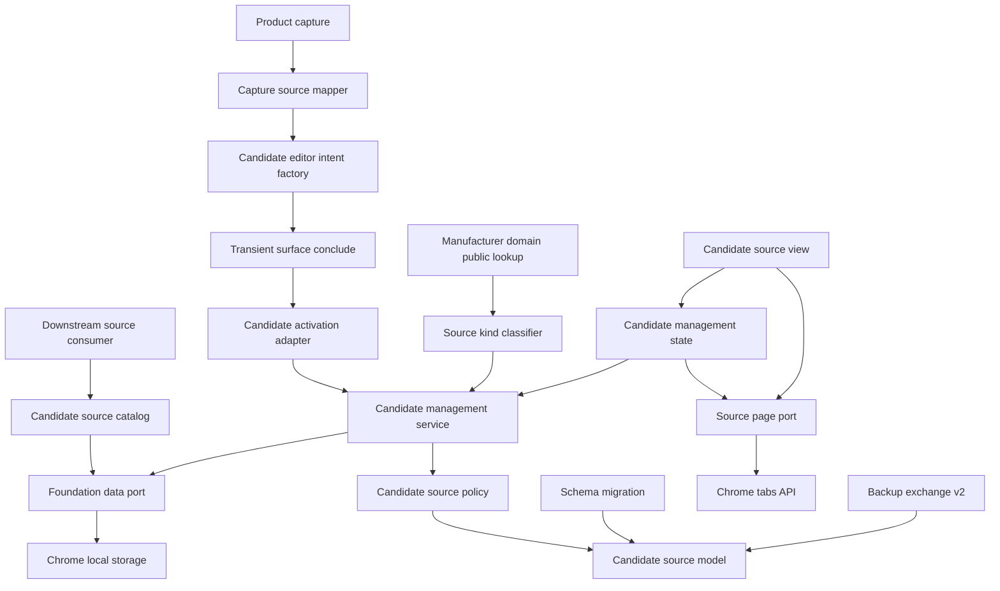
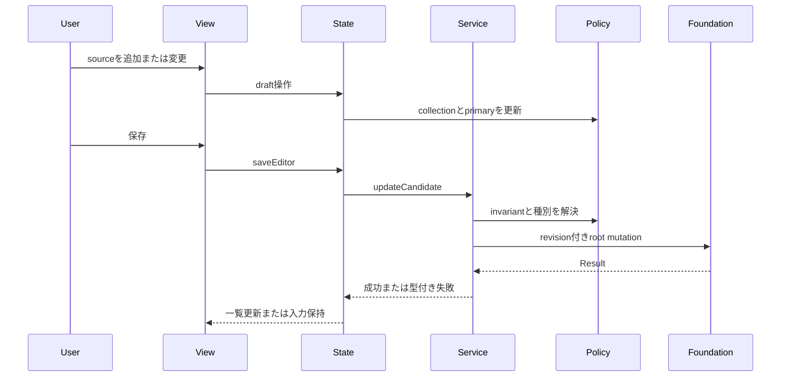
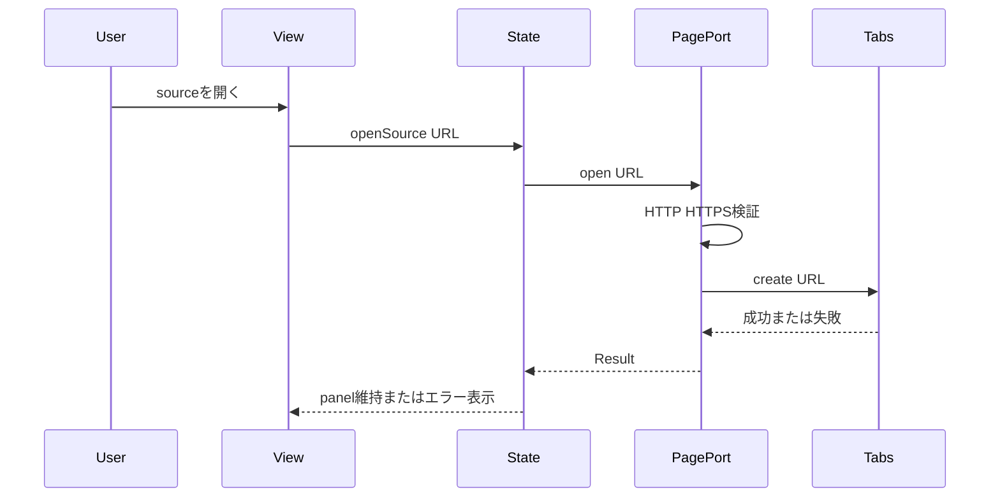
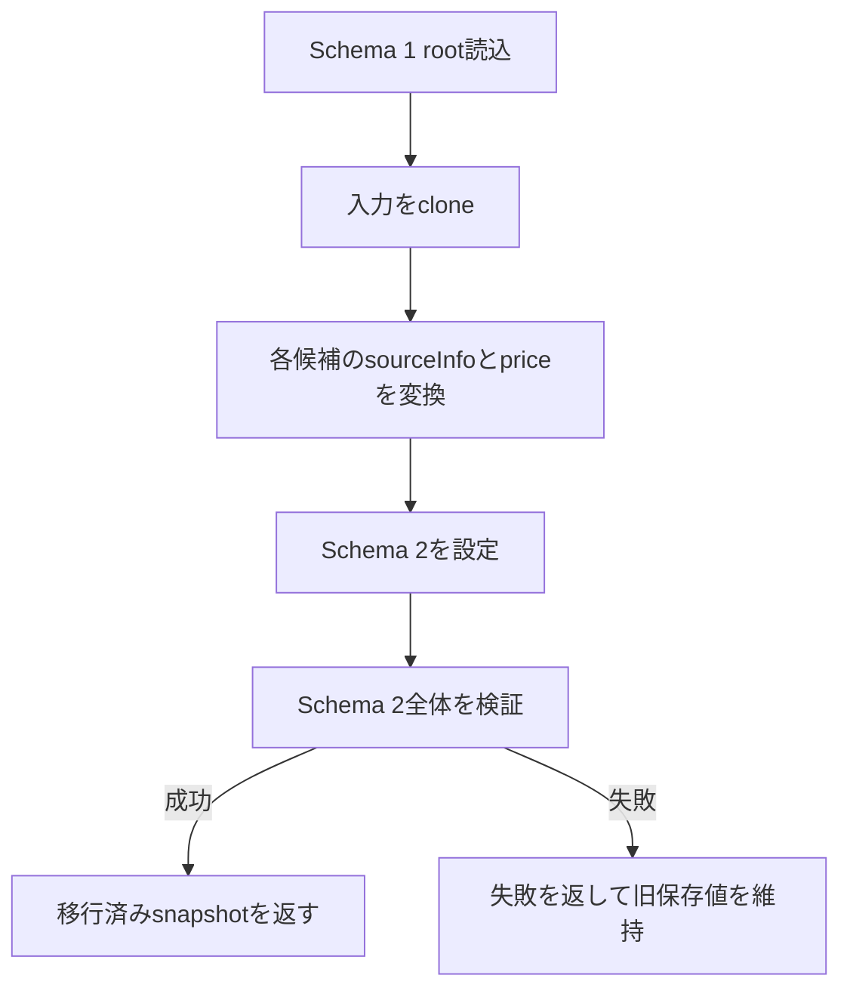
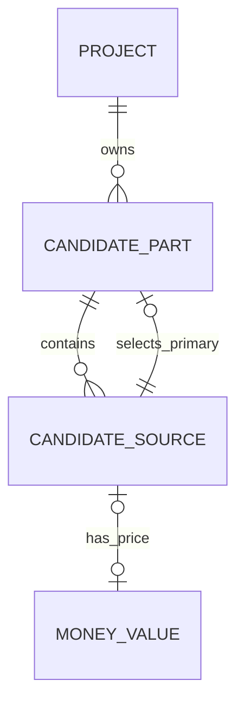

# 設計文書

## 概要

本機能は、一つの候補パーツを複数の販売ページ・メーカー商品紹介ページへ結び付け、代表ソースを基準に比較と再訪を行えるようにする。保存モデルを単数 `sourceInfo` と商品共通 `price` から、候補内の `sources` collectionと `primarySourceId` へ変更し、一覧の価格・URLは保存値を複製せず純粋に導出する。

対象は既存のlocal data foundation、candidate-management、product-capture、backup-restoreをまたぐextensionである。schemaVersion 1から2への非破壊移行、候補editorの複数ソース操作、追加権限不要の新規タブ再訪に加え、下流が保存rootへ到達せずsource参照を列挙・再取得できる読み取り専用catalogを既存の単一write authorityと公開境界へ統合する。

### 目標

- 候補ごとに0件以上の取得元と、存在時に唯一のプライマリ参照を保持する。
- 価格を取得元別に移し、代表価格と代表URLをプライマリから一意に導出する。
- 旧保存データと旧backupを値損失なく新形式へ移行する。
- 販売・メーカー紹介の種別を自動判定し、利用者の上書きを優先する。
- HTTP/HTTPSの取得元を新規タブで開き、side panelと作業中タブを維持する。
- 全候補または指定候補のsource参照を最小投影で公開し、ID指定で現行参照を再取得できるようにする。

### 非目標

- 取り込み時の同一商品自動検知・統合提示。
- 再訪ページからの価格再取得、価格履歴、在庫監視、通貨換算。
- source URLの正規化・一致判定、retail eligibility、0件・1件・複数件の照合結果と曖昧さの解決。
- メーカー登録ドメインマップの定義・保守、抽出rankerの変更。
- 互換性rule、現在構成、shell navigation、一過性feature lifecycleの変更。

## 境界コミットメント

### 本specが所有するもの

- 候補に埋め込まれるソースentity、ソース種別、プライマリ参照、取得元別価格のcanonical domain contract。
- 代表ソース・代表価格・代表URLの導出規則と候補ソースmutation規則。
- 保存schema 1→2 migration、現行root検証、移行失敗時の非破壊性。
- candidate-management内のソース一覧、追加・編集・削除・プライマリ変更・再訪UI/state/service。
- candidate-managementの `public.ts` から公開する読み取り専用 `CandidateSourceCatalogPort`、`CandidateSourceMutationPort`、`sources: { catalog, mutations }` facet、source参照DTO、列挙・ID再取得・not-found規則。
- `chrome.tabs.create`を隔離する再訪portとHTTP/HTTPS検証。
- backup交換形式2と交換形式1→2 migration。
- product-captureが新候補へ初期ソースを渡すためのdraft contract更新。

### 境界外

- 同一商品の一致判定と統合UXは `duplicate-product-merge` が所有する。
- 保存済みページからの再取得とsource価格更新UXは `source-price-refresh` が所有する。
- URL正規化、URL同一性、catalog/candidate scopeでの0件・1件・複数件照合、`ambiguous-match` とretail eligibilityは `source-price-refresh` など各下流consumerが所有する。
- ドメイン→メーカー名マップ、eTLD+1照合、抽出時manufacturer補完はproduct-capture #8が所有する。
- compatibility-checkingは正規化属性だけを参照し、本specのsource contractへ依存しない。
- application shellはChrome handleの注入だけを行い、sourceの意味・保存判断・URL選択を持たない。
- `createCandidateEditorIntent`、`FeatureActivationIntent`、activation adapter、起動世代、stale抑止、`conclude`とhandoff失敗時のintent保持はproject-candidate-management、application-shell、product-capture側の所有であり、本specは再実装しない。

### 許可する依存

- local data foundationのUUID、UTC timestamp、`Result<T, E>`、validator、migration registry、単一write authority、atomic root mutation。
- project-candidate-managementの既存候補CRUD、`CandidateEditorPrefill`、`CandidateManagementPublicApi.query`、`createCandidateEditorIntent(prefill): FeatureActivationIntent`、React mount/state lifecycle。
- product-capture-transient-migrationの現行世代確認と `TransientSurfaceLifecyclePort.conclude` によるtyped intent配送。
- product-capture #8が `public.ts` から公開するメーカー登録ドメイン照合。内部mapへのdeep importは禁止する。
- backup-restoreの交換形式versioning、preflight、atomic replacement。
- Chrome 116以降の `chrome.tabs.create`。`tabs`・host・optional permissionの追加は禁止する。
- 標準 `URL`、React 19、TypeScript strict、既存ui-message catalogとテスト基盤。

### 再検証トリガー

- `CandidateSource`、`primarySourceId`、価格またはsource IDの形状・所有場所が変わる場合。
- product-capture #8の公開classifier契約または登録ドメインの解決規則が変わる場合。
- backup format version、保存schema version、migration registryの登録方式が変わる場合。
- Chrome Tabs APIの権限要件またはside panelからのAPI注入経路が変わる場合。
- downstreamの `source-price-refresh` / `duplicate-product-merge` がsourceを候補外aggregateとして扱う提案をする場合。
- `CandidateSourceCatalogPort`、`CandidateSourceMutationPort`、`CandidateSourceReference`、列挙scope、not-found規則、またはcanonical `CandidateManagementPublicApi` の `query`・typed intent factory・`sources` facetが変わる場合。

## アーキテクチャ

### 既存アーキテクチャ分析

- local data foundationが `LocalDataRoot` 全体の実行時検証、migration、revision付きmutation、replacementを所有する。featureからstorage adapterへの直接到達はない。
- candidate-managementは候補draftをserviceで検証し、一回のroot mutationで保存する。stateはReact外、viewは表示adapterである。
- product-captureは取得結果をsource付き `CandidateEditorPrefill` へ写像し、candidate-management公開APIの `createCandidateEditorIntent(prefill): FeatureActivationIntent` でtyped intentを生成して一過性surfaceの`conclude`へ渡す。candidate queryやsource mutationへ直接到達せず、新しいsource初期化もこの依存方向を維持する。
- backup-restoreは保存schemaを交換形式へ直接公開せず、独立したformatVersionとmapperを持つ。
- application shellだけがfeature contributionへ具体Chrome APIを注入する。

### アーキテクチャパターンと境界マップ



**統合判断**:

- 選択パターンは候補aggregate内entity collection + ports and adaptersである。
- 依存方向は `domain types → validation/migration/policy → service → state → view` とし、platform adapterはport実装としてcompositionから注入する。
- foundationからproduct-captureへは依存させない。旧migrationの種別は任意のまま保持し、feature側classifierが表示・新規作成時に解決する。
- source catalogはcandidate-managementが保存snapshotから最小参照を投影する。URLの正規化・一致判定・重複排除を行わず、sourceの完全な候補集合を下流へ渡す。
- candidate-managementのcanonical公開APIは `query`、`createCandidateEditorIntent(prefill): FeatureActivationIntent`、`sources: { catalog, mutations }` の三facetである。本specはcatalog/mutation facetだけを所有し、typed intent factoryとactivation適用はproject-candidate-management、一過性世代と`conclude`はproduct-capture側の契約を利用する。
- 新規libraryは追加しない。標準URL、既存Result/UUID/migration、Chrome native APIを採用する。

### 技術スタック

| 層 | 選択・版 | 本機能での役割 | 備考 |
|---|---|---|---|
| UI | React 19 / CSS | source一覧、編集、代表切替、再訪操作 | stateはReact外 |
| 言語 | TypeScript 7 strict / ESM NodeNext | domain、port、error union | `any`禁止 |
| データ | `chrome.storage.local` / schemaVersion 2 | 候補内source collectionの保存 | 既存10MB制約 |
| runtime | Chrome 116 MV3 Tabs API | 新規タブ再訪 | 追加権限なし |
| 検証 | node:test、testing-library、Playwright | unit、contract、DOM、E2E | 架空データのみ |

## ファイル構成計画

### ディレクトリ構成

```text
src/
├── domain/
│   ├── normalized-attributes.ts       # source種別・取得元別価格の値型
│   ├── model.ts                       # CandidateSource entityとCandidatePart集約
│   └── validation.ts                  # source collectionとprimary参照のcanonical検証
├── persistence/
│   ├── schema.ts                      # schemaVersion 2と初期root
│   ├── migration-v1-to-v2.ts          # 単数sourceと商品価格の純粋変換
│   ├── runtime-contribution.ts        # production migration step登録
│   ├── public.ts                      # 現行schema定数の限定公開
│   └── replacement.ts                 # 共通現行schema定数の参照
├── features/
│   ├── candidate-management/
│   │   ├── source-collection.ts       # primary導出とadd/update/remove policy
│   │   ├── source-catalog.ts          # source参照のread-only列挙とID再取得
│   │   ├── source-kind-classifier.ts  # メーカー照合を受けるfeature port
│   │   ├── source-page-port.ts        # 再訪portとChrome adapter
│   │   ├── contracts.ts               # draft、summary、source catalog・mutation公開契約
│   │   ├── service.ts                 # source mutationと代表値query
│   │   ├── state.ts                   # editor操作と再訪結果state
│   │   ├── state-snapshot.ts          # 複数source draftのversion 2 codec
│   │   ├── view.tsx                   # source一覧・フォーム・代表・再訪UI
│   │   ├── styles.css                 # source list/editorのfeature-scoped style
│   │   ├── feature-contribution.ts    # classifier・page port注入
│   │   └── public.ts                  # downstream向けsource catalog・mutation facet公開
│   ├── product-capture/
│   │   └── draft-mapper.ts            # 初期sourceとprimaryを持つCandidateEditorPrefillを生成
│   └── backup-restore/
│       ├── contracts.ts               # BackupCandidatePart v2契約
│       └── exchange.ts                # format 1→2 migrationとv2 mapper
├── application-shell/
│   └── side-panel-contributions.ts    # Chrome tabsと上流classifierのadapter注入
└── ui-messages/catalog/
    ├── ja/candidate.ts                # source操作・種別・再訪の日本語文言
    └── en/candidate.ts                # 同じmessage keyの英語文言

tests/
├── domain/                            # model・source invariant・validation
├── persistence/                       # 1→2 migration、read/replace非破壊性
├── features/candidate-management/     # policy、catalog、service、state、DOM、公開contract、Chrome adapter
├── features/product-capture/          # source draft mapping
├── features/backup-restore/           # format migrationと往復
├── features/compatibility/            # source変更が判定へ影響しない回帰
├── application-shell/                 # classifier/tab adapter composition
└── fixtures/foundation.ts             # schema 2の架空source fixture

e2e/
└── candidate-management.spec.ts       # 複数source管理と新規タブ再訪のcritical path
```

### 変更対象ファイル

- `src/domain/normalized-attributes.ts` — `CandidateProductValues.price`を除き、`CandidateSourceKind`とsource用price値を定義する。
- `src/domain/model.ts` — source ID、source entity、`sources`、`primarySourceId`、schemaVersion 2を定義する。
- `src/domain/validation.ts` — source配列、重複ID、種別、価格、primary参照、schema 2を検証する。
- `src/persistence/schema.ts`、`runtime-contribution.ts`、`public.ts`、`replacement.ts` — 現行版2とmigration登録を一元化し、backup mapperへ限定公開する。
- `src/features/candidate-management/contracts.ts`、`source-catalog.ts`、`service.ts`、`state.ts`、`state-snapshot.ts`、`view.tsx`、`styles.css`、`public.ts`、`feature-contribution.ts` — 候補管理のsource catalog・mutation能力を公開し、sourceを保存・表示する。
- `src/features/product-capture/draft-mapper.ts` — 価格と取得元を一件の初期sourceへ写像した `CandidateEditorPrefill` を生成する。
- `src/features/backup-restore/contracts.ts`、`exchange.ts` — format 2と旧format移行を実装する。
- `src/application-shell/side-panel-contributions.ts` — source classifierとChrome tab portだけをcompositionする。
- `src/ui-messages/catalog/{ja,en}/candidate.ts` — 既存message schemaを両言語で同時更新する。
- 既存fixture・contract・integration testはschema 2形状へ更新し、上記の新規専用testを加える。

## システムフロー

### source変更と保存



### 取得元ページの再訪



### schema移行



## 要件トレーサビリティ

| 要件 | 要約 | コンポーネント | インターフェース | フロー |
|---|---|---|---|---|
| 1.1, 1.2, 1.3, 1.4, 1.5 | 複数sourceと取得元別価格 | CandidateSourceModel、CandidateSourceValidator | `CandidateSource` | source変更 |
| 2.1, 2.2, 2.3, 2.4, 2.5 | primaryと代表導出 | CandidateSourcePolicy、CandidateManagementService | `deriveCandidateSourceSummary` | source変更 |
| 3.1, 3.2, 3.3, 3.4, 3.5, 3.6 | 手動source管理 | CandidateSourcePolicy、CandidateManagementState、CandidateSourceView | `CandidateSourceMutationPort` | source変更 |
| 4.1, 4.2, 4.3, 4.4, 4.5 | 種別判定と上書き | SourceKindClassifier、CandidateManagementService、CandidateSourceView | `SourceKindClassifier` | source変更 |
| 5.1, 5.2, 5.3, 5.4, 5.5 | 安全な再訪 | SourcePagePort、CandidateManagementState、CandidateSourceView | `SourcePagePort.open` | 再訪 |
| 6.1, 6.2, 6.3, 6.4, 6.5, 6.6 | 非破壊移行 | CandidateSourceMigration、CandidateSourceValidator | `MigrationStep<1, 2>` | schema移行 |
| 7.1, 7.2, 7.3, 7.4, 7.5 | 検証と原子性 | CandidateSourceValidator、CandidateManagementService、SourcePagePort | `validateCandidatePartContent`、foundation mutation | 全フロー |
| 8.1, 8.2, 8.3, 8.4, 8.5, 8.6, 8.7 | 既存workflow・下流参照整合 | CaptureSourceMapper、BackupExchangeV2、CandidateSourceModel、CandidateSourceCatalog | `createCandidateEditorIntent`、`FeatureActivationIntent`、`ExchangeMapper`、`CandidateSourceCatalogPort` | 取り込みhandoff・backup・下流参照 |

## コンポーネントとインターフェース

| コンポーネント | 層 | 意図 | 要件 | 主要依存 | 契約 |
|---|---|---|---|---|---|
| CandidateSourceModel | Domain | source entityとaggregate invariantを定義 | 1.1, 1.2, 1.3, 1.4, 1.5, 2.5 | UUID、UTC | State |
| CandidateSourceValidator | Domain | 未信頼root/draftをfail closedで検証 | 1.2, 6.5, 7.1, 7.2, 7.5, 8.4 | CandidateSourceModel | Service |
| CandidateSourceMigration | Persistence | schema 1を2へ純粋変換 | 6.1, 6.2, 6.3, 6.4, 6.5, 6.6 | migration registry、validator | Batch |
| CandidateSourcePolicy | Feature domain | add/update/remove/primary/代表導出を一元化 | 2.1, 2.2, 2.3, 2.4, 2.5, 3.1, 3.2, 3.3, 3.4, 3.5 | CandidateSourceModel | Service |
| CandidateSourceCatalog | Feature query | source参照をread-onlyで列挙・再取得 | 8.7 | FoundationScopedDataPort、CandidateSourceModel | Service |
| CandidateManagementService | Feature service | source mutationを一回のroot更新へ確定 | 3.1, 3.2, 3.3, 3.4, 3.5, 3.6, 7.3, 7.4 | policy、classifier、data port | Service |
| CandidateManagementState | Feature state | editor source操作と再訪結果を保持 | 3.1, 3.2, 3.4, 3.6, 5.1, 5.2, 5.4 | service、page port | State |
| CandidateSourceView | UI | source一覧、種別、代表、再訪を表示 | 3.1, 3.2, 3.3, 3.4, 3.5, 4.4, 4.5, 5.1, 5.2, 5.3, 7.5 | state、messages | State |
| SourcePagePort | Runtime adapter | 安全なURLだけを新規タブで開く | 5.1, 5.2, 5.3, 5.4, 5.5 | Chrome Tabs API | Service |
| SourceKindClassifier | Integration adapter | 上流mapから初期種別を解決 | 4.1, 4.2, 4.3, 4.4 | product-capture public | Service |
| CaptureSourceMapper | Integration | capture値を初期primary source付きprefillへ変換 | 8.1 | capture session、CandidateEditorPrefill | Service |
| BackupExchangeV2 | Integration | source関係を交換形式で往復・移行 | 8.2, 8.3, 8.4 | source model、foundation replacement | Batch |

### Domain / Persistence

#### CandidateSourceModel

| 項目 | 詳細 |
|---|---|
| 意図 | 候補の出典ページを識別可能なentityとして表現し、価格の唯一の保存先にする |
| 要件 | 1.1, 1.2, 1.3, 1.4, 1.5, 2.5 |

**責務と制約**

- `CandidatePart` aggregate内だけでsource IDの一意性を保証する。
- sourceが0件ならprimaryなし、1件以上なら存在するsource IDをprimaryとして必須にする。
- `kind`、URL、価格、サイト名、取得日時の欠損を表現できる。新規追加の必須性はfeature serviceが担う。
- `CandidateProductValues`はname、manufacturer、modelNumber、notesだけを持ち、priceを持たない。

**契約**: State [x]

```typescript
type CandidateSourceKind = "retail" | "manufacturer";

type CandidateSourceId = Uuid & {
  readonly candidateSourceIdBrand: "CandidateSourceId";
};

interface CandidateSource {
  readonly id: CandidateSourceId;
  readonly pageUrl?: string;
  readonly siteName?: string;
  readonly capturedAt?: UtcTimestamp;
  readonly price?: SourcedValue<MoneyValue>;
  readonly kind?: CandidateSourceKind;
}

interface CandidatePart {
  readonly sources: readonly CandidateSource[];
  readonly primarySourceId?: CandidateSourceId;
}
```

#### CandidateSourceValidator

| 項目 | 詳細 |
|---|---|
| 意図 | source配列とprimary参照を未信頼入力境界で検証する |
| 要件 | 1.2, 6.5, 7.1, 7.2, 7.5, 8.4 |

**依存**

- Inbound: draft validation、root read、replacement、runtime message（P0）
- Outbound: CandidateSourceModel（P0）

**契約**: Service [x]

- sourceは固定key集合、UUID ID、HTTP/HTTPS URL、UTC timestamp、finite amount、string currency、許容kindだけを受け入れる。
- source ID重複は `duplicate-id`、primary欠損参照は `missing-reference`、余剰keyは `unexpected-field` とpathで返す。
- sourceなし + primaryあり、sourceあり + primaryなしを拒否する。
- 外部文字列に生HTML、data URL、画像・binary payloadを許可しない。

#### CandidateSourceMigration

| 項目 | 詳細 |
|---|---|
| 意図 | schema 1候補を値損失なくschema 2へ変換する |
| 要件 | 6.1, 6.2, 6.3, 6.4, 6.5, 6.6 |

**契約**: Batch [x]

```typescript
const migrateV1ToV2: MigrationStep<1, 2>;
```

- Trigger: registryがschemaVersion 1を現行版2へ読むとき。
- Input: `unknown`。step内部で旧rootの必要shapeを検査する。
- Output: `schemaVersion: 2`、候補ごとの `sources` と `primarySourceId`。
- Idempotency: 旧候補のsource IDにcandidate IDを使い、同じ入力から同じ出力を生成する。
- Recovery: 変換・最終検証の失敗を返し、storage writeを行わない。

### Candidate Management

#### CandidateSourcePolicy

| 項目 | 詳細 |
|---|---|
| 意図 | collection更新と代表値導出を副作用なしで一元化する |
| 要件 | 2.1, 2.2, 2.3, 2.4, 2.5, 3.1, 3.2, 3.3, 3.4, 3.5 |

**契約**: Service [x]

```typescript
interface CandidateSourcePolicy {
  add(
    state: CandidateSourceState,
    source: CandidateSource,
  ): Result<CandidateSourceState, CandidateSourceRuleError>;
  update(
    state: CandidateSourceState,
    source: CandidateSource,
  ): Result<CandidateSourceState, CandidateSourceRuleError>;
  remove(
    state: CandidateSourceState,
    sourceId: CandidateSourceId,
    replacementPrimarySourceId?: CandidateSourceId,
  ): Result<CandidateSourceState, CandidateSourceRuleError>;
  setPrimary(
    state: CandidateSourceState,
    sourceId: CandidateSourceId,
  ): Result<CandidateSourceState, CandidateSourceRuleError>;
  derive(state: CandidateSourceState): CandidateSourceProjection;
}
```

- 最初のaddは自動的にprimaryを設定する。
- primary削除後にsourceが残る場合は明示replacementを要求する。
- projectionの価格とURLはprimaryだけから取り、fallbackしない。

#### CandidateManagementService

| 項目 | 詳細 |
|---|---|
| 意図 | source操作を候補aggregateの単一mutationへ写像し公開portへ提供する |
| 要件 | 3.1, 3.2, 3.3, 3.4, 3.5, 3.6, 7.3, 7.4 |

**依存**

- Inbound: ManagementState、公開 `sources.mutations` facetを利用するdownstream source consumer（P0）
- Outbound: CandidateSourcePolicy、SourceKindClassifier、FoundationScopedDataPort（P0）

**契約**: Service [x]

```typescript
interface CandidateSourceMutationPort {
  addSource(input: AddCandidateSourceInput): Promise<Result<CandidatePart, ManagementError>>;
  updateSource(input: UpdateCandidateSourceInput): Promise<Result<CandidatePart, ManagementError>>;
  removeSource(input: RemoveCandidateSourceInput): Promise<Result<CandidatePart, ManagementError>>;
  setPrimarySource(input: SetPrimarySourceInput): Promise<Result<CandidatePart, ManagementError>>;
}
```

- Public portはmutation contextをconsumerへ公開せず、feature contributionが最新revisionとrequest IDを補う。
- service内部メソッドは既存の明示 `MutationContext` を受け、candidate読込、policy適用、validator、root mutationを一回で行う。
- 新規sourceのURLはHTTP/HTTPSを必須とし、kind未指定ならclassifierで補う。明示kindは上書きしない。
- conflict、maintenance、quota、storage、validationを既存 `ManagementError` へ正規化する。

#### CandidateSourceCatalog

| 項目 | 詳細 |
|---|---|
| 意図 | downstreamへ保存rootや編集draftを公開せず、sourceの最小read-only参照を列挙・再取得する |
| 要件 | 8.7 |

**依存**

- Inbound: `source-price-refresh`、`duplicate-product-merge` などの公開consumer（P0）
- Outbound: `FoundationScopedDataPort` のread能力、CandidateSourceModel（P0）

**契約**: Service [x]

```typescript
export interface CandidateSourceReference {
  readonly candidateId: CandidatePartId;
  readonly sourceId: CandidateSourceId;
  readonly pageUrl?: string;
  readonly kind?: CandidateSourceKind;
  readonly isPrimary: boolean;
}

export interface CandidateSourceCatalogPort {
  listSourceReferences(input: {
    readonly candidateId?: CandidatePartId;
  }): Promise<Result<readonly CandidateSourceReference[], ManagementError>>;
  getSourceReference(input: {
    readonly candidateId: CandidatePartId;
    readonly sourceId: CandidateSourceId;
  }): Promise<Result<CandidateSourceReference, ManagementError>>;
}
```

- `listSourceReferences({})` は全候補を保存順、各候補のsourceを保存順で平坦化する。`candidateId` 指定時はその候補だけを対象にする。
- 存在する候補がsourceを持たない場合は成功した空配列を返す。指定candidateが存在しない場合は `{ kind: "not-found", entity: "candidate" }` を返す。
- `getSourceReference` はcandidate/source IDを両方照合する。candidate不在は `entity: "candidate"`、candidate内のsource不在は `entity: "source"` とし、`ManagementError` の `not-found.entity` を `"project" | "candidate" | "source"` へ拡張する。
- projectionはsourceの現行 `pageUrl`、明示 `kind`、primary参照との同一性だけを返す。price、siteName、capturedAt、配列index、root revision、product、normalized attributesを公開しない。
- URL正規化、eligibility filter、重複排除、0件・1件・複数件のmatch判定を行わない。複数の同一URL参照もすべて返し、catalog自身は `ambiguous-match` を生成しない。
- foundationのread、validation、maintenance、storage、unsupported data失敗は既存 `ManagementError` へ正規化し、mutation contextを作成しない。

#### CandidateManagementState

summary-only component。editor draft内のsource collection操作、primary削除時のreplacement選択、`SourcePagePort`結果、field errorを保持する。snapshot codecはversion 2で全sourceとprimaryを検証し、旧/未知snapshotを永続化へ触れず拒否する。

#### CandidateSourceView

summary-only component。候補一覧ではprimaryの価格状態と再訪操作を表示し、editorでは各sourceのURL・サイト名・日時・価格・種別、primary radio、追加・削除を表示する。通常の外部link遷移は使わずbuttonからstateを呼ぶ。外部文字列はJSX textとして描画する。

### Runtime / Integration

#### SourcePagePort

| 項目 | 詳細 |
|---|---|
| 意図 | featureからChrome tab操作を隔離し、安全な再訪結果だけを返す |
| 要件 | 5.1, 5.2, 5.3, 5.4, 5.5 |

**契約**: Service [x]

```typescript
type SourcePageOpenError =
  | { readonly kind: "invalid-url" }
  | { readonly kind: "runtime-unavailable" }
  | { readonly kind: "open-failed" };

interface SourcePagePort {
  open(url: string): Promise<Result<void, SourcePageOpenError>>;
}
```

- `URL`でparseし、protocolがHTTP/HTTPSのときだけ `tabs.create({url})` を一度呼ぶ。
- tab IDやURLをログへ出さない。失敗は安定codeだけを返す。
- side panel documentや現在のactive tabを遷移させない。

#### SourceKindClassifier

| 項目 | 詳細 |
|---|---|
| 意図 | product-captureの公開map判定をcandidate-management用種別へ変換する |
| 要件 | 4.1, 4.2, 4.3, 4.4 |

**契約**: Service [x]

```typescript
interface SourceKindClassifier {
  classify(pageUrl: string): CandidateSourceKind;
}
```

- product-capture public lookupが一致を返せば `manufacturer`、非一致・安全に判定不能なら `retail`。
- sourceに明示kindがあればclassifierを呼ばず利用者値を優先する。
- map自体をcandidate-managementへcopyしない。

#### CaptureSourceMapper

summary-only component。capture sessionのpageUrl、capturedAt、取得priceを一件のsourceへ移し、そのIDをprimaryに設定した `CandidateEditorPrefill` を構築する。商品共通値にはpriceを含めず、kindは未指定のまま候補serviceのclassifierに委ね、元表記 `sourceSnapshot` は候補単位で保持する。product-captureはこのprefillを `CandidateManagementPublicApi.createCandidateEditorIntent` に渡し、返された `FeatureActivationIntent` を一過性surfaceの`conclude`へ配送する。mapperはcandidate query、`sources.mutations`、candidate serviceを直接呼ばない。

#### BackupExchangeV2

| 項目 | 詳細 |
|---|---|
| 意図 | 複数sourceとprimaryをversion付きJSONで完全往復する |
| 要件 | 8.2, 8.3, 8.4 |

**契約**: Batch [x]

- formatVersion 2のcandidateは `sources` と条件付き `primarySourceId` を持ち、商品priceと単数sourceInfoを持たない。
- v1→v2 stepは保存schema migrationと同じ値移動規則・決定的source IDを使う。
- v2 envelope検証後にだけ現行 `LocalDataRoot` 候補へ写像し、最終schema・容量・参照整合はfoundationへ委ねる。
- export→importでsource順序、ID、primary、価格、kind、siteName、capturedAt、sourceSnapshotを保持する。

## データモデル

### ドメインモデル



**不変条件**:

- source IDは候補内で一意である。
- `sources.length === 0` と `primarySourceId === undefined` は同値である。
- sourceが一件以上ならprimary IDは同じcollection内に一件だけ存在する。
- source価格は任意で、amountはfinite number、currencyは取得値または空文字による不明を保持する。
- source種別の明示値は `retail` / `manufacturer` だけである。
- `sourceSnapshot`は既存どおり候補単位で、source価格やsource metadataの代替にしない。

### 論理データモデル

- `LocalDataRoot.schemaVersion`: literal `2`。
- `CandidatePart.sources`: JSON配列。表示順は利用者が保存した順を維持する。
- `CandidatePart.primarySourceId`: sourceがある場合だけ必須のUUID参照。
- `CandidateSource.price`: `SourcedValue<MoneyValue>`。元表記と利用者確認値を分離する。
- 保存は候補aggregate全体のreplaceで、source単体storage keyやeventual consistencyを導入しない。

### データ契約と統合

- candidate-managementのcanonical公開契約は `query`、`createCandidateEditorIntent(prefill): FeatureActivationIntent`、`sources: { catalog: CandidateSourceCatalogPort; mutations: CandidateSourceMutationPort }` である。本specはcatalogとmutation port、およびfeature contributionが構築する `sources` facetを所有する。project-candidate-managementがこのfacetをqueryとtyped intent factoryへ合成し、application shellは完成した公開APIを登録するだけでsource query、mutation、intent factoryを実装しない。
- `CandidateSourceReference` はsource探索用のread-only DTOであり、保存entityまたはeditor draftとして再利用しない。feature外consumerは `candidate-management/public.ts` からだけ型とportをimportする。
- `CandidateSummary`は `primarySource` とそこから導出した `price` をread-onlyで返す。consumerが商品共通priceを再保存してはならない。
- downstreamはsource IDを更新対象識別子として使い、URL一致や配列indexを永続識別子にしない。
- downstreamのURL identityとambiguity policyはcatalog outputへ適用し、catalogへ照合規則を逆流させない。
- compatibility consumerが受け取る `CandidatePart` 形状は変わるが、rule入力は `normalizedAttributes`だけにprojectionする既存境界を維持する。

## エラー処理

### エラー方針

- domain検証はcode + pathでfail closedし、問題値・完全URLをログへ含めない。
- source editorのvalidation失敗はdraftと保存済み候補を維持し、source index/fieldに対応するエラーを表示する。
- source mutationのrevision conflict、maintenance、quota、storage失敗は既存の回復actionを再利用する。
- tab open失敗は保存mutationへ影響させず、panel内に再試行可能なエラーを表示する。
- migration/restore失敗は旧storage rootを置換しない。

### 主なカテゴリ

| カテゴリ | 例 | 応答 |
|---|---|---|
| 入力 | 非HTTP URL、不正日時、非finite価格 | field path付きvalidation、draft保持 |
| business rule | primaryなし、存在しないprimary、primary削除後のreplacementなし | 保存拒否、primary選択を要求 |
| catalog lookup | 未知candidate、candidate内に存在しないsource | `not-found` の `candidate` / `source` を区別し、値やrevisionを返さない |
| downstream match | URL一致0件・複数件、kind不適格 | catalogでは選択せず全参照を返し、consumerが `no-match` / `ambiguous-match` / eligibilityを判定 |
| concurrency | revision conflict | 変更前データ保持、既存conflict案内 |
| runtime | Tabs API unavailable/throw | `open-failed`案内、panel維持 |
| migration | 旧shape破損、最終schema不適合 | migration失敗、旧保存値維持 |
| restore | format未知、source参照不整合 | preflight拒否、既存root維持 |

### 監視

- 既存の安定error code報告だけを使い、URL・商品値・backup内容は出力しない。
- schema migrationとtab adapterのtest failureをCI gateで検出する。新しいtelemetryや外部送信は導入しない。

## テスト戦略

### Unit tests

- CandidateSourcePolicy: 初回primary、切替、非primary削除、primary replacement必須、最後のsource削除、primary価格なしの非fallbackを検証する（2.1–2.5、3.3–3.5）。
- CandidateSourceValidator: source key/type/URL/UTC/money、重複ID、primary参照、禁止payloadのpathを検証する（7.1、7.2、7.5）。
- CandidateSourceMigration: sourceInfo+price、片方だけ、両方なしを変換し、ID決定性と元属性保持を検証する（6.1–6.6）。
- SourceKindClassifier: 明示kind優先、map一致manufacturer、非一致retailを検証する（4.1–4.4）。
- SourcePagePort: HTTP/HTTPSだけがtabs.createへ一回到達し、危険scheme・throwが型付き失敗になることを検証する（5.4、5.5）。

### Integration / contract tests

- candidate serviceでsource操作が一回のroot mutationとなり、失敗時に候補が部分更新されないことを検証する（3.1–3.6、7.3、7.4）。
- CandidateSourceCatalogで全候補・候補限定の列挙、sourceなし空配列、candidate/source not-found、primary投影を検証し、URL重複を除外・暗黙選択しないことを確認する（8.7）。
- candidate-management public contractでsource catalogとmutationが同一source facetから利用でき、公開consumerがfoundation rootや内部moduleをimportせず型検査を通ることを確認する（8.7）。
- product-capture draftが価格をprimary sourceへ渡し、商品共通priceを生成しないことを検証する（8.1）。
- backup format 2のexport/import round tripとformat 1 migrationで全source値・primary・参照を維持する（8.2–8.4）。
- production foundationが1→2 stepを登録し、read/transaction/replacementの各経路で同じ現行版を使うことを検証する（6.5、6.6）。
- application shellがproduct-capture公開lookupとChrome tabs handleをcandidate contributionへ注入し、feature間deep importを作らないことを検証する（4.1、5.5）。
- compatibility flowでsource/priceだけの変更がrule入力と結果を変えないことを検証する（8.5）。

### DOM / E2E tests

- 一覧がprimary価格状態と代表再訪actionを示し、詳細が全source・種別・primaryを表示する（2.3、4.5、5.1、5.2）。
- source追加・種別上書き・primary切替・削除を保存後の再読込でも維持する（3.1–3.5、4.4）。
- 不正入力時は対応fieldがinvalidとなり、入力と既存一覧が残る（3.6、7.1）。
- 架空HTTPS sourceを開くと新規tabが作られ、side panelと元tabの状態が残る（5.1–5.3）。
- 外部文字列をsource/site表示へ入れても要素やscriptとして解釈されない（7.5）。

### 性能・容量

- 既存10MB capacity testをschema 2 fixtureへ更新し、source増加分を正確にbyte評価する。
- 候補一覧queryは各候補のprimaryを一回の配列探索で導出する。別storage readやネットワーク取得を追加しない。

## セキュリティ考慮事項

- 保存・snapshot・backup・Chrome境界のURLはすべて未信頼入力としてHTTP/HTTPSを検証する。
- 外部URLを通常linkで辿らず、adapterから `tabs.create` する。`javascript:`、`data:`、`file:`、extension URLは拒否する。
- `tabs`、host、optional permissionをmanifestへ追加しない。既存artifacts gateを回帰検証する。
- URL・商品値・閲覧履歴をログへ出さず、架空 `.invalid` URLだけをfixtureへ使う。

## 移行戦略

1. 稼働中のschema 1契約を維持したまま、`CandidatePartV2`、`LocalDataRootV2`、schema 2専用validator、純粋1→2 migration stepをversioned契約として追加する。production registryと現行schema定数はまだ切り替えない。
2. candidate-management、product-capture、backup mapperをversioned schema 2 portへ順次対応させる。途中のfeature taskはfoundation具体portへ依存せず、schema 1 productionの全回帰を維持する。
3. candidate-managementのread-only source catalogとmutationを `public.ts` のsource facetへ合成し、下流public consumer contractを固定する。
4. backup format 1→2 migrationとschema 2復元候補のpreflightを実装するが、foundation replacementへのproduction結線はcutoverまで行わない。
5. 全consumerがschema 2契約へ対応した後、専用cutover taskでmigration registry、現行schema定数、initial root、replacement、write authority、通常fixtureを一度にschema 2へ切り替える。schema 1型とfixtureはmigration境界だけに残す。

ロールバック用の逆migrationは提供しない。変換失敗時は旧rootを上書きせず、実装の修正後に同じschema 1入力から再試行する。現行rootの書込みが始まった後はversion 2をcanonicalとする。
