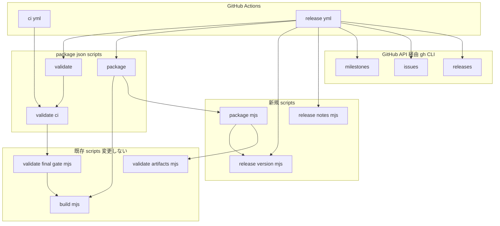
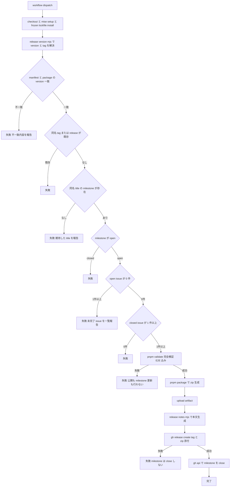

# Technical Design — ci-release-workflow

## Overview

**Purpose**: 本 spec は、`main` ブランチ一本・レビュアー不在で運用される本リポジトリに対し、2 本の GitHub Actions ワークフローと、それらが呼び出す再現可能なコマンド群を提供する。

**Users**: 唯一の利用者は本リポジトリの開発者である。検証 CI は push / pull request を契機に自動で働き、リリースワークフローは開発者が GitHub 上で明示的に起動する。

**Impact**: 現在リポジトリには `.github/` が存在せず、検証はローカル実行のみ、配布用 zip を作る手段も存在しない。本設計は `.github/workflows/` を新設し、`scripts/` へパッケージング・バージョン解決・リリースノート整形の 3 スクリプトを追加し、`package.json` の検証 script を「E2E 込み」と「E2E 抜き」に分解する。アプリケーションコード（`src/`）には一切触れない。

### Goals

- ローカル検証では構造的に検知できない破壊（lockfile 不整合、クリーン環境固有の失敗、Linux とのOS差異、検証を通らないコミット）を、push 直後に検知する。
- 検証 CI を 5 分以内に収め、push ごとの待ち時間を運用可能な範囲に保つ。
- Chrome ウェブストアへ提出可能な zip を、単一コマンドで再現可能に生成する。
- リリース可否の判定とリリースノートの内容を、マイルストーン運用（マイルストーン title = バージョン）から機械的に導出する。
- リリース成果物の公開からマイルストーンの close までを、1 回の手動起動で完了させる。

### Non-Goals

- Chrome ウェブストアへの自動アップロード・審査提出。生成 zip の提出は手動で行う。
- `manifest.json` の version 自動採番・自動 bump。
- ブランチ保護・required status check などのリポジトリ設定変更。
- 依存更新の自動化（Dependabot 等）。
- 既存の検証スクリプト群が「何を検査するか」の変更。本設計はそれらの呼び出し方だけを扱う。

## Boundary Commitments

### This Spec Owns

- `.github/workflows/ci.yml` と `.github/workflows/release.yml` の全内容（起動条件、ジョブ構成、権限、ステップ順序）。
- 配布用 zip の生成手順と、zip に含める / 含めないファイルの判断（`scripts/package.mjs`）。
- リリース対象バージョンとタグ名の決定規則（`scripts/release-version.mjs`）。この 2 つの形式に関する唯一の情報源となる。
- リリースノートの本文構造と label グルーピング規則（`scripts/release-notes.mjs`）。
- `package.json` における検証 script の**合成関係**（`validate:ci` の新設と `validate` の再定義、`package` の新設）。
- リリース運用手順の文書化（`README.md`）と、開発コマンド一覧の同期（`.kiro/steering/tech.md`）。

### Out of Boundary

- `typecheck` / `lint` / `test` / `validate:boundaries` / `validate:fixtures` / `validate:final-build` / `validate:artifacts` の各検証が**何を検査するか**。本設計はこれらを呼び出すだけで、判定ロジックへ手を入れない。
- `scripts/build.mjs` の build 内容（entry points、target、出力構成）。`scripts/package.mjs` はその出力を入力として受け取る側に徹する。
- `src/` 配下のアプリケーションコード、`manifest.json` の内容（version 値の読み取りのみ行う）。
- マイルストーンおよび issue の作成・label 付与・close といった日常運用。ワークフローは状態を読み取るのみで、リリース成功時のマイルストーン close だけが唯一の書き込みである。
- Playwright のテスト内容および `playwright.config.ts`。

### Allowed Dependencies

- 既存の `package.json` scripts（検証の実体はすべてここから呼ぶ）。
- 既存の `scripts/build.mjs`（`buildUnpackedExtension`）と `scripts/validate-artifacts.mjs`（`validateArtifactDirectory`）。
- `mise.toml`（Node.js / pnpm バージョンの単一情報源）。
- `manifest.json` の `version` フィールド（リリースバージョンの単一情報源）。
- GitHub Actions ランナーに標準搭載される `gh` CLI と `zip` コマンド、および Windows の .NET `System.IO.Compression`。
- 新規の npm 依存パッケージは追加しない。

### Revalidation Triggers

以下の変更が起きた場合、本 spec の成果物を再検証する。

- `scripts/build.mjs` の出力ファイル構成が変わったとき（`scripts/package.mjs` のステージング対象と除外規則が影響を受ける）。
- `package.json` の検証 script 名または合成関係が変わったとき（両ワークフローの実行コマンドが影響を受ける）。
- `manifest.json` の version 表記規則、または `package.json` との整合前提が変わったとき（タグ名決定が影響を受ける）。
- リポジトリの label セットまたはマイルストーン命名規則が変わったとき（リリースノート分類とマイルストーン特定が影響を受ける）。
- `mise.toml` の Node.js / pnpm バージョンが変わったとき（両ワークフローの実行環境が影響を受ける）。

## Architecture

### Existing Architecture Analysis

本リポジトリは検証の実体を `package.json` scripts と `scripts/*.mjs` に集約し、`pnpm validate` を単一の完了基準とする構造を既に持つ。`scripts/validate-final-gate.mjs` の `runFinalGate` は `dist` を削除したうえで `buildUnpackedExtension` を呼ぶため、`pnpm validate` はクリーン環境でも自己完結する（research.md 参照）。

この構造をそのまま活かし、ワークフローは「検証ロジックを持たず、既存 script の成否を伝播するだけの薄い層」として設計する。ワークフロー YAML に検証内容を書き下すことは、検証セットの定義を `package.json` と YAML へ二重化し drift を招くため採らない。

一方で `pnpm validate` の末尾にある `playwright test` は、直前の `validate:final-build` が残した `dist` に暗黙依存している（`pnpm test:e2e` と異なり自前で build しない）。したがって `validate` を CI で分割実行する際は、E2E を切り離す方向のみを許し、E2E を別ジョブへ移すことはしない。

### Architecture Pattern & Boundary Map



**Architecture Integration**:

- **Selected pattern**: 薄いオーケストレーション層（ワークフロー）＋ 検証・生成の実体（既存および新規 script）。ワークフローは判断ロジックを持たず、スクリプトの終了コードと `gh` の応答に従う。
- **Dependency direction**: `ワークフロー → package.json scripts → scripts/*.mjs → 既存 build/validate scripts`。この向きは逆流させない。とくに `scripts/*.mjs` は GitHub API・Actions 固有の環境変数に依存しない。
- **Pure logic vs I/O**: GitHub API との通信はすべてワークフロー側の `gh` CLI が担い、`scripts/release-notes.mjs` は JSON を受け取って Markdown を返す純関数として保つ。これによりリリースノートの整形規則が `node:test` で回帰可能になる。
- **Existing patterns preserved**: `scripts/*.mjs` は ESM、モジュールとして関数を export しつつ `import.meta.url === pathToFileURL(process.argv[1])` の判定で CLI としても動く既存パターンを踏襲する。テストは `tests/tooling/` に置く。
- **Steering compliance**: 新規 npm 依存を追加しない（`tech.md` の「ライブラリの固定より境界契約と決定的テストを優先」）。テストは `node:test` + `node:assert/strict`（`testing.md`）。

### Technology Stack

| Layer | Choice / Version | Role in Feature | Notes |
|-------|------------------|-----------------|-------|
| CI / Runtime | GitHub Actions `ubuntu-latest` | 両ワークフローの実行基盤 | `zip` と `gh` が標準搭載されていることに依存する |
| Toolchain setup | `jdx/mise-action@v4` (`cache: true`) | `mise.toml` の Node.js 26.5.0 / pnpm 11.13.1 を再現 | 参考リポジトリと同一。最新は v4.2.3 |
| Checkout | `actions/checkout@v7` | ソース取得 | git 履歴に依存しないため `fetch-depth` は既定のまま |
| Artifact | `actions/upload-artifact@v7` | 生成 zip の保全 | `if-no-files-found: error` |
| GitHub 操作 | `gh` CLI（ランナー同梱） | マイルストーン / issue 取得、タグ重複確認、リリース作成、マイルストーン close | 認証は `GH_TOKEN: ${{ github.token }}` |
| Packaging | Node.js `node:child_process` + OS 標準 zip | 配布 zip 生成 | win32 は .NET `ZipFile`、他は `zip -r`。新規依存なし |
| Test | `node:test` / `node:assert/strict` | 新規 script の単体検証 | `testing.md` に準拠 |

## File Structure Plan

### Directory Structure

```
.github/
└── workflows/
    ├── ci.yml                  # 検証CI: push / PR / 手動。E2E を含まない軽量セット
    └── release.yml             # リリース: 手動起動のみ。ゲート → 完全検証 → 公開 → milestone close

scripts/
├── release-version.mjs         # manifest/package の version 整合検証、tag名・zip名の決定
├── package.mjs                 # 配布対象のステージングとOS標準ツールによる zip 生成
└── release-notes.mjs           # issue JSON から label グルーピング済み Markdown を生成

tests/tooling/
├── release-version.test.ts     # version 整合・tag/zip 名の決定規則
├── release-notes.test.ts       # グルーピング規則、label なし issue の扱い、リンク形式
└── package-artifact.test.ts    # ステージング除外規則と zip 生成の成功/失敗条件
```

### Modified Files

- `package.json` — `validate:ci`（E2E 抜きの全検証）と `package`（build → zip）を追加し、`validate` を `pnpm validate:ci && playwright test` へ再定義する。各検証が何を検査するかは変更しない。
- `.gitignore` — zip 出力先 `release/` を追加する。
- `tests/tooling/build-smoke.test.ts` — `scripts.validate` の正規表現検査を、`validate` / `validate:ci` の合成関係を検査する形へ更新する。既存の build 生成物に関する検査は変更しない。
- `README.md` — 開発コマンド表へ `pnpm validate:ci` / `pnpm package` を追加し、「リリース手順」節を新設する（要件 8.1 / 8.2）。
- `.kiro/steering/tech.md` — 「開発コマンド」節を新しい script 構成へ同期し、CI とリリースの責務分担（E2E は CI に含めずリリースで実行する）を記載する（要件 8.3）。

生成物 `dist/`（unpacked build）、`release/package/`（ステージング）、`release/*.zip`（配布物）はいずれも追跡対象外とする。

## System Flows

### リリースワークフローの実行フロー



**Key Decisions**:

- 安価なゲート（version 整合・tag 重複・マイルストーン状態）を、数分を要する完全検証よりも**前**に置く。要件 4.3 / 5.5 は「失敗時に公開しないこと」だけを求めており順序を規定しないため、運用上もっとも頻度の高い失敗を数秒で弾ける順序を選ぶ。
- artifact upload をリリース作成より前に置く。これにより、リリース作成が失敗しても生成済み zip を実行結果から回収できる（要件 7.2）。
- マイルストーン close はリリース作成成功後の最終ステップとし、既定の fail-fast に任せる。リリース作成が失敗した時点でジョブが終了するため、close へ到達しない（要件 7.4）。

## Requirements Traceability

| Requirement | Summary | Components | Interfaces | Flows |
|-------------|---------|------------|------------|-------|
| 1.1, 1.2, 1.3, 1.4 | 検証CIの起動条件と paths-ignore | `ci.yml` | `on.push` / `on.pull_request` / `on.workflow_dispatch` | — |
| 1.5 | 先行ジョブの打ち切り | `ci.yml` | `concurrency` | — |
| 2.1 | mise 固定バージョンでの実行 | `ci.yml` | `jdx/mise-action@v4` | — |
| 2.2 | lockfile 整合 | `ci.yml` | `pnpm install --frozen-lockfile` | — |
| 2.3, 2.4 | 検証セットの範囲 | `package.json` / `ci.yml` | `pnpm validate:ci` | — |
| 2.5 | E2E を含めない | `package.json` | `validate:ci` の定義 | — |
| 2.6 | 失敗の伝播 | `ci.yml` | ステップ終了コード | — |
| 2.7 | 5 分以内 | `ci.yml` | `jdx/mise-action` cache / pnpm store cache | — |
| 3.1, 3.2, 3.6 | zip の生成と構造 | `scripts/package.mjs` | `packageExtension()` | — |
| 3.3 | ファイル名に version | `scripts/release-version.mjs` | `resolveReleaseVersion()` | — |
| 3.4 | 内部マーカーの除外 | `scripts/package.mjs` | ステージング除外規則 | — |
| 3.5 | 検査失敗時は zip を出さない | `scripts/package.mjs` | `validateArtifactDirectory()` | — |
| 4.1 | 手動起動のみ | `release.yml` | `on.workflow_dispatch` | リリースフロー |
| 4.2, 4.3 | 完全検証と失敗時の非公開 | `release.yml` | `pnpm validate` | リリースフロー |
| 4.4, 4.5, 4.6 | version 解決と整合、tag 形式 | `scripts/release-version.mjs` | `resolveReleaseVersion()` | リリースフロー |
| 4.7 | tag 重複 | `release.yml` | `gh release view` / `gh api git/ref` | リリースフロー |
| 5.1, 5.2, 5.3, 5.4, 5.5 | マイルストーン前提チェック | `release.yml` | `gh api milestones` / `gh issue list` | リリースフロー |
| 6.1, 6.2, 6.3, 6.4, 6.5 | リリースノート生成 | `scripts/release-notes.mjs` | `renderReleaseNotes()` | リリースフロー |
| 7.1 | Release 作成と zip 添付 | `release.yml` | `gh release create` | リリースフロー |
| 7.2 | artifact upload | `release.yml` | `actions/upload-artifact@v7` | リリースフロー |
| 7.3, 7.4 | マイルストーン close の条件 | `release.yml` | `gh api -X PATCH milestones` | リリースフロー |
| 7.5 | 最小権限 | `release.yml` | `permissions` | — |
| 7.6 | 失敗段階の判別 | `ci.yml` / `release.yml` | ステップ名と失敗時ログ | — |
| 8.1, 8.2 | リリース手順の文書化 | `README.md` | — | — |
| 8.3 | steering の同期 | `.kiro/steering/tech.md` | — | — |

## Components and Interfaces

| Component | Domain/Layer | Intent | Req Coverage | Key Dependencies (P0/P1) | Contracts |
|-----------|--------------|--------|--------------|--------------------------|-----------|
| `ci.yml` | Workflow | push / PR 時に E2E 抜きの検証を実行する | 1.1–1.5, 2.1–2.7, 7.6 | `validate:ci` (P0), `jdx/mise-action` (P0) | Batch |
| `release.yml` | Workflow | 手動起動でゲート・完全検証・公開・milestone close を実行する | 4.1–4.7, 5.1–5.5, 7.1–7.6 | `validate` (P0), `package` (P0), `gh` CLI (P0) | Batch |
| `release-version.mjs` | Script | version の整合検証と tag 名・zip 名の決定 | 3.3, 4.4, 4.5, 4.6 | `manifest.json` (P0), `package.json` (P0) | Service |
| `package.mjs` | Script | 配布対象のステージングと zip 生成 | 3.1–3.6 | `build.mjs` (P0), `validate-artifacts.mjs` (P0), OS zip (P0) | Service |
| `release-notes.mjs` | Script | issue JSON から Markdown リリースノートを生成 | 6.1–6.5 | なし（純関数） | Service |
| `package.json` scripts | Build config | 検証セットの合成関係を定義する | 2.3–2.5, 3.1 | 既存検証 script 群 (P0) | Batch |

---

### Script Layer

#### `scripts/release-version.mjs`

| Field | Detail |
|-------|--------|
| Intent | リリース対象バージョンとその派生名（tag / zip ファイル名）を決定する唯一の情報源 |
| Requirements | 3.3, 4.4, 4.5, 4.6 |

**Responsibilities & Constraints**

- `manifest.json` の `version` をリリースバージョンの正とし、`package.json` の `version` との一致を検証する。
- タグ名は `v{version}` 形式、zip ファイル名は `pc-build-planner-v{version}.zip` 形式に固定する。この 2 つの形式規則は他のどこにも複製しない。
- GitHub Actions 固有の環境変数を参照しない。CLI として実行された場合のみ `key=value` 行を標準出力へ書き、`$GITHUB_OUTPUT` へのリダイレクトはワークフロー側が行う。

**Dependencies**

- Outbound: `manifest.json` — version の読み取り (P0)
- Outbound: `package.json` — version の整合検証 (P0)

**Contracts**: Service [x] / API [ ] / Event [ ] / Batch [ ] / State [ ]

##### Service Interface

```typescript
interface ReleaseVersion {
  readonly version: string;   // 例: "0.1.0"
  readonly tag: string;       // 例: "v0.1.0"
  readonly zipFileName: string; // 例: "pc-build-planner-v0.1.0.zip"
}

declare function resolveReleaseVersion(
  options?: { readonly rootDirectory?: string },
): Promise<ReleaseVersion>;
```

- Preconditions: `manifest.json` と `package.json` が読み取り可能であること。
- Postconditions: 返り値の 3 フィールドは同一 version から導出され、相互に矛盾しない。
- Invariants: `tag === "v" + version` かつ `zipFileName` は `version` を含む。
- Errors: version が未定義または空文字（要件 4.4）、`manifest.json` と `package.json` の version 不一致（要件 4.5）はいずれも `Error` を throw し、期待値と実測値の双方をメッセージへ含める。

**Implementation Notes**

- Integration: 既存 `scripts/*.mjs` と同じく、モジュール export と CLI 実行の両対応にする。
- Validation: version 文字列の形式そのもの（semver 準拠か）は検証しない。`manifest.json` を正とし、整合のみを見る。
- Risks: `manifest.json` の version 更新漏れは検出できない（意図的。要件 8.1 の手動手順として文書化する）。

---

#### `scripts/package.mjs`

| Field | Detail |
|-------|--------|
| Intent | 検証済み build 成果物から、配布対象だけを収めた zip を生成する |
| Requirements | 3.1, 3.2, 3.4, 3.5, 3.6 |

**Responsibilities & Constraints**

- 入力は `buildUnpackedExtension` が生成した `dist/`。build そのものは行わず、`pnpm package` の合成（`pnpm build && node scripts/package.mjs`）に委ねる。
- `dist/` から**配布対象のみ**をステージングディレクトリ `release/package/` へ複製する。ドットで始まるファイル（`.build-ready` を含む）は複製しない。この除外規則が要件 3.4 を実現する唯一の箇所である。
- ステージング結果に対して `validateArtifactDirectory` を再実行し、実際に配布されるツリーが検査を通ることを保証する。検査に失敗した場合は zip を生成しない。
- zip の最上位に `manifest.json` が来る構造とする（ステージングディレクトリの**中身**を圧縮し、ディレクトリ自体を含めない）。
- 実行のたびにステージングディレクトリと既存 zip を削除してから作り直す（要件 3.6）。

**Dependencies**

- Inbound: `package.json` の `package` script (P0)
- Outbound: `scripts/release-version.mjs` — zip ファイル名の決定 (P0)
- Outbound: `scripts/validate-artifacts.mjs` — ステージング結果の検査 (P0)
- External: OS 標準 zip 実装 — win32 は PowerShell 経由の .NET `System.IO.Compression.ZipFile`、それ以外は `zip` コマンド (P0)

**Contracts**: Service [x] / API [ ] / Event [ ] / Batch [ ] / State [ ]

##### Service Interface

```typescript
interface PackageResult {
  readonly zipPath: string;
  readonly includedFiles: readonly string[]; // ステージングへ複製した相対パス
}

declare function packageExtension(
  options?: {
    readonly outputDirectory?: string;  // 既定: "dist"
    readonly releaseDirectory?: string; // 既定: "release"
  },
): Promise<PackageResult>;
```

- Preconditions: `outputDirectory` に `manifest.json` を含む build 成果物が存在すること。
- Postconditions: `zipPath` のファイルが存在し、その内容は `includedFiles` と一致する。
- Invariants: `includedFiles` にドット始まりのファイルを含まない。`manifest.json` を必ず含む。
- Errors: build 成果物の不在、ステージング結果の検査失敗、zip コマンドの起動失敗または非ゼロ終了は、いずれも `Error` を throw して zip を残さない。

**Implementation Notes**

- Integration: `dist/` を直接圧縮せずステージングを挟むのは、除外規則を明示的に持つためである。参考リポジトリ（`table-enhancer-for-github`）は `dist` をそのまま圧縮しており、この点だけが差分となる。
- Validation: `validateArtifactDirectory` は既存実装をそのまま利用し、検査内容は変更しない。
- Risks: 生成 zip のバイト列は実行環境間で一致しない（mtime を含むため）。要件は「再現可能な単一コマンド」であり、バイト単位の再現性は求めていない。`zip` コマンドが存在しない環境では失敗するため、エラーメッセージへ必要なコマンド名を含める。

---

#### `scripts/release-notes.mjs`

| Field | Detail |
|-------|--------|
| Intent | closed issue の一覧から、label でグルーピングした Markdown リリースノートを生成する |
| Requirements | 6.1, 6.2, 6.3, 6.4, 6.5 |

**Responsibilities & Constraints**

- 入力は `gh issue list --milestone <tag> --state closed --json number,title,labels,url` の出力形状に固定する。GitHub API へは直接アクセスしない。
- 1 つの issue は必ず 1 つのグループにのみ掲載する。複数 label を持つ issue は、優先順位表で最初に一致した label のグループへ入れる。
- 優先順位と表示名は `enhancement` → 「新機能・改善」、`bug` → 「不具合修正」、`documentation` → 「ドキュメント」の順とし、いずれにも該当しない label のみを持つ issue と label 未付与の issue は「その他」へ分類する（要件 6.4）。
- 該当 issue が 0 件のグループは出力しない。issue が 1 件も無い入力は `Error` とする（要件 6.5）。

**Dependencies**

- Inbound: `release.yml` — `gh issue list` の出力を stdin で渡す (P0)

**Contracts**: Service [x] / API [ ] / Event [ ] / Batch [ ] / State [ ]

##### Service Interface

```typescript
interface MilestoneIssue {
  readonly number: number;
  readonly title: string;
  readonly url: string;
  readonly labels: readonly { readonly name: string }[];
}

declare function renderReleaseNotes(input: {
  readonly tag: string;
  readonly issues: readonly MilestoneIssue[];
}): string;
```

- Preconditions: `issues` が 1 件以上であり、各要素が `number` / `title` / `url` を持つこと。
- Postconditions: 返り値は `## {tag}` 見出しで始まり、入力のすべての issue がちょうど 1 回ずつ出現する。
- Invariants: 出力に現れる issue 数の合計は入力件数と等しい（グルーピングによる欠落・重複が起きない）。
- Errors: `issues` が空、または必須フィールドを欠く要素を含む場合は `Error` を throw する。

##### 出力形式

```markdown
## v0.1.0

### 新機能・改善
- 候補管理を追加する ([#12](https://github.com/Huruikagi/pc-build-planner/issues/12))

### 不具合修正
- 起動時のsnapshotがstale扱いされる ([#15](https://github.com/Huruikagi/pc-build-planner/issues/15))

### その他
- CI/リリースワークフローの整備 ([#18](https://github.com/Huruikagi/pc-build-planner/issues/18))
```

**Implementation Notes**

- Integration: CLI 実行時は stdin から JSON を読み、`--tag` 引数を受けて標準出力へ Markdown を書く。ワークフロー側でファイルへリダイレクトし `gh release create --notes-file` へ渡す。
- Validation: 未知の label は分類表に無いものとして扱い、issue を欠落させない。この性質を単体テストの回帰対象にする。
- Risks: `gh` の JSON 出力にフィールドが追加された場合でも壊れないよう、未知フィールドは無視する。

---

### Workflow Layer

#### `.github/workflows/ci.yml`

| Field | Detail |
|-------|--------|
| Intent | `main` への変更に対して E2E 抜きの検証を自動実行する |
| Requirements | 1.1–1.5, 2.1–2.7, 7.6 |

**Responsibilities & Constraints**

- 検証ロジックを持たず、`pnpm validate:ci` の終了コードをジョブの成否とする。
- `main` への push、`main` を対象とする pull request、および手動起動で動く。`docs/**` / `.kiro/**` / `**/*.md` のみの変更では起動しない。
- 同一参照に対する先行実行を打ち切る。
- 権限は読み取りのみとする。

**Contracts**: Service [ ] / API [ ] / Event [ ] / Batch [x] / State [ ]

##### Batch / Job Contract

- **Trigger**: `push`（`branches: [main]`、`paths-ignore: docs/**, .kiro/**, **/*.md`）、`pull_request`（同条件）、`workflow_dispatch`
- **Concurrency**: `group: ci-${{ github.ref }}` / `cancel-in-progress: true`
- **Permissions**: `contents: read`
- **Runner**: `ubuntu-latest`
- **Steps**: checkout → mise setup（`cache: true`）→ `pnpm install --frozen-lockfile` → `pnpm validate:ci`
- **Idempotency & recovery**: 副作用を持たないため再実行は常に安全。

**Implementation Notes**

- Integration: `paths-ignore` は push と pull_request の双方に指定する。片方だけでは要件 1.3 を満たさない。
- Validation: `pnpm install --frozen-lockfile` が lockfile 不整合を検出する唯一の箇所である（要件 2.2）。
- Risks: `validate:ci` は `validate:final-build` を含むため production build を実行する。5 分（要件 2.7）を超えた場合は、`validate:final-build` の CI 実行可否を再検討する。

---

#### `.github/workflows/release.yml`

| Field | Detail |
|-------|--------|
| Intent | 手動起動を契機に、前提ゲート・完全検証・パッケージ生成・公開・マイルストーン close を一連で実行する |
| Requirements | 4.1–4.7, 5.1–5.5, 7.1–7.6 |

**Responsibilities & Constraints**

- 起動契機は `workflow_dispatch` のみとする。push / pull_request では起動しない。
- 単一ジョブ・逐次ステップで構成する。ステップを分割ジョブへ移さない（`pnpm validate` 内の `playwright test` が同一ワークスペースの `dist` に依存するため）。
- 各ゲートは独立したステップとし、ステップ名から失敗段階が判別できるようにする（要件 7.6）。
- E2E 実行に必要な Chromium を `pnpm install:e2e-browser` で取得する。
- 書き込み権限はリリース作成（`contents: write`）とマイルストーン close（`issues: write`）に限る。

**Contracts**: Service [ ] / API [ ] / Event [ ] / Batch [x] / State [ ]

##### Batch / Job Contract

- **Trigger**: `workflow_dispatch` のみ
- **Permissions**: `contents: write`、`issues: write`
- **Runner**: `ubuntu-latest`
- **Environment**: `GH_TOKEN: ${{ github.token }}`
- **Steps**（順序が契約の一部）:
  1. `actions/checkout@v7`
  2. `jdx/mise-action@v4`（`cache: true`）
  3. `pnpm install --frozen-lockfile`
  4. **Resolve version** — `node scripts/release-version.mjs` の出力を `$GITHUB_OUTPUT` へ。version 不整合はここで失敗（4.4, 4.5, 4.6）
  5. **Check tag** — 同名 tag / release の存在を確認し、存在すれば失敗（4.7）
  6. **Check milestone** — 同名 title の milestone を特定。不在・closed・open issue が 1 件以上・closed issue が 0 件のいずれかで失敗。未完了 issue は一覧としてログへ出す（5.1–5.4, 6.5）
  7. `pnpm install:e2e-browser`
  8. **Validate** — `pnpm validate`（E2E 込み）。失敗時はここでジョブ終了（4.2, 4.3）
  9. **Package** — `pnpm package`（3.1–3.6）
  10. `actions/upload-artifact@v7`（`if-no-files-found: error`）（7.2）
  11. **Build release notes** — `gh issue list --milestone <tag> --state closed --limit 200 --json number,title,labels,url` を `node scripts/release-notes.mjs --tag <tag>` へ渡し `release-notes.md` を生成（6.1–6.4）
  12. **Create release** — `gh release create <tag> <zip> --title <tag> --notes-file release-notes.md`（7.1）
  13. **Close milestone** — `gh api -X PATCH repos/{owner}/{repo}/milestones/{number} -f state=closed`（7.3）
- **Idempotency & recovery**: tag 重複チェック（ステップ 5）により、同一バージョンでの二重リリースは失敗する。ステップ 12 まで到達しなかった場合は副作用が残らないため、原因を解消して再実行できる。ステップ 12 成功後に 13 が失敗した場合はリリースのみ公開済みとなるため、マイルストーンを手動で close する（ログにその旨を出す）。

**Implementation Notes**

- Integration: マイルストーンの特定には `gh api "repos/{owner}/{repo}/milestones?state=all&per_page=100"` を用い、`title` 完全一致で `number` と `state` を取得する。open / closed issue の件数判定にはマイルストーンオブジェクトの集計値ではなく `gh issue list --milestone` を用いる（集計値は pull request を含むため）。`gh issue list` は既定で 30 件までしか取得しないため、件数判定・未完了 issue 一覧・リリースノート入力のすべてに `--limit 200` を明示し、暗黙の打ち切りによる issue 欠落を防ぐ。
- Validation: 前提ゲートを完全検証より前に置くのは実行時間の最適化であり、要件 4.3 / 5.5 の「失敗時に公開しない」保証はステップの逐次実行と fail-fast によって成立する。
- Note: ステップ 8 の `pnpm validate`（内部の `validate:final-build`）と ステップ 9 の `pnpm package`（先行する `pnpm build`）で `dist` が二度生成される。build は数秒であり、`package` が「検証済みの状態から作り直した成果物」を圧縮する構造のほうが依存関係として明快なため、この重複を許容する。`validate` の副産物を再利用する最適化は行わない。
- Risks: `github.token` によるマイルストーン更新は `issues: write` を要する。権限不足の場合はステップ 13 のみが失敗し、リリースは公開済みとなる。この状態はログから判別可能であり、手動 close で回復できる。

---

#### `package.json` scripts

| Field | Detail |
|-------|--------|
| Intent | 検証セットと配布物生成の合成関係を定義する |
| Requirements | 2.3, 2.4, 2.5, 3.1 |

**Contracts**: Service [ ] / API [ ] / Event [ ] / Batch [x] / State [ ]

##### Batch / Job Contract

| Script | 定義 | 役割 |
|--------|------|------|
| `validate:ci` | `typecheck` → `typecheck:public-consumer` → `lint` → `validate:boundaries` → `validate:fixtures` → `validate:final-build` → `test` の逐次実行 | E2E を除く全検証。検証 CI が呼ぶ |
| `validate` | `pnpm validate:ci && playwright test` | 従来どおりの完全検証。ローカルの完了基準およびリリースワークフローが呼ぶ |
| `package` | `pnpm build && node scripts/package.mjs` | 配布用 zip の生成 |

- **Idempotency**: いずれも副作用は `dist/` と `release/` の再生成に限られ、再実行は安全。
- **Invariant**: `validate` の検査内容は再定義の前後で不変である。`validate:ci` に E2E を含めない。

**Implementation Notes**

- Integration: `validate` を合成へ変更することで、`tests/tooling/build-smoke.test.ts` の `scripts.validate` 正規表現検査が通らなくなる。同テストを合成関係の検査へ更新する（詳細は Testing Strategy）。
- Risks: `validate:ci` と `playwright test` を別ジョブへ分離すると `dist` が失われて E2E が壊れる。両ワークフローとも単一ジョブ内で実行する。

## Error Handling

### Error Strategy

本機能の失敗はすべて「ワークフローの失敗」として表面化する。部分成功を許容せず、失敗した時点で以降のステップを実行しない（fail-fast）。回復は原因を解消したうえでの再実行によって行う。

### Error Categories and Responses

| カテゴリ | 具体例 | 応答 |
|----------|--------|------|
| 設定・運用ミス | version 未更新、`manifest.json` と `package.json` の不一致、tag 重複、マイルストーン不在 | 完全検証の前に失敗させ、期待値と実測値をログへ出す。副作用なし |
| 未完了作業 | マイルストーンに open issue が残っている | 未完了 issue を番号とタイトルの一覧としてログへ出して失敗。副作用なし |
| 検証失敗 | typecheck / lint / test / E2E の失敗 | 該当ステップで失敗。公開もマイルストーン更新も行わない |
| 環境依存の失敗 | `zip` コマンド不在、Chromium 取得失敗 | 必要なコマンド名を含むメッセージで失敗。zip は残さない |
| 後処理の部分失敗 | リリース作成成功後のマイルストーン close 失敗 | ワークフローを失敗として報告しつつ、「リリースは公開済みであり手動 close が必要」である旨をログへ出す |

### Monitoring

GitHub Actions の実行ログを唯一の観測手段とする。要件 7.6 を満たすため、各ゲートを独立した名前付きステップとし、失敗したステップ名から段階が判別できる状態を保つ。追加の監視基盤は導入しない。

## Testing Strategy

### Unit Tests（`tests/tooling/`、`node:test`）

1. `resolveReleaseVersion` が `manifest.json` の version から `tag` と `zipFileName` を導出し、3 者が同一 version に由来することを検証する（3.3, 4.4, 4.6）。
2. `resolveReleaseVersion` が `manifest.json` と `package.json` の version 不一致を検出して throw し、メッセージへ双方の値を含めることを検証する（4.5）。
3. `renderReleaseNotes` が複数 label を持つ issue を優先順位表の先頭一致グループにのみ掲載し、重複掲載しないことを検証する（6.2）。
4. `renderReleaseNotes` が label 未付与および未知 label のみの issue を「その他」へ分類し、入力件数と出力件数が一致することを検証する（6.4）。
5. `renderReleaseNotes` が空入力に対して throw すること、および出力の各 issue が番号とリンクを伴うことを検証する（6.3, 6.5）。

### Integration Tests（`tests/tooling/`）

1. `packageExtension` が build 済み `dist/` から zip を生成し、`release/` 下に version を含む名前で出力することを検証する（3.1, 3.3）。
2. ステージング結果に `.build-ready` などのドット始まりファイルが含まれず、`manifest.json` が最上位に来ることを検証する（3.2, 3.4）。
3. `dist/manifest.json` が欠けた状態で `packageExtension` が throw し、zip を残さないことを検証する（3.5）。
4. 同一バージョンでの再実行が前回のステージング残骸を持ち越さないことを検証する（3.6）。
5. `tests/tooling/build-smoke.test.ts` を更新し、`validate` が `validate:ci` と `playwright test` の合成であること、`validate:ci` が typecheck / lint / `validate:final-build` / `test` を含み `playwright test` を含まないこと、`package` が `build` を先行させることを検証する（2.3, 2.5, 3.1）。

### 手動確認（ワークフロー本体）

ワークフロー YAML そのものは自動テストの対象外とし、以下を実機で確認する。

1. `docs/` のみを変更した push で `ci.yml` が起動しないこと（1.3）。
2. `main` への通常の push で `ci.yml` が起動し、5 分以内に成功すること（1.1, 2.7）。
3. open issue が残るマイルストーンに対して `release.yml` を起動し、完全検証へ到達する前に未完了 issue の一覧つきで失敗すること（5.3）。
4. 前提を満たした状態での `release.yml` 起動により、Release 作成・zip 添付・artifact upload・マイルストーン close が完了すること（7.1–7.3）。
5. 生成された zip を Chrome の「パッケージ化されていない拡張機能を読み込む」で展開・読み込みでき、拡張として動作すること（3.2）。

## Security Considerations

- 両ワークフローとも `permissions` を明示し、既定の広い権限に依存しない。`ci.yml` は `contents: read` のみ、`release.yml` は `contents: write` と `issues: write` に限定する（要件 7.5）。
- 認証には `${{ github.token }}` のみを用い、Personal Access Token やその他のシークレットを導入しない。
- ワークフローの起動契機を `main` への push、`main` 対象の pull request、および手動起動に限定する。リリースは手動起動のみとし、コード変更が自動でリリースへ到達する経路を作らない。
- 生成 zip には `dist/` の build 成果物のみを含める。ソース、テスト、fixture、開発用ファイルは含まれない。`tech.md` の「実サイト由来の HTML・画像・商品データをリポジトリへ含めない」方針は既存の `validate:fixtures` / `validate-artifacts` がステージング結果に対しても適用される。
- pull request からの実行では書き込み権限を与えないため、fork からの PR がリリース経路へ到達しない。

## Performance & Scalability

- **検証 CI の目標**: 検証成功時 5 分以内（要件 2.7）。達成手段は E2E の除外、`jdx/mise-action` の `cache: true`、および pnpm store のキャッシュ。
- **リリースワークフロー**: 実行時間の目標を置かない。頻度が低く、完全性を優先する。
- **同時実行**: `ci.yml` は同一参照の先行実行を打ち切る（要件 1.5）。`release.yml` は手動起動のみのため同時実行制御を置かない。
