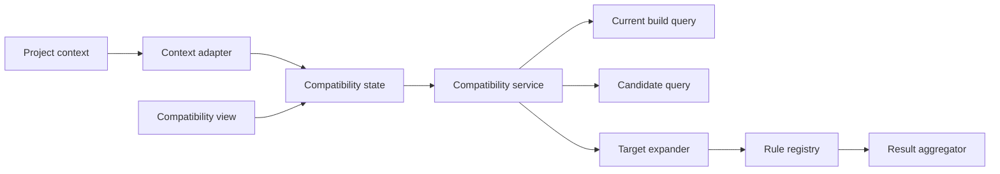
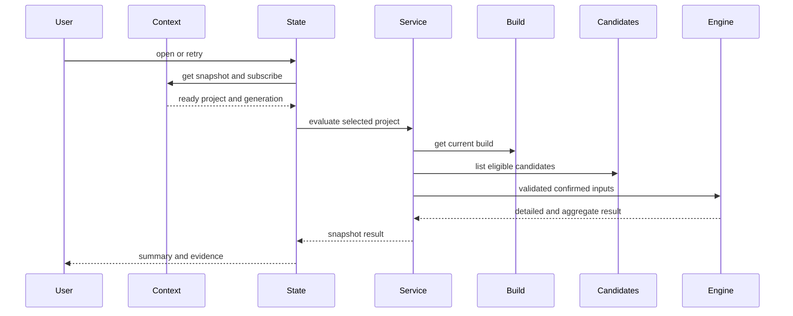

# Design Document

## Overview

本機能は、`project-context` が公開する検証済みの現在プロジェクトに追従し、その現在構成に選択されたパーツとユーザー確認済み正規化属性から、5種類の基本互換性を根拠付きで評価する。`ProjectContextReadPort`、`CurrentBuildQuery`、`CandidateQuery` の読取結果をowner-local adapterで結合し、副作用のないルールエンジンへ渡す。結果は派生データであり永続化しない。

個別規則は等値または集合包含だけを行い、欠損や未確認値を`unknown`として返す。異なる選択候補をペアへ展開した後、集約器が「互換性あり」「互換性なし」「注意事項あり」「情報不足で判定不能」を決定し、side panelへ個別根拠とともに提示する。

### Goals
- 5種類の明確な規格判定を決定的な純粋関数として提供する
- 複数選択と不足情報を隠さず、個別・集約結果を説明可能にする
- 上流データ所有権を守り、変更後に陳腐化しない結果を表示する
- 共通の現在プロジェクトだけを評価し、切替・0件・利用不能を推測なしで扱う
- 日英の根拠表示と、色に依存しない支援技術向け状態通知を提供する

### Non-Goals
- 候補、属性、現在構成の編集または自動修正
- 高度・不確実な互換性規則、候補全組み合わせ、規則DSL
- 判定結果の永続化、外部サービス、商品マスター
- プロジェクト選択、選択preference、共通selector、application shellのproduction composition

## Boundary Commitments

### This Spec Owns
- 5種類のCompatibilityRuleと固定ルールレジストリ
- 現在構成と候補スナップショットの参照検証・判定対象展開
- 個別結果、集約優先規則、根拠・不足項目の表示モデル
- 互換性画面の読込・評価・失敗状態
- `project-context` snapshotを互換性機能用availabilityへ射影するconsumer adapter
- プロジェクト切替世代と評価要求世代を組み合わせたstale結果の破棄
- 互換性画面固有の日英messageとアクセシブルな状態表現

### Out of Boundary
- CurrentBuild、CandidatePart、正規化属性の保存・編集・正規化
- 候補の選択方式、削除・分類変更の調停
- 高度な規則、バックアップ形式、Chrome Storageアクセス
- 現在プロジェクトの選択・修復・fallback、共通selector、context preference
- application shellが所有するsingleton contextとproduction wiring

### Allowed Dependencies
- `current-build-management` の `CurrentBuildQuery` と読取専用スナップショット
- `project-context` の予定公開契約 `ProjectContextReadPort` と `ProjectContextSnapshot`。`ready`の選択IDだけをauthorityとして利用する
- `project-candidate-management` の `CandidateQuery.listBuildEligible`
- `local-data-foundation` のID、カテゴリ、CandidatePart、確認状態、`UtcTimestamp`、Result型（正準型を再定義しない）
- 既存のTypeScript strict、React 19系/React DOM、side panel CSS基盤
- `ui-messages` と `ui-language` の公開resolver/provider
- application shellの`ApplicationFeatureRegistration`、`FeatureMountContext`、operation policy、contract test kit

### Revalidation Triggers
- CurrentBuildQuery、CandidateQuery、CandidatePart、NormalizedAttributes、確認状態の形状変更
- カテゴリ集合、選択数規則、5規則の対象または規格値体系の変更
- 判定結果の保存責任、依存方向、side panel組立契約の変更
- 集約優先規則または「注意事項あり」の意味変更
- `ProjectContextSnapshot`、generation、read port購読契約、current-build側context統合契約の変更
- UI message key、language provider、ARIA live通知規約の変更

## Architecture

### Existing Architecture Analysis

上流は、プロジェクトごとの現在構成をIDと数量で公開し、分類済み候補をCandidatePartとして照会する。Foundationは元表記と確認済み値を分離する。本仕様は保存層を拡張せず、二つの読取契約を結合するfeature serviceと純粋規則を追加する。

### Architecture Pattern & Boundary Map



- **Selected pattern**: 読取feature service + 純粋ルール関数。I/Oと判定を分離する。
- **Dependency direction**: `Foundation and upstream public contracts → Compatibility contracts → Rules and expansion → Service → Context adapter and state → View and registration`。右側は左側だけへ依存する。
- **Boundary rule**: Ruleは確認済み属性の値オブジェクトだけを受け、Repository、DOM、元表記へ依存しない。
- **Simplification**: 固定5規則を共通インターフェースへ登録し、DSL、永続キャッシュ、イベント同期を導入しない。

### Technology Stack

| Layer | Choice / Version | Role in Feature | Notes |
|---|---|---|---|
| Language | TypeScript 7.x strict | 判定契約、純粋規則、状態 | `any`禁止 |
| UI | React 19系 / React DOM / CSS | side panelの結果表示 | 通常のJSX childで描画 |
| Integration | ProjectContextReadPort / CurrentBuildQuery / CandidateQuery | 現在選択と検証済み上流スナップショット | Storage API直接利用なし |
| Localization | ui-messages / ui-language | 日英message解決と再描画 | feature内に文言を直書きしない |
| Test | Node 26標準test runner / testing-library / Playwright 1.61.1 | 規則、service、状態、DOM、E2E | 架空データのみ |

## File Structure Plan

```text
src/features/compatibility/contracts.ts           # 入力、個別・集約結果、エラー型
src/features/compatibility/public.ts              # CompatibilityQueryの唯一の公開入口
src/features/compatibility/feature-contribution.ts # FeatureCompositionContextからFeatureContributionを組み立てる合成入口
src/features/compatibility/registration.ts        # shellへ渡すApplicationFeatureRegistrationと依存組立
src/features/compatibility/rules.ts               # Rule契約と固定5規則
src/features/compatibility/target-expander.ts     # 構成候補の検証とペア展開
src/features/compatibility/aggregator.ts           # 4区分の集約優先規則
src/features/compatibility/service.ts              # 上流照会、評価、公開Query
src/features/compatibility/project-context-adapter.ts # context snapshot購読とavailability射影
src/features/compatibility/state.ts                # context追従、読込、最新性、空・失敗状態
src/features/compatibility/view.tsx                 # 集約結果と根拠のReact component
src/features/compatibility/react-root.tsx           # FeatureMountContextとReact rootの接続・cleanup
src/features/compatibility/styles.css              # 状態区分と詳細表示
tests/features/compatibility/rules.test.ts
tests/features/compatibility/target-expander.test.ts
tests/features/compatibility/aggregator.test.ts
tests/features/compatibility/service.test.ts
tests/features/compatibility/project-context-adapter.test.ts
tests/features/compatibility/state.test.ts
tests/features/compatibility/view.test.ts
tests/features/compatibility/compatibility-flow.integration.test.tsx
tests/features/compatibility/acceptance.test.tsx
e2e/compatibility.spec.ts                           # 共通selector切替、日英、主要結果経路
```

`project-context-adapter.ts`、対応unit test、`e2e/compatibility.spec.ts`を新規作成する。その他の列挙済みcompatibility source/testと両言語message catalogは既存fileを変更する。`project-context` coreとcurrent-buildのcontext consumer更新が完了するまでproduction wiring taskを開始しない。

### Modified Files
- `src/features/compatibility/feature-contribution.ts`、`registration.ts`、`react-root.tsx`: shellから注入された`ProjectContextReadPort`をowner-local adapterとstate lifecycleへ接続し、mount時に購読、unmount時に一度だけ解除する。
- `src/ui-messages/catalog/ja/compatibility.ts`、`src/ui-messages/catalog/en/compatibility.ts`: projectなし、context利用不能、構成空、読込、失敗、再試行、集約・個別根拠の同一key群を追加する。
- `src/application-shell/side-panel-contributions.ts`: application-shell更新specが所有する合成点で、singletonのcontext read port、`CandidateQuery`、`CurrentBuildQuery`を本機能のcontributionへ注入する。本specはこの共有fileを実装所有しない。
- shellが実際にcompositionする入口は`feature-contribution.ts`が返す`FeatureContribution`である。`registration.ts`と`public.ts`はその内部で組み立てられ、featureは`side-panel-contributions.ts`以外の共有side panel runtimeとroot `src/index.ts`を変更しない。

## System Flows



Stateはcontext generationと評価要求番号の組を最新性tokenとして保持し、遅れて完了した旧project・旧要求を破棄する。`empty`はproject 0件、`unavailable`は選択情報利用不能として評価を開始しない。選択を別projectや以前の結果で補わない。上流読取または参照検証が失敗した場合はEngineを呼ばず、以前の結果を最新として表示しない。

## Requirements Traceability

| Requirement | Summary | Components | Interfaces | Flows |
|---|---|---|---|---|
| 1.1, 1.2, 1.3, 1.4, 1.5, 1.6 | 入力限定と再計算 | CompatibilityProjectContextAdapter、CompatibilityService、TargetExpander | ProjectContextReadPort、CompatibilityQuery | context追従・評価 |
| 2.1, 2.2, 2.3, 2.4, 2.5, 2.6 | 固定5規則 | RuleRegistry | CompatibilityRule | 個別判定 |
| 3.1, 3.2, 3.3, 3.4 | 複数選択展開 | TargetExpander | RuleTarget | 対象展開 |
| 4.1, 4.2, 4.3, 4.4, 4.5 | 個別結果と不足 | RuleRegistry | RuleResult | 個別判定 |
| 5.1, 5.2, 5.3, 5.4, 5.5, 5.6 | 集約と根拠 | ResultAggregator、View | CompatibilityReport | 集約・表示 |
| 6.1, 6.2, 6.3, 6.4, 6.5 | 安全な失敗表示 | Service、State、View | CompatibilityError | 読込・表示 |
| 7.1, 7.2, 7.3, 7.4, 7.5, 7.7, 7.8, 7.9 | 現在project追従と回復 | CompatibilityProjectContextAdapter、CompatibilityState、CompatibilityView | ProjectContextReadPort、CompatibilityStateValue | context追従・再試行 |
| 8.1, 8.2, 8.3, 8.4, 8.5 | 日英・アクセシブル操作 | View、Registration | MessageResolver、ARIA state | 表示・通知 |

## Components and Interfaces

| Component | Domain/Layer | Intent | Req Coverage | Key Dependencies | Contracts |
|---|---|---|---|---|---|
| RuleRegistry | Domain | 固定5規則の決定的評価 | 2.1–2.6, 4.1–4.5 | Compatibility contracts P0 | Service |
| TargetExpander | Domain | 参照検証と候補ペア展開 | 1.1–1.3, 3.1–3.4 | upstream snapshots P0 | Service |
| ResultAggregator | Domain | 個別結果の4区分集約 | 5.1–5.4 | RuleResult P0 | Service |
| CompatibilityService | Feature | 上流読取と評価オーケストレーション | 1.1–1.5, 5.5–6.3 | upstream queries P0、domain P0 | Service |
| CompatibilityProjectContextAdapter | Integration | 検証済みcurrent projectの射影と購読 | 1.1, 1.6, 7.1, 7.2, 7.4, 7.5, 7.7, 7.9 | ProjectContextReadPort P0 | Service, State |
| CompatibilityState | UI state | context追従、最新評価、空・失敗状態 | 1.4, 6.1, 6.2, 6.3, 6.4, 7.1, 7.2, 7.3, 7.4, 7.5, 7.7, 7.8, 7.9 | ContextAdapter P0、Service P0 | State |
| CompatibilityView | UI | 日英の集約・根拠・不足・回復表示 | 5.5, 5.6, 6.1, 6.2, 6.3, 6.4, 6.5, 7.3, 7.5, 7.7, 7.8, 7.9, 8.1, 8.2, 8.3, 8.4, 8.5 | State P0、messages P0 | State |
| CompatibilityFeatureRegistration | UI adapter | context購読、state/view/public APIをshell登録契約へ接続 | 1.1, 1.6, 7.1, 7.2, 7.3, 7.4, 7.5, 7.7, 7.8, 7.9, 8.1, 8.2, 8.3, 8.4, 8.5 | ApplicationFeatureRegistration P0、ProjectContextReadPort P0 | Service, State |

### Domain Layer

#### RuleRegistry

| Field | Detail |
|---|---|
| Intent | 型付き対象へ固定5規則を適用する |
| Requirements | 2.1–2.6, 4.1–4.5 |

**Contracts**: Service [x] / API [ ] / Event [ ] / Batch [ ] / State [ ]

```typescript
type RuleId = "cpu-motherboard-socket" | "motherboard-memory-ddr" |
  "cooler-cpu-socket" | "case-motherboard-form-factor" |
  "case-psu-form-factor";
type RuleStatus = "compatible" | "incompatible" | "unknown";

interface CompatibilityRule<TTarget extends RuleTarget = RuleTarget> {
  readonly id: RuleId;
  evaluate(target: TTarget): RuleResult;
}
```

- Preconditions: TargetExpanderが同一プロジェクト・対象カテゴリを保証する。
- Postconditions: 根拠値または不足属性を持つ一つの結果を返す。
- Invariants: 入力変更、副作用、未確認値によるcompatible/incompatible判定を行わない。

#### TargetExpander

```typescript
interface TargetExpander {
  expand(build: CurrentBuildSnapshot, parts: readonly CandidatePart[]):
    Result<readonly RuleTarget[], CompatibilityError>;
}
```

候補IDごとに結合し、各RuleIdの左右カテゴリを直積展開する。数量は対象の存在だけに使用する。カテゴリ欠如はRuleId単位のmissing targetを生成し、不正参照、別project、未分類は全評価を停止する。

#### ResultAggregator

```typescript
type AggregateStatus = "compatible" | "incompatible" | "caution" | "unknown";
interface ResultAggregator {
  aggregate(results: readonly RuleResult[]): AggregateStatus;
}
```

優先規則は`incompatible`、次にcompatibleとunknownの混在を`caution`、全compatibleを`compatible`、残りを`unknown`とする。

### Feature Layer

#### CompatibilityService

```typescript
interface CompatibilityQuery {
  evaluate(projectId: ProjectId): Promise<Result<CompatibilityReport, CompatibilityError>>;
}

interface CompatibilityReport {
  readonly projectId: ProjectId;
  readonly buildUpdatedAt: UtcTimestamp;
  readonly status: AggregateStatus;
  readonly results: readonly RuleResult[];
}
```

**Dependencies**
- Outbound: CurrentBuildQuery — 構成スナップショット (P0)
- Outbound: CandidateQuery — 同一projectの分類済み候補 (P0)
- Outbound: TargetExpander、RuleRegistry、ResultAggregator — 評価 (P0)

構成recordなしは`no-build`、構成recordはあるが選択itemが0件なら`empty-build`、参照不正は`invalid-reference`、上流失敗は`read-failed`として区別する。結果は保存せず、毎回新しい読取から作る。`buildUpdatedAt`は`CurrentBuildSnapshot.currentBuild.updatedAt`（正準`UtcTimestamp`）から採取し、構成が存在しない場合は参照しない。

### UI Layer

#### CompatibilityProjectContextAdapter

```typescript
type CompatibilityProjectAvailability =
  | { readonly status: "ready"; readonly generation: number; readonly projectId: ProjectId }
  | { readonly status: "empty"; readonly generation: number }
  | { readonly status: "unavailable"; readonly generation: number };

interface CompatibilityProjectContextAdapter {
  getCurrent(): CompatibilityProjectAvailability;
  subscribe(listener: (value: CompatibilityProjectAvailability) => void): () => void;
}
```

adapterは予定される`ProjectContextReadPort`だけへ依存し、catalogやpreferenceを複製しない。`ready`の`selectedProjectId`だけを評価対象へ射影し、`empty`と`unavailable`ではprojectを補完しない。同一generation・同一projectの重複通知は再評価を増やさず、解除後の通知はstateを変更しない。

#### CompatibilityState

`idle | loading | ready | no-projects | context-unavailable | empty-build | failed`の判別共用体を保持する。context通知時に以前のreportを直ちに外し、context generationと単調増加する評価要求番号が双方一致する完了だけを`ready`へ反映する。再試行はadapterから最新snapshotを読み直し、現在の`ready` projectだけを再評価する。

#### CompatibilityView

集約status、ルール名、対象パーツ名、比較値、不足項目、理由をmessage catalog経由の日英React componentで表示する。`loading`では以前のreportを最新結果として操作可能にせず、project 0件、context利用不能、構成空、失敗を結果区分から分離する。状態見出しと`role="status"`または適切なlive regionで変化を通知し、再試行はnative buttonとして識別名とkeyboard操作を備える。すべて通常のJSX childとして描画する。

## Data Models

- `RuleTarget`: RuleIdで判別される左右候補ID、表示名、確認済み規格値または明示的欠損。
- `RuleResult`: RuleId、対象候補参照、`compatible | incompatible | unknown`、比較した値、不足フィールド、説明コード。
- `CompatibilityReport`: 構成更新日時、集約status、全個別結果を持つ読取専用派生スナップショット。
- 永続モデルは追加しない。元表記、未確認値、ページHTMLをRuleTargetへ含めない。

## Error Handling

`CompatibilityError`は`no-build`、`empty-build`、`invalid-reference`、`corrupt-data`、`unsupported-data`、`read-failed`を判別する。`no-build`と`empty-build`を構成なしの案内へ、参照不正を修正案内へ、破損・非対応・読取失敗を操作停止表示へ写像する。contextの`empty`と`unavailable`はservice errorへ変換せず、評価前のstateとして保持する。Ruleの属性不足はerrorでなく`unknown`結果とする。ログへパーツ名、URL、属性値、context preferenceを出さない。

## Testing Strategy

- **Unit**: 5規則それぞれで一致、非一致、左右欠損、未確認値を検証し、同じ入力が同じ結果を返すことを確認する。
- **Unit**: 複数メモリ候補の全ペア、数量重複抑止、カテゴリ欠如、不正参照をTargetExpanderで検証する。
- **Unit**: incompatible優先、compatible+unknownのcaution、全compatible、全unknownをAggregatorで検証する。
- **Integration**: CurrentBuildQueryとCandidateQueryの架空スナップショットから全5規則のreportを生成し、上流データが変更されないことを検証する。
- **State/React DOM**: 再評価、旧要求破棄、empty、read failure、安全な文字列描画、集約と個別根拠の同時表示、unmount cleanupを検証する。
- **Contract/Integration**: contextのready Aからready Bへの切替でA結果を即時除去し、遅延A完了を破棄する。empty、unavailable、unavailableからreadyへの回復、最新snapshotを使う再試行、購読解除を検証する。
- **React DOM**: 日英切替、全状態のテキスト識別、live region、keyboardでの再試行、安全なJSX child描画をtesting-libraryとuser-eventで検証する。
- **E2E**: 共通selectorでprojectを切り替え、切替後構成だけが表示されること、不一致、部分不足の注意、全不足の判定不能、project 0件、空構成を確認する。

## Security Considerations

入力は信頼済み拡張コンテキストの公開Queryとcontext read portだけから取得し、Storage APIを直接呼ばない。React componentはframework非依存のCompatibilityStateだけに依存する。ページ由来文字列は規則の断定根拠にせず、通常のJSX childとして表示し、`dangerouslySetInnerHTML`、`innerHTML`、inline handlerを使用しない。

## Performance & Scalability

展開量は5規則に関係する現在構成内の異なる候補ペア数に比例する。数量分の重複評価を行わず、固定5規則を同期的に評価する。候補全体の総当たりは行わない。
