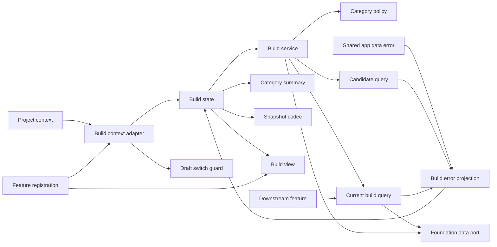
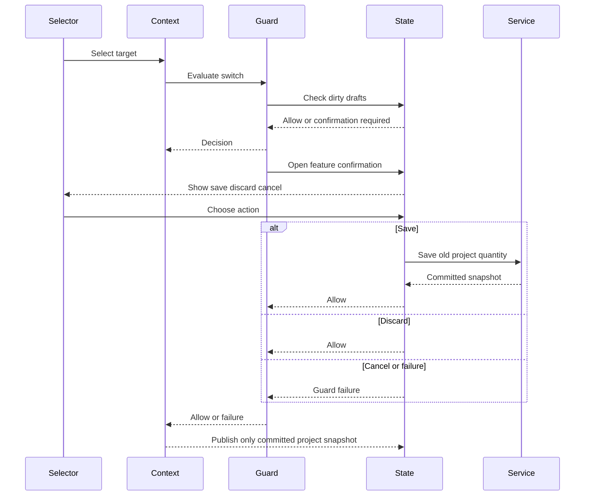
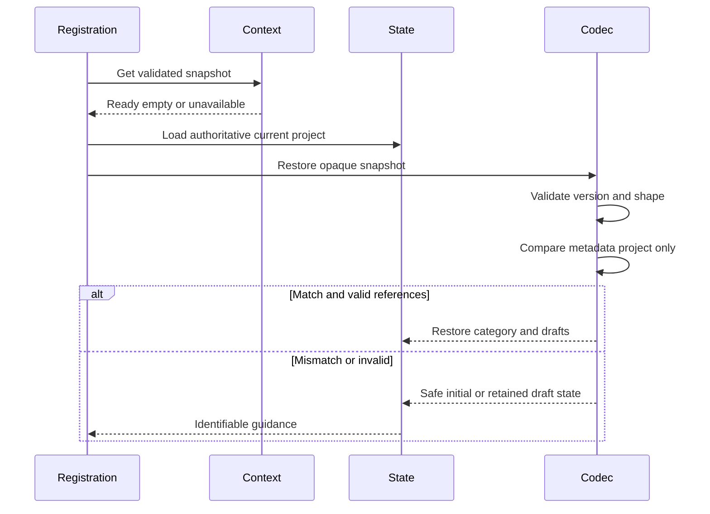

# Design Document

## Overview

本機能は、`project-context` が公開する検証済みの現在projectに追従し、そのproject内の分類済み候補から採用するパーツと数量を管理する。カテゴリ別選択規則、プロジェクトごと最大一つの `CurrentBuild`、数量draft、カテゴリ別選択要約、下流向け読取契約をfeature境界に閉じる。

保存にはlocal data foundationの検証済みroot queryと原子的root mutationを使用する。候補変更・削除・project削除時の参照修復はfoundationへ委譲し、本featureは成功後のreconcile writeを発行しない。既存snapshot version 1とshapeを維持するが、snapshot内の `selectedProjectId` は現在projectとの一致検査だけに使い、選択authorityやfallbackにはしない。

### Goals

- 共通の現在projectだけを対象に、単一・複数選択と正整数数量を一貫して管理する。
- project切替時に未保存数量draftを保存・破棄・取消でき、staleな確認結果を適用しない。
- 全カテゴリの採用パーツと数量を日英・keyboard・読み上げ対応の要約として即時表示する。
- 検証済みの現在構成を下流へ候補参照と数量だけで公開する。
- 共有 `AppDataError` を公開入口から消費し、現在構成固有の回復分類と利用者挙動を意味不変で維持する。

### Non-Goals

- 現在projectのpreference、fallback、共通selector、project CRUDを所有しない。
- 候補の作成・編集、互換性判定、複数構成案、候補比較、自動構成、購入状態を扱わない。
- 保存schema、migration、容量管理、参照修復policy、backup交換形式を再実装しない。
- snapshot fieldの削除、version変更、UI全面刷新を行わない。
- 共有 `AppDataError` のcanonical定義、低位errorからのmapping、種類・意味・粒度を変更しない。

## Change Integration

- **Integrated Change Brief**: `v0.5.0-boundary-reconciliation`
- **In-scope trace**: candidate-owned `ManagementError` importの撤去、domain public `AppDataError` consumer contract、`AppDataErrorProjection`による既存`BuildError`回復分類への意味不変な写像、public/contract test、current-build操作とproject-context追従の非回帰を設計とtask 11へ反映する。
- **Out-of-scope preservation**: `AppDataError`のcanonical定義・`FoundationError`からのmapping・種類・意味・粒度、current-build固有error semantics、構成規則、UI layout、保存schema、project-context/application-shell実装を変更しない。

## Boundary Commitments

### This Spec Owns

- 全 `PartCategory` を `single | multiple | ineligible` へ写像する選択policy。
- projectごと最大一つの `CurrentBuild` と、候補参照・数量の更新規則。
- project-context read/guard portを利用するowner-local adapter、数量draft切替確認、stale抑止。
- current-build UI state、既存shapeのsnapshot codec、カテゴリ別選択要約、操作・回復表示。
- foundationが検証・修復したrootから現在構成を読み、feature不変条件を検証するqueryと下流公開API。
- 共有 `AppDataError` を既存 `BuildError` の回復分類へ投影するconsumer側mappingと、そのexhaustiveness契約。

### Out of Boundary

- 現在projectの選択authority、preference、fallback、generation、共通selector。
- candidate/projectの内容、分類編集、catalog ownership。
- 保存root、schema validation、Chrome Storage、候補・project lifecycleと同一commitの参照修復。
- shellのsingleton composition、project-contextのproduction wiring、互換性結果、backup形式。
- `AppDataError` vocabulary、`FoundationError`から`AppDataError`へのmapping、product local-data adapter、candidate-managementの内部error定義。

### Allowed Dependencies

- `src/domain/public.ts` の `CurrentBuild`、`BuildItem`、各branded ID、`PartCategory`、`PositiveInteger`、`Revision`、canonical `Result`、共有 `AppDataError`。
- `src/persistence/public.ts` のscoped data port、`RootMutationCommand`、commit receipt。
- `src/features/candidate-management/public.ts` の `CandidateQuery.listBuildEligible`。失敗型は共有 `AppDataError` を参照し、candidate-owned共有errorを経由しない。
- `src/project-context/public.ts` の `ProjectContextReadPort`、`ProjectSwitchGuardRegistrationPort`、snapshot/guard型。command portや内部serviceへは依存しない。
- `src/application-shell/public.ts` のfeature registration、mount/capture lifecycle、`OperationPolicy`。
- `src/ui-messages/public.ts`、`src/ui-language/public.ts`、React 19.2.7、React DOM 19.2.7、TypeScript 7.0.2 strict。

### Revalidation Triggers

- `CurrentBuild`、`BuildItem`、foundation mutation/error、candidate queryのshape変更。
- project-context snapshot、generation、guard evaluate/forced通知、登録解除契約の変更。
- snapshot version 1または `selectedProjectId` metadataのshape変更。
- カテゴリ集合、選択方式、候補/project削除時の修復policy変更。
- shell mount/capture、operation policy、message/language、下流公開APIの変更。
- `AppDataError`のvariant、payload、判定context、domain public export、またはcandidate queryの失敗contract変更。

## Architecture

### Existing Architecture Analysis

既存実装はfeature service、framework非依存state、React view、snapshot-aware registrationへ分離されている。一方で `BuildState.load()` がproject一覧先頭へfallbackし、`BuildView` が独自project selectorを描画し、registrationがsnapshotのprojectへ先に切り替えるため、現行要件の共通authorityと衝突する。またカテゴリnavigationは名前だけで、全カテゴリの採用内容を俯瞰できない。

`project-context` は `ready | empty | unavailable`、単調増加generation、read subscription、switch guard registrationを公開する。current-buildはowner-local `CurrentBuildProjectContextAdapter` でread portを購読し、ready時だけ候補・構成をloadする。empty/unavailableでは独自fallbackをせずproject固有操作を停止する。guardはdraft内容を渡さず確認要否だけを返し、保存・破棄・取消はfeature stateが所有する。

v0.5.0ではcandidate queryのdata operation failureをcandidate-owned `ManagementError`からdomain public `AppDataError`へ差し替える。`AppDataErrorProjection`は共有errorの全variantをexhaustiveに受け、既存の`BuildError`回復分類へ写像する。current-build固有のvalidation、candidate不存在、カテゴリ規則違反は引き続き`BuildError`が所有し、共有errorへ逆流させない。低位`FoundationError`から共有errorへの一対一mappingはlocal-data-foundationだけが所有する。

### Architecture Pattern & Boundary Map



- **Selected pattern**: feature service + external-store state + owner-local context adapter + snapshot-aware registration。
- **Dependency direction**: `domain/foundation/project-context public contracts → error projection/policy/query/context adapter → service/state → view/registration`。各層は左側だけをimportし、current-buildからcandidate-owned error定義またはfoundation内部mappingへ依存しない。
- **Selection authority**: stateの `selectedProjectId` はcontext snapshotからのprojectionであり、UIやsnapshotから設定しない。
- **Mutation rule**: commandのproject ID、contextのready snapshot、load済みrevisionが同じ場合だけcreate/updateを発行する。
- **Repair rule**: lifecycle修復後はqueryだけを再実行し、追加mutationを行わない。

### Technology Stack

| Layer | Choice / Version | Role | Deviation |
|---|---|---|---|
| Language | TypeScript 7.0.2 strict | 型付きcontract、state、policy | `any`禁止 |
| UI | React / React DOM 19.2.7、CSS | side panel表示 | 新規依存なし |
| Context | project-context public ports | 現在project追従とguard登録 | command port不使用 |
| Data | Foundation scoped data port | queryと原子的mutation | Storage直接利用なし |
| Test | Node test runner、tsx、jsdom、Playwright 1.61.1 | unit、contract、DOM、E2E | 架空fixtureのみ |

## File Structure Plan

```text
src/features/current-build/contracts.ts               # command、snapshot、error、公開query型を変更
src/features/current-build/public.ts                  # 下流向けread-only APIを維持
src/features/current-build/error-mapping.ts           # 新規: AppDataErrorから既存BuildErrorへのexhaustiveな意味不変projection
src/features/current-build/category-policy.ts         # カテゴリ選択方式を維持
src/features/current-build/query.ts                   # project別構成とfeature不変条件を検証
src/features/current-build/service.ts                 # create/update mutationとcontext一致前提
src/features/current-build/project-context-adapter.ts # 新規: read購読、guard登録、generation/stale調停
src/features/current-build/category-summary.ts        # 新規: 全カテゴリの安全な日英非依存要約model
src/features/current-build/state.ts                   # context追従、draft確認、要約、保存状態を変更
src/features/current-build/state-snapshot.ts          # v1 shape維持、一致検査専用project metadataへ変更
src/features/current-build/view.tsx                   # 独自selector撤去、要約、確認UI、状態案内を変更
src/features/current-build/styles.css                 # 要約省略、確認、focus/状態表現を変更
src/features/current-build/registration.ts            # adapter lifecycle、capture/restore、cleanupを変更
src/features/current-build/feature-contribution.ts    # project-context read/guard port注入を変更
src/ui-messages/catalog/ja/build.ts                   # 新規または変更: current-build日本文言
src/ui-messages/catalog/en/build.ts                   # 新規または変更: current-build英語文言
tests/features/current-build/project-context-adapter.test.ts
tests/features/current-build/category-summary.test.ts
tests/features/current-build/state.test.ts
tests/features/current-build/state-snapshot.test.ts
tests/features/current-build/view.test.tsx
tests/features/current-build/registration.test.tsx
tests/features/current-build/current-build-flow.integration.test.tsx
tests/features/current-build/reference-repair.integration.test.ts
tests/features/current-build/error-mapping.test.ts    # 新規: 全共有variantと既存回復分類のcontract
tests/tooling/public-api-consumer.ts                   # 必要時: 公開consumer契約を更新
e2e/current-build.spec.ts                             # 共通project切替と要約の横断flowを変更
e2e/models/current-build.ts                           # E2E操作modelを変更
```

`src/project-context/*`、`src/application-shell/*`、root runtimeは本specの所有外であり、必要なproduction injectionはapplication shell側のdownstream taskで行う。

## System Flows

### Project切替と数量draft



adapterはguard評価ごとのowner-local token、base generation、from/toを保持する。guardの `evaluate` はfeature確認の完了を待ち、保存成功または破棄時だけ `allow`、cancel・validation/save failure・stale時はtyped failureを返す。これによりproject-contextはpreferenceとselectionを未確定のまま維持する。catalog invalidationによるforced通知ではdraftを新projectへ保存せず、隔離したdraftと継続案内を表示する。

### Snapshot復元



## Requirements Traceability

| Requirement | Summary | Components | Interfaces / Flows |
|---|---|---|---|
| 1.1, 1.2, 1.3, 1.4, 1.5, 1.6 | 共通project別表示 | ContextAdapter、BuildState、BuildView | context read、load flow |
| 2.1, 2.2, 2.3, 2.4, 2.5 | 単一選択 | CategoryPolicy、BuildService | `BuildCommand` |
| 3.1, 3.2, 3.3, 3.4, 3.5, 3.6 | 複数選択と数量 | CategoryPolicy、BuildService、BuildState | mutation flow |
| 4.1, 4.2, 4.3, 4.4, 4.5 | lifecycle整合性 | CurrentBuildQuery、BuildState | repaired root reload |
| 5.1, 5.2, 5.3, 5.4, 5.5 | 保存・回復 | BuildService、BuildState、BuildView | mutation result、operation policy |
| 6.1, 6.2, 6.3, 6.4 | 下流契約 | CurrentBuildQuery、CurrentBuildPublicApi | `CurrentBuildSnapshot` |
| 7.1, 7.2, 7.3, 7.4, 7.5, 7.6, 7.7, 7.8 | draft保護 | ContextAdapter、BuildState、BuildView | guard flow、confirmation state |
| 8.1, 8.2, 8.3, 8.4, 8.5 | 非権威snapshot metadata | SnapshotCodec、Registration、BuildState | snapshot restore flow |
| 9.1, 9.2, 9.3, 9.4, 9.5, 9.6, 9.7, 9.8, 9.9 | カテゴリ要約 | CategorySummary、BuildState、BuildView | summary projection、DOM |
| 10.1, 10.2, 10.3, 10.4, 10.5, 10.6 | 共有error consumer移行 | AppDataErrorProjection、BuildService、CurrentBuildQuery | domain public `AppDataError`、consumer contract |

## Components and Interfaces

| Component | Domain/Layer | Intent | Requirements | Key Dependencies | Contracts |
|---|---|---|---|---|---|
| CategoryPolicy | Feature | 全カテゴリの選択方式 | 2.1–2.5, 3.1–3.6 | domain P0 | Service |
| CurrentBuildQuery | Feature | 構成照会と不変条件検証 | 1.1–1.5, 4.1–4.5, 6.1–6.4 | data port P0 | Service |
| BuildService | Feature | 選択操作をmutationへ変換 | 2.2–3.6, 5.1–5.5, 7.3–7.4 | policy/query/data P0 | Service |
| CurrentBuildProjectContextAdapter | Integration | authority追従とdraft guard調停 | 1.1, 1.5, 1.6, 7.1–7.8, 8.2–8.4 | context read/guards P0 | Service, State |
| CategorySummary | Presentation model | 全カテゴリの採用要約 | 9.1–9.9 | candidates/build/messages P0 | Service |
| BuildState | UI state | load、draft、保存、確認、要約 | 1.1–5.5, 7.1–7.8, 9.1–9.5 | adapter/service/query P0 | State |
| BuildStateSnapshotCodec | UI state | v1 snapshot検証と非権威復元 | 8.1–8.5 | state/context snapshot P0 | State |
| BuildView | UI | 選択、数量、要約、確認、案内 | 1.2–1.6, 3.3–3.5, 5.3–5.5, 7.2–7.7, 9.1–9.9 | state/messages P0 | State |
| Registration | UI adapter | mount、context lifecycle、snapshot、cleanup | 1.1, 5.2, 7.7–7.8, 8.1–8.5 | shell/context/view P0 | Service, State |
| AppDataErrorProjection | Feature integration | 共有data operation errorを既存BuildError回復分類へ写像 | 10.1–10.6 | domain public AppDataError P0 | Service |

### Feature Layer

#### AppDataErrorProjection

```typescript
interface AppDataErrorProjection {
  toBuildError(error: AppDataError): BuildError;
}
```

`src/domain/public.ts`からだけ`AppDataError`をimportし、全variantをexhaustiveに処理する。既存の利用者挙動を維持するため、unsupported version・migration failureは`unsupported-data`、revision・request conflictは`conflict`、maintenance active・stale fenceは`maintenance`、quota exceededは`quota`、access・lock・storage unavailableは`storage`へ写像する。validation、corrupt data、repair failure、および従来mapperが個別の回復分類を持たなかったrecovery・assessment・finalization系variantは、既存どおり`corrupt-data`へ明示的に写像する。variantの欠落をdefault分岐で`corrupt-data`へ推測せず、型検査またはconsumer contract testで未対応を検出する。

このprojectionは共有errorのcanonical意味を定義しない。数量validation、選択候補不存在、カテゴリ規則違反は従来どおりcurrent-build側で直接`BuildError`を生成する。candidate query、current-build query、mutation portのdata operation failureだけがこのprojectionを利用する。

#### CategoryPolicy

```typescript
type SelectionMode = "single" | "multiple" | "ineligible";
interface CategoryPolicy {
  modeFor(category: PartCategory): SelectionMode;
}
```

CPU、CPUクーラー、マザーボード、電源、ケースはsingle、メモリ、GPU、ストレージ、ケースファン、拡張カード、その他はmultiple、未分類はineligibleとする。singleは数量1固定、multipleは正整数のみ許可する。

#### CurrentBuildQuery

```typescript
interface CurrentBuildQuery {
  getByProject(projectId: ProjectId): Promise<Result<CurrentBuildSnapshot, BuildError>>;
}
interface CurrentBuildSnapshot {
  readonly revision: Revision;
  readonly currentBuild: Readonly<CurrentBuild> | null;
}
```

同じroot内のproject、candidate、currentBuildを照合する。project別複数build、重複candidate ID、別project・不存在・未分類参照、カテゴリ選択数違反、不正数量は `corrupt-data` とし、採用品を表示せずmutationを停止する。

#### BuildService

```typescript
type BuildCommand =
  | { readonly type: "select"; readonly projectId: ProjectId; readonly candidatePartId: CandidatePartId }
  | { readonly type: "set-quantity"; readonly projectId: ProjectId; readonly candidatePartId: CandidatePartId; readonly quantity: number }
  | { readonly type: "set-quantities"; readonly projectId: ProjectId; readonly quantities: Readonly<Record<CandidatePartId, number>> }
  | { readonly type: "remove"; readonly projectId: ProjectId; readonly candidatePartId: CandidatePartId };

interface BuildMutationContext {
  readonly requestId: RequestId;
  readonly expectedRevision: Revision;
}
```

候補照会依存の失敗型はcandidate-owned `ManagementError`ではなく共有`AppDataError`とする。`BuildService`は候補照会とfoundation data portから返る共有errorを同じ`AppDataErrorProjection`へ渡し、その後の選択・数量・revision規則を変更しない。candidate queryが返す候補固有の契約違反を新しい共有errorへ吸収しない。

command projectがcontextのready selectionと一致することはstate/adapter境界で保証し、serviceは候補照合とrevisionを再検証する。`set-quantities` は全dirty draftを検証後、一つの `CurrentBuild` updateにまとめるため、switch前保存は全件成功または全件不変となる。初回は新IDでcreate、既存時はIDを保持してupdateする。失敗時は直前snapshotを保持し、成功時はcommit後queryだけを返す。

#### CurrentBuildProjectContextAdapter

```typescript
type BuildProjectAvailability =
  | { readonly status: "ready"; readonly generation: number; readonly projectId: ProjectId }
  | { readonly status: "empty"; readonly generation: number }
  | { readonly status: "unavailable"; readonly generation: number };

interface CurrentBuildProjectContextAdapter {
  getCurrent(): BuildProjectAvailability;
  subscribe(listener: (value: BuildProjectAvailability) => void): () => void;
  registerDraftGuard(owner: BuildDraftGuardOwner): Result<() => void, BuildContextAdapterError>;
}

interface BuildDraftGuardOwner {
  evaluate(change: ProjectSwitch): Promise<Result<"allow", BuildContextAdapterError>>;
  notifyForced(change: ProjectSwitch): void;
}
```

adapterはcontextのcatalogを複製せず、current-buildが必要とするavailability、generation、project IDだけを射影する。guard IDはfeature内でstableにし、unmountで解除する。adapterはguard評価中にowner-local確認を起動するが、project-contextへdraft内容、選択肢、保存関数を渡さない。

#### CategorySummary

```typescript
interface CategorySelectionSummary {
  readonly category: PartCategory;
  readonly items: readonly {
    readonly candidatePartId: CandidatePartId;
    readonly name: string;
    readonly quantity: PositiveInteger;
  }[];
  readonly accessibleText: string;
  readonly isEmpty: boolean;
}
```

全選択可能カテゴリをcanonical順で返す。singleは選択名、multipleは全名称と数量、空は未選択を表す。文字列省略はCSSによる視覚表現に限定し、accessible nameには完全な安全なtextを残す。HTMLとして解釈しない。

### UI Layer

#### BuildState

context subscriptionの確定済みgenerationだけを適用し、ready時に候補と構成を並列loadする。empty/unavailableではproject IDをnullにし、候補・構成・mutationを無効化する。選択・解除・数量保存成功後に同じstate updateでカテゴリ要約を再計算する。

dirty draftは保存済み数量と異なる入力だけを指す。switch確認stateはowner-local token、from/to、base generation、対象draftを保持する。saveは全dirty draftを先に検証し、`set-quantities` により旧projectの一つの `CurrentBuild` updateへまとめる。全件commit後だけguardをallowし、失敗時は入力と旧projectを保持する。discardは対象draftを破棄してallowし、cancelはtyped guard failureとして切替を中止する。

forced変更ではdraftを隔離した `orphanedDraft` 表示状態へ移し、新projectへ暗黙保存しない。利用者が明示的に破棄するまで内容を保持する。

#### BuildStateSnapshotCodec

```typescript
interface BuildStateSnapshot {
  readonly version: 1;
  readonly selectedProjectId: ProjectId | null;
  readonly selectedCategory: PartCategory | null;
  readonly quantityDrafts: Readonly<Record<string, string>>;
}
```

shapeとversionは変更しない。restoreは入力を `unknown` としてstrictに検証し、`selectedProjectId` が現在のready projectと一致する場合だけcategoryと参照可能なdraftを復元する。不一致、不存在、empty/unavailableではprojectを変更せず、安全な初期状態またはforced切替で保持中のdraftを維持して案内する。不正値は永続データを変更せず拒否する。

#### BuildView

独自project selectorを描画しない。contextのready/empty/unavailable状態、候補空、構成空、保存・validation error、switch確認を区別して表示する。カテゴリbuttonはcategory名と要約を同じ操作内に持ち、keyboard focusと `aria-current` を維持する。省略表示でもscreen reader向けtextは全件を識別できる。

#### CurrentBuildFeatureRegistration

mount時にcontext adapter購読とguardを登録し、authoritative projectをloadしてからsnapshotを検査する。captureは既存v1 shapeだけを返す。unmountはcontext購読、guard登録、operation policy購読、state listener、React rootを各一度だけ解放する。

## Data Models

- 永続モデルはfoundationの `CurrentBuild { id, projectId, items, updatedAt }` と `BuildItem { candidatePartId, quantity }` を変更せず利用する。
- project context generation、switch confirmation、category summary、orphaned draftはUI/integration stateであり保存rootへ追加しない。
- `BuildError` はvalidation、not-found、conflict、maintenance、corrupt-data、unsupported-data、quota、storageを判別し、既存shapeを変更しない。
- `AppDataError` はlocal-data-foundationが所有する共有consumer errorであり、永続modelへ保存せず、current-buildは定義・再export・低位error mappingを所有しない。
- current buildに候補詳細、project metadata、互換性結果を複製しない。

## Error Handling

数量validation/save failureはdraftと旧projectを保持し、switchを完了しない。context empty/unavailableは独自fallbackなしで操作不能理由を示す。stale confirmationはstate/preference/draftを変更せず再操作を案内する。破損・非対応・storage利用不能では既存rootを上書きせずmutationを停止する。ログにはproject/candidate名、ID、URL、draft、snapshot、例外objectを出さずstable codeだけを用いる。

共有`AppDataError`は`AppDataErrorProjection`を一度通して既存`BuildError`へ変換する。同じ共有variantは候補照会、構成照会、mutationのどの入口でも同じ回復分類になる。未知variantを既存分類へ推測するfallbackは持たず、共有contract変更時は型検査・contract gateを失敗させて再validationを要求する。

## Testing Strategy

- **Policy/service unit**: 全category、single置換・解除、multiple追加・重複防止・数量、create/update、revision、失敗時不変性を検証する。
- **Context adapter/state**: ready/empty/unavailable、generation順、no fallback、guard allow/confirm、save/discard/cancel、validation/save failure、stale request、forced変更、unmount解除を検証する。
- **Snapshot**: v1 exact shape、project一致時だけの復元、不一致・不存在・unavailable・invalid shape/version/reference拒否、永続状態不変を検証する。
- **Summary/DOM**: single名、multiple全件と数量、未選択、成功直後更新、長文省略、日英、keyboard、accessible name、markup風名称のtext表示を検証する。
- **Foundation integration**: 候補の分類変更・未分類化・削除、project削除を同一commitで修復し、current-buildから追加writeしないことを検証する。
- **Contract/E2E**: 共通selectorによるproject切替、draft確認3分岐、再起動復元、snapshot rollback、カテゴリ要約、下流queryを架空データで検証する。
- **Shared error contract**: `AppDataError`全variantのexhaustive projection、candidate-owned `ManagementError` import不在、candidate query/query/mutationで同じ既存回復分類になることをpositive/negative consumer fixtureで検証する（10.1–10.5）。
- **Non-regression**: current project追従、単一・複数選択、数量、参照修復、snapshot v1、日英表示、失敗時の既存data/draft保持を既存suiteで再実行する（10.6）。

## Security & Performance

外部由来名称は通常のJSX childとして描画し、`dangerouslySetInnerHTML`、`innerHTML`、inline scriptを使用しない。保存はfoundation port、project追従はproject-context public portに限定する。context通知ごとにgenerationを比較して不要な再loadを避け、カテゴリ要約はload済みcandidate mapとcurrent buildから線形時間で導出する。数量保存中とswitch確認中は重複操作を抑止する。
