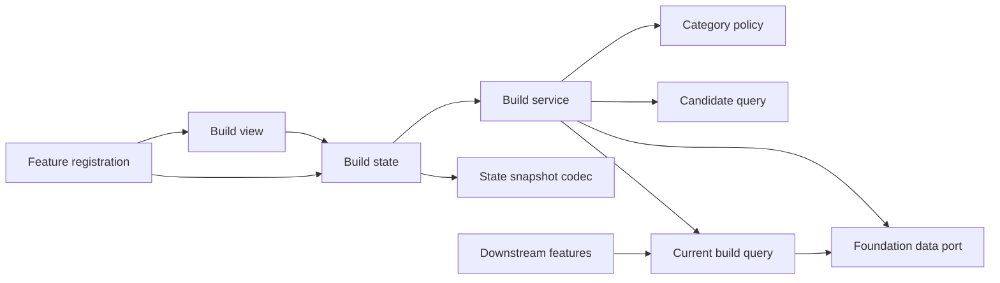
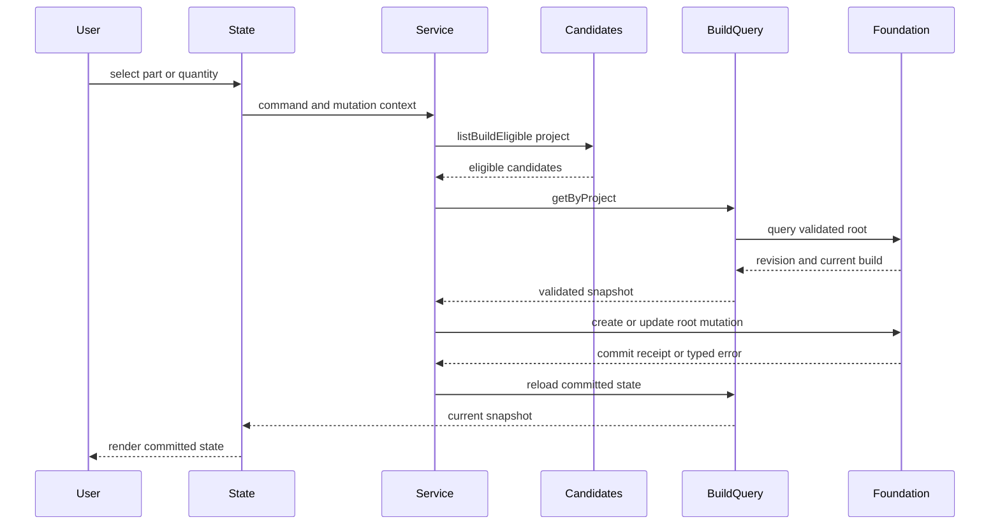

# Design Document

## Overview

本機能は、プロジェクト内の分類済み候補から現在採用するパーツと数量をサイドパネルで管理する。`project-candidate-management` が公開する候補照会と、`local-data-foundation` の検証済みroot queryおよび原子的root mutationを利用し、カテゴリ選択ポリシー、プロジェクトごと最大一つの`CurrentBuild`、修復済み構成の表示状態を提供する。

設計は既存のfeature service + UI state + shell registrationパターンを踏襲する。構成データにはFoundationの`CurrentBuild`、`BuildItem`をそのまま利用し、候補詳細や互換性結果を複製しない。候補・projectの変更に伴う参照修復はFoundationへ委譲し、本featureは成功後のreconcile writeを発行しない。

### Goals
- カテゴリ別の単一・複数選択と数量を一貫して適用する
- 候補変更・削除・project削除後も原子的に修復された現在構成を表示する
- 下流が利用できる検証済みのプロジェクト別現在構成契約を公開する

### Non-Goals
- 候補やprojectの作成・編集、互換性判定、複数構成案、購入管理
- 保存基盤、スキーマ移行、容量管理、参照修復policyの再実装
- 候補属性または互換性結果の構成データへの複製

## Boundary Commitments

### This Spec Owns
- 全`PartCategory`を`single`、`multiple`、`ineligible`へ写像する選択ポリシー
- プロジェクトごと最大一つの`CurrentBuild`と、候補参照・数量の更新規則
- Foundationが検証・修復したrootから現在構成を読み、feature固有不変条件を検証するquery
- 現在構成UI状態、opaque rollback snapshot、操作表示、下流向け読取契約

### Out of Boundary
- 候補パーツとprojectの内容、分類編集、候補照会の所有
- 保存ルート、schema validation、容量、移行、Chrome Storageアクセス
- 候補変更・候補削除・project削除と同一commitで行う参照修復・カスケードpolicy
- shellによるfeature composition、互換性規則、判定結果、バックアップ形式

### Allowed Dependencies
- `src/domain/public.ts` が公開する`CurrentBuild`、`CurrentBuildId`、`BuildItem`、`CandidatePartId`、`ProjectId`、`PartCategory`、`PositiveInteger`、`RequestId`、`Revision`、`UtcTimestamp`、canonical `Result`
- `src/persistence/public.ts` が公開する`FoundationDataPort`、`RootMutationCommand`とcommit receipt
- `src/features/candidate-management/public.ts` の`CandidateManagementPublicApi.query`から得る`CandidateQuery.listBuildEligible`
- `application-shell/public.ts` の`ApplicationFeatureRegistration`、`FeatureMountContext.restoredState`、`FeatureMountHandle.captureState`、`OperationPolicy`
- React 19系、React DOM、CSS、およびテスト時だけのapplication shell contract test kit

### Revalidation Triggers
- `CurrentBuild`、`BuildItem`、`RootMutationCommand`、commit receipt、Foundation errorの形状変更
- `CandidateQuery.listBuildEligible`または`CandidatePart.category`の形状変更
- カテゴリ集合、カテゴリ別選択方式、候補・project削除時の修復policy変更
- shellのmount、opaque snapshot rollback、operation policy、公開API composition契約の変更
- 下流向け現在構成契約またはデータ所有・依存方向の変更

## Architecture

### Existing Architecture Analysis

Foundationは検証済み`LocalDataRoot`へのquery、同一projectの候補参照、正整数数量、候補・project変更時の参照修復、revision付き直列mutationを提供する。一方、projectごと最大一つの構成、候補ID重複、カテゴリ別選択数はfeature固有規則でありFoundationは保証しない。Candidate managementは分類済み候補だけを返す`listBuildEligible`を公開する。Application shellはopaque stateのcaptureとactivation失敗時のrestoreを含むmount lifecycleを提供する。

本仕様はこれらの公開契約を拡張せず、query結果に対するfeature不変条件の検証と、`currentBuild`のcreate/update command組立を所有する。Foundationの専用「修復済みquery」は想定せず、同一transactionで修復済みとなった検証済みrootを通常の`FoundationDataPort.query`で読む。

### Architecture Pattern & Boundary Map



- **Selected pattern**: feature service + UI state + snapshot-aware registration。業務規則、永続化連携、表示状態、shell lifecycleを分離する。
- **Dependency direction**: `Foundation/domain contracts → Candidate query / Build contracts → Policy / Query → Service → State → View / Registration`。右側は左側だけへ依存する。
- **Mutation rule**: 未作成projectでは新しい`CurrentBuildId`で`create`し、既存projectでは同じIDを保持して`update`する。常に`requestId`と読込時の`Revision`を`RootMutationCommand`へ渡す。
- **Integrity rule**: queryはproject別構成が0または1件、item IDが一意、候補が同一projectかつ分類済み、カテゴリ別選択数と数量がpolicyに適合することを検証する。
- **Repair rule**: 候補変更・削除・project削除時の参照修復はFoundationが同じroot mutation内で完了する。本featureは追加writeを行わず、再queryでcommit済み状態を反映する。

### Technology Stack

| Layer | Choice / Version | Role in Feature | Notes |
|---|---|---|---|
| Language | TypeScript 7.x strict | ポリシー、コマンド、結果型 | `any`禁止、canonical branded typeを再利用 |
| UI | React 19系 / React DOM / CSS | side panel内の構成画面 | 既存mount契約を維持 |
| Data | FoundationDataPort | 検証済みroot query・原子的root mutation | Storage API直接利用なし |
| Integration | CandidateQuery | project別の分類済み候補照会 | 新規依存なし |
| Test | Node.js test runner / tsx / jsdom | unit、contract、DOM統合 | E2EはPlaywright、架空データのみ |

## File Structure Plan

```text
src/features/current-build/contracts.ts        # command、snapshot、error、公開query型
src/features/current-build/public.ts           # CurrentBuildPublicApiとCurrentBuildQueryの公開入口
src/features/current-build/registration.ts     # shell registration、React root、snapshot capture/restore、cleanup
src/features/current-build/category-policy.ts  # 全PartCategoryの選択方式を一元化
src/features/current-build/service.ts          # create/update operationを組み立てる構成mutation
src/features/current-build/query.ts            # project別構成queryとfeature不変条件の検証
src/features/current-build/state.ts            # 読込、保存中、競合、エラー、表示state
src/features/current-build/state-snapshot.ts   # opaque UI snapshotのcaptureとunknown検証
src/features/current-build/view.tsx            # カテゴリ別候補と構成操作のReact component
src/features/current-build/styles.css          # 構成画面と状態表現
tests/features/current-build/category-policy.test.ts
tests/features/current-build/service.test.ts
tests/features/current-build/query.test.ts
tests/features/current-build/state.test.ts
tests/features/current-build/state-snapshot.test.ts
tests/features/current-build/view.test.tsx
tests/features/current-build/registration.test.tsx
tests/features/current-build/current-build-flow.integration.test.tsx
```

### Modified Files
- 共有`src/index.ts`、`src/runtime/*`、`src/application-shell/*`、`side-panel.html`は本featureから変更しない。application shell所有のcompositionがfeatureのregistrationとpublic API contributionを受け取る。

## System Flows



Stateは読込snapshotの`revision`をmutation contextへ渡す。競合時は保存前表示を維持し再読込を案内する。候補変更・削除・project削除ではFoundationの同一commit内修復後にqueryだけを再実行し、reconcile mutationを発行しない。

## Requirements Traceability

| Requirement | Summary | Components | Interfaces | Flows |
|---|---|---|---|---|
| 1.1, 1.2, 1.3, 1.4 | プロジェクト・カテゴリ別表示 | BuildState、BuildView | BuildViewModel | 読込 |
| 2.1, 2.2, 2.3, 2.4, 2.5 | 単一選択 | CategoryPolicy、BuildService | BuildCommand | create/update |
| 3.1, 3.2, 3.3, 3.4, 3.5, 3.6 | 複数選択と数量 | CategoryPolicy、BuildService | BuildCommand | create/update |
| 4.1, 4.2, 4.3, 4.4, 4.5 | 候補変更時の整合性 | CurrentBuildQuery、BuildState | FoundationDataPort query | 修復済み再読込 |
| 5.1, 5.2, 5.3, 5.4, 5.5 | 保存・復元・失敗回復 | BuildService、BuildState、BuildView | BuildMutationContext、BuildError | 保存・再読込 |
| 6.1, 6.2, 6.3, 6.4 | 下流契約 | CurrentBuildQuery、CurrentBuildPublicApi | CurrentBuildSnapshot | 読取 |

## Components and Interfaces

| Component | Domain/Layer | Intent | Req Coverage | Key Dependencies | Contracts |
|---|---|---|---|---|---|
| CategoryPolicy | Feature | カテゴリ別選択方式 | 2.1–2.5, 3.1–3.6 | PartCategory P0 | Service |
| CurrentBuildQuery | Feature | rootから構成を読みfeature不変条件を検証 | 1.1–1.4, 4.1–4.5, 6.1–6.4 | FoundationDataPort P0、CategoryPolicy P0 | Service |
| BuildService | Feature | 利用者操作をcurrentBuild root mutationへ変換 | 2.2–3.6, 5.1–5.5 | Policy P0、CandidateQuery P0、CurrentBuildQuery P0、FoundationDataPort P0 | Service |
| BuildState | UI state | 読込、保存、競合、失敗回復 | 1.1–1.4, 4.2–5.5 | Service P0、Query P0 | State |
| BuildStateSnapshotCodec | UI state | rollback用opaque stateの検証・復元 | 1.1, 1.2, 5.2, 5.3 | BuildState P0 | State |
| BuildView | UI | 候補、選択、数量、案内表示 | 1.1–5.5 | BuildState P0 | State |
| CurrentBuildFeatureRegistration | UI adapter | public API、availability、mount、snapshot、cleanupをshellへ接続 | 1.1–6.4 | ApplicationFeatureRegistration P0、BuildView P0、SnapshotCodec P0 | Service, State |

### Feature Layer

#### CategoryPolicy

| Field | Detail |
|---|---|
| Intent | 全カテゴリを選択方式へ網羅的に写像する |
| Requirements | 2.1–2.5, 3.1–3.6 |

**Contracts**: Service [x] / API [ ] / Event [ ] / Batch [ ] / State [ ]

```typescript
type SelectionMode = "single" | "multiple" | "ineligible";

interface CategoryPolicy {
  modeFor(category: PartCategory): SelectionMode;
}
```

canonical literal `uncategorized`だけを`ineligible`とする。単一カテゴリは数量1固定、複数カテゴリは`PositiveInteger`を許可する。`PART_CATEGORIES`追加時に未処理分岐を型検査と網羅testで検出する。

#### CurrentBuildQuery

| Field | Detail |
|---|---|
| Intent | UIと下流へ検証済みの現在構成スナップショットを返す |
| Requirements | 1.1–1.4, 4.1–4.5, 6.1–6.4 |

**Dependencies**
- Outbound: FoundationDataPort — 検証済みroot snapshotのquery (P0)
- Outbound: CategoryPolicy — feature固有選択不変条件 (P0)

**Contracts**: Service [x] / API [ ] / Event [ ] / Batch [ ] / State [ ]

```typescript
interface CurrentBuildQuery {
  getByProject(projectId: ProjectId): Promise<Result<CurrentBuildSnapshot, BuildError>>;
}

interface CurrentBuildSnapshot {
  readonly revision: Revision;
  readonly currentBuild: Readonly<CurrentBuild> | null;
}
```

query callbackは同じroot内のproject、candidate、currentBuildを照合する。構成なしは正常な`null`である。複数構成、重複`candidatePartId`、未分類候補、カテゴリ選択数違反は`corrupt-data`として返し、採用品を表示せずmutationを停止する。公開値の`BuildItem`はcanonicalな`candidatePartId`と`PositiveInteger`を維持し、候補詳細と互換性結果を含めない。

#### BuildService

| Field | Detail |
|---|---|
| Intent | 有効な利用者選択変更をRootMutationCommandへ変換する |
| Requirements | 2.2–3.6, 5.1–5.5 |

**Dependencies**
- Outbound: CategoryPolicy — 選択方式 (P0)
- Outbound: CandidateQuery — 同一projectの分類済み候補 (P0)
- Outbound: CurrentBuildQuery — current buildとroot revision (P0)
- Outbound: FoundationDataPort — `currentBuild` create/update mutation (P0)

**Contracts**: Service [x] / API [ ] / Event [ ] / Batch [ ] / State [ ]

```typescript
type BuildCommand =
  | { readonly type: "select"; readonly projectId: ProjectId; readonly candidatePartId: CandidatePartId }
  | { readonly type: "set-quantity"; readonly projectId: ProjectId; readonly candidatePartId: CandidatePartId; readonly quantity: number }
  | { readonly type: "remove"; readonly projectId: ProjectId; readonly candidatePartId: CandidatePartId };

interface BuildMutationContext {
  readonly requestId: RequestId;
  readonly expectedRevision: Revision;
}

interface BuildService {
  execute(command: BuildCommand, context: BuildMutationContext): Promise<Result<CurrentBuildSnapshot, BuildError>>;
}
```

- Preconditions: queryのrevisionと`expectedRevision`が一致し、projectと候補が一致し、候補が分類済みで、数量がpolicyに適合する。
- Postconditions: 初回保存は新しい`CurrentBuildId`で`create`し、以降は同じIDを保持して`update`する。projectごと一構成、候補ID重複なし、単一カテゴリ最大一項目、数量は`PositiveInteger`となる。
- Invariants: 失敗・競合中は直前の表示snapshotを保持する。成功時はcommit後queryの結果だけを返す。

CandidateQueryの`validation`、`not-found`、`conflict`、`maintenance`、`storage`、`quota`、`unsupported-data`とFoundationErrorは、featureの`BuildError`へ意味を失わず写像する。Foundationの`revision-conflict`と`request-conflict`は`conflict`、`maintenance-active`と`stale-fence`は`maintenance`、schema・migration・repair失敗は変更停止errorとする。

### UI Layer

#### BuildState

永続スナップショット、選択project/category、数量draft、保存中command、表示errorを保持する。読込snapshotの`revision`を次のmutation contextへ渡し、成功時だけcommit後snapshotへ置換する。同一commandの二重送信を抑止し、feature再表示・project再選択ではqueryを再実行する。

#### BuildStateSnapshotCodec

```typescript
interface BuildStateSnapshot {
  readonly version: 1;
  readonly selectedProjectId: ProjectId | null;
  readonly selectedCategory: PartCategory | null;
  readonly quantityDrafts: Readonly<Record<string, string>>;
}

interface BuildStateSnapshotCodec {
  capture(state: BuildState): BuildStateSnapshot;
  restore(input: unknown): Result<BuildStateSnapshot, BuildSnapshotError>;
}
```

snapshotはJSON直列化可能な未保存UI状態だけを含み、永続root、保存中request、購読handle、React objectを含めない。registrationは`FeatureMountContext.restoredState`をfeature内で検証し、永続データ読込後に存在するproject/candidateだけを復元する。不正snapshotでは永続データを変更せず初期表示へ退避し、識別可能なerrorを表示する。mounted handleの`captureState`は同じcodecの値だけを返す。

#### BuildView

分類済みカテゴリ、候補、選択状態、複数カテゴリの数量入力、解除操作をReact componentで描画する。未分類候補は選択肢へ出さず、空状態、項目error、保存error、修復後の構成変更を識別可能に表示する。文字列は通常のJSX childとして扱う。

#### CurrentBuildFeatureRegistration

`ApplicationFeatureRegistration<CurrentBuildPublicApi>`の必須shapeであるID、navigation metadata、public API、availability getter/subscription、mountを提供する。mountはfeature containerだけにReact rootを生成し、opaque snapshotを復元する。unmount時は購読解除と`root.unmount()`を一度だけ実行する。共有navigation/status DOMやruntime入口を変更しない。

## Data Models

- 保存モデルはFoundationの`CurrentBuild { id, projectId, items, updatedAt }`と`BuildItem { candidatePartId, quantity }`をそのまま利用する。
- `quantity`は保存前に正整数として検証し、保存後はcanonical `PositiveInteger`として扱う。日時は`UtcTimestamp`を利用する。
- `SelectionMode`と`CurrentBuildSnapshot.revision`は保存モデルへ追加しない派生・同時実行制御情報である。
- `BuildError`は`validation`、`not-found`、`conflict`、`maintenance`、`corrupt-data`、`unsupported-data`、`quota`、`storage`を判別する。
- 利用者による更新対象は一つの`CurrentBuild`だが、Foundationが保存root全体を一つのtransactionで検証・commitする。

## Error Handling

数量・対象候補の入力errorはfieldへ関連付ける。revisionまたはrequest競合は再読込を案内する。複数build、重複item、存在しない・別project・未分類の候補参照、カテゴリpolicy違反は採用品として表示せず変更操作を停止する。破損・非対応・修復不能、保存・容量errorでも既存rootと直前表示を維持する。候補名、URL、価格、snapshot内容をログへ出さない。

## Testing Strategy

- Unit: 全canonical categoryのpolicy、`uncategorized`拒否、単一置換、複数追加、数量検証、候補ID重複防止を検証する。
- Query/service: projectごと0/1件、複数build拒否、create/updateとID維持、別project・未分類拒否、expected revision、error mapping、保存失敗時の不変性を検証する。
- Foundation contract integration: 候補削除・未分類化・category変更・project削除が上流mutationと同じcommitで修復され、本featureから追加writeが発生しないことを検証する。
- State/snapshot: commit後だけのsnapshot更新、二重送信抑止、競合、opaque capture/restore、不正・stale snapshotの安全な退避を検証する。
- React DOM/registration: カテゴリ切替、空状態、単一・複数操作、数量error、修復済み構成、availability、operation policy、unmount cleanupを検証する。
- Contract/E2E: projectの候補選択から再起動復元、activation rollback、下流照会までを架空データで検証する。

## Security & Performance

候補表示は通常のJSX childを使い、`dangerouslySetInnerHTML`、`innerHTML`、inline handlerを使用しない。React componentはframework非依存のBuildStateとservice portだけに依存し、保存は信頼済み拡張コンテキストのFoundationDataPortへ限定する。選択project/categoryの候補だけを描画し、保存中の重複更新を抑止する。容量管理、root lock、参照修復はFoundationへ委譲する。
