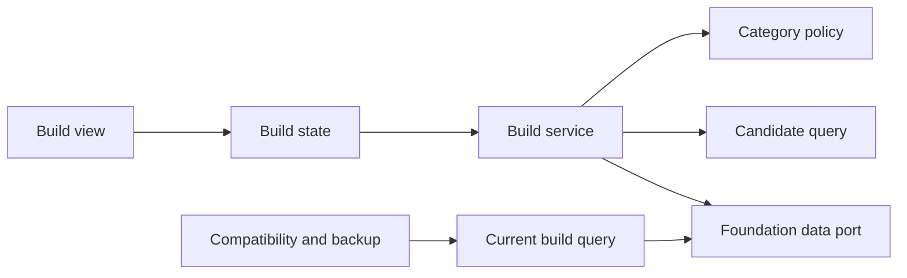
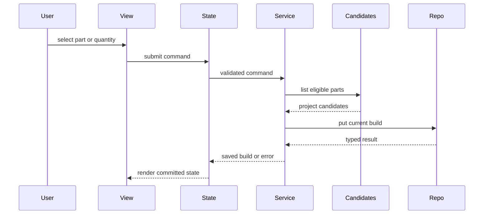

# Design Document

## Overview

本機能は、プロジェクト内の分類済み候補から現在採用するパーツと数量をサイドパネルで管理する。`project-candidate-management` の候補照会と `local-data-foundation` の `CurrentBuild` / query・原子的mutation契約を利用し、カテゴリ選択ポリシー、構成更新、修復済み構成の表示状態を追加する。

設計は既存のfeature service + UI stateパターンを踏襲する。カテゴリ規則を純粋なポリシーとして一元化し、構成データには候補IDと正整数数量だけを保存する。互換性結果や候補詳細を複製しない。

### Goals
- カテゴリ別の単一・複数選択と数量を一貫して適用する
- 候補変更・削除後も現在構成の参照整合性を保つ
- 下流が利用できる検証済みのプロジェクト別現在構成契約を公開する

### Non-Goals
- 候補の作成・編集、互換性判定、複数構成案、購入管理
- 保存基盤、スキーマ移行、容量管理の再実装
- 候補属性または互換性結果の構成データへの複製

## Boundary Commitments

### This Spec Owns
- カテゴリ別の`single`、`multiple`、`ineligible`選択ポリシー
- プロジェクトごとの現在構成に含む候補参照と数量の更新規則
- Foundationが原子的に修復したCurrentBuildの再読込と表示
- 現在構成UI状態、操作表示、下流向け読取契約

### Out of Boundary
- 候補パーツの内容、分類編集、候補照会の所有
- 保存ルート、参照検証、容量、移行、Chrome Storageアクセス
- 候補変更・削除と同一commitで行うCurrentBuild参照修復policy
- 互換性規則、判定結果、バックアップファイル形式

### Allowed Dependencies
- `local-data-foundation` の `CurrentBuild`、`FoundationDataPort`、`Result`、参照修復済みquery、カテゴリ・ID型
- `project-candidate-management` の `CandidateQuery.listBuildEligible`
- 既存のChrome 116+ side panel、TypeScript strict、React 19系/React DOM/CSS基盤
- application shellの`ApplicationFeatureRegistration`、`FeatureMountContext`、operation policy、contract test kit

### Revalidation Triggers
- `CurrentBuild`、構成項目、Foundation query/mutation error、候補照会契約の形状変更
- カテゴリ集合またはカテゴリ別選択方式の変更
- 候補削除・カテゴリ変更の原子性や通知統合点の変更
- 下流への現在構成公開契約、保存責任、依存方向の変更

## Architecture

### Existing Architecture Analysis

Foundationは単一保存ルート内の`currentBuilds`、同一プロジェクト参照、正整数数量、直列更新を提供する。Candidate managementは分類済み候補だけを返す`listBuildEligible`とside panelの管理パターンを提供する。本仕様は両契約を拡張せず組み合わせ、選択規則だけを新規所有する。

### Architecture Pattern & Boundary Map



- **Selected pattern**: feature service + UI state。業務規則、永続化連携、表示状態を分離する。
- **Dependency direction**: `Foundation contracts → Candidate query / Build contracts → Policy → Service / Query → State → View`。右側は左側だけへ依存する。
- **Boundary rule**: Build serviceは候補詳細を更新せず、CandidateQueryで取得したID、projectId、categoryだけを判断材料にする。
- **Integration rule**: 候補変更・削除時の参照修復はFoundationが同じroot mutation内で完了する。本featureは成功後のreconcile writeを持たず、queryで修復済みCurrentBuildだけを読む。

### Technology Stack

| Layer | Choice / Version | Role in Feature | Notes |
|---|---|---|---|
| Language | TypeScript 7.x strict | ポリシー、コマンド、結果型 | `any`禁止 |
| UI | React 19系 / React DOM / CSS | side panel内の構成画面 | 既存mount契約を維持 |
| Data | FoundationDataPort | CurrentBuildの検証付きquery・原子的保存 | Storage API直接利用なし |
| Integration | CandidateQuery | 分類済み候補照会 | 新規依存なし |
| Test | Vitest 3.x | ポリシー、サービス、状態、DOM統合 | 架空データのみ |

## File Structure Plan

```text
src/features/current-build/contracts.ts       # コマンド、ビュー、エラー、公開照会型
src/features/current-build/public.ts          # CurrentBuildQueryの唯一の公開入口
src/features/current-build/registration.ts    # shellへ渡すfeature registrationと依存組立
src/features/current-build/category-policy.ts # 全カテゴリの選択方式を一元化
src/features/current-build/service.ts         # 選択・数量・解除のmutation
src/features/current-build/query.ts           # 下流向けプロジェクト別構成照会
src/features/current-build/state.ts           # 読込、保存中、競合、エラー状態
src/features/current-build/view.tsx            # カテゴリ別候補と構成操作のReact component
src/features/current-build/react-root.tsx      # FeatureMountContextとReact rootの接続・cleanup
src/features/current-build/styles.css         # 構成画面と状態表現
tests/features/current-build/category-policy.test.ts
tests/features/current-build/service.test.ts
tests/features/current-build/query.test.ts
tests/features/current-build/state.test.ts
tests/features/current-build/view.test.ts
tests/features/current-build/integration.test.ts
```

### Modified Files
- 共有side panel runtimeとroot `src/index.ts`は変更しない。application shellが`registration.ts`と`public.ts`をcompositionする。

## System Flows



候補変更時はFoundationのReferenceRepairPolicyが同じcandidate mutation内で未分類化・削除・保持不能なcategory変更の参照を除去する。本featureは次回queryで修復済み構成を取得し、成功後の別mutationや手動競合解決を行わない。

## Requirements Traceability

| Requirement | Summary | Components | Interfaces | Flows |
|---|---|---|---|---|
| 1.1, 1.2, 1.3, 1.4 | プロジェクト・カテゴリ別表示 | BuildState、BuildView | BuildViewModel | 読込 |
| 2.1, 2.2, 2.3, 2.4, 2.5 | 単一選択 | CategoryPolicy、BuildService | BuildCommand | 選択保存 |
| 3.1, 3.2, 3.3, 3.4, 3.5, 3.6 | 複数選択と数量 | CategoryPolicy、BuildService | BuildCommand | 選択保存 |
| 4.1, 4.2, 4.3, 4.4, 4.5 | 候補変更時の整合性 | CurrentBuildQuery、BuildState | Foundation ReferenceRepairPolicy result | 修復済み再読込 |
| 5.1, 5.2, 5.3, 5.4, 5.5 | 保存・復元・失敗回復 | BuildService、BuildState、BuildView | BuildError | 保存 |
| 6.1, 6.2, 6.3, 6.4 | 下流契約 | CurrentBuildQuery | CurrentBuildSnapshot | 読取 |

## Components and Interfaces

| Component | Domain/Layer | Intent | Req Coverage | Key Dependencies | Contracts |
|---|---|---|---|---|---|
| CategoryPolicy | Feature | カテゴリ別選択方式 | 2.1–2.5, 3.1–3.6 | PartCategory P0 | Service |
| BuildService | Feature | 利用者による構成更新 | 2.2–3.6, 5.1–5.5 | Policy P0、CandidateQuery P0、FoundationDataPort P0 | Service |
| CurrentBuildQuery | Feature | 修復済み構成のUI・下流向け読取 | 1.1–1.4, 4.1–4.5, 6.1–6.4 | FoundationDataPort P0 | Service |
| BuildState | UI state | 読込、保存、競合、失敗回復 | 1.1–1.4, 4.2–5.5 | Service P0 | State |
| BuildView | UI | 候補、選択、数量、案内表示 | 1.1–5.5 | State P0 | State |
| CurrentBuildFeatureRegistration | UI adapter | state/view/public APIをshell登録契約へ接続 | 1.1–6.4 | ApplicationFeatureRegistration P0、BuildView P0 | Service |

### Feature Layer

#### CategoryPolicy

| Field | Detail |
|---|---|
| Intent | 全カテゴリを選択方式へ網羅的に写像する |
| Requirements | 2.1–2.5, 3.1–3.6 |

**Contracts**: Service [x] / API [ ] / Event [ ] / Batch [ ] / State [ ]

```typescript
type SelectionMode = "single" | "multiple" | "ineligible";

interface CategoryPolicy {
  modeFor(category: PartCategory): SelectionMode;
}
```

`unclassified`だけを`ineligible`とする。単一カテゴリは数量1固定、複数カテゴリは正整数数量を許可する。カテゴリ追加時に未処理分岐を型検査で検出する。

#### BuildService

| Field | Detail |
|---|---|
| Intent | 有効な利用者選択変更をCurrentBuildへ反映する |
| Requirements | 2.2–3.6, 5.1–5.5 |

**Dependencies**
- Outbound: CategoryPolicy — 選択方式 (P0)
- Outbound: CandidateQuery — 同一プロジェクトの分類済み候補 (P0)
- Outbound: FoundationDataPort — expected revision付き原子的構成保存 (P0)

**Contracts**: Service [x] / API [ ] / Event [ ] / Batch [ ] / State [ ]

```typescript
type BuildCommand =
  | { type: "select"; projectId: ProjectId; partId: CandidatePartId }
  | { type: "set-quantity"; projectId: ProjectId; partId: CandidatePartId; quantity: number }
  | { type: "remove"; projectId: ProjectId; partId: CandidatePartId };

interface BuildService {
  execute(command: BuildCommand, context: MutationContext): Promise<Result<CurrentBuild, BuildError>>;
}
```

- Preconditions: projectと候補が一致し、候補が分類済みで、数量がポリシーに適合する。
- Postconditions: プロジェクトごとに一構成、候補ID重複なし、単一カテゴリ最大一項目、数量は正整数。
- Invariants: 失敗・競合中は直前の有効な構成を保存したままにする。

#### CurrentBuildQuery

| Field | Detail |
|---|---|
| Intent | 下流へ検証済みの現在構成スナップショットを返す |
| Requirements | 6.1–6.4 |

**Contracts**: Service [x] / API [ ] / Event [ ] / Batch [ ] / State [ ]

```typescript
interface CurrentBuildQuery {
  getByProject(projectId: ProjectId): Promise<Result<CurrentBuildSnapshot | null, BuildError>>;
}

interface CurrentBuildSnapshot {
  readonly projectId: ProjectId;
  readonly items: readonly Readonly<{ partId: CandidatePartId; quantity: number }>[];
  readonly updatedAt: UtcIsoDateTime;
}
```

返却値は候補詳細や互換性結果を含めず、Foundationの検証と参照修復を通過した保存値の読み取り専用表現とする。

### UI Layer

#### BuildState

永続スナップショット、選択project/category、保存中コマンド、表示エラーを保持する。成功時だけスナップショットを置換し、同一コマンドの二重送信を抑止する。feature再表示・project再選択ではqueryを再実行し、Foundationが修復した構成を反映する。

#### BuildView

分類済みカテゴリ、候補、選択状態、複数カテゴリの数量入力、解除操作をReact componentで描画する。未分類候補は選択肢へ出さず、空状態、項目エラー、保存エラー、修復後の構成変更を識別可能に表示する。文字列は通常のJSX childとして扱う。

## Data Models

- `CurrentBuild`はFoundation契約を再利用し、`projectId`、一意な`partId`と正整数`quantity`の項目、`updatedAt`を持つ。
- `SelectionMode`は保存しない派生規則である。
- `BuildError`は`validation`、`not-found`、`conflict`、`maintenance`、`corrupt-data`、`unsupported-data`、`quota`、`storage`を判別する。
- 利用者による構成更新対象は一つの`CurrentBuild`だが、Foundationが保存ルート全体の参照を同じtransactionで検証する。

## Error Handling

入力エラーは数量または対象候補へ関連付ける。revision競合は再読込を案内する。破損・非対応・修復不能な不正参照は変更操作を停止し、保存失敗は直前の構成を維持する。候補名、URL、価格をログへ出さない。

## Testing Strategy

- Unit: 全カテゴリのポリシー、単一置換、複数追加、数量検証、重複防止を検証する。
- Service integration: 別プロジェクト・未分類拒否、expected revision、maintenance、保存失敗時の不変性を検証する。
- Foundation contract integration: 候補削除・未分類化・保持不能なカテゴリ変更がcandidate mutationと同じcommitで修復され、本featureからreconcile writeが発生しないことを検証する。
- State: 復元、成功時だけのスナップショット更新、二重送信抑止、競合状態、操作停止を検証する。
- React DOM integration: カテゴリ切替、空状態、単一・複数操作、数量エラー、修復済み構成の再表示、unmount cleanupを検証する。
- Contract/E2E: プロジェクトの候補選択から再起動復元、下流照会までを架空データで検証する。

## Security & Performance

候補表示は通常のJSX childを使い、`dangerouslySetInnerHTML`、`innerHTML`、inline handlerを使用しない。React componentはframework非依存のBuildStateとService portだけに依存し、保存は信頼済み拡張コンテキストのFoundationDataPortへ限定する。選択プロジェクト・カテゴリの候補だけを描画し、保存中の重複更新を抑止する。容量管理と参照修復はFoundationへ委譲する。
