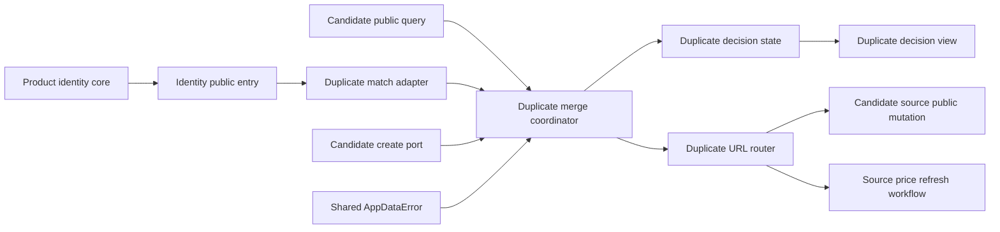
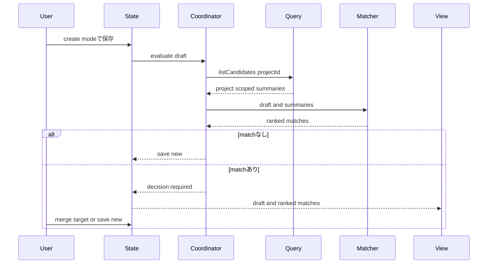
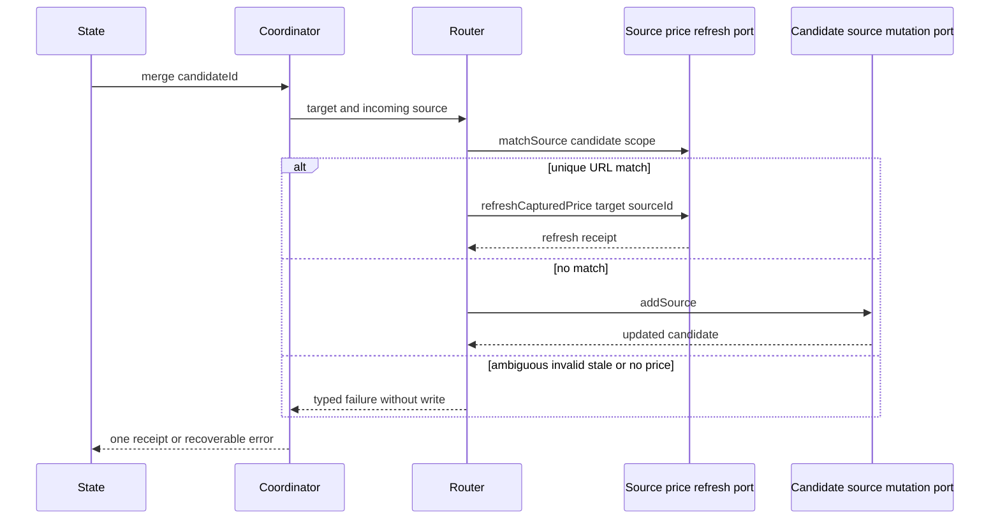

# 設計文書

## 概要

本機能は、`src/product-identity/`の共有coreとしてproduct identityの型・normalizer・matcher・factory・唯一の公開入口を所有する。candidate ownerの公開保存前seamへ重複計画を接続し、対象プロジェクト内の既存候補と取り込みdraftをこのcanonical matcherで照合する。一致候補がなければ公開create portへ進み、一致候補があれば候補管理の非一過性editor内で利用者へ根拠付きで提示する。統合は利用者が一件を明示確定した場合だけ行う。

統合時はcandidate-source ownerの公開match/add/conditional mutation portを一度だけ呼び、既存候補の商品値や正規化属性を変更しない。同一URLは同じsource ownerのcanonical match結果を利用し、新規sourceを追加せず既存sourceの価格更新workflowへ振り分ける。data operation failureはfoundation公開入口の共有`AppDataError`から既存workflow errorへ写像する。

### 目標

- 型番を最優先、メーカー+商品名を補助とする決定的・説明可能な照合を提供する。
- 誤統合を避けるため、新規保存を安全な初期判断とし、統合に明示確定を要求する。
- source追加、同一URL更新、新規候補作成を相互排他的な一回のwrite経路へ分ける。
- 照合・統合失敗時にcandidate editorの入力と既存候補を保持する。

### 非目標

- 保存済み候補どうしの事後マージ、project横断照合、fuzzy search、外部商品DB照合
- source collection、primary、per-source price、URL identity、価格抽出・更新の再定義
- product-captureの抽出順位、compatibility rule、schema migration、ブラウザ権限の変更
- candidate/source query・mutation実装、source URL identity、共有error vocabulary/mapping、application shell composition

## Change Integration

- **Change Brief**: `v0.5.0-boundary-reconciliation`
- **In scope**: canonical identity type/normalizer/matcher/factory/public entry、identity characterization、candidate/source public seam consumer、共有`AppDataError` mapping、duplicate detection、merge planning、confirmation、atomic routing、state/UI、contract/E2E非回帰。
- **Out of scope**: candidate/source entity/query/mutation実装、canonical error、source URL identity、price refresh、shell production composition、identity algorithmの意味、保存形式、UI layout変更。
- **Preserved behavior**: project内自動照合、利用者確定、新規保存の安全な初期値、既存値保持、source-add/price-refresh/createの相互排他、失敗時draft保持。

## 境界コミットメント

### 本specが所有するもの

- `src/product-identity/`のcanonical identity value/input/result型、normalizer、matcher、factory、`public.ts`。
- 型番優先、メーカー+商品名補助、型番不一致fallback禁止、カテゴリgate、確信度、根拠、決定的順位を現行結果のまま提供する純粋identity core。
- create modeの保存前評価、merge plan、判断保持、統合確認、取消、失敗回復。
- 新規保存、source追加、同一URL価格更新の相互排他的なルーティング。
- 共有`AppDataError`から既存duplicate error/state/messageへのconsumer mapping。
- 統合提示と失敗文言の日本語・英語catalog追加、および自動検証。

### 境界外

- product identity algorithmの意味・精度・confidence変更、およびmanufacturer domain map。
- candidate/sourceのcanonical query、create、add/patch、revision/atomicity、公開型と実装。
- `AppDataError` vocabulary、低位error mapping、公開入口。
- application shellのproduction composition、遅延proxy、port wiring。
- `CandidateSource`、`CandidateSourceId`、`primarySourceId`、`CandidateSourceMutationPort` とその原子性は `candidate-source-bookmarks` が所有する。
- URL同一性、source catalog照合、source add・条件付きmutationは `candidate-source-bookmarks` が所有する。価格抽出・更新workflow、context menu、transient起動、権限・artifact gateは `source-price-refresh` が所有する。
- project/candidate CRUD、保存時validation、revision、mutation contextはcandidate-managementの既存責務である。
- captureの固定tab実行、一過性面、pre-edit handoff、project解決は `product-capture-transient-migration` の責務である。
- source product値の食い違い解決、保存済み候補どうしの統合、商品マスターは扱わない。

### 許可する依存

- 本spec所有の`src/product-identity/public.ts`が提供する`ProductIdentityMatchPort`と説明可能なmatch result。workflowはidentity内部moduleへdeep importしない。
- candidate owner `project-candidate-management` のcanonical公開入口が提供するproject限定`CandidateQuery`、duplicate専用の最小`CandidateCreatePort`、canonical draft/summary contract。
- candidate-source owner `candidate-source-bookmarks` のcanonical公開入口が提供するsource URL matcher、add、conditional mutation。candidate ownerからこれらを取得しない。
- source-price-refresh公開入口のprice observation workflow/error/receipt contract。URL identityを直接importしない。
- local data foundation公開入口の`AppDataError`、`CandidatePartId`、`ProjectId`、`PartCategory`、`SourcedValue`、`Result<T, E>`。
- candidate-managementの既存state/view/snapshotと、ui-message catalog、React 19、標準Unicode/URL API。
- project候補の読込は `CandidateQuery` に限定し、foundation rootやChrome Storageを直接読まない。

### 再検証トリガー

- identity match resultまたはcandidate public summaryからconfidence、evidence、category、projectIdのいずれかが除かれる場合。
- `CandidateSourceMutationPort.addSource`、`AddCandidateSourceInput`、最初のsourceのprimary規則が変わる場合。
- candidate-source公開`matchByPageUrl` / `addSource` / conditional mutation、URL identity、candidate scope、またはsource-price-refreshの価格workflow/eligibilityが変わる場合。
- `UnresolvedCandidateDraft`のproject解決、candidate-management create/edit mode、snapshot rollback契約が変わる場合。
- identity public contractの商品識別値Unicode、区切り、confirmed/original優先規則またはcategory集合が変わる場合。
- `AppDataError`のvariant/payload/公開入口またはcandidate error mappingが変わる場合。

## アーキテクチャ

### 既存アーキテクチャ分析

- `product-capture-transient-migration` 後、captureは抽出結果を候補管理へ渡して終了する。候補管理がprojectを解決し、canonical draftをeditorへ保持するため、保存前判断はここに置く。
- `CandidateQuery.listCandidates({projectId})` はproject限定summaryを返し、照合に必要なcategory・name・manufacturer・modelNumberを持つ。新しいfoundation queryやroot readは不要である。
- `candidate-source-bookmarks` はsource追加のdownstream portを公開する。duplicate coordinatorはsource ID生成、primary変更、revision補完を再実装しない。
- `candidate-source-bookmarks` はURL identityとcandidate-scoped一意照合を公開する。同一URLの定義は本機能へ持ち込まない。`source-price-refresh`は一意sourceを受け取った後の価格更新workflowだけを所有する。

### アーキテクチャパターンと境界マップ



**アーキテクチャ統合**

- 選択パターン: 純粋matcher + application coordinator + candidate-management state/view。
- 依存方向: Foundation domain types → Product identity core/public entry → Candidate/source/error public ports → Consumer adapters → Coordinator/Router → State → View。
- 既存パターン: feature外importは `public.ts`、永続化はcanonical port、Reactは表示adapter、errorは判別共用体。
- 新規componentの理由: matcherをI/Oから分離し、URL/source追加の分岐をURL ownerへ委譲し、UI判断を保存処理から分離する。
- steering準拠: server/権限/新規libraryなし、single write authority、未信頼値の安全表示、架空fixture。

### 技術スタック

| 層 | 選択 / Version | 本機能での役割 | 注記 |
|---|---|---|---|
| UI | React 19 / React DOM | 一致候補、根拠、統合・新規保存判断の表示 | candidate-management既存root内 |
| Application | TypeScript 7 strict | matcher、coordinator、state、判別union | `any`、unsafe cast禁止 |
| Identity | `src/product-identity/` canonical core | normalized match、confidence、evidence | 本specが唯一owner、現行algorithm意味を維持 |
| Data | candidate/source public ports、AppDataError | candidate ownerのproject query/create、source ownerのmatch/add/conditional mutation、data failure | foundation rootへ直接依存しない |
| Adjacent | candidate-source public matcher/mutation、source-price-refresh public workflow | URL identity、一意source照合・追加・条件付きpatch、価格更新workflow | source coreとworkflow ownerを分離 |

## ファイル構成計画

### ディレクトリ構成

```text
src/
├── product-identity/
│   ├── model.ts                            # identity input/result/confidence/evidence型
│   ├── normalizer.ts                       # NFKC・case・空白・型番区切りの純粋正規化
│   ├── matcher.ts                          # model/manufacturer-name/category/順位規則
│   ├── factory.ts                          # typed matcher factory
│   └── public.ts                           # feature間の唯一のidentity公開入口
├── features/
│   ├── duplicate-product-merge/
│       ├── identity-match-adapter.ts           # identity public resultのduplicate計画への適合
│       ├── candidate-port-adapter.ts            # candidate query/create/source public port適合
│       ├── duplicate-merge.ts                  # 保存前評価、merge plan、判断確定
│       ├── duplicate-url-router.ts             # public source addと価格更新の排他的分岐
│       ├── error-mapping.ts                    # AppDataErrorの既存workflow結果への写像
│       ├── public.ts                           # candidate editor/shell向けconsumer contract
│       └── feature-contribution.ts             # UI contribution factory
│   └── candidate-management/
│       ├── state.ts                            # DuplicateMergeStateのeditor統合点
│       ├── state-snapshot.ts                   # 判断待ち・失敗snapshot統合点
│       └── view.tsx                            # DuplicateMergeViewの描画統合点
├── ui-messages/catalog/
│   ├── ja/candidate.ts                        # 日本語の一致・統合・失敗文言
│   └── en/candidate.ts                        # 英語の同一key文言
└── application-shell/                         # composition owner（本specでは編集しない）

tests/
├── product-identity/
│   ├── normalizer.test.ts
│   ├── matcher.test.ts
│   └── public-consumer.test.ts
├── features/duplicate-product-merge/
│   └── identity-match-adapter.test.ts
├── features/candidate-management/
│   ├── duplicate-matcher.test.ts
│   ├── duplicate-merge.test.ts
│   └── duplicate-product-merge.integration.test.tsx
└── ui-messages/
    └── catalog-parity.test.ts

e2e/
└── duplicate-product-merge.spec.ts
```

### 変更対象ファイル

- `src/product-identity/{model,normalizer,matcher,factory,public}.ts` — canonical identity coreと唯一のfeature間公開入口を所有する。
- `src/features/duplicate-product-merge/{identity-match-adapter,candidate-port-adapter,duplicate-merge,duplicate-url-router,error-mapping}.ts` — identity/source/candidate public portsを重複計画・確認・排他routeへ適合する。
- `src/features/duplicate-product-merge/{public,feature-contribution}.ts` — candidate editorとshellが直接接続できるworkflow/UI factoryだけを公開する。
- `src/features/candidate-management/{state,state-snapshot,view}.ts(x)` — candidate ownerの既存統合点としてcreate modeのevaluate/decide/cancel/retry、二重送信抑止、draft保持と表示だけを接続する。本specはcandidate query/mutationをここへ実装・再公開しない。
- `src/ui-messages/catalog/ja/candidate.ts`、`en/candidate.ts` — locale parityを保った文言keyを追加する。
- application-shell composition fileは変更しない。identity/candidate/source/error public portの最終注入はshell ownerへ委ねる。
- `tests/features/duplicate-product-merge/`とcandidate editor integration tests — consumer contract、既存editor回帰、判断状態を検証する。
- `e2e/locators.ts` — feature固有の安定したdata locatorを追加する。

## システムフロー

### 保存前照合と利用者判断



照合中は既存の `isSaving` と同じく再送を抑止する。matchありではwriteを行わず、選択なしを新規保存判断として表示する。cancelはeditor draftへ戻り、永続状態を変更しない。

### 統合確定と同一URL分岐



`matchSource` の `no-match` だけをsource addへ変換する。`ambiguous-match`、`invalid-url`、`stale-target`、`ineligible-source`、`price-unavailable` と管理系失敗はfallback addを行わない。URL一意一致時にpriceがない場合も既存価格を消さず失敗としてdraftを保持する。

## 要件トレーサビリティ

| 要件 | 概要 | コンポーネント | インターフェース | フロー |
|---|---|---|---|---|
| 1.1, 1.2, 1.3, 1.4, 1.5 | project内保存前照合 | DuplicateMergeCoordinator、DuplicateCandidateMatcher | `CandidateQuery.listCandidates`、`CandidateCreatePort.createCandidate` | 保存前照合 |
| 2.1, 2.2, 2.3, 2.4, 2.5, 2.6, 2.7, 2.8, 2.9, 2.10 | canonical identity結果、category、順位、根拠 | IdentityMatchAdapter、DuplicateMergeCoordinator | `ProductIdentityMatchPort` | 保存前照合 |
| 3.1, 3.2, 3.3, 3.4, 3.5, 3.6, 3.7 | 明示判断 | DuplicateMergeState、DuplicateMergeView、DuplicateMergeCoordinator | `evaluate`、`complete` | 保存前照合 |
| 4.1, 4.2, 4.3, 4.4, 4.5, 4.6, 4.7 | source統合と既存値保持 | DuplicateMergeCoordinator、DuplicateUrlRouter | `CandidateSourceMutationPort.addSource` | 統合確定 |
| 5.1, 5.2, 5.3, 5.4, 5.5 | 同一URL価格更新分岐 | DuplicateUrlRouter | `matchSource`、`refreshCapturedPrice` | 同一URL分岐 |
| 6.1, 6.2, 6.3, 6.4, 6.5, 6.6 | 失敗回復と原子性 | DuplicateMergeCoordinator、DuplicateMergeState | typed result、revision-aware upstream ports | 全フロー |
| 7.1, 7.2, 7.3, 7.4, 7.5, 7.6 | 境界、安全、検証 | 全コンポーネント | public-only imports、message catalog | 全フロー |
| 8.1, 8.2, 8.3 | canonical identity ownerと共有error consumer | ProductIdentityCore、IdentityMatchAdapter、ErrorMapping | identity public entry、AppDataError | 全フロー |
| 8.4, 8.5 | error意味とfail-closed保全 | DuplicateMergeCoordinator、State、View | DuplicateMergeError | 全フロー |
| 8.6 | shell composition分離 | feature contribution、public contract | downstream factory input | composition handoff |
| 8.7 | public contract再検証 | contract/characterization/UI/E2E | consumer fixtures | 全フロー |

## コンポーネントとインターフェース

| コンポーネント | 層 | 意図 | 要件 | 主要依存 | 契約 |
|---|---|---|---|---|---|
| ProductIdentityCore | Shared domain core | identity型・正規化・一致・順位をcanonicalに提供 | 2.1–2.10, 8.1, 8.2, 8.7 | foundation public types P0 | Service |
| IdentityMatchAdapter | Consumer adapter | canonical identity matchをduplicate planへ適合 | 1.2–1.4, 2.1–2.10, 8.1, 8.7 | identity public port P0 | Service |
| CandidatePortAdapter | Consumer adapter | project query/create/source mutationをworkflowへ適合 | 1.1–1.5, 4.1–4.7, 8.2 | candidate public ports P0 | Service |
| ErrorMapping | Consumer policy | AppDataErrorを既存duplicate resultへ意味を変えず写像 | 6.1–6.6, 8.3–8.5 | foundation domain public P0 | Service |
| DuplicateMergeCoordinator | Feature application | 保存前評価、merge plan、確認、三つのcommit結果を調停 | 1.1–1.5, 3.4–3.7, 4.1–4.7, 6.1–6.6 | candidate adapter、identity adapter、router | Service |
| DuplicateUrlRouter | Integration | same URLならrefresh、no-matchならaddを排他的に実行 | 4.1–4.7, 5.1–5.5, 6.2–6.4 | source mutation、price refresh | Service |
| DuplicateMergeState | UI state | draft、照合中、判断、失敗、再試行を保持 | 3.1–3.7, 5.5, 6.1–6.6 | coordinator、snapshot | State |
| DuplicateMergeView | UI | 一致根拠と明示判断を安全に描画 | 3.1–3.6, 6.1, 6.4, 7.3–7.5 | state、messages | State |

### Canonical Product Identity Core

#### ProductIdentityCore / ProductIdentityMatchPort

| 項目 | 詳細 |
|---|---|
| 意図 | 商品識別値を正規化し、説明可能で決定的なmatch結果を唯一の公開入口から提供する |
| 要件 | 2.1–2.10, 7.5, 8.1, 8.2, 8.7 |

**責務と制約**

- confirmed優先、欠損時original、NFKC、locale-neutral case、空白、型番区切りを表示・保存値から分離した比較keyへ正規化する。
- model high、manufacturer+name supporting、model mismatch fallback禁止、category gate、決定的順位とevidenceを一つのmatcherで返す。
- `public.ts`は型、matcher port、factoryだけを公開し、normalizer内部、algorithm helper、feature compositionを公開しない。

**依存**

- Inbound: IdentityMatchAdapter、product-page-capture等のpublic consumer（P0）
- Outbound: foundation domain public types、標準Unicode API（P0）

**契約**: Service [x]

```typescript
interface ProductIdentityMatchPort {
  match(input: {
    readonly draft: CandidateDraft;
    readonly candidates: readonly CandidateSummary[];
  }): Result<readonly CanonicalIdentityMatch[], IdentityMatchError>;
}
```

- 前提条件: candidate境界で検証済みのdraftと同一projectのsummary。
- 事後条件: 同じ入力は同じ説明可能なmatch resultを返し、raw/confirmed値を更新しない。
- 不変条件: 現行normalization/matching結果を変更せず、比較keyや内部helperをconsumerへ公開しない。

### Duplicate Match Planning

#### IdentityMatchAdapter

| 項目 | 詳細 |
|---|---|
| 意図 | 一つの新規draftとproject限定summaryから説明可能な一致候補を返す |
| 要件 | 1.2, 1.3, 1.4, 2.1, 2.2, 2.3, 2.4, 2.5, 2.6, 2.7, 2.8, 2.9, 2.10 |

**責務と制約**

- canonical identity public matcherへdraftとproject限定summaryを渡す。
- ownerが返すcategory gate、model high、manufacturer-name supporting、model mismatch、identity不足の結果を変更しない。
- confidence/evidenceとcandidate IDの決定的順序をmerge planへ写し、独自scoreやfallbackを追加しない。

**依存**

- Inbound: DuplicateMergeCoordinator（P0）
- Outbound: ProductIdentityMatchPort、canonical CandidateSummary（P0）

**契約**: Service [x]

```typescript
type DuplicateMatchConfidence = "high" | "supporting";

type DuplicateMatchEvidence =
  | { readonly kind: "model-number" }
  | { readonly kind: "manufacturer-name" };

interface DuplicateCandidateMatch {
  readonly candidateId: CandidatePartId;
  readonly confidence: DuplicateMatchConfidence;
  readonly evidence: DuplicateMatchEvidence;
  readonly summary: CandidateSummary;
}

interface DuplicateCandidateMatcher {
  match(
    draft: CandidateDraft,
    candidates: readonly CandidateSummary[],
  ): readonly DuplicateCandidateMatch[];
}
```

- 前提条件: `candidates` は `draft.projectId` と同じprojectをqueryした結果。
- 事後条件: 入力順にかかわらず同じmatch順を返す。
- 不変条件: draft、summary、保存データへmutationを行わない。

### Candidate Application

#### DuplicateMergeCoordinator

| 項目 | 詳細 |
|---|---|
| 意図 | create modeの保存前評価と利用者判断を既存save/source portへ写像する |
| 要件 | 1.1, 1.2, 1.3, 1.4, 1.5, 3.4, 3.5, 3.6, 3.7, 4.1–4.7, 6.1–6.6 |

**責務と制約**

- evaluateはcandidate ownerの公開project queryだけを使い、別projectやfoundation rootを読まない。
- matchなしはcandidate ownerの最小`CandidateCreatePort`へ一度だけ委譲し、matchありはwriteなしのdecision resultを返す。
- completeのdecisionは `save-new` または一件の `merge` だけを許す。未選択mergeを型で表現しない。
- merge前にtargetが直近match集合に存在することを検証し、routerへ渡す。router結果以外の補償writeを行わない。
- edit modeは既存update serviceへそのまま流し、本機能を起動しない。

**依存**

- Inbound: DuplicateMergeState（P0）
- Outbound: CandidateQuery、CandidateCreatePort、DuplicateCandidateMatcher、DuplicateUrlRouter（P0）

**契約**: Service [x]

```typescript
type DuplicateSaveDecision =
  | { readonly kind: "save-new" }
  | { readonly kind: "merge"; readonly candidateId: CandidatePartId };

type DuplicateEvaluation =
  | { readonly kind: "saved-new"; readonly candidate: CandidatePart }
  | {
      readonly kind: "decision-required";
      readonly matches: readonly DuplicateCandidateMatch[];
    };

type DuplicateCommitReceipt =
  | { readonly kind: "saved-new"; readonly candidate: CandidatePart }
  | { readonly kind: "source-added"; readonly candidateId: CandidatePartId }
  | {
      readonly kind: "price-refreshed";
      readonly receipt: SourcePriceRefreshReceipt;
    };

type DuplicateMergeError =
  | { readonly kind: "data"; readonly cause: AppDataError }
  | { readonly kind: "identity"; readonly cause: IdentityMatchError }
  | { readonly kind: "source-route"; readonly cause: DuplicateUrlRouteError }
  | { readonly kind: "stale-decision" };

interface DuplicateMergeCoordinator {
  evaluate(
    draft: CandidateDraft,
    context: MutationContext,
  ): Promise<Result<DuplicateEvaluation, DuplicateMergeError>>;
  complete(
    draft: CandidateDraft,
    matches: readonly DuplicateCandidateMatch[],
    decision: DuplicateSaveDecision,
    context: MutationContext,
  ): Promise<Result<DuplicateCommitReceipt, DuplicateMergeError>>;
}
```

`MutationContext` は既存candidate-management stateが操作ごとに生成して渡す。coordinatorはrequest IDやrevisionを生成・補完せず、`save-new` のときだけ受け取ったcontextを`CandidateCreatePort`へそのまま委譲する。merge経路のcontext管理は注入済みsource公開mutation portのownerに留める。

`CandidateDraft`に含まれる初期sourceは上流 `CaptureSourceMapper` が構築したcanonical入力を使う。coordinatorはURL、price、capturedAt、kind、siteNameのshapeを再定義せず、`AddCandidateSourceInput` へ上流mapperで写像する。

#### DuplicateUrlRouter

| 項目 | 詳細 |
|---|---|
| 意図 | 選択targetのincoming URLを一意照合し、refreshまたはaddの片方だけを実行する |
| 要件 | 4.1–4.7, 5.1–5.5, 6.2, 6.3, 6.4 |

**責務と制約**

- source ownerの公開candidate-scoped matchを最初に呼ぶ。
- successは返されたsource IDをtargetに `refreshCapturedPrice` を一度呼ぶ。URLや配列indexでsourceを更新しない。
- `no-match` だけをcandidate-source ownerの公開add portへ変換する。
- `ambiguous-match`、`invalid-url`、`ineligible-source`、`stale-target`、`price-unavailable`、管理系失敗はaddへfallbackしない。
- price欠損の同一URLではrefreshを実行せず、既存priceを維持する。

**依存**

- Inbound: DuplicateMergeCoordinator（P0）
- Outbound: SourceMatchPort、CandidateSourceAddPort、SourcePriceRefresh workflow（P0）

**契約**: Service [x]

```typescript
type DuplicateUrlRouteReceipt =
  | { readonly kind: "source-added"; readonly candidateId: CandidatePartId }
  | {
      readonly kind: "price-refreshed";
      readonly receipt: SourcePriceRefreshReceipt;
    };

type DuplicateUrlRouteError =
  | { readonly kind: "source-refresh"; readonly cause: SourcePriceRefreshError }
  | { readonly kind: "source-add"; readonly cause: AppDataError };

interface DuplicateUrlRouter {
  route(
    targetCandidateId: CandidatePartId,
    input: AddCandidateSourceInput,
  ): Promise<Result<DuplicateUrlRouteReceipt, DuplicateUrlRouteError>>;
}
```

candidate-source ownerの公開add portはcommand成功を既存契約どおり返す。source追加成功receiptは変更対象の `candidateId` だけを返し、最新候補の表示が必要なconsumerは成功後にcanonical candidate queryで再読込する。routerは更新後の `CandidatePart` を合成せず、追加queryも行わない。

### Candidate UI

#### DuplicateMergeState

| 項目 | 詳細 |
|---|---|
| 意図 | create editorのdraftと照合判断を永続write前に保持する |
| 要件 | 3.1–3.7, 5.5, 6.1–6.6 |

**契約**: State [x]

```typescript
type DuplicateDecisionState =
  | { readonly status: "idle" }
  | { readonly status: "evaluating"; readonly draft: CandidateDraft }
  | {
      readonly status: "deciding";
      readonly draft: CandidateDraft;
      readonly matches: readonly DuplicateCandidateMatch[];
      readonly selectedCandidateId?: CandidatePartId;
    }
  | {
      readonly status: "committing";
      readonly draft: CandidateDraft;
      readonly decision: DuplicateSaveDecision;
    }
  | {
      readonly status: "failed";
      readonly draft: CandidateDraft;
      readonly matches: readonly DuplicateCandidateMatch[];
      readonly error: DuplicateMergeError;
    };
```

- `deciding` の初期値は `selectedCandidateId: undefined`。viewでは新規保存を既定判断として表示する。
- evaluate/complete中は同じactionを受け付けない。
- cancelは `idle` へ戻るがeditor draftを維持する。成功だけがeditorを閉じ一覧をreloadする。
- snapshotは `deciding` と `failed` のdraft/matchesだけをversion付きで検証し、`evaluating`/`committing` は復元時に再実行可能な失敗へ変換する。

#### DuplicateMergeView

| 項目 | 詳細 |
|---|---|
| 意図 | 一致候補と根拠を提示し、統合targetを明示選択させる |
| 要件 | 3.1–3.6, 6.1, 6.4, 7.3, 7.4, 7.5 |

summary-only component。candidate-management editorのcreate modeだけに、name、manufacturer、model number、category、confidence、evidenceを順位順で表示する。候補radioは未選択で開始し、「新規候補として保存」と「選択候補へ統合」を別actionにする。統合actionはtarget未選択では無効である。外部文字列はJSX childとして描画し、URL自体は一致根拠画面へ表示しない。失敗は安定したmessage keyへ写像し、商品値・完全URL・error objectをログへ出さない。

## データモデル

### ドメインモデル

- `DuplicateCandidateMatch` は一時的な説明projectionであり、永続化しない。
- aggregate rootは既存 `CandidatePart` のまま。mergeはtarget candidate aggregate内のsource collectionだけを更新する。
- incoming draftの商品値は照合材料であり、merge時のtarget product更新材料ではない。
- `source-added`、`price-refreshed`、`saved-new` は相互排他的なreceiptで、同一操作から複数返さない。

### 論理データモデル

- 永続schema変更なし。`schemaVersion`、backup形式、migrationを追加しない。
- UI snapshotへ `DuplicateDecisionState` のJSON直列化可能なsubsetを追加する。snapshotは永続商品データではなく、同一side panel rollback用の一時状態である。
- candidate ID、source IDはcanonical branded IDを使い、URLやindexをIDとして保存しない。

### データ契約と統合

- 候補読込・新規保存: candidate public `CandidateQuery`と`CandidateCreatePort`。返却projectの混在はcontract違反として評価を中止し、matchなし・明示新規保存だけがcreateへ進む。
- identity照合: 本spec所有のcanonical `ProductIdentityMatchPort`。workflowはnormalizationとmatching algorithmを公開入口経由で利用し、duplicate feature内へ複製しない。
- source追加/URL照合: candidate-source public match/add/conditional mutation ports。source shape、URL identity、revision補完はsource ownerへ委譲する。
- price更新: source-price-refresh public workflow。price欠損時は呼ばない。
- data failure: foundation domain publicの`AppDataError`。`ManagementError`やcandidate mapperを参照しない。
- feature間importは各 `public.ts` のみ。source-priceの `CandidateSourceCatalogPort`、captureの `PagePriceExtractionPort`、transient gesture登録は本機能から直接利用しない。

## エラー処理

### エラー方針

- query failure: draft保持、再照合または明示新規保存を提示する。自動的に照合をskipして保存しない。
- stale decision/conflict: writeせず、最新candidate一覧の再評価を要求する。
- source add failure: upstream atomic mutationによりtargetを変更せず、draftとmatchを保持する。
- URL match/refresh failure: source追加へfallbackせず、source-price errorを安定messageへ写像する。
- invalid incoming source: field-level validationを表示し、既存candidateを変更しない。

### 主なカテゴリ

| 分類 | 例 | 応答 |
|---|---|---|
| 入力 | invalid URL、price欠損、source shape不正 | field理由、draft保持 |
| 一致 | no match | source addへ進む |
| 曖昧 | ambiguous URL、複数target | 無変更、選択不能案内 |
| 競合 | candidate/source削除、revision conflict | 無変更、再評価 |
| 保存 | maintenance、quota、storage | 無変更、既存管理error案内 |
| 安全 | unsupported data | mutation無効、復旧案内 |

### 監視

追加telemetryは導入しない。必要な診断は安定error code、operation種別、request IDに限定し、candidate ID、source ID、商品値、完全URL、保存内容、例外dumpを出さない。

## テスト戦略

### Unit tests

- identity core/public contract kit: 大小文字、全角半角、制御文字、空白、model区切り、confirmed優先、model high、manufacturer+name supporting、model不一致fallback禁止、identity不足、category、決定的順位とevidenceのcharacterizationをowner側で固定し、consumerが内部helperへdeep importしないことを検証する（1.2–1.4、2.1–2.10、8.1、8.2、8.7）。
- IdentityMatchAdapter: canonical match resultだけからduplicate planを構築し、raw normalizationやproduct-capture内部へ依存しないことを検証する（2.1–2.10、8.1）。
- DuplicateUrlRouter: unique match refresh、no-match add、ambiguous/invalid/stale/ineligible/priceなしの非fallbackを検証する（4.1–4.7、5.1–5.5、6.2–6.4）。
- DuplicateMergeState: 二重送信抑止、未選択初期値、cancel、retry、明示新規保存、成功時だけeditor終了を検証する（3.1–3.7、6.1–6.6）。

### Integration / contract tests

- product-capture handoffからproject解決済みcreate draftを保存し、project限定query→decision requiredまでにwriteがないことを検証する（1.1–1.5、3.1）。
- merge確定が `addSource` を一度だけ呼び、新規candidateを作らずproduct/attributes/primaryを保持することを検証する（4.1–4.7）。
- 同一URLがsource-price public identityで一件へ一致し、addSourceを呼ばずrefresh targetにcanonical source IDを渡すことを検証する（5.1–5.5）。
- query、conflict、storage、quota、refresh handoff失敗でdraftと既存candidateが保持されることを検証する（6.1–6.6）。
- candidate/source public consumer contractと全`AppDataError` variant mappingを検証し、旧`ManagementError`、identity/candidate実装、deep import、shell compositionをnegative fixtureで拒否する（8.1–8.7）。
- snapshot rollbackでdeciding/failedが復元され、不正・未知snapshotがwriteを発生させないことを検証する（3.6、6.1、7.5）。

### DOM / E2E tests

- DOM: model一致とメーカー+名称一致の根拠、順位、新規保存既定、target未選択の統合無効化、取消を利用者操作で検証する（3.1–3.7）。
- DOM: 悪意ある商品名・メーカー・型番がHTML/scriptとして解釈されず、完全URLが表示されないことを検証する（7.3、7.4）。
- E2E: 架空ページ取り込み→candidate editor→既存候補提示→source追加成功→候補が一件のままsourceが増える経路を検証する（1.1、3.4、4.1、4.6）。
- E2E: 同じ架空URLの再取り込みでsourceが増えず、price refresh receiptへ到達する経路を検証する（5.1、5.2）。
- E2E: matchなしと「新規保存」選択で従来createが非回帰であることを検証する（1.3、1.4、3.5、6.6）。
- E2E: canonical identity/candidate/error seam移行後もmodel一致提示、明示統合、source add/price refresh/createの排他、失敗時draft保持が同じ利用者結果になることを検証する（8.1–8.7）。

## セキュリティ考慮事項

- incoming draft、candidate summary、URL match resultを境界で検証済みのcanonical型として受ける。未信頼 `unknown` をmatcherへ渡さない。
- 外部文字列は通常のJSX childだけで描画し、`dangerouslySetInnerHTML`、`innerHTML`、通常linkを使用しない。
- source-price-refreshのcontextMenus権限やartifact gateを変更しない。本機能単独では権限を追加しない。
- fixtureは `.invalid` domainの架空データだけを使い、生HTML、画像、実商品値を含めない。
- source追加と価格更新は公開portへ委譲し、Chrome Storage adapterやwrite authority生成関数を公開しない。
