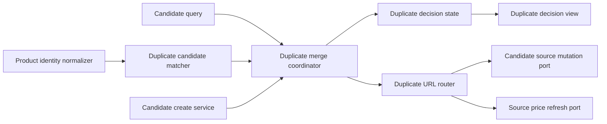
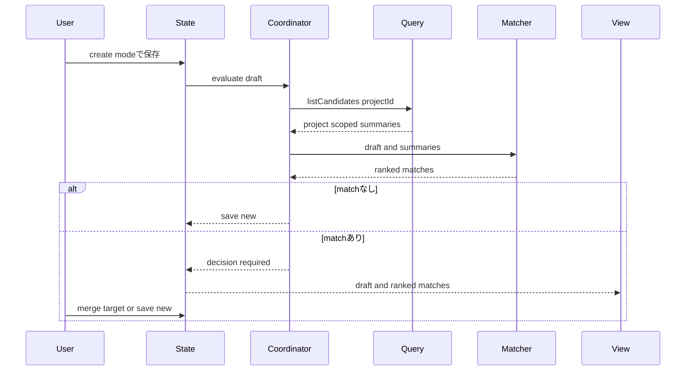
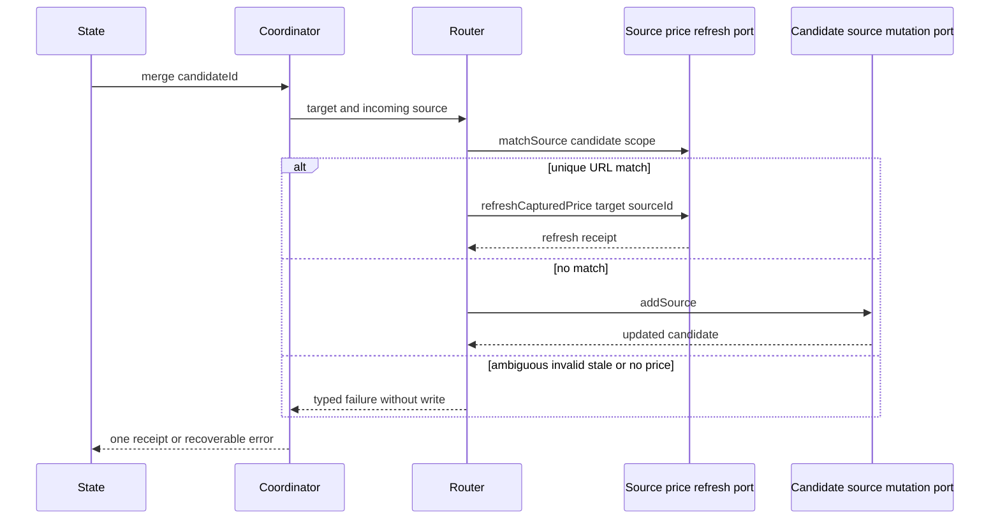

# 設計文書

## 概要

本機能は、candidate-managementの新規候補保存フローへ保存前guardを追加し、対象プロジェクト内の既存候補と取り込みdraftを照合する。一致候補がなければ既存の新規保存をそのまま実行し、一致候補があれば候補管理の非一過性editor内で利用者へ根拠付きで提示する。統合は利用者が一件を明示確定した場合だけ行う。

統合時は `candidate-source-bookmarks` の `CandidateSourceMutationPort.addSource` を一度だけ呼び、既存候補の商品値や正規化属性を変更しない。同一URLは `source-price-refresh` のURL identityとcandidate-scoped matchを利用し、新規sourceを追加せず既存sourceの価格更新へ振り分ける。

### 目標

- 型番を最優先、メーカー+商品名を補助とする決定的・説明可能な照合を提供する。
- 誤統合を避けるため、新規保存を安全な初期判断とし、統合に明示確定を要求する。
- source追加、同一URL更新、新規候補作成を相互排他的な一回のwrite経路へ分ける。
- 照合・統合失敗時にcandidate editorの入力と既存候補を保持する。

### 非目標

- 保存済み候補どうしの事後マージ、project横断照合、fuzzy search、外部商品DB照合
- source collection、primary、per-source price、URL identity、価格抽出・更新の再定義
- product-captureの抽出順位、compatibility rule、schema migration、ブラウザ権限の変更

## 境界コミットメント

### 本specが所有するもの

- product-captureの既存文字列cleaningと連続性を持つ、照合専用商品識別値normalizerの公開契約。
- project内candidate summaryと新規draftを受ける純粋な一致判定、カテゴリgate、確信度、根拠、決定的順位。
- candidate-management create modeの保存前評価、判断保持、統合確認、取消、失敗回復。
- 新規保存、source追加、同一URL価格更新の相互排他的なルーティング。
- 統合提示と失敗文言の日本語・英語catalog追加、および自動検証。

### 境界外

- `CandidateSource`、`CandidateSourceId`、`primarySourceId`、`CandidateSourceMutationPort` とその原子性は `candidate-source-bookmarks` が所有する。
- URL同一性、source catalog照合、価格抽出、価格・capturedAt更新、context menu、transient起動、権限・artifact gateは `source-price-refresh` が所有する。
- project/candidate CRUD、保存時validation、revision、mutation contextはcandidate-managementの既存責務である。
- captureの固定tab実行、一過性面、pre-edit handoff、project解決は `product-capture-transient-migration` の責務である。
- source product値の食い違い解決、保存済み候補どうしの統合、商品マスターは扱わない。

### 許可する依存

- `candidate-management/public.ts`: `CandidateQuery.listCandidates`、`CandidateSourceMutationPort`、canonical draft/summary/error contract。
- `product-capture/public.ts`: `ProductIdentityNormalizer`。内部 `normalizer.ts` へのdeep importは禁止する。
- `source-price-refresh/public.ts`: `normalizeSourcePageUrl`、`sameSourcePageUrl`、`SourcePriceRefreshPort`、`MatchedCandidateSource`、error/receipt contract。
- local data foundationの `CandidatePartId`、`ProjectId`、`PartCategory`、`SourcedValue`、`Result<T, E>`。
- candidate-managementの既存state/view/snapshotと、ui-message catalog、React 19、標準Unicode/URL API。
- project候補の読込は `CandidateQuery` に限定し、foundation rootやChrome Storageを直接読まない。

### 再検証トリガー

- `CandidateSummary`からname、manufacturer、modelNumber、category、projectIdのいずれかが除かれる場合。
- `CandidateSourceMutationPort.addSource`、`AddCandidateSourceInput`、最初のsourceのprimary規則が変わる場合。
- `SourcePriceRefreshPort.matchSource` / `refreshCapturedPrice`、URL identity、candidate scope、source kind eligibilityが変わる場合。
- `UnresolvedCandidateDraft`のproject解決、candidate-management create/edit mode、snapshot rollback契約が変わる場合。
- 商品識別値のUnicode、区切り、confirmed/original優先規則またはcategory集合が変わる場合。

## アーキテクチャ

### 既存アーキテクチャ分析

- `product-capture-transient-migration` 後、captureは抽出結果を候補管理へ渡して終了する。候補管理がprojectを解決し、canonical draftをeditorへ保持するため、保存前判断はここに置く。
- `CandidateQuery.listCandidates({projectId})` はproject限定summaryを返し、照合に必要なcategory・name・manufacturer・modelNumberを持つ。新しいfoundation queryやroot readは不要である。
- `candidate-source-bookmarks` はsource追加のdownstream portを公開する。duplicate coordinatorはsource ID生成、primary変更、revision補完を再実装しない。
- `source-price-refresh` はURL identityとcandidate-scoped一意照合を公開する。同一URLの定義は本機能へ持ち込まない。

### アーキテクチャパターンと境界マップ



**アーキテクチャ統合**

- 選択パターン: 純粋matcher + application coordinator + candidate-management state/view。
- 依存方向: Domain types → upstream public normalizers/ports → Matcher → Coordinator/Router → State → View。
- 既存パターン: feature外importは `public.ts`、永続化はcanonical port、Reactは表示adapter、errorは判別共用体。
- 新規componentの理由: matcherをI/Oから分離し、URL/source追加の分岐をURL ownerへ委譲し、UI判断を保存処理から分離する。
- steering準拠: server/権限/新規libraryなし、single write authority、未信頼値の安全表示、架空fixture。

### 技術スタック

| 層 | 選択 / Version | 本機能での役割 | 注記 |
|---|---|---|---|
| UI | React 19 / React DOM | 一致候補、根拠、統合・新規保存判断の表示 | candidate-management既存root内 |
| Application | TypeScript 7 strict | matcher、coordinator、state、判別union | `any`、unsafe cast禁止 |
| Domain | 標準Unicode API、canonical domain types | NFKC、case fold、category、ID、SourcedValue | 新規libraryなし |
| Data | candidate-management/source public ports | project query、candidate create、source add | foundation rootへ直接依存しない |
| Adjacent | source-price-refresh public port | URL identity、一意source照合、価格更新 | 権限・runtime起動は隣接spec所有 |

## ファイル構成計画

### ディレクトリ構成

```text
src/
├── features/
│   ├── product-capture/
│   │   └── product-identity-normalizer.ts     # 照合用canonical normalization
│   └── candidate-management/
│       ├── duplicate-matcher.ts               # project内の純粋一致判定
│       ├── duplicate-merge.ts                 # 保存前評価と判断確定
│       └── duplicate-url-router.ts            # source addと価格更新の排他的分岐
├── ui-messages/catalog/
│   ├── ja/candidate.ts                        # 日本語の一致・統合・失敗文言
│   └── en/candidate.ts                        # 英語の同一key文言
└── application-shell/
    └── side-panel-contributions.ts            # public port同士のcomposition

tests/
├── features/product-capture/
│   └── product-identity-normalizer.test.ts
├── features/candidate-management/
│   ├── duplicate-matcher.test.ts
│   ├── duplicate-merge.test.ts
│   └── duplicate-product-merge.integration.test.tsx
└── ui-messages/
    └── catalog-parity.test.ts

e2e/
└── duplicate-product-merge.spec.ts
```

### 変更対象ファイル

- `src/features/product-capture/normalizer.ts` — 制御文字・空白cleaning primitiveを照合normalizerと共有する。
- `src/features/product-capture/public.ts` — `ProductIdentityNormalizer` とfactoryだけを追加公開する。
- `src/features/candidate-management/contracts.ts` — 保存前判断、match、receipt、errorの内部型を追加し、upstream source型は再定義しない。
- `src/features/candidate-management/service.ts` — 既存create serviceをcoordinatorへ接続し、edit modeの保存経路は維持する。
- `src/features/candidate-management/state.ts` — create modeのevaluate/decide/cancel/retry、二重送信抑止、draft保持を追加する。
- `src/features/candidate-management/state-snapshot.ts` — pending decisionをversion付きJSONとして検証・復元する。
- `src/features/candidate-management/view.tsx`、`styles.css` — 候補一覧、根拠、明示選択、新規保存、失敗回復を描画する。
- `src/features/candidate-management/feature-contribution.ts` — matcher/coordinator/price refresh portをstateへ注入する。
- `src/features/candidate-management/public.ts` — upstream query/source mutation contractを再公開し、内部matcherを公開しない。
- `src/ui-messages/catalog/ja/candidate.ts`、`en/candidate.ts` — locale parityを保った文言keyを追加する。
- `src/application-shell/side-panel-contributions.ts` — source-price-refreshのpublic portとcandidate-management contributionをcompositionする。業務判断は持たない。
- `tests/features/candidate-management/state.test.ts`、`state-snapshot.test.ts`、`view.test.tsx` — 既存editor回帰と新しい判断状態を検証する。
- `e2e/locators.ts` — feature固有の安定したdata locatorを追加する。

## システムフロー

### 保存前照合と利用者判断



照合中は既存の `isSaving` と同じく再送を抑止する。matchありではwriteを行わず、選択なしを新規保存判断として表示する。cancelはeditor draftへ戻り、永続状態を変更しない。

### 統合確定と同一URL分岐



`matchSource` の `no-match` だけをsource addへ変換する。`ambiguous-match`、`invalid-url`、`stale-target`、`ineligible-source`、`price-unavailable` と管理系失敗はfallback addを行わない。URL一意一致時にpriceがない場合も既存価格を消さず失敗としてdraftを保持する。

## 要件トレーサビリティ

| 要件 | 概要 | コンポーネント | インターフェース | フロー |
|---|---|---|---|---|
| 1.1, 1.2, 1.3, 1.4, 1.5 | project内保存前照合 | DuplicateMergeCoordinator、DuplicateCandidateMatcher | `CandidateQuery.listCandidates` | 保存前照合 |
| 2.1, 2.2, 2.3, 2.4, 2.5, 2.6, 2.7, 2.8, 2.9, 2.10 | 正規化、category、順位、根拠 | ProductIdentityNormalizer、DuplicateCandidateMatcher | `normalizeProductIdentity`、`match` | 保存前照合 |
| 3.1, 3.2, 3.3, 3.4, 3.5, 3.6, 3.7 | 明示判断 | DuplicateMergeState、DuplicateMergeView、DuplicateMergeCoordinator | `evaluate`、`complete` | 保存前照合 |
| 4.1, 4.2, 4.3, 4.4, 4.5, 4.6, 4.7 | source統合と既存値保持 | DuplicateMergeCoordinator、DuplicateUrlRouter | `CandidateSourceMutationPort.addSource` | 統合確定 |
| 5.1, 5.2, 5.3, 5.4, 5.5 | 同一URL価格更新分岐 | DuplicateUrlRouter | `matchSource`、`refreshCapturedPrice` | 同一URL分岐 |
| 6.1, 6.2, 6.3, 6.4, 6.5, 6.6 | 失敗回復と原子性 | DuplicateMergeCoordinator、DuplicateMergeState | typed result、revision-aware upstream ports | 全フロー |
| 7.1, 7.2, 7.3, 7.4, 7.5, 7.6 | 境界、安全、検証 | 全コンポーネント | public-only imports、message catalog | 全フロー |

## コンポーネントとインターフェース

| コンポーネント | 層 | 意図 | 要件 | 主要依存 | 契約 |
|---|---|---|---|---|---|
| ProductIdentityNormalizer | Product capture integration | 表示値を変更せず照合キーを生成 | 2.1–2.6, 7.5 | 標準Unicode、既存cleaning | Service |
| DuplicateCandidateMatcher | Candidate domain | category gate、二段階match、順位、根拠 | 1.2–1.4, 2.1–2.10 | normalizer、domain types | Service |
| DuplicateMergeCoordinator | Candidate application | 保存前評価と三つのcommit結果を調停 | 1.1–1.5, 3.4–3.7, 4.1–4.7, 6.1–6.6 | query、matcher、router、create service | Service |
| DuplicateUrlRouter | Integration | same URLならrefresh、no-matchならaddを排他的に実行 | 4.1–4.7, 5.1–5.5, 6.2–6.4 | source mutation、price refresh | Service |
| DuplicateMergeState | UI state | draft、照合中、判断、失敗、再試行を保持 | 3.1–3.7, 5.5, 6.1–6.6 | coordinator、snapshot | State |
| DuplicateMergeView | UI | 一致根拠と明示判断を安全に描画 | 3.1–3.6, 6.1, 6.4, 7.3–7.5 | state、messages | State |

### Product Capture Integration

#### ProductIdentityNormalizer

| 項目 | 詳細 |
|---|---|
| 意図 | display normalizationと値保存を変えず、照合専用の比較文字列を返す |
| 要件 | 2.1, 2.2, 2.3, 2.4, 2.5, 2.6, 7.5 |

**責務と制約**

- 制御文字を空白へ置換し、NFKC、連続空白の畳み込み、trim、locale-neutral lowercaseを順に適用する。
- model numberだけはその後に空白、`-`、`_` を除去する。name/manufacturerの内部区切りは保持する。
- 空文字になった値は `undefined` とし、推測値を作らない。
- `SourcedValue`からは `confirmed` を優先し、未確認時だけ非空 `original` を使う。この選択は入力を変更しない。
- product-captureの表示用normalizerは共有cleaning primitiveだけを使い、lowercaseやmodel区切り除去を保存値へ適用しない。

**依存**

- Inbound: product-capture normalizer、DuplicateCandidateMatcher（P0）
- Outbound: 標準Unicode API（P0）

**契約**: Service [x]

```typescript
type ProductIdentityField = "name" | "manufacturer" | "model-number";

interface ProductIdentityNormalizer {
  normalize(
    field: ProductIdentityField,
    value: SourcedValue<string> | undefined,
  ): string | undefined;
}

function createProductIdentityNormalizer(): ProductIdentityNormalizer;
```

- 前提条件: candidate境界で検証済みの `SourcedValue<string>` または欠損。
- 事後条件: 同じ入力は同じkeyを返し、raw/confirmed値を更新しない。
- 不変条件: name/manufacturer/model以外のfield、URL、価格を受け取らない。

### Candidate Domain

#### DuplicateCandidateMatcher

| 項目 | 詳細 |
|---|---|
| 意図 | 一つの新規draftとproject限定summaryから説明可能な一致候補を返す |
| 要件 | 1.2, 1.3, 1.4, 2.1, 2.2, 2.3, 2.4, 2.5, 2.6, 2.7, 2.8, 2.9, 2.10 |

**責務と制約**

- 両categoryが `uncategorized` 以外で異なるcandidateを最初に除外する。
- 両model keyが存在して一致すれば `high/model-number`、両方存在して不一致なら除外する。
- model一致を確定できない場合だけ、manufacturerとnameの両key一致を `supporting/manufacturer-name` とする。
- identity key不足はmatchにせず、confidence降格や部分一致を作らない。
- confidence順、次に `CandidatePartId` の安定文字列表現順で並べる。候補配列順やlocaleへ依存しない。

**依存**

- Inbound: DuplicateMergeCoordinator（P0）
- Outbound: ProductIdentityNormalizer、canonical CandidateSummary（P0）

**契約**: Service [x]

```typescript
type DuplicateMatchConfidence = "high" | "supporting";

type DuplicateMatchEvidence =
  | { readonly kind: "model-number" }
  | { readonly kind: "manufacturer-name" };

interface DuplicateCandidateMatch {
  readonly candidateId: CandidatePartId;
  readonly confidence: DuplicateMatchConfidence;
  readonly evidence: DuplicateMatchEvidence;
  readonly summary: CandidateSummary;
}

interface DuplicateCandidateMatcher {
  match(
    draft: CandidateDraft,
    candidates: readonly CandidateSummary[],
  ): readonly DuplicateCandidateMatch[];
}
```

- 前提条件: `candidates` は `draft.projectId` と同じprojectをqueryした結果。
- 事後条件: 入力順にかかわらず同じmatch順を返す。
- 不変条件: draft、summary、保存データへmutationを行わない。

### Candidate Application

#### DuplicateMergeCoordinator

| 項目 | 詳細 |
|---|---|
| 意図 | create modeの保存前評価と利用者判断を既存save/source portへ写像する |
| 要件 | 1.1, 1.2, 1.3, 1.4, 1.5, 3.4, 3.5, 3.6, 3.7, 4.1–4.7, 6.1–6.6 |

**責務と制約**

- evaluateは `CandidateQuery.listCandidates({projectId})` だけを使い、別projectやfoundation rootを読まない。
- matchなしは既存create serviceへ一度だけ委譲し、matchありはwriteなしのdecision resultを返す。
- completeのdecisionは `save-new` または一件の `merge` だけを許す。未選択mergeを型で表現しない。
- merge前にtargetが直近match集合に存在することを検証し、routerへ渡す。router結果以外の補償writeを行わない。
- edit modeは既存update serviceへそのまま流し、本機能を起動しない。

**依存**

- Inbound: DuplicateMergeState（P0）
- Outbound: CandidateQuery、DuplicateCandidateMatcher、DuplicateUrlRouter、CandidateManagementService（P0）

**契約**: Service [x]

```typescript
type DuplicateSaveDecision =
  | { readonly kind: "save-new" }
  | { readonly kind: "merge"; readonly candidateId: CandidatePartId };

type DuplicateEvaluation =
  | { readonly kind: "saved-new"; readonly candidate: CandidatePart }
  | {
      readonly kind: "decision-required";
      readonly matches: readonly DuplicateCandidateMatch[];
    };

type DuplicateCommitReceipt =
  | { readonly kind: "saved-new"; readonly candidate: CandidatePart }
  | { readonly kind: "source-added"; readonly candidateId: CandidatePartId }
  | {
      readonly kind: "price-refreshed";
      readonly receipt: SourcePriceRefreshReceipt;
    };

type DuplicateMergeError =
  | { readonly kind: "management"; readonly cause: ManagementError }
  | { readonly kind: "source-route"; readonly cause: DuplicateUrlRouteError }
  | { readonly kind: "stale-decision" };

interface DuplicateMergeCoordinator {
  evaluate(
    draft: CandidateDraft,
    context: MutationContext,
  ): Promise<Result<DuplicateEvaluation, DuplicateMergeError>>;
  complete(
    draft: CandidateDraft,
    matches: readonly DuplicateCandidateMatch[],
    decision: DuplicateSaveDecision,
    context: MutationContext,
  ): Promise<Result<DuplicateCommitReceipt, DuplicateMergeError>>;
}
```

`MutationContext` は既存candidate-management stateが操作ごとに生成して渡す。coordinatorはrequest IDやrevisionを生成・補完せず、`save-new` のときだけ受け取ったcontextを既存create serviceへそのまま委譲する。merge経路のcontext管理は注入済み公開mutation portのownerに留める。

`CandidateDraft`に含まれる初期sourceは上流 `CaptureSourceMapper` が構築したcanonical入力を使う。coordinatorはURL、price、capturedAt、kind、siteNameのshapeを再定義せず、`AddCandidateSourceInput` へ上流mapperで写像する。

#### DuplicateUrlRouter

| 項目 | 詳細 |
|---|---|
| 意図 | 選択targetのincoming URLを一意照合し、refreshまたはaddの片方だけを実行する |
| 要件 | 4.1–4.7, 5.1–5.5, 6.2, 6.3, 6.4 |

**責務と制約**

- `SourcePriceRefreshPort.matchSource({scope:{kind:"candidate", candidateId}, pageUrl})` を最初に呼ぶ。
- successは返されたsource IDをtargetに `refreshCapturedPrice` を一度呼ぶ。URLや配列indexでsourceを更新しない。
- `no-match` だけを `CandidateSourceMutationPort.addSource` へ変換する。
- `ambiguous-match`、`invalid-url`、`ineligible-source`、`stale-target`、`price-unavailable`、管理系失敗はaddへfallbackしない。
- price欠損の同一URLではrefreshを実行せず、既存priceを維持する。

**依存**

- Inbound: DuplicateMergeCoordinator（P0）
- Outbound: SourcePriceRefreshPort、CandidateSourceMutationPort（P0）

**契約**: Service [x]

```typescript
type DuplicateUrlRouteReceipt =
  | { readonly kind: "source-added"; readonly candidateId: CandidatePartId }
  | {
      readonly kind: "price-refreshed";
      readonly receipt: SourcePriceRefreshReceipt;
    };

type DuplicateUrlRouteError =
  | { readonly kind: "source-refresh"; readonly cause: SourcePriceRefreshError }
  | { readonly kind: "source-add"; readonly cause: ManagementError };

interface DuplicateUrlRouter {
  route(
    targetCandidateId: CandidatePartId,
    input: AddCandidateSourceInput,
  ): Promise<Result<DuplicateUrlRouteReceipt, DuplicateUrlRouteError>>;
}
```

`CandidateSourceMutationPort` はcommandの成功を `void` で返す既存の一貫した公開契約を維持する。source追加成功receiptは変更対象の `candidateId` だけを返し、最新候補の表示が必要なconsumerは成功後にcanonical queryで再読込する。routerは更新後の `CandidatePart` を合成せず、追加queryも行わない。

### Candidate UI

#### DuplicateMergeState

| 項目 | 詳細 |
|---|---|
| 意図 | create editorのdraftと照合判断を永続write前に保持する |
| 要件 | 3.1–3.7, 5.5, 6.1–6.6 |

**契約**: State [x]

```typescript
type DuplicateDecisionState =
  | { readonly status: "idle" }
  | { readonly status: "evaluating"; readonly draft: CandidateDraft }
  | {
      readonly status: "deciding";
      readonly draft: CandidateDraft;
      readonly matches: readonly DuplicateCandidateMatch[];
      readonly selectedCandidateId?: CandidatePartId;
    }
  | {
      readonly status: "committing";
      readonly draft: CandidateDraft;
      readonly decision: DuplicateSaveDecision;
    }
  | {
      readonly status: "failed";
      readonly draft: CandidateDraft;
      readonly matches: readonly DuplicateCandidateMatch[];
      readonly error: DuplicateMergeError;
    };
```

- `deciding` の初期値は `selectedCandidateId: undefined`。viewでは新規保存を既定判断として表示する。
- evaluate/complete中は同じactionを受け付けない。
- cancelは `idle` へ戻るがeditor draftを維持する。成功だけがeditorを閉じ一覧をreloadする。
- snapshotは `deciding` と `failed` のdraft/matchesだけをversion付きで検証し、`evaluating`/`committing` は復元時に再実行可能な失敗へ変換する。

#### DuplicateMergeView

| 項目 | 詳細 |
|---|---|
| 意図 | 一致候補と根拠を提示し、統合targetを明示選択させる |
| 要件 | 3.1–3.6, 6.1, 6.4, 7.3, 7.4, 7.5 |

summary-only component。candidate-management editorのcreate modeだけに、name、manufacturer、model number、category、confidence、evidenceを順位順で表示する。候補radioは未選択で開始し、「新規候補として保存」と「選択候補へ統合」を別actionにする。統合actionはtarget未選択では無効である。外部文字列はJSX childとして描画し、URL自体は一致根拠画面へ表示しない。失敗は安定したmessage keyへ写像し、商品値・完全URL・error objectをログへ出さない。

## データモデル

### ドメインモデル

- `DuplicateCandidateMatch` は一時的な説明projectionであり、永続化しない。
- aggregate rootは既存 `CandidatePart` のまま。mergeはtarget candidate aggregate内のsource collectionだけを更新する。
- incoming draftの商品値は照合材料であり、merge時のtarget product更新材料ではない。
- `source-added`、`price-refreshed`、`saved-new` は相互排他的なreceiptで、同一操作から複数返さない。

### 論理データモデル

- 永続schema変更なし。`schemaVersion`、backup形式、migrationを追加しない。
- UI snapshotへ `DuplicateDecisionState` のJSON直列化可能なsubsetを追加する。snapshotは永続商品データではなく、同一side panel rollback用の一時状態である。
- candidate ID、source IDはcanonical branded IDを使い、URLやindexをIDとして保存しない。

### データ契約と統合

- 候補読込: `CandidateQuery.listCandidates({projectId})`。返却projectの混在はcontract違反として評価を中止する。
- source追加: `CandidateSourceMutationPort.addSource(AddCandidateSourceInput)`。source shapeとrevision補完は上流に委譲する。
- URL照合: `SourcePriceRefreshPort.matchSource({scope:{kind:"candidate", candidateId}, pageUrl})`。
- price更新: `refreshCapturedPrice({target:{candidateId, sourceId}, observedPageUrl, capturedAt, price})`。price欠損時は呼ばない。
- feature間importは各 `public.ts` のみ。source-priceの `CandidateSourceCatalogPort`、captureの `PagePriceExtractionPort`、transient gesture登録は本機能から直接利用しない。

## エラー処理

### エラー方針

- query failure: draft保持、再照合または明示新規保存を提示する。自動的に照合をskipして保存しない。
- stale decision/conflict: writeせず、最新candidate一覧の再評価を要求する。
- source add failure: upstream atomic mutationによりtargetを変更せず、draftとmatchを保持する。
- URL match/refresh failure: source追加へfallbackせず、source-price errorを安定messageへ写像する。
- invalid incoming source: field-level validationを表示し、既存candidateを変更しない。

### 主なカテゴリ

| 分類 | 例 | 応答 |
|---|---|---|
| 入力 | invalid URL、price欠損、source shape不正 | field理由、draft保持 |
| 一致 | no match | source addへ進む |
| 曖昧 | ambiguous URL、複数target | 無変更、選択不能案内 |
| 競合 | candidate/source削除、revision conflict | 無変更、再評価 |
| 保存 | maintenance、quota、storage | 無変更、既存管理error案内 |
| 安全 | unsupported data | mutation無効、復旧案内 |

### 監視

追加telemetryは導入しない。必要な診断は安定error code、operation種別、request IDに限定し、candidate ID、source ID、商品値、完全URL、保存内容、例外dumpを出さない。

## テスト戦略

### Unit tests

- ProductIdentityNormalizer: 大小文字、全角半角、制御文字、空白、modelの空白/ハイフン/アンダースコア、confirmed優先、空値を検証する（2.1–2.6）。
- DuplicateCandidateMatcher: model high、manufacturer+name supporting、model不一致fallback禁止、identity不足、分類済み異カテゴリ除外、未分類許容、決定的順位とevidenceを検証する（1.2–1.4、2.1–2.10）。
- DuplicateUrlRouter: unique match refresh、no-match add、ambiguous/invalid/stale/ineligible/priceなしの非fallbackを検証する（4.1–4.7、5.1–5.5、6.2–6.4）。
- DuplicateMergeState: 二重送信抑止、未選択初期値、cancel、retry、明示新規保存、成功時だけeditor終了を検証する（3.1–3.7、6.1–6.6）。

### Integration / contract tests

- product-capture handoffからproject解決済みcreate draftを保存し、project限定query→decision requiredまでにwriteがないことを検証する（1.1–1.5、3.1）。
- merge確定が `addSource` を一度だけ呼び、新規candidateを作らずproduct/attributes/primaryを保持することを検証する（4.1–4.7）。
- 同一URLがsource-price public identityで一件へ一致し、addSourceを呼ばずrefresh targetにcanonical source IDを渡すことを検証する（5.1–5.5）。
- query、conflict、storage、quota、refresh handoff失敗でdraftと既存candidateが保持されることを検証する（6.1–6.6）。
- snapshot rollbackでdeciding/failedが復元され、不正・未知snapshotがwriteを発生させないことを検証する（3.6、6.1、7.5）。

### DOM / E2E tests

- DOM: model一致とメーカー+名称一致の根拠、順位、新規保存既定、target未選択の統合無効化、取消を利用者操作で検証する（3.1–3.7）。
- DOM: 悪意ある商品名・メーカー・型番がHTML/scriptとして解釈されず、完全URLが表示されないことを検証する（7.3、7.4）。
- E2E: 架空ページ取り込み→candidate editor→既存候補提示→source追加成功→候補が一件のままsourceが増える経路を検証する（1.1、3.4、4.1、4.6）。
- E2E: 同じ架空URLの再取り込みでsourceが増えず、price refresh receiptへ到達する経路を検証する（5.1、5.2）。
- E2E: matchなしと「新規保存」選択で従来createが非回帰であることを検証する（1.3、1.4、3.5、6.6）。

## セキュリティ考慮事項

- incoming draft、candidate summary、URL match resultを境界で検証済みのcanonical型として受ける。未信頼 `unknown` をmatcherへ渡さない。
- 外部文字列は通常のJSX childだけで描画し、`dangerouslySetInnerHTML`、`innerHTML`、通常linkを使用しない。
- source-price-refreshのcontextMenus権限やartifact gateを変更しない。本機能単独では権限を追加しない。
- fixtureは `.invalid` domainの架空データだけを使い、生HTML、画像、実商品値を含めない。
- source追加と価格更新は公開portへ委譲し、Chrome Storage adapterやwrite authority生成関数を公開しない。
