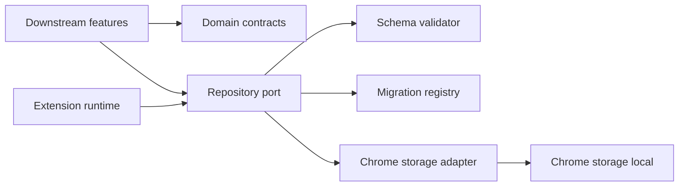
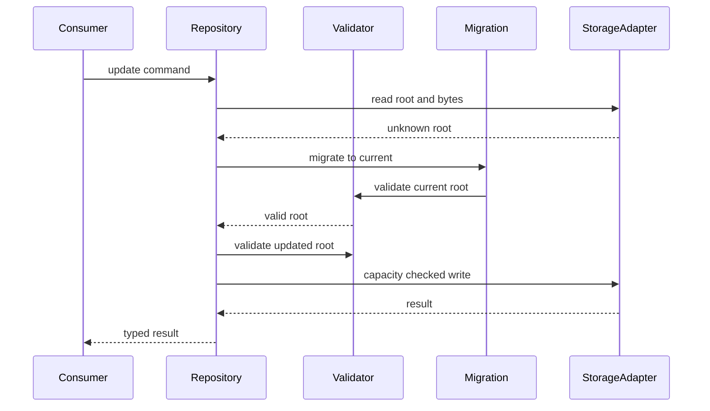
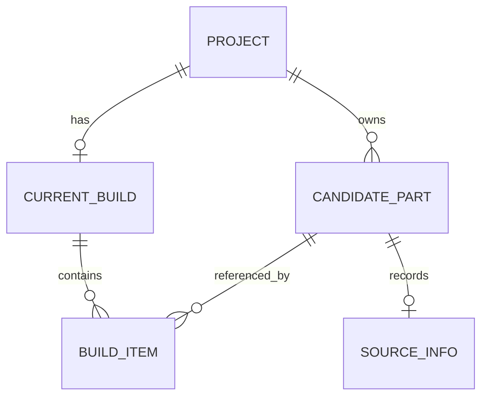

# Design Document

## Overview

本機能は、後続機能の開発者へChrome 116以降のManifest V3実行骨格と、安全に進化できるローカルデータ契約を提供する。現状のNode.jsプロジェクトへTypeScriptビルド、拡張manifest、service worker、共有ドメイン型、実行時検証、`chrome.storage.local`アダプターを導入する。

設計は小規模なポートとアダプター構成とし、ドメイン契約をChrome APIから分離する。保存は単一のバージョン付きルートを単位として検証・移行・更新し、すべての失敗を判別可能な結果型として下流へ返す。

### Goals
- 下流specが共有できる型安全かつ実行時検証可能なデータ契約を確立する
- 容量、破損、移行、信頼境界を一つの保存APIで一貫して扱う
- service workerの停止や再起動後も永続状態を正しく利用できる

### Non-Goals
- ユーザー向け管理画面またはサイドパネル
- 商品抽出、候補管理、構成選択、互換性判定の業務規則
- JSONファイル入出力、同期、Chrome以外の保存アダプター

## Boundary Commitments

### This Spec Owns
- MV3 manifest、service worker起動処理、CSP・権限・ストレージアクセス設定
- 共通ドメイン型、ID・UTC日時規約、保存ルート、実行時検証
- 保存ルートのCRUD、直列更新、容量判定、エラー正規化、連続スキーマ移行

### Out of Boundary
- ページDOMやcontent scriptメッセージの意味解釈
- 下流機能固有の編集可否、選択数、互換性ルール、表示文言
- バックアップファイル形式とファイルI/O

### Allowed Dependencies
- Chrome 116以降のManifest V3、`chrome.storage.local`、Web Crypto UUID
- TypeScript、ビルド・テスト用ローカル開発依存
- 下流は公開ドメイン契約とRepositoryポートへ依存し、Storage APIへ直接依存しない

### Revalidation Triggers
- 保存ルート、エンティティ、カテゴリ、エラー結果の形状変更
- ID・日時・参照整合性またはスキーマ移行規約の変更
- `storage.local`以外への所有権移動、依存方向、起動設定、権限の変更

## Architecture

### Existing Architecture Analysis

現行は`package.json`とBiomeのみで、ソース、型検査、テスト、ビルド設定はない。既存実装との互換性制約はなく、下流specが利用する公開境界を本仕様で最初に固定する。

### Architecture Pattern & Boundary Map



- **Selected pattern**: 軽量なポートとアダプター。ドメインと保存契約をプラットフォームから分離する。
- **Dependency direction**: `Domain → Validation → Migration → Repository Port → Chrome Adapter → Runtime`。右側は左側へだけ依存する。
- **Boundary rule**: 下流機能は`domain`と`persistence`の公開エントリポイントのみ利用し、Chromeアダプターを直接呼ばない。
- **Concurrency**: Repositoryが単一プロセス内の更新を直列化し、各更新で最新ルートを再読込・検証して一括保存する。

### Technology Stack

| Layer | Choice / Version | Role in Feature | Notes |
|---|---|---|---|
| Language | TypeScript 5.x | 厳密な共有型とビルド | `strict`、`any`禁止 |
| Build | esbuild 0.x | service workerと公開モジュールの同梱 | ブラウザ向けES module |
| Test | Vitest 3.x | ドメイン・保存統合テスト | Chrome APIはインメモリアダプターで代替 |
| Data | Chrome Storage API 116+ | ローカル永続化と容量取得 | `unlimitedStorage`不使用 |
| Runtime | Manifest V3 / Chrome 116+ | 拡張実行 | 同梱コードのみ |

## File Structure Plan

```text
manifest.json                         # MV3宣言、権限、service worker入口
package.json                          # 型検査、ビルド、テストスクリプトと開発依存
tsconfig.json                         # strict TypeScript設定
vitest.config.ts                      # Node上の基盤テスト設定
scripts/build.ts                      # dist生成とmanifest配置
src/runtime/service-worker.ts         # 起動時アクセス制限とRepository初期化
src/domain/model.ts                   # エンティティ、カテゴリ、属性、保存ルート型
src/domain/identifiers.ts             # UUID生成・検証とUTC日時規約
src/domain/result.ts                  # Resultと共通エラー判別共用体
src/domain/validation.ts              # 未知値から現行契約への実行時検証
src/persistence/schema.ts             # 現行スキーマ版と空ルート生成
src/persistence/migrations.ts         # 連続移行レジストリと移行実行
src/persistence/repository.ts         # Repositoryポート、CRUD、直列更新契約
src/persistence/chrome-storage.ts     # Storage APIアダプター、容量、エラー正規化
src/index.ts                          # 下流向け公開エントリポイント
tests/fixtures/foundation.ts          # 架空の有効・不正データ生成
tests/domain/validation.test.ts       # 型、参照、生HTML・画像拒否の検証
tests/persistence/migrations.test.ts  # 移行成功、未知版、ロールバック相当検証
tests/persistence/repository.test.ts  # CRUD、再試行、破損、容量、競合の統合検証
tests/runtime/manifest.test.ts         # manifest、権限、CSP、アクセス初期化検証
```

## System Flows



読取、移行、更新、保存はRepositoryの直列化区間内で実行する。未知版、破損、容量不足では保存を行わない。

## Requirements Traceability

| Requirement | Summary | Components | Interfaces | Flows |
|---|---|---|---|---|
| 1.1–1.4 | MV3起動と制約 | ExtensionRuntime | manifest、起動処理 | 起動 |
| 2.1–2.6 | 共有モデル | DomainModel、IdentifierPolicy | 公開型、検証器 | 読取検証 |
| 3.1–3.6 | 検証付きCRUD | LocalDataRepository、SchemaValidator | RepositoryPort、Result | 更新フロー |
| 4.1–4.5 | バージョン移行 | MigrationRegistry、SchemaRoot | Migration | 読取・移行 |
| 5.1–5.5 | 容量と抑制 | ChromeStorageAdapter、SchemaValidator | StoragePort、CapacityStatus | 保存前確認 |
| 6.1–6.4 | 信頼境界 | ExtensionRuntime、SchemaValidator | access level、RepositoryPort | 起動・入力検証 |
| 7.1–7.3 | 架空データ検証 | TestHarness | InMemoryStoragePort | 全フロー |

## Components and Interfaces

| Component | Domain/Layer | Intent | Req Coverage | Key Dependencies | Contracts |
|---|---|---|---|---|---|
| DomainModel | Domain | 共有データと不変条件 | 2.1–2.6 | なし | State |
| SchemaValidator | Domain | unknown値と参照の検証 | 2.4, 2.6, 3.2–3.4, 5.4, 6.2 | DomainModel P0 | Service |
| MigrationRegistry | Persistence | 旧版から現行版への連続移行 | 4.1–4.5 | SchemaValidator P0 | Service |
| LocalDataRepository | Persistence | CRUDと一貫した更新境界 | 3.1–3.6 | MigrationRegistry P0、StoragePort P0 | Service |
| ChromeStorageAdapter | Adapter | Chrome保存と容量・アクセス制御 | 3.5, 5.1–5.5, 6.1–6.4 | Chrome API P0 | Service |
| ExtensionRuntime | Runtime | 起動時構成 | 1.1–1.4, 6.1 | ChromeStorageAdapter P0 | State |

### Domain Layer

#### DomainModel

保存ルート`LocalDataRoot`は`schemaVersion`、`projects`、`parts`、`currentBuilds`を持つ。すべてJSON直列化可能で、IDはUUID文字列、日時はUTC ISO 8601文字列とする。候補は必ず一つのプロジェクトへ属し、構成項目は同じプロジェクトの候補だけを参照する。元表記`sourceSnapshot`と確認値`confirmed`は別フィールドとする。

カテゴリ別属性は`category`を判別子とする共用体で表現し、未分類は互換性属性を持たない。生HTMLや画像バイナリ、data URLを契約に含めない。

#### SchemaValidator

```typescript
interface SchemaValidator {
  validateRoot(input: unknown): Result<LocalDataRoot, ValidationError>;
  validateCommand(input: unknown): Result<RepositoryCommand, ValidationError>;
}
```

- すべての境界入力を`unknown`から絞り込む。
- フィールド、ID、日時、URL、カテゴリ、参照整合性、禁止ペイロードを検証する。
- 検証は入力を変更せず、問題箇所をpath付きissueとして返す。

### Persistence Layer

#### MigrationRegistry

```typescript
interface MigrationStep<From extends number, To extends number> {
  readonly from: From;
  readonly to: To;
  migrate(input: unknown): Result<unknown, MigrationError>;
}

interface MigrationRegistry {
  toCurrent(input: unknown): Result<LocalDataRoot, MigrationError>;
}
```

連続する一方向移行だけを登録し、各段階と最終結果を検証する。将来版または経路欠落は入力を保存せず拒否する。

#### LocalDataRepository

```typescript
interface LocalDataRepository {
  read(): Promise<Result<LocalDataRoot, RepositoryError>>;
  createProject(project: Project): Promise<Result<LocalDataRoot, RepositoryError>>;
  putPart(part: CandidatePart): Promise<Result<LocalDataRoot, RepositoryError>>;
  putCurrentBuild(build: CurrentBuild): Promise<Result<LocalDataRoot, RepositoryError>>;
  deleteProject(projectId: ProjectId): Promise<Result<LocalDataRoot, RepositoryError>>;
  capacity(): Promise<Result<CapacityStatus, RepositoryError>>;
}
```

変更操作は直列化し、最新ルート読取、移行、変更適用、全体検証、容量確認、一括保存を行う。同じIDと同じ内容の再試行は成功扱いとし、異なる内容の重複は`conflict`を返す。プロジェクト削除は所属候補と構成を同じ更新内で除去する。

#### ChromeStorageAdapter

```typescript
interface StoragePort {
  read(key: string): Promise<Result<unknown | undefined, StorageError>>;
  write(key: string, value: unknown): Promise<Result<void, StorageError>>;
  bytesInUse(key?: string): Promise<Result<number, StorageError>>;
  restrictToTrustedContexts(): Promise<Result<void, StorageError>>;
}
```

単一キー`localDataRoot`を所有する。警告閾値は上限の80%、拒否判定は10MBとする。書込APIのquotaエラーも`quota-exceeded`へ正規化する。content scriptへこのポートを公開しない。

### Runtime Layer

#### ExtensionRuntime

起動ごとに`restrictToTrustedContexts`を呼び、失敗時は永続化サービスを利用可能として公開しない。manifestは`storage`権限とmodule service workerだけを宣言し、host permissions、`unlimitedStorage`、インラインコードを含めない。

## Data Models



- `Project`: id、name、createdAt、updatedAt。名前の業務規則は下流所有。
- `CandidatePart`: id、projectId、category、confirmed、sourceSnapshot、sourceInfo、normalizedAttributes、createdAt、updatedAt。
- `CurrentBuild`: projectId、items、updatedAt。選択数や互換性は検証せず、参照と正整数数量のみ保証する。
- `SourceInfo`: pageUrl、siteName、capturedAt。生ページ内容は保持しない。
- `NormalizedAttributes`: カテゴリ判別共用体。値は確認状態を表現可能にする。
- `LocalDataRoot`: schemaVersionと各エンティティ配列。保存の整合性単位。

## Error Handling

`RepositoryError`は`validation`、`corrupt-data`、`unsupported-version`、`migration-failed`、`quota-warning`、`quota-exceeded`、`access-denied`、`conflict`、`storage-unavailable`に判別する。予期しないChrome API例外は`storage-unavailable`へ正規化し、入力値や保存内容をログへ出さない。警告閾値到達は保存成功結果へ`CapacityStatus`を付加し、上限超過だけを失敗とする。

## Testing Strategy

- **Unit**: UUID/UTC日時、全カテゴリ属性、禁止ペイロード、参照整合性、Resultエラーpathを検証する。
- **Unit**: 連続移行、経路欠落、将来版、段階検証失敗が元入力を変更しないことを検証する。
- **Integration**: インメモリStoragePortでCRUD、カスケード削除、冪等再試行、重複競合、破損読取を検証する。
- **Integration**: 80%警告、10MB拒否、書込時quotaエラー、既存ルート保持を検証する。
- **Runtime**: manifestがMV3、Chrome 116、最小権限、同梱module worker、禁止権限なしであることを検証する。
- **Build smoke**: 架空データだけを使い、生成`dist`を未パッケージ拡張として読み込める構造にする。

## Security Considerations

- Storage access levelを`TRUSTED_CONTEXTS`に設定し、content scriptはRepositoryへ直接到達しない。
- 外部メッセージを受ける機能は本仕様外。将来追加時も送信元確認と`unknown`入力検証をRepository呼出し前に必須とする。
- CSP既定を弱めず、リモートコード、`eval`、インラインスクリプトを生成物検査で拒否する。

## Performance & Scalability

10MB以下の単一ルートをMVP上限とする。CRUD統合テストで最大許容サイズ近辺の読取・検証・保存が通常操作を阻害しないことを計測し、全体書換が実用上問題となる場合だけキー分割を再設計する。キー分割は参照整合性と移行境界を変えるため全下流specの再検証対象である。

## Migration Strategy

初期版は`schemaVersion: 1`で空ルートを生成する。以降は`N → N+1`の純粋移行を追加し、旧ルートをメモリ上で変換・検証した後にのみ現行ルートを保存する。失敗時は旧値を上書きしない。バックアップ復元固有の互換判定は`backup-restore` specがこの移行契約を呼び出して所有する。
