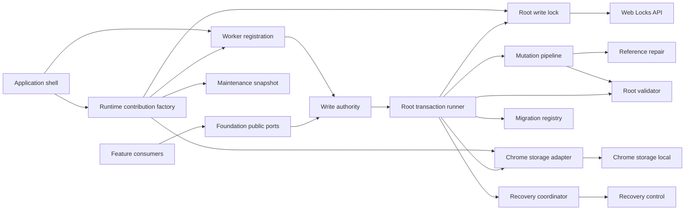
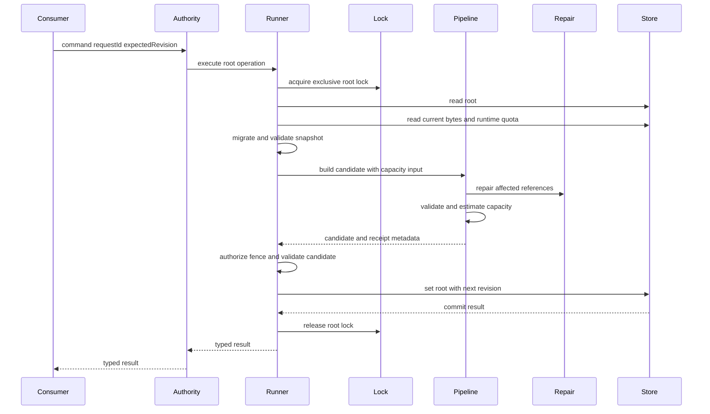
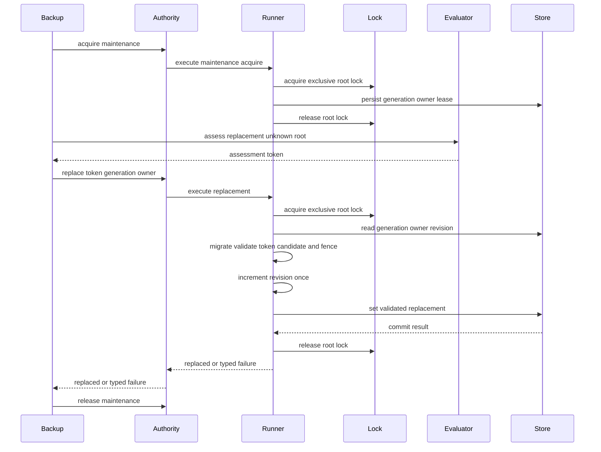
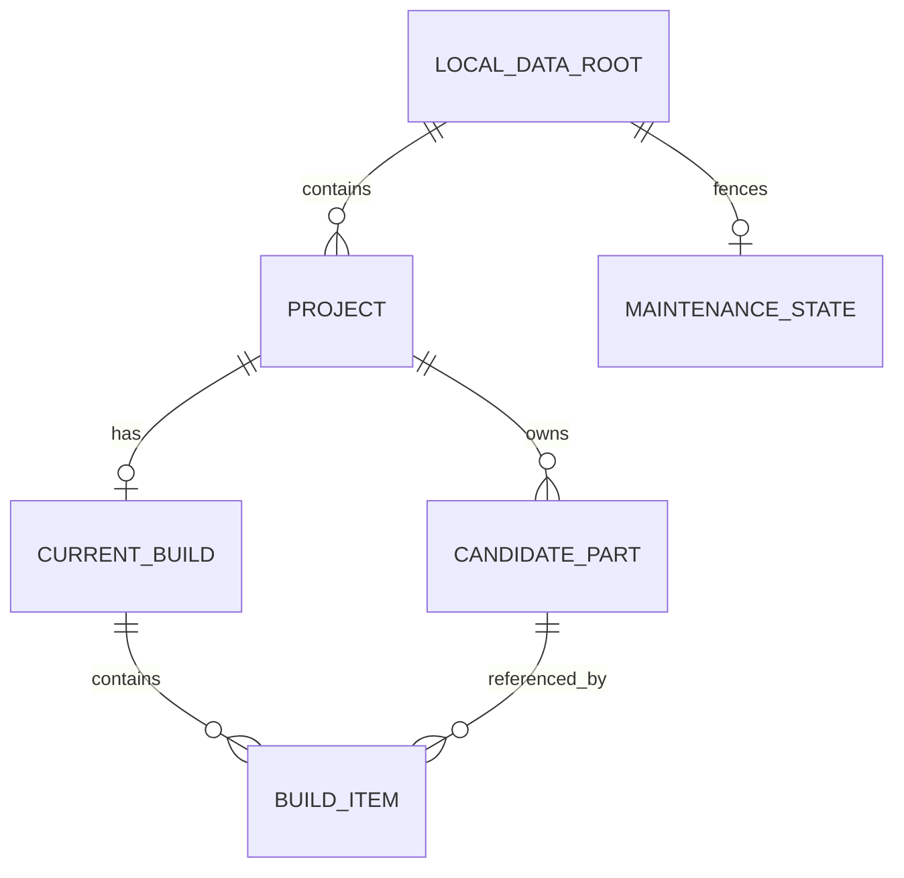

# Design Document

## Overview

本機能は、後続featureが共有するバージョン付きドメイン契約、canonical `Result<T, E>`、実行時検証、`chrome.storage.local`永続化、および全mutationを統制する単一write authorityを提供する。Chrome 116以降で読み込める最小Manifest V3骨格と開発基盤を確立し、保存値、runtime message、JSON由来の`unknown`を信頼境界で検証する。

保存は単一の`LocalDataRoot`を業務データの整合性単位とする。候補変更とCurrentBuild参照修復、schema移行、容量判定、保守fencing、root置換を一つのtyped pipelineへ集約し、失敗時は置換前rootを保持する。破損・未対応版rootからの回復だけは、rootを正常値としてdecodeせずfingerprint化し、別keyの最小`RecoveryControl`でownerとgenerationを永続化する。共有service workerとroot compositionは`application-shell`が所有し、本仕様は用途別の公開portとadapterだけを公開する。

### Goals
- 下流specへ一つの型安全・実行時検証可能なデータ契約を提供する
- すべての永続化mutationを単一authorityへ集約し、参照不整合とlost updateを防ぐ
- worker再生成後も有効なmaintenance fencing、移行、原子的root置換を提供する
- 現行schema versionを一つの公開正規値に集約し、破損・未対応版rootから明示的に回復できる
- 10MB制約、最小権限、MV3 CSPを自動検証可能にする

### Non-Goals
- side panel、管理画面、typed navigation、root runtime composition
- 商品抽出、候補編集、構成選択、互換性判定の業務規則
- JSONファイルI/O、同期、バックエンド、Chrome以外のadapter
- 回復候補の選択、利用者確認、回復後の画面遷移、および自動初期化・自動破棄

## Boundary Commitments

### This Spec Owns
- `manifest.json`の最小MV3・Chrome 116・storage権限・CSP契約とTypeScript/build/test基盤
- 共通ドメイン型、ID・UTC日時、schema version、canonical `Result<T, E>`、runtime validator
- `CURRENT_SCHEMA_VERSION`の唯一の正規値と、保存・置換評価・交換形式が参照する公開契約
- 単一root Repository、migration、容量評価、Chrome Storage adapter
- 単一write authorityのcommand contract、worker registration factory、revision/request-id競合制御
- foundation不変条件としてのCurrentBuild参照修復、project削除時の所属candidate・CurrentBuildカスケード削除、root評価・置換、maintenance generation/owner fencing
- 異常rootの分類とraw fingerprint、回復候補評価、root外の最小RecoveryControl、評価済み回復置換
- 信頼済みconsumer向けの検証済みread-only maintenance snapshot/subscribe portと変更検出adapter
- Chrome Storage・Web Locksとcanonical runtime policyをfoundation内で解決し、Repository、write authority、maintenance source、worker registrationを一度だけ組み立てる引数なしproduction runtime contribution factory

### Out of Boundary
- `src/index.ts`、`src/runtime/service-worker.ts`、side panel host、feature registryのcomposition（`application-shell`所有）
- runtime sender/tab/URLの業務別認可、ページDOM・content script payloadの意味解釈
- 候補の選択数、編集権限、互換性、表示文言などfeature固有規則
- backup JSON envelopeとファイル選択・download/upload（`backup-restore`所有）
- 回復候補の提示、利用者の明示確認、回復成功後の利用者向け導線（`backup-restore`所有）
- `chrome.runtime.onMessage` adapter、sender metadataのplatform判定、listener登録・解除、side panel/service workerのstart/stop（`application-shell`所有）
- 表示言語などドメイン外の利用者インターフェース設定の保存・整合性・容量管理（`ui-internationalization`が`localDataRoot`外の専用キーで所有。下記Allowed Dependenciesの例外を参照）

### Allowed Dependencies
- Chrome 116以降のManifest V3、`chrome.storage.local`、`crypto.randomUUID()`、標準JSON/Web API
- Chrome 116以降のWeb Locks API。root writeの協調排他にだけ使用し、maintenance ownershipの永続根拠には使用しない
- Node.js 26、pnpm 11、Biome 2、および実装開始時に互換性確認して固定するTypeScript/build/test/Chrome typings
- `application-shell`はfoundationのproduction runtime contribution factoryだけを公開入口から利用し、返されたworker registrationとmaintenance sourceをcompositionする。foundationからshellへimportしない
- production factoryは`globalThis.chrome.storage.local`、`chrome.storage.onChanged`、`globalThis.navigator.locks`をfoundation所有adapter内で解決する。application-shellはこれらのplatform primitiveを構築・注入しない
- featureは公開portだけを利用し、`chrome.storage`、adapter内部、他feature内部へ直接依存しない
- 通常UI featureは`FoundationScopedDataPort`だけを受け取る。`RecoveryDataPort`はbackup-restore compositionだけへ注入し、Storage、lock、Repositoryを公開しない
- **明示的な例外**: `src/ui-language/preference-store.ts`（`ui-internationalization`所有）は`chrome.storage.local`の専用キー`uiLanguage`1つに限定して直接読み書きしてよい。表示言語はプロジェクト・候補パーツ・現在構成のいずれにも属さないドメイン外の利用者設定であり、`localDataRoot`へは一切触れず、単一write authorityが統制する対象（バージョン付きroot、参照整合性、maintenance fencing、交換形式、容量監視）に加わらない。この例外は到達点を2ファイル（本adapterと`preference-store.ts`）に限定する機械検査（`ui-internationalization`が追加する`scripts/validate-boundaries.mjs`のStorageAccessGuard規則）で固定され、それ以外からの`chrome.storage`直接利用は引き続き拒否される

### Revalidation Triggers
- `LocalDataRoot`、category、normalized attribute、`Result`、error codeの形状変更
- revision、request ID、参照修復、migration、replacement tokenの意味変更
- maintenance generation/owner/lease、commit前fence、write authority routingの変更
- root write lock名、`RootWriteLock`契約、またはWeb Locks APIを使わない排他方式への変更
- storage key分割、quota前提、Storage API以外への移行、runtime registration契約の変更
- production runtime contributionのglobal platform解決、公開handle、caller policy、初期access restriction、cleanup責務の変更
- recovery control key、raw root fingerprint、回復owner/generation、回復用評価cursorまたはRecoveryDataPortの変更
- `chrome.storage`直接到達を許可される例外ファイルの追加・変更（現在は`src/persistence/chrome-storage-adapter.ts`と`src/ui-language/preference-store.ts`の2ファイルに限定）、またはドメイン外設定が`localDataRoot`・交換形式・容量監視の対象へ混入する変更提案

## Architecture

### Existing Architecture Analysis

既存実装にはdomain contract、validator、migration、reference repair、StoragePortとChrome/in-memory adapter、capacity policyがある。`chrome.storage.local`はCASまたはtransactionを提供しないため、adapter内Promise queueやcommit直前の再読込だけではread-check-write競合を閉じられない。既存設計にあったfoundation所有のroot service workerと`src/index.ts`は、application shellとの共有所有を避けるため引き続き本設計から除外する。

### Architecture Pattern & Boundary Map



- **Selected pattern**: ports and adapters + single write authority + cooperative root lock。Chrome APIをdomainから隔離し、全mutationを一つのlock付きcommit pipelineへ通す。
- **Dependency direction**: `Domain types → Validation/Migration/Repair/MaintenancePolicy → Repository and lock ports → Transaction runner → Write authority → Chrome adapters → Shell composition`。各層は左側だけをimportする。
- **Root ownership**: foundationは登録factoryを公開し、application shellだけが具体service workerへ登録する。
- **Linearization boundary**: 全writerは同一名のexclusive Web Lockを取得してからrootを再読込し、検証、変更、一回の`set`を完了する。`StoragePort`は排他を所有せず、lockを迂回するwriterを公開しない。
- **Restart boundary**: Web Lockはworker終了時に失われる一時的な排他である。generation、owner、lease、revisionを含む永続rootだけを再生成後の認可根拠とし、新workerはlock取得後に必ずrootを再読込する。
- **Atomicity boundary**: 一つのstorage keyに一つのrootを保存し、候補変更、project削除カスケード、参照修復、検証、revision更新、maintenance state更新を一回の`set`へまとめる。これは協調writer間の論理的一括commitであり、Chrome crash時のdurable transaction保証は主張しない。
- **Recovery boundary**: 正常decode不能なrootは公開せず、raw bytes相当のcanonical fingerprintと`corrupt-data`または`unsupported-version`だけを扱う。`RecoveryControl`は別keyにgeneration、owner、lease、activeだけを保持し、全writerが同じWeb Lock内で確認する。回復rootのwriteを先、control releaseを後に行い、中断時はactive controlを残して安全側に停止する。

### Technology Stack

| Layer | Choice / Version | Role in Feature | Notes |
|---|---|---|---|
| Language | TypeScript 7.0.2 | strict domain/runtime contracts | Node 26.5.0とChrome 116互換、`any`禁止 |
| Build | esbuild 0.28.1 | MV3同梱artifact生成 | remote codeとinline scriptなし |
| Test | test runner + DOM不要のin-memory adapter | unit/contract/integration | versionsは導入時に固定 |
| Data | `chrome.storage.local` Chrome 116+ | 単一root永続化、bytes取得 | 10MB、`unlimitedStorage`なし |
| Concurrency | Web Locks API Chrome 116+ | 協調writerのroot read-check-write排他 | 永続ownershipには使用しない |
| Runtime | Manifest V3 | 最小unpacked extension骨格 | shared worker compositionはshell所有 |

## File Structure Plan

```text
manifest.json                                      # 最小MV3、Chrome 116、storage権限、CSP
package.json                                       # typecheck、build、test、validate scripts
tsconfig.json                                      # strict ESM TypeScript設定
scripts/build.ts                                   # 同梱artifact生成と禁止コード検査
src/domain/result.ts                               # canonical Result<T E>と共通error envelope
src/domain/identifiers.ts                          # branded ID、UUID、UTC timestamp規約
src/domain/model.ts                                # Project、CandidatePart、CurrentBuild、LocalDataRoot
src/domain/normalized-attributes.ts                # category判別共用体と確認値
src/domain/validation.ts                           # unknownから現行domain契約への検証
src/persistence/schema.ts                          # 公開CURRENT_SCHEMA_VERSION、empty root、root/control key
src/persistence/migration-registry.ts              # NからN+1の純粋migration registry
src/persistence/reference-repair-policy.ts         # candidate変更時の参照修復とproject削除カスケード
src/persistence/capacity-policy.ts                 # bytes/quota入力からwarning・拒否を判定する純粋policy
src/persistence/repository.ts                      # 検証済みread/query内部port
src/persistence/mutation-pipeline.ts               # snapshotからmutation commit候補を構築
src/persistence/root-write-lock.ts                  # RootWriteLock portと固定lock名
src/persistence/web-locks-adapter.ts                # navigator.locksのexclusive adapter
src/persistence/maintenance.ts                     # 純粋なgeneration、owner、lease、fence policy
src/persistence/maintenance-snapshot-source.ts     # 検証済みmaintenance snapshotと変更通知
src/persistence/runtime-contribution.ts            # canonical production graphと最小公開handleの生成
src/persistence/root-transaction-runner.ts          # lock内のread-check-write実行境界
src/persistence/replacement.ts                     # canonical digest、assessment、replacement候補
src/persistence/recovery.ts                        # 異常root分類、raw fingerprint、回復評価・commit契約
src/persistence/recovery-control.ts                # root外の永続generation、owner、lease policy
src/persistence/chrome-storage-adapter.ts           # Storage API、quota、access level adapter
src/persistence/write-authority.ts                  # FoundationDataPort、command dispatch、request dedupe
src/persistence/worker-registration.ts              # shell向けworker handler registration factory
src/persistence/public.ts                           # foundation永続化公開入口
src/domain/public.ts                                # domain契約公開入口
tests/fixtures/foundation.ts                        # 架空の有効・不正root builders
tests/fixtures/foundation-policy.test.ts            # fixtureへの実サイトasset混入拒否
tests/domain/validation.test.ts                     # domain、category、禁止payload、参照検証
tests/persistence/migration-registry.test.ts        # migration chain、公開schema正規値、source preservation
tests/persistence/mutation-pipeline.test.ts         # CRUD候補、repair、候補検証、純粋capacity判定
tests/persistence/maintenance.test.ts                # 純粋state transition、stale fence、破損state
tests/persistence/maintenance-snapshot-source.test.ts # 初期snapshot、変更通知、解除、破損拒否
tests/persistence/root-write-lock.contract.test.ts   # 複数client排他、例外後解放
tests/persistence/worker-restart.integration.test.ts # queue非共有の再生成と永続fence
tests/persistence/replacement.test.ts                # dry-run評価、token、全体置換、rollback
tests/persistence/recovery.test.ts                   # 異常root分類、候補評価、fingerprint、control policy
tests/persistence/recovery-transaction.integration.test.ts # 破損・未対応rootからの原子的回復
tests/persistence/write-authority.contract.test.ts   # command、request dedupe、single authority routing
tests/persistence/foundation-public-regression.test.ts # 公開facade経由の主要成功・失敗契約
tests/performance/local-data-foundation.performance.test.ts # 10MB近傍の各処理時間とbytes計測
tests/persistence/concurrency-restart.integration.test.ts # lock待機、同時mutation、worker restart
tests/tooling/build-smoke.test.ts                    # MV3、Chrome 116、権限、CSP、access restriction
tests/tooling/final-validation-gate.test.ts          # boundary、fixture、artifact、共通validate gate
```

### Modified Files
- `package.json` — 仮のtest scriptを再現可能なtypecheck/build/test/validate契約へ置換し、互換性確認済みdev dependencyを固定する。
- `.gitignore` — build/test生成物だけを除外し、fixtureを隠さない。

`src/index.ts`と`src/runtime/service-worker.ts`は本仕様では作成・変更しない。worker registrationの実体compositionは`application-shell`のfile boundaryで行う。

## System Flows

### 通常mutationと参照修復



authorityは全write commandを`RootTransactionRunner`へ渡す。runnerだけが固定名のexclusive root lock、Storage read、migration、snapshot validation、candidateの最終validation、revision更新、単一writeを所有する。`MutationPipeline`はStorageへ依存せず、runnerから渡された現行snapshotから候補とreceipt metadataを作る。project削除では`ReferenceRepairPolicy`が同じprojectIdのcandidateとCurrentBuildをcandidate rootから除去し、全体検証後のrootだけをcommit候補にする。同じrequest IDの再試行は保存済み結果を返し、異なるpayloadでの再利用は`request-conflict`を返す。worker再生成後は新しいlock requestを開始し、旧メモリqueueを復元しない。

### root置換とmaintenance fencing



assessment tokenは候補rootのdigest、target schema、必要bytes、評価時revisionを束ねる。置換時に再検証し、stale token、owner、generation、revisionのいずれかが不一致なら保存しない。

異常rootからの回復では`RecoveryDataPort`が同じ固定名Web Lock内でraw rootと`RecoveryControl`を読む。事前評価はcurrent anomalyとraw fingerprintをcursorへ保持し、候補のmigration・全体validation・容量評価を独立して行う。利用者確認後、backup-restoreはrecovery maintenanceを取得して再評価し、commit時にcandidate digest、raw fingerprint、control generation・owner・leaseを再照合する。一致した場合だけroot keyを一回writeする。成功直後もcontrolはactiveのため通常writeは停止したままであり、検証済み通常queryが成功することを確認してからownerがreleaseする。

## Requirements Traceability

| Requirement | Summary | Components | Interfaces | Flows |
|---|---|---|---|---|
| 1.1 | Chrome 116でMV3起動 | ManifestContract、BuildPipeline、RuntimeContributionFactory | manifest、production contribution | build smoke |
| 1.2 | remote・動的・inline code禁止 | BuildPipeline | validate script | artifact scan |
| 1.3 | worker memory非依存 | RootTransactionRunner、MaintenancePolicy、RuntimeContributionFactory | Web Lock、durable cursor、再初期化 | 両flow |
| 1.4 | 最小権限 | ManifestContract | storage permission | manifest test |
| 2.1 | version付き共有契約 | DomainModel | domain public | root validation |
| 2.2 | 全category | NormalizedAttributeModel | category union | validation |
| 2.3 | 元表記と確認値の分離 | DomainModel | SourcedValue | validation |
| 2.4 | 欠損とcategory属性 | DomainModel、SchemaValidator | optional fields、attribute union | validation |
| 2.5 | IDと日時規約 | IdentifierPolicy | branded ID、UtcTimestamp | validation |
| 2.6 | 参照関係 | DomainModel、ReferenceRepairPolicy | root invariants | mutation flow |
| 2.7 | 取得元欠損と元表記snapshotの分離 | DomainModel、SchemaValidator | optional SourceInfo、SourceSnapshot | validation |
| 2.8 | ドメイン外の利用者インターフェース設定を保存ルート・交換形式へ含めない | DomainModel、SchemaValidator | root object shapeの固定keyと`unexpected-field`拒否 | validation |
| 3.1 | CRUD結果と永続化 | MutationPipeline、RootTransactionRunner、WriteAuthority、RuntimeContributionFactory | FoundationDataPort、worker registration | mutation flow |
| 3.2 | 保存前検証 | MutationPipeline、SchemaValidator | mutateRoot | mutation flow |
| 3.3 | 読取時検証 | LocalDataRepository、MigrationRegistry | readRoot | read flow |
| 3.4 | 破損をtyped failure化 | SchemaValidator | RepositoryError | read flow |
| 3.5 | 保存失敗時に既存値保持 | RootTransactionRunner、ChromeStorageAdapter | commit result | mutation flow |
| 3.6 | 安全な再試行 | WriteAuthority | requestId | mutation flow |
| 3.7 | 同一commitで参照修復 | ReferenceRepairPolicy、MutationPipeline | root mutation | mutation flow |
| 3.8 | 競合検出 | RootTransactionRunner、WriteAuthority | RootWriteLock、expectedRevision | mutation flow |
| 3.9 | project削除カスケード | ReferenceRepairPolicy、MutationPipeline | root mutation | mutation flow |
| 3.10 | UI向け参照・原子的変更だけのport | RuntimeContributionFactory、WriteAuthority | FoundationScopedDataPort | runtime contribution |
| 3.11 | ID・日時なし候補内容のcanonical検証 | SchemaValidator | validateCandidatePartContent、validateCandidatePartDraft | validation |
| 4.1 | root schema version | DomainModel | schemaVersion | read flow |
| 4.2 | 旧版の順序移行 | MigrationRegistry | toCurrent | read flow |
| 4.3 | 将来版を上書きしない | MigrationRegistry | unsupported-version | read flow |
| 4.4 | 移行失敗時source保持 | MigrationRegistry、StorageAdapter | migration-failed | read flow |
| 4.5 | from/to明示 | MigrationStep | migration contract | migration tests |
| 4.6 | 現行schema版の単一公開値 | SchemaContract | CURRENT_SCHEMA_VERSION | public contract |
| 4.7 | 保存・置換・交換形式の版一致 | SchemaContract、MigrationRegistry、ReplacementCoordinator | CURRENT_SCHEMA_VERSION | validation and replacement |
| 5.1 | 保存前後bytes状態 | CapacityPolicy、ChromeStorageAdapter | CapacityStatus | mutation flow |
| 5.2 | 警告閾値 | CapacityPolicy | capacity-warning metadata | mutation flow |
| 5.3 | quota超過拒否 | CapacityPolicy、StorageAdapter | quota-exceeded | mutation flow |
| 5.4 | HTML・画像拒否 | SchemaValidator | validation issue | validation |
| 5.5 | unlimitedStorage非依存 | ManifestContract | manifest | manifest test |
| 6.1 | trusted context限定 | StorageAdapter、RuntimeContributionFactory | restrictAccess | production initialization |
| 6.2 | 未信頼入力検証 | WorkerRegistration、SchemaValidator | unknown command decoder | mutation flow |
| 6.3 | content scriptへ直接APIなし | WorkerRegistration、import boundary | public ports | contract test |
| 6.4 | 不許可caller拒否 | WorkerRegistration | authorization result | contract test |
| 7.1 | 副作用なし置換評価 | ReplacementEvaluator | assessReplacement | replacement flow |
| 7.2 | root全体置換 | ReplacementCoordinator | replaceRoot | replacement flow |
| 7.3 | 置換失敗時の既存root保持 | ReplacementCoordinator | replacement error | replacement flow |
| 7.4 | maintenance owner外write拒否 | MaintenancePolicy、RootTransactionRunner | fence、RootWriteLock | 両flow |
| 7.5 | stale owner・generation拒否 | MaintenancePolicy、RootTransactionRunner | MaintenanceCursor | replacement flow |
| 7.6 | worker再生成耐性 | MaintenancePolicy、RootTransactionRunner | persisted state、new lock request | restart test |
| 7.7 | 終了・中止後の再開 | MaintenancePolicy、RootTransactionRunner | release/abort transition | replacement flow |
| 7.8 | 検証済み保守状態のread-only通知 | MaintenanceSnapshotSource、LocalDataRepository、RuntimeContributionFactory | getSnapshot、subscribe、production contribution | maintenance observation |
| 7.9 | 異常rootを正常値として公開しない | LocalDataRepository、RecoveryCoordinator | CurrentRootAnomaly | read and recovery flow |
| 7.10 | 異常rootを変更しない回復候補評価 | RecoveryCoordinator、ReplacementCoordinator | assessRecovery | recovery flow |
| 7.11 | current異常と候補拒否理由の分離 | RecoveryCoordinator | RecoveryAssessmentError | recovery flow |
| 7.12 | owner・generation再確認後の原子的回復 | RecoveryControlPolicy、RootTransactionRunner | replaceFromRecovery | recovery flow |
| 7.13 | 候補・保存状態・owner・generation変化の拒否 | RecoveryCoordinator、RootTransactionRunner | RecoveryCursor、RecoveryFence | recovery flow |
| 7.14 | 回復後の通常操作復帰 | LocalDataRepository、WriteAuthority | query、mutate | recovery regression |
| 8.1 | 架空dataのみ | FoundationFixtures | fixture builders | all tests |
| 8.2 | 主要失敗・成功の自動検証 | FoundationFixtures | in-memory ports | all tests |
| 8.3 | 実サイトasset不要 | FoundationFixtures | synthetic values | artifact scan |

## Components and Interfaces

| Component | Domain/Layer | Intent | Req Coverage | Key Dependencies | Contracts |
|---|---|---|---|---|---|
| BuildPipeline | Tooling | MV3 artifact生成と禁止コード検査 | 1.1–1.2 | Node.js P0 | Batch |
| IdentifierPolicy | Domain | branded IDとUTC日時を統一 | 2.5 | Web Crypto P1 | Service |
| NormalizedAttributeModel | Domain | category別確認済み属性を表現 | 2.2–2.4 | なし | State |
| DomainModel | Domain | 保存可能な共有modelと不変条件 | 2.1–2.7, 4.1 | なし | State |
| SchemaContract | Persistence contract | 現行schema版とstorage keyの正規値を公開 | 4.1, 4.6, 4.7 | DomainModel P0 | State |
| SchemaValidator | Domain | unknown root・command・候補draftをcanonical契約へ絞る | 2.1–2.7, 3.2–3.4, 3.11, 5.4, 6.2 | DomainModel P0 | Service |
| MigrationRegistry | Persistence | 旧schemaを純粋に連続移行 | 4.1–4.7 | SchemaValidator P0、SchemaContract P0 | Service |
| ReferenceRepairPolicy | Persistence | candidate変更によるbuild参照修復とproject削除カスケード | 3.7, 3.9 | DomainModel P0 | Service |
| CapacityPolicy | Persistence | bytesとquotaからwarning・拒否を純粋判定 | 5.1–5.3 | 直列化済みcapacity input P0 | Service |
| MutationPipeline | Persistence | 検証済みsnapshotからcommit候補を構築 | 3.1, 3.2, 3.7, 3.9, 5.1–5.3 | Validator P0、Repair P0、CapacityPolicy P0 | Service |
| MaintenancePolicy | Persistence | generation/owner/leaseの純粋状態遷移と認可 | 7.4–7.7 | SchemaValidator P0 | Service、State |
| MaintenanceSnapshotSource | Persistence adapter | 検証済みmaintenance cursorをread-onlyで公開 | 7.8 | LocalDataRepository P0、Storage change P1 | Service、State |
| RuntimeContributionFactory | Composition adapter | platform portから用途別portを持つcanonical foundation graphを一度だけ生成 | 1.1, 1.3, 3.1, 3.10, 6.1, 7.8, 7.10–7.14 | ChromeStorageAdapter P0、RootWriteLock P0、WriteAuthority P0 | Service |
| RootWriteLock | Persistence port | 協調writerのread-check-writeを線形化 | 1.3, 3.8, 7.4–7.7 | Web Locks API P0 | Service |
| RootTransactionRunner | Persistence | lock内で最新rootまたはraw fingerprintを読み単一root setまで実行 | 1.3, 3.1–3.8, 7.2–7.7, 7.12–7.14 | RootWriteLock P0、StoragePort P0 | Service |
| ReplacementCoordinator | Persistence | 正常・回復候補を移行・検証しcommit候補を構築 | 4.7, 7.1–7.3, 7.10–7.13 | Validator P0、SchemaContract P0 | Service |
| RecoveryCoordinator | Persistence | 異常root分類、raw fingerprint、回復評価cursorを所有 | 7.9–7.14 | ReplacementCoordinator P0、StoragePort P0 | Service |
| RecoveryControlPolicy | Persistence | root外の回復generation・owner・leaseを純粋遷移 | 7.12, 7.13 | RootWriteLock P0 | Service、State |
| WriteAuthority | Application adapter | 全writeをlock付きrunnerへdispatch | 1.3, 3.6, 3.8, 6.2–6.4 | RootTransactionRunner P0 | Service |
| ChromeStorageAdapter | Chrome adapter | root、bytes、access levelを操作 | 3.5, 5.1–5.5, 6.1 | Chrome API P0 | Service |
| WorkerRegistration | Runtime adapter | shellへtyped handlerを提供 | 6.2–6.4 | WriteAuthority P0 | Service |
| ManifestContract | Runtime config | 最小MV3起動条件を宣言 | 1.1–1.4, 5.5 | Chrome 116 P0 | State |
| FoundationFixtures | Test | 架空dataだけで全契約を検証 | 8.1–8.3 | public ports P0 | Batch |

### Domain Layer

#### SchemaContract

`src/persistence/schema.ts`は`CURRENT_SCHEMA_VERSION`を唯一の正規値として公開する。`createInitialRoot`、MigrationRegistry、ReplacementCoordinator、backup-restoreの交換形式はこの値をimportし、同じ数値を再定義しない。schema version値や保存構造自体は本変更で変えない。

#### DomainModel

`LocalDataRoot`は`schemaVersion`、`revision`、`projects`、`candidateParts`、`currentBuilds`、request dedupe記録、maintenance stateを持つJSON直列化可能なaggregateである。ProjectはcandidateとCurrentBuildの整合性境界であり、build itemは同じprojectのcandidateだけを参照する。

`CandidatePart`は`category`、欠損可能な共通商品値、任意の`sourceInfo`、任意の`sourceSnapshot`、category別`normalizedAttributes`を持つ。`sourceInfo`の取得URL・取得日時も個別に任意とし、存在しない取得情報を既定値で補わない。`sourceSnapshot`はfield名から元表記または明示的な欠損（`null`）へのread-only mapとし、`SourcedValue`の確認値や`sourceInfo`の代用にしない。HTML、画像binary、data URLを型契約へ含めない。

#### SchemaValidator

```typescript
interface SchemaValidator {
  validateRoot(input: unknown): Result<LocalDataRoot, ValidationError>;
  validateCommand(input: unknown): Result<DataCommand, ValidationError>;
  validateReplacement(input: unknown): Result<ReplaceableRoot, ValidationError>;
}

/** 識別子と日時を除いた候補パーツ内容のcanonical validator。 */
type CandidatePartContent = Omit<CandidatePart, "id" | "createdAt" | "updatedAt">;

function validateCandidatePartContent(
  input: unknown,
  path?: string,
): Result<CandidatePartContent, ValidationError>;

function validateCandidatePartDraft(
  input: unknown,
  path?: string,
): Result<CandidatePartDraft, ValidationError>;
```

- Preconditions: inputは常に`unknown`として渡す。
- Postconditions: success値は参照整合性を満たす現行schemaである。
- Invariants: validatorはinputを変更せず、errorはpathと機械判別可能codeを持つ。
- `validateCandidatePartValue`は識別子・日時を検証したうえで`validateCandidatePartContent`へ委譲し、内容規則の実装を二重化しない。`validateCandidatePartContent`は保存前の候補入力（識別子と日時が未確定なdraft）を検証する唯一のcanonical入口であり、利用側がroot全体や無関係なaggregate（CurrentBuild、maintenance、requestDedupe）を偽造して検証することを不要にする。返す`ValidationError.path`は`$.product.name`のようにfield位置を示し、表示層が問題項目へ対応付けられる。
- root検証は固定key集合（`schemaVersion`、`revision`、`projects`、`candidateParts`、`currentBuilds`、`requestDedupe`、`maintenance`）以外のkeyを`unexpected-field`として拒否する。これにより表示言語のようなドメイン外の利用者インターフェース設定が`localDataRoot`へ紛れ込んでも検証段階で拒否され、交換形式（backup-restoreが写像するのはこのroot形状のみ）にも伝播しない（2.8）。

### Persistence Layer

#### MigrationRegistry

```typescript
interface MigrationStep<From extends number, To extends number> {
  readonly from: From;
  readonly to: To;
  migrate(input: unknown): Result<unknown, MigrationError>;
}

interface MigrationRegistry {
  toCurrent(input: unknown): Result<LocalDataRoot, MigrationError>;
}
```

各stepは`N -> N+1`のみ許可し、step出力と最終rootを検証する。未知の将来版、経路欠落、検証失敗ではsourceを保存しない。

#### ReferenceRepairPolicy

```typescript
interface ReferenceRepairPolicy {
  repair(before: LocalDataRoot, proposed: LocalDataRoot, change: RootChange): Result<LocalDataRoot, RepairError>;
}
```

candidate削除では該当build itemを除去し、category変更で現在の構成へ保持できない参照を除去する。project削除では同じprojectIdを持つcandidateとCurrentBuildを除去し、別projectのentityと参照は保持する。選択数や互換性などfeature固有判断は行わない。repair済みrootは同じpipelineで全体検証される。

#### LocalDataRepository, FoundationDataPort and MutationPipeline

```typescript
interface LocalDataRepository {
  readRoot(): Promise<Result<ReadSnapshot, RepositoryError>>;
  query<T>(query: RootQuery<T>): Promise<Result<T, RepositoryError>>;
}

interface FoundationDataPort {
  query<T>(query: RootQuery<T>): Promise<Result<T, FoundationError>>;
  mutate(command: RootMutationCommand): Promise<Result<MutationReceipt, FoundationError>>;
  assessReplacement(input: unknown): Promise<Result<ReplacementAssessment, FoundationError>>;
  replaceRoot(command: ReplaceRootCommand): Promise<Result<MutationReceipt, FoundationError>>;
  runMaintenance(command: MaintenanceCommand): Promise<Result<MaintenanceReceipt, FoundationError>>;
}

interface RootMutationCommand {
  requestId: RequestId;
  expectedRevision: number;
  operation: RootOperation;
  maintenance?: MaintenanceFence;
}
```

`LocalDataRepository`は検証済みread/queryだけを所有し、Repository境界の実装で完成する。`FoundationDataPort`は下流向け公開facadeであり、WriteAuthority統合でquery、mutation、maintenance、replacement dispatchを完成させる。

pipelineは`RootTransactionRunner`から渡された現行schemaの検証済みsnapshotとcapacity inputへcommand適用、reference repair、候補root検証、純粋capacity評価を行い、commit候補とreceipt metadataを返す。runnerはlock内でStoragePortから現在bytesとruntime quotaを取得し、pipelineへ値として渡す。pipelineとCapacityPolicyはStoragePortへ依存しない。migration、storage read/write、lock、revision増分、request dedupe永続化は所有しない。warningは成功receiptへ付加し、validationまたはquota failureでは候補を返さない。

#### RootWriteLock and RootTransactionRunner

```typescript
interface RootWriteLock {
  runExclusive<T>(operation: () => Promise<T>): Promise<Result<T, LockError>>;
}

interface RootTransactionRunner {
  run<T>(operation: RootTransactionOperation<T>): Promise<Result<T, FoundationError>>;
}
```

Chrome adapterは固定名`pc-build-planner:local-data-root-write`を`navigator.locks.request`へ渡す。runnerはlock取得後にrootを一度読み、migrationと全体validationを通したsnapshotをoperationへ渡し、operationが返した候補へmaintenance authorization、expected revision、request dedupe、全体validationを適用してrevisionを一度だけ進め、一回だけ保存する。operationはStoragePortを受け取らず再読込できない。lock callbackの完了、失敗、worker終了でlockは解放されるが、maintenance ownershipは永続rootから消えない。

Web Lockを取得できない、またはcallback完了前に実行contextが失われた要求は成功として扱わない。複数の協調writerは同じlock名を必須とし、`StoragePort`とChrome adapterはpublic portへ公開しない。複数authority、lockを迂回するtrusted extension code、Chrome crash時のdurable transactionは非対応architectureとする。

#### MaintenancePolicy

```typescript
interface MaintenancePolicy {
  acquire(root: LocalDataRoot, ownerId: MaintenanceOwnerId, leaseMs: number, now: UtcTimestamp): Result<MaintenanceTransition, MaintenanceError>;
  renew(root: LocalDataRoot, fence: MaintenanceFence, leaseMs: number, now: UtcTimestamp): Result<MaintenanceTransition, MaintenanceError>;
  release(root: LocalDataRoot, fence: MaintenanceFence): Result<MaintenanceTransition, MaintenanceError>;
  abort(root: LocalDataRoot, fence: MaintenanceFence): Result<MaintenanceTransition, MaintenanceError>;
  authorizeWrite(root: LocalDataRoot, fence?: MaintenanceFence): Result<void, MaintenanceError>;
}

interface MaintenanceFence {
  generation: number;
  ownerId: MaintenanceOwnerId;
  revision: number;
}
```

policyはI/Oとlockを持たない純粋関数である。maintenance commandと全writeは`RootTransactionRunner`のexclusive callback内で最新rootへpolicyを適用する。maintenance中はowner fenceを持たない全writeを`maintenance-active`で拒否する。期限切れownerの暗黙再利用は禁止し、新generationのacquireを要求する。renew、replace、releaseはlock取得後の最新generation、owner、revisionへ照合する。

`MaintenanceSnapshotSource`はRepositoryの検証済みrootから初期snapshotを返し、信頼済みStorage変更通知を同じ検証境界へ通してから配信する。通知値は`generation`、root `revision`、`active`だけを含み、owner、lease操作、write capability、Storage primitiveを公開しない。購読解除は冪等で、破損値は通知せずtyped diagnosticとして扱う。

```typescript
interface MaintenanceSnapshot {
  readonly generation: MaintenanceGeneration;
  readonly revision: Revision;
  readonly active: boolean;
}

interface MaintenanceSnapshotSource {
  getSnapshot(): Promise<Result<MaintenanceSnapshot, FoundationError>>;
  subscribe(listener: (snapshot: MaintenanceSnapshot) => void): () => void;
}
```

#### ReplacementCoordinator

```typescript
interface ReplacementEvaluator {
  assessReplacement(input: unknown): Promise<Result<ReplacementAssessment, ReplacementError>>;
}

interface ReplacementAssessment {
  token: ReplacementToken;
  sourceSchemaVersion: number;
  targetSchemaVersion: number;
  requiredBytes: number;
  warnings: readonly CapacityWarning[];
}
```

評価対象はmigration後・全体validation後の候補rootである。canonical serializationはJSON object keyをUnicode code point順に再帰整列し、array順序とJSON primitiveを保持し、余分な空白を含めずUTF-8へ符号化する。digestはWeb Crypto SHA-256で算出する。tokenはdigest、source schema version、target schema version、required bytes、評価時revisionを結びつけ、同じ候補と評価cursorからは同じtoken payload、候補値・schema・bytes・revisionのいずれかが変われば異なるtoken payloadを生成する。

`ReplacementCoordinator`は評価時に副作用を持たず、canonical digestを含むassessmentとcommit候補構築だけを所有する。`FoundationDataPort.assessReplacement`はReplacementCoordinator境界で完成し、`replaceRoot`の公開dispatchはWriteAuthority統合で完成する。置換時は`RootTransactionRunner`がlock内でtokenと候補、maintenance fence、current revisionを再検証し、一回のroot writeを行う。

#### RecoveryCoordinator and RecoveryControlPolicy

```typescript
type CurrentRootAnomaly =
  | { readonly code: "corrupt-data"; readonly fingerprint: RootFingerprint }
  | { readonly code: "unsupported-version"; readonly version: number; readonly fingerprint: RootFingerprint };

interface RecoveryCursor {
  readonly current: CurrentRootAnomaly;
  readonly candidateDigest: string;
  readonly targetSchemaVersion: typeof CURRENT_SCHEMA_VERSION;
  readonly requiredBytes: number;
  readonly controlGeneration: MaintenanceGeneration;
}

type RecoveryAssessmentError = {
  readonly code: "recovery-candidate-rejected";
  readonly current: CurrentRootAnomaly;
  readonly candidate: ValidationError | MigrationError | CapacityError;
};

interface RecoveryDataPort {
  assessRecovery(candidate: unknown): Promise<Result<RecoveryAssessment, RecoveryAssessmentError | FoundationError>>;
  runRecoveryMaintenance(command: RecoveryMaintenanceCommand): Promise<Result<RecoveryFence, FoundationError>>;
  replaceFromRecovery(command: RecoveryReplacementCommand): Promise<Result<ReplacementReceipt, FoundationError>>;
}
```

`RootFingerprint`はStorageから読んだraw rootをcanonical JSON UTF-8化してSHA-256で求めるが、raw値自体をconsumerへ返さない。unsupported版はversion fieldだけを安全に抽出し、それ以外は`corrupt-data`へ分類する。候補評価失敗はcurrent anomalyとcandidate rejectionを同じerror envelopeの別fieldで返す。

`RecoveryControlPolicy`は`foundationRecoveryControl` keyのgeneration、owner、lease、activeを管理する。このkeyはdomain rootや交換形式へ含めず、通常rootがdecode不能でも取得・更新できる。通常mutation、通常置換、保守操作、回復置換は同じ固定Web Lock内でactive recovery controlを確認する。回復commitはraw fingerprint、candidate digest、target schema、required bytes、control generation・owner・leaseを再照合し、root keyだけを一回writeする。失敗時はraw rootを変更しない。成功後は通常Repositoryで新rootを検証できるまでcontrolをreleaseしない。

### Runtime and Adapter Layer

#### RuntimeContributionFactory

```typescript
interface FoundationRuntimePlatform {
  readonly storageLocal: ChromeStorageLocalApi;
  readonly storageChanges: StorageChangeEvent;
  readonly locks: WebLocksApi;
  readonly authorize: DataWorkerRegistrationDependencies["authorize"];
  readonly now: () => UtcTimestamp;
  readonly reportError: (error: FoundationError) => void;
}

interface FoundationScopedDataPort {
  query<T>(query: RootQuery<T>): Promise<Result<T, FoundationError>>;
  mutate(command: RootMutationCommand): Promise<Result<MutationReceipt, FoundationError>>;
}

interface FoundationRuntimeContribution {
  readonly maintenanceSource: MaintenanceSnapshotSource;
  readonly workerRegistration: DataWorkerRegistration;
  readonly dataPort: FoundationScopedDataPort;
  readonly recoveryDataPort: RecoveryDataPort;
  dispose(): void | Promise<void>;
}

function initializeProductionFoundationRuntimeContribution(): Promise<
  Result<FoundationRuntimeContribution, FoundationRuntimeInitializationError>
>;
```

public production factoryは引数を取らず、`globalThis`からChrome Storage・Storage change event・Web Locksを構造的に解決する。UTC clockはcanonical `createUtcTimestamp`、error reporterは機密値を含めずerror codeだけをbest-effortで報告するfoundation production adapter、command authorizationは分類済みcallerが`trusted-extension`の場合だけ許可するfoundation所有の固定policyとする。sender、tab、URLからcaller classificationへの変換は引き続きapplication-shell所有である。

factoryは解決したplatformを`initializeFoundationRuntimeContributionFromPlatform(platform)` DI seamへ渡し、Chrome Storage adapter、canonical migration registry、Repository、Web Locks adapter、transaction runner、mutation pipeline、write authority、maintenance snapshot source、worker registrationを同じ依存graphへ一度だけ組み立てる。DI seamと`FoundationRuntimePlatform`は既存consumerの段階移行のため互換公開を維持するが、production consumerはno-arg factoryだけを使用する。application-shellのsource/artifact boundaryはDI seamのimportとplatform primitive注入を拒否する。schema、migration step、validator、reference repair、maintenance、replacement、command decoderはfoundation所有のcanonical実装を使用し、application-shellから差し替えさせない。

初期化時にStorage accessを`TRUSTED_CONTEXTS`へ制限し、失敗時はtyped failureを返してcontributionを公開しない。worker registrationへは同じ成功結果を再利用するfail-closedなrestrict callbackを渡し、side panel起動とworker登録の順序へ安全性を依存させない。

公開handleはread-only maintenance source、未登録のworker registration、通常UI用`FoundationScopedDataPort`、backup-restore専用`RecoveryDataPort`を用途別に返す。Repository、StoragePort、RootWriteLock、runner、pipeline、raw rootは返さない。完全な内部authorityを単一の汎用portとしてUIへ注入しない。`dispose`は冪等でinitializerが所有するresourceだけを解放する。maintenance購読のunsubscribeとworker registration成功後のdisposerは、それぞれを開始したapplication-shell側consumerが所有する。

`FoundationScopedDataPort`は同一handle内のwrite authorityへ委譲するfrozen viewであり、置換・保守・回復操作を公開しない。`RecoveryDataPort`はbackup-restore contributionだけへ注入し、通常CRUDを公開しない。複数contextが同時にwriteしても、固定名Web Lockが線形化点、永続rootのrevision・maintenance fence・RecoveryControlが認可根拠であるため、単一write authorityの不変条件とworker再生成耐性を維持する。Storage access restriction失敗時は両portを含むcontributionを一切公開しない。

factoryは`chrome.runtime`、DOM、React、application-shell型へ依存しない。runtime message target、sender metadataからのcaller classification、listener start/stopはapplication-shellが提供する。global property参照を含むplatform解決・shape検証を先に完了し、不足時は`invalid-platform`を返す。Storage access restriction、購読登録、handler生成、Repository生成はその後にだけ行う。解決中のglobal getter例外も`invalid-platform`へ正規化し、foundation側の観測可能な副作用を開始しない。同じ永続Storageを使用して再初期化した場合、revisionとactive maintenance fenceはRepositoryから再読込され、process memoryを正しさの根拠にしない。

#### WriteAuthority and WorkerRegistration

```typescript
interface DataWorkerRegistration {
  register(target: WorkerMessageTarget): RegistrationDisposer;
}

function createDataWorkerRegistration(deps: DataAuthorityDependencies): DataWorkerRegistration;
```

registrationは受信値、request ID、caller classificationを検証し、許可済みcommandだけをauthorityへ渡す。WriteAuthorityはqueryを検証済みRepositoryへ、すべてのmutation、maintenance、replacementを`RootTransactionRunner`へdispatchする。同一worker内queueは待ち順と負荷制御に使用できるが、正しさの排他根拠はWeb Lock、再生成後の認可根拠は永続rootである。sender/tab/URLからcaller classificationへの変換とlistener compositionはapplication shellが提供し、分類済みcallerに対するcommand許可policyはfoundationが提供する。content scriptへRepository、StoragePort、RootWriteLockを返さない。

#### ChromeStorageAdapter

```typescript
interface StoragePort {
  readRoot(): Promise<Result<unknown | undefined, StorageError>>;
  writeRoot(root: LocalDataRoot): Promise<Result<void, StorageError>>;
  readRecoveryControl(): Promise<Result<unknown | undefined, StorageError>>;
  writeRecoveryControl(control: RecoveryControl): Promise<Result<void, StorageError>>;
  bytesInUse(): Promise<Result<number, StorageError>>;
  quotaBytes(): number;
  restrictToTrustedContexts(): Promise<Result<void, StorageError>>;
}
```

adapterは`localDataRoot`と内部`foundationRecoveryControl`だけを所有し、Chrome例外をtyped errorへ変換する。後者はdomain model、交換形式、feature queryへ露出しない。`QUOTA_BYTES`を上限根拠とし、両keyを含む実使用量へ設定済みwarning比率を適用する。access restriction失敗時はauthorityを利用可能として登録しない。

`WebLocksAdapter`は`StoragePort`と分離し、固定lock名によるexclusive requestだけを提供する。in-memory test doubleも同じ`RootWriteLock` contractを実装し、Storage adapterへ本番より強い暗黙排他を持ち込まない。

## Data Models



### Domain Model
- Aggregate root: `LocalDataRoot`。全mutation、migration、置換のtransaction boundary。
- Entity: `Project`、`CandidatePart`、`CurrentBuild`。IDはbranded UUID、日時はUTC ISO 8601。
- Value object: `SourceInfo`、`SourceSnapshot`、`SourcedValue<T>`、category別`NormalizedAttributes`、`MaintenanceFence`。
- Invariants: project内参照、正整数quantity、unique ID、current schema、単調増加revision、maintenance owner一意性。

### Logical and Physical Data Model
- storage key `localDataRoot`へroot objectを一件保存する。
- array内IDの一意性と参照はvalidatorが全体検証する。10MB上限のMVPでは二次indexを永続化せず、query時に一時Mapを構築する。
- request dedupe記録は有界で、最新requestだけを保持する。上限とevictionはschema定数として固定し、同じrequest IDが保持期間外に再送された場合はexpected revisionで競合検出する。
- maintenance stateはrootと同じcommit単位に置き、worker memoryや`storage.session`を正としない。
- Web Lockは保存modelへ含めない。lock消失後もactive maintenanceとgenerationはrootに残り、新workerの最初のwriteがlock内で再読込してfail-closedに判定する。

## Error Handling

`FoundationError`は`validation`、`corrupt-data`、`unsupported-version`、`migration-failed`、`repair-failed`、`revision-conflict`、`request-conflict`、`maintenance-active`、`recovery-active`、`stale-fence`、`stale-assessment`、`stale-recovery-state`、`quota-exceeded`、`access-denied`、`lock-unavailable`、`storage-unavailable`を判別子に持つ。quota warningは失敗ではなく成功receiptのmetadataとする。回復候補の拒否は`RecoveryAssessmentError`でcurrent anomalyとcandidate reasonを分離し、raw rootや候補値を含めない。

Chrome例外、未信頼payload、完全URL、商品値、保存rootをログへ出さない。予期しないadapter例外は`storage-unavailable`へ正規化し、commit成功を確認できない場合は成功を返さない。

## Testing Strategy

### Unit Tests
- `SchemaValidator`で全12category、取得元とsnapshotを含む欠損値、元表記と確認値、UUID/UTC、cross-project参照、生HTML・画像/data URL拒否を検証する（2.1–2.7, 5.4）。
- `SchemaValidator`のroot検証が、固定key集合以外のkey（表示言語のようなドメイン外設定を模した任意のkeyを含む）を`unexpected-field`として拒否することを検証する（2.8。既存の`tests/domain/validation.test.ts`のroot extra-field caseが充足済み）。
- `validateCandidatePartContent`と`validateCandidatePartDraft`がID・日時・rootを偽造せず、full-root validatorと同じfield path/codeで候補内容を検証する（3.11）。
- `CURRENT_SCHEMA_VERSION`がpublic entryから一つだけ公開され、initial root、migration、replacement、交換形式で同じ値になることを検証する（4.6, 4.7）。
- `MigrationRegistry`で連続migration、経路欠落、将来版、step失敗、source非変更を検証する（4.1–4.5）。
- `ReferenceRepairPolicy`でcandidate削除・category変更時のbuild item除去、project削除時の所属candidate・CurrentBuild除去、無関係なproject dataの保持を検証する（3.7, 3.9）。
- `MaintenancePolicy`でinactiveからのgeneration増分、owner外拒否、期限切れ、renew/release/abort、stale generation・owner・revision、破損state非変更を検証する（7.4–7.7）。
- `MaintenanceSnapshotSource`で検証済み初期snapshot、開始・終了通知、購読解除、破損変更値の拒否を検証する（7.8）。
- `RuntimeContributionFactory`が一つのcanonical graphからmaintenance sourceとworker registrationを生成し、両者が同じroot revisionとmaintenance stateを観測することを検証する（1.3, 3.1, 7.8）。
- 不正platform portを副作用前に拒否し、初期access restriction失敗時にcontributionとworker handlerを公開せず、handleがRepository、Storage、lock、authorityを露出しないことを検証する（6.1–6.4）。
- 公開no-arg production factoryがChrome Storage・change event・Web Locksをfoundation内で解決し、`trusted-extension`固定policyとcanonical clock/reporterでDI seamへ委譲することを検証する。global欠落・getter例外では`invalid-platform`となり、access restriction・購読・handler・graph生成が0件であることを検証する（1.1, 1.3, 6.1, 6.3）。
- 同じStorageへfactory graphを再生成し、active maintenance fenceとrevisionを再読込してowner外writeを拒否することを検証する（1.3, 7.4–7.8）。

### Contract and Integration Tests
- `MutationPipeline`でCRUD候補、reference repair、project削除カスケード、候補root検証、capacity warning・拒否をI/Oなしで検証する（3.1, 3.2, 3.7, 3.9, 5.1–5.3）。
- `RootTransactionRunner`でexpected revision競合、storage失敗時の既存root保持、lock内の最新root読取、revision増分、単一writeを検証する（1.3, 3.3–3.5, 3.8）。
- `WriteAuthority`で同一request再試行、異payload request ID拒否、query・mutation・maintenance・replacement dispatchを検証する（3.1, 3.6, 3.8, 6.2–6.4）。
- 10MB未満、warning閾値、超過見込み、実write quota rejectについてbefore/after capacity metadataとroot保持を検証する（5.1–5.5）。
- `RootWriteLock` contractで別clientの同時acquireを直列化し、callback throw後の解放、同一固定lock名、lock failureのtyped化を検証する（1.3, 3.8, 7.4–7.7）。
- `RootTransactionRunner`で同時maintenance acquireの成功が一件だけであること、通常mutationとのlost updateがないこと、lock取得後に最新rootを読むことを検証する（3.8, 7.4–7.6）。
- worker再生成testではメモリqueueを共有しない新authorityと新lock adapterを作り、永続active fenceによるowner外write拒否、期限切れ後の新generation、release/abort後の再開を検証する（1.3, 7.5–7.7）。
- `ReplacementCoordinator`で副作用なし評価、schema migration、容量不足、stale token、単一成功/失敗置換を検証する（7.1–7.3）。
- `RecoveryCoordinator`でcorrupt/future rootの分類とfingerprint安定性、候補不正・未対応・容量超過時の二重診断、raw root非変更を検証する（7.9–7.11）。
- recovery transactionでowner・generation・lease・raw fingerprint・candidate digestの各stale拒否、単一root write、成功後の通常query/mutate復帰を検証する（7.12–7.14）。
- `WorkerRegistration`でunknown payload、unauthorized caller、content-script直接accessなし、access restriction失敗時のfail-closedを検証する（6.1–6.4）。
- 公開maintenance sourceがread-onlyであり、Storage primitiveやlease/write操作をconsumerへ公開しないことをcontract testで検証する（7.8）。

### Fixture and Public Port Regression
- fixture builderは全12category、欠損値、元表記・確認値、参照整合root、破損rootを架空値だけで生成し、実サイトHTML、画像、商品dataを含まないことを独立検査する（8.1, 8.3）。
- `FoundationDataPort`だけを使う回帰suiteでCRUD、project削除カスケード、破損読取、容量不足、移行成功・失敗、access拒否、参照修復、request conflict、maintenance fence、replacementを検証する（3.1–3.9, 4.2–4.4, 5.1–5.3, 6.1–6.4, 7.1–7.7, 8.2）。
- runtime contributionのnegative contractで`FoundationScopedDataPort`から置換・保守・回復・Storage・lockへ到達できず、`RecoveryDataPort`から通常CRUDとraw rootへ到達できないことを検証する（3.10, 6.3）。
- 架空のcorrupt/future rootだけを使い、候補評価拒否、worker再生成、回復成功、通常操作復帰を公開port経由で検証する（7.9–7.14, 8.2）。

### Performance and Concurrency Validation
- 10MB近傍の架空rootでread、migration、validation、repair、canonical serialization、single writeの時間とbytesを個別計測する（5.1, 5.3）。
- 複数clientのlock待機時間、同時mutationのrevision単調増加、worker再生成後のactive fence拒否を独立したintegration suiteで計測・検証する（1.3, 3.8, 7.4–7.6）。

### Runtime and Build Tests
- 生成manifestがMV3、minimum Chrome 116、`storage`のみ、host permission/`unlimitedStorage`なしで読み込めることを検証する（1.1, 1.4, 5.5）。
- bundleをscanし、remote import、`eval`、`new Function`、inline JavaScriptがないことを検証する（1.2）。
- 公開import境界、固定lock名の迂回、直接`chrome.storage`利用、fixture assetをartifact gateで検査し、typecheck、Biome、全test、build、artifact scanを一つの最終commandで実行する（5.4, 6.3, 8.1–8.3）。

## Security Considerations

- 初期化時に`storage.local`を`TRUSTED_CONTEXTS`へ制限し、成功前にwrite authorityを公開しない。
- runtime inputは`unknown`からdecodeし、shell提供のcaller authorizationとfoundation command validationの両方を通す。
- public portはstorage primitiveを公開せず、featureからの`chrome.storage`直接importをboundary testで拒否する。
- Web Locksは協調排他であるため、固定lock名を迂回する`chrome.storage.local.set`、StoragePort、RootWriteLockの直接利用をboundary testで拒否する。
- `foundationRecoveryControl`はownerとleaseを公開せず、raw異常rootとcandidate payloadをlog・通知へ載せない。全通常writerはactive recovery controlをlock内でfail-closedに確認する。
- CSPを弱めず、remote hosted code、動的評価、inline JavaScriptを生成物検査で拒否する。

## Performance & Scalability

- capacity上限はruntime `chrome.storage.local.QUOTA_BYTES`を使用し、warning比率は既定80%として設定可能にする。
- synthetic rootを用いて10MB近傍のread、migration、validation、repair、serialization、write時間を個別計測する。MVP受入では操作をタイムアウトさせず、計測値をtest reportへ残す。
- root分割、永続index、別storage採用は現時点で行わない。全体書換が実測上問題になった場合は参照整合性・置換・migrationを含む全dependent specのrevalidationを行う。
- lock待機時間とcallback実行時間をtest reportへ残す。Web Lock callback内にnetwork I/Oや利用者待機を持ち込まず、root readから単一setまでに限定する。

## Migration Strategy

初期rootは`schemaVersion: 1`、`revision: 0`で生成する。migrationは純粋な`N -> N+1`stepとして順序適用し、各stepと最終rootを検証する。通常readは移行済みsnapshotを返すが、永続化は明示mutation pipeline内だけで行う。失敗、未知の将来版、容量不足ではsource rootを上書きしない。

application shell導入時は、foundationの`initializeProductionFoundationRuntimeContribution()`をshell-owned production compositionから引数なしで呼び、返されたworker registrationを`src/runtime/service-worker.ts`へ、maintenance sourceをside panel compositionへ接続する。shellはStorage、change event、Web Locks、clock、foundation command policyを注入しない。foundationが一時的な共有runtime入口を作成して移管するmigrationは行わない。

`CURRENT_SCHEMA_VERSION`の値と`LocalDataRoot` schemaは変更しない。RecoveryControlはdomain root・backup交換形式とは独立した内部control recordとして追加する。導入時にcontrol keyが存在しなければinactive generation 0として扱い、最初の回復maintenance取得時にのみ作成する。旧consumerの`FoundationScopedDataPort`はshapeと挙動を維持し、application shellは`RecoveryDataPort`をbackup-restoreだけへ配線する。
