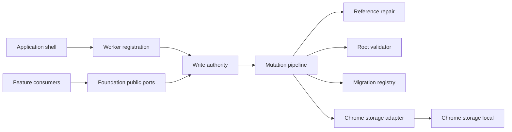
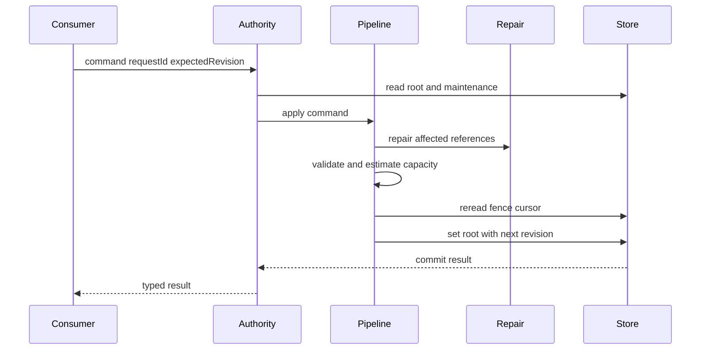
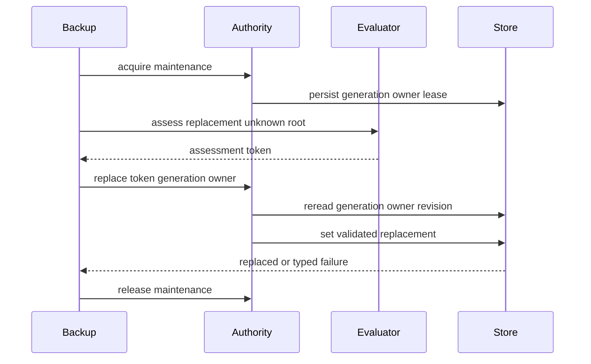
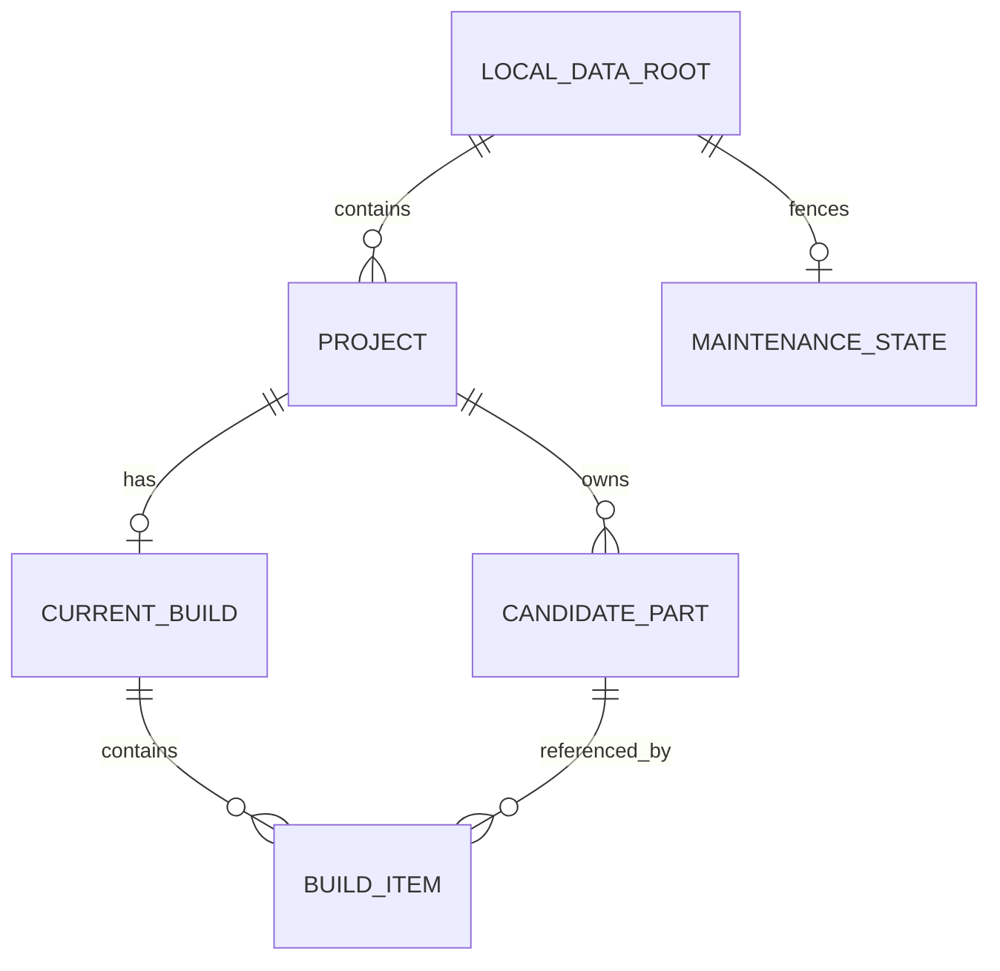

# Design Document

## Overview

本機能は、後続featureが共有するバージョン付きドメイン契約、canonical `Result<T, E>`、実行時検証、`chrome.storage.local`永続化、および全mutationを統制する単一write authorityを提供する。Chrome 116以降で読み込める最小Manifest V3骨格と開発基盤を確立し、保存値、runtime message、JSON由来の`unknown`を信頼境界で検証する。

保存は単一の`LocalDataRoot`を整合性単位とする。候補変更とCurrentBuild参照修復、schema移行、容量判定、保守fencing、root置換を一つのtyped pipelineへ集約し、失敗時は既存の有効rootを保持する。共有service workerとroot compositionは`application-shell`が所有し、本仕様はworker registration portとadapterだけを公開する。

### Goals
- 下流specへ一つの型安全・実行時検証可能なデータ契約を提供する
- すべての永続化mutationを単一authorityへ集約し、参照不整合とlost updateを防ぐ
- worker再生成後も有効なmaintenance fencing、移行、原子的root置換を提供する
- 10MB制約、最小権限、MV3 CSPを自動検証可能にする

### Non-Goals
- side panel、管理画面、typed navigation、root runtime composition
- 商品抽出、候補編集、構成選択、互換性判定の業務規則
- JSONファイルI/O、同期、バックエンド、Chrome以外のadapter

## Boundary Commitments

### This Spec Owns
- `manifest.json`の最小MV3・Chrome 116・storage権限・CSP契約とTypeScript/build/test基盤
- 共通ドメイン型、ID・UTC日時、schema version、canonical `Result<T, E>`、runtime validator
- 単一root Repository、migration、容量評価、Chrome Storage adapter
- 単一write authorityのcommand contract、worker registration factory、revision/request-id競合制御
- foundation不変条件としてのCurrentBuild参照修復、root評価・置換、maintenance generation/owner fencing

### Out of Boundary
- `src/index.ts`、`src/runtime/service-worker.ts`、side panel host、feature registryのcomposition（`application-shell`所有）
- runtime sender/tab/URLの業務別認可、ページDOM・content script payloadの意味解釈
- 候補の選択数、編集権限、互換性、表示文言などfeature固有規則
- backup JSON envelopeとファイル選択・download/upload（`backup-restore`所有）

### Allowed Dependencies
- Chrome 116以降のManifest V3、`chrome.storage.local`、`crypto.randomUUID()`、標準JSON/Web API
- Node.js 26、pnpm 11、Biome 2、および実装開始時に互換性確認して固定するTypeScript/build/test/Chrome typings
- `application-shell`はfoundationの`createDataWorkerRegistration`をcompositionできるが、foundationからshellへimportしない
- featureは公開portだけを利用し、`chrome.storage`、adapter内部、他feature内部へ直接依存しない

### Revalidation Triggers
- `LocalDataRoot`、category、normalized attribute、`Result`、error codeの形状変更
- revision、request ID、参照修復、migration、replacement tokenの意味変更
- maintenance generation/owner/lease、commit前fence、write authority routingの変更
- storage key分割、quota前提、Storage API以外への移行、runtime registration契約の変更

## Architecture

### Existing Architecture Analysis

現状は`package.json`、pnpm lock、Biomeのみで、application sourceと検証commandは存在しない。したがって既存コード互換ではなく、steeringとroadmapのcanonical ownershipを初期構造の基準とする。既存設計にあったfoundation所有のroot service workerと`src/index.ts`は、application shellとの共有所有を避けるため本設計から除外する。

### Architecture Pattern & Boundary Map



- **Selected pattern**: ports and adapters + single write authority。Chrome APIをdomainから隔離し、全mutationを一つのcommit pipelineへ通す。
- **Dependency direction**: `Domain types → Validation/Migration/Repair → Repository ports → Write authority → Chrome adapter → Shell composition`。各層は左側だけをimportする。
- **Root ownership**: foundationは登録factoryを公開し、application shellだけが具体service workerへ登録する。
- **Atomicity boundary**: 一つのstorage keyに一つのrootを保存する。候補変更、参照修復、検証、revision更新、maintenance state更新を一回の`set`へまとめる。

### Technology Stack

| Layer | Choice / Version | Role in Feature | Notes |
|---|---|---|---|
| Language | TypeScript latest stable major | strict domain/runtime contracts | Node 26とChrome 116互換を実装開始時に固定、`any`禁止 |
| Build | lightweight ESM bundler latest stable major | MV3同梱artifact生成 | remote codeとinline scriptなし |
| Test | test runner + DOM不要のin-memory adapter | unit/contract/integration | versionsは導入時に固定 |
| Data | `chrome.storage.local` Chrome 116+ | 単一root永続化、bytes取得 | 10MB、`unlimitedStorage`なし |
| Runtime | Manifest V3 | 最小unpacked extension骨格 | shared worker compositionはshell所有 |

## File Structure Plan

```text
manifest.json                                      # 最小MV3、Chrome 116、storage権限、CSP
package.json                                       # typecheck、build、test、validate scripts
tsconfig.json                                      # strict ESM TypeScript設定
scripts/build.ts                                   # 同梱artifact生成と禁止コード検査
src/domain/result.ts                               # canonical Result<T E>と共通error envelope
src/domain/identifiers.ts                          # branded ID、UUID、UTC timestamp規約
src/domain/model.ts                                # Project、CandidatePart、CurrentBuild、LocalDataRoot
src/domain/normalized-attributes.ts                # category判別共用体と確認値
src/domain/validation.ts                           # unknownから現行domain契約への検証
src/persistence/schema.ts                          # schema version、empty root、storage key
src/persistence/migrations.ts                      # NからN+1の純粋migration registry
src/persistence/reference-repair.ts                # candidate変更時のCurrentBuild参照修復
src/persistence/capacity.ts                        # quota、warning閾値、保存前後bytes状態
src/persistence/repository.ts                      # query、mutation、replacementの公開port
src/persistence/mutation-pipeline.ts               # read migrate mutate repair validate capacity commit
src/persistence/maintenance.ts                     # generation、owner、lease、fencing契約
src/persistence/replacement.ts                     # assess tokenとatomic replacement契約
src/persistence/chrome-storage-adapter.ts           # Storage API、quota、access level adapter
src/persistence/write-authority.ts                  # command dispatch、queue、revision、request dedupe
src/persistence/worker-registration.ts              # shell向けworker handler registration factory
src/persistence/public.ts                           # foundation永続化公開入口
src/domain/public.ts                                # domain契約公開入口
tests/fixtures/foundation.ts                        # 架空の有効・不正root builders
tests/domain/validation.test.ts                     # domain、category、禁止payload、参照検証
tests/persistence/migrations.test.ts                # migration chainとsource preservation
tests/persistence/mutation-pipeline.test.ts         # CRUD、repair、競合、quota、failure preservation
tests/persistence/maintenance.test.ts                # generation、owner、restart、stale fence
tests/persistence/replacement.test.ts                # dry-run評価、token、全体置換、rollback
tests/persistence/write-authority.contract.test.ts   # command、request dedupe、single authority routing
tests/runtime/manifest.test.ts                       # MV3、Chrome 116、権限、CSP、access restriction
```

### Modified Files
- `package.json` — 仮のtest scriptを再現可能なtypecheck/build/test/validate契約へ置換し、互換性確認済みdev dependencyを固定する。
- `.gitignore` — build/test生成物だけを除外し、fixtureを隠さない。

`src/index.ts`と`src/runtime/service-worker.ts`は本仕様では作成・変更しない。worker registrationの実体compositionは`application-shell`のfile boundaryで行う。

## System Flows

### 通常mutationと参照修復



authorityは同一worker instance内をqueueで直列化し、各commit前に永続revisionとmaintenance fenceを再検証する。同じrequest IDの再試行は保存済み結果を返し、異なるpayloadでの再利用は`request-conflict`を返す。

### root置換とmaintenance fencing



assessment tokenは候補rootのdigest、target schema、必要bytes、評価時revisionを束ねる。置換時に再検証し、stale token、owner、generation、revisionのいずれかが不一致なら保存しない。

## Requirements Traceability

| Requirement | Summary | Components | Interfaces | Flows |
|---|---|---|---|---|
| 1.1 | Chrome 116でMV3起動 | ManifestContract、BuildPipeline | manifest | build smoke |
| 1.2 | remote・動的・inline code禁止 | BuildPipeline | validate script | artifact scan |
| 1.3 | worker memory非依存 | WriteAuthority、MaintenanceCoordinator | durable cursor | 両flow |
| 1.4 | 最小権限 | ManifestContract | storage permission | manifest test |
| 2.1 | version付き共有契約 | DomainModel | domain public | root validation |
| 2.2 | 全category | NormalizedAttributeModel | category union | validation |
| 2.3 | 元表記と確認値の分離 | DomainModel | SourcedValue | validation |
| 2.4 | 欠損とcategory属性 | DomainModel、SchemaValidator | optional fields、attribute union | validation |
| 2.5 | IDと日時規約 | IdentifierPolicy | branded ID、UtcTimestamp | validation |
| 2.6 | 参照関係 | DomainModel、ReferenceRepairPolicy | root invariants | mutation flow |
| 3.1 | CRUD結果と永続化 | LocalDataRepository | query/mutate | mutation flow |
| 3.2 | 保存前検証 | MutationPipeline、SchemaValidator | mutateRoot | mutation flow |
| 3.3 | 読取時検証 | LocalDataRepository、MigrationRegistry | readRoot | read flow |
| 3.4 | 破損をtyped failure化 | SchemaValidator | RepositoryError | read flow |
| 3.5 | 保存失敗時に既存値保持 | MutationPipeline、StorageAdapter | commit result | mutation flow |
| 3.6 | 安全な再試行 | WriteAuthority | requestId | mutation flow |
| 3.7 | 同一commitで参照修復 | ReferenceRepairPolicy、MutationPipeline | root mutation | mutation flow |
| 3.8 | 競合検出 | WriteAuthority | expectedRevision | mutation flow |
| 4.1 | root schema version | DomainModel | schemaVersion | read flow |
| 4.2 | 旧版の順序移行 | MigrationRegistry | toCurrent | read flow |
| 4.3 | 将来版を上書きしない | MigrationRegistry | unsupported-version | read flow |
| 4.4 | 移行失敗時source保持 | MigrationRegistry、StorageAdapter | migration-failed | read flow |
| 4.5 | from/to明示 | MigrationStep | migration contract | migration tests |
| 5.1 | 保存前後bytes状態 | CapacityPolicy、ChromeStorageAdapter | CapacityStatus | mutation flow |
| 5.2 | 警告閾値 | CapacityPolicy | capacity-warning metadata | mutation flow |
| 5.3 | quota超過拒否 | CapacityPolicy、StorageAdapter | quota-exceeded | mutation flow |
| 5.4 | HTML・画像拒否 | SchemaValidator | validation issue | validation |
| 5.5 | unlimitedStorage非依存 | ManifestContract | manifest | manifest test |
| 6.1 | trusted context限定 | StorageAdapter | restrictAccess | startup registration |
| 6.2 | 未信頼入力検証 | WorkerRegistration、SchemaValidator | unknown command decoder | mutation flow |
| 6.3 | content scriptへ直接APIなし | WorkerRegistration、import boundary | public ports | contract test |
| 6.4 | 不許可caller拒否 | WorkerRegistration | authorization result | contract test |
| 7.1 | 副作用なし置換評価 | ReplacementEvaluator | assessReplacement | replacement flow |
| 7.2 | root全体置換 | ReplacementCoordinator | replaceRoot | replacement flow |
| 7.3 | 置換失敗時の既存root保持 | ReplacementCoordinator | replacement error | replacement flow |
| 7.4 | maintenance owner外write拒否 | MaintenanceCoordinator | fence | 両flow |
| 7.5 | stale owner・generation拒否 | MaintenanceCoordinator | MaintenanceCursor | replacement flow |
| 7.6 | worker再生成耐性 | MaintenanceCoordinator | persisted state | restart test |
| 7.7 | 終了・中止後の再開 | MaintenanceCoordinator | release/abort | replacement flow |
| 8.1 | 架空dataのみ | FoundationFixtures | fixture builders | all tests |
| 8.2 | 主要失敗・成功の自動検証 | FoundationFixtures | in-memory ports | all tests |
| 8.3 | 実サイトasset不要 | FoundationFixtures | synthetic values | artifact scan |

## Components and Interfaces

| Component | Domain/Layer | Intent | Req Coverage | Key Dependencies | Contracts |
|---|---|---|---|---|---|
| BuildPipeline | Tooling | MV3 artifact生成と禁止コード検査 | 1.1–1.2 | Node.js P0 | Batch |
| IdentifierPolicy | Domain | branded IDとUTC日時を統一 | 2.5 | Web Crypto P1 | Service |
| NormalizedAttributeModel | Domain | category別確認済み属性を表現 | 2.2–2.4 | なし | State |
| DomainModel | Domain | 保存可能な共有modelと不変条件 | 2.1–2.6, 4.1 | なし | State |
| SchemaValidator | Domain | unknownを現行契約へ絞る | 2.1–2.6, 3.2–3.4, 5.4, 6.2 | DomainModel P0 | Service |
| MigrationRegistry | Persistence | 旧schemaを純粋に連続移行 | 4.1–4.5 | SchemaValidator P0 | Service |
| ReferenceRepairPolicy | Persistence | candidate変更によるbuild参照を修復 | 3.7 | DomainModel P0 | Service |
| CapacityPolicy | Persistence | quotaとwarning状態を判定 | 5.1–5.3 | StoragePort P0 | Service |
| MutationPipeline | Persistence | 一つのroot transactionを実行 | 3.1–3.5, 3.7–3.8, 5.1–5.3 | Validator P0、Repair P0、Storage P0 | Service |
| MaintenanceCoordinator | Persistence | generation/owner/leaseをfence | 7.4–7.7 | StoragePort P0 | Service、State |
| ReplacementCoordinator | Persistence | 評価済みrootを一括置換 | 7.1–7.3 | Validator P0、Maintenance P0 | Service |
| WriteAuthority | Application adapter | 全mutationを直列dispatch | 1.3, 3.6, 3.8, 6.2–6.4 | MutationPipeline P0 | Service |
| ChromeStorageAdapter | Chrome adapter | root、bytes、access levelを操作 | 3.5, 5.1–5.5, 6.1 | Chrome API P0 | Service |
| WorkerRegistration | Runtime adapter | shellへtyped handlerを提供 | 6.2–6.4 | WriteAuthority P0 | Service |
| ManifestContract | Runtime config | 最小MV3起動条件を宣言 | 1.1–1.4, 5.5 | Chrome 116 P0 | State |
| FoundationFixtures | Test | 架空dataだけで全契約を検証 | 8.1–8.3 | public ports P0 | Batch |

### Domain Layer

#### DomainModel

`LocalDataRoot`は`schemaVersion`、`revision`、`projects`、`candidateParts`、`currentBuilds`、request dedupe記録、maintenance stateを持つJSON直列化可能なaggregateである。ProjectはcandidateとCurrentBuildの整合性境界であり、build itemは同じprojectのcandidateだけを参照する。

`CandidatePart`は`category`、欠損可能な共通商品値、`sourceInfo`、`sourceSnapshot`、`confirmedValues`、category別`normalizedAttributes`を持つ。元表記と確認済み値を別フィールドに保持し、HTML、画像binary、data URLを型契約へ含めない。

#### SchemaValidator

```typescript
interface SchemaValidator {
  validateRoot(input: unknown): Result<LocalDataRoot, ValidationError>;
  validateCommand(input: unknown): Result<DataCommand, ValidationError>;
  validateReplacement(input: unknown): Result<ReplaceableRoot, ValidationError>;
}
```

- Preconditions: inputは常に`unknown`として渡す。
- Postconditions: success値は参照整合性を満たす現行schemaである。
- Invariants: validatorはinputを変更せず、errorはpathと機械判別可能codeを持つ。

### Persistence Layer

#### MigrationRegistry

```typescript
interface MigrationStep<From extends number, To extends number> {
  readonly from: From;
  readonly to: To;
  migrate(input: unknown): Result<unknown, MigrationError>;
}

interface MigrationRegistry {
  toCurrent(input: unknown): Result<LocalDataRoot, MigrationError>;
}
```

各stepは`N -> N+1`のみ許可し、step出力と最終rootを検証する。未知の将来版、経路欠落、検証失敗ではsourceを保存しない。

#### ReferenceRepairPolicy

```typescript
interface ReferenceRepairPolicy {
  repair(before: LocalDataRoot, proposed: LocalDataRoot, change: RootChange): Result<LocalDataRoot, RepairError>;
}
```

candidate削除では該当build itemを除去し、category変更で現在の構成へ保持できない参照を除去する。選択数や互換性などfeature固有判断は行わない。repair済みrootは同じpipelineで全体検証される。

#### LocalDataRepository and MutationPipeline

```typescript
interface LocalDataRepository {
  readRoot(): Promise<Result<ReadSnapshot, RepositoryError>>;
  query<T>(query: RootQuery<T>): Promise<Result<T, RepositoryError>>;
  mutate(command: RootMutationCommand): Promise<Result<MutationReceipt, RepositoryError>>;
  assessReplacement(input: unknown): Promise<Result<ReplacementAssessment, RepositoryError>>;
  replaceRoot(command: ReplaceRootCommand): Promise<Result<MutationReceipt, RepositoryError>>;
}

interface RootMutationCommand {
  requestId: RequestId;
  expectedRevision: number;
  operation: RootOperation;
  maintenance?: MaintenanceFence;
}
```

pipelineは最新root読取、migration、command適用、reference repair、全体検証、容量評価、commit前cursor再検証、revision増分、一括保存の順で実行する。warningは成功receiptへ付加し、validation、conflict、quota、storage failureは既存rootを変更せず返す。

#### MaintenanceCoordinator

```typescript
interface MaintenanceCoordinator {
  acquire(ownerId: MaintenanceOwnerId, leaseMs: number): Promise<Result<MaintenanceFence, MaintenanceError>>;
  renew(fence: MaintenanceFence, leaseMs: number): Promise<Result<MaintenanceFence, MaintenanceError>>;
  release(fence: MaintenanceFence): Promise<Result<void, MaintenanceError>>;
  abort(fence: MaintenanceFence): Promise<Result<void, MaintenanceError>>;
}

interface MaintenanceFence {
  generation: number;
  ownerId: MaintenanceOwnerId;
  revision: number;
}
```

maintenance中はowner fenceを持たない全writeを`maintenance-active`で拒否する。期限切れownerの暗黙再利用は禁止し、新generationのacquireを要求する。renew、replace、releaseはcommit直前にgeneration、owner、revisionを再検証する。

#### ReplacementCoordinator

```typescript
interface ReplacementEvaluator {
  assessReplacement(input: unknown): Promise<Result<ReplacementAssessment, ReplacementError>>;
}

interface ReplacementAssessment {
  token: ReplacementToken;
  sourceSchemaVersion: number;
  targetSchemaVersion: number;
  requiredBytes: number;
  warnings: readonly CapacityWarning[];
}
```

tokenは評価済み内容digest、schema version、required bytes、評価時revisionを結びつける。`replaceRoot`はtokenと候補を照合し、maintenance fenceとcurrent revisionを再検証して一回のroot writeを行う。

### Runtime and Adapter Layer

#### WriteAuthority and WorkerRegistration

```typescript
interface DataWorkerRegistration {
  register(target: WorkerMessageTarget): RegistrationDisposer;
}

function createDataWorkerRegistration(deps: DataAuthorityDependencies): DataWorkerRegistration;
```

registrationは受信値、request ID、caller classificationを検証し、許可済みcommandだけをauthorityへ渡す。具体sender/tab/URL policyとlistener compositionはapplication shellが提供する。content scriptへRepositoryやStoragePortを返さない。

#### ChromeStorageAdapter

```typescript
interface StoragePort {
  readRoot(): Promise<Result<unknown | undefined, StorageError>>;
  writeRoot(root: LocalDataRoot): Promise<Result<void, StorageError>>;
  bytesInUse(): Promise<Result<number, StorageError>>;
  quotaBytes(): number;
  restrictToTrustedContexts(): Promise<Result<void, StorageError>>;
}
```

adapterは`localDataRoot`だけを所有し、Chrome例外をtyped errorへ変換する。`QUOTA_BYTES`を上限根拠とし、設定済みwarning比率を適用する。access restriction失敗時はauthorityを利用可能として登録しない。

## Data Models



### Domain Model
- Aggregate root: `LocalDataRoot`。全mutation、migration、置換のtransaction boundary。
- Entity: `Project`、`CandidatePart`、`CurrentBuild`。IDはbranded UUID、日時はUTC ISO 8601。
- Value object: `SourceInfo`、`SourcedValue<T>`、category別`NormalizedAttributes`、`MaintenanceFence`。
- Invariants: project内参照、正整数quantity、unique ID、current schema、単調増加revision、maintenance owner一意性。

### Logical and Physical Data Model
- storage key `localDataRoot`へroot objectを一件保存する。
- array内IDの一意性と参照はvalidatorが全体検証する。10MB上限のMVPでは二次indexを永続化せず、query時に一時Mapを構築する。
- request dedupe記録は有界で、最新requestだけを保持する。上限とevictionはschema定数として固定し、同じrequest IDが保持期間外に再送された場合はexpected revisionで競合検出する。
- maintenance stateはrootと同じcommit単位に置き、worker memoryや`storage.session`を正としない。

## Error Handling

`FoundationError`は`validation`、`corrupt-data`、`unsupported-version`、`migration-failed`、`repair-failed`、`revision-conflict`、`request-conflict`、`maintenance-active`、`stale-fence`、`stale-assessment`、`quota-exceeded`、`access-denied`、`storage-unavailable`を判別子に持つ。quota warningは失敗ではなく成功receiptのmetadataとする。

Chrome例外、未信頼payload、完全URL、商品値、保存rootをログへ出さない。予期しないadapter例外は`storage-unavailable`へ正規化し、commit成功を確認できない場合は成功を返さない。

## Testing Strategy

### Unit Tests
- `SchemaValidator`で全12category、欠損値、元表記と確認値、UUID/UTC、cross-project参照、生HTML・画像/data URL拒否を検証する（2.1–2.6, 5.4）。
- `MigrationRegistry`で連続migration、経路欠落、将来版、step失敗、source非変更を検証する（4.1–4.5）。
- `ReferenceRepairPolicy`でcandidate削除・category変更時のbuild item除去と、無関係参照の保持を検証する（3.7）。

### Contract and Integration Tests
- `MutationPipeline`でCRUD、expected revision競合、同一request再試行、異payload request ID拒否、storage失敗時の既存root保持を検証する（3.1–3.8）。
- 10MB未満、warning閾値、超過見込み、実write quota rejectについてbefore/after capacity metadataとroot保持を検証する（5.1–5.5）。
- `MaintenanceCoordinator`でowner外write、stale generation、renew/release/abort、worker instance再作成後の拒否と再開を検証する（7.4–7.7）。
- `ReplacementCoordinator`で副作用なし評価、schema migration、容量不足、stale token、単一成功/失敗置換を検証する（7.1–7.3）。
- `WorkerRegistration`でunknown payload、unauthorized caller、content-script直接accessなし、access restriction失敗時のfail-closedを検証する（6.1–6.4）。

### Runtime and Build Tests
- 生成manifestがMV3、minimum Chrome 116、`storage`のみ、host permission/`unlimitedStorage`なしで読み込めることを検証する（1.1, 1.4, 5.5）。
- bundleをscanし、remote import、`eval`、`new Function`、inline JavaScriptがないことを検証する（1.2）。
- 全fixtureが架空値だけで、実サイトHTML、画像、取得商品dataをartifactへ含めないことを検証する（8.1–8.3）。

## Security Considerations

- 初期化時に`storage.local`を`TRUSTED_CONTEXTS`へ制限し、成功前にwrite authorityを公開しない。
- runtime inputは`unknown`からdecodeし、shell提供のcaller authorizationとfoundation command validationの両方を通す。
- public portはstorage primitiveを公開せず、featureからの`chrome.storage`直接importをboundary testで拒否する。
- CSPを弱めず、remote hosted code、動的評価、inline JavaScriptを生成物検査で拒否する。

## Performance & Scalability

- capacity上限はruntime `chrome.storage.local.QUOTA_BYTES`を使用し、warning比率は既定80%として設定可能にする。
- synthetic rootを用いて10MB近傍のread、migration、validation、repair、serialization、write時間を個別計測する。MVP受入では操作をタイムアウトさせず、計測値をtest reportへ残す。
- root分割、永続index、別storage採用は現時点で行わない。全体書換が実測上問題になった場合は参照整合性・置換・migrationを含む全dependent specのrevalidationを行う。

## Migration Strategy

初期rootは`schemaVersion: 1`、`revision: 0`で生成する。migrationは純粋な`N -> N+1`stepとして順序適用し、各stepと最終rootを検証する。通常readは移行済みsnapshotを返すが、永続化は明示mutation pipeline内だけで行う。失敗、未知の将来版、容量不足ではsource rootを上書きしない。

application shell導入時は、foundationの`createDataWorkerRegistration`をshell-owned `src/runtime/service-worker.ts`へcompositionする。foundationが一時的な共有runtime入口を作成して移管するmigrationは行わない。
