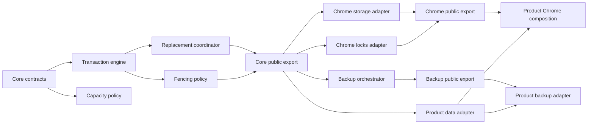
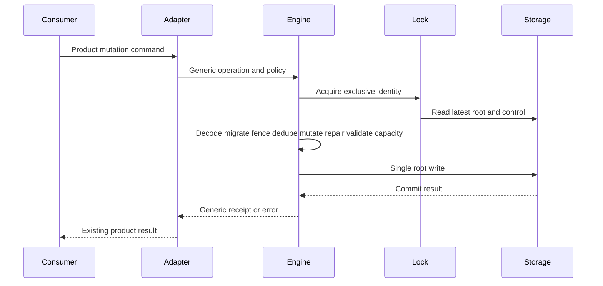
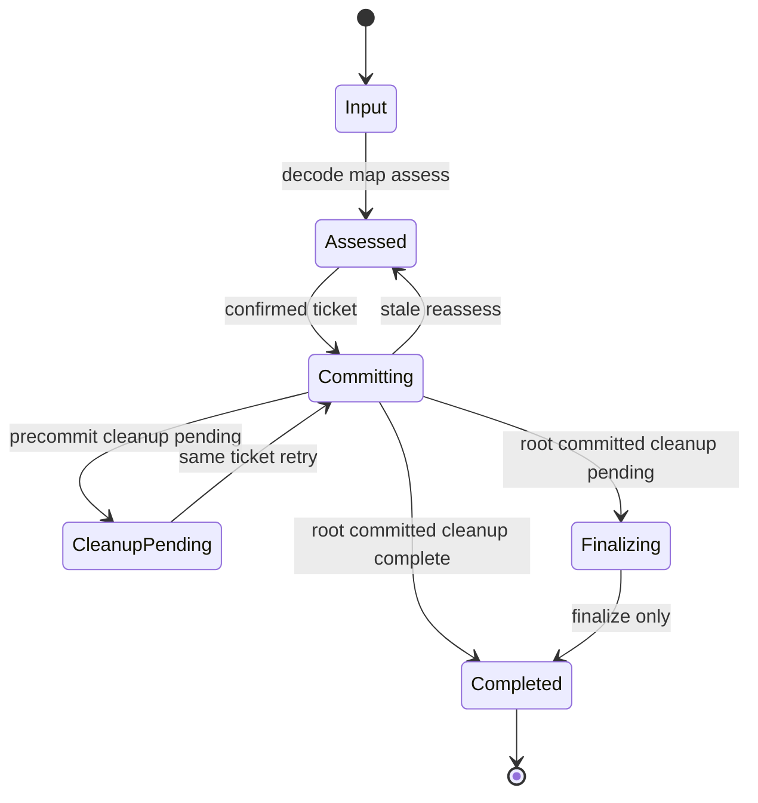
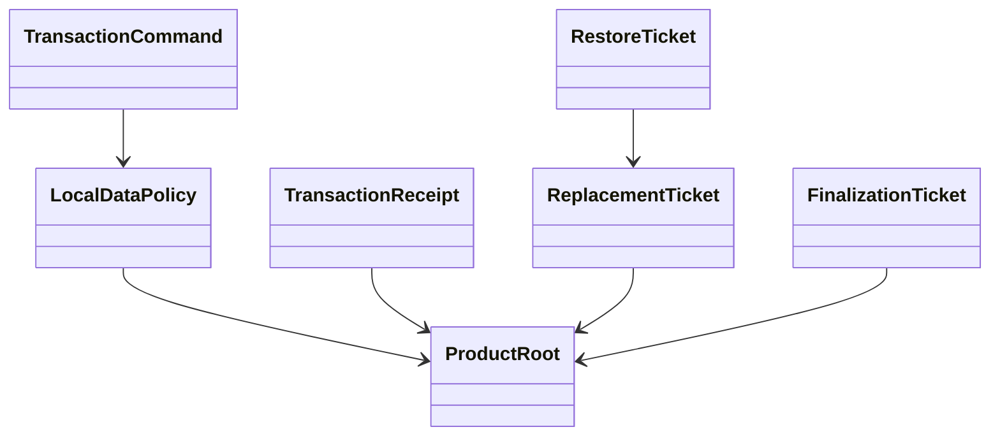
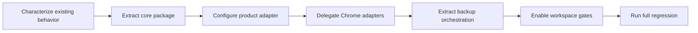

# Design Document

## Overview

local data library boundariesは、PC Build Plannerで実証済みのrevision付きtransaction、request dedupe、capacity、atomic root replacement、maintenance/recovery fencing、backup retry protocolを、製品非依存のprivate workspace libraryへ抽出する。対象利用者は、PC Build Plannerと将来のローカルファーストconsumerを実装する開発者である。

単一package `@pc-build-planner/local-data`に、platform-independentなroot export、Chrome adapter専用`./chrome`、backup orchestration専用`./backup`の3つの宣言済みentryを置く。package数を増やさず、source boundary gateで`core → 標準API`、`chrome → core + Chrome API`、`backup → core`の依存方向を強制する。PC Build Planner側は既存`LocalDataRoot`、schema、migration、repair、`FoundationError`、worker認可、交換形式、UIを保持し、adapterからpackage公開APIを設定する。

### Goals

- 製品rootとplatform APIに依存しないlocal data transaction・replacement・fencing契約を確立する。
- Chrome storage、quota、access restriction、change event、Web Locksをcore portへ閉じ込める。
- 製品交換形式に依存しないbackup artifact・preflight・commit・finalize orchestrationを提供する。
- package単独検証、public consumer contract、deep import gate、topological build、変更種別別validationを再現可能にする。
- PC Build Plannerの保存schema、交換形式、公開feature挙動、データ保全契約を変更しない。

### Non-Goals

- `LocalDataRoot`、schema version、具体migration、reference repair、`FoundationError` taxonomyを再設計しない。
- backup envelope、16MiB file policy、filename、File API、UI、project-context lifecycleをpackageで所有しない。
- worker caller分類・認可、runtime listener、application shell compositionを移動しない。
- Chrome以外のproduction adapter、2番目consumer、npm publish、stable APIを実装しない。
- pending Existing Spec Updatesまたは`runtime-license-notices` Direct Candidateを本specへ取り込まない。

## Boundary Commitments

### This Spec Owns

- private workspace package `@pc-build-planner/local-data`と宣言済み`.`、`./chrome`、`./backup` export。
- generic `Result`、storage・lock port、root policy、revision・dedupe・transaction、capacity、replacement、maintenance/recovery fenceの契約と純粋mechanism。
- core portを実装するChrome storage、quota、access restriction、change event、Web Locks adapter。
- product codec/artifact policyとreplacement capabilityを合成するgeneric backup orchestrator。
- PC Build Planner固有policyをpackageへ設定し既存公開portへ写像するdelegation adapter。
- package単独build/typecheck/test、subpath consumer fixture、deep import・逆依存gate、topological build、変更種別別validation。

### Out of Boundary

- `src/domain/model.ts`の`LocalDataRoot` shape、`CURRENT_SCHEMA_VERSION`、storage key、具体schema/migration/repairの意味。
- `FoundationError`の製品分類、worker commandとcaller authorization、runtime listener、application-shell composition。
- `CurrentBackupEnvelope`、exchange migration/mapping、16MiB input policy、file read/download、backup UI、message catalog、project-context guard/refresh。
- 既存featureの公開挙動やerror粒度の変更、保存data migration、backup交換形式migration。
- `ui-message-catalog`等の他Existing Spec Updates、runtime license notice、npm metadata、外部consumer support。

### Allowed Dependencies

- package root coreはECMAScript標準APIだけをruntime利用し、Chrome、React、DOM、PC domain、root `src/`、Zodへ依存しない。
- `./chrome`はpackage coreとChrome 116 APIの構造型だけへ依存し、product schema、runtime message、application shellへ依存しない。
- `./backup`はpackage coreだけへ依存し、Chrome、DOM、File、React、product exchange schema、project-contextへ依存しない。
- app local data adapterはpackage rootと製品所有のdomain/schema/migration/repair/errorへ依存できる。
- app Chrome composition adapterはpackage `./chrome`と製品所有のstorage key・production initialization policyへ依存できる。
- app backup adapterはpackage `./backup`、既存exchange codec、`BackupRestoreDataPort`、snapshot read capabilityへ依存できる。
- workspaceはpnpm 11.13.1、Node.js 26.5.0、TypeScript 7.0.2、Node test runner、tsx、Biome、esbuildの既存stackを使い、新しいruntime dependencyを追加しない。

### Revalidation Triggers

- `LocalDataPolicy`、`StoragePort`、`ExclusiveLockPort`、transaction receipt/error、assessment/finalization ticketの公開shape変更。
- Chrome storage key scope、access level、quota source、change event、exclusive lock identityの変更。
- backup preflight順序、commit point、pre-commit cleanup、post-commit finalization semanticsの変更。
- product adapterが保持するschema、migration、repair、`FoundationError` mapping、exchange format、project-context lifecycleの変更。
- package export map、subpath構成、module format、Node/TypeScript minimum、topological build順の変更。
- 2番目consumer追加、Chrome以外のproduction adapter追加、npm公開検討の開始。

## Architecture

### Existing Architecture Analysis

現行`src/persistence`はports and adapters、single write authority、typed Resultを採用しているが、generic mechanismとPC固有policyが同じmodule graphにある。`RootTransactionRunner`は安全性を一か所へ集約し、`ChromeStorageAdapter`と`WebLocksAdapter`は既にplatform I/Oを分離する。一方、公開interfaceが`LocalDataRoot`、`FoundationError`、`RecoveryControl`へ直接結合し、backupの`RestoreService`はexchange/UI ownerの内部にある。

抽出では既存のtransaction順序を作り直さない。まずcharacterization contractで現在のcommit pointとfailure semanticsを固定し、generic type parameterとpolicy hookへ置き換える。app公開入口は維持し、package型をapp固有型へ写像するadapterを挟む。

### Architecture Pattern & Boundary Map



**Architecture Integration**:

- **Selected pattern**: Hexagonal core + declared package subpaths + configured product adapters。
- **Dependency direction**: `contracts → policies → transaction → replacement/fencing → root export → chrome/backup subpaths → product adapters → runtime/feature composition`。逆方向importは禁止する。
- **Existing patterns preserved**: canonical Result、single write authority、用途限定backup port、owner-local schema、NodeNext ESM、public entry gate。
- **New components rationale**: package public entriesとworkspace validationは独立consumer contractに必要であり、product adaptersは保存形式を変えずに依存を反転するために必要である。
- **Steering compliance**: MV3/CSP、10MB、TRUSTED_CONTEXTS、single root atomicity、persistent fencing、synthetic fixture、no `any`を維持する。

### Technology Stack

| Layer | Choice / Version | Role in Feature | Notes |
|---|---|---|---|
| Package runtime | ESM / ES2024 | generic core、Chrome adapter、backup orchestration | runtime dependencyなし |
| Type system | TypeScript 7.0.2 / NodeNext | generic policy、opaque ticket、discriminated error | strict、`any`禁止 |
| Workspace | pnpm 11.13.1 | private package、`workspace:*`、topological build | typed-messages-core patternを踏襲 |
| Platform | Chrome 116 Storage API / Web Locks | local storage、quota、access、change、exclusive lock | `./chrome`だけが参照 |
| Tests | Node 26.5.0 `node:test` + tsx 4.23.1 | package unit/contract、app characterization | Chrome実体とDOM不要 |
| App bundle | esbuild 0.28.1 | build済みpackage exportをMV3 artifactへ統合 | CSPを維持 |

## File Structure Plan

### Directory Structure

```text
packages/
└── local-data/
    ├── package.json                    # private metadata、3 export、単独scripts
    ├── tsconfig.json                   # NodeNext ESM buildとdeclaration
    ├── src/
    │   ├── contracts.ts                # Result、error、storage、lock、policy、ticket型
    │   ├── capacity.ts                 # generic capacity評価
    │   ├── transaction.ts              # revision・dedupe・latest-read・single commit
    │   ├── fencing.ts                  # maintenance/recovery state transition
    │   ├── replacement.ts              # side-effect-free assessmentとatomic commit
    │   ├── index.ts                    # package root core export
    │   ├── chrome/
    │   │   ├── storage-adapter.ts      # Chrome Storageをgeneric portへ適合
    │   │   ├── web-locks-adapter.ts    # named exclusive Web Lock
    │   │   └── index.ts                # `./chrome` export
    │   └── backup/
    │       ├── contracts.ts            # codec、artifact、preview、restore ticket型
    │       ├── orchestrator.ts         # create/preflight/commit/finalize順序
    │       └── index.ts                # `./backup` export
    └── tests/
        ├── transaction.test.ts         # revision、dedupe、conflict、root保持
        ├── replacement.test.ts         # assessment、stale、fencing、recovery
        ├── chrome-adapters.test.ts      # quota、access、change、lock contract
        └── backup-orchestrator.test.ts # preflight、commit point、retry lifecycle
tests/
├── tooling/
│   ├── local-data-core-consumer.ts     # root export public type fixture
│   ├── local-data-chrome-consumer.ts   # declared chrome subpath fixture
│   ├── local-data-backup-consumer.ts   # declared backup subpath fixture
│   └── public-boundaries.test.ts       # deep importと逆依存negative gate
└── persistence/
    └── local-data-library-characterization.test.ts # 既存app公開挙動の同等性
```

### Modified Files

- `pnpm-workspace.yaml` — `packages/*`登録をtyped-messages-coreと共有する。
- `package.json` — `@pc-build-planner/local-data`の`workspace:*`依存、package/subpath/app validation scripts、package-first buildを追加する。
- `pnpm-lock.yaml` — workspace linkを記録する。
- `tsconfig.public-consumer.json` — 3つの公開consumer fixtureを追加する。
- `scripts/build.mjs` — local data package build済みをapp bundleの前提に加える。
- `scripts/validate-boundaries.mjs` — 未宣言subpath、package逆依存、app deep importを拒否する。
- `src/domain/result.ts` — generic `Result`をpackage rootからre-exportし、`FoundationError`は製品側に残す。
- `src/persistence/local-data-library-adapter.ts` — `LocalDataRoot`、validator、migration、repair、revision、dedupe、fenceをpackage policyへ設定する新規product adapter。
- `src/persistence/chrome-storage-adapter.ts`、`src/persistence/web-locks-adapter.ts` — Chrome subpathへ委譲し、製品storage keyと既存public shapeだけを保持する。
- `src/persistence/root-transaction-runner.ts`、`src/persistence/replacement.ts`、`src/persistence/recovery.ts`、`src/persistence/write-authority.ts` — product固有command/error facadeを保持し、generic mechanismへ委譲する。保存schema・error taxonomyは変更しない。
- `src/features/backup-restore/service.ts` — product exchange codecと既存Foundation portをbackup orchestratorへ設定するadapterへ縮小する。exchange、file、UI、context lifecycleは変更しない。
- `tests/persistence/**`、`tests/features/backup-restore/**` — generic期待値をpackageへ移し、product policyと公開挙動のcharacterizationへ絞る。

`local-data-foundation`と`backup-restore`のpending Change Briefが所有するschema、error、交換形式、UI、context lifecycleの変更は上記adapter作業へ含めない。該当ownerの契約変更が必要になった場合は本specを停止し、Existing Spec Updateを先に承認する。

## System Flows

### Mutation transaction



latest readからsingle writeまでだけをexclusive callback内に置く。network、利用者確認、backup file処理はlock外で完了させ、commit直前にticketとfenceを再検証する。

### Restore lifecycle



`CleanupPending`ではroot未変更、`Finalizing`ではroot変更済みである。このcommit pointを判別共用体で保持し、前者だけがcommit retry、後者だけがfinalize-only retryへ進む。

## Requirements Traceability

| Requirement | Summary | Components | Interfaces | Flows |
|---|---|---|---|---|
| 1.1, 1.2, 1.3, 1.4, 1.5, 1.6 | generic root・validation・error境界 | CoreContracts, ProductLocalDataAdapter | `LocalDataPolicy`, `CoreResult`, `CoreError` | Mutation transaction |
| 2.1, 2.2, 2.3, 2.4, 2.5, 2.6, 2.7 | 原子的transactionと再生成耐性 | TransactionEngine, FencingPolicy | `TransactionPort`, `ExclusiveLockPort` | Mutation transaction |
| 3.1, 3.2, 3.3, 3.4, 3.5, 3.6 | capacityとplatform error | CapacityPolicy, ChromeStorageAdapter | `CapacityPort`, `StoragePort` | Mutation transaction |
| 4.1, 4.2, 4.3, 4.4, 4.5, 4.6, 4.7 | assessment・replacement・fencing | ReplacementCoordinator, FencingPolicy | `RootReplacementPort`, opaque tickets | Mutation transaction, Restore lifecycle |
| 5.1, 5.2, 5.3, 5.4, 5.5, 5.6, 5.7, 5.8 | generic backup protocol | BackupOrchestrator, ProductBackupAdapter | `BackupCodec`, `BackupOrchestrator` | Restore lifecycle |
| 6.1, 6.2, 6.3, 6.4, 6.5, 6.6, 6.7 | Chromeと製品composition分離 | ChromeStorageAdapter, ChromeLocksAdapter, ProductLocalDataAdapter, ProductBackupAdapter | package subpath exports | Mutation transaction |
| 7.1, 7.2, 7.3, 7.4, 7.5, 7.6, 7.7, 7.8, 7.9, 7.10, 7.11 | private公開面とvalidation | PackagePublicEntries, WorkspaceValidation | export map, consumer fixtures, validation batch | Topological validation |

## Components and Interfaces

| Component | Domain/Layer | Intent | Req Coverage | Key Dependencies | Contracts |
|---|---|---|---|---|---|
| CoreContracts | Package core | root・policy・port・resultの製品非依存契約 | 1.1–1.6, 3.5–3.6 | 標準API | State, Service |
| CapacityPolicy | Package core | storage非依存の容量評価 | 3.1–3.6 | CoreContracts P0 | Service |
| TransactionEngine | Package core | latest-readからsingle commitまでを統制 | 2.1–2.7, 3.1–3.5 | CoreContracts P0, CapacityPolicy P0 | Service |
| FencingPolicy | Package core | persistent maintenance/recovery transition | 2.7, 4.3–4.7 | CoreContracts P0 | Service, State |
| ReplacementCoordinator | Package core | side-effect-free assessmentとatomic replacement | 4.1–4.7 | TransactionEngine P0, FencingPolicy P0 | Service |
| ChromeStorageAdapter | Package chrome | Storage APIをgeneric storage/capacity/change portへ適合 | 3.1–3.5, 6.1, 6.3 | CoreContracts P0, Chrome API P0 | Service, Event |
| ChromeLocksAdapter | Package chrome | named exclusive Web Lockを提供 | 2.1, 2.7, 6.2–6.4 | CoreContracts P0, Web Locks P0 | Service |
| BackupOrchestrator | Package backup | artifact・preflight・commit・finalizeを調整 | 5.1–5.8 | CoreContracts P0, ReplacementCoordinator port P0 | Service |
| ProductLocalDataAdapter | App persistence | PC policyを設定し既存port/errorを維持 | 1.1–1.6, 6.5, 6.7 | Package root P0, product policy P0 | Service |
| ProductBackupAdapter | Backup feature | exchange codecを設定し既存serviceを維持 | 5.1–5.8, 6.6–6.7 | Package backup P0, exchange P0 | Service |
| PackagePublicEntries | Package boundary | 3つのdeclared exportだけを公開 | 7.1–7.4, 7.8 | package components P0 | API |
| WorkspaceValidation | Tooling | 単独・consumer・boundary・topological gate | 7.2–7.11 | pnpm P0, TypeScript P0 | Batch |

### Package Core

#### CoreContracts

```typescript
export type CoreResult<T, E> =
  | { readonly ok: true; readonly value: T }
  | { readonly ok: false; readonly error: E };

export interface StoragePort<Root, Control> {
  readRoot(): Promise<CoreResult<unknown | undefined, StorageError>>;
  writeRoot(root: Root): Promise<CoreResult<void, StorageError>>;
  readControl(): Promise<CoreResult<unknown | undefined, StorageError>>;
  writeControl(control: Control): Promise<CoreResult<void, StorageError>>;
  bytesInUse(): Promise<CoreResult<number, StorageError>>;
  quotaBytes(): number;
  restrictToTrustedContexts(): Promise<CoreResult<void, StorageError>>;
}

export interface ExclusiveLockPort {
  runExclusive<T>(operation: () => Promise<T>): Promise<CoreResult<T, LockError>>;
}

export interface LocalDataPolicy<Root, Operation, Control, PolicyError> {
  decodeAndMigrate(input: unknown): CoreResult<Root, PolicyError>;
  apply(root: Root, operation: Operation): CoreResult<Root, PolicyError>;
  repair(root: Root, previous: Root): CoreResult<Root, PolicyError>;
  revision(root: Root): number;
  withRevision(root: Root, revision: number): Root;
  requestRecord(root: Root, requestId: string): RequestRecord | undefined;
  withRequestRecord(root: Root, record: RequestRecord): Root;
  control(root: Root): Control;
  withControl(root: Root, control: Control): Root;
}
```

- `CoreResult`はapp canonical `Result`からre-export可能な同一構造で、packageは`FoundationError`を知らない。
- `PolicyError`はconsumer owner-local schema/errorであり、packageは文字列化やloggingを行わない。
- operation payloadのJSON安全性とroot固有invariantはproduct policyが検証する。

#### TransactionEngine

```typescript
export interface TransactionCommand<Operation> {
  readonly requestId: string;
  readonly expectedRevision: number;
  readonly operation: Operation;
}

export interface TransactionReceipt<Value> {
  readonly revision: number;
  readonly value: Value;
  readonly capacity: CapacityStatus;
  readonly deduplicated: boolean;
}

export interface TransactionPort<Operation, Value, Error> {
  execute(command: TransactionCommand<Operation>): Promise<CoreResult<TransactionReceipt<Value>, Error>>;
}
```

- Preconditions: adapterがoperationを検証済みproduct commandへ変換する。
- Postconditions: successはsingle root write済みまたはdedupe済み、failureはroot未変更またはcommit不明としてsuccessを返さない。
- Invariants: exclusive callback内でlatest rootを読む。expected revision、request digest、active fenceを変更前とcommit直前に確認する。

#### CapacityPolicy

```typescript
export interface CapacityStatus {
  readonly beforeBytes: number;
  readonly afterBytes: number;
  readonly quotaBytes: number;
  readonly warning: boolean;
}

export interface CapacityPolicy<Root> {
  assess(currentBytes: number, candidate: Root, quotaBytes: number): CoreResult<CapacityStatus, CapacityError>;
}
```

candidateのbyte計測はstorage adapterと同じserialization contractをconsumerが設定する。quotaはplatform portから得て、core定数へ固定しない。

#### FencingPolicy and ReplacementCoordinator

```typescript
export interface ReplacementAssessmentTicket {
  readonly __opaqueReplacementTicket: unique symbol;
}

export interface FinalizationTicket {
  readonly __opaqueFinalizationTicket: unique symbol;
}

export interface RootReplacementPort<Root, Assessment, Receipt, Error> {
  assess(candidate: unknown): Promise<CoreResult<Assessment, Error>>;
  assessRecovery(candidate: unknown): Promise<CoreResult<Assessment, Error>>;
  commit(input: Readonly<{
    candidate: Root;
    mode: "normal" | "recovery";
    ticket: ReplacementAssessmentTicket;
  }>): Promise<CoreResult<
    | { readonly kind: "committed"; readonly receipt: Receipt }
    | { readonly kind: "committed-finalization-required"; readonly receipt: Receipt; readonly finalization: FinalizationTicket },
    Error
  >>;
  findPendingFinalization(): Promise<CoreResult<FinalizationTicket | null, Error>>;
  finalize(ticket: FinalizationTicket): Promise<CoreResult<Receipt, Error>>;
}
```

- assessmentはcandidate digest、revision、raw fingerprint、owner/generationをopaque ticket内部に保持し、公開previewへ出さない。
- pre-commit cleanup未完了はerror、root write後cleanup未完了はcommitted outcomeにする。
- finalizationはcleanupと通常read確認だけを行い、root write capabilityを持たない。

### Platform Adapter

#### ChromeStorageAdapter and ChromeLocksAdapter

- `createChromeStorageAdapter(api, keyScope)`はroot/control keyだけをread/writeし、`getBytesInUse`、`QUOTA_BYTES`、`setAccessLevel`、`onChanged`をgeneric portへ変換する。
- `createChromeExclusiveLockAdapter(locks, lockName)`は同名exclusive requestのcallbackだけを実行する。lock nameはproduct compositionが既存固定値を渡す。
- Chrome例外は`quota-exceeded | access-denied | storage-unavailable | lock-unavailable`へ正規化し、例外objectや保存値を返さない。
- storage change eventは対象key、old/new unknownだけを通知し、decodeはproduct policy側で行う。

### Backup Orchestration

#### BackupOrchestrator

```typescript
export interface BackupCodec<Root, RestoreInput, Candidate, Artifact, Preview, CodecError> {
  createArtifact(root: Root): CoreResult<Artifact, CodecError>;
  decode(input: RestoreInput): CoreResult<Candidate, CodecError>;
  preview(candidate: Candidate): Preview;
  toRoot(candidate: Candidate): CoreResult<Root, CodecError>;
}

export interface BackupOrchestrator<RestoreInput, Artifact, Preview, RestoreTicket, Summary, Error> {
  create(): Promise<CoreResult<Artifact, Error>>;
  preflight(input: RestoreInput): Promise<CoreResult<Readonly<{ preview: Preview; ticket: RestoreTicket }>, Error>>;
  reassess(ticket: RestoreTicket): Promise<CoreResult<Readonly<{ preview: Preview; ticket: RestoreTicket }>, Error>>;
  commit(ticket: RestoreTicket): Promise<CoreResult<
    | { readonly kind: "committed"; readonly summary: Summary }
    | { readonly kind: "committed-finalization-required"; readonly summary: Summary; readonly finalization: FinalizationTicket },
    Error
  >>;
  findPendingFinalization(): Promise<CoreResult<FinalizationTicket | null, Error>>;
  finalize(ticket: FinalizationTicket): Promise<CoreResult<Summary, Error>>;
}
```

- product adapterがsnapshot read、codec、restore input size policy、clock、artifact naming、error mappingを設定する。
- orchestratorは利用者確認UIを持たない。commit呼び出し時点をconfirmedとみなす。
- `RestoreTicket`はcandidateとassessmentを内部保持するopaque valueで、UIへraw rootやcontrolを公開しない。

### Product Integration

#### ProductLocalDataAdapter

`LocalDataRoot`のdecode/migration、revision、requestDedupe、maintenance、reference repair、capacity serializationを`LocalDataPolicy`へ設定する。generic errorを既存`FoundationError`へ一対一に写像し、`FoundationScopedDataPort`、`FoundationDataPort`、`BackupRestoreDataPort`、production contributionの公開shapeを維持する。worker authorization、sender classification、storage key、10MB policyは製品側に残す。

#### ProductBackupAdapter

既存`ExchangeValidator`、`ExchangeMigration`、`ExchangeMapper`、`RestoreFileCapacityPolicy`を`BackupCodec`へ設定する。`BackupService`と`RestoreService`の公開結果、preview、error、ticket、state transitionは維持する。FileGateway、React state/view、project-context guard/refreshには触れず、generic orchestrationの前後を既存feature ownerが引き続き制御する。

### Package Boundary and Tooling

#### PackagePublicEntries

| Import | Exposes | Must not expose |
|---|---|---|
| `@pc-build-planner/local-data` | core contracts、capacity、transaction、fencing、replacement factories | Chrome型、backup codec、product型、internal source |
| `@pc-build-planner/local-data/chrome` | Chrome storage・lock adapter factoryと構造型 | product key、runtime message、core internals |
| `@pc-build-planner/local-data/backup` | backup codec/orchestrator contractとfactory | product envelope、File/DOM/React、project-context |

package.jsonの`exports`は上記3 entryだけをbuild済みJavaScript/declarationへ対応付ける。`src/*`、`dist/*`、未宣言subpathはmodule resolutionで失敗させる。

#### WorkspaceValidation

- `validate:local-data-core`: package build/typecheck/core tests + root consumer + boundary gate。
- `validate:local-data-chrome`: Chrome adapter tests + chrome subpath consumer + boundary gate。
- `validate:local-data-backup`: backup tests + backup subpath consumer + product adapter characterization。
- `validate:local-data-product`: product policy/error/schema/repair characterization + existing persistence/backup contract tests。
- root `build` / `validate:ci`: typed-messages-core、local-data packageを先行buildし、app typecheck・test・artifact gateへ接続する。
- full `pnpm validate`: 既存E2Eを含め、保存・backupの利用者挙動が変わらないことを確認する。

## Data Models

### Domain Model



- `ProductRoot`はpackageが所有しないgeneric型で、保存schemaはconsumer ownerに残る。
- `ReplacementTicket`、`RestoreTicket`、`FinalizationTicket`はruntime-only opaque capabilityでありJSON交換形式へ含めない。
- persistent maintenance/recovery controlの具体配置はpolicy/adapterが決め、PC Build Plannerでは既存root fieldと`foundationRecoveryControl` keyを維持する。

### Data Contracts & Integration

- package公開値はJSON安全なroot/command/receiptまたはopaque runtime ticketで構成し、Chrome object、schema instance、exceptionを含めない。
- coreはrootのfield名とschema versionを解釈せず、policyのdecode/migrate/repair/revision/control projectionだけを呼ぶ。
- backup codecはproduct exchange versionを所有し、package release versionと交換形式versionを結び付けない。

## Error Handling

### Error Strategy

- core errorは`validation | migration | repair | revision-conflict | request-conflict | maintenance-active | recovery-active | stale-fence | stale-assessment | stale-recovery-state | precommit-cleanup-pending | quota-exceeded | access-denied | lock-unavailable | storage-unavailable`の安定分類を持つ。
- product adapterは分類を既存`FoundationError`または`RestoreError`へ決定的に写像し、error種類・粒度を増減させない。
- root write前のfailureだけをerrorにする。write後cleanup failureはcommitted outcomeとして返し、finalize-only recoveryへ進める。
- packageは保存値、candidate、完全URL、例外objectをloggingしない。toolingはcomponent名、stable code、exit statusだけを観測する。

## Testing Strategy

### Unit Tests

- CoreContracts/TransactionEngine: 1.1–2.7についてsynthetic root policyでdecode/migrate、revision、dedupe、conflict、repair、single write、failure時root保持を検証する。
- CapacityPolicy: 3.1–3.6についてbelow/warning/exceeded、platform quota rejection、unbounded assumption不在を検証する。
- FencingPolicy/ReplacementCoordinator: 4.1–4.7についてside-effect-free assessment、stale candidate/revision/owner/generation、worker再生成、normal/recovery、release/abortを検証する。
- BackupOrchestrator: 5.1–5.8についてartifact、decode/map順序、opaque preview ticket、precommit cleanup、committed finalization、finalize root write 0件、product metadata不在を検証する。

### Integration and Contract Tests

- public consumer fixtureが3つの宣言済みentryだけからstrict typecheckされ、未宣言subpathとpackage reverse importを拒否する（6.4、7.1–7.4）。
- Chrome adapter contractが10MB platform quota、TRUSTED_CONTEXTS、bytes、change event、Promise rejection、同名exclusive lockをstubで検証する（3.1–3.5、6.1–6.3）。
- ProductLocalDataAdapter characterizationが既存`FoundationDataPort`のCRUD、repair、error、recovery、maintenance、runtime contributionを移行前後で同一に保つ（6.5、6.7）。
- ProductBackupAdapter characterizationがexchange version、16MiB policy、preview、commit/finalize、UI-facing errorを同一に保つ（5.1–5.8、6.6–6.7）。
- clean package outputからtopological buildを実行し、app bundleがbuild済み3 entryだけを解決する（7.8、7.11）。

### E2E/UI Tests

新しいUIは追加しない。既存backup export、normal restore、corrupt/future root recovery、preflight rejection、post-commit refresh retryのE2Eを下流非回帰として実行する。package単独testではChrome実体、DOM、File APIを起動しない。

### Security Considerations

- coreとbackupはunknownをconsumer decoderへ渡し、検証前のroot/candidateを正常値として公開しない。
- Chrome adapterは`TRUSTED_CONTEXTS`成功前にproduction handleを公開しない。
- packageからChrome以外のplatform、DOM、React、remote code、dynamic evaluationへ到達しないことをsource/artifact gateで拒否する。
- synthetic fixtureだけを使用し、保存内容、商品値、URL、raw HTML、画像をpackage testへ含めない。
- product `BackupRestoreDataPort`のcapability制限を維持し、通常CRUD、raw root、Storage、lock、fenceをbackup consumerへ公開しない。

### Performance & Scalability

- 10MB近傍synthetic rootでdecode/migrate/repair/serialize/writeの各区間を計測し、package抽出前の既存test baselineから退行を検出する。
- exclusive lock内にnetwork、file decode、利用者待機を置かず、latest readからsingle writeまでに限定する。
- package分割、streaming、root分割、永続indexは行わない。実測された問題または2番目consumer追加時に再評価する。

### Migration Strategy



1. 現行app contractとfailure semanticsをcharacterization testで固定する。
2. package coreとsynthetic contract kitを追加し、app未接続で単独greenにする。
3. PC policy adapterを追加し、generic transaction/replacementを既存公開portの背後へ接続する。保存schema migrationは行わない。
4. Chrome storage/Web Locks実装を`./chrome`へ委譲し、production initializationとaccess fail-closedを確認する。
5. generic backup orchestratorを`./backup`へ追加し、existing exchange/service adapterを同じ公開挙動で接続する。
6. consumer/boundary/topological/change-type gateを有効化し、重複generic implementationを除去する。
7. `pnpm validate`でapp非回帰を確認する。rollbackは各waveのadapter delegationを旧内部implementationへ戻せるcommit境界を保つ。

Existing Spec Updateに属するschema・error・exchange・UI・context lifecycle変更はこのmigrationへ含めない。adapter接続に意味変更が必要と判明した場合は該当Change Brief承認まで停止する。
