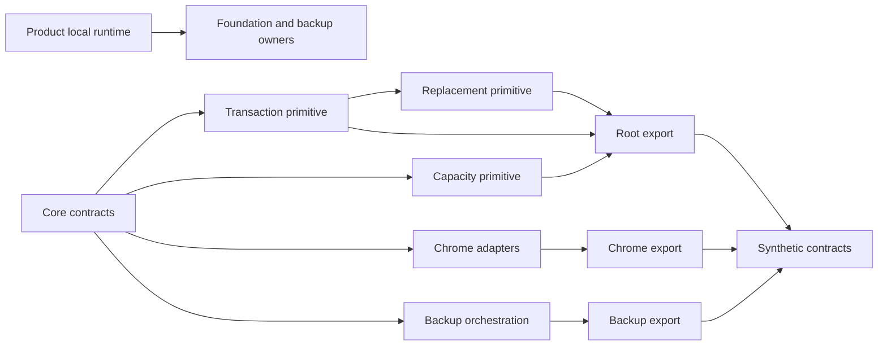
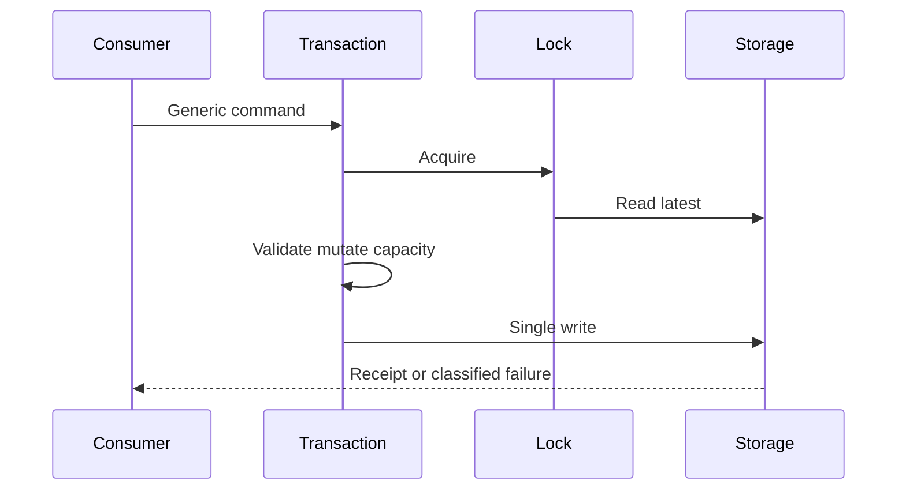

# Design Document

## Overview

`local-data-library-boundaries`は、既に抽出済みの`@pc-build-planner/local-data`をMVPの完成境界として安定させる。package root、`./chrome`、`./backup`の3公開entryから、製品非依存のtransaction・capacity・replacement primitive、Chrome adapter、backup orchestrationを提供し、synthetic fixtureとpackage単独validationで検証する。

PC Build Plannerの実product runtimeは現行product-local compositionを継続する。consumer固有maintenance fence、recovery cleanup、finalization resumptionをpackageの汎用protocolへ昇格させず、下流product contractをpackage completion gateとして呼び出さない。これらは2番目の実consumer evidenceが得られた時点で再設計する。

### Change Integration

- **Integrated Change Brief**: `mvp-local-data-simplification`
- **In-scope trace**: CoreContracts、TransactionEngine、CapacityPolicy、ReplacementPrimitive、ChromeStorageAdapter、ChromeLocksAdapter、BackupOrchestrator、PackagePublicEntries、SyntheticPublicContract、WorkspaceValidationが抽出済みprimitiveとpackage検証を維持する。
- **Out-of-scope preservation**: 実`ProductLocalDataAdapter` composition、consumer固有maintenance/recovery command、generic cleanup/finalization resumption、下流product contractの上流gate化、新規package APIを追加しない。現行product-local runtimeとbackup専用capabilityは各下流ownerに残す。

### Goals

- 3つの公開entryと依存方向を維持する。
- 抽出済みtransaction・capacity・replacement、Chrome、backup primitiveをsynthetic contractで独立検証する。
- deep import、packageからproduct/React/DOMへの逆依存を機械的に拒否する。
- package単独validationとtopological buildを再現可能にする。

### Non-Goals

- product runtimeをpackage factoryへ全面移行しない。
- consumer固有maintenance fence、recovery cleanup、finalization resumptionを汎用化しない。
- 下流所有の実product contractをpackage validationの必須gateにしない。
- `FoundationError`、PC root/schema/migration/repair、backup交換形式、UI、production compositionを所有しない。
- 新しいpackage API、2番目consumer、npm公開、stable APIを追加しない。

## Boundary Commitments

### This Spec Owns

- private package `@pc-build-planner/local-data`と`.`、`./chrome`、`./backup` export。
- generic Result、storage/lock port、transaction、revision/dedupe、capacity、既存replacement primitive。
- Chrome storage/quota/change/Web Locks adapter。
- generic backup artifact、preflight、commit orchestration。
- synthetic public consumer、package単独build/typecheck/test、deep import・逆依存gate、topological build。

### Out of Boundary

- `src/`のproduct-local runtime、`LocalDataRoot`、schema、migration、repair、`FoundationError`。
- `ProductLocalDataAdapter`のproduction compositionとproduct executable contract。
- consumer固有maintenance/recovery controlのpackage command化とcleanup/finalization resumptionの汎用protocol。
- product backup capability、交換形式、file I/O、UI、project-context、application-shell composition、E2E。

### Allowed Dependencies

- package rootはECMAScript標準APIだけをruntime利用し、Chrome、React、DOM、PC domain、root `src/`、Zodへ依存しない。
- `./chrome`はpackage coreとChrome 116 APIの構造型だけへ依存する。
- `./backup`はpackage coreだけへ依存し、Chrome、DOM、File、React、product exchange schemaへ依存しない。
- synthetic fixtureは架空root/error/control/codecだけを使う。
- workspaceは既存Node 26、pnpm 11、TypeScript 7、Node test runner、Biome、esbuildを使い、新規runtime dependencyを追加しない。

### Revalidation Triggers

- 3公開entry、export map、transaction/replacement receipt・error、Chrome adapter、backup orchestrationの公開shape変更。
- package内部の依存方向、module format、Node/TypeScript minimum、topological build順の変更。
- package primitiveのcommit point、single-write、revision/dedupe、capacity、opaque assessment semanticsの変更。
- 2番目の実consumer、Chrome以外のproduction adapter、npm公開の検討開始。この時点でproduct固有fence/recoveryの共通化可能性を再発見する。

product-local runtime、backup capability、application compositionだけの変更は各ownerが検証し、本packageのcompletion gateへ逆流させない。

## Architecture

### Existing Architecture Analysis

package抽出、3公開entry、transaction/capacity/replacement、Chrome adapter、backup orchestration、synthetic consumer、boundary gateは実装済みである。追加のproduct runtime migrationを進めると、唯一のconsumerの保存controlと回復手順を公開APIへ固定する必要があるため、MVPでは抽出済みprimitiveを安定境界とする。

### Architecture Pattern & Boundary Map



- **Selected pattern**: 単一private package + 宣言済みsubpath + synthetic contract。
- **Dependency direction**: `core contracts → primitives → public entries → synthetic consumers`。product runtimeはpackage completion graphに含めない。
- **Existing patterns preserved**: canonical Result、single write、revision/dedupe、atomic replacement、3 entry、synthetic fixture、no `any`。

### Technology Stack

| Layer | Choice / Version | Role |
|---|---|---|
| Runtime | ESM / ES2024 | package primitive |
| Types | TypeScript 7 / NodeNext | strict public contracts |
| Workspace | pnpm 11 | private package、topological build |
| Platform | Chrome 116 Storage / Web Locks | `./chrome` adapter |
| Tests | Node 26 `node:test` + tsx | synthetic unit/contract tests |

## File Structure Plan

### Directory Structure

```text
packages/local-data/
├── package.json                 # private metadataと3 export
├── tsconfig.json                # NodeNext build/declaration
├── src/
│   ├── contracts.ts             # generic Result、storage/lock/policy/ticket
│   ├── capacity.ts              # capacity primitive
│   ├── transaction.ts           # revision/dedupe/single-write primitive
│   ├── fencing.ts               # 抽出済みgeneric fence primitive
│   ├── replacement.ts           # atomic replacement primitive
│   ├── index.ts                 # root export
│   ├── chrome/                  # storage/Web Locks adapterとsubpath export
│   └── backup/                  # codec/orchestratorとsubpath export
└── tests/                       # 架空fixtureだけのunit/contract tests
tests/tooling/
├── local-data-core-consumer.ts
├── local-data-chrome-consumer.ts
├── local-data-backup-consumer.ts
├── local-data-app-readonly-consumer.ts
└── public-boundaries.test.ts
```

### Modified Files

- `package.json` — package-only validation、public consumer、topological buildのrouteを維持し、下流product contractを必須routeにしない。
- `scripts/validate-boundaries.mjs` — deep import、逆依存、product ownership流入を拒否する。
- `tests/tooling/local-data-app-readonly-consumer.ts` — synthetic型だけで公開contractを検査する。

product runtime、Foundation/backup adapter、UI、E2Eのファイルは本specのFile Structure Planに含めない。

## System Flows



backup orchestrationはdecode・map・preflightをcommit前に完了し、opaque ticketで既存replacement primitiveを呼ぶ。product固有recovery resumptionはこのflowへ追加しない。

## Requirements Traceability

| Requirement | Summary | Components |
|---|---|---|
| 1.1, 1.2, 1.3, 1.4, 1.5, 1.6, 1.7, 1.8 | 製品非依存契約と既存error adapter | CoreContracts, TransactionEngine |
| 2.1, 2.2, 2.3, 2.4, 2.5, 2.6, 2.7 | 原子的transaction | TransactionEngine, ReplacementPrimitive |
| 3.1, 3.2, 3.3, 3.4, 3.5, 3.6 | capacityとplatform error | CapacityPolicy, ChromeStorageAdapter |
| 4.1, 4.2, 4.3, 4.4, 4.5, 4.6, 4.7 | 評価済みroot置換 | ReplacementPrimitive |
| 5.1, 5.2, 5.3, 5.4, 5.5, 5.6, 5.7, 5.8 | generic backup orchestration | BackupOrchestrator |
| 6.1, 6.2, 6.3, 6.4, 6.5, 6.6, 6.7, 6.8 | Chrome adapterとsynthetic product separation | ChromeStorageAdapter, ChromeLocksAdapter, SyntheticPublicContract |
| 7.1, 7.2, 7.3, 7.4, 7.5, 7.6, 7.7, 7.8, 7.9, 7.10, 7.11, 7.12 | private公開面とMVP validation boundary | PackagePublicEntries, WorkspaceValidation |

## Components and Interfaces

| Component | Domain | Intent | Requirements | Dependencies |
|---|---|---|---|---|
| CoreContracts | Package core | 製品非依存の型付きport | 1.1–1.8, 6.4 | 標準API |
| TransactionEngine | Package core | latest-read、revision、dedupe、single write | 2.1–2.7 | CoreContracts, CapacityPolicy |
| CapacityPolicy | Package core | quota非固定の容量評価 | 3.1–3.6 | CoreContracts |
| ReplacementPrimitive | Package core | side-effect-free assessmentとatomic replacement | 4.1–4.7 | CoreContracts, TransactionEngine |
| ChromeStorageAdapter | Platform | Storage/quota/change正規化 | 3.1–3.5, 6.1, 6.3 | CoreContracts, Chrome API |
| ChromeLocksAdapter | Platform | named exclusive lock | 6.2, 6.3 | CoreContracts, Web Locks |
| BackupOrchestrator | Package backup | artifact/preflight/commit protocol | 5.1–5.8 | CoreContracts, ReplacementPrimitive |
| PackagePublicEntries | Tooling | 3 entryとdeclaration | 7.1–7.4, 7.8 | package build |
| SyntheticPublicContract | Tooling | 製品非依存consumer contract | 6.5–6.8, 7.5–7.9 | public entries |
| WorkspaceValidation | Tooling | package-only gateとfailure propagation | 7.2–7.12 | public consumers, boundary gate |

公開factoryの具体signatureは現行declarationを正とし、本revisionでは追加・拡張しない。product runtimeが必要とする追加protocolを先回りして定義しない。

## Data Models

- consumer root、operation、error、codecはgeneric型でありpackageはfieldを解釈しない。
- assessment/restore ticketはruntime-only opaque valueで、交換形式へ含めない。
- product-local maintenance/recovery controlはpackageのcanonical data modelにしない。

## Error Handling

- platform例外を安定したstorage/capacity/access/lock分類へ正規化する。
- policy errorは既存public adapter contractに従い、保存値や例外objectをlogへ出さない。
- pre-commit failureでは既存rootを保持し、成功を報告しない。
- product固有recovery/finalization error taxonomyをpackageへ追加しない。

## Testing Strategy

### Unit Tests

- synthetic rootでrevision、dedupe、競合、capacity、single write、失敗時root保持を検証する。
- Chrome stubでquota、access、change、exclusive lock、platform error normalizationを検証する。
- synthetic codec/replacement portでartifact、preflight、opaque ticket、commitを検証する。

### Integration and Contract Tests

- 3つの宣言済みentryだけからclean declaration/runtimeを解決する。
- 未宣言subpath、`src`/`dist` deep import、coreからChrome/productへの逆依存を拒否する。
- package単独build/typecheck/test、synthetic consumer、boundary gate、topological buildのfailureをroot commandへ伝播する。
- 実product composition、consumer固有recovery resumption、下流product contract commandをpackage completion gateとして実行しない。

### Security and Performance

- fixtureは架空データだけを使い、Chrome/DOM/React/remote codeをcoreへ持ち込まない。
- exclusive lock内をlatest readからsingle writeまでに限定し、package分割や新規抽象化は実測または2番目consumerまで延期する。

## Migration Strategy

追加migrationはない。既に抽出済みのpackage primitiveと3公開entryを完成形とし、PC Build Plannerは現行product-local runtimeとbackup専用capabilityを継続利用する。2番目の実consumerが現れた場合だけ、共通するmaintenance/recovery/finalization semanticsを実例から再設計する。
