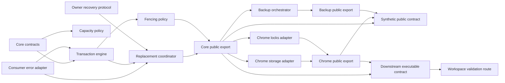
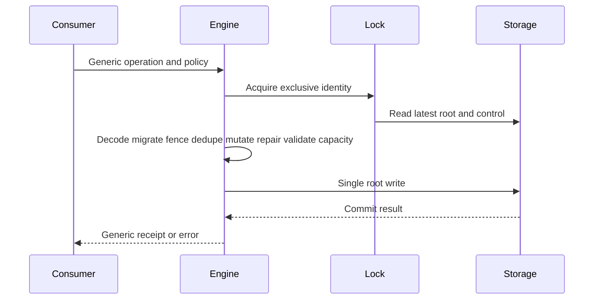
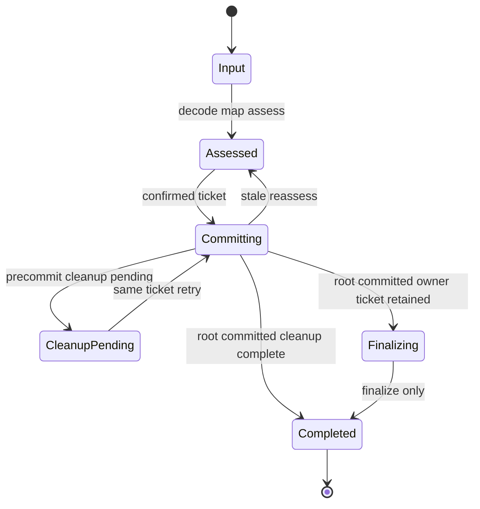
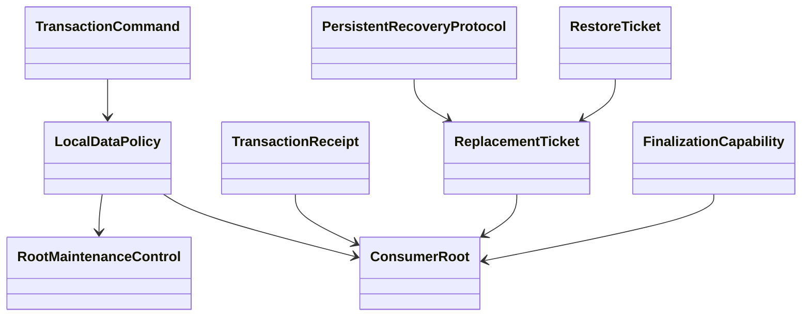
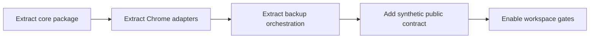

# Design Document

## Overview

local data library boundariesは、PC Build Plannerで実証済みのrevision付きtransaction、request dedupe、capacity、atomic root replacement、maintenance/recovery fencing、backup retry protocolを、製品非依存のprivate workspace libraryへ抽出する。対象利用者は、PC Build Plannerと将来のローカルファーストconsumerを実装する開発者である。

単一package `@pc-build-planner/local-data`に、platform-independentなroot export、Chrome adapter専用`./chrome`、backup orchestration専用`./backup`の3つの宣言済みentryを置く。package数を増やさず、source boundary gateで`core → 標準API`、`chrome → core + Chrome API`、`backup → core`の依存方向を強制する。PC Build Planner側の既存`LocalDataRoot`、schema、migration、repair、`FoundationError`、worker認可、交換形式、製品adapter、composition、UI、E2Eは下流canonical ownerに残す。packageはsynthetic contractだけを所有し、実製品接続は下流ownerのexecutable contractをroot validationから呼んで検証する。

### Change Integration

- **Integrated Change Brief**: `product-runtime-contract-repair`
- **In-scope trace**: consumer-owned policy error adapterとtransaction/replacement両factory genericsはCoreContracts/ConsumerErrorAdapter/TransactionEngine/ReplacementCoordinator、root maintenanceとpersistent recoveryの分離およびowner protocolはPersistentRecoveryProtocol/ReplacementCoordinator、synthetic contract・declaration更新はPackagePublicEntries、下流所有executable product contractを呼ぶroutingはWorkspaceValidationで設計する。
- **Out-of-scope preservation**: `FoundationError`、PC recovery control、`ProductLocalDataAdapter`、製品schema/migration/repair、製品backup codec/mapping/policy、`ProductBackupAdapter`、下流task 11.2以降のruntime composition、保存形式・利用者向け挙動をcomponentまたはpackage testへ取り込まない。3 entry、製品非依存、single write、固定Web Lock、revision/dedupe、atomic replacement、opaque ticket、pre/post cleanup、既存root保持、backup semanticsを維持する。

### Goals

- 製品rootとplatform APIに依存しないlocal data transaction・replacement・fencing契約を確立する。
- consumer-owned policy errorのpayload/contextを明示adapterで出力errorへ意味不変に接続する。
- root内maintenance controlとroot外persistent recovery controlを分離し、replacement lifecycleをowner-provided protocolへ委譲する。
- Chrome storage、quota、access restriction、change event、Web Locksをcore portへ閉じ込める。
- 製品交換形式に依存しないbackup artifact・preflight・commit・finalize orchestrationを提供する。
- package単独検証、public consumer contract、deep import gate、下流所有executable contract routing、topological build、変更種別別validationを再現可能にする。
- 下流製品ownerが既存の保存schema、交換形式、公開feature挙動、データ保全契約を維持できるpublic portを、owner側executable contractで確認する。

### Non-Goals

- `LocalDataRoot`、schema version、具体migration、reference repair、`FoundationError` taxonomyを再設計しない。
- backup envelope、16MiB file policy、filename、File API、UI、project-context lifecycleをpackageで所有しない。
- worker caller分類・認可、runtime listener、application shell compositionを移動しない。
- `ProductLocalDataAdapter`、`ProductBackupAdapter`、製品codec/mapping/policy、製品composition、製品E2Eを実装・変更しない。
- persistent recovery controlのfield、lease表現、owner表現、pending marker、current anomaly判定をpackageで定義・解釈しない。
- Chrome以外のproduction adapter、2番目consumer、npm publish、stable APIを実装しない。
- pending Existing Spec Updatesまたは`runtime-license-notices` Direct Candidateを本specへ取り込まない。

## Boundary Commitments

### This Spec Owns

- private workspace package `@pc-build-planner/local-data`と宣言済み`.`、`./chrome`、`./backup` export。
- generic `Result`、storage・lock port、root policy、consumer error adapter、revision・dedupe・transaction、capacity、replacement、root maintenance fenceの契約と純粋mechanism。
- root外persistent recoveryを型付きで委譲するowner protocol interfaceと、そのopaque protocol capabilityを呼ぶreplacement lifecycle。
- core portを実装するChrome storage、quota、access restriction、change event、Web Locks adapter。
- product codec/artifact policyとreplacement capabilityを合成するgeneric backup orchestrator。
- package単独build/typecheck/test、synthetic subpath consumer fixture、public declaration contract、deep import・逆依存gate、下流所有executable product contractを呼ぶroot validation route、topological build、変更種別別validation。

### Out of Boundary

- `src/domain/model.ts`の`LocalDataRoot` shape、`CURRENT_SCHEMA_VERSION`、storage key、具体schema/migration/repairの意味。
- `FoundationError`の製品分類、worker commandとcaller authorization、runtime listener、application-shell composition。
- `CurrentBackupEnvelope`、exchange migration/mapping、16MiB input policy、file read/download、backup UI、message catalog、project-context guard/refresh。
- `ProductLocalDataAdapter`と`ProductBackupAdapter`の実装、製品codec/policyの設定、production wiring、app integration test、E2E。
- `FoundationError`のvariant/payload、PC recovery controlの保存shape・state transition、実`ProductLocalDataAdapter` executable contractの実装と実行本体。
- 既存featureの公開挙動やerror粒度の変更、保存data migration、backup交換形式migration。
- `ui-message-catalog`等の他Existing Spec Updates、runtime license notice、npm metadata、外部consumer support。

### Allowed Dependencies

- package root coreはECMAScript標準APIだけをruntime利用し、Chrome、React、DOM、PC domain、root `src/`、Zodへ依存しない。
- `./chrome`はpackage coreとChrome 116 APIの構造型だけへ依存し、product schema、runtime message、application shellへ依存しない。
- `./backup`はpackage coreだけへ依存し、Chrome、DOM、File、React、product exchange schema、project-contextへ依存しない。
- package synthetic fixtureは架空のroot/error/control型だけを用いる。製品所有のexecutable contractは`local-data-foundation`に置き、本specのvalidation routeは公開commandとして呼ぶだけでsource/testへ取り込まない。
- 下流`local-data-foundation`はpackage root/`./chrome`から製品adapterを構成し、下流`backup-restore`は`./backup`から製品backup adapterを構成する。本specからこれらの内部へ依存しない。
- workspaceはpnpm 11.13.1、Node.js 26.5.0、TypeScript 7.0.2、Node test runner、tsx、Biome、esbuildの既存stackを使い、新しいruntime dependencyを追加しない。

### Revalidation Triggers

- `LocalDataPolicy`、`StoragePort`、`ExclusiveLockPort`、transaction receipt/error、assessment/finalization ticketの公開shape変更。
- Chrome storage key scope、access level、quota source、change event、exclusive lock identityの変更。
- backup preflight順序、commit point、pre-commit cleanup、post-commit finalization semanticsの変更。
- downstream product adapterが利用するpublic port、generic error分類、consumer error adapter、root maintenance generic、persistent recovery generic、owner protocol lifecycleの変更は、`local-data-foundation` task 11.2が所有するexecutable product contract command `validate:local-data-product-contract`を再実行する。
- transaction/replacement/recovery/finalizationの公開shapeまたはcommit point変更は、`backup-restore` tasks 7.1–7.4を各owner境界で再検証する。実装は本specへ吸収しない。
- product adapter/capabilityまたはbackup lifecycleの公開shape変更は、`application-shell` tasks 12.1–12.3のproduction composition・startup/recovery・横断E2Eを各owner境界で再検証する。実装は本specへ吸収しない。
- Foundation executable product contract `validate:local-data-product-contract`のcommand名、実行前提、failure propagationの変更。
- package export map、subpath構成、module format、Node/TypeScript minimum、topological build順の変更。
- 2番目consumer追加、Chrome以外のproduction adapter追加、npm公開検討の開始。

## Architecture

### Existing Architecture Analysis

現行packageはports and adapters、single write authority、typed Resultを実装済みだが、`TransactionEngineDependencies`と`ReplacementCoordinatorDependencies`がpolicy errorを`CoreError`へ固定している。また同じ`Control` genericをroot内maintenance projectionとroot外persistent recovery storageへ使い、replacementがcontrolのfield、数値世代、owner、独自pending markerを直接解釈する。このためPC canonical error/controlを意味不変に接続できない。本specはfactory seamを修復し、製品側の接続実装は下流更新へ委譲する。

修復では既存のtransaction・replacement順序を作り直さない。synthetic package contractでcommit pointとfailure semanticsを固定し、policy error adapterと分離したcontrol generic、owner protocolを定義する。実製品接続は下流ownerのexecutable contractが検証し、上流validationはそのcommandを呼ぶだけとする。

### Architecture Pattern & Boundary Map



**Architecture Integration**:

- **Selected pattern**: Hexagonal core + declared package subpaths + synthetic public contract + downstream executable contract route。
- **Dependency direction**: `contracts → error adapters / root policies / owner recovery protocol → transaction / replacement → root export → chrome/backup subpaths → synthetic fixtures`。root validation routeは下流ownerの公開commandだけを呼び、下流sourceをimportしない。逆方向importは禁止する。
- **Existing patterns preserved**: canonical Result、single write authority、用途限定backup port、owner-local schema、NodeNext ESM、public entry gate。
- **New components rationale**: package public entries、platform adapter、generic orchestrator、workspace validationは独立consumer contractに必要である。製品adapterは下流ownerが実装する。
- **Steering compliance**: MV3/CSP、10MB、TRUSTED_CONTEXTS、single root atomicity、persistent fencing、synthetic fixture、no `any`を維持する。

### Technology Stack

| Layer | Choice / Version | Role in Feature | Notes |
|---|---|---|---|
| Package runtime | ESM / ES2024 | generic core、Chrome adapter、backup orchestration | runtime dependencyなし |
| Type system | TypeScript 7.0.2 / NodeNext | generic policy、opaque ticket、discriminated error | strict、`any`禁止 |
| Workspace | pnpm 11.13.1 | private package、`workspace:*`、topological build | typed-messages-core patternを踏襲 |
| Platform | Chrome 116 Storage API / Web Locks | local storage、quota、access、change、exclusive lock | `./chrome`だけが参照 |
| Tests | Node 26.5.0 `node:test` + tsx 4.23.1 | package unit/contract、app characterization | Chrome実体とDOM不要 |
| App bundle | esbuild 0.28.1 | build済みpackage exportをMV3 artifactへ統合 | CSPを維持 |

## File Structure Plan

### Directory Structure

```text
packages/
└── local-data/
    ├── package.json                    # private metadata、3 export、単独scripts
    ├── tsconfig.json                   # NodeNext ESM buildとdeclaration
    ├── src/
    │   ├── contracts.ts                # Result、error、storage、lock、policy、ticket型
    │   ├── capacity.ts                 # generic capacity評価
    │   ├── transaction.ts              # error adapter付きrevision・dedupe・latest-read・single commit
    │   ├── fencing.ts                  # root内maintenance state transition
    │   ├── replacement.ts              # owner recovery protocol上のassessmentとatomic commit
    │   ├── index.ts                    # package root core export
    │   ├── chrome/
    │   │   ├── storage-adapter.ts      # Chrome Storageをgeneric portへ適合
    │   │   ├── web-locks-adapter.ts    # named exclusive Web Lock
    │   │   └── index.ts                # `./chrome` export
    │   └── backup/
    │       ├── contracts.ts            # codec、artifact、preview、restore ticket型
    │       ├── orchestrator.ts         # create/preflight/commit/finalize順序
    │       └── index.ts                # `./backup` export
    └── tests/
        ├── transaction.test.ts         # policy error payload、revision、dedupe、root保持
        ├── replacement.test.ts         # 分離control、protocol委譲、stale、finalization
        ├── chrome-adapters.test.ts      # quota、access、change、lock contract
        └── backup-orchestrator.test.ts # preflight、commit point、retry lifecycle
tests/
├── tooling/
│   ├── local-data-core-consumer.ts     # root export public type fixture
│   ├── local-data-chrome-consumer.ts   # declared chrome subpath fixture
│   ├── local-data-backup-consumer.ts   # declared backup subpath fixture
│   ├── local-data-app-readonly-consumer.ts # 架空の独立error/control型を使うpublic contract
│   └── public-boundaries.test.ts       # deep importと逆依存negative gate
```

### Modified Files

- `pnpm-workspace.yaml` — `packages/*`登録をtyped-messages-coreと共有する。
- `package.json` — package/subpath contractと、下流ownerが提供するexecutable product contract commandを呼ぶvalidation routeを保持する。
- `pnpm-lock.yaml` — workspace linkを記録する。
- `tsconfig.public-consumer.json` — 3つの公開consumer fixtureを追加する。
- `scripts/build.mjs` — local data package build済みをapp bundleの前提に加える。
- `scripts/validate-boundaries.mjs` — 未宣言subpath、package逆依存、app deep import、package側の製品adapter/control所有を拒否する。
- `scripts/validate-local-data-workspace.mjs` — generic contract変更時にpackage gate後、下流ownerのexecutable product contract commandを呼び、failureをそのまま伝播する。
- `tests/tooling/local-data-app-readonly-consumer.ts` — consumer-owned error/control型を互いに混同せずpublic factoryへ設定できるsynthetic contractとし、製品adapter実装・compositionを持たない。
- `.kiro/specs/local-data-foundation/`が指定するexecutable contract artifact — 下流ownerが実`ProductLocalDataAdapter`を構成・実行する。本specのpackage source/testとfile ownershipには含めない。

`local-data-foundation`と`backup-restore`が所有するadapter、schema、error、control field、交換形式、UI、context lifecycle、composition、E2Eは上記package作業へ含めない。package公開portから製品実装への接続は下流ownerが行い、本specはroot validation routingだけを所有する。

## System Flows

### Mutation transaction



latest readからsingle writeまでだけをexclusive callback内に置く。network、利用者確認、backup file処理はlock外で完了させ、commit直前にticketとfenceを再検証する。

### Restore lifecycle



`CleanupPending`ではroot未変更、`Finalizing`ではroot変更済みである。owner protocolは`prepareCommit`時にpendingとfinalization capabilityを同じpersistent controlへ束縛し、packageはroot write成功後のreleaseまたはcontrol保存が失敗した場合だけそのticketを公開する。このcommit pointを判別共用体で保持し、前者だけがcommit retry、後者だけがfinalize-only retryへ進む。worker再生成後はactual current rootとpersistent controlの分類からownerが同じ意味のticketを再構成し、packageはJavaScript参照同一性でticketを判定しない。

## Requirements Traceability

| Requirement | Summary | Components | Interfaces | Flows |
|---|---|---|---|---|
| 1.1, 1.2, 1.3, 1.4, 1.5, 1.6, 1.7, 1.8 | generic root・validation・consumer error境界 | CoreContracts, ConsumerErrorAdapter, TransactionEngine, ReplacementCoordinator | `LocalDataPolicy`, `ErrorAdapter`, `CoreResult` | Mutation transaction, Restore lifecycle |
| 2.1, 2.2, 2.3, 2.4, 2.5, 2.6, 2.7 | 原子的transactionと再生成耐性 | TransactionEngine, FencingPolicy, PersistentRecoveryProtocol | `TransactionPort`, `ExclusiveLockPort`, `RecoveryProtocol` | Mutation transaction |
| 3.1, 3.2, 3.3, 3.4, 3.5, 3.6 | capacityとplatform error | CapacityPolicy, ChromeStorageAdapter | `CapacityPort`, `StoragePort` | Mutation transaction |
| 4.1, 4.2, 4.3, 4.4, 4.5, 4.6, 4.7, 4.8, 4.9, 4.10, 4.11 | assessment・replacement・root maintenance・owner recovery protocol | ConsumerErrorAdapter, ReplacementCoordinator, FencingPolicy, PersistentRecoveryProtocol | `ErrorAdapter`, `RootReplacementPort`, `RecoveryProtocol`, opaque tickets | Mutation transaction, Restore lifecycle |
| 5.1, 5.2, 5.3, 5.4, 5.5, 5.6, 5.7, 5.8 | generic backup protocol | BackupOrchestrator | `BackupCodec`, `BackupOrchestrator` | Restore lifecycle |
| 6.1, 6.2, 6.3, 6.4, 6.5, 6.6, 6.7, 6.8 | Chrome adapterと製品境界分離 | ChromeStorageAdapter, ChromeLocksAdapter, SyntheticPublicContract | package subpath exports | Mutation transaction |
| 7.1, 7.2, 7.3, 7.4, 7.5, 7.6, 7.7, 7.8, 7.9, 7.10, 7.11, 7.12, 7.13 | private公開面とvalidation | PackagePublicEntries, WorkspaceValidation, DownstreamExecutableContractRoute | export map, consumer fixtures, validation batch | Topological validation |

## Components and Interfaces

| Component | Domain/Layer | Intent | Req Coverage | Key Dependencies | Contracts |
|---|---|---|---|---|---|
| CoreContracts | Package core | root・policy・port・resultの製品非依存契約 | 1.1–1.8, 3.5–3.6 | 標準API | State, Service |
| ConsumerErrorAdapter | Package core | policy errorをpayload/context保持でoutput errorへ写像 | 1.5, 1.7–1.8, 2.6 | CoreContracts P0 | Service |
| CapacityPolicy | Package core | storage非依存の容量評価 | 3.1–3.6 | CoreContracts P0 | Service |
| TransactionEngine | Package core | latest-readからsingle commitまでを統制 | 2.1–2.7, 3.1–3.5 | CoreContracts P0, CapacityPolicy P0 | Service |
| FencingPolicy | Package core | root内maintenance transitionだけを保持 | 2.7, 4.3–4.8 | CoreContracts P0 | Service, State |
| PersistentRecoveryProtocol | Consumer-owned port | root外controlのfence/pending/release/finalization/anomaly transition | 4.3–4.11 | CoreContracts P0 | Service, State |
| ReplacementCoordinator | Package core | error adapterとowner protocol上のside-effect-free assessment・atomic replacement | 1.5, 1.7–1.8, 2.6, 4.1–4.11 | ConsumerErrorAdapter P0, TransactionEngine P0, FencingPolicy P0, PersistentRecoveryProtocol P0 | Service |
| ChromeStorageAdapter | Package chrome | Storage APIをgeneric storage/capacity/change portへ適合 | 3.1–3.5, 6.1, 6.3 | CoreContracts P0, Chrome API P0 | Service, Event |
| ChromeLocksAdapter | Package chrome | named exclusive Web Lockを提供 | 2.1, 2.7, 6.2–6.4 | CoreContracts P0, Web Locks P0 | Service |
| BackupOrchestrator | Package backup | artifact・preflight・commit・finalizeを調整 | 5.1–5.8 | CoreContracts P0, ReplacementCoordinator port P0 | Service |
| SyntheticPublicContract | Tooling | 独立error/control genericとdeclarationの接続可能性を検証 | 6.5–6.8, 7.1–7.9 | 3 package entries P0 | Batch |
| DownstreamExecutableContractRoute | Tooling integration | 下流ownerの実product contract commandを呼びfailureを伝播 | 7.9–7.13 | WorkspaceValidation P0, local-data-foundation command P0 | Batch |
| PackagePublicEntries | Package boundary | 3つのdeclared exportだけを公開 | 7.1–7.4, 7.8 | package components P0 | API |
| WorkspaceValidation | Tooling | 単独・consumer・boundary・topological gate | 7.2–7.11 | pnpm P0, TypeScript P0 | Batch |

### Package Core

#### CoreContracts

```typescript
export type CoreResult<T, E> =
  | { readonly ok: true; readonly value: T }
  | { readonly ok: false; readonly error: E };

export interface StoragePort<Root, PersistentRecoveryControl> {
  readRoot(): Promise<CoreResult<unknown | undefined, StorageError>>;
  writeRoot(root: Root): Promise<CoreResult<void, StorageError>>;
  readControl(): Promise<CoreResult<unknown | undefined, StorageError>>;
  writeControl(control: PersistentRecoveryControl): Promise<CoreResult<void, StorageError>>;
  bytesInUse(): Promise<CoreResult<number, StorageError>>;
  quotaBytes(): number;
  restrictToTrustedContexts(): Promise<CoreResult<void, StorageError>>;
}

export interface ExclusiveLockPort {
  runExclusive<T>(operation: () => Promise<T>): Promise<CoreResult<T, LockError>>;
}

export type PolicyStage = "decode" | "migration" | "mutation" | "repair" | "validation";

export interface ErrorAdapter<PolicyError, OutputError> {
  fromPolicy(stage: PolicyStage, error: PolicyError): CoreResult<OutputError, OutputError>;
  fromCore(error: CoreError): CoreResult<OutputError, OutputError>;
}

export interface LocalDataPolicy<Root, Operation, RootMaintenanceControl, PolicyError> {
  decodeAndMigrate(input: unknown): CoreResult<Root, PolicyError>;
  apply(root: Root, operation: Operation): CoreResult<Root, PolicyError>;
  repair(root: Root, previous: Root): CoreResult<Root, PolicyError>;
  revision(root: Root): number;
  withRevision(root: Root, revision: number): Root;
  requestRecord(root: Root, requestId: string): RequestRecord | undefined;
  withRequestRecord(root: Root, record: RequestRecord): Root;
  control(root: Root): RootMaintenanceControl;
  withControl(root: Root, control: RootMaintenanceControl): Root;
}
```

- `CoreResult`はapp canonical `Result`からre-export可能な同一構造で、packageは`FoundationError`を知らない。
- `PolicyError`はconsumer owner-local schema/errorであり、packageは文字列化、field抽出、stage codeへの縮退、loggingを行わない。`ErrorAdapter`だけが`OutputError`へ写像する。adapterが`ok: false`を返す場合はそのfail-closed `OutputError`を返し、adapter自身がthrowする場合はoperationをrejectしてroot writeを行わない。別の既知mechanism errorへ置換しない。
- `RootMaintenanceControl`はroot policyだけが投影し、`PersistentRecoveryControl`とは別genericである。相互代入できることをfactoryは要求しない。
- operation payloadのJSON安全性とroot固有invariantはproduct policyが検証する。

#### TransactionEngine

```typescript
export interface TransactionCommand<Operation> {
  readonly requestId: string;
  readonly expectedRevision: number;
  readonly operation: Operation;
}

export interface TransactionReceipt<Value> {
  readonly revision: number;
  readonly value: Value;
  readonly capacity: CapacityStatus;
  readonly deduplicated: boolean;
}

export interface TransactionPort<Operation, Value, Error> {
  execute(command: TransactionCommand<Operation>): Promise<CoreResult<TransactionReceipt<Value>, Error>>;
}

export interface TransactionEngineDependencies<
  Root,
  Operation,
  RootMaintenanceControl,
  PersistentRecoveryControl,
  PolicyError,
  OutputError
> {
  readonly storage: StoragePort<Root, PersistentRecoveryControl>;
  readonly policy: LocalDataPolicy<Root, Operation, RootMaintenanceControl, PolicyError>;
  readonly errors: ErrorAdapter<PolicyError, OutputError>;
  readonly recovery: PersistentRecoveryProtocol<PersistentRecoveryControl, OutputError>;
}
```

- Preconditions: consumerがoperationを検証済みcommandへ変換する。
- Postconditions: successはsingle root write済みまたはdedupe済み、failureはroot未変更またはcommit不明としてsuccessを返さない。
- Invariants: exclusive callback内でlatest rootを読む。expected revision、request digest、root maintenance、persistent recovery authorizationを変更前とcommit直前に確認する。policy failureは元errorを`errors.fromPolicy`へ渡し、mapping failureまたはadapter throwのどちらでもroot writeを行わない。

#### CapacityPolicy

```typescript
export interface CapacityStatus {
  readonly beforeBytes: number;
  readonly afterBytes: number;
  readonly quotaBytes: number;
  readonly warning: boolean;
}

export interface CapacityPolicy<Root> {
  assess(currentBytes: number, candidate: Root, quotaBytes: number): CoreResult<CapacityStatus, CapacityError>;
}
```

candidateのbyte計測はstorage adapterと同じserialization contractをconsumerが設定する。quotaはplatform portから得て、core定数へ固定しない。

#### FencingPolicy and ReplacementCoordinator

historical Task 2.3で実装済みのpackage fencing state machineのうち、root内maintenance transitionは`FencingPolicy`へ残す。owner、generation、lease、pending、finalizationを含むpersistent recovery state machineはTasks 6.3–6.4がsupersedeし、planned end stateでは`PersistentRecoveryProtocol`のconsumer ownerだけが保存表現とtransitionを解釈する。`ReplacementCoordinator`はprotocolから受け取るopaque capabilityをticketへ保持し、fieldを読み取らない。

```typescript
export interface ReplacementAssessmentTicket {
  readonly __opaqueReplacementTicket: unique symbol;
}

export interface ReplacementBinding {
  readonly mode: ReplacementMode;
  readonly candidateIdentity: string;
  readonly currentIdentity: string;
  readonly targetRevision: number;
}

export type RecoveryCommitState<PendingCommit, FinalizationCapability> =
  | { readonly kind: "clear" }
  | { readonly kind: "precommit-pending"; readonly pending: PendingCommit }
  | {
      readonly kind: "postcommit-finalization";
      readonly pending: PendingCommit;
      readonly ticket: FinalizationCapability;
    };

export interface PersistentRecoveryProtocol<
  PersistentRecoveryControl,
  ProtocolError,
  RecoveryFence = unknown,
  PendingCommit = unknown,
  CurrentAnomalyState = unknown,
  FinalizationCapability = unknown
> {
  authorizeMutation(control: unknown): CoreResult<void, ProtocolError>;
  observeCurrent(rawRoot: unknown): CoreResult<CurrentAnomalyState, ProtocolError>;
  acquire(
    control: unknown,
    mode: ReplacementMode,
    current: CurrentAnomalyState,
  ): CoreResult<Readonly<{ control: PersistentRecoveryControl; fence: RecoveryFence }>, ProtocolError>;
  prepareCommit(
    control: unknown,
    fence: RecoveryFence,
    binding: ReplacementBinding,
  ): CoreResult<Readonly<{
    control: PersistentRecoveryControl;
    pending: PendingCommit;
    finalization: FinalizationCapability;
  }>, ProtocolError>;
  classifyCurrent(
    control: unknown,
    current: CurrentAnomalyState,
  ): CoreResult<RecoveryCommitState<PendingCommit, FinalizationCapability>, ProtocolError>;
  release(
    control: unknown,
    capability: RecoveryFence | PendingCommit,
  ): CoreResult<PersistentRecoveryControl, ProtocolError>;
  finalize(
    control: unknown,
    ticket: FinalizationCapability,
    current: CurrentAnomalyState,
  ): CoreResult<PersistentRecoveryControl, ProtocolError>;
}

export interface RootReplacementPort<Root, Assessment, Receipt, Error, FinalizationCapability> {
  assess(candidate: unknown): Promise<CoreResult<Assessment, Error>>;
  assessRecovery(candidate: unknown): Promise<CoreResult<Assessment, Error>>;
  commit(input: Readonly<{
    candidate: Root;
    mode: "normal" | "recovery";
    ticket: ReplacementAssessmentTicket;
  }>): Promise<CoreResult<
    | { readonly kind: "committed"; readonly receipt: Receipt }
    | { readonly kind: "committed-finalization-required"; readonly receipt: Receipt; readonly finalization: FinalizationCapability },
    Error
  >>;
  findPendingFinalization(): Promise<CoreResult<FinalizationCapability | null, Error>>;
  finalize(ticket: FinalizationCapability): Promise<CoreResult<Receipt, Error>>;
}

export interface ReplacementCoordinatorDependencies<
  Root,
  Operation,
  RootMaintenanceControl,
  PersistentRecoveryControl,
  PolicyError,
  OutputError,
  Preview,
  RecoveryFence,
  PendingCommit,
  CurrentAnomalyState,
  FinalizationCapability
> {
  readonly storage: StoragePort<Root, PersistentRecoveryControl>;
  readonly policy: LocalDataPolicy<Root, Operation, RootMaintenanceControl, PolicyError>;
  readonly errors: ErrorAdapter<PolicyError, OutputError>;
  readonly recovery: PersistentRecoveryProtocol<
    PersistentRecoveryControl,
    OutputError,
    RecoveryFence,
    PendingCommit,
    CurrentAnomalyState,
    FinalizationCapability
  >;
  readonly capacity: CapacityPolicy<Root>;
}
```

- assessmentはcandidate digest、revision、raw fingerprintとowner protocolが返すopaque fence capabilityをticket内部に保持し、公開previewへ出さない。
- `RecoveryFence`、`PendingCommit`、`CurrentAnomalyState`、`FinalizationCapability`はowner protocolのopaque capabilityであり、packageはfield、owner、generation、lease、pending markerを読まない。公開factory実装では具体型を保持し、既定`unknown`へ縮退させない。`FinalizationCapability`自体がpublic replacement portのopaque ticketであり、package-owned brandで包み直さない。
- `ReplacementBinding`と`RecoveryCommitState`はcandidate identity、commit point、finalization可否だけをprotocolへ伝えるpackage-owned lifecycle contractで、製品control fieldを含まない。
- `prepareCommit`が返す`finalization`はconsumer ownerが定義した`FinalizationCapability`であり、`pending`と同じprepared controlへroot write前に束縛される。packageは生成・cast・wrapper化せず、root write前には公開しない。root write後のreleaseまたはreleased control保存が失敗したcommitted outcomeにだけ同じcapabilityを載せる。root writeが失敗した場合は同じassessment ticketによるpre-commit cleanup/reassessmentへ戻り、finalization capabilityをcommittedとして公開しない。
- pre-commit cleanup未完了はerror、root write後cleanup未完了はcommitted outcomeにする。
- finalizationはprotocolの`classifyCurrent`と`finalize`だけを呼び、root write capabilityを持たない。`findPendingFinalization`はactual current rootとpersistent controlからowner capabilityを取得し、`finalize`は入力capabilityをそのままowner protocolへ渡して妥当性を判定させる。packageはticketを生成・wrapper化せず、参照同一性でも比較しない。replacementはprotocolが返したcontrolを不透明値として保存する。

### Platform Adapter

#### ChromeStorageAdapter and ChromeLocksAdapter

- `createChromeStorageAdapter(api, keyScope)`はroot/control keyだけをread/writeし、`getBytesInUse`、`QUOTA_BYTES`、`setAccessLevel`、`onChanged`をgeneric portへ変換する。
- `createChromeExclusiveLockAdapter(locks, lockName)`は同名exclusive requestのcallbackだけを実行する。lock nameはproduct compositionが既存固定値を渡す。
- Chrome例外は`quota-exceeded | access-denied | storage-unavailable | lock-unavailable`へ正規化し、例外objectや保存値を返さない。
- storage change eventは対象key、old/new unknownだけを通知し、decodeはproduct policy側で行う。

### Backup Orchestration

#### BackupOrchestrator

```typescript
export interface BackupCodec<Root, RestoreInput, Candidate, Artifact, Preview, CodecError> {
  createArtifact(root: Root): CoreResult<Artifact, CodecError>;
  decode(input: RestoreInput): CoreResult<Candidate, CodecError>;
  preview(candidate: Candidate): Preview;
  toRoot(candidate: Candidate): CoreResult<Root, CodecError>;
}

export interface BackupOrchestrator<RestoreInput, Artifact, Preview, RestoreTicket, Summary, Error, FinalizationCapability> {
  create(): Promise<CoreResult<Artifact, Error>>;
  preflight(input: RestoreInput): Promise<CoreResult<Readonly<{ preview: Preview; ticket: RestoreTicket }>, Error>>;
  reassess(ticket: RestoreTicket): Promise<CoreResult<Readonly<{ preview: Preview; ticket: RestoreTicket }>, Error>>;
  commit(ticket: RestoreTicket): Promise<CoreResult<
    | { readonly kind: "committed"; readonly summary: Summary }
    | { readonly kind: "committed-finalization-required"; readonly summary: Summary; readonly finalization: FinalizationCapability },
    Error
  >>;
  findPendingFinalization(): Promise<CoreResult<FinalizationCapability | null, Error>>;
  finalize(ticket: FinalizationCapability): Promise<CoreResult<Summary, Error>>;
}
```

- downstream consumerがsnapshot read、codec、restore input size policy、clock、artifact naming、error mappingを設定する。
- orchestratorは利用者確認UIを持たない。commit呼び出し時点をconfirmedとみなす。
- `RestoreTicket`はcandidateとassessmentを内部保持するopaque valueで、UIへraw rootやcontrolを公開しない。

### Package Boundary and Tooling

#### PackagePublicEntries

| Import | Exposes | Must not expose |
|---|---|---|
| `@pc-build-planner/local-data` | core contracts、capacity、transaction、fencing、replacement factories | Chrome型、backup codec、product型、internal source |
| `@pc-build-planner/local-data/chrome` | Chrome storage・lock adapter factoryと構造型 | product key、runtime message、core internals |
| `@pc-build-planner/local-data/backup` | backup codec/orchestrator contractとfactory | product envelope、File/DOM/React、project-context |

package.jsonの`exports`は上記3 entryだけをbuild済みJavaScript/declarationへ対応付ける。`src/*`、`dist/*`、未宣言subpathはmodule resolutionで失敗させる。

#### WorkspaceValidation

- `validate:local-data-core`: package build/typecheck/core tests + root consumer + boundary gate。
- `validate:local-data-chrome`: Chrome adapter tests + chrome subpath consumer + boundary gate。
- `validate:local-data-backup`: backup tests + backup subpath consumer + boundary gate。
- `validate:local-data-contracts`: 3 public consumer + 独立error/control synthetic contract + declaration + deep import/逆依存negative gate。
- `validate:local-data-product-contract`: `local-data-foundation` ownerが定義する実`ProductLocalDataAdapter` executable contract command。package source/testからは呼ばない。
- root `validate:local-data` / `validate:ci`: package contract変更時にpackage gatesの後で下流commandを呼び、終了statusを伝播する。product contract本体、adapter回帰、E2Eの定義は下流ownerに残す。

## Data Models

### Domain Model



- `ConsumerRoot`はpackageが所有しないgeneric型で、保存schemaはconsumer ownerに残る。
- `ReplacementTicket`、`RestoreTicket`、owner-defined `FinalizationCapability`はruntime-only opaque capabilityでありJSON交換形式へ含めない。backup subpathはcore replacement portから受け取った`FinalizationCapability`を同じgenericのままcommit、pending discovery、finalizeへ通す。
- root maintenanceの具体配置はroot policyが、persistent recovery controlの保存shapeとtransitionはconsumer protocolが決める。packageは両者を同一型にせず、製品keyやfieldを認識しない。

### Data Contracts & Integration

- package公開値はJSON安全なroot/command/receiptまたはopaque runtime ticketで構成し、Chrome object、schema instance、exceptionを含めない。
- coreはrootのfield名とschema versionを解釈せず、policyのdecode/migrate/repair/revision/control projectionだけを呼ぶ。
- backup codecはproduct exchange versionを所有し、package release versionと交換形式versionを結び付けない。

## Error Handling

### Error Strategy

- core mechanism errorは`revision-conflict | request-conflict | maintenance-active | recovery-active | stale-fence | stale-assessment | stale-recovery-state | precommit-cleanup-pending | quota-exceeded | access-denied | lock-unavailable | storage-unavailable`の安定分類を持つ。
- policy failureは`PolicyError`のpayload/contextを保持したまま`ErrorAdapter.fromPolicy(stage, error)`へ渡す。stageは観測補助であり、policy errorを`validation`等へ置換しない。core mechanism failureだけを`fromCore`へ渡す。
- root write前のfailureだけをerrorにする。write後cleanup failureはcommitted outcomeとして返し、finalize-only recoveryへ進める。
- packageは保存値、candidate、完全URL、例外objectをloggingしない。toolingはcomponent名、stable code、exit statusだけを観測する。

## Testing Strategy

### Unit Tests

- CoreContracts/TransactionEngine: 1.1–2.7についてsynthetic root policyでdecode/migrate、revision、dedupe、conflict、repair、single write、failure時root保持に加え、各policy stageのpayload/contextがconsumer adapterへ同一identityで渡ることを検証する。
- CapacityPolicy: 3.1–3.6についてbelow/warning/exceeded、platform quota rejection、unbounded assumption不在を検証する。
- FencingPolicy/ReplacementCoordinator: 1.5、1.7、1.8、2.6、4.1–4.11について、replacement policy errorの種類・payload・判定contextが`ErrorAdapter`まで保持されること、adapterがfail-closed resultを返す場合とthrowする場合のroot writeが0件であることを検証する。root maintenanceとpersistent recoveryには非互換なsynthetic型を使い、side-effect-free assessment、protocol委譲、stale state、worker再生成、normal/recovery、pre/post cleanup、release/finalizationを検証する。packageがcontrol fieldを読むとfixtureが失敗する。
- BackupOrchestrator: 5.1–5.8についてartifact、decode/map順序、opaque preview ticket、precommit cleanup、committed finalization、finalize root write 0件、product metadata不在を検証する。

### Integration and Contract Tests

- public consumer fixtureが3つの宣言済みentryだけからstrict typecheckされ、未宣言subpathとpackage reverse importを拒否する（6.4、7.1–7.4）。
- synthetic public contractが互いに代入不能なpolicy/output errorとroot/recovery controlを3 entryの公開declarationだけへ接続し、unsafe castなしでfactoryを構成できることを検証する（6.5–6.8、7.1–7.9）。
- 下流ownerのexecutable product contractが実`ProductLocalDataAdapter`でerror payload、root maintenance、persistent recovery、single write、固定Web Lock、replacement/finalizationを実行し、上流validation routeがその結果を伝播する（7.9–7.13）。
- Chrome adapter contractが10MB platform quota、TRUSTED_CONTEXTS、bytes、change event、Promise rejection、同名exclusive lockをstubで検証する（3.1–3.5、6.1–6.3）。
- clean package outputからtopological buildを実行し、app bundleがbuild済み3 entryだけを解決する（7.8、7.11）。

### E2E/UI Ownership

本specはE2E/UI testを追加・変更・実行責務として定義しない。製品adapter、composition、既存backup/restore経路のE2Eは`local-data-foundation`、`backup-restore`、application compositionの下流ownerが自身の更新で扱う。package単独testとsynthetic app contractはChrome実体、DOM、File APIを起動しない。

### Security Considerations

- coreとbackupはunknownをconsumer decoderへ渡し、検証前のroot/candidateを正常値として公開しない。
- Chrome adapterは`TRUSTED_CONTEXTS`成功前にproduction handleを公開しない。
- packageからChrome以外のplatform、DOM、React、remote code、dynamic evaluationへ到達しないことをsource/artifact gateで拒否する。
- synthetic fixtureだけを使用し、保存内容、商品値、URL、raw HTML、画像をpackage testへ含めない。
- product `BackupRestoreDataPort`のcapability制限を維持し、通常CRUD、raw root、Storage、lock、fenceをbackup consumerへ公開しない。

### Performance & Scalability

- 10MB近傍synthetic rootでdecode/migrate/repair/serialize/writeの各区間を計測し、package抽出前の既存test baselineから退行を検出する。
- exclusive lock内にnetwork、file decode、利用者待機を置かず、latest readからsingle writeまでに限定する。
- package分割、streaming、root分割、永続indexは行わない。実測された問題または2番目consumer追加時に再評価する。

### Migration Strategy



1. package coreとsynthetic contract kitを追加し、app未接続で単独greenにする。
2. Chrome storage/Web Locks adapterを`./chrome`へ追加し、stubでaccess fail-closedを確認する。
3. generic backup orchestratorを`./backup`へ追加し、synthetic codecとreplacement portでretry semanticsを固定する。
4. synthetic contractで独立error/control generic、owner protocol、public declarationを確認する。
5. 下流ownerが実product executable contractを提供した後、root validation routeからそのcommandを呼ぶ。
6. consumer/boundary/topological/change-type gateを有効化する。

製品adapter、schema・error mapping、exchange codec/policy、composition、UI、context lifecycle、E2Eはこのmigrationへ含めない。接続実装は`local-data-foundation`と`backup-restore`のChange Briefで行う。
