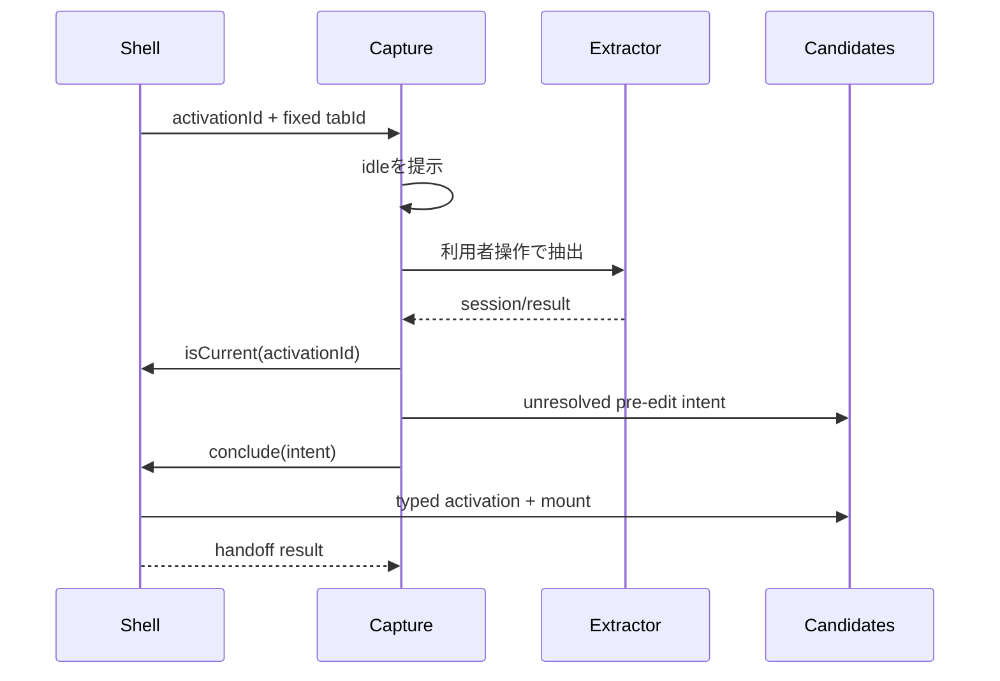

# 技術設計書

## Overview

product-captureを、常設ナビゲーション上で確認・保存まで担うfeatureから、一過性feature契約の実行面へ移行する。一過性面は`idle | extracting | failed`だけを持ち、抽出成功時は候補管理の非一過性編集面へ結果を引き渡す。

本specは上流`transient-feature-surface`の公開契約を利用し、登録・起動配送・タブ監視・戻り先を再定義しない。

### Goals

- product-captureを常設ナビから除外し一過性登録へ移行する
- 実行対象をactivationで配送されたtabIdへ固定する
- stale世代の抽出結果を引き渡さない
- 確認・補正・保存をcandidate-managementへ移す
- project未解決・空名の編集開始を型安全に表現する

### Non-Goals

- shell/runtimeの一過性基盤
- 抽出優先順位、ranker、normalizer
- 候補保存規則の変更
- 複数ソース化と価格更新

## Dependencies

### Required Upstream Contract

`application-shell/public.ts`から次を利用する。

- `ActivationId`
- `TargetTabId`
- `FeaturePresentation`
- `TransientSurfaceController.conclude`
- `TransientSurfaceController.isCurrent`
- `TransientSurfaceLifecyclePort`
- `FeatureActivationIntent`

上流contractの値集合や意味を本specで再定義しない。

captureはcontroller concrete classを取得しない。`createProductCaptureFeatureContribution`が`TransientSurfaceLifecyclePort`を引数で受け、state/coordinatorへ必要な`isCurrent`と`conclude`だけを渡す。

### Existing Feature Contracts

- product-captureの抽出coordinatorとChrome runtime port
- candidate-managementのactivation adapterと編集state
- canonical `CandidateDraft`と`validateCandidatePartContent`
- canonical `Result<T, E>`

### Existing Spec Revisions

- `product-page-capture` 要件4の簡易確認・補正はcapture面から候補管理の編集面へ移す
- `product-page-capture` 要件5のproject選択・保存・完了表示はcandidate-managementの既存責務へ一本化する
- `product-page-capture` 要件1.4 / 6.1 / 6.4の権限失効・遷移・再実行は、上流の表示寿命と新しい`ActivationId`に合わせて改訂する
- `project-candidate-management` はproject未解決・空名のpre-edit activationを受け入れる

## Architecture



## File Structure Plan

```text
src/features/product-capture/
  registration.ts
  transient-activation.ts               # new
  state.ts
  view.tsx
  coordinator.ts
  feature-contribution.ts
  editor-navigation.ts
  public.ts
  submit-draft.ts                        # remove
  worker-registration.ts                 # remove
src/features/candidate-management/
  contracts.ts
  activation.ts
  pre-edit-validation.ts                 # new
  public.ts
src/ui-messages/catalog/{ja,en}/
  nav.ts
  capture.ts
e2e/
  product-capture.spec.ts
  locators.ts
```

## Product Capture Migration

### Registration

product-capture registrationへ`presentation: "transient"`を指定し、activation adapterで次のpayloadを検証する。

```typescript
export interface CaptureTransientActivation {
  readonly activationId: ActivationId;
  readonly tabId: TargetTabId;
}
```

ナビ構築と初期選択からの除外は上流shellが担う。captureはroot runtimeやshell内部を直接編集しない。

```typescript
export interface ProductCaptureFeatureDependencies {
  readonly transientSurface: TransientSurfaceLifecyclePort;
}

export function createProductCaptureFeatureContribution(
  dependencies: ProductCaptureFeatureDependencies,
): FeatureContribution;
```

composition rootだけが具体controllerとcapture contributionを知り、capture内部は公開portだけへ依存する。

### State

```typescript
export type CaptureSessionState =
  | {
      readonly status: "idle";
      readonly activationId: ActivationId;
      readonly tabId: TargetTabId;
    }
  | {
      readonly status: "extracting";
      readonly activationId: ActivationId;
      readonly tabId: TargetTabId;
      readonly requestId: string;
    }
  | {
      readonly status: "failed";
      readonly activationId: ActivationId;
      readonly tabId: TargetTabId;
      readonly recoverable: boolean;
      readonly error: CaptureError;
    };
```

`review`、`submitting`、`saved`は削除する。新しいactivationを受け取るたびに`idle`へ戻し、旧世代のstateを保持しない。

### Execution Rules

- `startCapture`は`idle`または`failed`からのみ開始する
- `tabs.query`で現在のactive tabを再解決せず、固定`tabId`へ実行する
- 起動だけではcontent script注入やページ解析を行わない
- 抽出完了時に`isCurrent(activationId)`を確認する
- staleなら結果を破棄し、stateと候補管理を変更しない
- unmount/終了時に進行中requestを無効化し、後着完了を無視する

### View

一過性viewに提示するのは次だけとする。

- 実行開始操作
- 実行中表示
- 制限ページ、権限失効、応答なし、予期せぬ失敗の案内
- 候補ゼロ時に手入力へ進む案内

抽出結果の確認フォーム、project選択、保存、保存完了表示は削除する。

## Candidate Handoff

### Unresolved Draft

```typescript
export type UnresolvedCandidateDraft = {
  readonly [Attributes in NormalizedAttributes as Attributes["category"]]: Omit<
    CandidateDraftBase,
    "projectId"
  > & {
    readonly category: Attributes["category"];
    readonly normalizedAttributes: Attributes;
  };
}[PartCategory];

export interface CandidateEditorPrefill {
  readonly draft: UnresolvedCandidateDraft;
  readonly projectId?: ProjectId;
  readonly categoryHint?: PartCategory;
}
```

canonical `CandidateDraft`は変更しない。candidate-managementがprojectを解決して`projectId`を付与し、その後に既存保存契約へ接続する。

### Validation Stages

```typescript
export function validatePreEditDraft(
  draft: unknown,
): Result<UnresolvedCandidateDraft, CandidateEditorPrefillError>;
```

| Stage | Validation |
|---|---|
| 編集開始 | category、normalized attributes、payload shapeだけを検証。空名を許可 |
| 保存 | 既存`validateCandidatePartContent`を適用。空名を拒否 |

空の手入力draftは`product.name: { original: null, confirmed: "" }`を持つ。型の必須shapeは維持し、検証適用時点だけを分ける。

### Handoff Flow

1. 抽出成功または手入力選択で`UnresolvedCandidateDraft`を組み立てる
2. `FeatureActivationIntent`としてcandidate-managementを指定する
3. `controller.conclude(activationId, intent)`を呼ぶ
4. candidate-managementがprojectを解決しpre-edit draftを検証する
5. activation成功時だけ一過性面が終了し、候補編集面が主表示を引き取る
6. 失敗時は抽出結果をcapture側に保持し、識別可能なnavigation errorを提示する

captureはcandidate-managementのcomponentや内部stateをdeep importしない。

## Error Handling

- **permission-lost**: 「拡張アイコンをもう一度操作してください」と案内する
- **restricted-page**: 永続状態を変更せず対象外を示す
- **tab-changed/stale generation**: 結果を引き渡さず表示終了へ従う
- **injection-failed/timeout**: 永続状態を変更せず再実行案内を示す
- **no candidate**: 空名の手入力編集へ進む選択肢を示す
- **no project**: candidate-managementがproject作成の必要を返す
- **handoff failure**: 結果を破棄せず一過性面に留まる

## Requirements Traceability

| Requirement | Components | Verification |
|---|---|---|
| 1.1–1.7 | capture state/view, editor navigation, conclude | unit/integration |
| 2.1–2.7 | activation adapter, coordinator, generation check | unit/integration |
| 3.1–3.5 | registration, state, coordinator | regression/E2E |
| 4.1–4.5 | candidate contracts, pre-edit validation | type/contract/integration |
| 5.1–5.4 | feature test suites | unit/integration |
| 5.5 | production extension | Playwright E2E |
| 5.6 | synthetic fixtures | fixture validation |

## Testing Strategy

### Unit

- activation payloadの境界検証
- 状態集合が`idle | extracting | failed`だけであること
- 新世代でfailedがidleへ戻ること
- stale抽出完了がstateを変更しないこと
- unresolved draftのcategory整合とpre-edit validation
- 空名は編集開始で通り保存時に拒否されること

### Integration

- 固定tabIdだけへ抽出を実行すること
- 抽出成功でcandidate editorへconcludeすること
- handoff失敗時に結果と一過性面を保持すること
- 候補ゼロから空名手入力画面へ進むこと
- project未指定時に現在選択中projectを解決すること
- 既存抽出と候補保存validatorの非回帰

### E2E

- アイコン起動後にcapture面が立ち、利用者操作までは解析しない
- 実行成功後に候補編集面へ遷移する
- 対象タブ遷移後に古い結果を表示・保存しない
- product-captureが常設ナビへ存在しない

## Security Considerations

- ページ由来payloadを`unknown`として検証する
- URL、HTML、抽出値を診断ログへ出さない
- 永続化mutationはcandidate-managementの既存write authority経由だけにする
- 新しい権限やhost permissionを追加しない
- fixtureは架空データだけを使用する

## Migration Strategy

1. 上流`transient-feature-surface`のGOと公開contractを確認する
2. candidate-managementへunresolved/pre-edit契約を追加する
3. capture registrationとactivation adapterを移行する
4. capture state/viewを実行面へ縮小する
5. handoffを`conclude`へ接続し旧submit経路を削除する
6. catalog、locators、unit/integration/E2Eを更新する

本specのtasks生成は上流specのdesign承認後に行う。
