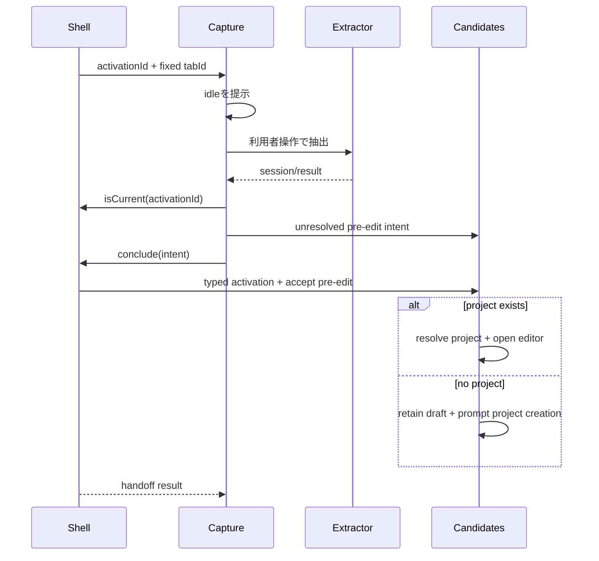

# 技術設計書

## Overview

product-captureを、常設ナビゲーション上で確認・保存まで担うfeatureから、一過性feature契約の実行面へ移行する。一過性面は`idle | extracting | failed`だけを持ち、抽出成功時は候補管理の非一過性編集面へ結果を引き渡す。projectが存在しない初回利用でも、候補管理が解決前draftを受理してproject作成後まで保持する。

本specは上流`transient-feature-surface`の公開契約を利用し、登録・起動配送・タブ監視・戻り先を再定義しない。

### Goals

- product-captureを常設ナビから除外し一過性登録へ移行する
- 実行対象をactivationで配送されたtabIdへ固定する
- stale世代の抽出結果を引き渡さない
- 確認・補正・保存をcandidate-managementへ移す
- project未解決・空名の編集開始を型安全に表現する
- project未作成時も再抽出なしで編集を継続できる

### Non-Goals

- shell/runtimeの一過性基盤
- 抽出優先順位、ranker、normalizer
- 候補保存規則の変更
- default projectの自動作成、暗黙命名、project lifecycle規則の変更
- 複数ソース化と価格更新

## Boundary Commitments

### This Spec Owns

- product-captureの一過性登録、固定tab抽出、世代照合、実行状態、candidate-managementへのtyped handoff
- candidate-managementの解決前draft契約、pre-edit validation、project-required state、既存projectまたは新規作成projectへの解決
- 旧capture内保存・project選択・直接navigation依存の削除と、production E2Eによる移行検証

### Out of Boundary

- shell/runtimeのactivation配送、寿命、原子的`conclude`実装
- projectの保存規則、default projectの自動作成・暗黙命名、候補保存時validation
- 抽出優先順位、normalization、価格更新、複数ソース化

### Allowed Dependencies

- application-shellの`TransientSurfaceLifecyclePort`、`FeatureActivationIntent`、activation識別子・固定tab型
- product-capture既存の抽出runtime、normalizer、ranker
- candidate-managementのcanonical `CandidateManagementPublicApi`（`query`、intent factory、`sources` facet）とcanonical candidate contract。product-captureが利用するのはintent factory facetだけとする
- local data foundationのcanonical `Result<T, E>`とdomain型

### Revalidation Triggers

- 上流`conclude`の成功条件、activation payload、固定tabまたは世代照合契約が変わる場合
- candidate-managementのpre-edit受理、project作成戻り値、canonical `CandidateDraft`または保存validatorが変わる場合
- project 0件を許容するdomain invariant、captureの直接保存非公開化、production E2E委譲範囲が変わる場合

## Dependencies

### Required Upstream Contract

`application-shell/public.ts`から次を利用する。

- `ActivationId`
- `TargetTabId`
- `FeaturePresentation`
- `TransientSurfaceLifecyclePort`
- `FeatureActivationIntent`

上流contractの値集合や意味を本specで再定義しない。

captureはcontroller concrete classを取得しない。`createProductCaptureContribution`が`TransientSurfaceLifecyclePort`を引数で受け、state/coordinatorへ必要な`isCurrent`と`conclude`だけを渡す。candidate-managementからはnavigationを直接実行するcallbackではなく、typed intentを組み立てる純粋なfactoryだけを利用する。

本specは上流4.5のproduction検証先でもある。テスト専用featureをcatalogへ追加せず、実product-capture登録を使う5.5自動E2Eでaction後と同形のdurable activation受信、capture面の提示、対象タブ失効または常設ナビ選択による終了・常設復帰までを検証する。固定tab抽出から候補編集面への引き渡し、project存在時と不存在時の回復はChrome-shaped integration testで検証する。Playwrightがブラウザーchromeのtoolbar user gestureを生成できずfixture投入も`activeTab`を付与しない境界は、同じproduction buildをChrome 116以降へ未パッケージロードして実icon click、`activeTab`付与、script注入、candidate editor到達を確認する必須manual smokeで閉じる。

### Existing Feature Contracts

- product-captureの抽出coordinatorと、固定`TargetTabId`へinjectするChrome runtime port
- candidate-managementのtyped intent factory、activation adapter、編集state
- canonical `CandidateDraft`と`validateCandidatePartContent`
- canonical `Result<T, E>`

移行後のproduct-capture contribution依存は、固定tab抽出runtime、`TransientSurfaceLifecyclePort`、candidate editor intent factoryの3つに限定する。直接保存用`CaptureCandidatePort`、capture内project選択用`listProjects`、shell navigationを即時実行する`openCandidateEditor` callbackは削除する。`CaptureCandidatePort`に他の公開consumerはないため、candidate-managementのpublic APIからも公開を削除し、保存serviceはcandidate-management内部に留める。

### Existing Spec Revisions

- `product-page-capture` 要件4の簡易確認・補正はcapture面から候補管理の編集面へ移す
- `product-page-capture` 要件5のproject選択・保存・完了表示はcandidate-managementの既存責務へ一本化する
- `product-page-capture` 要件1.4 / 6.1 / 6.4の権限失効・遷移・再実行は、上流の表示寿命と新しい`ActivationId`に合わせて改訂する
- `project-candidate-management` はproject未解決・空名のpre-edit activationとproject-required stateを受け入れ、外部consumer向け`CaptureCandidatePort`を廃止する

## Architecture



## File Structure Plan

```text
src/features/product-capture/
  registration.ts
  transient-activation.ts               # new
  state.ts
  view.tsx
  coordinator.ts
  chrome-runtime-port.ts
  draft-mapper.ts
  feature-contribution.ts
  editor-handoff.ts                     # new; replaces editor-navigation.ts
  editor-navigation.ts                  # remove
  public.ts
  submit-draft.ts                        # remove
  worker-registration.ts                 # remove
src/features/candidate-management/
  contracts.ts
  activation.ts
  pre-edit-validation.ts                 # new
  state.ts
  view.tsx
  feature-contribution.ts
  public.ts
src/application-shell/
  side-panel-contributions.ts
src/ui-messages/catalog/{ja,en}/
  nav.ts
  capture.ts
  candidate.ts
tests/features/product-capture/
tests/features/candidate-management/
tests/application-shell/
e2e/
  product-capture.spec.ts
  locators.ts
```

## Product Capture Migration

### Registration

product-capture registrationはapplication-shellが公開するcanonical `ApplicationFeatureRegistration` discriminated unionの一過性memberをそのまま満たす。`presentation: "transient"`とactivation adapterを指定し、`navigation` metadataは申告しない。したがって`nav.productCapture`も要求・参照しない。activation adapterは次のpayloadを検証する。

```typescript
export interface CaptureTransientActivation {
  readonly activationId: ActivationId;
  readonly tabId: TargetTabId;
}
```

一過性memberに`navigation`を持たせない型制約と、ナビ構築・初期選択・fallbackからの除外は上流shellが担う。captureは登録unionを再定義せず、`application-shell/public.ts`からimportした型にregistration objectを適合させる。root runtimeやshell内部は直接編集しない。registrationのactivation、mount/unmount、`TransientSurfaceLifecyclePort`による世代照合と原子的handoffは維持する。

```typescript
import type { TransientApplicationFeatureRegistration } from "../../application-shell/public.js";
import type { CandidateManagementPublicApi } from "../candidate-management/public.js";
import type { ProductCapturePublicApi } from "./public.js";

type ProductCaptureTransientRegistration = TransientApplicationFeatureRegistration<
  ProductCapturePublicApi,
  CaptureTransientActivation
>;

export interface ProductCaptureContributionDependencies {
  readonly runtime: CaptureRuntimePort;
  readonly transientSurface: TransientSurfaceLifecyclePort;
  readonly createCandidateEditorIntent: CandidateManagementPublicApi["createCandidateEditorIntent"];
}

export function createProductCaptureContribution(
  context: FeatureCompositionContext,
  dependencies: ProductCaptureContributionDependencies,
): FeatureContribution;
```

canonical unionのbranch型`TransientApplicationFeatureRegistration`も同じ公開entry pointからtype-only importし、product-captureのregistration objectを直接適合させる。このbranchの`presentation: "transient"`と`navigation?: never`を変更せず、runtime objectではproperty自体を渡さない。composition rootだけが具体controllerとcapture contributionを知り、capture内部は公開portだけへ依存する。

`CandidateManagementPublicApi`はcandidate-managementの`public.ts`からtype-only importし、product-capture側で同名interfaceを再定義しない。canonical公開面は`query`、`createCandidateEditorIntent(prefill): FeatureActivationIntent`、`sources: { catalog, mutations }`の全facetを保持する。captureはindexed access typeでintent factory facetだけを依存注入し、他facetが存在しない、または削除対象であるとは扱わない。

`CaptureRuntimePort`は移行時にactive tab再解決を廃止し、activationで固定された`TargetTabId`を必須入力としてinjectする契約へ変更する。`createCandidateEditorIntent`はpayload生成だけを行ってnavigationやstate mutationを開始しない。captureはその戻り値を`conclude`へ渡す。

```typescript
export interface CaptureCoordinator {
  captureTab(tabId: TargetTabId): Promise<Result<CaptureResult, CaptureError>>;
}

export type CaptureTabLookupFailure =
  | { readonly kind: "tab-unavailable" }
  | { readonly kind: "url-unavailable" };

export interface CaptureRuntimePort {
  getTab(
    tabId: TargetTabId,
  ): Promise<Result<ActiveTabInfo, CaptureTabLookupFailure>>;
  inject(
    target: ActiveTabInfo,
    requestId: RequestId,
  ): Promise<Result<RawCapturePayload, CaptureInjectionFailure>>;
}
```

`getActiveTab`と`captureCurrentTab`は削除する。`startCapture`はstateが保持する`tabId`を`captureTab`へ渡し、runtimeは`tabs.get(tabId)`相当で同じtabだけを解決する。呼出前に`isCurrent(activationId)`を確認し、action gestureで付与された`activeTab` accessが現行世代に対して有効であることを前提とする。

Chromeの`tabs.Tab.url`はoptionalであり、`activeTab`またはhost accessがない場合と未commit時には欠落または空文字になり得る。adapterは非空`url`を得た場合だけ`ActiveTabInfo`を構築する。tab不存在は`tab-unavailable`、URL欠落・空文字は`url-unavailable`を返し、coordinatorは前者を`tab-changed`、後者を`permission-lost`へ写像して注入前にfail closedする。cast、空文字、推測URLで型を満たさず、`payload.pageUrl === target.url`の比較を常に実行する。URLとpayload照合は維持し、抽出完了後の`isCurrent`を最終handoff gateとする。

candidate-management contributionは公開APIの旧`capture`と`openCandidateEditor`、registration dependencyの`capture`と`navigator`を削除する一方、canonical `query`と`sources: { catalog, mutations }`を維持する。composition rootは公開intent factoryだけをproduct-captureへ渡し、candidate-managementの保存service、project query、source catalog／mutationをcaptureへ配線しない。

### State

```typescript
export type CaptureFailure =
  | {
      readonly kind: "execution";
      readonly error: CaptureError;
      readonly recoverable: boolean;
    }
  | {
      readonly kind: "handoff";
      readonly error: TransientSurfaceError;
      readonly retainedIntent: FeatureActivationIntent;
    };

export type CaptureSessionState =
  | {
      readonly status: "idle";
      readonly activationId: ActivationId;
      readonly tabId: TargetTabId;
    }
  | {
      readonly status: "extracting";
      readonly activationId: ActivationId;
      readonly tabId: TargetTabId;
      readonly requestId: string;
    }
  | {
      readonly status: "failed";
      readonly activationId: ActivationId;
      readonly tabId: TargetTabId;
      readonly failure: CaptureFailure;
    };
```

`review`、`submitting`、`saved`は削除する。handoff失敗時だけ、検証済み`FeatureActivationIntent`を`failed.failure.retainedIntent`へ保持し、同じ現行activationから`conclude`を再試行できる。保持先はcapture stateだけであり、永続化しない。成功、新しいactivation、または一過性面の終了で破棄する。新しいactivationを受け取るたびに`idle`へ戻し、旧世代のstateを保持しない。

### Execution Rules

- `startCapture`は`idle`または`failed`からのみ開始する
- `startCapture`はruntimeを呼ぶ直前にも`isCurrent(activationId)`を確認し、現行世代でない場合は`getTab`もinjectも行わない
- `tabs.query`で現在のactive tabを再解決せず、固定`tabId`へ実行する
- `getTab`がURLを返さない場合は`permission-lost`として注入せず、`pageUrl`比較を迂回しない
- 起動だけではcontent script注入やページ解析を行わない
- 抽出完了時に`isCurrent(activationId)`を確認する
- staleなら結果を破棄し、stateと候補管理を変更しない
- handoff失敗時は検証済みintentを`failed`へ保持し、再試行時にも`isCurrent(activationId)`を確認してから同じintentで`conclude`する
- unmount/終了時に進行中requestを無効化し、後着完了を無視する

### View

一過性viewに提示するのは次だけとする。

- 実行開始操作
- 実行中表示
- 制限ページ、権限失効、応答なし、予期せぬ失敗の案内
- 候補ゼロ時に手入力へ進む案内
- handoff失敗時の結果保持案内と、同じ現行世代での引き渡し再試行操作

抽出結果の確認フォーム、project選択、保存、保存完了表示は削除する。

## Candidate Handoff

### Unresolved Draft

```typescript
export type UnresolvedCandidateDraft = {
  readonly [Attributes in NormalizedAttributes as Attributes["category"]]: Omit<
    CandidateDraftBase,
    "projectId"
  > & {
    readonly category: Attributes["category"];
    readonly normalizedAttributes: Attributes;
  };
}[PartCategory];

export interface CandidateEditorPrefill {
  readonly draft: UnresolvedCandidateDraft;
  readonly projectId?: ProjectId;
  readonly categoryHint?: PartCategory;
}
```

canonical `CandidateDraft`は変更しない。candidate-managementがprojectを解決して`projectId`を付与し、その後に既存保存契約へ接続する。

### Candidate Pre-edit State

次は既存`ManagementStateValue`を置き換える型ではなく、既存stateへ追加する差分契約である。project一覧、選択、候補一覧、既存`editor`、loading/error等のfieldは変更しない。

```typescript
export interface CandidatePreEditState {
  readonly pendingPreEdit: CandidateEditorPrefill | null;
}
```

`ManagementStateValue`へ`CandidatePreEditState.pendingPreEdit`を追加し、既存`editor` fieldはcanonical `CandidateDraft`だけを保持する契約のまま維持する。

shellは既存activation順序どおりcandidate-managementをmountし、`resetTransientState`とproject一覧の`load`が完了してからactivation adapterを呼ぶ。adapterは検証済みprefillをstateへ受理する。明示`projectId`が存在すればそのprojectを使用し、指定IDが存在しなければactivation失敗とする。未指定なら現在選択中、または一覧先頭の既存projectを解決する。projectが0件なら`pendingPreEdit`へ解決前draftを保持し、同じ常設面内にproject作成フォームを提示する。この受理はactivation成功であり、captureの一過性面を終了できる。すでにcandidate-managementがmount済みの場合も、直近のstate一覧だけを解決根拠とし、captureからproject queryを行わない。

project作成成功時は`CandidateManagementService.createProject`が返す`Project.id`を保持中draftへ付与し、canonical `CandidateDraft`を構築して`editor`へ遷移する。`pendingPreEdit`はこの成功、利用者による明示取消、または新しいpre-edit activationでのみ置換・破棄し、capture面の終了では破棄しない。保持保証は同一side panel documentのsession内に限定し、side panel閉鎖・extension reload・browser終了でdocumentが破棄された場合は失われることを受容する。再open時に復元や自動再抽出は行わない。projectを自動作成または暗黙命名しない。

### Validation Stages

```typescript
export type PreEditDraftError =
  | { readonly kind: "invalid-draft-shape" }
  | { readonly kind: "invalid-category" }
  | { readonly kind: "category-mismatch" };

export type CandidateEditorPrefillError =
  | PreEditDraftError
  | { readonly kind: "invalid-project-id" }
  | { readonly kind: "invalid-category-hint" };

export function validatePreEditDraft(
  draft: unknown,
): Result<UnresolvedCandidateDraft, PreEditDraftError>;

export function validateCandidateEditorPrefill(
  value: unknown,
): Result<CandidateEditorPrefill, CandidateEditorPrefillError>;
```

`invalid-draft-shape`は必須fieldまたは値shapeの不正、`invalid-category`は未知category、`category-mismatch`はdraft categoryと`normalizedAttributes.category`の不一致を表す。outer prefill validatorは、指定された`projectId`の型・空文字を`invalid-project-id`、未知`categoryHint`を`invalid-category-hint`とする。いずれもactivation境界で`invalid_activation`へ写像し、未信頼値そのものをerrorへ含めない。project 0件は有効な`project-required` stateであり、このerror unionへ`no_project_available`を追加しない。形式が正しい明示`projectId`が永続project一覧に存在しない場合だけ、pre-edit validation後の解決段階で`activation_failed`とする。

| Stage | Validation |
|---|---|
| 編集開始 | category、normalized attributes、payload shapeだけを検証。空名を許可 |
| 保存 | 既存`validateCandidatePartContent`を適用。空名を拒否 |

空の手入力draftは`product.name: { original: null, confirmed: "" }`を持つ。型の必須shapeは維持し、検証適用時点だけを分ける。

### Handoff Flow

1. 抽出成功または手入力選択で`UnresolvedCandidateDraft`を組み立てる
2. `FeatureActivationIntent`としてcandidate-managementを指定する
3. `controller.conclude(activationId, intent)`を呼ぶ
4. candidate-managementがpre-edit draftを検証して自身の非一過性stateへ受理する
5. projectが存在すればcanonical draftを構築してeditorを開き、0件なら解決前draftを保持してproject作成を提示する
6. 受理成功時に一過性面が終了し、候補管理面が主表示を引き取る
7. project作成後は作成結果の`Project.id`で保持中draftを解決し、再抽出せずeditorを開く
8. 受理失敗時だけ抽出結果をcapture側に保持し、識別可能なnavigation errorを提示する

captureはcandidate-managementのcomponentや内部stateをdeep importしない。

## Error Handling

- **permission-lost**: 「拡張アイコンをもう一度操作してください」と案内する
- **restricted-page**: 永続状態を変更せず対象外を示す
- **tab-changed/stale generation**: 結果を引き渡さず表示終了へ従う
- **injection-failed/timeout**: 永続状態を変更せず再実行案内を示す
- **no candidate**: 空名の手入力編集へ進む選択肢を示す
- **no project**: activation失敗にせず、candidate-managementが解決前draftを非一過性stateへ保持し、同じ画面でproject作成を提示する。作成失敗時もdraftを保持して既存のproject作成errorを示す
- **handoff failure**: 検証済みintentをcapture stateへ保持し、一過性面に留まって再試行を提示する

## Requirements Traceability

| Requirement | Components | Verification |
|---|---|---|
| 1.1, 1.2, 1.3, 1.4, 1.5, 1.6, 1.7 | capture state/view, editor handoff, conclude | unit/integration |
| 2.1, 2.2, 2.3, 2.4, 2.5, 2.6, 2.7 | activation adapter, coordinator, generation check | unit/integration |
| 3.1, 3.2, 3.3, 3.4, 3.5 | registration, state, coordinator | regression/E2E |
| 4.1, 4.2, 4.3, 4.4, 4.5, 4.6 | candidate contracts, pre-edit validation, project-required state | type/contract/integration |
| 5.1, 5.2, 5.3, 5.4 | feature test suites | unit/integration |
| 5.5 / upstream 4.5 | production product-capture registration | durable activationからcapture面までのPlaywright E2E + 固定tab/handoffのChrome-shaped integration + toolbar icon manual smoke |
| 5.6 | synthetic fixtures | fixture validation |

## Testing Strategy

### Unit

- activation payloadの境界検証
- 状態集合が`idle | extracting | failed`だけであること
- 新世代でfailedがidleへ戻ること
- stale抽出完了がstateを変更しないこと
- unresolved draftのcategory整合とpre-edit validation
- URL取得成功、tab不存在、URL欠落・空文字の各`getTab`境界と、URL欠落時にinjectしないこと
- 空名は編集開始で通り保存時に拒否されること

### Integration

- 固定tabIdだけへ抽出を実行すること
- 抽出成功でcandidate editorへconcludeすること
- handoff失敗時に結果と一過性面を保持すること
- 候補ゼロから空名手入力画面へ進むこと
- project未指定時に現在選択中projectを解決すること
- projectが0件でもhandoffを成功させ、capture終了後に解決前draftが候補管理へ保持されること
- project作成成功時に返されたProjectIdで保持中draftを解決し、再抽出せずeditorを開くこと
- project作成失敗時に保持中draftを失わないこと
- side panel session内ではpending pre-editを保持し、panel document破棄後は復元しないこと
- 既存抽出と候補保存validatorの非回帰

### E2E

- action後と同形のdurable activationをproduction session transportへ投入するとcapture面が立ち、利用者操作までは解析しない
- 対象タブ遷移で一過性面が終了して常設面へ戻り、古い結果を表示・保存しない
- 常設ナビ選択で一過性面が終了する
- product-captureが常設ナビへ存在しない

このsuiteは実featureを含むproduction buildだけをロードする。durable activationのfixture投入はtoolbar icon起動または`activeTab`付与の代替証明として扱わず、production transportから実feature mount、寿命、常設復帰までの決定的な自動検証にだけ使用する。固定tab抽出、抽出成功後のcandidate editorへのconclude、project存在時と不存在時、project作成後に再抽出せずeditorへ進む経路はChrome-shaped integration suiteで検証する。実toolbar icon起動、固定tabへの`activeTab`付与、capture面表示、実script注入、抽出成功、candidate editor到達は、同じcommitのproduction buildをChrome 116以降へ未パッケージロードするmanual smokeで確認する。manual smoke未実施または失敗時の最終判定は`MANUAL_VERIFY_REQUIRED`とし、feature GOを主張しない。

## Security Considerations

- ページ由来payloadを`unknown`として検証する
- `activeTab` accessが有効な現行世代だけで固定tabのURLを取得し、URL欠落時は注入前にfail closedして出所照合を省略しない
- URL、HTML、抽出値を診断ログへ出さない
- 永続化mutationはcandidate-managementの既存write authority経由だけにする
- 新しい権限やhost permissionを追加しない
- fixtureは架空データだけを使用する

## Migration Strategy

1. 上流`transient-feature-surface`のGOと公開contractを確認する
2. candidate-managementへunresolved/pre-edit契約を追加する
3. candidate-managementへproject-required stateとproject作成後の継続処理を追加する
4. candidate-management public APIをcanonical `query`・typed intent factory・`sources` facetへ統一し、captureはintent factory facetだけを利用する
5. capture registration、固定tab runtime、activation adapterを移行する
6. capture state/viewを実行面へ縮小する
7. handoffを`conclude`へ接続し旧submit・直接navigation経路を削除する
8. composition、catalog、locators、unit/integration/E2Eを更新する

本specのtasks生成は上流specのdesign承認後に行う。
