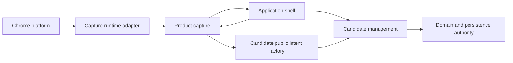
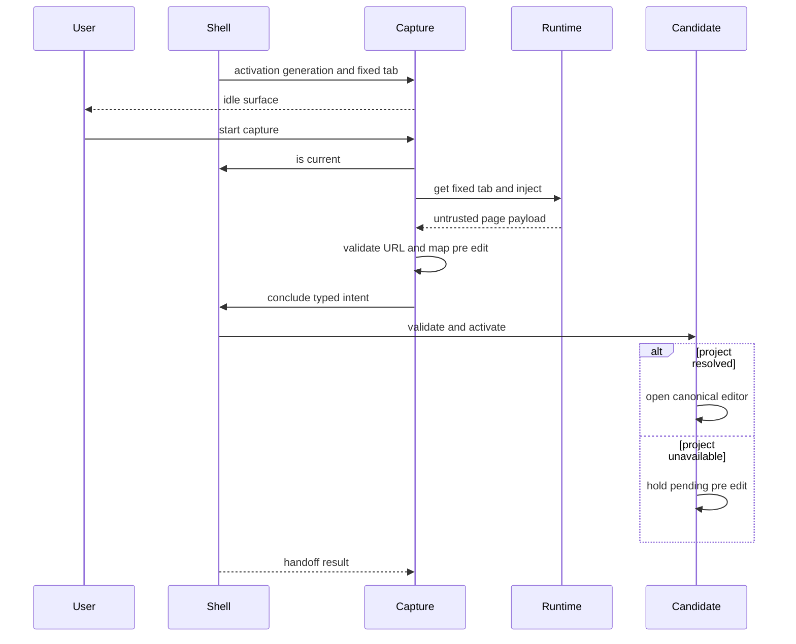
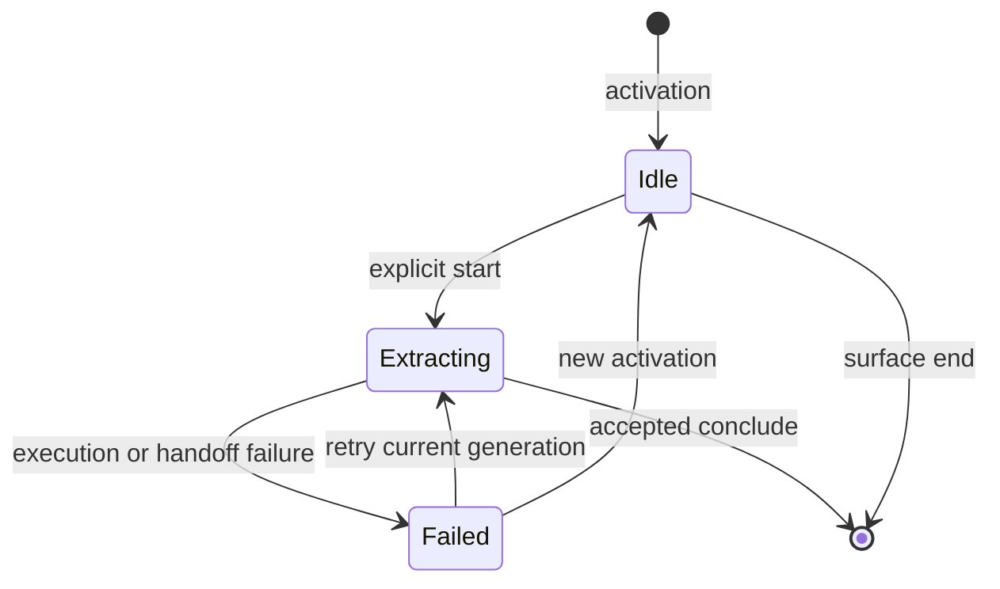
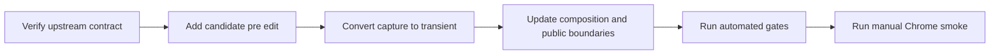

# 技術設計書

## Overview

product-captureを、常設ナビゲーション上で確認・保存まで担うfeatureから、固定tabでの抽出実行だけを担う一過性featureへ移行する。一過性面は`idle | extracting | failed`だけを持ち、抽出結果または空名の手入力draftをcandidate-managementの非一過性編集面へtyped intentとして引き渡す。

application-shellがactivation generation、固定tab、surface寿命、原子的handoffとrollbackを所有し、candidate-managementがcurrent projectへのbinding、project未解決pre-editの保持、確認、補正、保存を所有する。product-captureは保存先を選ばず、永続化を実行しない。

### Goals

- product-captureを常設navigationから除外し、明示起動された一過性面へ限定する。
- activationで固定されたtabだけを、利用者の実行操作後に解析する。
- stale result、権限失効、tab遷移、handoff失敗をfail closedかつ回復可能に扱う。
- project未解決または空名のdraftを型安全にcandidate-managementへ渡す。
- candidate-management受理後は、target tabの寿命と独立して同じpre-editを継続する。

### Non-Goals

- transient surface基盤、activation配送、lease、原子的`conclude`自体の実装。
- current projectの選択・fallback・永続化規則、project CRUD規則の再定義。
- 候補editor、保存時validation、single write authorityの再実装。
- 抽出優先順位、normalization、複数ソース、価格更新の変更。
- pending pre-editのside-panel documentを越えた永続化または復元。

## Boundary Commitments

### This Spec Owns

- product-captureのtransient registration、activation受理、固定tab実行、世代照合、実行状態、失敗表示、typed handoff準備。
- capture結果からproject IDを含まない`UnresolvedCandidateDraft`への写像と、候補ゼロ時の空名manual draft。
- candidate-management側のpre-edit境界検証、既存projectへのbinding、project不存在時のpending保持、作成結果による再開。
- capture内の旧project selector、確認、保存、direct navigation、worker保存経路の除去と移行検証。

### Out of Boundary

- application-shellのdurable activation transport、surface controller、lease release順序、戻り先選択。
- project-contextのcurrent selection authorityとproject lifecycle policy。
- candidate-managementのcanonical editor state、保存規則、保存mutation、source管理。
- extractor/ranker/normalizerの意味論、ページ監視、恒久host access。

### Allowed Dependencies

- `src/application-shell/public.ts`のtransient registration、activation、mount、lifecycle、typed intent契約だけを利用する。
- `src/features/candidate-management/public.ts`のcanonical `CandidateManagementPublicApi["createCandidateEditorIntent"]`だけをcaptureへ注入する。
- product-capture内部のruntime、extractor、normalizer、rankerを利用する。
- `src/domain/public.ts`のcanonical `Result<T, E>`、ID、時刻、candidate domain contractを利用する。
- Chrome platformの`activeTab`、`scripting`、`tabs.get`を既存adapter経由で利用し、新規packageを追加しない。

### Revalidation Triggers

- `TransientActivationRequest`、`TransientSurfaceLifecyclePort.conclude`、rollback snapshotまたはlease解放順序が変わる場合。
- `UnresolvedCandidateDraft`、project IDを持たない`CandidateEditorPrefill`、canonical `CandidateDraft`、保存時validatorが変わる場合。
- current projectのfallback、project 0件許容、project作成戻り値が変わる場合。
- `activeTab`付与・失効、`tabs.Tab.url`取得条件、script injection権限が変わる場合。
- product-capture contributionの3依存、candidate-management公開API、cross-feature import規則が変わる場合。

## Architecture

### Existing Architecture Analysis

- feature-first vertical sliceを維持し、通常consumerは各featureの`public.ts`だけを参照する。
- application-shellはfeature registration、side-panel composition、typed activation、transient lifecycleを所有する。
- candidate-managementはcandidate editorと保存authorityへの接続を既に所有する。
- product-captureの抽出pipelineは`runtime → coordinator → mapper`として再利用できるが、旧review/save/navigation責務は一過性境界と競合する。

### Architecture Pattern & Boundary Map



**Architecture Integration**:

- Selected pattern: shell-owned transient lifecycleとfeature-owned vertical sliceを型付きportで接続する。
- Dependency direction: domain contracts → candidate/public shell ports → feature state/coordinator → Chrome/React adapters → composition root。
- Existing patterns preserved: public entry point、canonical `Result`、unknown境界検証、React adapter分離、single write authority。
- New abstractions: 新規汎用層は作らず、pre-edit contractとrollback snapshotだけを責務境界として明示する。
- Steering compliance: 明示操作、最小権限、ローカルファースト、欠損を正常状態として扱う原則を維持する。

### Technology Stack

| Layer | Choice / Version | Role in Feature | Notes |
|---|---|---|---|
| UI | React 19 / TypeScript 7 | transient capture表示、project-required表示 | domain stateをcomponentへ埋め込まない |
| Runtime | Chrome 116+ MV3 | `activeTab`、`scripting`、`tabs.get`、side panel | host permission追加なし |
| Domain | strict TypeScript contracts | unresolved draft、error union、generation state | `any`禁止、unknownを境界検証 |
| Storage | existing local data foundation | candidate保存 | captureから直接利用しない |
| Test | Node test runner、jsdom、Playwright | unit、integration、DOM、production E2E | 実サイトfixture禁止 |

## File Structure Plan

### Directory Structure

```text
src/
├── features/
│   ├── product-capture/
│   │   ├── contracts.ts              # 実行状態、failure、capture result契約
│   │   ├── transient-activation.ts   # handoff activationのunknown境界検証
│   │   ├── registration.ts           # transient registration、lease連携、rollback snapshot
│   │   ├── chrome-runtime-port.ts    # 固定tab取得とscript injection adapter
│   │   ├── coordinator.ts            # URL照合を含む抽出pipeline
│   │   ├── draft-mapper.ts           # capture resultからproject未解決draftへの写像
│   │   ├── editor-handoff.ts         # intent準備、conclude、retained intent再試行
│   │   ├── state.ts                  # activation-scoped stateとgeneration guard
│   │   ├── view.tsx                  # 実行、失敗、manual、retry表示
│   │   ├── react-root.tsx            # React mount/unmount adapter
│   │   ├── feature-contribution.ts   # 3依存のproduction wiring
│   │   └── public.ts                 # product-capture公開面
│   └── candidate-management/
│       ├── contracts.ts              # unresolved pre-editとcanonical draft契約
│       ├── pre-edit-validation.ts    # 編集開始段階の構造検証
│       ├── activation.ts             # current context解決とeditor/pending受理
│       ├── state.ts                  # pending pre-edit、作成結果による再開
│       ├── registration.ts           # panel session lifecycle接続
│       ├── view.tsx                  # project-required、取消、再試行UI
│       ├── feature-contribution.ts   # candidate internal services composition
│       └── public.ts                 # canonical APIと純粋intent factory
├── application-shell/
│   └── side-panel-contributions.ts   # captureへruntime/lifecycle/intent factoryを注入
└── ui-messages/catalog/
    ├── ja/capture.ts                 # capture実行・失敗message
    ├── en/capture.ts                 # 英語capture message
    ├── ja/candidate.ts               # project-required message
    ├── en/candidate.ts               # 英語project-required message
    ├── ja/nav.ts                     # product-capture navigation key除去
    └── en/nav.ts                     # product-capture navigation key除去
tests/
├── features/product-capture/         # state、runtime、handoff、view、registration
├── features/candidate-management/    # validation、activation、pending、保存非回帰
├── application-shell/                # lifecycle、composition、public contract
├── runtime/                          # production-shaped activation fixture
└── tooling/                          # boundary、permission、artifact、security gate
e2e/
├── product-capture.spec.ts           # durable activation、dismissal、navigation復帰
├── locators.ts                       # stable role/label/test-id locator
└── models/product-capture.ts         # capture page model
```

### Modified and Removed Files

- `src/features/product-capture/editor-navigation.ts` — direct navigation責務を削除する。
- `src/features/product-capture/submit-draft.ts` — captureからの保存経路を削除する。
- `src/features/product-capture/worker-registration.ts` —旧worker保存entryを削除する。
- `src/application-shell/side-panel-contributions.ts` — capture contributionを3依存で組み立てる。
- message catalogとE2E locator — `nav.productCapture`、旧review/save status依存を除去する。

## System Flows

### 抽出と原子的handoff



- runtime呼出前、抽出完了後、handoff完了後に現行世代を確認する。
- candidate-managementがeditorまたはpending pre-editとして受理した場合だけhandoff成功とする。
- target受理またはmountに失敗した場合、shellがrollback snapshotからsource surfaceを復元し、captureは同じintentを再試行可能にする。

### Capture State



## Requirements Traceability

| Requirement | Summary | Components | Interfaces | Flows |
|---|---|---|---|---|
| 1.1 | transient面を実行状態へ限定 | Capture State、Capture View | `CaptureSessionState` | Capture State |
| 1.2 | 抽出結果と根拠を編集面へ渡す | Draft Mapper、Editor Handoff | `CandidateEditorPrefill` | 抽出とhandoff |
| 1.3 | candidate受理時だけ終了 | Editor Handoff、Shell Lifecycle | `conclude` | 抽出とhandoff |
| 1.4 | target tab寿命から編集を分離 | Candidate Activation、Pending Pre-edit | activation contract | 抽出とhandoff |
| 1.5 | 候補ゼロから空名manualへ進む | Draft Mapper、Capture View | `prepareManual` | Capture State |
| 1.6 | current context不能時も保持 | Candidate Activation、Management State | `pendingPreEdit` | 抽出とhandoff |
| 1.7 | 確認・補正・保存を再定義しない | Public API Boundary | intent factory facet | Architecture |
| 1.8 | project選択・作成後に同じpre-editを再開 | Management State | project creation result | 抽出とhandoff |
| 1.9 | 受理・終了失敗時にrollback世代で再試行 | Capture State、Registration | `CaptureRollbackState` | Capture State |
| 2.1 | 現行世代・固定tabの操作だけ提示 | Registration、Capture State | activation ID、target tab ID | Capture State |
| 2.2 | stale状態から開始しない | Capture State | `isCurrent` | Capture State |
| 2.3 | 権限失効の回復案内 | Runtime Adapter、Capture View | `permission-lost` | Capture State |
| 2.4 | 制限ページは永続変更なし | Coordinator、Capture View | `restricted-page` | Capture State |
| 2.5 | tab失効・世代変更の結果を破棄 | Coordinator、Capture State | generation guard | 抽出とhandoff |
| 2.6 | timeout・unexpected failureを非永続表示 | Capture State、Capture View | execution failure union | Capture State |
| 2.7 | 新activationで失敗を破棄 | Capture State | `activate` | Capture State |
| 3.1 | 明示実行までページを読まない | Capture View、Capture State | `startCapture` | 抽出とhandoff |
| 3.2 | 起動だけで副作用を起こさない | Registration、Capture State | activation contract | Capture State |
| 3.3 | 常設featureから自動切替しない | Registration、Shell Composition | transient registration | Architecture |
| 3.4 | ページ監視・自動解析をしない | Runtime Adapter | request-scoped injection | 抽出とhandoff |
| 3.5 | 恒久読み取り権限を追加しない | Runtime Adapter、Artifact Gate | `activeTab`、`scripting` | Architecture |
| 4.1 | projectなしdraft公開契約 | Candidate Contracts | `UnresolvedCandidateDraft` | 抽出とhandoff |
| 4.2 | current project bindingをcandidateへ委譲 | Candidate Activation | activation adapter | 抽出とhandoff |
| 4.3 | 空名は編集開始で許可 | Pre-edit Validation | `validatePreEditDraft` | 抽出とhandoff |
| 4.4 | 空名保存は既存validatorで拒否 | Candidate Save Boundary | canonical save validator | Testing |
| 4.5 | unsafe fallback・validator重複を禁止 | Candidate Activation、Boundary Gate | canonical contracts | Architecture |
| 4.6 | context回復後にpendingを再開 | Management State、Candidate View | `pendingPreEdit` | 抽出とhandoff |
| 4.7 | bind済みprojectを置換しない | Candidate Activation | resolved `ProjectId` | 抽出とhandoff |
| 4.8 | stale project入力を保存先に使わない | Pre-edit Validation、Candidate Activation | project-free prefill | Error Handling |
| 5.1 | state集合をunit検証 | Capture State Tests | state union | Capture State |
| 5.2 | stale結果抑止を自動検証 | Coordinator/State Tests | generation guard | 抽出とhandoff |
| 5.3 | binding、pending、retry、manualを統合検証 | Feature Integration Tests | handoff contracts | 抽出とhandoff |
| 5.4 | extractor、editor、保存を非回帰 | Regression Tests | existing public contracts | Testing |
| 5.5 | production E2Eとmanual smokeを分離 | E2E、Chrome-shaped Integration | durable activation | Migration |
| 5.6 | 実サイトassetを不要にする | Fixture Gate | synthetic fixtures | Testing |
| 5.7 | stale projectと原子的終了条件を検証 | Activation、Handoff、Rollback Tests | error/result contracts | 抽出とhandoff |

## Components and Interfaces

| Component | Domain/Layer | Intent | Req Coverage | Key Dependencies | Contracts |
|---|---|---|---|---|---|
| Product Capture Registration | Shell adapter | transient起動とrollbackを接続 | 1.9, 2.1, 3.2, 3.3, 5.5 | Shell ports P0 | Service, State |
| Capture Runtime Adapter | Chrome adapter | 固定tabをfail closedで読む | 2.3, 2.4, 2.5, 3.4, 3.5 | Chrome APIs P0 | Service |
| Capture Coordinator | Application | payload検証と出所照合 | 1.2, 2.5, 2.6 | Runtime P0 | Service |
| Capture State | Application state | 世代、実行、失敗、retryを管理 | 1.1, 1.3, 1.5, 1.9, 2.1, 2.2, 2.7, 3.1, 5.1, 5.2 | Lifecycle P0 | State |
| Draft Mapper and Handoff | Integration | unresolved intentを準備・conclude | 1.2, 1.3, 1.5, 4.1 | Candidate factory P0 | Service |
| Candidate Pre-edit Boundary | Candidate domain | unknown prefillを段階検証 | 4.1, 4.3, 4.5, 4.8 | Domain validator P0 | Service |
| Candidate Activation | Candidate application | current context解決と受理を所有 | 1.6, 4.2, 4.7, 4.8 | Project Context P0 | Service |
| Pending Pre-edit State | Candidate state | project回復までdraftを保持 | 1.4, 1.6, 1.8, 4.6 | Project service P0 | State |
| Capture and Candidate Views | UI | 実行・回復操作を表示 | 1.1, 1.5, 2.3, 2.4, 2.6, 4.6 | Message catalog P1 | State |

### Product Capture Layer

#### Product Capture Registration

| Field | Detail |
|---|---|
| Intent | canonical transient registrationへactivationとrollback stateを接続する |
| Requirements | 1.9, 2.1, 3.2, 3.3, 5.5 |

**Responsibilities & Constraints**

- `presentation: "transient"`を申告し、`navigation` metadataを持たない。
- mount前にactivation IDと正のsafe integerであるtab IDを検証する。
- snapshotは実行identityだけを保持し、ページ内容と抽出値を含めない。
- lease所有、release順序、target rollbackはshellへ委ねる。

**Dependencies**

- Inbound: Application Shell — activation、mount、restore（P0）
- Outbound: Capture State — activate、deactivate、snapshot（P0）

**Contracts**: Service [x] / State [x]

```typescript
interface CaptureRollbackState {
  readonly activationId: ActivationId;
  readonly tabId: TargetTabId;
  readonly requestGeneration: number;
  readonly handoffInFlightGeneration: number | null;
}
```

#### Capture Runtime Adapter

| Field | Detail |
|---|---|
| Intent | activation固定tabだけを取得し、安全な場合だけ抽出scriptを実行する |
| Requirements | 2.3, 2.4, 2.5, 3.4, 3.5 |

**Responsibilities & Constraints**

- `tabs.query`によるactive tab再解決を行わない。
- `tabs.get`失敗、URL欠落・空文字、制限URL、injection failureを判別可能なerrorへ写像する。
- page由来URLとtarget URLをcoordinatorで一致確認できる形にする。

**Contracts**: Service [x]

```typescript
interface CaptureRuntimePort {
  getTab(tabId: TargetTabId): Promise<Result<ActiveTabInfo, CaptureTabFailure>>;
  inject(tab: ActiveTabInfo, requestId: string): Promise<Result<unknown, CaptureInjectionFailure>>;
}
```

#### Capture State and Handoff

| Field | Detail |
|---|---|
| Intent | 現行activationの実行、stale抑止、handoff、再試行を決定的に管理する |
| Requirements | 1.1, 1.3, 1.5, 1.9, 2.1, 2.2, 2.7, 3.1, 5.1, 5.2, 5.3, 5.7 |

**Responsibilities & Constraints**

- stateは`idle | extracting | failed`だけとし、未起動時は`null`とする。
- execution failureと、retained intentを含むhandoff failureを区別する。
- stale callback、二重完了、新activation後の旧結果はstateもcandidateも変更しない。
- no-candidate時は空名manual intentを明示操作で生成する。

**Dependencies**

- Inbound: Capture View — start、manual、retry（P1）
- Outbound: Coordinator — fixed tab capture（P0）
- Outbound: Transient Lifecycle — `isCurrent`、`conclude`、`dismiss`（P0）
- Outbound: Candidate Intent Factory — pure intent creation（P0）

**Contracts**: Service [x] / State [x]

```typescript
type CaptureSessionState =
  | { readonly status: "idle"; readonly activationId: ActivationId; readonly tabId: TargetTabId }
  | { readonly status: "extracting"; readonly activationId: ActivationId; readonly tabId: TargetTabId; readonly requestId: string }
  | { readonly status: "failed"; readonly activationId: ActivationId; readonly tabId: TargetTabId; readonly failure: CaptureFailure };

interface CandidateEditorHandoff {
  prepare(result: CaptureResult): Result<FeatureActivationIntent, CaptureError>;
  prepareManual(): FeatureActivationIntent;
  conclude(activationId: ActivationId, intent: FeatureActivationIntent): Promise<Result<void, TransientSurfaceError>>;
  retry(activationId: ActivationId, retainedIntent: FeatureActivationIntent): Promise<Result<void, TransientSurfaceError>>;
}
```

### Candidate Management Layer

#### Candidate Pre-edit Boundary

| Field | Detail |
|---|---|
| Intent | project未解決・空名の編集開始payloadを保存可能draftとは別に検証する |
| Requirements | 4.1, 4.3, 4.4, 4.5, 4.8 |

**Responsibilities & Constraints**

- category、normalized attributes、source、diagnosticsの構造整合を検証する。
- prefillは`projectId`を持たない。legacyまたは未信頼payloadにproject情報が含まれても保存先決定へ使用しない。
- 空名を許可するが、保存時は既存canonical validatorへ委ねる。
- 未信頼payloadをerror detailやlogへ反射しない。

**Contracts**: Service [x]

```typescript
interface UnresolvedCandidateEditorPrefill {
  readonly draft: UnresolvedCandidateDraft;
  readonly categoryHint?: PartCategory;
  readonly captureDiagnostics?: readonly CaptureDiagnostic[];
}

function validateCandidateEditorPrefill(
  value: unknown,
): Result<UnresolvedCandidateEditorPrefill, CandidateEditorPrefillError>;
```

#### Candidate Activation and Pending Pre-edit State

| Field | Detail |
|---|---|
| Intent | 検証済みcurrent projectへbindするか、解決前draftをsession内に保持する |
| Requirements | 1.4, 1.6, 1.8, 4.2, 4.6, 4.7, 4.8, 5.3, 5.7 |

**Responsibilities & Constraints**

- project-contextが返す検証済みcurrent projectだけをbinding根拠にする。
- current contextが未選択または利用不能なら、project一覧の先頭やpayload由来IDへfallbackせずactivation成功としてpending pre-editを保持する。
- staleまたは無効なproject情報がlegacy入力に含まれても破棄し、current contextを変更せずproject未解決payloadとして処理する。
- project作成成功時もservice返却IDへ直接bindingせず、続くproject-context refreshが返す検証済みcurrent projectだけをbinding根拠にする。
- pending stateは成功、明示取消、新pre-edit activationでのみ破棄し、capture終了では破棄しない。
- pending stateの寿命は同一side-panel document sessionに限定する。

**Dependencies**

- Inbound: Shell activation router — unknown intent配送（P0）
- Outbound: Management State — editor/pending state mutation（P0）
- Outbound: Project Context — 検証済みcurrent project解決（P0）
- Outbound: Project Service — 明示的なproject作成（P0）
- Outbound: Existing Save Service — user-confirmed candidate保存（P1）

**Contracts**: Service [x] / State [x]

```typescript
interface CandidatePreEditState {
  readonly pendingPreEdit: UnresolvedCandidateEditorPrefill | null;
}

interface CandidateManagementPublicApi {
  readonly query: CandidateQuery;
  readonly sources: {
    readonly catalog: CandidateSourceCatalogPort;
    readonly mutations: CandidateSourceMutationPort;
  };
  createCandidateEditorIntent(prefill: UnresolvedCandidateEditorPrefill): FeatureActivationIntent;
}
```

## Data Models

### Domain Model

- `CaptureResult`: request/tab/page identity、取得時刻、正規化field、reject診断を持つ一時結果。永続authorityではない。
- `UnresolvedCandidateDraft`: canonical candidate contentから`projectId`を除いたpre-edit value。空名を許容する。
- `CandidateDraft`: candidate-managementが検証済みproject IDを付与した保存前editor value。
- `pendingPreEdit`: candidate-management memory state。永続化せず、side-panel document破棄で失われる。
- `CaptureRollbackState`: source復元用execution identity。page dataを含まない。

**Invariants**:

- capture resultからcanonical draftへのproject bindingはcandidate-managementだけが行う。
- captureはcandidate persistenceを呼び出さない。
- pending pre-editとcapture retained intentを同時に成功状態として共有しない。candidate受理成功後はcaptureを終了する。
- page URL、HTML、抽出値をrollback stateまたはdiagnostic logへ含めない。

### Data Contracts & Integration

- shellへ渡すpayloadは`FeatureActivationIntent`であり、candidate-management activation境界で`unknown`から再検証する。
- schema version付き永続data modelの変更はない。
- pending pre-editはJSON backup/restore対象外である。

## Error Handling

### Error Strategy

- 境界入力は`unknown`から検証し、判別可能な`Result<T, E>`へ変換する。
- permission loss、restricted page、tab changeは別tabへfallbackせずfail closedにする。
- handoff failureは検証済みintentを保持し、現行rollback世代だけ再試行可能にする。
- mutation禁止、editor state不能はcandidate activation errorとして返し、current contextを変更しない。current context未選択・利用不能はerrorではなくpending pre-edit受理とする。

### Error Categories and Responses

| Error | State mutation | User recovery |
|---|---|---|
| `permission-lost` | 永続変更なし、surfaceを安全終了または失敗表示 | toolbar iconを再操作 |
| `restricted-page` | 永続変更なし | 通常のWebページで再起動 |
| `tab-changed` / stale generation | 結果破棄 | 対象ページで再起動 |
| `injection-failed` / `invalid-payload` | failedへ遷移 | 同一世代で再試行可能な場合のみretry |
| `no-candidate` | 永続変更なし | 空名manual editorへ進む |
| handoff failure | retained intent保持 | 同じ世代でconclude再試行 |
| no project | candidate pendingへ受理 | project選択・作成・取消 |
| invalid/stale project input | project情報を破棄しcurrent context不変、unresolvedとして受理 | current context選択・作成・回復 |

### Monitoring

- 安定したdiagnostic codeだけを記録し、URL、HTML、商品値、例外dumpを出さない。
- artifact/security testで禁止log素材と旧API symbolの不在を検査する。

## Testing Strategy

### Unit Tests

- `CaptureState`が`idle | extracting | failed`以外を持たず、新activationで旧failureとretained intentを破棄する。
- runtime呼出前・抽出完了後・handoff完了後のgeneration mismatchで結果を無視する。
- `tabs.get`の正常、tab不存在、URL欠落・空文字、制限URLを区別し、実行不能時にinjectしない。
- mapperが正常result、空名manual、構造不正、余分なkey、診断projectionを期待契約へ写像する。
- pre-edit validatorは空名を許容し、category mismatch、invalid project ID、stale payloadを拒否する。保存validatorは空名を拒否する。

### Integration Tests

- activation固定tabだけへinjectし、page URL不一致とstale callbackをhandoffしない。
- candidate-managementがproject-contextの検証済みcurrent projectへbindした場合だけ、そのprojectを維持してeditorを開く。
- current contextが未選択・利用不能なら、project一覧の先頭へfallbackせずpending pre-editとして受理し、capture終了後も保持し、明示選択・作成・context回復後に再抽出なしでeditorへ進む。
- staleまたは無効なproject情報を含むlegacy handoffがcurrent contextを書き換えず、project未解決契約として処理される。
- project作成失敗、明示取消、新activation競合、panel document cleanupの保持・破棄条件を検証する。
- candidate受理失敗またはatomic conclude失敗時にcaptureが終了せず、rollback世代のretained intentで再試行する。
- extractor、candidate editor、保存時validation、常設navigationを回帰させない。

### E2E and Manual Smoke

- production buildへaction後と同形のdurable activationを投入し、実product-capture登録がidle面を提示し、自動解析しないことを確認する。
- target tab失効と常設navigation選択でsurfaceが終了し、常設面へ復帰する。
- product-captureが常設navigationへ存在せず、`nav.productCapture`を要求しないことを確認する。
- Chrome-shaped integrationで固定tab抽出、candidate handoff、project存在・不存在、context回復を検証する。
- 同じcommitのproduction buildをChrome 116+へ未パッケージロードし、実toolbar icon、`activeTab`付与、script injection、candidate editor到達をmanual smokeする。未実施または失敗時は`MANUAL_VERIFY_REQUIRED`とする。

### Quality Gates

- `pnpm typecheck`、`pnpm typecheck:public-consumer`
- `pnpm lint`、関連unit/integration/DOM tests
- `pnpm validate:boundaries`、`validate:fixtures`、`validate:artifacts`、`validate:final-build`
- `pnpm test:e2e`を含む`pnpm validate`

## Security Considerations

- ページDOM、content script response、activation payloadを未信頼入力として扱う。
- 権限は既存`activeTab`と`scripting`を使用し、`tabs` permissionやhost permissionsを追加しない。
- tab URLが得られない場合に推測URLやpage報告URLだけで処理を継続しない。
- source URLはcandidate dataとして必要最小限を保持するが、生HTMLと画像は保存しない。
- captureからstorage adapterまたはcandidate mutationへ直接到達しない。
- UIは通常のReact text renderingを使い、HTML injection APIを使用しない。

## Migration Strategy



1. 上流`transient-feature-surface`の公開contractとGOを確認する。
2. candidate-managementへunresolved contract、pre-edit validation、pending state、project回復を接続する。
3. capture registration、fixed tab runtime、state/view、handoffを一過性責務へ縮小する。
4. 旧submit、worker save、direct navigation、navigation keyを削除し、production compositionを3依存へ固定する。
5. public API exact-shape、deep-import、permission、fixture、artifact、unit/integration/E2E gateを実行する。
6. 同一production buildで必須manual smokeを行い、未完了ならGOを保留する。

**Rollback**: target受理またはmountの失敗はshellのatomic handoff rollbackでsource captureを復元する。リリース単位のrollbackでは、旧capture保存経路を併存させず、移行commit全体を戻す。
