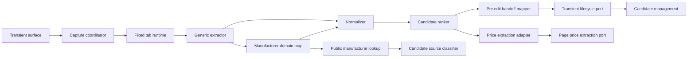
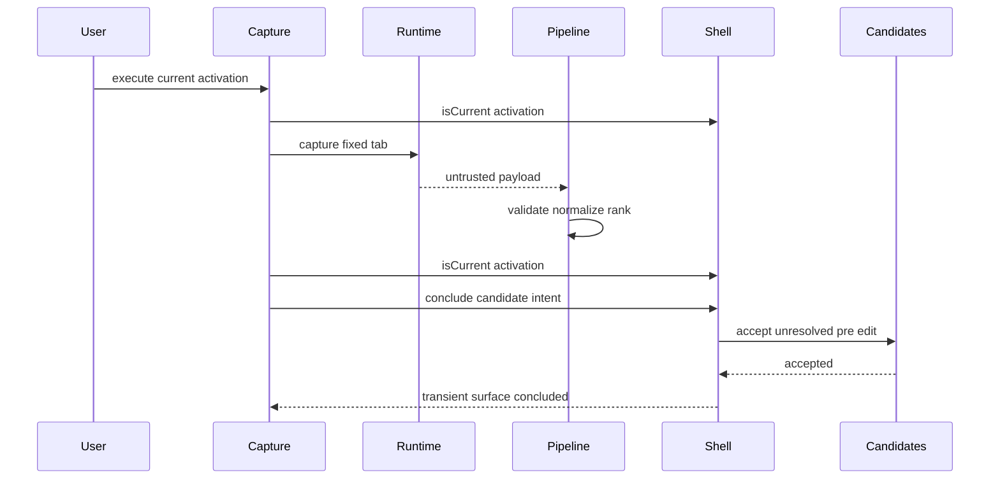
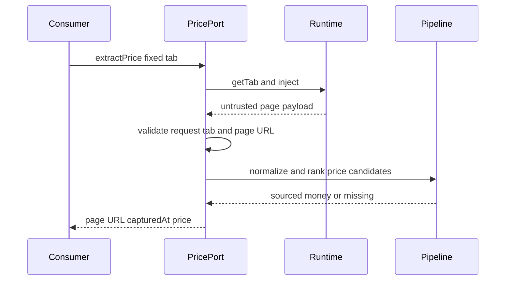

# 技術設計書

## Overview

商品ページ取り込みは、一過性surfaceで固定タブの抽出だけを実行し、成功結果を候補管理の非一過性pre-editへ即時handoffする。確認、補正、project解決、保存はcandidate-managementへ委譲し、対象タブの権限寿命と編集寿命を分離する。

抽出pipelineはJSON-LD、meta、見出し・パンくず、表・定義リストの汎用候補を収集し、メーカーが欠損する場合だけローカルなメーカーdomain mapを最下位候補として追加する。固定tabから同じpipelineで価格だけを返す`PagePriceExtractionPort`は維持し、`source-price-refresh`の公開consumer契約を変更しない。

### Goals

- 現行activationの固定タブだけを一回抽出し、stale結果をhandoffしない
- 取得候補、正規化、順位、provenanceのcanonical ownerをproduct-captureへ維持する
- メーカー公式domainによる欠損メーカー名の補完を最下位優先度で追加する
- 抽出結果をproject未解決pre-editとしてcandidate-managementへ即時handoffする
- `PagePriceExtractionPort`のshapeと同一pipeline利用を維持する

### Non-Goals

- shell/runtimeの一過性surface、activation store、tab監視の再実装
- candidate-managementのpre-edit検証、project作成、確認、補正、保存規則
- サイト固有DOM selector、domain mapを根拠とした追加取得権限またはサイト利用許可
- 保存済みsourceのURL照合、価格更新、source種別の永続化
- 生HTML、画像、抽出セッションの永続化

## Boundary Commitments

### This Spec Owns

- 汎用DOM候補収集、payload検証、正規化、固定順位、取得根拠
- `ExtractionSource: "domain-map"`と、`manufacturer-domain-map.ts`に隔離したメーカー公式eTLD+1 metadata
- `candidate-source-bookmarks`がsource種別判定に利用する、read-onlyな`ProductCapturePublicApi.manufacturerDomains`照合seam
- 固定tab抽出結果からproject未解決pre-editを組み立てるproduct-capture側の写像
- 現行activation照合、stale結果破棄、typed intent生成までのcapture integration
- `ProductCapturePublicApi.pagePriceExtraction`と価格観測の公開型・実装

### Out of Boundary

- 一過性surfaceの起動配送、固定tabの権限寿命、`dismiss` / `conclude`の実装
- candidate-managementによるpre-edit受理、project解決、編集state、保存時validation、永続化
- domain entryの存在を利用したサイト固有DOM抽出、権限拡張、利用許可判定
- candidate sourceの種別判定、複数source化、価格反映
- メーカー公式であることを推測したentry、販売代理店や地域domainの自動同一視

### Allowed Dependencies

- application-shell公開の`ActivationId`、`TargetTabId`、`TransientSurfaceLifecyclePort`、`FeatureActivationIntent`
- candidate-management公開の`UnresolvedCandidateDraft`とtyped intent factory
- candidate-managementのsource classifierはproduct-capture公開の`ManufacturerDomainLookup`だけを利用し、domain map内部をdeep importしない
- local data foundation公開のcanonical `Result<T, E>`、domain型、`SourcedValue<MoneyValue>`、`UtcTimestamp`
- Chrome 116以降の既存`activeTab` / `scripting`到達、React 19、TypeScript 7 strict、標準DOM / URL API
- `web-content-acquisition.md`で許容されたローカルmetadata。新規runtime依存は追加しない

### Revalidation Triggers

- `TransientSurfaceLifecyclePort.conclude`、activation世代、固定tabまたは失効条件が変わる
- `UnresolvedCandidateDraft`、candidate editor intent、pre-edit受理条件が変わる
- 抽出source priority、`ExtractionSource`、manufacturer provenanceが変わる
- domain entryの所有者、根拠、対象eTLD+1または取得ポリシーが変わる
- `PagePriceObservation`、`PagePriceExtractionError`、固定tab/page-derived URL照合が変わる
- `candidate-source-bookmarks`が参照するdomain map契約、または`source-price-refresh`が参照するprice portが変わる
- **Cross-spec remediation**: `candidate-source-bookmarks/design.md`のExisting Architecture Analysisおよび`CaptureSourceMapper`依存が旧`CaptureCandidatePort`を参照している。一方、`product-capture-transient-migration/design.md`は同contractをcandidate-management公開APIから廃止し、`UnresolvedCandidateDraft` + typed intent factory + `TransientSurfaceLifecyclePort.conclude`へ置換すると確定している。前者を実装前に再検証し、旧contractをsource初期化の前提にしない。

## Architecture

### Existing Architecture Analysis

- v0.1.0のextractor、normalizer、ranker、runtime payload validationは実装済みで、ページ入力を`unknown`から検証する。
- `product-capture-transient-migration`はcapture stateを`idle | extracting | failed`へ縮小し、固定tabとgeneration gate、candidate-managementへの原子的handoffを確定している。
- `source-price-refresh`は`ProductCapturePublicApi.pagePriceExtraction`からpage-derived URL、取得時点、任意の価格provenanceを受け取る。
- domain mapは新しいDOM collectorではなく、汎用抽出後にメーカー欠損だけを補うローカル候補供給源として追加できる。

### Architecture Pattern & Boundary Map



- **Pattern**: page collector → boundary validation → normalization → deterministic rank → purpose-specific projection。
- **Dependency direction**: `Foundation/Shell/Candidate public contracts → Capture contracts/config → Extractor/Normalizer/Ranker → Coordinator/Handoff/PriceAdapter → Registration/View`。右側から左側へのimportを禁止する。
- **Boundary rule**: candidate-managementへ渡すのは検証済みpre-edit intentだけであり、captureはrepository、project query、save serviceへ依存しない。
- **Domain map rule**: map entryは候補生成だけに使い、DOM走査の有効化、権限判断、source種別の確定に使わない。

### Technology Stack

| Layer | Choice / Version | Role |
|---|---|---|
| Language | TypeScript 7 strict | contract、validator、rank、state。`any`禁止 |
| UI | React 19 / React DOM | 一過性実行・失敗表示のみ |
| Runtime | Chrome MV3 116+ | 固定tab注入。既存4 permissionを維持 |
| Platform | 標準DOM / URL API | 汎用抽出、hostname正規化 |
| Test | Node test runner、jsdom、testing-library、Playwright | unit、contract、DOM、production E2E |

## File Structure Plan

```text
src/features/product-capture/
  contracts.ts                       # ExtractionSourceを含む抽出・payload・session型
  manufacturer-domain-map.ts         # new; 公式eTLD+1 metadata、照合、domain-map候補生成
  extractor.ts                       # 汎用DOM候補収集とdomain-map候補の合成
  normalizer.ts                      # 文字列、URL、価格、属性の境界検証
  ranker.ts                          # domain-mapを最下位とする決定的順位
  chrome-runtime-port.ts             # activation固定tabの解決・注入
  coordinator.ts                     # request、tab、page URL、generation結果の調停
  transient-activation.ts            # transient activation payload validation
  draft-mapper.ts                    # 抽出結果からproject未解決pre-editへの写像
  editor-handoff.ts                  # typed candidate intent生成とconclude再試行入力
  page-price-extraction.ts           # fixed-tab価格観測port実装
  state.ts                           # idle、extracting、failedのみ
  view.tsx                           # 実行、実行中、失敗、handoff再試行のみ
  react-root.tsx                     # FeatureMountContextとReact root lifecycle
  registration.ts                   # transient contributionとpublic APIの組立
  feature-contribution.ts            # shell公開portだけを受けるcomposition factory
  public.ts                          # ProductCapturePublicApi、manufacturer lookup、price observation公開入口
  styles.css                         # 一過性表示状態
  editor-navigation.ts               # remove; concludeを迂回する旧直接navigation
  submit-draft.ts                    # remove; candidate保存は境界外
  worker-registration.ts             # remove; gesture配送はshell transient基盤が所有
tests/features/product-capture/
  manufacturer-domain-map.test.ts    # new; eTLD+1、優先度、誤一致、未知domain
  extractor.test.ts
  normalizer.test.ts
  ranker.test.ts
  coordinator.test.ts
  draft-mapper.test.ts
  editor-handoff.test.ts
  page-price-extraction.test.ts
  state.test.ts
  view.test.tsx
  integration.test.ts
tests/contracts/
  product-capture-price-extraction.test.ts
  product-capture-candidate-handoff.test.ts
  product-capture-cross-spec-consumers.test.ts
tests/fixtures/product-capture/             # synthetic data only
```

application shellのruntime入口、candidate-management内部、manifest permission集合、source-price-refreshは本specの実装で直接編集しない。product-captureの一過性composition変更は`product-capture-transient-migration`の所有タスクと同じファイルへ着地するため、実装時は同specを先行させて統合する。

## System Flows

### 抽出と即時handoff



抽出前とhandoff直前に同じ`ActivationId`を照合する。失効した結果はcandidate intentへ変換しない。handoff失敗時だけ検証済みintentを現行activationのcapture stateへ保持し、同じ世代で`conclude`を再試行する。新世代受理、surface終了、unmountで破棄する。

固定tab runtimeが`permission-lost`または`tab-changed`を直接返した場合、capture stateは現行activationを`TransientSurfaceLifecyclePort.dismiss(..., "capture-invalidated")`へ渡す。shell controllerが一過性面を終了して常設面へ復帰し、application compositionが`capture-invalidated`を既存のactivation失効noticeへ投影する。dismissの失敗・例外はcapture側で成功扱いせず安全な失敗状態へ戻し、遅延結果はactivation世代gateで後発起動から隔離する。`restricted-page`は対象外案内を一過性面に維持する。

### Domain map補完

1. URL境界でHTTP/HTTPSのpage-derived URLを検証し、ASCII lowercase hostnameを得る。
2. `manufacturer-domain-map.ts`のentryが持つ正規化済みeTLD+1に対して、hostnameが完全一致または`.`境界付きsubdomain一致する場合だけ照合する。
3. mapにないpublic suffixを推測してeTLD+1を生成しない。entry側の明示eTLD+1を照合境界とする。
4. 汎用collectorにmanufacturer候補がない場合だけ`source: "domain-map"`の候補を追加する。
5. rankerでも`domain-map`を全sourceの後に置き、将来のcollector合成順変更でも上書きを防ぐ。

### 公開portからの価格観測



domain-mapはmanufacturerだけを生成するため価格順位へ影響しない。price portは通常取り込みと同じpayload decoder、normalizer、rankerを使い、価格以外の抽出値を公開しない。

## Requirements Traceability

| Requirement | Summary | Components | Interfaces | Flows |
|---|---|---|---|---|
| 1.1, 1.2, 1.3, 1.4, 1.5 | 明示操作、固定tab、失効 | TransientActivation、Coordinator、Runtime、State | lifecycle port、CaptureRuntimePort | 抽出handoff |
| 2.1, 2.2, 2.3, 2.4, 2.5, 2.6 | 汎用抽出とprovenance | Extractor、Normalizer、Ranker | ExtractionCandidate | 全抽出 |
| 2.7, 2.8, 2.9, 2.10 | domain map補完 | ManufacturerDomainMap、Ranker | DomainMapEntry、ExtractionSource | domain map補完 |
| 3.1, 3.2, 3.3, 3.4, 3.5, 3.6 | 未信頼入力 | Normalizer、Coordinator、DraftMapper | RawCapturePayload、FieldRejection | 抽出handoff |
| 4.1, 4.2, 4.3, 4.4, 4.5, 4.6, 4.7 | 即時handoff | DraftMapper、EditorHandoff、State、View | unresolved pre-edit、lifecycle port | 抽出handoff |
| 5.1, 5.2, 5.3, 5.4, 5.5, 5.6 | 保存責務分離 | DraftMapper、EditorHandoff、Registration | candidate intent factory | 抽出handoff |
| 6.1, 6.2, 6.3, 6.4, 6.5 | 世代単位の回復 | Coordinator、State、View | CaptureError、ActivationId | 抽出handoff |
| 7.1, 7.2, 7.3, 7.4 | synthetic検証 | 全component | contract fixtures | 全フロー |

## Components and Interfaces

| Component | Layer | Intent | Requirements | Key Dependencies | Contract |
|---|---|---|---|---|---|
| GenericExtractor | Page | 汎用候補を収集 | 2.1–2.6, 7.1, 7.4 | DOM P0 | Service |
| ManufacturerDomainMap | Config / pure rule | 公式eTLD+1からメーカー欠損候補を供給 | 2.7–2.10, 7.3 | URL P0 | Service |
| CaptureNormalizer | Feature | 未信頼値を正規化 | 3.1–3.6, 7.1 | contracts P0 | Service |
| CandidateRanker | Feature | source優先度で一件を選択 | 2.2, 2.4, 2.8, 7.1, 7.3 | normalizer P0 | Service |
| CaptureCoordinator | Runtime | 固定tab、request、URL、失敗を調停 | 1.1–1.5, 6.1, 6.2, 6.4 | runtime、lifecycle P0 | Service |
| CaptureDraftMapper | Integration | 抽出結果をproject未解決pre-editへ写像 | 3.5, 3.6, 4.1, 4.4, 4.6, 5.1, 5.4 | candidate public P0 | Service |
| CandidateEditorHandoff | Integration | typed intentを原子的にhandoff | 4.1–4.5, 5.1–5.6, 6.3 | lifecycle、candidate intent P0 | Service |
| PagePriceExtractionAdapter | Public integration | 同じpipelineで価格だけを観測 | 1.1, 1.4, 2.1–2.4, 3.1–3.5, 6.1, 6.2, 7.1–7.4 | runtime、pipeline P0 | Service |
| CaptureState | UI state | 現行activationの実行・失敗だけを保持 | 1.4, 4.2, 4.3, 4.5, 4.7, 6.1–6.4 | coordinator、handoff P0 | State |
| CaptureView | UI | 実行と回復操作だけを表示 | 1.4, 1.5, 4.5, 4.7, 6.2–6.4 | state P0 | State |
| CaptureFeatureRegistration | Composition | transient contributionとpublic APIを組立 | 1.1–1.4, 4.2, 5.5, 5.6 | shell public P0 | Service |

### Extraction contracts

```typescript
export type ExtractionSource =
  | "json-ld"
  | "meta"
  | "heading"
  | "breadcrumb"
  | "table"
  | "definition-list"
  | "domain-map";

export interface ExtractionCandidate {
  readonly field: CaptureField;
  readonly rawValue: string;
  readonly source: ExtractionSource;
  readonly sourceLabel: string;
  readonly documentOrder: number;
}
```

coordinatorのruntime payload validator、viewのmessage-key mapping、normalizer、rankerを同じclosed unionへ追従させる。`domain-map`候補は`field: "manufacturer"`だけを許可し、page DOM由来と偽装しない。

### ManufacturerDomainMap

```typescript
interface ManufacturerDomainEntry {
  readonly registrableDomain: string;
  readonly manufacturer: string;
  readonly evidenceUrl: string;
  readonly reviewedAt: string;
  readonly owner: string;
}

interface ManufacturerDomainMatch {
  readonly manufacturer: string;
  readonly sourceLabel: string;
}

interface ManufacturerDomainMap {
  findManufacturer(pageUrl: string): Result<ManufacturerDomainMatch | undefined, DomainMapError>;
}
```

entryは正規化済みASCII eTLD+1をキーとし、重複domain、空manufacturer、不正URL、owner/evidence欠落をbuild/testで拒否する。照合はhostnameの完全一致またはdot-boundary subdomain一致だけを許可し、`notexample.test`のようなsuffix誤一致を拒否する。未知domainは成功・候補なしとして扱う。mapは照合結果だけを返し、`ExtractionCandidate`への投影はmanufacturer欠損を確認したextractorが所有する。

domain mapはネットワークへ到達せず、entryの存在は権限、サイト所有、利用許可、source kindを意味しない。entry追加・変更は`web-content-acquisition.md`の根拠、owner、再審査triggerへ従う。

### CaptureCoordinator and handoff

```typescript
interface CaptureCoordinator {
  captureTab(tabId: TargetTabId): Promise<Result<CaptureResult, CaptureError>>;
}

interface CandidateEditorHandoff {
  conclude(
    activationId: ActivationId,
    result: CaptureResult,
  ): Promise<Result<void, CaptureHandoffError>>;
}
```

coordinatorはactive tabを再検索せず固定`TargetTabId`だけを解決する。page payloadの`pageUrl`と注入前target URLが一致しない場合は`tab-changed`でfail closedにする。handoff mapperはproject IDを作らず、空の商品名もpre-editとして保持する。candidate側の保存可能性は判定しない。

Chrome runtime adapterはcontent script注入と抽出結果読取りの各処理に有限のtimeoutを設ける。ページ側の処理が応答しない場合は`injection-failed`へ閉じ、coordinator、state、viewの既存失敗経路から永続状態を変更せず再試行可能な案内を表示する。

`CandidateEditorHandoff`はcandidate-management公開factoryでintentを作り、`TransientSurfaceLifecyclePort.conclude`へ渡す。直接navigation callback、`CaptureCandidatePort`、project query、save serviceを利用しない。

`TransientSurfaceLifecyclePort.dismiss`はshell所有の終了処理を呼ぶtyped seamであり、product-captureはhost復帰やnotice描画を実装しない。capture runtimeが直接検出した権限・tab失効にだけ`capture-invalidated`を使用し、通常のcandidate handoffは引き続き`conclude`を使用する。

### PagePriceExtractionPort

```typescript
export interface PagePriceObservation {
  readonly pageUrl: string;
  readonly capturedAt: UtcTimestamp;
  readonly price?: SourcedValue<MoneyValue>;
}

export type PagePriceExtractionError =
  | { readonly kind: "tab-unavailable" }
  | { readonly kind: "permission-lost" }
  | { readonly kind: "restricted-page" }
  | { readonly kind: "tab-changed" }
  | { readonly kind: "injection-failed" }
  | { readonly kind: "invalid-payload" };

export interface PagePriceExtractionPort {
  extractPrice(
    tabId: TargetTabId,
  ): Promise<Result<PagePriceObservation, PagePriceExtractionError>>;
}

export interface ProductCapturePublicApi {
  readonly manufacturerDomains: ManufacturerDomainLookup;
  readonly pagePriceExtraction: PagePriceExtractionPort;
}
```

このshapeは既存の`source-price-refresh` consumer契約として維持する。有効価格がない場合は観測成功かつ`price`欠損とし、更新可否はconsumerへ委ねる。`pageUrl`はpage-derived payloadから返し、target URLで代用しない。

`manufacturerDomains`は`ManufacturerDomainMap`の`findManufacturer`だけを公開するread-only lookupである。`candidate-source-bookmarks`のsource classifierはこの公開seamだけを利用し、map entry、eTLD+1照合実装、抽出componentをdeep importしない。このlookupはsource分類の補助であり、DOM抽出、権限判断、サイト利用許可を有効化しない。

## Data Models

- `RawCapturePayload`: 注入側から返る未信頼値。request、tab、page URL、candidate shapeを境界検証する。
- `NormalizedField`: field、normalizedValue、rawValue、source、sourceLabel、validationを持つ。
- `CaptureResult`: 固定tab、page URL、capturedAt、採用値、欠損、棄却理由を持つ一時値。
- `UnresolvedCandidateDraft`: project未解決のcandidate-management公開pre-edit契約。captureは保存可能なcanonical draftへ昇格しない。
- `PagePriceObservation`: page-derived URL、取得時点、任意価格だけを持つread-only一時値。

永続modelは本specで追加しない。

## Error Handling

- runtime error: `tab-unavailable | permission-lost | restricted-page | tab-changed | injection-failed | invalid-payload`
- extraction result: 候補欠損は正常な部分結果。domain不一致もerrorにしない。
- handoff error: lifecycleの`stale | target-unavailable | activation-rejected | not-started`相当を閉じたunionへ写像し、現行世代でだけintentを保持する。
- fatal capture lifecycle: `permission-lost | tab-changed`は`capture-invalidated`としてshellへdismissし、常設面復帰と新しい明示操作が必要なnoticeをshellに委ねる。dismiss失敗・例外は非回復実行失敗として保持し、後発activationへ遅延結果を適用しない。
- logging: error kindまたは安定コードだけを記録し、page URL、hostname、商品値、raw price、HTML、例外objectを出さない。

権限・世代失効は一過性面の終了へ結び付け、同じ面に失敗する実行操作を残さない。新しいgestureは常に新しいactivationとして以前の失敗とintentを置換する。

## Testing Strategy

### Unit

- JSON-LD、meta、見出し、パンくず、表、定義リストの候補収集と有界走査
- domain entryの完全一致、subdomain一致、dot-boundary誤一致、未知domain、不正entry
- manufacturer既存時の非上書きと`domain-map`最下位順位
- 文字列、URL、価格、カテゴリ参考値の正規化
- stateの`idle | extracting | failed`、新世代reset、stale completion無視

### Contract / Integration

- 固定tab、request ID、page-derived URL、activation世代を接続し、stale結果をhandoffしない
- runtimeが直接返す`permission-lost | tab-changed`で`capture-invalidated` dismiss、常設面復帰、activation失効noticeを検証し、dismiss失敗・例外・遅延結果を世代内へ閉じる
- 抽出成功、空名manual pre-edit、handoff失敗・再試行、project不存在をcandidate public test doubleで検証する
- `PagePriceExtractionPort`の6 failure、価格欠損、元表記、同一pipeline順位をconsumer fixtureで検証する
- `public.ts`だけをimportするsource-price-refresh相当consumerがstrict型検査を通る
- 旧`CaptureCandidatePort`、project query、直接navigation、save serviceへの依存がproduct-captureから消える

### DOM / E2E

- 一過性面に実行、実行中、失敗、handoff再試行だけがあり、確認form、project selector、save操作がない
- icon起動からcandidate editor到達、tab失効によるsurface終了、新gestureによる新世代起動
- ページ文字列が通常のJSX childとして描画され、HTML注入されない

### Assets and gates

- synthetic HTML、domain、商品値だけを使用する
- `validate:boundaries`でdeep importと旧公開save契約を拒否する
- `validate:fixtures`で実サイト資産を拒否する
- `validate:artifacts`でpermission集合、CSP、remote code、unsafe HTMLを検証する

## Security Considerations

取得は現行gestureの固定tabだけを対象にし、恒久的host permissionを追加しない。ページ、URL、runtime payload、domain map inputは未信頼として境界検証する。domain mapはローカルmetadataであり、サイト固有DOM取得、ログイン領域、アクセス制限回避を有効化しない。生HTML、画像、完全URL、抽出値を保存・ログ出力せず、テストは架空データだけを使用する。

## Performance & Scalability

DOM走査、JSON-LD深さ、候補数、文字列長は既存上限を維持する。domain照合は小さな静的entry集合に対する正規化済みhostname比較だけで、ネットワークや追加DOM走査を行わない。価格観測は通常取り込みと同じ一回のpayload収集を再利用し、二重注入やprice専用DOM collectorを追加しない。
