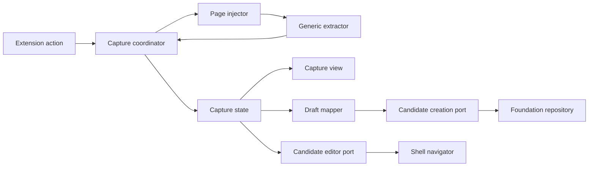
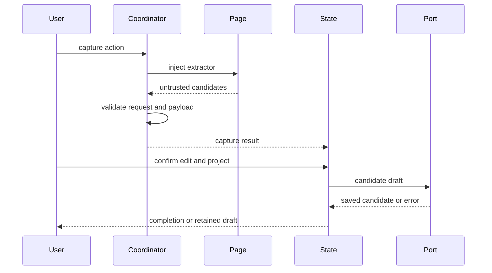

# Design Document

## Overview

本機能は、閲覧中のPCパーツ商品ページから汎用的に情報を抽出し、利用者が根拠を確認・補正して既存プロジェクトへ候補登録する体験を提供する。actionの明示操作を入口に、注入された抽出器がDOM内で情報を収集し、service workerの調停を経てサイドパネルへ一時ドラフトを渡す。

保存は`project-candidate-management`の`CaptureCandidatePort`へ委譲する。取り込み境界は抽出候補、取得根拠、正規化、確認状態だけを所有し、`local-data-foundation`の永続化や登録後の候補管理を重複実装しない。

### Goals
- 一時権限とユーザージェスチャーに限定した現在ページ取り込みを提供する
- 決定的な汎用抽出と取得根拠を備えた安全な確認ドラフトを生成する
- 欠損や未分類を許容しつつ既存の候補作成契約へ一度だけ保存する

### Non-Goals
- 常時監視、一括取得、サーバー・AI・画像・価格履歴
- サイト別正式対応または取得率保証
- 登録後候補の管理、現在構成、互換性判定

## Boundary Commitments

### This Spec Owns
- action起点の現在タブ取得要求と注入可否の判定
- ページDOMからの汎用候補収集、順位付け、正規化、取得根拠
- 取り込みセッションの簡易確認、補正、プロジェクト選択、失敗回復UI
- 確認済みドラフトから`CaptureCandidatePort`入力への変換
- 候補管理の型付きprefill作成と`ShellNavigator`を介した詳細編集要求

### Out of Boundary
- `CandidatePart`、保存スキーマ、Repository、容量・移行処理
- プロジェクト作成および登録後候補の一覧・編集・削除
- サイト別アダプター実装、互換性属性の意味判定、バックアップ
- 生HTML、画像、未保存セッションの永続化
- 候補編集activation payloadの最終検証、候補管理画面のmount/state適用

### Allowed Dependencies
- Chrome 116以降の`action`、`activeTab`、`scripting`、`sidePanel`
- FoundationのDomainModel、Resultおよび信頼境界
- Candidate managementの`CaptureCandidatePort`、`CandidateDraft`、`CandidateEditorPrefill`、`openCandidateEditor`
- TypeScript strict、React 19系/React DOM、既存test基盤。UI以外のruntime依存は追加しない
- application shellのfeature registration、worker registration、`FeatureMountContext`、`ShellNavigator`、operation policy、contract test kit

### Revalidation Triggers
- `CandidateDraft`、`CaptureCandidatePort`、カテゴリ、正規化属性、取得元契約の変更
- `CandidateEditorPrefill`、候補管理activation target、shell navigation failureの変更
- action・side panel入口、権限、メッセージ送信者検証、依存方向の変更
- 抽出優先順位、URL・価格正規化、未分類保存規則の変更
- サイト別アダプター追加または抽出セッション永続化への変更

## Architecture

### Existing Architecture Analysis

本仕様はFoundationのMV3骨格とCandidate managementのサイドパネル・候補作成契約を拡張する。保存済みモデルは増やさず、ページコンテキストから返る値を未信頼入力としてruntime境界で再検証する。既存の`Result`判別共用体とframework非依存stateを維持し、表示adapterだけをReact componentとする。

### Architecture Pattern & Boundary Map



- **Selected pattern**: 注入抽出パイプラインとfeature state。DOM所有、調停、表示、保存変換を分離する。
- **Dependency direction**: `Shell/Foundation/Candidate contracts → Capture contracts → Extractor/Normalizer/Mapper → Coordinator/State → View/Registration`。保存は`CaptureCandidatePort`、詳細編集は`openCandidateEditor`だけを介する。
- **Existing patterns preserved**: `Result`、判別共用体、信頼済み保存境界、DOM text描画、feature service/state構成。
- **New components rationale**: `GenericExtractor`はページDOM所有、`CaptureCoordinator`はChrome API所有、`CaptureState`は一時セッション所有、`CaptureDraftMapper`は上流契約変換だけを所有する。

### Technology Stack

| Layer | Choice / Version | Role in Feature | Notes |
|---|---|---|---|
| Language | TypeScript 7.x strict | 抽出・メッセージ・状態契約 | `any`禁止、未信頼値は`unknown`から検証 |
| UI | React 19系 / React DOM / CSS | サイドパネル確認・編集 | ページ値は通常のJSX childとして表示 |
| Runtime | Chrome MV3 116+ | action、注入、side panel | `activeTab`、`scripting`、同梱コードのみ |
| Integration | CaptureCandidatePort | 候補作成 | 保存実装を再利用 |
| Test | Vitest 3.x / synthetic DOM | unit・runtime・UI統合 | 架空データのみ |

## File Structure Plan

```text
manifest.json                                  # action、activeTab、scripting権限を追加
src/features/product-capture/contracts.ts      # 未信頼payload、候補、根拠、結果、エラー型
src/features/product-capture/public.ts         # 取り込み公開契約の唯一の公開入口
src/features/product-capture/registration.ts   # side panel feature registrationと依存組立
src/features/product-capture/worker-registration.ts # action handlerをshellへ提供するworker registration port
src/features/product-capture/extractor.ts      # JSON-LD、meta、文書構造の候補収集
src/features/product-capture/normalizer.ts     # 文字列、URL、価格、属性の検証・正規化
src/features/product-capture/ranker.ts         # 固定優先順位と候補選択
src/features/product-capture/coordinator.ts    # tab検証、注入、request照合、エラー正規化
src/features/product-capture/draft-mapper.ts   # 確認セッションからCandidateDraftへの変換
src/features/product-capture/editor-navigation.ts # CandidateEditorPrefill作成と候補管理公開port呼出
src/features/product-capture/state.ts          # 一時ドラフト、編集、project選択、保存状態
src/features/product-capture/view.tsx           # 簡易確認、根拠、失敗、詳細編集のReact component
src/features/product-capture/react-root.tsx     # FeatureMountContextとReact rootの接続・cleanup
src/features/product-capture/styles.css        # 取り込み状態の表示規則
tests/features/product-capture/extractor.test.ts
tests/features/product-capture/normalizer.test.ts
tests/features/product-capture/ranker.test.ts
tests/features/product-capture/coordinator.test.ts
tests/features/product-capture/state.test.ts
tests/features/product-capture/view.test.ts
tests/features/product-capture/integration.test.ts
tests/features/product-capture/editor-navigation.test.ts
tests/fixtures/product-capture/*.html           # 架空ページfixtureのみ
```

### Modified Files
- `manifest.json` — action、`activeTab`、`scripting`を最小権限で宣言する。
- 共有service worker、side panel runtime、root `src/index.ts`は変更しない。application shellが`registration.ts`、`worker-registration.ts`、`public.ts`をcompositionする。

## System Flows



`requestId`、`tabId`、開始時URLを照合し、遷移後の応答を破棄する。保存中は状態遷移を`submitting`へ固定し、同一ドラフトの二重送信を抑止する。

## Requirements Traceability

| Requirement | Summary | Components | Interfaces | Flows |
|---|---|---|---|---|
| 1.1, 1.2, 1.3, 1.4, 1.5 | 明示操作と一時権限 | Coordinator、Runtime | CaptureRequest | 取り込み |
| 2.1, 2.2, 2.3, 2.4, 2.5, 2.6 | 汎用抽出と根拠 | Extractor、Ranker | ExtractionCandidate | 取り込み |
| 3.1, 3.2, 3.3, 3.4, 3.5, 3.6 | 正規化・未信頼入力 | Normalizer、Coordinator | RawCapturePayload、NormalizedField | 取り込み |
| 4.1, 4.2, 4.3, 4.4, 4.5, 4.6 | 確認・補正 | CaptureState、CaptureView、CandidateEditorNavigation | CaptureSessionState、CandidateEditorPrefill | 確認・typed activation |
| 5.1, 5.2, 5.3, 5.4, 5.5, 5.6, 5.7 | project選択・保存 | State、DraftMapper | CaptureCandidatePort | 保存 |
| 6.1, 6.2, 6.3, 6.4, 6.5 | 失敗・再試行 | Coordinator、State、View | CaptureError | 取り込み・保存 |
| 7.1, 7.2, 7.3 | 架空資産による検証 | 全コンポーネント | Test fixtures | 全フロー |

## Components and Interfaces

| Component | Domain/Layer | Intent | Req Coverage | Key Dependencies | Contracts |
|---|---|---|---|---|---|
| GenericExtractor | Page | 根拠付き候補を収集 | 2.1–2.6, 7.1, 7.3 | DOM P0 | Service |
| CaptureNormalizer | Feature | 未信頼値を正規化 | 3.1–3.6, 7.1 | Contracts P0 | Service |
| CandidateRanker | Feature | 候補を決定的に選択 | 2.2–2.4, 7.1 | Normalizer P0 | Service |
| CaptureCoordinator | Runtime | action・注入・競合・失敗を調停 | 1.1–1.5, 6.1–6.4, 7.2 | Chrome P0 | Service |
| CaptureDraftMapper | Integration | 確認値を上流draftへ変換 | 3.5–3.6, 5.3–5.4 | Candidate contracts P0 | Service |
| CandidateEditorNavigation | Integration | 確認sessionを型付きprefillとして候補管理へ遷移 | 4.2, 4.6 | Candidate public P0、ShellNavigator P0 | Service |
| CaptureState | UI state | セッションと保存状態を管理 | 4.1–5.7, 6.3–6.4 | Port P0 | State |
| CaptureView | UI | 確認、根拠、編集、案内を表示 | 4.1–4.6, 5.1–5.6, 6.1–6.5 | State P0 | State |
| CaptureFeatureRegistration | UI/runtime adapter | view、public API、action handlerをshell登録契約へ接続 | 1.1–1.5, 4.1–6.5 | shell registration P0、CaptureCoordinator P0 | Service |

### Page Extraction Layer

#### GenericExtractor

```typescript
type ExtractionSource = "json-ld" | "meta" | "heading" | "breadcrumb" | "table" | "definition-list";

interface ExtractionCandidate {
  readonly field: CaptureField;
  readonly rawValue: string;
  readonly source: ExtractionSource;
  readonly sourceLabel: string;
}

interface GenericExtractor {
  extract(document: Document, pageUrl: string): readonly ExtractionCandidate[];
}
```

走査数、文字列長、JSON-LD深さを有界化する。DOMノードやHTMLを境界外へ返さず、候補文字列と根拠だけを返す。未知または不正な構造は無視し、部分結果を維持する。

### Feature Layer

#### CaptureNormalizer and CandidateRanker

```typescript
interface CaptureNormalizer {
  normalize(candidate: ExtractionCandidate): Result<NormalizedField, FieldRejection>;
}

interface CandidateRanker {
  select(candidates: readonly NormalizedField[]): CaptureDraftFields;
}
```

rankerは`json-ld → meta → heading/breadcrumb → table/definition-list`の優先順位を固定する。同順位は文書順で決定し、元表記を失わない。価格は通貨表記と数値を分離可能な時だけ確認候補にし、URLはHTTP/HTTPSかつ解決可能なものへ限定する。

#### CaptureDraftMapper

```typescript
interface CaptureDraftMapper {
  toCandidateDraft(session: ConfirmedCaptureSession): Result<CandidateDraft, CaptureValidationError>;
}
```

商品名とprojectIdを必須とし、カテゴリ未確認は`unclassified`へ変換する。`confirmed`、`sourceSnapshot`、`sourceInfo`を上流契約どおり分離し、ページ由来の余剰フィールドを渡さない。

#### CandidateEditorNavigation

```typescript
interface CandidateEditorNavigation {
  open(session: CaptureSession): Promise<Result<void, CaptureNavigationError>>;
}
```

`open`は同じmapper規則で`CandidateDraft`を生成し、選択projectと組み合わせた`CandidateEditorPrefill`を候補管理の`openCandidateEditor`へ渡す。shell intentやfeature IDをcapture側で直接組み立てず、candidate managementの型付き公開portを利用する。失敗時はCaptureSession、修正値、project選択を保持する。

### Runtime and UI Layer

#### CaptureCoordinator

```typescript
interface CaptureCoordinator {
  captureCurrentTab(): Promise<Result<CaptureResult, CaptureError>>;
}
```

actionのユーザージェスチャー内でside panelを開き、対象tabIdとURLを確定して抽出関数を注入する。戻り値は`unknown`として実行時検証し、requestIdと現在タブを再照合する。権限失効、制限URL、タブ遷移、注入失敗、payload不正を判別共用体へ正規化する。

#### CaptureState

```typescript
type CaptureSessionState =
  | { readonly status: "idle" }
  | { readonly status: "extracting"; readonly requestId: string }
  | { readonly status: "review"; readonly session: CaptureSession }
  | { readonly status: "submitting"; readonly session: ConfirmedCaptureSession }
  | { readonly status: "saved"; readonly candidateId: CandidatePartId; readonly projectId: ProjectId }
  | { readonly status: "failed"; readonly recoverable: boolean; readonly draft?: CaptureSession; readonly error: CaptureError };
```

セッションはサイドパネルメモリだけに保持する。失敗時は利用可能なドラフトとproject選択を維持し、成功時だけsavedへ進む。詳細編集は候補管理の型付き公開portへ同じドラフトを渡し、shell navigation失敗でもsessionを破棄しない。

#### CaptureView

簡易項目、欠損、取得元、元表記、project選択、保存・再試行・詳細編集操作を描画する。文字列は`textContent`相当で扱い、URLも自動的に実行・遷移可能なHTMLとして挿入しない。

## Data Models

- `RawCapturePayload`: 注入側から返る未信頼の`unknown`。境界検証前はドメイン型として扱わない。
- `NormalizedField`: field、normalizedValue、rawValue、source、sourceLabel、validation状態を持つ。
- `CaptureSession`: requestId、tabId、pageUrl、capturedAt、採用値、棄却理由、ユーザー修正、project選択を持つ一時モデル。
- `CandidateDraft`: 上流契約を再利用し、永続モデルを本仕様で追加しない。

## Error Handling

`CaptureError`は`permission-lost`、`restricted-page`、`tab-changed`、`injection-failed`、`invalid-payload`、`no-candidate`、`validation`、`project-required`、`navigation`、`maintenance`、`storage`、`quota`、`unsupported-data`を区別する。取得エラーは永続化を呼ばず、保存・遷移エラーはドラフトを保持する。ログはエラー種別とrequestIdに限定し、商品値・完全URL・HTMLを記録しない。

## Testing Strategy

- **Unit**: 各抽出ソース、優先順位、同順位、欠損、文字列長、制御文字、URL、価格、未分類変換を検証する。
- **Runtime integration**: action以外で抽出しないこと、権限失効、制限URL、タブ遷移、payload不正をChrome API stubで検証する。
- **State/UI integration**: 簡易確認、根拠表示、修正分離、空商品名、projectなし、二重送信、保存失敗時保持、詳細編集遷移を検証する。
- **Contract integration**: 架空ページから`CandidateDraft`を生成し、保存では`CaptureCandidatePort`へ一度だけ渡す。詳細編集では`sourceInfo`と元表記を保持したprefillを`openCandidateEditor`へ一度だけ渡し、navigation失敗時のsession保持を検証する。
- **Assets**: fixtureは架空の最小HTMLだけを使用し、実サイトHTML・画像・取得データの混入を検査する。

## Security Considerations

`activeTab`による一時権限だけで抽出し、メッセージ送信者、tabId、URL、requestId、payload形状を検証する。ページ入力は通常のJSX childとして描画し、`dangerouslySetInnerHTML`、`innerHTML`、inline handlerを使用しない。保存APIをcontent scriptへ公開しない。Reactを含むUI codeと注入コードはビルド成果物へ同梱し、リモートコード、`eval`、インラインJavaScript、runtime JSX変換を使用しない。

## Performance & Scalability

DOM走査は対象セレクターと有界なJSON-LD再帰に限定し、候補数・文字列長へ上限を設ける。抽出はユーザー操作ごとに一度だけ実行し、生DOMをメッセージ化しない。上限到達時は部分結果を返し、UIを長時間待機させない。
