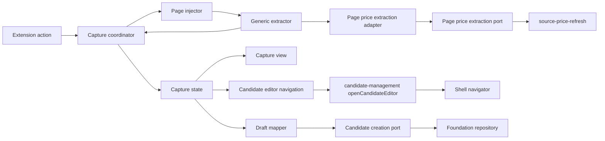
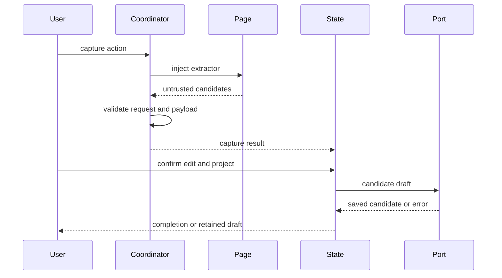
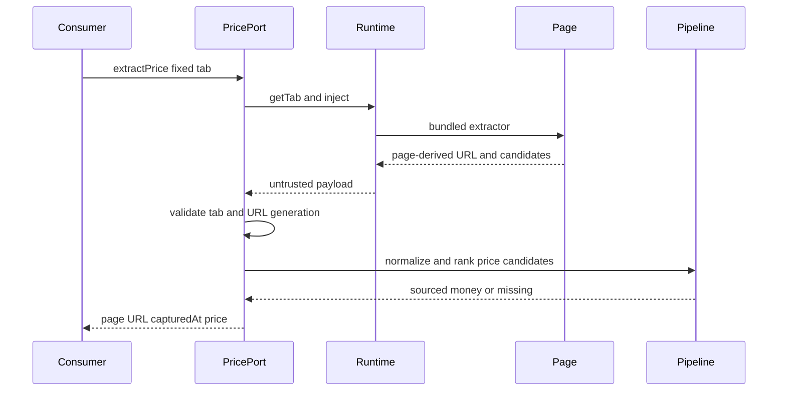

# Design Document

> **v0.3.0移行注記（未承認）**: 以下は実装済みv0.1.0の設計である。`product-capture-transient-migration` の承認後、capture所有の簡易確認・補正・project選択・保存状態は候補管理への即時typed handoffへ置換する。抽出器、ranker、normalizer、取得根拠は引き続き本specがcanonical ownerであり、移行specは再定義しない。`PagePriceExtractionPort`はこのcanonical抽出ownershipに属する加算的なread-only seamであり、移行specのUI・state・handoff責務を吸収しない。

## Overview

本機能は、閲覧中のPCパーツ商品ページから汎用的に情報を抽出し、利用者が根拠を確認・補正して既存プロジェクトへ候補登録する体験を提供する。actionの明示操作を入口に、注入された抽出器がDOM内で情報を収集し、service workerの調停を経てサイドパネルへ一時ドラフトを渡す。

保存は`project-candidate-management`の`CaptureCandidatePort`へ委譲する。取り込み境界は抽出候補、取得根拠、正規化、確認状態に加え、固定tabから同じ規則で価格だけを観測する公開`PagePriceExtractionPort`を所有し、`local-data-foundation`の永続化や登録後の候補管理を重複実装しない。

### Goals
- 一時権限とユーザージェスチャーに限定した現在ページ取り込みを提供する
- 決定的な汎用抽出と取得根拠を備えた安全な確認ドラフトを生成する
- 欠損や未分類を許容しつつ既存の候補作成契約へ一度だけ保存する
- 下流consumerがdeep importや抽出規則の複製なしでpage-derived URL、取得時点、根拠付き価格を取得できるようにする

### Non-Goals
- 常時監視、一括取得、サーバー・AI・画像・価格履歴
- サイト別正式対応または取得率保証
- 登録後候補の管理、現在構成、互換性判定
- 保存済みsourceのURL照合、価格更新、取得履歴、source種別判定

## Boundary Commitments

### This Spec Owns
- action起点の現在タブ取得要求と注入可否の判定
- ページDOMからの汎用候補収集、順位付け、正規化、取得根拠
- 固定tabのpage-derived URL、取得時点、同じ順位・正規化規則による価格だけを返す`PagePriceExtractionPort`
- 取り込みセッションの簡易確認、補正、プロジェクト選択、失敗回復UI
- 確認済みドラフトから`CaptureCandidatePort`入力への変換
- 候補管理の型付きprefill作成と`ShellNavigator`を介した詳細編集要求

### Out of Boundary
- `CandidatePart`、保存スキーマ、Repository、容量・移行処理
- プロジェクト作成および登録後候補の一覧・編集・削除
- サイト別アダプター実装、互換性属性の意味判定、バックアップ
- 生HTML、画像、未保存セッションの永続化
- 候補編集activation payloadの最終検証、候補管理画面のmount/state適用
- 抽出価格を保存済みsourceへ照合・反映するworkflowと原子的mutation

### Allowed Dependencies
- Chrome 116以降の`action`、`activeTab`、`scripting`、`sidePanel`
- FoundationのDomainModel、Resultおよび信頼境界
- Candidate managementの`CaptureCandidatePort`、`CandidateDraft`、`CandidateEditorPrefill`、`openCandidateEditor`
- TypeScript strict、React 19系/React DOM、既存test基盤。UI以外のruntime依存は追加しない
- application shellのfeature registration、worker registration、`FeatureMountContext`、`ShellNavigator`、operation policy、contract test kit
- application shell公開の`TargetTabId`。固定tabの解決・注入は`product-capture-transient-migration`が確定する`CaptureRuntimePort`を再利用する
- Foundation公開のcanonical `Result<T, E>`、`SourcedValue<MoneyValue>`、`UtcTimestamp`

### Revalidation Triggers
- `CandidateDraft`、`CaptureCandidatePort`、カテゴリ、正規化属性、取得元契約の変更
- `CandidateEditorPrefill`、候補管理activation target、shell navigation failureの変更
- action・side panel入口、権限、メッセージ送信者検証、依存方向の変更
- 抽出優先順位、URL・価格正規化、未分類保存規則の変更
- サイト別アダプター追加または抽出セッション永続化への変更
- `PagePriceObservation`、`PagePriceExtractionError`、`PagePriceExtractionPort`のshape、owner、公開入口の変更
- page-derived URL照合、固定tab runtime、price provenanceの意味を変更した場合は`source-price-refresh`を再検証する

## Architecture

### Existing Architecture Analysis

本仕様はFoundationのMV3骨格とCandidate managementのサイドパネル・候補作成契約を拡張する。保存済みモデルは増やさず、ページコンテキストから返る値を未信頼入力としてruntime境界で再検証する。既存の`Result`判別共用体とframework非依存stateを維持し、表示adapterだけをReact componentとする。

### Architecture Pattern & Boundary Map



- **Selected pattern**: 注入抽出パイプラインとfeature state。DOM所有、調停、表示、保存変換を分離する。
- **Dependency direction**: `Shell/Foundation/Candidate contracts → Capture contracts → Extractor/Normalizer/Ranker/Mapper → Coordinator/PagePriceExtractionAdapter/State → View/Registration`。保存は`CaptureCandidatePort`、詳細編集は`openCandidateEditor`だけを介し、外部featureは`product-capture/public.ts`の価格抽出portだけを参照する。
- **Existing patterns preserved**: `Result`、判別共用体、信頼済み保存境界、DOM text描画、feature service/state構成。
- **New components rationale**: `GenericExtractor`はページDOM所有、`CaptureCoordinator`はChrome API所有、`CaptureState`は一時セッション所有、`CaptureDraftMapper`は上流契約変換だけを所有する。

### Technology Stack

| Layer | Choice / Version | Role in Feature | Notes |
|---|---|---|---|
| Language | TypeScript 7.x strict | 抽出・メッセージ・状態契約 | `any`禁止、未信頼値は`unknown`から検証 |
| UI | React 19系 / React DOM / CSS | サイドパネル確認・編集 | ページ値は通常のJSX childとして表示 |
| Runtime | Chrome MV3 116+ | action、注入、side panel | `activeTab`、`scripting`、同梱コードのみ |
| Integration | CaptureCandidatePort | 候補作成 | 保存実装を再利用 |
| Test | Vitest 3.x / synthetic DOM | unit・runtime・UI統合 | 架空データのみ |

## File Structure Plan

```text
manifest.json                                  # action、activeTab、scripting権限を追加
src/features/product-capture/contracts.ts      # 未信頼payload、候補、根拠、結果、エラー型
src/features/product-capture/public.ts         # price extraction型とProductCapturePublicApiの唯一の公開入口
src/features/product-capture/page-price-extraction.ts # 固定tab抽出から価格観測だけを投影する公開port実装
src/features/product-capture/registration.ts   # side panel feature registrationと依存組立
src/features/product-capture/worker-registration.ts # action handlerをshellへ提供するworker registration port
src/features/product-capture/extractor.ts      # JSON-LD、meta、文書構造の候補収集
src/features/product-capture/normalizer.ts     # 文字列、URL、価格、属性の検証・正規化
src/features/product-capture/ranker.ts         # 固定優先順位と候補選択
src/features/product-capture/coordinator.ts    # tab検証、注入、request照合、エラー正規化
src/features/product-capture/draft-mapper.ts   # 確認セッションからCandidateDraftへの変換
src/features/product-capture/editor-navigation.ts # CandidateEditorPrefill作成と候補管理公開port呼出
src/features/product-capture/state.ts          # 一時ドラフト、編集、project選択、保存状態
src/features/product-capture/view.tsx           # 簡易確認、根拠、失敗、詳細編集のReact component
src/features/product-capture/react-root.tsx     # FeatureMountContextとReact rootの接続・cleanup
src/features/product-capture/styles.css        # 取り込み状態の表示規則
tests/features/product-capture/extractor.test.ts
tests/features/product-capture/normalizer.test.ts
tests/features/product-capture/ranker.test.ts
tests/features/product-capture/coordinator.test.ts
tests/features/product-capture/page-price-extraction.test.ts
tests/contracts/product-capture-price-extraction.test.ts
tests/features/product-capture/state.test.ts
tests/features/product-capture/view.test.ts
tests/features/product-capture/integration.test.ts
tests/features/product-capture/editor-navigation.test.ts
tests/fixtures/product-capture/*.html           # 架空ページfixtureのみ
```

### Modified Files
- `manifest.json` — action、`activeTab`、`scripting`を最小権限で宣言する。
- 共有service worker、side panel runtime、root `src/index.ts`は変更しない。application shellが`registration.ts`、`worker-registration.ts`、`public.ts`をcompositionする。
- `src/features/product-capture/public.ts` — `PagePriceObservation`、`PagePriceExtractionError`、`PagePriceExtractionPort`と`ProductCapturePublicApi.pagePriceExtraction`だけを再公開し、extractor/normalizer/ranker/runtime concreteは公開しない。

## System Flows



`requestId`、`tabId`、開始時URLを照合し、遷移後の応答を破棄する。保存中は状態遷移を`submitting`へ固定し、同一ドラフトの二重送信を抑止する。

### 公開portからの価格観測



`PagePriceExtractionPort`は固定`TargetTabId`以外を入力に取らない。注入前に同じtabを解決し、ページpayloadの`pageUrl`を注入先tabが報告したURLと照合する。URL不一致は`tab-changed`として破棄し、`target.url`でpage URLを代用しない。候補収集、payload decoder、normalizer、rankerは通常取り込みと同じ実装を共有し、価格以外の採用値や棄却値をconsumerへ返さない。

## Requirements Traceability

| Requirement | Summary | Components | Interfaces | Flows |
|---|---|---|---|---|
| 1.1, 1.2, 1.3, 1.4, 1.5 | 明示操作と一時権限 | Coordinator、Runtime、PagePriceExtractionAdapter | CaptureRequest、PagePriceExtractionPort | 取り込み・価格観測 |
| 2.1, 2.2, 2.3, 2.4, 2.5, 2.6 | 汎用抽出と根拠 | Extractor、Ranker、PagePriceExtractionAdapter | ExtractionCandidate、PagePriceObservation | 取り込み・価格観測 |
| 3.1, 3.2, 3.3, 3.4, 3.5, 3.6 | 正規化・未信頼入力 | Normalizer、Coordinator、PagePriceExtractionAdapter | RawCapturePayload、NormalizedField、PagePriceExtractionPort | 取り込み・価格観測 |
| 4.1, 4.2, 4.3, 4.4, 4.5, 4.6, 4.7, 4.8 | 確認・補正・カテゴリ参考値 | CaptureState、CaptureView、CandidateEditorNavigation、inferCategoryHint | CaptureSessionState、CandidateEditorPrefill（categoryHint） | 確認・typed activation |
| 5.1, 5.2, 5.3, 5.4, 5.5, 5.6, 5.7 | project選択・保存 | State、DraftMapper | CaptureCandidatePort | 保存 |
| 6.1, 6.2, 6.3, 6.4, 6.5 | 失敗・再試行 | Coordinator、State、View、PagePriceExtractionAdapter | CaptureError、PagePriceExtractionError | 取り込み・保存・価格観測 |
| 7.1, 7.2, 7.3 | 架空資産による検証 | 全コンポーネント | Test fixtures、price extraction contract kit | 全フロー |

## Components and Interfaces

| Component | Domain/Layer | Intent | Req Coverage | Key Dependencies | Contracts |
|---|---|---|---|---|---|
| GenericExtractor | Page | 根拠付き候補を収集 | 2.1–2.6, 7.1, 7.3 | DOM P0 | Service |
| CaptureNormalizer | Feature | 未信頼値を正規化 | 3.1–3.6, 7.1 | Contracts P0 | Service |
| CandidateRanker | Feature | 候補を決定的に選択 | 2.2–2.4, 7.1 | Normalizer P0 | Service |
| CaptureCoordinator | Runtime | action・注入・競合・失敗を調停 | 1.1–1.5, 6.1–6.4, 7.2 | Chrome P0 | Service |
| PagePriceExtractionAdapter | Feature/runtime integration | 固定tabから同じ抽出規則で価格観測だけを返す | 1.1, 1.4, 1.5, 2.1, 2.2, 2.3, 2.4, 3.1, 3.2, 3.3, 3.4, 3.5, 6.1, 6.2, 7.1, 7.2, 7.3 | Fixed-tab runtime P0、Extractor P0、Normalizer P0、Ranker P0 | Service |
| CaptureDraftMapper | Integration | 確認値を上流draftへ変換 | 3.5–3.6, 5.3–5.4 | Candidate contracts P0 | Service |
| CandidateEditorNavigation | Integration | 確認sessionを型付きprefillとして候補管理へ遷移 | 4.2, 4.6 | Candidate public P0、ShellNavigator P0 | Service |
| CaptureState | UI state | セッションと保存状態を管理 | 4.1–5.7, 6.3–6.4 | Port P0 | State |
| CaptureView | UI | 確認、根拠、編集、案内を表示 | 4.1–4.6, 5.1–5.6, 6.1–6.5 | State P0 | State |
| CaptureFeatureRegistration | UI/runtime adapter | view、public API、action handlerをshell登録契約へ接続 | 1.1–1.5, 4.1–6.5 | shell registration P0、CaptureCoordinator P0 | Service |

### Page Extraction Layer

#### GenericExtractor

```typescript
type ExtractionSource = "json-ld" | "meta" | "heading" | "breadcrumb" | "table" | "definition-list";

interface ExtractionCandidate {
  readonly field: CaptureField;
  readonly rawValue: string;
  readonly source: ExtractionSource;
  readonly sourceLabel: string;
}

interface GenericExtractor {
  extract(document: Document, pageUrl: string): readonly ExtractionCandidate[];
}
```

走査数、文字列長、JSON-LD深さを有界化する。DOMノードやHTMLを境界外へ返さず、候補文字列と根拠だけを返す。未知または不正な構造は無視し、部分結果を維持する。

### Feature Layer

#### CaptureNormalizer and CandidateRanker

```typescript
interface CaptureNormalizer {
  normalize(candidate: ExtractionCandidate): Result<NormalizedField, FieldRejection>;
}

interface CandidateRanker {
  select(candidates: readonly NormalizedField[]): CaptureDraftFields;
}
```

rankerは`json-ld → meta → heading/breadcrumb → table/definition-list`の優先順位を固定する。同順位は文書順で決定し、元表記を失わない。価格は通貨表記と数値を分離可能な時だけ確認候補にし、URLはHTTP/HTTPSかつ解決可能なものへ限定する。

#### CaptureDraftMapper

```typescript
interface CaptureDraftMapper {
  toCandidateDraft(session: ConfirmedCaptureSession): Result<CandidateDraft, CaptureValidationError>;
}
```

商品名とprojectIdを必須とし、カテゴリ未確認はfoundationの`PartCategory`である`uncategorized`へ変換し、`normalizedAttributes`は`{ category: "uncategorized" }`を生成する（`unclassified`はドメイン契約に存在しないため使用しない）。`confirmed`、`sourceSnapshot`、`sourceInfo`を上流契約どおり分離し、ページ由来の余剰フィールドを渡さない。

#### CandidateEditorNavigation

```typescript
interface CandidateEditorNavigation {
  open(session: CaptureSession): Promise<Result<void, CaptureNavigationError>>;
}
```

`open`は同じmapper規則で`CandidateDraft`を生成し、選択projectと組み合わせた`CandidateEditorPrefill`を候補管理の`openCandidateEditor`へ渡す。shell intentやfeature IDをcapture側で直接組み立てず、candidate managementの型付き公開portを利用する。失敗時はCaptureSession、修正値、project選択を保持する。

##### カテゴリ参考値（categoryHint）（Requirement 4.7, 4.8）

抽出したカテゴリ表記は`CandidateDraft`の`category`には反映しない（`CandidateDraft`は`category`と`normalizedAttributes`が整合する判別共用体であり、確信のない推定を`category`へ入れることはRequirement 3.6に反し型的にも不整合になるため）。代わりに、capture側の`inferCategoryHint(raw): PartCategory | undefined`が抽出表記から確信できる場合だけ`PartCategory`を推定し、`CandidateEditorPrefill`の**draftとは別枠**の任意項目`categoryHint`として運ぶ。

- `CandidateEditorPrefill`に`readonly categoryHint?: PartCategory`を追加する。activationの実行時検証は`categoryHint`が未指定または有効な`PartCategory`のときだけ受理する。
- 候補管理のactivationは、詳細編集を開く際に`draft.category === "uncategorized"`かつ`categoryHint`があるときだけ、それを初期カテゴリ（および当該カテゴリの空属性）として種付けする（`確定値 ?? 参考値 ?? uncategorized`の優先順位）。種付けされたdraftは未保存の編集状態であり、利用者が保存して初めて確定するため、Requirement 3.6の「システムが推測で確定しない」を保つ。
- `categoryHint`は詳細編集経路（prefill→editor）にのみ流し、直接「保存」経路には効かせない。直接保存は従来どおり`uncategorized`のままとし、人的確認を経ないカテゴリ確定を発生させない。
- 推定表(`inferCategoryHint`)は、より具体的なカテゴリを広いキーワードより先に評価する（例: 「CPUクーラー」は`cpu`より先に`cpu-cooler`へ一致）。`other`・`uncategorized`は推定対象としない。確信できない場合は`undefined`を返し、`categoryHint`を付与しない。

上流の`openCandidateEditor`は非空の商品名（`SourcedValue`の`original`または`confirmed`）を持つprefillだけを受理し、空名は`invalid_activation`で拒否する。したがって`open`は非空商品名を前提とし、この前提を満たさない場合は遷移を試みず`project-required`/`validation`相当のCaptureErrorを返して確認画面に留める。抽出候補ゼロ（Requirement 4.6）の手入力導線は、この`open`経路とは分離し、後述のCaptureViewが最低限の商品名入力を促す案内を表示したうえで、商品名が入力された時点で初めて`open`を有効化する（prefillなしの空エディタ遷移は行わない）。

### Runtime and UI Layer

#### CaptureCoordinator

```typescript
interface CaptureCoordinator {
  captureCurrentTab(): Promise<Result<CaptureResult, CaptureError>>;
}
```

actionのユーザージェスチャー内でside panelを開き、対象tabIdとURLを確定して抽出関数を注入する。戻り値は`unknown`として実行時検証し、requestIdと現在タブを再照合する。権限失効、制限URL、タブ遷移、注入失敗、payload不正を判別共用体へ正規化する。

#### PagePriceExtractionAdapter

`source-price-refresh`が消費する型と同一の公開契約を`product-capture/public.ts`から提供する。

```typescript
export interface PagePriceObservation {
  readonly pageUrl: string;
  readonly capturedAt: UtcTimestamp;
  readonly price?: SourcedValue<MoneyValue>;
}

export type PagePriceExtractionError =
  | { readonly kind: "tab-unavailable" }
  | { readonly kind: "permission-lost" }
  | { readonly kind: "restricted-page" }
  | { readonly kind: "tab-changed" }
  | { readonly kind: "injection-failed" }
  | { readonly kind: "invalid-payload" };

export interface PagePriceExtractionPort {
  extractPrice(
    tabId: TargetTabId,
  ): Promise<Result<PagePriceObservation, PagePriceExtractionError>>;
}

export interface ProductCapturePublicApi {
  readonly pagePriceExtraction: PagePriceExtractionPort;
}
```

adapterは`product-capture-transient-migration`が確定する固定tab `CaptureRuntimePort.getTab(tabId)`と`inject(target, requestId)`を利用する。tab不存在を`tab-unavailable`、URL欠落を`permission-lost`、HTTP/HTTPS以外を`restricted-page`へ写像する。注入例外・runtime failureを`permission-lost | injection-failed`へ分類し、payload shape、request ID、tab ID、page-derived URLを通常captureと同じdecoderで検証する。

有効payloadから`field === "price"`の候補だけを既存normalizerへ通し、既存rankerのsource priorityと文書順で一件を選ぶ。選択値が`MoneyValue`の場合だけ`{ original: rawValue, confirmed: normalizedValue }`として`price`へ載せる。有効な価格がない場合は成功したページ観測として`price`を省略し、consumerが`price-unavailable`へ写像できるようにする。`capturedAt`はpayload検証と順位付けが完了した時点のcanonical `UtcTimestamp`であり、URL・価格・HTMLを永続化またはログ出力しない。

product-capture contribution factoryが内部依存からadapterを一度だけ組み立て、`ProductCapturePublicApi.pagePriceExtraction`として同じport instanceをcomposition rootへ渡す。下流feature factoryはこのinstanceを依存注入され、product-capture contributionやregistryを検索しない。公開面はport、observation、error、public API fieldに限定する。`GenericExtractor`、`CaptureNormalizer`、`CandidateRanker`、`CaptureRuntimePort` concrete、payload decoderを公開せず、通常取り込みと価格観測でdecoderまたは順位規則を分岐させない。

#### CaptureState

```typescript
type CaptureSessionState =
  | { readonly status: "idle" }
  | { readonly status: "extracting"; readonly requestId: string }
  | { readonly status: "review"; readonly session: CaptureSession }
  | { readonly status: "submitting"; readonly session: ConfirmedCaptureSession }
  | { readonly status: "saved"; readonly candidateId: CandidatePartId; readonly projectId: ProjectId }
  | { readonly status: "failed"; readonly recoverable: boolean; readonly draft?: CaptureSession; readonly error: CaptureError };
```

セッションはサイドパネルメモリだけに保持する。失敗時は利用可能なドラフトとproject選択を維持し、成功時だけsavedへ進む。詳細編集は候補管理の型付き公開portへ同じドラフトを渡し、shell navigation失敗でもsessionを破棄しない。

#### CaptureView

簡易項目、欠損、取得元、元表記、project選択、保存・再試行・詳細編集操作を描画する。カテゴリ行は編集用の入力欄を持たず、`inferCategoryHint`による推定結果と取得根拠を表示専用で描画する（Requirement 4.7。編集して破棄される誤解を避け、確定は詳細編集の選択UIへ集約する）。抽出候補がゼロの場合（Requirement 4.6）は、空の詳細編集へ即時遷移せず、手入力で詳細編集へ進むための商品名入力を促す案内を表示する。商品名が空の間は保存と詳細編集遷移（`CandidateEditorNavigation.open`）をいずれも無効化し、非空になった時点で有効化する。文字列は`textContent`相当で扱い、URLも自動的に実行・遷移可能なHTMLとして挿入しない。

## Data Models

- `RawCapturePayload`: 注入側から返る未信頼の`unknown`。境界検証前はドメイン型として扱わない。
- `NormalizedField`: field、normalizedValue、rawValue、source、sourceLabel、validation状態を持つ。
- `CaptureSession`: requestId、tabId、pageUrl、capturedAt、採用値、棄却理由、ユーザー修正、project選択を持つ一時モデル。
- `PagePriceObservation`: page-derived URL、取得時点、任意の`SourcedValue<MoneyValue>`だけを持つread-only一時値。永続modelではない。
- `CandidateDraft`: 上流契約を再利用し、永続モデルを本仕様で追加しない。

## Error Handling

`CaptureError`は`permission-lost`、`restricted-page`、`tab-changed`、`injection-failed`、`invalid-payload`、`no-candidate`、`validation`、`project-required`、`navigation`、`maintenance`、`storage`、`quota`、`unsupported-data`を区別する。取得エラーは永続化を呼ばず、保存・遷移エラーはドラフトを保持する。ログはエラー種別とrequestIdに限定し、商品値・完全URL・HTMLを記録しない。

`PagePriceExtractionError`は固定tab取得に必要な6種だけに閉じる。ページ自体を安全に観測できたが有効価格がない場合はerrorではなく`price`欠損の`PagePriceObservation`を返し、保存済みsourceを更新するかどうかの判断をconsumerに委ねる。adapterは例外object、page URL、raw priceをerrorへ含めない。

## Testing Strategy

- **Unit**: 各抽出ソース、優先順位、同順位、欠損、文字列長、制御文字、URL、価格、未分類変換（`uncategorized`への変換）を検証する。
- **Runtime integration**: action以外で抽出しないこと、権限失効、制限URL、タブ遷移、payload不正をChrome API stubで検証する。
- **State/UI integration**: 簡易確認、根拠表示、修正分離、空商品名、projectなし、二重送信、保存失敗時保持、詳細編集遷移を検証する。
- **Contract integration**: 架空ページから`CandidateDraft`を生成し、保存では`CaptureCandidatePort`へ一度だけ渡す。詳細編集では`sourceInfo`と元表記を保持したprefillを`openCandidateEditor`へ一度だけ渡し、navigation失敗時のsession保持を検証する。
- **Price extraction contract**: 固定tab、page-derived URL、6種のtyped failure、価格欠損、元表記と`MoneyValue`、既存priorityを架空payloadで検証する。同じ候補集合を通常取り込みとportへ渡し、同じprice provenanceが選ばれることを固定する。
- **Public boundary**: `source-price-refresh`相当のconsumer fixtureが`product-capture/public.ts`だけからportと型をimportし、extractor/ranker/normalizer/runtimeへのdeep importなしでstrict型検査を通す。
- **Assets**: fixtureは架空の最小HTMLだけを使用し、実サイトHTML・画像・取得データの混入を検査する。

## Security Considerations

`activeTab`による一時権限だけで抽出し、メッセージ送信者、tabId、URL、requestId、payload形状を検証する。ページ入力は通常のJSX childとして描画し、`dangerouslySetInnerHTML`、`innerHTML`、inline handlerを使用しない。保存APIをcontent scriptへ公開しない。Reactを含むUI codeと注入コードはビルド成果物へ同梱し、リモートコード、`eval`、インラインJavaScript、runtime JSX変換を使用しない。

価格観測portも新しいhost permissionやcontent script常駐を追加せず、呼出元が明示gestureで固定したtabだけへ注入する。page-derived URLと価格は呼出結果以外へ保存せず、診断は`PagePriceExtractionError.kind`だけに限定する。

## Performance & Scalability

DOM走査は対象セレクターと有界なJSON-LD再帰に限定し、候補数・文字列長へ上限を設ける。抽出はユーザー操作ごとに一度だけ実行し、生DOMをメッセージ化しない。上限到達時は部分結果を返し、UIを長時間待機させない。

価格観測は通常取り込みと同じ一回の候補収集を再利用する。別のprice専用DOM走査や二重注入は追加せず、検証済み候補集合のfilter・normalize・rankだけを行う。
