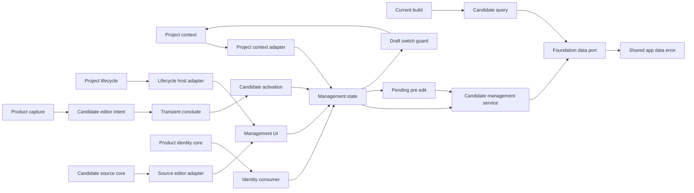
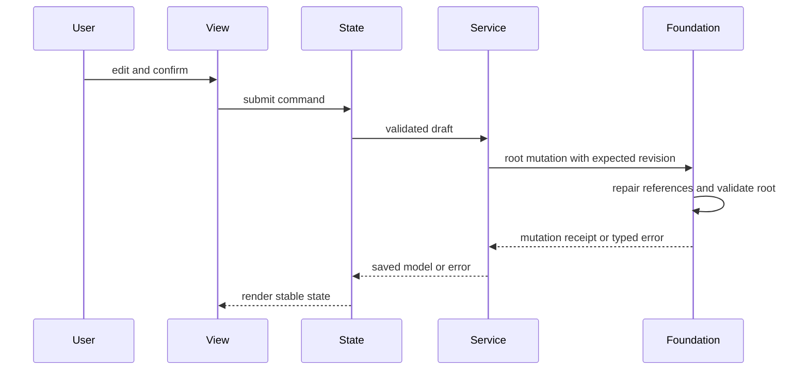

# Design Document

## Overview

本機能はPC構成を検討する利用者へ、共通の現在プロジェクトに所属する候補パーツをサイドパネル内で整理・補正する管理体験を提供する。`project-context` の検証済みsnapshotとproject lifecycle presentationを利用し、`local-data-foundation` の型、共有`AppDataError`、query、原子的root mutationを介して、候補固有のコマンド規則、カテゴリ別参照契約、typed activation、draft保護、フォーム状態、画面を提供する。取得元editor UIと商品同一性consumerは維持するが、各core contractは隣接ownerの公開入口から消費する。

### Goals
- 欠損と未分類を許容する候補CRUDを提供する
- 共通項目、確認済み属性、元表記を区別し安全に再編集する
- 商品取り込み、構成管理、重複商品workflowが利用できる最小で安定した候補契約を公開する
- project切替、共通project lifecycle、画面復元を通じて現在プロジェクトとの整合を維持する

### Non-Goals
- ページ抽出、候補の採用、互換性判定、バックアップ
- project contextの選択・preference・fallback・共通selector
- 共通パーツライブラリ、画像、複製、ステータス
- project lifecycle、共有データ操作error、取得元catalog/mutation、商品同一性normalizerの定義または実装

## Change Integration

- **Integrated Change Brief**: `v0.5.0-boundary-reconciliation`
- **In-scope trace**: project lifecycle移管は`ProjectLifecycleHostAdapter`、共有error consumer移行は`CandidateManagementService`・`CandidateQuery`・`CandidateCreatePort`・`ManagementState`、source core移管は`CandidateSourceEditorAdapter`、product identity import差替えは`CandidateIdentityConsumer`、非回帰はTesting Strategyとtask 13–16へ反映する。
- **Out-of-scope preservation**: error semantics、候補UI layout、候補CRUD、既存`CandidateQuery`、`createCandidateEditorIntent`、pre-edit、current project binding、draft guard、source editor UX、保存形式、snapshot version 3/shapeを変更しない。隣接ownerの内部実装とproduction compositionは本specのfile planへ取り込まない。

## Boundary Commitments

### This Spec Owns
- 候補編集の業務規則とカテゴリ変更規則
- プロジェクト別・カテゴリ別の候補照会と分類済み候補参照契約
- サイドパネルの候補管理UI、候補削除確認、source editor UI、エラー表示。project lifecycle presentationのhost領域は提供するが、lifecycle自体と現在project selectorは所有しない
- `CandidateDraft`、候補編集prefill、候補管理activationの検証とstate適用
- `UnresolvedCandidateDraft`、pre-edit構造検証、現在projectへのbinding、`pendingPreEdit`と`project-required`状態
- 候補draftのdirty判定、project-context guard、強制切替通知後のdraft保護
- 既存snapshot内project metadataの一致検査
- 候補管理公開APIの既存`query`とtyped intent factory、および重複商品workflow専用の最小`CandidateCreatePort`
- 取得元editor UIから`candidate-source-bookmarks`の公開catalog/mutationを消費するowner-local adapter
- 保存前の重複確認から`duplicate-product-merge`の公開商品同一性contractを消費するowner-local adapter
- feature切替rollback向けの管理画面state snapshotとrestore

### Out of Boundary
- 永続化、スキーマ移行、容量判定の実装
- DOM抽出、現在構成の選択・数量、互換性評価
- 元表記から確認値を推測する処理
- navigation lifecycle、候補変更時のCurrentBuild参照修復、root全体のcommit
- snapshotの永続化、snapshot内容のshell側解釈、他featureのstate復元
- 一過性面の起動世代・固定tab・`conclude`・失敗時intent保持
- source entity・catalog・mutationの実装、および重複候補の照合・統合判断
- 現在projectの選択、preference、fallback、共通selector、project-context singletonとproduction composition
- 現行snapshot version 3/shapeの追加変更、snapshotからproject-contextを更新する処理
- project lifecycleのcontract、service、state、確認、message descriptor、presentation実装
- 共有`AppDataError`の定義、`FoundationError` mapping、公開export
- source entity、catalog、URL identity、照合、mutationのcontractと実装
- product identity normalizer、matcher、統合判断のcontractと実装
- application shellのproduction compositionと旧proxy撤去

### Allowed Dependencies
- `local-data-foundation` のDomainModel、Result、共有`AppDataError`、`FoundationDataPort`、原子的root mutation契約。候補管理は`FoundationError`を独自にmappingしない
- Chrome 116以降のsidePanel実行ホストと既存ビルド基盤
- application shellが提供するReact 19系/React DOM基盤を利用し、このfeature独自のUI runtime依存は追加しない
- application shellの`ApplicationFeatureRegistration`、`FeatureMountContext`、operation policy、contract test kit
- application shellの`ShellNavigator`、`FeatureActivationIntent`、activation adapter契約
- application shellのopaque state snapshot／restore lifecycle契約
- `project-context` のread、guard registration port、`ProjectLifecyclePort`、host-neutral lifecycle presentation contribution。候補管理はpreference store、data adapter、service/state内部へ依存しない
- `product-capture-transient-migration` が利用する現行世代確認済み`FeatureActivationIntent`と`TransientSurfaceLifecyclePort.conclude`のtyped result
- `candidate-source-bookmarks` の公開入口が提供する`CandidateSourceCatalogPort`と`CandidateSourceMutationPort`
- `duplicate-product-merge` の公開入口が提供する`ProductIdentityNormalizer`と保存前判断contract。`product-page-capture`からidentityをimportしない
- `source-price-refresh` の公開port。`duplicate-product-merge`のfeature-local coordinatorへcomposition時に注入し、内部moduleへdeep importしない
- `duplicate-product-merge` が公開する判断contractを利用する候補管理側の判断state/viewとsnapshot substate。matcher実装の所有は移さない
- 共有コアの `domain/runtime-schema/public.ts`、`ui-messages/public.ts`、`ui-language/public.ts`。候補管理は公開schema primitive、メッセージ解決、LanguageProviderだけを利用し、内部schema、catalog、language storeへdeep importしない

### Revalidation Triggers
- `Project`、`CandidatePart`、`sources`、`primarySourceId`、カテゴリ、正規化属性、Foundation query/mutation errorの形状変更
- 未分類候補の公開規則または候補の所属規則変更
- サイドパネル入口、保存責任、依存方向の変更
- shell activation envelope、候補変更時の参照修復policy、revision競合規則の変更
- FeatureMountContextの復元state、capture／restore失敗、activation rollback規則の変更
- `UnresolvedCandidateEditorPrefill`、`UnresolvedCandidateDraft`、pre-edit error、project解決順序、`pendingPreEdit`寿命の変更
- `ProjectContextSnapshot`、generation、guard/confirmation、refresh、forced notification契約の変更
- candidate-management snapshot version/shape、またはproject metadataの意味の変更
- 候補管理公開APIの`query`、`CandidateCreatePort`、`createCandidateEditorIntent`の変更
- `ProjectLifecyclePort`またはlifecycle presentation contributionのhost契約変更
- `AppDataError`のvariant、payload、`FoundationError`との一対一mapping変更
- `CandidateSourceCatalogPort`、`CandidateSourceMutationPort`、`ProductIdentityNormalizer`、重複判断contractの変更

## Architecture

### Architecture Pattern & Boundary Map



- **Selected pattern**: feature serviceとUI state。入力規則と永続化連携をUIから分離する。
- **Dependency direction**: `Foundation/ProjectContext/CandidateSource/ProductIdentity/Shell public APIs → Candidate contracts → Service/Query/Activation/owner-local adapters → UI state → UI/Registration`。右側は左側だけへ依存し、隣接ownerは各公開入口だけをseamとする。
- **Existing patterns preserved**: canonical `Result`、判別共用体、単一write authority、feature registration。
- **Atomicity**: 候補削除・カテゴリ変更はFoundationの一つのroot mutationで参照修復、全体検証、revision更新、保存を完了し、成功後のCurrentBuild別writeを要求しない。

### Technology Stack

| Layer | Choice / Version | Role |
|---|---|---|
| Language | TypeScript 7.x strict | コマンド・状態・属性の型安全性 |
| UI | React 19系 / React DOM / CSS | MV3サイドパネル管理画面 |
| Data | FoundationDataPort | 検証済みqueryと原子的root mutation |
| Test | Node test runner / jsdom / Playwright | サービス、状態、DOM統合、production E2E検証 |

## File Structure Plan

```text
src/features/candidate-management/contracts.ts # コマンド、表示用モデル、公開照会契約
src/features/candidate-management/public.ts    # query、duplicate専用create port、typed intent factoryの唯一の公開入口
src/features/candidate-management/feature-contribution.ts # shell compositionへ渡すcontribution factoryの唯一の公開入口
src/features/candidate-management/registration.ts # shellへ渡すfeature registrationと依存組立
src/features/candidate-management/activation.ts # unresolved pre-edit検証、project解決、typed activation適用
src/features/candidate-management/pre-edit-validation.ts # unresolved draft/prefillの段階別runtime検証
src/features/candidate-management/project-context-adapter.ts # read購読、dirty guard、forced切替の調停
src/features/candidate-management/project-lifecycle-host-adapter.ts # project-context lifecycle presentationを既存host領域へ接続
src/features/candidate-management/state-snapshot.ts # 管理UI stateのopaque snapshot検証・capture・restore
src/features/candidate-management/service.ts   # CRUD、分類変更、下流照会
src/features/candidate-management/state.ts     # 読込、pendingPreEdit、project-required、フォーム、保存、エラー状態
src/features/candidate-management/view.tsx     # 一覧、フォーム、確認のReact component
src/features/candidate-management/react-root.tsx # FeatureMountContextとReact rootの接続・cleanup
src/features/candidate-management/styles.css   # 管理画面レイアウトと状態表現
src/features/candidate-management/source-editor-adapter.ts # source公開catalog/mutationを既存editor UI stateへ適合
src/features/candidate-management/duplicate-*.ts(x) # duplicate-product-merge公開contractを消費する保存前判断UI substate
src/features/candidate-management/category-draft.ts # unresolved draftのproject binding
tests/features/candidate-management/service.test.ts
tests/features/candidate-management/state.test.ts
tests/features/candidate-management/view.test.tsx
tests/features/candidate-management/registration.test.ts
tests/features/candidate-management/activation.test.ts
tests/features/candidate-management/state-snapshot.test.ts
tests/features/candidate-management/pre-edit-validation.test.ts
tests/features/candidate-management/project-context-adapter.test.ts
tests/features/candidate-management/pending-*.integration.test.ts
tests/features/candidate-management/current-context-activation.test.ts
tests/features/candidate-management/project-switch-guard.test.tsx
tests/features/candidate-management/project-context-refresh.test.ts
tests/features/candidate-management/project-lifecycle-host-adapter.test.tsx
tests/features/candidate-management/source-editor-adapter.test.ts
tests/features/candidate-management/duplicate-consumer.test.ts(x)
tests/contracts/candidate-management-boundary.test.ts # 旧owner export/deep importを拒否するconsumer contract
```

### Modified Files
- 共有runtime入口、`side-panel.html`、root `src/index.ts`は変更しない。application shellは`feature-contribution.ts`と`public.ts`だけをcompositionし、内部moduleへdeep importしない。
- `styles.css`はfeatureが所有し、application shellのside panel stylesheet入口`src/application-shell/side-panel.css`が`@import`で集約して`dist/styles.css`へ出力する。HTML hostとbuild entry pointはshellが所有するため、featureはこれらを変更しない。到達不能なCSSをfeature所有ファイルとして残さない。
- `react-root.tsx`は`FeatureMountContext`とReact rootの接続・cleanupだけを所有し、`registration.ts`はDOM/React生成処理を持たない。registrationは実mountを持たない場合にplaceholderで成功を装わず、mount失敗として扱う。
- `state-snapshot.ts`とregistrationのsnapshot接続は、application shellがcapture／restoreを含むmount contractを確定してから実装する。このspecの既存`tasks.md`はその前提を持たないため、設計承認後に再生成する。
- `project-lifecycle-host-adapter.ts`はproject-contextのpresentation contributionを既存host containerへmountし、候補管理内の旧project form/state/serviceを参照しない。productionでのcontribution注入と旧shell proxy撤去はapplication shellが所有する。
- `source-editor-adapter.ts`は隣接source公開portを既存editor UIへ適合するだけで、catalog、URL identity、mutation規則を再定義しない。duplicate consumerも公開identity/判断contractだけを利用する。

## System Flows



保存成功時だけ永続モデルを置換する。失敗時は編集ドラフトと直前の一覧を保持する。

## Requirements Traceability

| Requirement | Summary | Components | Interfaces | Flows |
|---|---|---|---|---|
| 1.1, 1.2, 1.3, 1.4, 1.5, 1.6, 1.7, 1.8 | 共通project lifecycleとの安全な統合 | ProjectLifecycleHostAdapter、ProjectContextAdapter、ManagementState、View | ProjectLifecyclePort、ProjectLifecyclePresentationContribution、ProjectSwitchGuard | lifecycle host・draft guard・refresh-only recovery |
| 2.1, 2.2, 2.3, 2.4, 2.5, 2.6 | 現在projectへの欠損許容候補作成 | Service、State、ProjectContextAdapter | CandidateDraft、ProjectContextReadPort | 保存 |
| 3.1, 3.2, 3.3, 3.4, 3.5, 3.6, 3.7 | 現在project追従とカテゴリ別表示 | CandidateQuery、ProjectContextAdapter、View | CandidateListQuery、ProjectContextReadPort | context購読・読込 |
| 4.1, 4.2, 4.3, 4.4, 4.5, 4.6 | 安全な編集 | Service、State、View | UpdateCandidateCommand | 保存 |
| 5.1, 5.2, 5.3, 5.4 | 候補削除 | State、View、Service | DeleteCandidateCommand | 削除 |
| 6.1, 6.2, 6.3, 6.4, 6.5, 6.6, 6.7, 6.8, 6.9, 6.10 | 復元、下流契約、取得元UI、商品同一性consumer | Service、CandidateQuery、CandidateCreatePort、CandidateActivation、CandidateSourceEditorAdapter、CandidateIdentityConsumer、State | CandidateQuery、CandidateCreatePort、createCandidateEditorIntent、source ports、identity contract | 読込・保存・activation・source edit・duplicate check |
| 7.1, 7.2, 7.3, 7.4, 7.5, 7.6, 7.7, 7.8, 7.9, 7.10 | 解決前pre-editと現在project binding | CandidateActivation、PreEditValidation、ProjectContextAdapter、ManagementState、ManagementView | UnresolvedCandidateEditorPrefill、ProjectContextReadPort、FeatureActivationAdapter | pre-edit handoff・binding |
| 8.1, 8.2, 8.3, 8.4, 8.5, 8.6 | project切替時のdraft保護 | ProjectContextAdapter、ManagementState、ManagementView | ProjectSwitchGuard、forced notification | switch guard・強制切替 |
| 9.1, 9.2, 9.3, 9.4, 9.5 | 非権威的snapshot metadata | StateSnapshotCodec、ProjectContextAdapter、ManagementState | ManagementStateSnapshot、ProjectContextReadPort | restore |

## Components and Interfaces

| Component | Domain | Intent | Req Coverage | Dependencies | Contracts |
|---|---|---|---|---|---|
| CandidateManagementService | Feature | 候補コマンドと規則 | 2.1–2.6, 4.2–4.6, 5.2–5.4, 6.1–6.5, 6.10 | FoundationDataPort、AppDataError P0 | Service |
| CandidateQuery | Feature | 絞込済み候補参照 | 3.1–3.6, 6.3–6.5 | FoundationDataPort P0 | Service |
| CandidateCreatePort | Feature public contract | duplicate workflowの明示新規保存をcandidate CRUD ownerへ委譲 | 6.10 | CandidateManagementService P0、AppDataError P0 | Service |
| PreEditValidation | Feature contract | project未解決draftの構造検証 | 7.1, 7.5–7.8 | Foundation domain validators P0、Runtime schema public API P0 | Service |
| CandidateActivation | Feature adapter | 候補編集prefillの検証、現在project binding、state適用 | 4.1–4.6, 6.6, 7.1–7.9 | Application shell activation P0、ProjectContextReadPort P0、ManagementState P0 | Service |
| ProjectContextAdapter | Feature adapter | context購読、dirty guard、強制切替 | 1.2, 1.5–1.7, 2.1, 2.6, 3.1, 3.6–3.7, 7.1–7.5, 8.1–8.6, 9.2–9.4 | ProjectContextPublicApi P0、ManagementState P0 | Service, State |
| ProjectLifecycleHostAdapter | Feature adapter | 共通lifecycle presentationを既存hostへ接続しcandidate draft guardと共存 | 1.1–1.8 | ProjectLifecyclePort、presentation contribution P0 | Service, State |
| CandidateSourceEditorAdapter | Feature adapter | source公開portを既存editor UIへ適合 | 4.1, 4.3, 4.6, 6.3, 6.7–6.8 | CandidateSource public ports P0 | Service, State |
| CandidateIdentityConsumer | Feature adapter | 公開identity/duplicate判断contractを保存前UI stateへ適合 | 6.9 | DuplicateProductMerge public API P0 | Service, State |
| ManagementState | UI state | 編集、dirty、pending pre-edit、project-required、失敗回復、snapshot復元 | 1.3–1.8, 2.3–2.6, 4.5, 5.1–5.4, 6.1–6.2, 7.1–7.10, 8.1–8.6, 9.1–9.5 | Service P0、ProjectContextAdapter P0、FeatureMountContext P1 | State |
| ManagementView | UI | 候補一覧・form、source editor、project-required、候補確認 | 1.1–9.5 | State P0、UI messages public API P0、lifecycle host P0 | State |
| CandidateFeatureRegistration | UI adapter | state/view/public API、context adapter、snapshot codecをshell登録契約へ接続 | 1.1–9.5 | ApplicationFeatureRegistration P0、ProjectContextPublicApi P0、ManagementView P0、UI language public API P0、Runtime schema public API P0 | Service, State |

### Feature Layer

#### CandidateManagementService

```typescript
interface CandidateManagementService {
  createCandidate(input: CandidateDraft, context: MutationContext): Promise<Result<CandidatePart, CandidateOperationError>>;
  updateCandidate(input: UpdateCandidateInput, context: MutationContext): Promise<Result<CandidatePart, CandidateOperationError>>;
  deleteCandidate(id: CandidatePartId, context: MutationContext): Promise<Result<void, CandidateOperationError>>;
}

type CandidateOperationError =
  | { readonly kind: "candidate-validation"; readonly fields: Readonly<Record<string, string>> }
  | AppDataError;

interface MutationContext {
  readonly requestId: RequestId;
  readonly expectedRevision: number;
}
```

- 名前はtrim後に非空を要求する。任意項目は欠損を値へ推測変換しない。
- カテゴリ変更時は共通項目、`sources`、`primarySourceId`、`sourceSnapshot`を維持し、新カテゴリ属性を明示入力から構築する。
- serviceは管理入力をFoundation公開の`RootMutationCommand`へ変換するだけで、StorageやCurrentBuildを直接更新しない。
- 候補固有のfield validationだけを`candidate-validation`として所有する。data operation失敗はfoundation公開入口の`AppDataError`をそのまま伝播し、`ManagementError`や`FoundationError` mapperを定義しない。

#### CandidateQuery

```typescript
interface CandidateQuery {
  listCandidates(input: CandidateListQuery): Promise<Result<readonly CandidateSummary[], AppDataError>>;
  listBuildEligible(projectId: ProjectId): Promise<Result<readonly CandidatePart[], AppDataError>>;
  /** 一覧要約からは復元できない編集用draftを、保存済み候補から取得する。 */
  getCandidateDraft(id: CandidatePartId): Promise<Result<CandidateDraft, AppDataError>>;
}

```

`listCandidates`は必ずprojectIdで限定し、任意のcategoryで絞る。`listBuildEligible`は`unclassified`を除外する。`CandidateSummary`は比較用の要約であり、カテゴリ属性・取得元・元表記を持たないため編集draftを復元できない。既存候補の編集はUIから`getCandidateDraft`を呼び、保存済み値から完全なdraftを取得してから開始する。

#### CandidateCreatePort

```typescript
interface CandidateCreatePort {
  createCandidate(
    input: CandidateDraft,
    context: MutationContext,
  ): Promise<Result<CandidatePart, CandidateOperationError>>;
}
```

`CandidateCreatePort`は`duplicate-product-merge`がmatchなしまたは利用者の明示した新規保存を一度だけcandidate CRUD ownerへ委譲するためのcreate-only契約である。実装は`CandidateManagementService.createCandidate`へ直接委譲し、候補固有field validationと共有`AppDataError`を`CandidateOperationError`として維持する。update/delete、project lifecycle、source match/add/conditional mutation、共有error定義を公開せず、既存`CandidateQuery`とtyped editor intentの形状・意味を変更しない。

#### PreEditValidation and CandidateActivation

```typescript
type UnresolvedCandidateDraft = {
  readonly [Attributes in NormalizedAttributes as Attributes["category"]]: Omit<
    CandidateDraftBase,
    "projectId"
  > & {
    readonly category: Attributes["category"];
    readonly normalizedAttributes: Attributes;
  };
}[PartCategory];

interface UnresolvedCandidateEditorPrefill {
  readonly draft: UnresolvedCandidateDraft;
  readonly categoryHint?: PartCategory;
  readonly captureDiagnostics?: readonly CaptureDiagnostic[];
}

interface CandidateManagementPublicApi {
  readonly query: CandidateQuery;
  readonly create: CandidateCreatePort;
  createCandidateEditorIntent(prefill: UnresolvedCandidateEditorPrefill): FeatureActivationIntent;
}

type PreEditDraftError =
  | { readonly kind: "invalid-draft-shape" }
  | { readonly kind: "invalid-category" }
  | { readonly kind: "category-mismatch" };

type CandidateEditorPrefillError =
  | PreEditDraftError
  | { readonly kind: "invalid-category-hint" };

function validatePreEditDraft(
  draft: unknown,
): Result<UnresolvedCandidateDraft, PreEditDraftError>;

function validateCandidateEditorPrefill(
  value: unknown,
): Result<UnresolvedCandidateEditorPrefill, CandidateEditorPrefillError>;
```

`createCandidateEditorIntent`は型付きprefillからshellの`FeatureActivationIntent`を構築するだけで、navigation、query、state mutationを開始しない。product captureはこの戻り値を現行`activationId`とともに`TransientSurfaceLifecyclePort.conclude`へ渡す。候補管理は起動世代を受け取らず、世代の現行性、stale結果破棄、handoff失敗時のintent保持を再実装しない。`conclude`が返す`Promise<Result<void, TransientSurfaceError>>`では、候補管理adapterの`activate`が成功した場合だけhandoff成功となる。

registrationのactivation adapterは受信payloadを`unknown`から再検証し、`featureId`とtargetが候補管理の固定値である場合だけManagementStateへ適用する。adapterの型付き境界は既存どおり`validate(intent): Result<UnresolvedCandidateEditorPrefill, FeatureActivationError>`と`activate(prefill): Promise<Result<void, FeatureActivationError>>`である。payload構造不正は`invalid_activation`へ写像し、未信頼値をerror detailへ含めない。legacyまたは未信頼payloadに`projectId`が含まれてもunknown値として受理後に破棄し、検証済みprefill、保存先、fallback、context変更へ使用しない。

activation時は`ProjectContextReadPort.getSnapshot()`を読み、`ready`ならその`selectedProjectId`だけを付与してcanonical `CandidateDraft`を構築しeditorへ遷移する。`empty`または`unavailable`ならactivation成功として`pendingPreEdit`へprefillを保持し、`project-required`を表示する。候補管理は一覧先頭やpayload内IDへfallbackせず、context snapshotを上書きしない。

`invalid-draft-shape`は必須field/value shape、capture diagnosticsのclosed shape、`invalid-category`は未知category、`category-mismatch`はdraft categoryと`normalizedAttributes.category`の不一致を表す。未知`categoryHint`は`invalid-category-hint`とする。project情報とproject 0件はerror unionへ追加しない。編集開始検証はcategory・normalized attributes・payload shapeだけを対象にして空名を許可し、保存時は既存`validateCandidatePartContent`を適用して空名を拒否する。仮project ID、unsafe cast、root全体の偽造、保存validatorの重複定義を使用しない。

候補管理はsource catalog/mutationを自身の公開APIとして再公開しない。`CandidateSourceEditorAdapter`が`candidate-source-bookmarks`の公開入口を直接消費し、既存editor state/viewへ結果を渡す。`CandidateCreatePort`はcandidate CRUD ownerのcreateだけを公開し、source portの代替にはしない。`CandidateIdentityConsumer`は`duplicate-product-merge`の公開identity/判断contractを利用し、product captureまたはsource内部へ依存しない。これらのproduction注入はapplication shellの後続updateで行う。

### UI Layer

#### ManagementState

永続スナップショット、選択project/category、編集ドラフト、`pendingPreEdit`、`project-required`、確認ダイアログ、操作状態、表示エラーを保持する。同一操作の二重送信を抑止し、失敗時はドラフトを保持する。

```typescript
interface CandidatePreEditState {
  readonly pendingPreEdit: UnresolvedCandidateEditorPrefill | null;
}
```

`ManagementStateValue`へ`pendingPreEdit`を追加するが、既存`editor`はproject解決済みcanonical `CandidateDraft`だけを保持する。共通lifecycleによるproject作成成功だけではpendingを解決せず、`ProjectLifecyclePort`の成功結果が`ready` snapshotを返した時点で、その選択IDを保持中draftへ付与してeditorへ遷移する。作成失敗またはcommit後refresh失敗ではpendingを保持する。pendingは候補保存成功、利用者の明示取消、新しい検証済みpre-edit activationでのみ置換・破棄し、capture面の終了、通常のfeature切替では破棄しない。

pendingの寿命は同一side panel document sessionに限定し、長寿命の`ManagementState` instanceが保持する。opaque rollback snapshot、永続root、session storage、Chrome Storage、backupへ含めない。side panel閉鎖、extension reload、browser終了後の再openでは復元も自動再抽出もしない。`candidate-source-bookmarks`の複数source stateと`duplicate-product-merge`の判断substateを含む現行snapshot version 3契約を維持し、pendingをその永続化対象へ混入させない。

feature registrationのmounted handleは、未保存の管理画面stateをopaque snapshotとしてcaptureできる。現行version 3とshapeを維持し、`selectedProjectId`は復元時の一致検査にだけ使う非権威的metadataとする。snapshotは選択category、編集対象、検証済みdraft、削除確認、表示エラー、複製判断substateを含み、永続rootや保存中request、購読handle、React objectを含まない。rollbackによる再mount時は`FeatureMountContext`から受け取った`unknown`をfeature内で検証してから復元する。shellはsnapshotの構造・候補値を解釈しない。

```typescript
interface ManagementStateSnapshot {
  readonly version: 3;
  readonly selectedProjectId: ProjectId | null;
  readonly selectedCategory: PartCategory | null;
  readonly editor: CandidateEditorSnapshot | null;
  readonly deletion: DeletionConfirmationSnapshot | null;
  readonly displayError: ManagementDisplayError | null;
  readonly duplicateDecision: DuplicateMergeStateSnapshot | null;
}

type CandidateEditorSnapshot =
  | { readonly mode: "create"; readonly projectId: ProjectId; readonly draft: CandidateDraft }
  | { readonly mode: "edit"; readonly projectId: ProjectId; readonly candidateId: CandidatePartId; readonly draft: CandidateDraft };

type DeletionConfirmationSnapshot =
  | { readonly kind: "project"; readonly projectId: ProjectId }
  | { readonly kind: "candidate"; readonly candidateId: CandidatePartId };

interface ManagementDisplayError {
  readonly code: "validation" | "not-found" | "conflict" | "maintenance" | "snapshot-restore-failed";
}

type ManagementSnapshotError =
  | { readonly kind: "invalid-shape" }
  | { readonly kind: "unsupported-version" }
  | { readonly kind: "invalid-reference" }
  | { readonly kind: "invalid-draft" };

interface ManagementStateSnapshotCodec {
  capture(state: ManagementState): ManagementStateSnapshot;
  restore(input: unknown): Result<ManagementStateSnapshot, ManagementSnapshotError>;
}
```

`CandidateFeatureRegistration`はmount時にshellが提供する復元候補をcodecへ渡し、version/shape/content検証後、`ProjectContextReadPort`が`ready`かつsnapshotの`selectedProjectId`と一致する場合だけ編集状態を適用する。不一致、ID不存在、`empty`、`unavailable`ではcontextを変更せず、安全な初期状態へ退避する。session内の`pendingPreEdit`が既に存在する場合はそれを保持して`project-required`または再binding待ちを表示する。保存操作・subscription・React rootは新規mountで作成し直す。

`ManagementState`は単一mountより長く生存するため、mount開始時に通常の編集draft、削除確認、表示エラーを破棄してから永続データを読み込む。ただし受理済み`pendingPreEdit`は同一document sessionで維持する。shellはrollback時だけ`restoredState`を渡すので、通常の編集draftが検証済みsnapshotを経ずに再表示されることはない。

shellがmount contextで渡す`OperationPolicy`は`ManagementState`の依存として保持し、`isAllowed("mutation")`が偽の間はプロジェクト作成・改名・削除、候補作成・更新・削除をUI上で開始不能にし、serviceを呼ばない。Foundation側のfail-closedな拒否は最終防壁として維持し、UI抑止をその代替にしない。読取とナビゲーションはmaintenance中も維持する。

shellはmaintenance遷移でfeatureを再mountしないため、policyを一度読んだ値として扱わない。mount時に`operationPolicy.subscribe`で購読し、通知を受けたら`mutationsDisabled`を再評価して購読者へ伝播させ、unmountで解除する。これによりmount中にmaintenanceが開始した場合も操作要素が即座に無効表示へ切り替わる。stateのsnapshotは通知を伴わずに書き換えない。

#### ManagementView

カテゴリタブ、候補一覧、候補編集フォーム、source editor、`project-required`案内、候補削除確認を描画する。project lifecycleのform・削除確認・回復表示は`ProjectLifecycleHostAdapter`が同じ既存host領域へmountし、ManagementViewは重複描画しない。共通の現在project selectorも描画しない。欠損は「未入力」、元表記は読み取り専用の別領域として表示する。

#### ProjectContextAdapter

`ProjectContextReadPort`を購読し、`ready`の選択IDだけを一覧query、候補保存、pre-edit bindingへ渡す。`empty`/`unavailable`では独自fallbackを行わず、stateを`project-required`へ移す。候補管理はstable guard IDで`ProjectSwitchGuard`を登録し、未保存のcandidate draftまたはpending pre-editがある場合だけ`confirmation-required`を返す。確認取消ではstateを変更せず、確認済み切替では旧draftを破棄して新snapshotを表示する。

```typescript
interface CandidateProjectContextAdapter {
  start(): Result<() => void, { readonly kind: "guard-registration-failed" }>;
  getCurrentProject(): Result<ProjectId, { readonly kind: "project-required" }>;
}
```

catalog置換やproject削除によるforced notificationではdirty draftを破棄せず、旧projectへ固定した回復待ち状態へ移す。新projectへdraftの`projectId`を書き換えず、利用者へ取消または明示的な再開始を案内する。guard評価と確認結果はcontext generationおよび要求IDに紐づけ、stale completionを適用しない。

project mutationと成功後refreshは`ProjectLifecyclePort`が一つのauthorityとして実行する。候補管理はそのresult/snapshotを受けて候補一覧とpending pre-editを更新し、mutationやrefreshを再送しない。commit後refresh失敗では共通lifecycleの`retryRefresh()`だけをhost表示から利用可能にする。

候補一覧には、選択中プロジェクトへ新規候補を作成する導線と、各候補の編集を開始する導線をアクセシブルな名前付きで置く。編集導線は`getCandidateDraft`で保存済みdraftを取得してから編集画面を開く。テストはこれらのDOM操作を通して要件を検証し、`beginCreate()`／`beginEdit()`を直接呼んでUI導線を迂回しない。

#### ProjectLifecycleHostAdapter

`project-context`が公開するhost-neutral lifecycle presentationを候補管理の既存project操作領域へmount/unmountする。candidate draftのdirty guardは既存`ProjectContextAdapter`経由で共通coordinatorへ登録済みであり、このadapterはcommand、validation、refresh、削除確認、message解決を再実装しない。lifecycle resultがready snapshotを返した場合だけ候補一覧とpending pre-editのbindingを更新し、commit後refresh失敗では共通`retryRefresh()`を表示する。旧candidate project form/state/service/messageと共存する中間状態を許可しない。

```typescript
interface ProjectLifecycleHostAdapter {
  mount(container: HTMLElement): Result<() => void, { readonly kind: "project-lifecycle-host-failed" }>;
}
```

#### CandidateSourceEditorAdapter

既存source editor state/viewからの読取・変更要求を`candidate-source-bookmarks`の公開catalog/mutation portへ委譲する。candidate draft、選択中source、入力、失敗時表示は候補管理に残すが、source entity validation、URL identity、照合、mutation規則は保持しない。隣接port未注入または失敗時は既存draftとsource表示を維持し、旧内部coreへfallbackしない。

```typescript
interface CandidateSourceEditorAdapter {
  load(candidateId: CandidatePartId): Promise<Result<readonly CandidateSource[], CandidateSourceError>>;
  apply(command: CandidateSourceEditorCommand): Promise<Result<readonly CandidateSource[], CandidateSourceError>>;
}
```

#### CandidateIdentityConsumer

候補保存前の重複確認で`duplicate-product-merge`の公開normalizer/判断contractを利用し、候補管理の既存判断state/viewへ結果を渡す。normalizer、matcher、統合mutationを実装せず、product captureからidentityをimportしない。公開contract未注入または判定失敗時は保存をfail closedに保ち、独自照合へfallbackしない。

```typescript
interface CandidateIdentityConsumer {
  evaluate(draft: CandidateDraft): Promise<Result<DuplicateDecision, DuplicateProductError>>;
}
```

## Data Models

- `CandidateDraft`: 必須の商品名、projectId、categoryと、欠損可能な共通項目・カテゴリ属性・`sources`・`primarySourceId`・`sourceSnapshot`・確認値。`sources`は取得URL・取得日時を持つ複数取得元、`primarySourceId`はその代表、`sourceSnapshot`は元表記を表し、相互に代用しない。
- `UnresolvedCandidateDraft`: `CandidateDraft`からprojectIdだけを除いたcategory判別共用体。空名を含むpre-editの構造的整合を表し、保存可能性を意味しない。
- `UnresolvedCandidateEditorPrefill`: unresolved draft、任意のcategory hint、closedなcapture diagnosticsを持つproject-free activation payload。永続entityではなく、legacy payloadのproject情報は検証済み値へ保持しない。
- `CandidateSummary`: id、商品名、カテゴリ、価格、メーカー、型番、欠損状態。
- `CandidateOperationError`: 候補固有field validationと共有`AppDataError`の和。共有data operation variantを再定義しない。
- 保存上の`Project`と`CandidatePart`はFoundation契約をそのまま利用し、重複モデルを作らない。

## Error Handling

検証エラーは項目単位に表示し、保存系エラーはドラフトと一覧を保持する。破損・非対応版は更新操作を無効化し、maintenance・revision競合は再読込可能な案内にする。容量警告は保存成功と併記、容量超過は失敗として表示する。ログへ商品値やURLを出さない。

`ManagementDisplayError`は`CandidateOperationError`、source/identity workflow error、`snapshot-restore-failed`を表示stateへ保持する。既存のdata operation codeと表示の対応は変えず、候補管理は物理message catalogを所有しない。

| code | 利用者が識別する状態 |
|---|---|
| `unsupported-data` | 保存データの破損または非対応schema版（更新操作を無効化） |
| `quota` | 保存容量不足 |
| `storage` | 保存領域を利用できない |
| `maintenance` | 保守操作中 |
| `conflict` | 他の変更と競合（再読込が必要） |
| `not-found` | 対象が見つからない |
| `validation` | 入力内容の問題（項目単位に表示） |
| `snapshot-restore-failed` | 直前の画面状態を現在projectと安全に復元できなかった |
| `project-required` | 現在projectの選択、作成または回復が必要 |
| `context-refresh-failed` | project変更は保存済みだが現在projectを再検証できない。変更を再送せずrefreshを再試行する |
| `project-changed-with-draft` | 強制切替後も旧draftを保持しており、継続方法の選択が必要 |

pre-editのpayload不正はshellの`invalid_activation`へ写像する。payload内project IDは保存先判断に使わない。contextが`empty`/`unavailable`であることはactivation失敗ではなく`project-required`状態であり、handoff失敗時のintent保持と再試行表示はproduct captureが所有する。

`CandidateOperationError`の`candidate-validation`は`fields`にfield pathをキーとする理由を持つ。serviceは`validateCandidatePartContent`が返す`ValidationError.path`を`product.name`、`sources.<index>.pageUrl`、`sources.<index>.capturedAt`、`normalizedAttributes.<属性名>`のようなdraft相対キーへ正規化し、Viewは対応する入力欄へ`aria-invalid`と`aria-describedby`で結び付けたメッセージを表示する（Requirement 4.5）。項目エラー時も入力内容と既存一覧は保持する。

## Testing Strategy

- Service unit: 空名拒否、欠損許容、単一所属、カテゴリ変更の共通値保持、元表記分離、未分類除外を検証する。
- State unit: context ready/empty/unavailable追従、二重送信抑止、保存失敗時のドラフト・一覧保持、削除取消、dirty判定を検証する。
- React DOM integration: 共通selectorを重複表示しないこと、カテゴリ切替、project-required、欠損表示、編集、削除確認、切替確認、forced切替案内、項目エラー、unmount cleanupを架空データで検証する。
- Runtime integration: manifestとside panel起動、公開契約がFoundationDataPortを経由することを検証する。
- Contract integration: 候補削除・カテゴリ変更が単一mutationとなり、Foundationの参照修復後に一度だけcommitされることを、CurrentBuild参照を含むroot上でrevision増分とcommit回数まで検証する。
- Production E2E: 実artifactを読み込んだChromeで、候補管理navigationの表示、画面到達、プロジェクト作成、候補作成、既存候補編集、再読込後の復元、boot時のconsole/runtime error不在を検証する。空shellがstartedになるだけのsmokeをfeature完成の証拠にしない。
- Activation integration: 正常prefill、未知target、不正payload、payload project IDの非権威性、同一feature再activation、失敗時の入力元状態保持を検証する。
- Pre-edit contract: context readyへのbinding、empty/unavailableの`project-required`成功、project作成とrefresh後のdraft解決、作成/refresh失敗時保持、category不整合、空名の編集開始成功と保存失敗を検証する。
- Handoff/generation integration: 現行世代の`conclude`だけがintentを配送し、candidate-management受理成功で一過性面が終了することを検証する。stale世代とhandoff失敗intent保持は上流fixtureで検証し、候補管理へ世代stateを追加しない。
- Public consumer contract: 候補管理の既存`query`と`createCandidateEditorIntent`に加え、duplicate workflow専用`CandidateCreatePort`をcanonical公開入口から利用できることを型検査する。source ownerのcatalog/mutation、identity ownerのnormalizer/判断contractは各canonical公開入口から利用し、`ManagementError`、旧candidate-owned source export、product-capture identity export、内部validatorへのdeep importが存在しないことも固定する。
- Project context integration: clean/dirty切替、確認取消/確定、stale確認、forced切替、CRUD mutation失敗時refreshなし、成功時refresh、refresh失敗後のrefresh-only回復を検証する。
- State snapshot integration: version 3/shapeを維持し、一致するcurrent projectでだけ編集状態と複製判断substateを復元する。不一致・不存在・empty/unavailable・不正snapshotがcontext、保存、候補一覧を変更しないことを検証する。

## Security & Performance

表示文字列は通常のJSX childとして扱い、`dangerouslySetInnerHTML`、`innerHTML`、inline handlerを使用しない。React componentはframework非依存のManagementStateとService portだけを受け、domain stateをhook固有形へ置き換えない。画面は選択プロジェクトの候補だけを描画し、保存操作中の重複更新を抑止する。10MB容量管理と信頼済みコンテキスト限定はFoundationへ委譲する。
