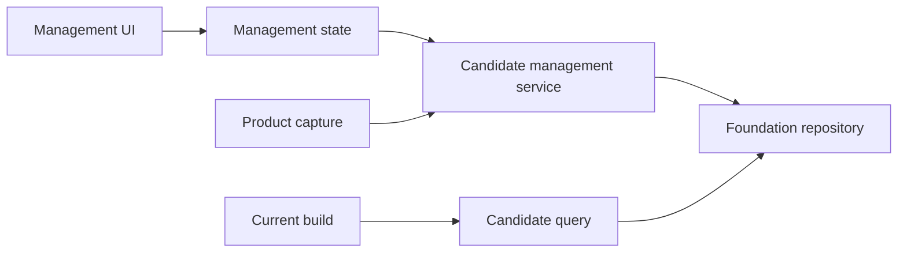
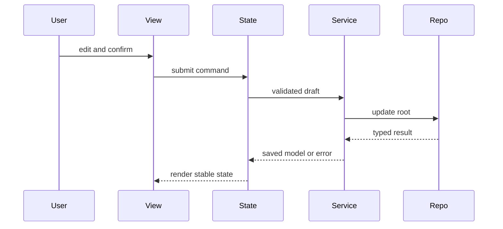

# Design Document

## Overview

本機能はPC構成を検討する利用者へ、プロジェクトと候補パーツをサイドパネル内で整理・補正する管理体験を提供する。`local-data-foundation` が提供する型、検証、Repositoryを利用し、管理固有のコマンド規則、カテゴリ別参照契約、フォーム状態、画面を追加する。

### Goals
- 欠損と未分類を許容するプロジェクト・候補CRUDを提供する
- 共通項目、確認済み属性、元表記を区別し安全に再編集する
- 商品取り込みと構成管理が利用できる安定した候補契約を公開する

### Non-Goals
- ページ抽出、候補の採用、互換性判定、バックアップ
- 共通パーツライブラリ、画像、複製、ステータス

## Boundary Commitments

### This Spec Owns
- プロジェクト名と候補編集の業務規則、カテゴリ変更規則
- プロジェクト別・カテゴリ別の候補照会と分類済み候補参照契約
- サイドパネルのプロジェクト・候補管理UI、確認、エラー表示

### Out of Boundary
- 永続化、スキーマ移行、容量判定の実装
- DOM抽出、現在構成の選択・数量、互換性評価
- 元表記から確認値を推測する処理

### Allowed Dependencies
- `local-data-foundation` のDomainModel、Result、LocalDataRepository
- Chrome 116以降のsidePanel実行ホストと既存ビルド基盤
- application shellが提供するReact 19系/React DOM基盤を利用し、このfeature独自のUI runtime依存は追加しない
- application shellの`ApplicationFeatureRegistration`、`FeatureMountContext`、operation policy、contract test kit

### Revalidation Triggers
- `Project`、`CandidatePart`、カテゴリ、正規化属性、Repositoryエラーの形状変更
- 未分類候補の公開規則または候補の所属規則変更
- サイドパネル入口、保存責任、依存方向の変更

## Architecture

### Architecture Pattern & Boundary Map



- **Selected pattern**: feature serviceとUI state。入力規則と永続化連携をUIから分離する。
- **Dependency direction**: `Foundation contracts → Feature contracts → Service → UI state → UI`。右側は左側だけへ依存する。
- **Existing patterns preserved**: `Result`、判別共用体、Repositoryポート、単一保存ルート。

### Technology Stack

| Layer | Choice / Version | Role |
|---|---|---|
| Language | TypeScript 7.x strict | コマンド・状態・属性の型安全性 |
| UI | React 19系 / React DOM / CSS | MV3サイドパネル管理画面 |
| Data | LocalDataRepository | 検証済みローカル更新と照会 |
| Test | Vitest 3.x | サービス、状態、DOM統合検証 |

## File Structure Plan

```text
src/features/candidate-management/contracts.ts # コマンド、表示用モデル、公開照会契約
src/features/candidate-management/public.ts    # 後続feature向け作成・照会契約の唯一の公開入口
src/features/candidate-management/registration.ts # shellへ渡すfeature registrationと依存組立
src/features/candidate-management/service.ts   # CRUD、分類変更、下流照会
src/features/candidate-management/state.ts     # 読込、フォーム、保存、エラー状態
src/features/candidate-management/view.tsx     # 一覧、フォーム、確認のReact component
src/features/candidate-management/react-root.tsx # FeatureMountContextとReact rootの接続・cleanup
src/features/candidate-management/styles.css   # 管理画面レイアウトと状態表現
tests/features/candidate-management/service.test.ts
tests/features/candidate-management/state.test.ts
tests/features/candidate-management/view.test.ts
tests/features/candidate-management/registration.test.ts
```

### Modified Files
- 共有runtime入口、`side-panel.html`、root `src/index.ts`は変更しない。application shellが`registration.ts`と`public.ts`をcompositionする。

## System Flows



保存成功時だけ永続モデルを置換する。失敗時は編集ドラフトと直前の一覧を保持する。

## Requirements Traceability

| Requirement | Summary | Components | Interfaces | Flows |
|---|---|---|---|---|
| 1.1–1.5 | プロジェクトCRUD | Service、State、View | ProjectCommand | 編集・削除 |
| 2.1–2.5 | 欠損許容候補作成 | Service、State | CandidateDraft | 保存 |
| 3.1–3.5 | カテゴリ別表示 | CandidateQuery、View | CandidateListQuery | 読込 |
| 4.1–4.6 | 安全な編集 | Service、State、View | UpdateCandidateCommand | 保存 |
| 5.1–5.4 | 候補削除 | State、View、Service | DeleteCandidateCommand | 削除 |
| 6.1–6.5 | 復元と下流契約 | Service、CandidateQuery、State | CaptureCandidatePort、BuildCandidateQuery | 読込・保存 |

## Components and Interfaces

| Component | Domain | Intent | Req Coverage | Dependencies | Contracts |
|---|---|---|---|---|---|
| CandidateManagementService | Feature | 管理コマンドと規則 | 1.1–2.5, 4.2–4.6, 5.2, 6.2–6.5 | Repository P0 | Service |
| CandidateQuery | Feature | 絞込済み候補参照 | 3.1–3.5, 6.3–6.5 | Repository P0 | Service |
| ManagementState | UI state | 編集と失敗回復 | 1.3–1.5, 2.3–2.5, 4.5, 5.1–5.4, 6.1–6.2 | Service P0 | State |
| ManagementView | UI | 一覧、フォーム、確認 | 1.1–5.4 | State P0 | State |
| CandidateFeatureRegistration | UI adapter | state/view/public APIをshell登録契約へ接続 | 1.1–6.5 | ApplicationFeatureRegistration P0、ManagementView P0 | Service |

### Feature Layer

#### CandidateManagementService

```typescript
interface CandidateManagementService {
  createProject(input: CreateProjectInput): Promise<Result<Project, ManagementError>>;
  renameProject(input: RenameProjectInput): Promise<Result<Project, ManagementError>>;
  deleteProject(id: ProjectId): Promise<Result<void, ManagementError>>;
  createCandidate(input: CandidateDraft): Promise<Result<CandidatePart, ManagementError>>;
  updateCandidate(input: UpdateCandidateInput): Promise<Result<CandidatePart, ManagementError>>;
  deleteCandidate(id: CandidatePartId): Promise<Result<void, ManagementError>>;
}
```

- 名前はtrim後に非空を要求する。任意項目は欠損を値へ推測変換しない。
- カテゴリ変更時は共通項目と`sourceSnapshot`を維持し、新カテゴリ属性を明示入力から構築する。
- Foundationエラーを`validation`、`not-found`、`conflict`、`storage`、`quota`、`unsupported-data`へ正規化する。

#### CandidateQuery

```typescript
interface CandidateQuery {
  listProjects(): Promise<Result<readonly ProjectSummary[], ManagementError>>;
  listCandidates(input: CandidateListQuery): Promise<Result<readonly CandidateSummary[], ManagementError>>;
  listBuildEligible(projectId: ProjectId): Promise<Result<readonly CandidatePart[], ManagementError>>;
}

interface CaptureCandidatePort {
  createCandidate(input: CandidateDraft): Promise<Result<CandidatePart, ManagementError>>;
}
```

`listCandidates`は必ずprojectIdで限定し、任意のcategoryで絞る。`listBuildEligible`は`unclassified`を除外する。

### UI Layer

#### ManagementState

永続スナップショット、選択project/category、編集ドラフト、確認ダイアログ、操作状態、表示エラーを保持する。同一操作の二重送信を抑止し、失敗時はドラフトを保持する。

#### ManagementView

プロジェクトナビゲーション、カテゴリタブ、候補一覧、編集フォーム、削除確認を描画する。欠損は「未入力」、元表記は読み取り専用の別領域として表示する。

## Data Models

- `CandidateDraft`: 必須の商品名、projectId、categoryと、欠損可能な共通項目・カテゴリ属性・sourceSnapshot。
- `CandidateSummary`: id、商品名、カテゴリ、価格、メーカー、型番、欠損状態。
- `ManagementError`: UIが次の行動を選べる判別共用体。
- 保存上の`Project`と`CandidatePart`はFoundation契約をそのまま利用し、重複モデルを作らない。

## Error Handling

検証エラーは項目単位に表示し、保存系エラーはドラフトと一覧を保持する。破損・非対応版は更新操作を無効化し、容量警告は保存成功と併記、容量超過は失敗として表示する。ログへ商品値やURLを出さない。

## Testing Strategy

- Service unit: 空名拒否、欠損許容、単一所属、カテゴリ変更の共通値保持、元表記分離、未分類除外を検証する。
- State unit: 読込復元、二重送信抑止、保存失敗時のドラフト・一覧保持、削除取消を検証する。
- React DOM integration: プロジェクト・カテゴリ切替、欠損表示、編集、削除確認、項目エラー、unmount cleanupを架空データで検証する。
- Runtime integration: manifestとside panel起動、公開契約がFoundation Repositoryを経由することを検証する。

## Security & Performance

表示文字列は通常のJSX childとして扱い、`dangerouslySetInnerHTML`、`innerHTML`、inline handlerを使用しない。React componentはframework非依存のManagementStateとService portだけを受け、domain stateをhook固有形へ置き換えない。画面は選択プロジェクトの候補だけを描画し、保存操作中の重複更新を抑止する。10MB容量管理と信頼済みコンテキスト限定はFoundationへ委譲する。
