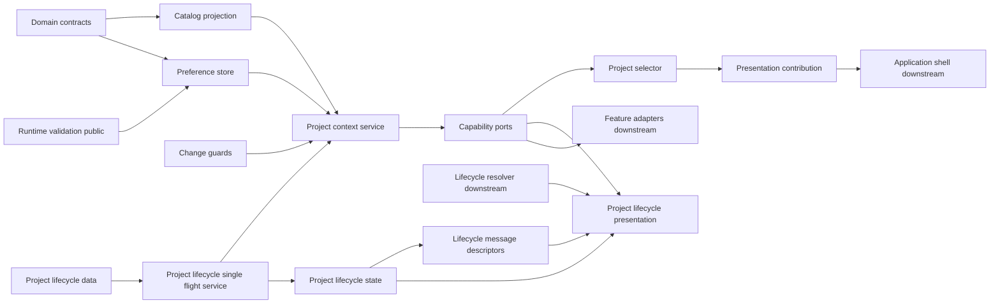
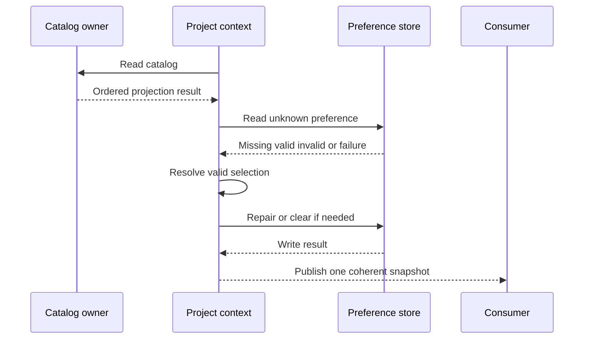
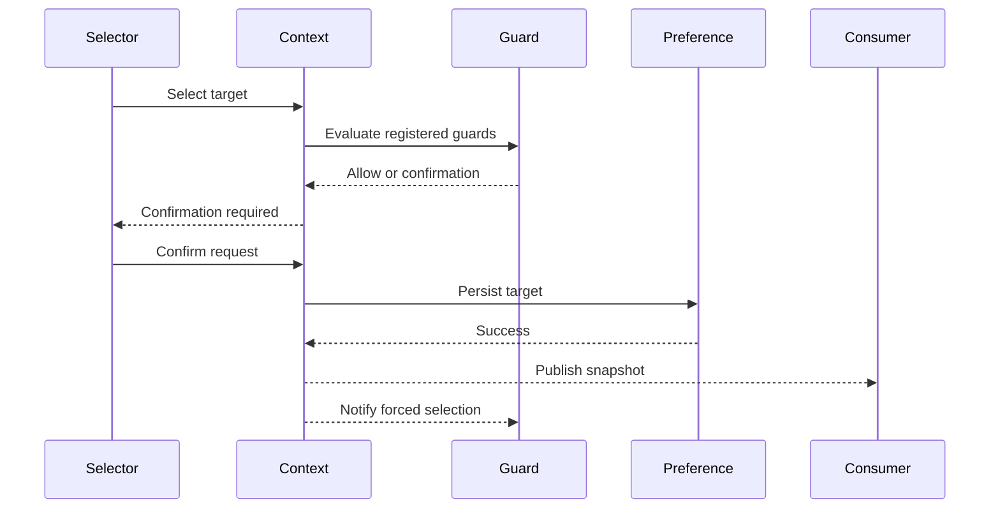
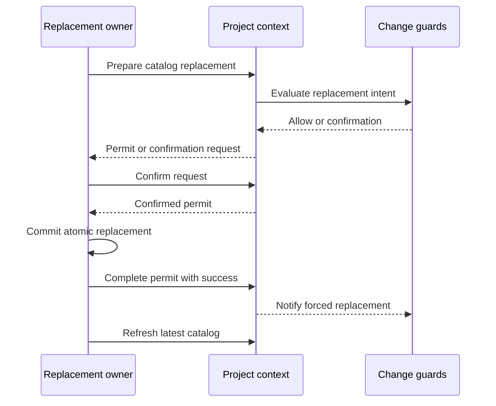
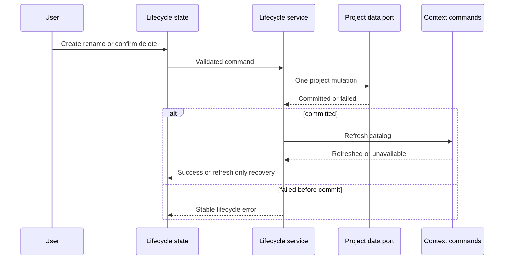

# Design Document

## Overview

本機能は、application shell や既存 feature の内部へ選択 authority を置かず、横断的な `project-context` 境界として現在 project と project lifecycle を一元管理する。既存 owner から注入された project catalog を最小 projection へ変換し、専用 UI preference を現行 catalog に照合してから、`ready | empty | unavailable` の判別可能な snapshot として公開する。

選択、refresh、catalog置換guardは一つの直列 transaction authorityで順序付け、preference の永続化成功後にだけ snapshot を更新する。Change Brief `v0.5.0` は project lifecycle と host-neutral presentation を追加し、最新の `v0.5.0-boundary-reconciliation` は message ownership を lifecycle の意味・発火条件・parameter descriptor に限定する。ja/en の物理 catalog、具体 key/value、aggregation、parity は `ui-message-catalog` が所有する。feature-owned draft は change guard の判定だけを受け取り、内容を解釈しない。application shell の slot・singleton composition、candidate-management の旧 project UI 撤去と host 接続、backup restore、handoff は downstream owner に残す。

### Change Brief Integration

- **Integrated Change Brief**: `v0.5.0-boundary-reconciliation`
- **In-scope realization**: `v0.5.0` の `ProjectLifecyclePort`、service、framework-independent state、最小 data port、作成・改名・削除 command、削除確認、成功後 refresh、失敗時非 refresh、既存表示を保つ lifecycle presentation を維持する。message は semantic intent、発火条件、必要 parameter、key 非依存 descriptor とその consumer seam に限定する。
- **Preserved out-of-scope**: lifecycle の ja/en 物理 catalog file、具体 `MessageKey` / value、catalog aggregation / parity、layout・CSS、独立管理画面、candidate 一覧・editor の情報設計、foundation の reference repair algorithm、保存形式、v1.0.0 UI 全面刷新は変更しない。

### Goals

- すべての consumer が同じ検証済み現在 project と generation を参照できる。
- side panel 再オープン、project lifecycle、backup 復元後に選択を決定的に復元・修復する。
- 競合、stale completion、guard 確認、preference 失敗を原子的な transaction で扱う。
- 共通 selector を日本語・英語、keyboard、screen reader に対応させる。
- project lifecycle を current selection と同じ canonical boundary から提供し、保存成功後だけ一度 refresh する。
- 既存の project form と削除確認の見た目・操作契約を、host-neutral presentation と catalog 非依存の lifecycle message descriptor で維持する。
- 専用 preference key と公開 import を source gate と negative test で固定する。

### Non-Goals

- backup replacement、handoff の保存先解決を実装しない。
- candidate、current-build、compatibility などの state、snapshot、draft、view を変更しない。
- application shell の slot・singleton・能力注入・production wiring を変更しない。
- canonical root、backup format、既存 snapshot version/shape を変更しない。
- foundation の project delete reference repair algorithm を移動・複製しない。
- layout・CSS、candidate 一覧/editor の情報設計、project 検索・並べ替え・archive・複数同時選択・独立管理画面・v1.0.0 UI 全面刷新を導入しない。

## Boundary Commitments

### This Spec Owns

- `ProjectContextSnapshot`、catalog projection、generation、不変条件。
- preference version 1 の schema、専用 key、Chrome local storage adapter と in-memory adapter。
- initialize、select、confirm、cancel、refresh の直列 transaction。
- project 選択と catalog 全体置換を判別する change guard の登録、評価、確認 request、確定後の forced 通知。
- read・command・guard registration・replacement guard の能力別公開 port。
- 共通 selector、日英 message、React root の mount/unmount を行う presentation contribution。
- project lifecycle の最小 data port、作成・改名・削除 service、操作 state、削除確認、成功後 refresh と refresh-only recovery。
- project lifecycle message の意味・発火条件・必要 parameter を表す key 非依存 descriptor と、その descriptor を消費して既存配置へ接続できる host-neutral presentation contribution。
- project-context の public import と preference storage を守る source boundary gate。

### Out of Boundary

- local data foundation の project aggregate、query 実装、write authority。
- application shell の selector slot、singleton composition、root API、feature port injection。
- feature-owned consumer adapter、candidate snapshot・draft、backup restore lifecycle hook、handoff、candidate-management の旧 project UI 撤去と host 接続。
- candidate 一覧/editor の state・view・layout・CSS と、独立した project 管理画面。
- backup file の検証、root 置換、復元後 refresh の実行、復元結果 UI。
- local data foundation の project 削除、candidate/current-build 参照修復 algorithm、canonical root、保存形式。
- legacy `selectedProjectId` の削除、version bump、fallback 利用。
- context unavailable 時の settings / backup recovery 画面そのもの。
- project lifecycle の ja/en 物理 catalog file、具体 key/value、catalog aggregation と parity。これらは `ui-message-catalog` が所有する。

### Allowed Dependencies

- `src/domain/public.ts` の `ProjectId`、`UtcTimestamp`、canonical `Result<T, E>`。
- 上流 `runtime-schema-validation` が提供する設定済み `src/domain/runtime-schema/public.ts` と共通 UUID・strict object・issue mapping。
- owner から注入される絞り込み済み `ProjectCatalogSource`。project-context は candidate-management 内部を import しない。
- `src/persistence/public.ts` から注入される project query/mutation の最小 adapter。project-context は foundation の repair policy、root shape、Chrome adapter を import しない。
- backup-restore などの downstream lifecycle owner。project-context は置換候補、Foundation port、backup ticket を受け取らない。
- `src/ui-messages/public.ts` と `src/ui-language/public.ts` の message resolver / provider。
- React 19.2.7、React DOM 19.2.7、TypeScript 7.0.2 strict、Node 26、Chrome 116、既存 Node test runner と Playwright。

### Revalidation Triggers

- snapshot union、generation、selection result、change intent、guard protocol、replacement guard port の shape 変更。
- preference key、version、保存 field、runtime schema primitive、storage area の変更。
- catalog entry shape・順序契約、fallback 規則、project ownership の変更。
- project lifecycle input、error、mutation receipt、data port、state、削除確認、成功後 refresh 順序の変更。
- project lifecycle message intent・parameter・descriptor contract、`ui-message-catalog` resolver seam、host-neutral presentation contract、candidate-management host 接続位置の変更。
- transaction の保存順、stale 判定、forced notification の時点変更。
- selector presentation contribution、shell slot、LanguageProvider lifecycle の変更。
- upstream validation 公開入口、公開 import 規約、Chrome storage access policy の変更。
- legacy snapshot `selectedProjectId` の version/shape または扱いの変更。

## Architecture

### Existing Architecture Analysis

Light discovery を実施した。既存の `CandidateQuery.listProjects()` は local data foundation の root 順を保った `ProjectSummary` を返す。candidate-management と current-build はそれぞれ state 内で選択を保持し、存在しない場合に一覧先頭へ fallback する。compatibility の production composition も一覧先頭を one-shot で解決しており、共通 selection authority はない。

`ui-language` は canonical root 外の専用 preference port、Chrome adapter、in-memory adapter、React 外 store を持つ。`validate-boundaries.mjs` の StorageAccessGuard は現在 source path と storage area だけを許可し、key scope は検証しない。project-context はこの既存 pattern を採用しつつ、専用 key を静的に検証する規則を追加する。

Change Brief `v0.5.0` の light discovery では、project CRUD が candidate-management の `contracts.ts` / `service.ts`、project form と削除確認が `state.ts` / `view.tsx`、日英文言が candidate namespace に分散していることを確認した。最新の `v0.5.0-boundary-reconciliation` では、project-context が lifecycle message の semantic producer であり、`ui-message-catalog` が ja/en 物理 catalog の canonical owner である seam を確定した。削除 command は foundation の root mutation を一回呼び、`referenceRepairPolicy` が同じ transaction で candidate と current-build の参照を修復している。移管後もこの atomic repair seam を維持し、project-context は repair algorithm や root shape を所有しない。

上流 `runtime-schema-validation` は configured Zod Mini、strict object、UUID、JSON safety、canonical error mapping を公開する計画である。project-context は preference schema だけを owner-local に置き、Zod package、schema instance、vendor issue を公開しない。新しい外部依存は追加しない。

### Architecture Pattern & Boundary Map

採用パターンは「外部 store を持つ横断 context + capability ports」である。application shell は具体 instance を一度だけ composition し、各 downstream owner は必要な port だけを adapter へ受け取る。



Dependency directionは `domain/runtime validation → contracts/catalog/preference/guards/lifecycle data → context/lifecycle service → lifecycle state/message descriptors/public ports → selector/lifecycle presentation → downstream composition` とする。既存 selector は `ui-messages/public.ts` を利用し、lifecycle presentation は注入された `ProjectLifecycleMessageResolver` だけを消費する。downstream resolver adapter が物理 catalog を参照し、project-context は lifecycle の catalog file と具体 key/value を所有・import しない。project-context から application-shell、candidate-management、current-build、compatibility、backup、product-capture の具体 module へ逆向きに import しない。

### Technology Stack

| Layer | Choice / Version | Role in Feature | Notes |
|---|---|---|---|
| Domain / validation | TypeScript 7.0.2 strict、upstream runtime-schema public | branded ID、Result、preference decode | `any`、vendor error 公開、direct Zod import を禁止 |
| UI | React / React DOM 19.2.7 | selector と確認・状態表示 | state authority は React 外 |
| Persistence | `chrome.storage.local` | 専用 UI preference 一件 | canonical root と別 key、既定 10MB への影響は定数 |
| Project mutation | existing foundation scoped data adapter | project query/create/update/delete | repair algorithm と root shape は foundation に残す |
| Runtime | Manifest V3、Chrome 116 | side panel composition | 新しい permission と worker state を追加しない |
| Validation | node:test、testing-library、Playwright 1.61.1 | unit、contract、DOM、downstream E2E | 架空 fixture のみ |

## File Structure Plan

### Directory Structure

```text
src/project-context/
├── contracts.ts                    # snapshot、error、catalog、change intent、guard、capability port
├── catalog.ts                      # owner source から最小 catalog projection と不変条件
├── preference-store.ts             # version 1 schema、専用 key、Chrome/in-memory port
├── guard-coordinator.ts            # change guard registry、評価、確認 request、replacement permit、forced 通知
├── service.ts                      # initialize/select/confirm/cancel/refresh/replacement guard transaction
├── lifecycle-data-port.ts          # project query/mutation だけの最小 data port と foundation adapter
├── lifecycle-service.ts            # name validation、ID/time、create/rename/delete、成功後 refresh
├── lifecycle-state.ts              # project form、pending、削除確認、refresh-only recovery の UI state
├── lifecycle-message-descriptors.ts # lifecycle の意味・発火条件・表示 parameter を key 非依存 descriptor へ写像
├── public.ts                       # read/command/guard/replacement port と factory の通常公開入口
├── selector.tsx                    # selector、確認、retry、ARIA live state
├── lifecycle-presentation.tsx      # 既存表示契約を保つ project form と削除確認の host-neutral mount
├── presentation-contribution.tsx   # LanguageProvider と React root を含む shell composition 専用 mount contract
└── runtime.ts                      # production preference adapter の composition seam
tests/project-context/
├── catalog.test.ts
├── preference-store.test.ts
├── guard-coordinator.test.ts
├── service.test.ts
├── lifecycle-data-port.test.ts
├── lifecycle-service.test.ts
├── lifecycle-state.test.ts
├── lifecycle-presentation.test.tsx
├── public.test.ts
├── contract.integration.test.ts
├── selector.test.tsx
└── presentation-contribution.test.tsx
tests/contracts/
└── project-context-contract-kit.ts # downstream adapter と E2E が再利用する契約 kit
e2e/
├── project-context-core.spec.ts     # core service と selector の browser 横断 flow
└── support/project-context-harness.tsx # 架空 catalog と preference の test-only harness
```

### Modified Files

- `src/ui-messages/catalog/ja/project-context.ts`、`src/ui-messages/catalog/en/project-context.ts` と両言語 aggregation は本 Change Brief の変更対象にしない。lifecycle descriptor に対応する物理 key/value と parity は downstream `ui-message-catalog` spec が追加する。
- `scripts/validate-boundaries.mjs` — project-context の通常・composition 入口、Chrome local storage source path と専用 key の allowlist。
- `tests/tooling/public-boundaries.test.ts` — deep import、別 storage area、別 key、dynamic key、alias access の negative fixture。
- `tests/tooling/public-api-consumer.ts` — read/command/guard/replacement port の正しい consumer と禁止 import の型検査。
- `package.json` — `src/project-context` を boundary / UI text gate の scan root に追加する。

downstream `project-candidate-management` spec だけが `src/features/candidate-management/*` の旧 project service/state/view/message 利用を撤去して lifecycle presentation host を接続する。application shell の能力注入と production wiring、既存 feature E2E の移行も downstream owner が行い、本 spec の実装 task はそれらへ触れない。

## System Flows

### Initialization and Refresh



catalog failure、preference I/O failure、修復 write failureでは `unavailable` を確定する。invalid preference はデータ破損として外へ出さず、catalog 先頭へ fallback して正常に修復できた場合だけ `ready` を公開する。catalog が空なら preference を clear して `empty` を公開する。

### Guarded Selection



confirmation request は target、base generation、guard registry revision に結び付く opaque ID である。いずれかが変化した request は stale として拒否する。preference 保存が失敗した場合は snapshot を commit しない。確定後の forced notification は best effort で隔離し、既に確定した選択を rollback しない。

### Guarded Catalog Replacement



`ReplacementGuardPermit` は opaque ID、base generation、guard registry revision に結び付き、一回だけ `complete` または `cancel` できる。prepare と confirm は root を変更せず、downstream owner は permit 取得後にだけ置換を開始する。`complete`はoutcomeにかかわらずpermitをterminal closedへ先に遷移させ、その後に`succeeded`だけがforced notificationを送る。通知失敗を返す場合もpermitは閉鎖済みであり、置換失敗時の`failed`は通知せず閉じる。成功通知と refresh は分離し、refresh 失敗で既に成功した置換を rollback しない。

### Project Lifecycle Mutation and Refresh



delete confirmation は lifecycle state が対象 project ID と表示名へ結び付け、取消時は data port を呼ばない。data mutation が失敗した場合は refresh も行わない。mutation 成功後の refresh failure は `committed-refresh-failed` として区別し、利用者の retry は context refresh だけを再実行する。削除と candidate/current-build 参照修復の atomic commit は foundation adapter の contract であり、project-context は二回目の write や repair event を生成しない。

## Requirements Traceability

| Requirement | Summary | Components | Interfaces / Flows |
|---|---|---|---|
| 1.1, 1.2, 1.3, 1.4, 1.5, 1.6 | coherent context snapshot | ProjectCatalogProjection, ProjectContextService, ProjectContextPublicApi | `ProjectContextSnapshot`、initialization flow |
| 2.1, 2.2, 2.3, 2.4, 2.5, 2.6, 2.7 | preference restore and fallback | ProjectPreferenceStore, ProjectCatalogProjection, ProjectContextService | `ProjectPreferenceRead`、initialization flow |
| 3.1, 3.2, 3.3, 3.4, 3.5, 3.6, 3.7 | atomic selection and concurrency | ProjectContextService, ProjectChangeGuardCoordinator | `ProjectContextCommandPort`、guarded selection flow |
| 4.1, 4.2, 4.3, 4.4, 4.5, 4.6 | lifecycle refresh | ProjectCatalogProjection, ProjectContextService | `refresh`、initialization flow |
| 5.1, 5.2, 5.3, 5.4, 5.5, 5.6, 5.7, 5.8 | project selection guard | ProjectChangeGuardCoordinator, ProjectContextService, ProjectSelector | guard registry、guarded selection flow |
| 5.9, 5.10, 5.11, 5.12, 5.13 | catalog replacement guard | ProjectChangeGuardCoordinator, ProjectContextService | `ProjectContextReplacementGuardPort`、guarded catalog replacement flow |
| 6.1, 6.2, 6.3, 6.4, 6.5, 6.6, 6.7 | capability ports and subscription | ProjectContextPublicApi, ProjectContextService, ProjectChangeGuardCoordinator | read/command/guard/replacement ports |
| 7.1, 7.2, 7.3, 7.4, 7.5, 7.6, 7.7, 7.8 | selector presentation | ProjectSelector, ProjectContextPresentationContribution | React state、presentation mount |
| 8.1, 8.2, 8.3, 8.4, 8.5, 8.6, 8.7, 8.8 | storage/public boundaries and validation | ProjectPreferenceStore, ProjectContextBoundaryGate, ProjectContextPublicApi | runtime seam、boundary gate、contract kit |
| 9.1, 9.2, 9.3, 9.4, 9.5, 9.6 | lifecycle commands and confirmation | ProjectLifecycleService, ProjectLifecycleState, ProjectLifecyclePresentation | lifecycle port、mutation and refresh flow |
| 9.7, 9.8, 9.9, 9.10, 9.11, 9.12 | post-mutation selection and recovery | ProjectLifecycleService, ProjectContextService, ProjectLifecycleState | lifecycle port、refresh-only recovery、context snapshot |
| 10.1, 10.2, 10.3, 10.4, 10.5, 10.6, 10.7 | lifecycle presentation and message semantics | ProjectLifecycleState, ProjectLifecycleMessageDescriptors, ProjectLifecyclePresentation, ProjectContextBoundaryGate | lifecycle mount contract、descriptor consumer seam、DOM/core E2E |

## Components and Interfaces

| Component | Domain/Layer | Intent | Req Coverage | Key Dependencies | Contracts |
|---|---|---|---|---|---|
| ProjectCatalogProjection | Domain | ordered project source を最小・一意 catalog へ射影 | 1.1–1.6, 2.3–2.5, 4.1–4.6 | domain types P0、catalog source P0 | Service |
| ProjectPreferenceStore | Adapter | 専用 key の strict preference を read/write/clear | 2.1–2.7, 3.1, 3.6, 8.1–8.4 | runtime validation P0、Chrome storage P1 | Service, State |
| ProjectChangeGuardCoordinator | Application | 選択・catalog置換のguard registryと確認 lifecycleを調停 | 3.1–3.5, 5.1–5.13, 6.3, 6.5, 6.7 | domain Result P0 | Service, State |
| ProjectContextService | Application | coherent snapshot と transaction authority | 1.1–6.7 | catalog P0、preference P0、guards P0 | Service, State |
| ProjectContextPublicApi | Public boundary | consumer 能力を read/command/guard/replacement に分離 | 1.6, 6.1–6.7, 8.5–8.7 | context service P0 | API |
| ProjectLifecycleDataPort | Adapter | project query/mutation だけを foundation へ委譲 | 9.1–9.11 | domain types P0、foundation adapter P0 | Service |
| ProjectLifecycleService | Application | create/rename/delete と成功後 refresh を一つの authority で実行 | 4.1–4.6, 9.1–9.12 | lifecycle data P0、context commands P0 | Service |
| ProjectLifecycleState | Application/UI state | form、pending、削除確認、failure、refresh-only retry を React 外で保持 | 9.3–9.5, 9.10–9.12, 10.1–10.7 | lifecycle/read ports P0 | State |
| ProjectLifecycleMessageDescriptors | Application/UI contract | lifecycle state と結果を key 非依存の message intent・parameter へ写像 | 10.1, 10.3, 10.7 | lifecycle state P0 | State |
| ProjectSelector | UI | project 選択、確認、empty/unavailable、retry 表示 | 5.4–5.6, 7.1–7.8 | public ports P0、messages P0 | State |
| ProjectLifecyclePresentation | UI adapter | 既存 project 操作を host-neutral mount と descriptor consumer で提供 | 9.1–9.12, 10.1–10.7 | lifecycle state P0、message descriptors P0、ui-messages resolver P0 | Service, State |
| ProjectContextPresentationContribution | UI adapter | selector root の mount/unmount を composition owner へ提供 | 6.6, 7.1–7.8, 8.5 | ProjectSelector P0、LanguageProvider P0 | Service |
| ProjectContextBoundaryGate | Tooling | public import と storage source/area/key scope を機械検証 | 8.1–8.5, 8.8 | TypeScript AST scanner P0 | Batch |

### Domain and Adapter Layer

#### ProjectCatalogProjection

**Responsibilities & Constraints**

- 注入された source の成功値から `id`、`name`、`updatedAt` だけを immutable catalog item へコピーする。
- source 順序を保持し、fallback は index 0 だけを使用する。名前や日時で再整列しない。
- duplicate ID、空でないことを保証できない name、無効 entry を catalog failure に閉じ、部分 catalog を公開しない。
- project CRUD、query、並び順の意味は owner に残す。

**Dependencies**

- Inbound: ProjectContextService — refresh / initialize 時の catalog 要求 P0
- Outbound: ProjectCatalogSource — owner が注入する typed query P0
- External: なし

**Contracts**: Service [x]

```typescript
interface ProjectCatalogItem {
  readonly id: ProjectId;
  readonly name: string;
  readonly updatedAt: UtcTimestamp;
}

type ProjectCatalogError =
  | { readonly kind: "source-unavailable" }
  | { readonly kind: "invalid-catalog" };

interface ProjectCatalogSource {
  list(): Promise<Result<readonly ProjectCatalogItem[], ProjectCatalogError>>;
}

interface ProjectCatalogProjection {
  load(): Promise<Result<readonly ProjectCatalogItem[], ProjectCatalogError>>;
}
```

#### ProjectPreferenceStore

**Responsibilities & Constraints**

- `projectContextPreference` 一 key だけを操作し、document は `{ version: 1, selectedProjectId }` に限定する。
- `unknown` を upstream configured schema と strict object helper で decode する。invalid document は `invalid` として修復可能にし、storage rejection は I/O error にする。
- write と clear は例外を stable error code へ閉じ、値や vendor issue を log へ出さない。
- Chrome adapter と in-memory adapter は同じ port を実装する。Chrome API の存在確認は `runtime.ts` の composition seam 内に限定する。

**Dependencies**

- Inbound: ProjectContextService — restore、selection commit、repair P0
- Outbound: runtime-schema public — strict version / UUID decode P0
- External: `chrome.storage.local` — exact key only P1

**Contracts**: Service [x] / State [x]

```typescript
type ProjectPreferenceRead =
  | { readonly kind: "missing" }
  | { readonly kind: "invalid" }
  | { readonly kind: "valid"; readonly selectedProjectId: ProjectId };

type ProjectPreferenceError =
  | { readonly kind: "storage-unavailable" }
  | { readonly kind: "storage-write-failed" };

interface ProjectPreferencePort {
  read(): Promise<Result<ProjectPreferenceRead, ProjectPreferenceError>>;
  write(projectId: ProjectId): Promise<Result<void, ProjectPreferenceError>>;
  clear(): Promise<Result<void, ProjectPreferenceError>>;
}
```

### Application Layer

#### ProjectChangeGuardCoordinator

**Responsibilities & Constraints**

- stable guard ID ごとに一件を登録し、登録順の snapshot を change transaction 開始時に固定する。
- guard decision は `allow` または `confirmation-required` だけとし、draft data を受け取らない。
- `ProjectContextChangeIntent` は `select-project` と `replace-catalog` の判別共用体とし、置換候補や backup data を含めない。
- confirmation と replacement permit は opaque ID、intent、base generation、registry revision を保持する。cancel、generation 変更、target 消失、registry 変更、別 transaction で無効化する。
- confirmed selection commit、catalog invalidation、確認済み replacement success 後に forced change を通知する。catalog invalidation は新しい snapshot の commit 後に一度だけ通知し、fallback project ではその ID、empty / unavailable では `null` を `to` に設定する。listener failure は隔離する。
- replacement completionはoutcomeにかかわらずpermitを通知前に閉じる。failure/cancel は forced notification を送らず、success通知の失敗でもpermitを再開しない。通知自体は snapshot を変更せず、refresh は downstream owner が別途要求する。

**Dependencies**

- Inbound: ProjectContextService — user selection / forced refresh P0
- Outbound: registered owner guard — decision と notification P1
- External: なし

**Contracts**: Service [x] / State [x]

```typescript
type ProjectContextChangeIntent =
  | {
      readonly kind: "select-project";
      readonly from: ProjectId;
      readonly to: ProjectId;
      readonly cause: "user";
    }
  | {
      readonly kind: "select-project";
      readonly from: ProjectId;
      readonly to: ProjectId | null;
      readonly cause: "catalog-invalidated";
    }
  | {
      readonly kind: "replace-catalog";
      readonly from: ProjectId | null;
      readonly cause: "backup-restore";
    };

type ProjectContextChangeGuardDecision =
  | { readonly kind: "allow" }
  | { readonly kind: "confirmation-required" };

interface ProjectContextChangeGuard {
  readonly id: string;
  evaluate(
    intent: ProjectContextChangeIntent,
  ): Promise<Result<ProjectContextChangeGuardDecision, { readonly kind: "guard-failed" }>>;
  notifyForced?(intent: ProjectContextChangeIntent): void | Promise<void>;
}
```

#### ProjectContextService

**Responsibilities & Constraints**

- transaction queue を一つだけ持ち、catalog load、preference I/O、guard evaluation、commit を順序付ける。MV3 worker の寿命には依存しない。
- immutable snapshot を保持し、commit 時だけ generation を一増加して listener へ同期通知する。
- initialize / refresh の選択優先順位は「現 snapshot の有効選択 → 有効 preference → catalog 先頭 → empty」である。initialize には現 snapshot がない。
- user select は「target validation → guard evaluation → optional confirmation → preference write → snapshot commit → forced notification」の順とする。
- catalog replacement は「prepare intent → optional confirmation → begin時stale検証 → downstream commit → outcome completion」の順とし、prepare/confirm/beginでは snapshot と preference を変更しない。
- replacement success completion は forced notification だけを行い、catalog refresh を暗黙実行しない。downstream owner が置換成功確定後に command port の `refresh` を呼ぶ。
- stale async completion は transaction sequence、base generation、confirmation registry revision で拒否する。
- unavailable への遷移でも generation を増加するが、preference write failure による user select 失敗では snapshot を変更しない。

**Dependencies**

- Inbound: Public API / selector / downstream lifecycle owner P0
- Outbound: catalog projection、preference port、guard coordinator P0
- External: なし

**Contracts**: Service [x] / State [x]

```typescript
type ProjectContextSnapshot =
  | {
      readonly status: "ready";
      readonly generation: number;
      readonly catalog: readonly [ProjectCatalogItem, ...ProjectCatalogItem[]];
      readonly selectedProjectId: ProjectId;
    }
  | {
      readonly status: "empty";
      readonly generation: number;
      readonly catalog: readonly [];
      readonly selectedProjectId: null;
    }
  | {
      readonly status: "unavailable";
      readonly generation: number;
      readonly selectedProjectId: null;
      readonly reason:
        | "not-initialized"
        | "catalog-unavailable"
        | "preference-unavailable"
        | "preference-write-failed";
    };

interface ProjectSwitchConfirmation {
  readonly id: string;
  readonly from: ProjectId;
  readonly to: ProjectId;
  readonly baseGeneration: number;
}

type ProjectSelectionOutcome =
  | { readonly kind: "selected"; readonly snapshot: ProjectContextSnapshot }
  | {
      readonly kind: "confirmation-required";
      readonly confirmation: ProjectSwitchConfirmation;
    };

type ProjectContextCommandError =
  | { readonly kind: "context-unavailable" }
  | { readonly kind: "project-not-found" }
  | { readonly kind: "guard-failed" }
  | { readonly kind: "confirmation-stale" }
  | { readonly kind: "preference-write-failed" };
```

#### ProjectContextPublicApi

**Responsibilities & Constraints**

- 通常 consumer へ read-only port、selection owner へ command port、draft owner へ guard registration port、catalog置換ownerへ replacement guard port、project presentation owner へ lifecycle port を別 object として提供する。
- port は frozen facade であり、service instance、preference port、catalog source、guard collection を公開しない。
- `public.ts` は domain contract と factory だけを export し、React、Chrome、runtime schema instance を module graph に含めない。

**Contracts**: API [x]

```typescript
interface ProjectContextReadPort {
  getSnapshot(): ProjectContextSnapshot;
  subscribe(listener: (snapshot: ProjectContextSnapshot) => void): () => void;
}

interface ProjectContextCommandPort {
  select(projectId: ProjectId): Promise<Result<ProjectSelectionOutcome, ProjectContextCommandError>>;
  confirm(confirmationId: string): Promise<Result<ProjectContextSnapshot, ProjectContextCommandError>>;
  cancel(confirmationId: string): Result<void, ProjectContextCommandError>;
  refresh(): Promise<Result<ProjectContextSnapshot, ProjectContextCommandError>>;
}

interface ProjectContextChangeGuardRegistrationPort {
  register(guard: ProjectContextChangeGuard): Result<() => void, { readonly kind: "duplicate-guard" }>;
}

interface ProjectContextReplacementConfirmation {
  readonly id: string;
  readonly baseGeneration: number;
}

interface ProjectContextReplacementPermit {
  readonly id: string;
  readonly baseGeneration: number;
}

type ProjectContextReplacementPreparation =
  | { readonly kind: "permitted"; readonly permit: ProjectContextReplacementPermit }
  | {
      readonly kind: "confirmation-required";
      readonly confirmation: ProjectContextReplacementConfirmation;
    };

type ProjectContextReplacementGuardError =
  | { readonly kind: "guard-failed" }
  | { readonly kind: "confirmation-stale" }
  | { readonly kind: "permit-stale" }
  | { readonly kind: "permit-not-started" }
  | { readonly kind: "permit-already-completed" };

interface ProjectContextReplacementGuardPort {
  prepare(): Promise<Result<ProjectContextReplacementPreparation, ProjectContextReplacementGuardError>>;
  confirm(confirmationId: string): Promise<Result<ProjectContextReplacementPermit, ProjectContextReplacementGuardError>>;
  cancel(confirmationId: string): Result<void, ProjectContextReplacementGuardError>;
  begin(permitId: string): Result<void, ProjectContextReplacementGuardError>;
  complete(
    permitId: string,
    outcome: "succeeded" | "failed" | "cancelled",
  ): Promise<Result<void, ProjectContextReplacementGuardError>>;
}

interface ProjectLifecyclePort {
  create(name: string): Promise<Result<ProjectLifecycleCommandResult, ProjectLifecycleError>>;
  rename(projectId: ProjectId, name: string): Promise<Result<ProjectLifecycleCommandResult, ProjectLifecycleError>>;
  delete(projectId: ProjectId): Promise<Result<ProjectLifecycleCommandResult, ProjectLifecycleError>>;
  retryRefresh(): Promise<Result<ProjectContextSnapshot, ProjectLifecycleRefreshError>>;
}

interface ProjectContextPublicApi {
  readonly read: ProjectContextReadPort;
  readonly commands: ProjectContextCommandPort;
  readonly guards: ProjectContextChangeGuardRegistrationPort;
  readonly replacementGuard: ProjectContextReplacementGuardPort;
  readonly lifecycle: ProjectLifecyclePort;
}
```

`prepare` は `unavailable` snapshot でも実行可能であり、intent の `from` を `null` とする。`begin` は permit の generation と guard registry revision を現在値へ再照合して一回だけ開始済みにし、stale permit では downstream commit を開始させない。`complete`はpermit閉鎖をforced notificationより先に確定し、`complete("succeeded")` だけが登録 guard へ通知する。通知callbackが失敗して`guard-failed`を返してもpermitは閉鎖済みで再利用できない。`failed` と `cancelled` は通知せず lifecycle を閉じ、同じ backup ticketから新しい`prepare`を行える。

### Project Lifecycle Layer

#### ProjectLifecycleDataPort

**Responsibilities & Constraints**

- project の lookup と create/update/delete mutation だけを公開し、candidate/current-build collection、repair policy、root replacement、Chrome storage を公開しない。
- mutation context と foundation の commit receipt を受け渡し、project 削除は一つの root mutation として実行する。
- foundation error を project 名・ID・保存値を含まない安定した lifecycle data error へ変換する。

**Dependencies**

- Inbound: ProjectLifecycleService — project query / mutation P0
- Outbound: foundation scoped data port — atomic project mutation P0
- External: なし

**Contracts**: Service [x]

```typescript
interface ProjectLifecycleMutationContext {
  readonly requestId: RequestId;
  readonly expectedRevision: number;
}

type ProjectLifecycleDataError =
  | { readonly kind: "not-found" }
  | { readonly kind: "conflict" }
  | { readonly kind: "maintenance" }
  | { readonly kind: "storage" }
  | { readonly kind: "quota" }
  | { readonly kind: "unsupported-data" };

interface ProjectLifecycleDataPort {
  createMutationContext(): Promise<Result<ProjectLifecycleMutationContext, ProjectLifecycleDataError>>;
  find(projectId: ProjectId): Promise<Result<Project | undefined, ProjectLifecycleDataError>>;
  mutate(
    operation:
      | { readonly kind: "create"; readonly project: Project }
      | { readonly kind: "update"; readonly project: Project }
      | { readonly kind: "delete"; readonly projectId: ProjectId },
    context: ProjectLifecycleMutationContext,
  ): Promise<Result<void, ProjectLifecycleDataError>>;
}
```

#### ProjectLifecycleService

**Responsibilities & Constraints**

- project 名を trim して空文字を拒否し、create の ID/timestamp と rename の updated timestamp を生成する。各 command は data port から最新 revision に結び付く mutation context を一つ取得する。
- lifecycle service 自身が single-flight authority を所有し、UI state 経由か public lifecycle port 経由かにかかわらず、create/rename/delete と post-commit refresh/retry が終わるまで重複 lifecycle command を `operation-in-progress` として拒否する。
- create/update/delete を data port へ一回だけ委譲し、data failure では context refresh を呼ばない。
- commit 成功後に context command の `refresh` を一回呼ぶ。refresh failure は committed result と区別し、再実行可能なのは refresh だけとする。
- delete cascade や candidate/current-build repair の意味を解釈せず、foundation の atomic mutation result を信頼する。

**Dependencies**

- Inbound: ProjectLifecycleState / public lifecycle facade P0
- Outbound: ProjectLifecycleDataPort P0、ProjectContextCommandPort refresh P0
- External: domain UUID / UTC timestamp factory P1

**Contracts**: Service [x]

```typescript
type ProjectLifecycleError =
  | { readonly kind: "validation"; readonly fields: Readonly<Record<"name", "required">> }
  | ProjectLifecycleDataError
  | { readonly kind: "operation-in-progress" }
  | { readonly kind: "committed-refresh-failed" };

type ProjectLifecycleRefreshError =
  | ProjectContextCommandError
  | { readonly kind: "operation-in-progress" };

type ProjectLifecycleCommandResult = {
  readonly projectId: ProjectId;
  readonly snapshot: ProjectContextSnapshot;
};

interface ProjectLifecycleService {
  create(name: string): Promise<Result<ProjectLifecycleCommandResult, ProjectLifecycleError>>;
  rename(projectId: ProjectId, name: string): Promise<Result<ProjectLifecycleCommandResult, ProjectLifecycleError>>;
  delete(projectId: ProjectId): Promise<Result<ProjectLifecycleCommandResult, ProjectLifecycleError>>;
  retryRefresh(): Promise<Result<ProjectContextSnapshot, ProjectLifecycleRefreshError>>;
}
```

#### ProjectLifecycleState

**Responsibilities & Constraints**

- project name input、rename target、delete confirmation target、pending、field/error state を React 外で保持する。
- delete request 時に現在の catalog item を確認 snapshot へ固定し、cancel では service を呼ばない。
- command 中は重複操作を拒否し、`committed-refresh-failed` の後は mutation controls を閉じて refresh retry だけを許可する。
- UI state の pending は表示と control disable を担い、重複 command の correctness は service の single-flight gate が公開 port 全体で保証する。
- message text、candidate draft、candidate list/editor state を保持しない。

**Contracts**: State [x]

```typescript
interface ProjectLifecycleStateSnapshot {
  readonly nameInput: string;
  readonly editingProjectId: ProjectId | null;
  readonly deletion: { readonly projectId: ProjectId; readonly projectName: string } | null;
  readonly pending: boolean;
  readonly fieldError: "required" | null;
  readonly error: ProjectLifecycleError | null;
}

interface ProjectLifecycleState {
  getSnapshot(): ProjectLifecycleStateSnapshot;
  subscribe(listener: (snapshot: ProjectLifecycleStateSnapshot) => void): () => void;
  setNameInput(value: string): void;
  beginRename(projectId: ProjectId): Result<void, { readonly kind: "project-not-found" }>;
  requestDelete(projectId: ProjectId): Result<void, { readonly kind: "project-not-found" }>;
  cancelDelete(): void;
  submitCreate(): Promise<void>;
  submitRename(): Promise<void>;
  confirmDelete(): Promise<void>;
  retryRefresh(): Promise<void>;
}
```

#### ProjectLifecycleMessageDescriptors

**Responsibilities & Constraints**

- lifecycle state と command result から、一覧・作成・改名・削除確認・validation・失敗・pending・refresh retry を区別する semantic intent を生成する。
- descriptor は表示に必要な project 名、operation、安定した error category だけを parameter として持ち、locale、物理 `MessageKey`、翻訳値、catalog path を含めない。
- 同じ state transition は locale に依存せず同じ descriptor を発火する。presentation は注入された resolver consumer port へ descriptor を渡し、解決済み text を安全な text child として描画する。
- descriptor-to-key mapping、ja/en catalog file/value、placeholder mapping、aggregation、parity は `ui-message-catalog` に残す。

**Dependencies**

- Inbound: ProjectLifecycleState / ProjectLifecyclePresentation — state transition と表示要求 P0
- Outbound: downstream `ProjectLifecycleMessageResolver` implementation — descriptor 解決 P0
- External: なし

**Contracts**: Service [x] / State [x]

```typescript
type ProjectLifecycleMessageDescriptor =
  | { readonly intent: "project-list" }
  | { readonly intent: "create-project" }
  | { readonly intent: "rename-project"; readonly projectName: string }
  | { readonly intent: "confirm-delete"; readonly projectName: string; readonly impact: "owned-candidates" }
  | { readonly intent: "name-required" }
  | { readonly intent: "operation-pending"; readonly operation: "create" | "rename" | "delete" | "refresh" }
  | { readonly intent: "operation-failed"; readonly reason: ProjectLifecycleError["kind"] }
  | { readonly intent: "retry-refresh" };

interface ProjectLifecycleMessageResolver {
  resolve(descriptor: ProjectLifecycleMessageDescriptor): string;
}
```

#### ProjectLifecyclePresentation

**Responsibilities & Constraints**

- read port の catalog と lifecycle state を使い、既存の project nav、create/rename form、delete confirmation の role・label・操作順を host container 内へ描画する。
- project 削除確認には対象名と、その project に所属する候補も削除される影響を数の推測なしで明示する。
- lifecycle state が生成した key 非依存 descriptor を注入済み resolver consumer port へ渡して解決し、project name と解決済み message は text child として描画する。物理 key/value や catalog file を import しない。
- LanguageProvider、keyboard、focus、pending status、confirm/cancel、refresh retry を提供し、layout class と CSS rule を新設・変更しない。
- mount/unmount contract を提供するが、candidate-management の host container 作成と旧 UI 撤去は downstream spec に残す。

**Contracts**: Service [x] / State [x]

```typescript
interface ProjectLifecyclePresentationContribution {
  mount(container: HTMLElement): Result<ProjectContextPresentationHandle, { readonly kind: "presentation-failed" }>;
}

interface ProjectLifecyclePresentationDependencies {
  readonly read: ProjectContextReadPort;
  readonly lifecycle: ProjectLifecyclePort;
  readonly state: ProjectLifecycleState;
  readonly messages: ProjectLifecycleMessageResolver;
}

function createProjectLifecyclePresentationContribution(
  dependencies: ProjectLifecyclePresentationDependencies,
): ProjectLifecyclePresentationContribution;
```

### Presentation Layer

#### ProjectSelector

**Responsibilities & Constraints**

- `useSyncExternalStore` で read port を購読し、local UI state は pending command と confirmation dialog だけに限定する。
- ready は native select、empty は disabled state、unavailable は status と retry button を表示する。
- select の label、status は message catalog key を使用する。project name は option child text として描画する。
- confirmation は modal semantics、initial focus、Escape cancel、confirm/cancel button を持つ。処理中は重複操作を無効化する。
- command rejection は stable kind から利用者向け message へ写像し、ID、storage value、exception を表示しない。

**Contracts**: State [x]

```typescript
interface ProjectSelectorProps {
  readonly read: ProjectContextReadPort;
  readonly commands: ProjectContextCommandPort;
}
```

#### ProjectContextPresentationContribution

**Responsibilities & Constraints**

- shell が提供した exact slot container に一つの React root を生成し、`LanguageProvider` と `ProjectSelector` を mount する。
- handle の `unmount` は subscription、pending UI、React root を一度だけ解放し、container を空にする。
- slot の作成、配置、context singleton の生成、feature への port injection は shell owner に残す。

**Contracts**: Service [x]

```typescript
interface ProjectContextPresentationHandle {
  unmount(): void;
}

interface ProjectContextPresentationContribution {
  mount(container: HTMLElement): Result<
    ProjectContextPresentationHandle,
    { readonly kind: "presentation-failed" }
  >;
}
```

### Tooling

#### ProjectContextBoundaryGate

**Responsibilities & Constraints**

- normal consumer の project-context import は `public.ts`、shell composition は `presentation-contribution.ts` と `runtime.ts` だけを許可する。
- direct `chrome.storage.local` は `preference-store.ts` のみ許可し、`get/set/remove` の key argument が静的に `projectContextPreference` へ解決できる場合だけ通す。
- dynamic key、storage area alias、別 key、session/sync access、別 source path、内部 deep import の negative fixture を拒否する。
- 要件 8.6 として legacy 選択 authority の逆流を拒否する。`src/project-context/` からの import は Allowed Dependencies（owner-local sibling、`domain/public`、`domain/runtime-schema/public`、`ui-language/public`、`ui-messages/public`、React）だけを許し、features / application-shell / runtime / persistence への static・dynamic・import type 経路を閉じる。加えて初期化・fallback の入力契約（`*Dependencies` / `*Source` / `*Port` / `*Options` / `*Input`）が `selectedProjectId` を member に持つことを拒否する。context 自身の出力である snapshot の同名 field は対象外とする。
- source scan root に `src/project-context` を必須化し、存在しない root を fail closed にする。

**Contracts**: Batch [x]

## Data Models

### Domain Model

- `ProjectCatalogItem`: context が公開する最小 project projection。project 内容の authoritative record ではない。
- `ProjectContextSnapshot`: catalog と選択の一貫性境界。`ready` だけが non-null selection を持つ。
- `ProjectPreferenceDocumentV1`: root 外の UI preference。version と ID だけを持つ。
- `ProjectSwitchConfirmation`: memory-only の一時 request。永続化、snapshot、backup へ含めない。
- `ProjectContextChangeIntent`: project 選択または catalog 全体置換の種類と、guard 判断に必要な最小 context。catalog invalidation では fallback ID または選択不能を表す `null` を通知し、draft や置換候補を含めない。
- `ProjectContextReplacementConfirmation` / `ProjectContextReplacementPermit`: memory-only の一時 lifecycle。generation と guard registry revision に結び付き、永続化、snapshot、backup へ含めない。
- `ProjectLifecycleMutationContext`: project mutation の request identity と expected revision。project content や repair policy を含めない。
- `ProjectLifecycleStateSnapshot`: name input、rename target、delete confirmation、pending、stable error だけを持つ presentation state。candidate state と永続化しない。

不変条件:

1. ready の selected ID は catalog に一度だけ存在する。
2. empty の catalog は空で selected ID は null。
3. unavailable は catalog と利用可能な selected ID を公開しない。
4. generation は commit ごとに単調増加し、process 内で後退しない。
5. preference は snapshot commit より先に永続化される。
6. legacy snapshot ID は入力に含まれない。
7. replacement permit は一回だけ begin でき、begin 済み permit は一回だけ complete できる。complete後の通知成否にかかわらずterminal closedである。
8. replacement success completion だけが forced replacement notification を発生させ、snapshot の変更は後続 refresh でのみ確定する。
9. lifecycle data failure では refresh を呼ばず、commit 成功後だけ一度 refresh する。
10. `committed-refresh-failed` 後の retry は refresh だけを実行し、create/update/delete mutation を再送しない。
11. project delete と candidate/current-build 参照修復は foundation の一つの root commit とし、project-context は中間状態を公開しない。

### Logical Data Model

```typescript
interface ProjectPreferenceDocumentV1 {
  readonly version: 1;
  readonly selectedProjectId: ProjectId;
}
```

- storage key: `projectContextPreference`
- missing: 初回または empty 後。
- invalid: strict schema failure。catalog があれば fallback write で修復する。
- version unknown: invalid として同じ repair path に閉じ、推測 migration は行わない。
- clear: catalog が empty に確定する transaction の commit 前に実行する。

## Error Handling

| Failure | Snapshot / command result | Recovery |
|---|---|---|
| Catalog source failure | `unavailable: catalog-unavailable` | owner または selector の refresh |
| Preference read rejection | `unavailable: preference-unavailable` | selector refresh、settings/backup は継続 |
| Invalid preference value | publish 前に fallback repair | repair 成功時 ready/empty、失敗時 unavailable |
| User selection unknown ID | `project-not-found`、state 不変 | catalog refresh 後に再選択 |
| Guard failure | `guard-failed`、state 不変 | draft owner の回復後に再選択 |
| Stale confirmation | `confirmation-stale`、state 不変 | select をやり直して再評価 |
| Stale replacement permit | `permit-stale`、state 不変 | backup ticketを保持してprepareから再評価 |
| Replacement failed or cancelled | permitを通知なしでclose、state不変 | 同じ候補または別候補でprepareを再実行 |
| Replacement succeeded but refresh failed | forced通知後にsnapshotがunavailable | 置換を再実行せずrefreshだけを再試行 |
| Preference write rejection | `preference-write-failed`、state 不変 | retry |
| Subscriber / forced notifier throw | listener のみ隔離 | stable error code の best-effort diagnostic |
| Invalid project name | lifecycle `validation`、field error | 入力修正後に再送 |
| Project mutation conflict / storage / quota | lifecycle stable error、snapshot不変、refreshなし | 最新状態を読み直して明示的に再操作 |
| Overlapping lifecycle command | `operation-in-progress`、二つ目のdata mutationなし | 進行中 command 完了後に明示的に再操作 |
| Project mutation committed but refresh failed | `committed-refresh-failed`、context unavailable | mutationを再送せずrefreshだけをretry |

error と log には project name、project ID、storage value、draft、exception object を含めない。selector は message catalog から action-oriented text を解決する。

## Testing Strategy

### Unit Tests

- ProjectCatalogProjection: source 順保持、duplicate ID、invalid entry、empty、failure の全-or-nothing。
- ProjectPreferenceStore: missing/valid/invalid/unknown version、別 key 非接触、read/write/clear rejection、in-memory parity。
- ProjectChangeGuardCoordinator: 登録順、duplicate、両intentのallow/confirmation、cancel、stale generation、registry revision、permit begin/complete、terminal close後の成功通知とlistener failure isolation。
- ProjectContextService: ready/empty/unavailable、restore priority、fallback repair、generation、same-selection no-op、write-before-commit、serialized select/refresh/replacement guard、stale result。
- ProjectLifecycleDataPort: create/update/delete の一回委譲、error mapping、project delete が foundation の atomic repair contract を経由すること。
- ProjectLifecycleService / State: name validation、create/rename/delete、delete cancel、重複操作抑止、data failure時非refresh、commit後refresh、refresh-only retry。
- public lifecycle port を直接並行呼出ししても service single-flight gate が二つ目を拒否し、mutation/refresh が重複しないこと。

### Contract and Integration Tests

- read/command/guard/replacement facade が内部 capability を漏らさず、unsubscribe 後に通知しない。
- create/delete/restore を表す synthetic catalog replacement で、選択維持、fallback、empty、unavailable recovery を検証する。
- guard confirmation 中に refresh、guard unregister、target deletion が起きた場合に confirmation を stale とする。
- replacement prepare/confirmation後にgenerationまたはregistry revisionが変わった場合はbeginを拒否し、失敗・取消ではforced通知なし、成功では一回だけ通知する。
- backup owner相当のsynthetic consumerで `prepare → confirm → begin → complete succeeded → refresh` の順序と、refresh失敗後にreplacementを再実行しないことを検証する。
- catalog invalidation の snapshot commit 後 forced notification（fallback ID / empty 時の `null`）と listener failure isolation を検証し、通知失敗後も permit が閉鎖済みで通常操作と次の prepare を阻害しないことを確認する。
- reusable contract kit で downstream adapter が legacy snapshot ID を authority にしないこと、null/unavailable を扱うことを検証可能にする。
- synthetic lifecycle data port で emptyからのcreate、selected rename、selected/non-selected delete、foundation repair済み結果、mutation failure、commit後refresh failureを検証する。

### DOM Tests

- ready/empty/unavailable/pending の表示、native select、retry、確認・取消。
- keyboard focus、Escape、accessible label、live status、disabled state。
- 既存 selector は LanguageProvider の ja/en 切替で選択を維持し、既存 selector message key parity を確認する。lifecycle presentation は locale 非依存で同じ descriptor intent/parameter を発火し、synthetic resolver の差し替え後も入力・確認・選択を維持する。
- markup-like project name を text として描画し、`img` や script element が生成されないことを確認する。
- unmount が root、subscription、container を cleanup する。
- lifecycle presentation のproject nav、create/rename form、所属候補も削除される影響を明示したdelete confirmation、cancel、pending、field/error、refresh retryを既存 role/label contractで検証する。
- lifecycle language switchで入力・確認・選択を維持し、markup-like project nameからHTML nodeを生成しないことを確認する。

### Boundary, Build, and E2E

- AST negative fixture で別 source、別 area、別/dynamic key、alias access、deep import を拒否する。
- public consumer typecheck で capability separation と canonical `Result` を固定する。
- `pnpm validate:boundaries`、`validate:ui-text`、`validate:final-build`、`pnpm test` を通す。
- 本 spec は test-only browser harness で core service、preference、guard、selector を composition し、選択、確認・取消、再初期化による preference 復元、empty/unavailable recovery を Playwright で検証する。harness は production bundle や manifest へ含めない。
- 同じ harness に lifecycle data/state/presentation を追加し、create、rename、delete確認/取消、delete後fallback/empty、mutation failure、refresh-only recovery、日英keyboard flowを検証する。
- 要件 8.7 は contract kit の `collectUnavailableRecoveryContractViolations` で固定する。unavailable snapshot を観測しながら downstream owner が注入した settings / backup recovery 起動経路が拒否されないことと、公開 command から retry へ到達できることだけを検査し、shell 具体実装は取り込まない。
- downstream Playwright test が利用する contract kit と selector locator contract も提供する。production shell への slot 配置、feature adapter 追従、実 extension 再オープン、settings/backup recovery の Playwright シナリオ実装は各 downstream owner が行い、Revalidation Triggers により統合時に本 contract suite も実行する。
- fixture は架空 ID・project 名のみを使い、実サイト由来 URL、商品値、HTML、画像を含めない。

## Security Considerations

- preference は `unknown` から strict decode し、unknown key、unsafe object、禁止 payload、unknown version を受理しない。
- direct Chrome storage access は exact source/area/key gate で限定し、content script や feature へ preference API を公開しない。
- project name は React text child としてのみ描画し、`dangerouslySetInnerHTML` / `innerHTML` を使用しない。
- canonical root と backup format に preference を混在させず、local data foundation の single write authority を迂回して domain data を書かない。
- project mutation は注入された最小 foundation adapter だけを経由し、project-context から Chrome storage、root shape、repair policy、candidate/current-build data へ到達しない。
- new permission、host permission、remote code、runtime download、CSP 緩和を追加しない。

## Performance & Scalability

- catalog projection、selection lookup、guard traversal は project / guard 数に対して線形とする。MVP では多数 project の検索・index は導入しない。
- snapshot と catalog は immutable reference とし、同値 selection は通知しない。React selector は `useSyncExternalStore` で確定済み snapshot だけを再描画する。
- preference document は定数サイズで、`chrome.storage.local` の容量監視対象へ実質的な負荷を加えない。
- transaction queue は失敗後も解放し、後続 refresh を starvation させない。
- lifecycle state は同時に一つの command だけを pending とし、catalog scaleに対して追加の検索/index/履歴を保持しない。

## Migration and Downstream Integration

Change Brief `v0.5.0-boundary-reconciliation` の実装順は、既存 project-context core と `v0.5.0` lifecycle behavior を維持しつつ lifecycle contract/data adapter、service/state、semantic message descriptor/presentation、public/runtime facade、core contract/DOM/E2E、downstream physical catalog adapter と candidate host migration の順とする。

1. 本 spec は project-context 内に lifecycle capability と host-neutral presentation を追加し、既存 selection/preference/guard/replacement behavior を変更しない。
2. project-context は foundation adapter と lifecycle service/state/presentation を組み立てる factory seam を公開するだけで、singleton の生成・保持と production host wiring は application shell が所有する。
3. project delete は既存 foundation adapter の一回の root mutationを利用し、reference repair algorithm と保存形式を移動しない。
4. downstream `project-candidate-management` spec が candidate service/state/view から project CRUD・確認・message を撤去し、既存位置へ lifecycle presentation host を接続する。
5. application-shell が singleton と能力別 injection を composition し、downstream contract / Playwright が見た目、selection、draft guard、refresh recovery を証明する。
6. rollout 中も既存 snapshot version/shape と `selectedProjectId` field、layout/CSS、candidate一覧/editor情報設計を維持し、context authority への逆流を boundary test で拒否する。
7. downstream `ui-message-catalog` spec が lifecycle descriptor-to-key adapter、ja/en key/value、aggregation、parity を追加し、project-context はそれらの物理 file を変更しない。
