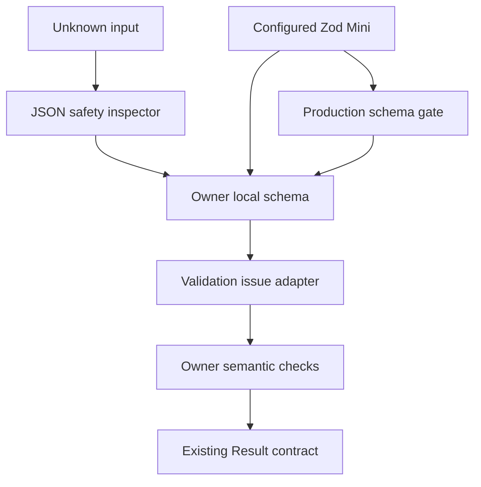
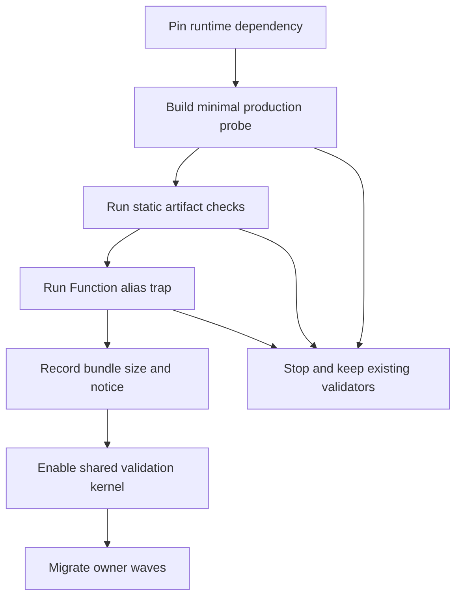

# Design Document

## Overview

本機能は、Chrome 拡張の未信頼境界に散在する手書き decoder を、設定済み Zod Mini と owner-local schema へ段階移行する。導入の最初に本番同等 bundle を使う CSP feasibility gate を実行し、動的コード生成が直接・alias 経由とも発生しないことを確認する。gate 合格後にだけ共通 primitive、JSON safety、canonical error/path 変換を公開する。

移行後も local data foundation、backup、product capture、runtime/application shell、各 feature は自身のデータ意味を所有する。Zod issue は内部詳細に留め、既存の `Result<T, E>`、error code、canonical path、version、参照整合性、atomicity を外部契約として維持する。

### Goals

- Zod Mini を単一の設定済み import 入口から利用し、schema 生成前の `jitless` を保証する。
- shape 検証を宣言化しつつ、既存の拒否順序、error code、path、意味検証を保持する。
- production bundle の CSP、動的 `Function` 非実行、size、license notice を機械 gate で証明する。
- owner-local wave と parity test により、失敗箇所を限定して移行できるようにする。

### Non-Goals

- 保存 schema version、backup format version、snapshot version、field shape を変更しない。
- aggregate 参照整合性、循環参照、禁止 payload の意味を Zod の自動判定だけへ置換しない。
- feature schema の中央 registry、feature 間 deep import、vendor error の公開を導入しない。
- UI form validation、互換性ルール、project selection authority を変更しない。

## Boundary Commitments

### This Spec Owns

- 設定済み Zod Mini の唯一の package import と source-level 公開入口。
- 共通 primitive、plain strict object、JSON safety、Zod issue から owner error への変換規約。
- production feasibility gate、bundle size report、license notice の生成物検証。
- foundation、backup、capture、runtime/activation、snapshot の既存 owner 内での schema 移行規約と同等性検証。

### Out of Boundary

- 各 feature の業務 field、aggregate、state authority、公開 API の意味。
- local data foundation の write authority、transaction、replacement fencing、migration version の変更。
- backup mapping、capture extraction priority、sender authorization、activation lifecycle、snapshot recovery semantics の再設計。
- `project-context` および roadmap 上の既存 spec 更新が所有する consumer integration。

### Allowed Dependencies

- canonical `Result<T, E>`、domain identifier・timestamp・JSON 契約、既存 owner-local error union。
- Zod `4.4.3` の `zod/mini` entry。直接 import は設定 module 一か所だけに限定する。
- TypeScript 7 strict、ESM/NodeNext、esbuild 0.28.1、Node 26、Chrome 116、既存 Node test runner と Playwright。
- 既存 `validate:boundaries`、`validate:artifacts`、`validate:final-build`、`package` の gate。

### Revalidation Triggers

- Zod version、`jitless` config、canonical import module、esbuild target または minification 設定の変更。
- 共通 primitive の受理集合、issue-to-error mapping、canonical path formatting の変更。
- 保存・backup・runtime・activation・snapshot の version または公開 shape の変更。
- schema の owner、公開入口、dependency direction、MV3 CSP、Chrome minimum version の変更。

## Architecture

### Existing Architecture Analysis

- `src/domain/validation.ts` は root・command・replacement と candidate shape を順序付きで検証し、`ValidationErrorCode` と canonical path を返す。参照整合性は aggregate 全体を走査している。
- `src/features/backup-restore/exchange.ts` は JSON safety、禁止 payload、strict shape、format version、cross-aggregate reference を feature error へ写像する。
- capture result、runtime request/response、transient activation store、feature activation、state snapshot は各 owner が `isRecord`、key allowlist、enum、型アサーションを個別実装している。
- snapshot の権威ある契約は owner ごとに異なる。current build は version 1、candidate management の base contract は `project-candidate-management` が定義する version 2 であり、`candidate-source-bookmarks` が同じ v2 draft shape に source collection、primary reference、price、kind を追加済みである。duplicate merge snapshot は duplicate merge owner の current version を独立して維持する。
- `scripts/validate-artifacts.mjs` は `eval` と直接の `new Function` を拒否するが、constructor alias の実行有無を証明しない。build と package は同じ artifact validator を利用する。
- Zod Mini の公式 entry は `zod/mini` である。Zod `4.4.2` では `jitless` を最初の schema access 前に設定した場合に eval probe を避ける修正が含まれ、調査時点の stable は `4.4.3` である。したがって exact version と production trap を併用し、設定だけを安全性の証拠にしない。

### Architecture Pattern & Boundary Map

採用パターンは「共通 validation kernel + owner-local schema adapter」である。共有層はデータ意味を持たず、各 owner が shape schema、error mapping profile、semantic refinement の順序を決める。



**Architecture Integration**:

- Dependency direction: domain result/types → configured Zod entry → shared helpers → owner-local schemas → existing boundary services。逆方向 import を禁止する。
- shape schema は unsafe input を型付き値へ narrow する。reference、ownership、state transition、atomicity は owner-local semantic check に残す。
- direct `zod` / `zod/mini` import と feature 間 schema deep import は source boundary gate で拒否する。
- Zod parse の issue 順へ契約を委ねず、owner profile が「最初に返す issue」と既存 error code を決定する。

### Technology Stack

| Layer | Choice / Version | Role in Feature | Notes |
|---|---|---|---|
| Runtime validation | Zod Mini 4.4.3 | 宣言的 shape schema と型推論 | `zod/mini` を exact pin、canonical module 以外の package import を禁止 |
| Language | TypeScript 7.0.2 strict | schema output と公開型の assignability | `any` と無検証 cast を禁止 |
| Build | esbuild 0.28.1, Chrome 116 target | production probe と拡張 bundle | application build と同一 target/format/define |
| Gate runtime | Node 26.5.0 | isolated production bundle trap と size report | `Function` の apply/construct を Proxy で捕捉 |
| Browser validation | Playwright 1.61.1 | 実 MV3 拡張の smoke/E2E | CSP と既存利用経路を維持 |

## File Structure Plan

### Directory Structure

```text
src/domain/runtime-schema/
├── zod-mini.ts              # jitless を先に設定する唯一の package import
├── primitives.ts            # UUID、UTC、URL、integer、plain strict object
├── json-safety.ts           # JSON-safe、循環、禁止 payload、prototype/symbol 検査
├── issue-adapter.ts         # issue view、canonical path、owner error 変換
└── public.ts                # source-level の許可済み validation 公開入口
scripts/
└── validate-runtime-schema-csp.mjs # production probe、Function trap、size report
tests/domain/
└── runtime-schema.test.ts   # 共通 primitive・path・JSON safety
tests/tooling/
└── runtime-schema-csp.test.ts # gate、alias、import、notice の negative test
THIRD_PARTY_NOTICES.txt      # 配布 archive に含める Zod MIT notice
```

### Modified Files

- `package.json`, `pnpm-lock.yaml` — Zod 4.4.3 runtime dependency と gate command。
- `src/domain/validation.ts` — FoundationSchemaSet。公開 `SchemaValidator` と error union は維持する。
- `src/features/backup-restore/exchange.ts` — BackupExchangeSchemaSet と既存 reference/migration orchestration。
- `src/features/product-capture/draft-mapper.ts` — CaptureSchemaSet による `CaptureResult` decode。
- `src/features/candidate-management/pre-edit-validation.ts`, `src/features/candidate-management/activation.ts`, `src/features/product-capture/transient-activation.ts` — owner-local activation payload schema。
- `src/runtime/foundation-message-target.ts`, `src/runtime/transient-activation-transport.ts`, `src/runtime/transient-activation-store.ts` — runtime request/response/store schema。sender authorization は維持する。
- `src/application-shell/activation-router.ts` — activation adapter result の内部 schema decode。
- `src/features/current-build/state-snapshot.ts` — current-build version 1 snapshot schema と reference recovery。
- `src/features/candidate-management/state-snapshot.ts` — candidate-management version 2 と candidate-source-bookmarks 拡張済み source draft shape の schema・reference recovery。
- `src/features/candidate-management/duplicate-merge-state.ts` — duplicate-merge owner の current snapshot version と stale-decision recovery。
- `scripts/build.mjs`, `scripts/validate-final-gate.mjs`, `scripts/validate-artifacts.mjs`, `scripts/validate-boundaries.mjs`, `scripts/package.mjs` — feasibility、direct import、artifact、notice gate の接続。
- `tests/domain/validation.test.ts`, `tests/features/backup-restore/exchange.test.ts`, `tests/features/product-capture/draft-mapper.test.ts`, `tests/runtime/*.test.ts`, `tests/application-shell/activation-router.test.ts`, `tests/features/*/state-snapshot.test.ts` — valid/invalid parity と error/path 回帰。
- `tests/tooling/public-boundaries.test.ts`, `tests/tooling/final-validation-gate.test.ts`, `tests/tooling/package.test.ts`, `tests/tooling/build-smoke.test.ts` — source・artifact・package の negative gate。

## System Flows

### Feasibility and Rollout Gate



probe は本番と同じ ESM、browser platform、Chrome 116 target、production define で生成する。trap は bundle import 前に global `Function` を apply/construct 両方で記録する Proxy へ差し替えるため、`const Alias = Function; Alias(...)` と `new Alias(...)` も失敗する。direct package import gate により、全 schema が設定済み入口を通ることを別途保証する。

### Boundary Decode

1. `unknown` を JSON safety profile へ渡す。profile は boundary ごとに非 JSON と禁止 payload の error code だけを写像する。
2. owner-local strict schema を `safeParse` し、成功 output だけを型付き値として扱う。
3. 失敗時は issue path を canonical path へ変換し、owner profile が既存 error union へ写像する。
4. 成功後に ID 重複、reference ownership、stage transition などの semantic check を既存順序で行う。
5. boundary は従来と同じ `Result<T, E>` を返し、Zod object を外へ出さない。

## Requirements Traceability

| Requirement | Summary | Components | Interfaces / Flows |
|---|---|---|---|
| 1.1, 1.2, 1.3, 1.4, 1.5 | MV3/CSP feasibility、停止、size、notice | ConfiguredZodMini, ProductionSchemaGate | `validateRuntimeSchemaFeasibility`, Feasibility flow |
| 2.1, 2.2, 2.3, 2.4, 2.5, 2.6 | 共通検証と error/path 隠蔽 | SharedSchemaPrimitives, JsonSafetyInspector, ValidationIssueAdapter | `SchemaDecoder`, `inspectJsonSafety`, Boundary decode |
| 3.1, 3.2, 3.3, 3.4, 3.5 | owner と公開境界 | 全 owner-local schema, ProductionSchemaGate | source boundary rules, assignability tests |
| 4.1, 4.2, 4.3, 4.4, 4.5 | foundation 同等移行 | FoundationSchemaSet | 既存 `SchemaValidator` |
| 5.1, 5.2, 5.3, 5.4, 5.5 | backup 同等移行 | BackupExchangeSchemaSet | 既存 `ExchangeValidator`, `ExchangeMigration` |
| 6.1, 6.2, 6.3, 6.4, 6.5, 6.6 | capture・message・activation | CaptureSchemaSet, RuntimeActivationSchemaSet | draft mapper, runtime listener, activation adapter |
| 7.1, 7.2, 7.3, 7.4, 7.5 | snapshot 同等移行 | StateSnapshotSchemaSet | 既存 snapshot codec 群 |
| 8.1, 8.2, 8.3, 8.4, 8.5, 8.6 | wave と回帰 gate | ProductionSchemaGate, 全 owner-local schema | rollout flow, parity suite, `pnpm validate` |

## Components and Interfaces

| Component | Domain/Layer | Intent | Req Coverage | Key Dependencies | Contracts |
|---|---|---|---|---|---|
| ConfiguredZodMini | Domain validation | `jitless` 済みの唯一の Zod Mini 入口 | 1.1, 1.2, 2.6, 3.3 | Zod Mini (P0) | API |
| SharedSchemaPrimitives | Domain validation | 共通 primitive と strict plain object | 2.1, 2.2, 2.3 | ConfiguredZodMini (P0) | API |
| JsonSafetyInspector | Domain validation | JSON-safe と禁止 payload の再帰検査 | 2.4, 6.6, 8.6 | domain JSON types (P1) | Service |
| ValidationIssueAdapter | Domain validation | issue を canonical path と owner error へ変換 | 2.5, 2.6 | canonical Result (P0) | Service |
| ProductionSchemaGate | Tooling | CSP、Function、size、import、notice gate | 1.1–1.5, 3.3, 3.5, 8.1–8.6 | esbuild/artifact/package (P0) | Batch |
| FoundationSchemaSet | Foundation | root・command・replacement shape と aggregate semantics | 4.1–4.5 | shared validation kernel (P0) | Service |
| BackupExchangeSchemaSet | Backup feature | envelope shape と backup references | 5.1–5.5 | Foundation candidate schema (P1) | Service |
| CaptureSchemaSet | Product capture | capture result と editor prefill shape | 6.1, 6.2, 6.4, 6.6 | shared validation kernel (P0) | Service |
| RuntimeActivationSchemaSet | Runtime/Shell | message、store、activation request/response shape | 6.3–6.6 | Chrome sender classifier (P0) | Service, State |
| StateSnapshotSchemaSet | Feature state | owner 別 snapshot version・拡張済み shape と references | 7.1–7.5 | owner state/query (P0) | Service, State |

### Shared Validation Kernel

#### ConfiguredZodMini

**Responsibilities & Constraints**

- `zod/mini` を import し、module 評価中に `z.config({ jitless: true })` を実行してから configured namespace を export する。
- package import をこの module だけに限定し、schema consumer は `runtime-schema/public.ts` を利用する。
- locale、error message、Zod error class を public contract にしない。

**Contracts**: API [x]

```typescript
// Conceptual source-only contract
export { z }; // configured namespace from zod/mini
```

#### SharedSchemaPrimitives

**Responsibilities & Constraints**

- UUID、UTC timestamp、HTTP(S) URL、non-negative revision、positive safe integer を既存 canonical predicate と parity させる。
- plain object は array、非 plain prototype、未知 key、enumerable symbol を拒否する。Zod default の unknown-key stripping は使用しない。
- boundary ごとに既存受理集合が異なる値は無理に共通化せず、owner schema が明示的な追加 check を持つ。

**Contracts**: API [x]

```typescript
interface SchemaDecoder<T, E> {
  decode(input: unknown, basePath?: string): Result<T, E>;
}

type SchemaOutput<S> = S extends { readonly _output: infer O } ? O : never;
```

型推論結果と既存公開型は双方向 assignability test で固定する。上記 `SchemaOutput` は契約の概念形であり、実装は Zod Mini の公開 `z.output` を使用する。

#### JsonSafetyInspector

**Responsibilities & Constraints**

- own enumerable property だけを deterministic order で辿り、循環、非 JSON number/value、data URL、raw HTML、禁止 key、unsafe prototype/symbol を path 付きで返す。
- 値そのものを error や log に含めない。
- Foundation、backup、snapshot が issue kind を各既存 error code へ写像できる内部 issue を返す。

**Contracts**: Service [x]

```typescript
type JsonSafetyIssueKind =
  | "not-json"
  | "cycle"
  | "forbidden-key"
  | "embedded-content"
  | "unsafe-object";

interface JsonSafetyIssue {
  readonly kind: JsonSafetyIssueKind;
  readonly path: string;
}

function inspectJsonSafety(
  input: unknown,
  basePath?: string,
): Result<JsonValue, JsonSafetyIssue>;
```

#### ValidationIssueAdapter

**Responsibilities & Constraints**

- vendor issue を `{ code, path segments }` の内部 view へ即時変換し、Zod object の寿命を parse call 内に閉じる。
- property は `.name`、index は `[n]` として base path に連結する。特殊 key は既存 path helper と同じ escape policy を用いる。
- owner mapping profile が issue code、schema node、path に基づき既存 error union を返す。複数 issue は既存 validation order と parity する優先規則で一件を選ぶ。

**Contracts**: Service [x]

```typescript
interface SchemaIssueView {
  readonly code: string;
  readonly path: readonly (string | number)[];
}

interface IssueMappingProfile<E> {
  toError(issue: SchemaIssueView, canonicalPath: string): E;
}
```

### Tooling

#### ProductionSchemaGate

**Responsibilities & Constraints**

- 最小 schema probe を本番同等 esbuild option で一時 bundle し、既存 artifact scan と Function Proxy trap を実行する。
- production entry の direct `zod` import、`eval`、direct/alias `Function` call pattern を静的にも拒否する。
- baseline/current/delta bytes と動的呼出し回数を machine-readable report と CI output に残す。size は記録値とし、閾値追加は別判断とする。
- `THIRD_PARTY_NOTICES.txt` を build と release archive の必須 artifact にする。

**Contracts**: Batch [x]

```typescript
interface RuntimeSchemaGateReport {
  readonly dynamicFunctionCalls: 0;
  readonly bundles: readonly {
    readonly entry: string;
    readonly baselineBytes: number;
    readonly currentBytes: number;
    readonly deltaBytes: number;
  }[];
  readonly licenseNoticePresent: true;
}

function validateRuntimeSchemaFeasibility(): Promise<RuntimeSchemaGateReport>;
```

### Owner-local Schema Sets

#### FoundationSchemaSet

- 既存 `SchemaValidator`、`validateCandidatePartDraft/Content/Value` signature を維持する。
- schema は shape/primitive を担当し、project/candidate/build/source/request ID の重複・ownership・reference は既存順序の semantic pass で担当する。
- command kind の discriminated shape、replacement base path、maintenance active/inactive の conditional field を明示する。
- validation failure は mutation pipeline へ到達しない。

#### BackupExchangeSchemaSet

- envelope/data/item shape と primitive を feature 内 schema に置き、`ExchangeValidator` と migration registry を維持する。
- candidate shape は foundation の公開 validator を再利用し、backup 固有 error へ path-preserving mapping する。
- project/candidate/build ownership と ID uniqueness は schema 成功後の feature refinement に残す。
- non-JSON と forbidden content の error 分類、format version の先行判定順を parity test で固定する。

#### CaptureSchemaSet

- `CaptureResult`、normalized field、money、missing/rejected field を schema から推論し、既存 contract との assignability を検査する。
- capture field/source/reason の有限集合と `spec:` 規則は既存 owner helper を参照する。
- decode 失敗は `invalid-payload` のみを公開し、partial draft を作らない。
- page URL など既存境界で string のみを要求していた field を schema 導入だけで暗黙に狭めない。

#### RuntimeActivationSchemaSet

- foundation command kind filter、transient request/response、session envelope/record/tombstone、capture/editor activation、adapter result を各 owner に配置する。
- sender ID、tab presence、extension URL、stage transition、tombstone dominance は shape schema から分離した既存 authorization/semantic logic に残す。
- strict shape と version を検査し、unknown key や不正 record を listener、subscriber、feature state へ渡さない。

#### StateSnapshotSchemaSet

- current build は version 1、candidate management の base snapshot は version 2、duplicate merge は owner が定義する current version として、三つの契約を混同せず owner-local schema にする。
- candidate-management version 2 は `candidate-source-bookmarks` が同じ snapshot shape へ追加した source collection、primary reference、price、kind、URL safety を含む draft 全体を parity 対象とし、単一 source 以前の shape へ戻さない。
- `selectedProjectId` を shape に残し、owner state に対する reference check を schema 成功後に行う。
- duplicate の evaluating/committing は既存どおり stale-decision failure へ変換し、自動処理を再開しない。
- restore は成功値を構築してから一度だけ state へ適用し、失敗時は state を不変にする。

## Data Models

永続データ model は変更しない。本仕様が新たに定義するのは内部 validation contract と build report のみである。

- `JsonSafetyIssue`: 値を含まず、kind と canonical path だけを保持する。
- `SchemaIssueView`: vendor issue の最小内部 projection。owner boundary を越えない。
- `RuntimeSchemaGateReport`: bundle entry ごとの baseline/current/delta bytes、dynamic call count、notice presence。
- owner schema output: 既存 `LocalDataRoot`、`DataCommand`、`CurrentBackupEnvelope`、`CaptureResult`、runtime contract、snapshot contract と型・意味の両方で同等。

## Error Handling

| Boundary | Shape / primitive failure | Semantic failure | External form |
|---|---|---|---|
| Foundation | 既存 `ValidationErrorCode` + path | duplicate/reference/category | `Result<T, ValidationError>` |
| Backup | `not-json` / `invalid-structure` | `invalid-reference` / `unsupported-version` | 既存 exchange error union |
| Capture | schema failure | field/source rule failure | `{ kind: "invalid-payload" }` |
| Runtime/Activation | `invalid-message` / corrupt shape | sender/stage/store decision | 既存 transport/activation error |
| Snapshot | `invalid-shape` / `unsupported-version` | `invalid-reference` / stale-decision | 既存 snapshot error union |
| Gate | build/static/trap/notice failure | なし | non-zero command と値を含まない理由 |

ログは error code と gate 集計だけを出し、完全 URL、payload、Zod issue input、例外 dump を出さない。

## Testing Strategy

### Unit Tests

- `SharedSchemaPrimitives`: UUID version/range、UTC canonicalization、HTTP(S)、revision/positive integer、unknown key、prototype、symbol の境界値。
- `JsonSafetyInspector`: nested array/object の最初の path、cycle、data URL、raw HTML、禁止 key、non-finite number。
- `ValidationIssueAdapter`: `$` base、property/index path、owner mapping、複数 issue の deterministic priority。
- 各 owner schema: 現行 valid/invalid fixture table を旧期待値と同じ value/error/path で検証する。

### Integration and Contract Tests

- Foundation root/command/replacement が invalid input を write authority へ渡さず、有効 root を保持する。
- Backup envelope の shape → reference → version/mapping の順序と atomic replacement contract を維持する。
- Capture result から editor prefill、runtime request/response、activation router まで invalid payload が state へ到達しない。
- Snapshot restore は current-build v1、candidate-management v2 の candidate-source-bookmarks 拡張済み fixture、duplicate-merge current version を別々に検証し、version/shape/reference failure で current state を変更せず、duplicate in-flight state を stale failure へ変換する。
- 公開 consumer の typecheck と source boundary negative fixture で vendor error・schema deep import・direct Zod import を拒否する。

### Build, Package, and E2E Tests

- `validate-runtime-schema-csp`: direct call と `const Alias = Function` の apply/construct fixture が trap を発火し、configured minimal schema は 0 call になる。
- `validate:final-build`: production probe、全 artifact scan、size report、foundation artifact を一続きで検証する。
- package test: notice が staging と ZIP root に含まれ、欠落 archive を生成しない。
- Playwright: production unpacked extension の起動、foundation query、capture handoff、backup validation、snapshot を使う主要 flow の smoke を維持する。
- 全 fixture は `.invalid` domain と架空の商品値だけを使用する。

## Security Considerations

- `jitless` は必要条件であり十分条件ではない。canonical import gate、static scan、production Function trap、MV3 CSP を独立した証拠として組み合わせる。
- Zod default coercion は使用せず、未信頼値の型を暗黙変換しない。default unknown-key stripping も使用しない。
- JSON safety を schema parse より先に実行し、prototype、symbol、cycle、危険 payload が clone/transform で失われる前に拒否する。
- remote code、CSP 緩和、runtime download、新しい Chrome permission を導入しない。

## Performance & Scalability

- 導入前後の entry bytes を記録し、Zod Mini tree-shaking の実効値を production metafile/outputs で測定する。
- 再帰 JSON safety と aggregate reference scan は入力サイズに対して線形を維持する。schema と semantic pass の重複 traversal は parity を壊さない範囲で owner ごとに統合する。
- bundle size の hard threshold は本仕様で推測せず、実測値と release artifact をレビュー可能にする。

## Migration Strategy

```mermaid
flowchart LR
    Gate[Feasibility gate]
    Kernel[Shared kernel]
    Foundation[Foundation wave]
    Backup[Backup wave]
    Capture[Capture wave]
    Runtime[Runtime activation wave]
    Snapshot[Snapshot wave]
    Final[Full validation]

    Gate --> Kernel
    Kernel --> Foundation
    Foundation --> Backup
    Backup --> Capture
    Capture --> Runtime
    Runtime --> Snapshot
    Snapshot --> Final
```



各 wave は既存 validator の fixture table を先に固定し、schema 実装、semantic refinement、error/path parity、重複 guard/cast 削除の順で完了する。wave の test が失敗した場合は次 wave を開始しない。snapshot wave では current-build v1、candidate-management v2 と candidate-source-bookmarks 拡張済み shape、duplicate-merge current version をそれぞれ維持し、`selectedProjectId` の authority を変更しない。

## Supporting References

- [Zod Mini official documentation](https://zod.dev/packages/mini) — `zod/mini` entry と tree-shakable functional API。
- [Zod releases](https://github.com/colinhacks/zod/releases) — 4.4.2 の global config / `jitless` 修正と 4.4.3 stable。
- [Zod CSP issue and maintainer guidance](https://github.com/colinhacks/zod/issues/4461) — schema 生成前の `z.config({ jitless: true })` と CSP 背景。
- [Zod repository](https://github.com/colinhacks/zod) — TypeScript/browser compatibility と MIT license。
