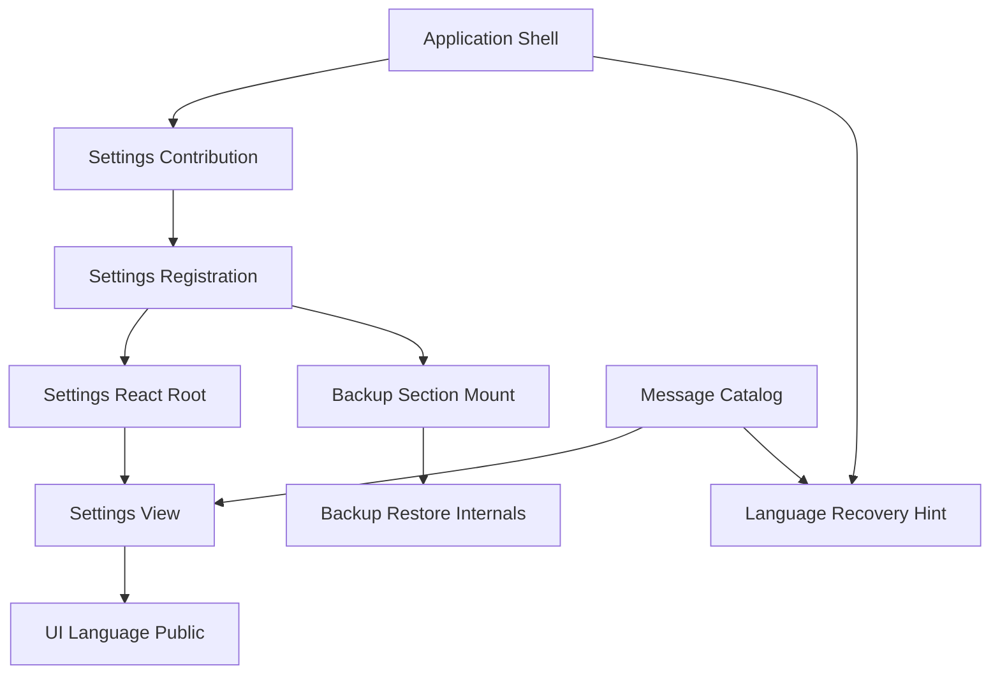
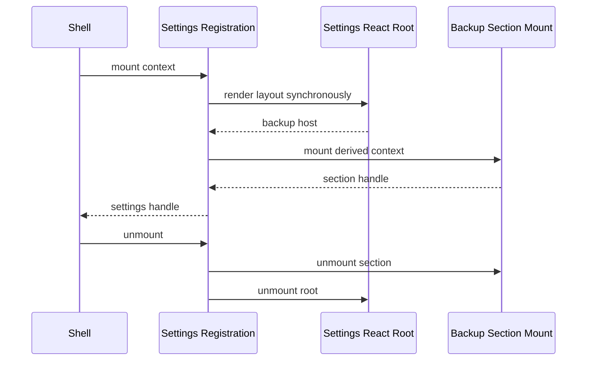
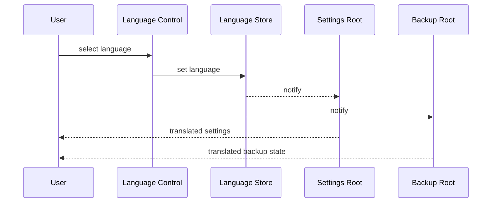

# Design Document

## Overview

本機能は、表示言語とバックアップ・復元を一つの常設設定画面へ集約し、狭いside panelのshellヘッダと常設navigationから低頻度操作を整理する。利用者は`settings` navigationから二つの区画へ到達し、既存の言語storeとbackup-restore業務契約をそのまま利用する。

settings featureは配置とlifecycle合成だけを所有する。表示言語の意味・保存は`ui-language`、交換形式・復元・maintenanceは`backup-restore`をcanonical ownerとして維持し、公開入口を越えて内部componentを参照しない。起動中または起動失敗中は操作不能なselectを残さず、`設定 / Settings`の二言語案内で回復後の操作場所を示す。

### Goals

- `settings`を常設featureとしてorder 60へ登録し、`backupRestore`の独立navigationを置換する
- `LanguageSelectControl`とbackup-restoreを同一画面の独立区画として合成する
- 言語変更でsettingsおよびbackup sectionを再mountせず、処理状態を保持する
- ready、maintenance、feature failure、loading、startup errorで要件に応じた到達性または案内を提供する
- 既存データ、backup交換形式、権限、storage、runtime契約を変更しない

### Non-Goals

- 言語解決・永続化、3言語目、メッセージカタログ構造の変更
- backup交換形式、復元手順、Foundation port、maintenance leaseの変更
- 汎用設定schema、設定項目registry、新しい設定項目
- 一過性surface契約またはproduct-capture移行の再設計
- side panel全体のUI刷新

## Boundary Commitments

### This Spec Owns

- `settings` persistent featureのregistration、navigation、画面layout、mount/unmount
- 言語区画とbackup-restore区画の配置、および区画間で状態を破棄しないlifecycle
- backup-restoreが公開するsection mount契約を受け入れ、設定画面内でhostとlifecycleを提供するconsumer境界
- shellヘッダの言語control撤去と、loading/startup error用の二言語案内
- 設定画面で必要となるメッセージの意味要件、表示場所、状態別の案内内容、および文言非依存locator
- application-shellが所有するproduction composition上の参照を、独立backup面から`settings`へ切り替えること

本specは利用者設定データを新たに所有しない。settingsは既存ownerの公開能力を配置するcomposition featureである。

### Out of Boundary

- `LanguageStore`、`LanguagePreferencePort`、初期言語解決、`document.lang`
- `BackupService`、`RestoreService`、`BackupRestoreState`、交換Envelope、file gateway
- `FoundationDataPort`の意味、schema version、atomic replacement、maintenance fencing
- `FeaturePresentation`、transient controller、product-captureの登録・起動・終了
- `BackupRestoreSectionMount`の実装、factory、backup内部root／state構築、および旧backup registration／contributionファイルの削除
- メッセージのexact key名、ja/en値、namespace shape、placeholder、parity、fallback、廃止key削除
- manifest権限、Chrome Storage key、runtime message、外部依存

### Allowed Dependencies

- `settings`は`application-shell/public.ts`のregistration／mount型、`ui-language/public.ts`の`LanguageProvider`と`LanguageSelectControl`、`backup-restore/public.ts`の`BackupRestoreSectionMount`、`ui-messages/public.ts`の型付きresolver／key契約だけを利用する
- `backup-restore`は既存どおり専用`FoundationDataPort`と自身の内部service/state/viewを利用する
- application shellのcomposition ownerだけが具体settings contributionとbackup section factoryを組み立てる
- `transient-feature-surface`完了後の明示的な常設／一過性判別共用体と、`product-capture-transient-migration`完了後の常設navigation集合を実装前提とする
- cross-feature deep import、DOM eventによる暗黙連携、settingsからstorage／Foundationへの直接到達を禁止する

### Revalidation Triggers

- `FeatureMountContext`、`FeatureMountHandle`、`FeaturePresentation`のshapeまたはmount失敗契約の変更
- `LanguageSelectControl`または`LanguageProvider`の公開契約、言語変更時のroot更新方式の変更
- `BackupRestoreSectionMount`を通さずbackup componentまたはstateを外部利用する変更
- `ui-message-catalog`が公開する設定／shell案内のkey、namespace、placeholder、fallback、parityまたは廃止key checkpointの変更
- settings以外の常設面へ言語controlを再配置する変更
- `settings`または`backupRestore` feature idを永続化する新しい機能の追加
- backup sectionのstateをReact root外へ移す変更、または復元時にside panel documentを再生成する変更
- 上流のpersistent navigation判定、order、初期選択、transient終了時fallbackの変更

## Architecture

### Existing Architecture Analysis

- shellは`SidePanelFeatureContributions`を唯一の具体feature catalogとして組み立て、navigationはregistrationのorderとpresentationから導出する。
- 言語controlはshell headerに直置きされるが、状態と保存は`ui-language`共有storeが所有する。
- backup-restoreは独立registrationが専用`fullDataPort`を受け、state/service/file gatewayとReact rootを内部で構成する。
- feature外のconsumerは`public.ts`だけを利用し、各React rootは自身の`root.unmount()`を所有する。

変更はこの構造を一般化せず、`backup-restore`が抽出する公開section portをsettings registrationが受け入れ、2つの表示能力を合成する形に限定する。

### Architecture Pattern & Boundary Map



**Architecture Integration**:

- **Selected pattern**: 公開mount portによるcomposition。settingsはsection hostとlifecycleだけを持つ。
- **Domain boundaries**: `ui-language`と`backup-restore`を並列の上流ownerとし、settingsから両者へ一方向に依存する。
- **Existing patterns preserved**: feature contribution、`public.ts`限定、React root所有、typed mount、catalog resolver、stable data locator。
- **New component rationale**: settings registration／viewは新しい利用者面、backup section portはcomponent横断importを避けるseam、shell recovery hintはsettingsへ到達不能な状態だけを補う。
- **Steering compliance**: `any`なし、storage直アクセスなし、CSP／権限不変、共有runtime入口をfeatureから編集しない。

### Dependency Direction

```text
application-shell public contracts + ui-language public + backup-restore public
    ↓
settings feature contribution and registration
    ↓
settings React root and view
    ↓
application-shell composition
```

物理compositionはapplication shellがsettingsをimportするが、settingsの業務依存は上流公開契約だけに限定する。backup-restore内部はsettingsを参照しない。

### Technology Stack

| Layer | Choice / Version | Role in Feature | Notes |
|---|---|---|---|
| Frontend | React 19.2.7 / React DOM 19.2.7 | settings layout、言語control、独立backup rootの合成 | 既存固定版。新規依存なし |
| Language | ui-language / ui-messages既存公開契約 | store連動controlとja/en文言 | 保存・解決ロジック不変 |
| Feature service | TypeScript 7.0.2 strict | typed section mountとregistration | `any`禁止 |
| Data | FoundationDataPort既存契約 | backup sectionへcomposition ownerから供給 | settingsは参照しない |
| Runtime | Application shell persistent registration | navigation、mount、error rollback | transient契約は利用区分だけ |
| Validation | node:test / testing-library / Playwright | contract、DOM、integration、production E2E | 既存runnerを継続 |

## File Structure Plan

### Directory Structure

```text
src/features/settings/
  feature-contribution.ts       # SettingsFeatureContribution
  registration.ts               # SettingsFeatureRegistration
  react-root.tsx                # SettingsReactRootAdapter
  view.tsx                      # SettingsView
  styles.css                    # settings区画layout
  public.ts                     # settings idとfactoryの公開入口
tests/features/settings/
  registration.test.tsx
  view.test.tsx
  integration.test.tsx
e2e/
  settings-screen.spec.ts       # SettingsMessageConsumerAndLocatorContractの主要E2E
```

### Modified Files

- `src/application-shell/side-panel-contributions.ts` — `BackupRestoreContribution`を`SettingsFeatureContribution`へ置換し、上流移行後のtupleへsettingsを追加する
- `src/application-shell/shell-view.tsx` — headerの`LanguageSelectControl`を撤去し、`ShellLanguageRecoverySurface`をloading/errorへ表示する
- `src/application-shell/shell-view.css` — 空header行を除去し、二言語案内のstatus layoutを定義する
- `src/application-shell/nav-icons.tsx` — settings用の同梱gear glyphを追加する
- `e2e/locators.ts` — settings root／section locatorを追加し、`languageSelect`をsettings scopeへ変更する
- `e2e/backup-restore.spec.ts` — settings navigation経由へ変更する
- `e2e/english-ui.spec.ts` — settingsで言語変更し、独立backup feature期待を削除する
- `e2e/language-behavior-invariance.spec.ts` — settings mount維持とbackup state維持を検証する
- `tests/application-shell/shell-view.test.tsx` — header撤去、状態別案内、settings navigation到達を固定する
- `tests/application-shell/feature-contribution-catalog.test.ts` — persistent/transient混在後のsettings orderを固定する
- `tests/runtime/root-public-api.test.ts`, `tests/tooling/build-smoke.test.ts` — root key／production catalogを`settings`へ更新する
- `scripts/validate-boundaries.mjs` — settingsから許可する公開依存とbackup deep import拒否を検証する

`BackupRestoreSectionMount`の実装・公開と旧backup registration／contributionの削除は`backup-restore`のFile Structure Planが所有する。catalog dataとその検証ファイルは`ui-message-catalog`のFile Structure Planが所有し、本specのfile planへ重複計上しない。

## System Flows

### Settings Mount and Cleanup



backup mountが失敗した場合、settings rootを解放して例外をshellへ返す。shellは既存のmount失敗・rollbackを使用し、部分表示を成功扱いしない。unmountは冪等で、取得済みresourceだけを逆順に解放する。

### Language Change



registration、settings root、backup rootは再生成しない。backup host DOM identityを維持し、file input後のticket、確認、busy、result stateを保持する。

## Requirements Traceability

| Requirement | Summary | Components | Interfaces | Flows |
|---|---|---|---|---|
| 1.1 | settings navigation | SettingsFeatureContribution, SettingsFeatureRegistration, SettingsMessageConsumerAndLocatorContract | ApplicationFeatureRegistration | Settings Mount |
| 1.2 | 2区画の同一画面 | SettingsView, SettingsFeatureRegistration | SettingsViewProps, BackupRestoreSectionMount | Settings Mount |
| 1.3 | header control撤去 | ShellLanguageRecoverySurface | ShellViewProps | State Presentation |
| 1.4 | backup独立nav撤去 | SettingsFeatureContribution | SidePanelFeatureContributions | Settings Mount |
| 1.5 | 区画見出し | SettingsView, SettingsMessageConsumerAndLocatorContract | MessageKey | Settings Mount |
| 2.1 | ja/en選択 | SettingsView | LanguageSelectControl | Language Change |
| 2.2 | endonymと選択状態 | SettingsView | LanguageSelectControl | Language Change |
| 2.3 | 即時文言反映 | SettingsView, SettingsMessageConsumerAndLocatorContract | LanguageStore subscription | Language Change |
| 2.4 | settings非再mount | SettingsReactRootAdapter, SettingsFeatureRegistration | FeatureMountHandle | Language Change |
| 2.5 | 業務データ不変 | SettingsFeatureRegistration | read-only language integration | Language Change |
| 2.6 | 保存失敗時継続 | SettingsView | ui-language public behavior | Language Change |
| 3.1 | ready／maintenance到達 | SettingsFeatureContribution, ShellLanguageRecoverySurface | persistent navigation | State Presentation |
| 3.2 | maintenance中の言語変更 | SettingsView, SettingsFeatureRegistration | OperationPolicy | Language Change |
| 3.3 | feature failureから移動 | ShellLanguageRecoverySurface | ShellNavigation | State Presentation |
| 3.4 | loadingの二言語案内 | ShellLanguageRecoverySurface, SettingsMessageConsumerAndLocatorContract | MessageKey | State Presentation |
| 3.5 | startup error案内 | ShellLanguageRecoverySurface, SettingsMessageConsumerAndLocatorContract | MessageKey, retry callback | State Presentation |
| 3.6 | 無効control非表示 | ShellLanguageRecoverySurface | ShellViewState | State Presentation |
| 4.1 | 既存backup操作 | SettingsFeatureRegistration | BackupRestoreSectionMount | Settings Mount |
| 4.2 | backup契約不変 | SettingsFeatureRegistration | BackupRestoreSectionMount | Settings Mount |
| 4.3 | maintenance可否維持 | SettingsFeatureRegistration | OperationPolicy | Settings Mount |
| 4.4 | 既存errorと再試行 | SettingsFeatureRegistration | BackupRestoreSectionMount | Settings Mount |
| 4.5 | 復元後の言語保持 | SettingsReactRootAdapter, SettingsFeatureRegistration | LanguageStore subscription | Language Change |
| 4.6 | backup state保持 | SettingsReactRootAdapter, SettingsFeatureRegistration | FeatureMountHandle | Language Change |
| 5.1 | 既存データ互換 | SettingsFeatureContribution, SettingsFeatureRegistration | unchanged public contracts | Settings Mount |
| 5.2 | navigation非重複 | SettingsFeatureContribution, SettingsMessageConsumerAndLocatorContract | SidePanelFeatureContributions | Settings Mount |
| 5.3 | navigationと画面の同一言語 | SettingsView, SettingsMessageConsumerAndLocatorContract | MessageResolver | Language Change |
| 5.4 | ja/en能力同等 | SettingsView, SettingsFeatureRegistration, SettingsMessageConsumerAndLocatorContract | catalog public contract | Language Change |
| 5.5 | persistent扱い | SettingsFeatureRegistration | FeaturePresentation | Settings Mount |
| 6.1 | stable locator | SettingsMessageConsumerAndLocatorContract | data-region, data-feature-id | E2E |
| 6.2 | 言語E2E | SettingsMessageConsumerAndLocatorContract, SettingsView | E2E locators | Language Change |
| 6.3 | backup E2E | SettingsMessageConsumerAndLocatorContract, SettingsFeatureRegistration | E2E locators | Settings Mount |
| 6.4 | 非再mount統合検証 | SettingsReactRootAdapter, SettingsFeatureRegistration | test mount handles | Language Change |
| 6.5 | shell状態検証 | ShellLanguageRecoverySurface | ShellViewState | State Presentation |
| 6.6 | 完全gate | SettingsMessageConsumerAndLocatorContract | validation scripts | 全flow |

## Components and Interfaces

| Component | Domain/Layer | Intent | Req Coverage | Key Dependencies | Contracts |
|---|---|---|---|---|---|
| SettingsFeatureContribution | Composition | settingsとbackup sectionを具体依存から組み立てる | 1.1, 1.4, 5.1, 5.2 | FeatureCompositionContext P0, BackupRestore public P0 | Service |
| SettingsFeatureRegistration | Feature lifecycle | persistent settings registrationと協調mountを所有する | 1.1, 2.4, 2.5, 3.1, 5.5 | SettingsReactRootAdapter P0, BackupRestoreSectionMount P0 | Service, State |
| SettingsReactRootAdapter | UI adapter | layout rootとbackup hostを同期renderしcleanupする | 2.4, 4.5, 4.6, 6.4 | React DOM P0, SettingsView P0 | Service |
| SettingsView | Presentation | 言語区画、backup区画、stable hostを描画する | 1.2, 1.5, 2.1, 2.2, 2.3, 2.6, 3.2, 5.3, 5.4 | ui-language public P0, ui-messages public P0 | State |
| ShellLanguageRecoverySurface | Shell presentation | header撤去と状態別の到達／二言語案内を提供する | 1.3, 3.1, 3.3, 3.4, 3.5, 3.6, 6.5 | ShellViewState P0, MessageResolver P1 | State |
| SettingsMessageConsumerAndLocatorContract | Presentation and validation | semantic message要件・consumer位置・observable guidanceと文言非依存識別子を固定する | 1.5, 2.3, 3.4, 3.5, 5.2, 5.3, 5.4, 6.1, 6.2, 6.3, 6.6 | ui-messages public P0, Playwright P1 | API |

### Composition Layer

#### SettingsFeatureContribution

| Field | Detail |
|---|---|
| Intent | composition ownerからcanonical backup section mountを受け取り、settings contributionを返す |
| Requirements | 1.1, 1.4, 5.1, 5.2 |

**Responsibilities & Constraints**

- application compositionが`backup-restore/public.ts`から構成した`BackupRestoreSectionMount`を依存として受け取り、settings registrationへ注入する。
- settings feature内へ`FoundationDataPort`、backup factory依存、backup stateを公開しない。
- contribution key、registration id、root public keyを`settings`へ統一する。
- 上流移行後のproduct-capture contributionはtupleに残すが、transientであるためnavigation期待へ含めない。

**Dependencies**

- Inbound: ApplicationComposition — concrete catalogと公開section mountの構築（P0）
- Outbound: BackupRestore public — section mount contract（P0）
- Outbound: SettingsFeatureRegistration — registration factory（P0）

**Contracts**: Service [x] / API [ ] / Event [ ] / Batch [ ] / State [ ]

```typescript
export const settingsContributionKey = "settings";

export type SettingsContribution = FeatureContribution<
  typeof settingsContributionKey,
  SettingsPublicApi
>;

export function createSettingsContribution(
  context: FeatureCompositionContext,
): SettingsContribution;
```

- Preconditions: 注入されたsection mountは`backup-restore` task 6.1の公開contract testを通過している。
- Postconditions: settingsだけがorder 60のpersistent navigationとしてbackup能力を提示する。
- Invariants: backup capabilityはsettings public APIへ露出しない。

#### SettingsFeatureRegistration

| Field | Detail |
|---|---|
| Intent | settings id、navigation metadata、mount transaction、idempotent cleanupを所有する |
| Requirements | 1.1, 2.4, 2.5, 3.1, 5.5 |

**Responsibilities & Constraints**

- `id: settings`、`presentation: "persistent"`、`navigation: { labelKey: "nav.settings", order: 60, icon: "settings" }`を明示して返す。
- canonical `PersistentApplicationFeatureRegistration`を直接消費し、transient lifecycle portへ依存しない。
- settings rootを同期renderし、取得したhostへbackup section mountをawaitする。
- backup mount失敗時はsettings rootをcleanupして失敗をshellへ伝播する。
- 正常unmountはbackup handle、settings rootの順で一度だけ行う。

**Dependencies**

- Inbound: FeatureRegistry / SidePanelHost — mount lifecycle（P0）
- Outbound: SettingsReactRootAdapter — layout root（P0）
- Outbound: BackupRestoreSectionMount — embedded capability（P0）

**Contracts**: Service [x] / API [ ] / Event [ ] / Batch [ ] / State [x]

```typescript
export type SettingsPublicApi = Record<string, never>;

export interface SettingsRegistrationDependencies {
  readonly backupRestore: BackupRestoreSectionMount;
  readonly getAvailability?: () => Availability;
  readonly subscribeAvailability?: (
    listener: (availability: Availability) => void,
  ) => () => void;
}

export function createSettingsFeatureRegistration(
  dependencies: SettingsRegistrationDependencies,
): PersistentApplicationFeatureRegistration<SettingsPublicApi>;
```

**State Management**

- State model: `unmounted | root-mounted | section-mounted | disposed`を関数内resource取得状態として管理する。
- Persistence: なし。
- Concurrency: shellがmount transitionを直列化し、handleの`unmount`は内部flagで冪等にする。

### UI Layer

#### SettingsReactRootAdapter

| Field | Detail |
|---|---|
| Intent | React rootを同期確定し、backup hostを型付きでregistrationへ返す |
| Requirements | 2.4, 4.5, 4.6, 6.4 |

**Responsibilities & Constraints**

- `LanguageProvider`配下に`SettingsView`をrenderする。
- 既存利用例と同じ`flushSync`で初回renderを完了し、`[data-region="backup-restore-host"]`を検証して返す。
- 言語変更時にもhost elementを置換しない。
- root cleanupでcontainerを空にし、二重unmountを無害化する。

**Dependencies**

- Outbound: React 19.2.7 / React DOM 19.2.7 — root lifecycle（P0）
- Outbound: SettingsView — layout（P0）
- Outbound: ui-language public — provider（P0）

**Contracts**: Service [x] / API [ ] / Event [ ] / Batch [ ] / State [ ]

```typescript
export interface SettingsReactRoot {
  readonly backupRestoreHost: HTMLElement;
  unmount(): void;
}

export function mountSettingsReactRoot(
  container: HTMLElement,
): SettingsReactRoot;
```

- Postconditions: 成功時はhostがcontainer内に一つ存在する。
- Invariants: host identityはrootの寿命中不変である。

#### SettingsView

| Field | Detail |
|---|---|
| Intent | settings title、language section、backup section hostを意味順に描画する |
| Requirements | 1.2, 1.5, 2.1, 2.2, 2.3, 2.6, 3.2, 5.3, 5.4 |

summary-only presentation componentとする。`data-region="settings"`、`language`、`backup-restore`、`backup-restore-host`を固定し、自然言語をselectorへ使わない。見出し階層はsettings titleを`h2`、区画を`h3`とし、backup内部のexport／restore見出しは一段下げる。`LanguageSelectControl`以外の設定stateを持たない。

### Backup Feature Public Contract Consumption

`BackupRestoreSectionMount`の型、factory、内部state/root構築、mount失敗時cleanupは`backup-restore`がcanonical ownerとして定義・実装する。本specは`backup-restore/public.ts`から提供されたmount objectを受け取り、空の`backupRestoreHost`と既存`FeatureMountContext`を渡し、返された`FeatureMountHandle`をsettings lifecycleの一資源として保持するだけである。

- Preconditions: `backup-restore` task 6.1が公開mount契約とcontract testを完成していること。
- Postconditions: settings mount成功時は公開sectionがhost内に一つ存在し、settings unmountは返されたhandleをsettings rootより先に一度だけ解放する。
- Invariants: settingsはbackupのfactory依存、`FoundationDataPort`、state、service、error code、交換形式を解釈・再実装しない。
- Cleanup ownership: settings composition切替後の旧backup registration／contribution削除は`backup-restore` task 6.2が行う。

### Shell and Validation

#### ShellLanguageRecoverySurface

| Field | Detail |
|---|---|
| Intent | settingsへ直接到達できる状態とできない状態を誤認なく提示する |
| Requirements | 1.3, 3.1, 3.3, 3.4, 3.5, 3.6, 6.5 |

summary-only shell presentationとする。header領域そのものを削除し、navigation利用可能時は既存persistent navigationからsettingsへ到達させる。loadingとglobal error status内だけに`設定 / Settings`を含むcatalog messageを表示する。feature-local error boundaryではnavigationを維持する。selectはsettings view以外にrenderしない。

#### SettingsMessageConsumerAndLocatorContract

| Field | Detail |
|---|---|
| Intent | 設定画面が必要とする意味・表示場所・状態別案内を定め、公開catalog契約と文言非依存識別子を利用する |
| Requirements | 1.5, 2.3, 3.4, 3.5, 5.2, 5.3, 5.4, 6.1, 6.2, 6.3, 6.6 |

**Responsibilities & Constraints**

- settings title、表示言語区画、backup区画、navigation label、loading／startup failure案内というsemantic message要件とconsumer位置を定める。
- viewとshell surfaceは`ui-messages/public.ts`の型付きkey／resolverだけを利用し、catalog定数、ja/en値、namespace構造を直接importしない。
- exact key名、ja/en値、namespace shape、placeholder、parity、fallback、legacy key削除は`ui-message-catalog`の公開契約と検証結果を受け入れる。
- recovery guidanceは現在言語にかかわらず「設定 / Settings」と利用可能な回復操作を判別できることをDOM上で検証する。
- E2Eは`data-feature-id="settings"`と`data-region`／`data-action`だけで要素を特定する。

**Contracts**: Service [ ] / API [x] / Event [ ] / Batch [ ] / State [ ]

| Identifier | Value | Purpose |
|---|---|---|
| feature id | `settings` | shell rootとnavigation |
| page region | `settings` | settings scope |
| language region | `language` | language section |
| backup region | `backup-restore` | embedded capability scope |
| backup host | `backup-restore-host` | nested root lifecycle |
| language select | `language-select` | existing control contract |

## Data Models

### Domain Model

新しいdomain entity、永続設定schema、eventは追加しない。

- 表示言語は既存`LanguageStore`とpreference storeが所有する。
- backup交換データは既存`BackupEnvelope`とFoundation rootが所有する。
- `settings`／`backupRestore` feature idは永続化しない。既存storage、backup JSON、schema versionに変更はない。

### Data Contracts & Integration

- settingsとui-languageの境界は`LanguageSelectControl`の操作だけであり、言語codeをsettings stateへ複製しない。
- settingsとbackup-restoreの境界は`BackupRestoreSectionMount.mount(FeatureMountContext)`だけであり、backup state payloadを交換しない。
- feature id変更はruntime composition contractのみで、利用者データmigrationを発生させない。

## Error Handling

### Error Strategy

- settings root render失敗: shellの既存`mount_failed`へ伝播し、前featureへのrollbackを使用する。
- backup section mount失敗: 取得済みsettings rootをcleanupしてから同じmount失敗経路へ伝播し、空の設定画面を残さない。
- cleanup失敗: backup、settings双方のcleanupを試行し、複数失敗は既存shell診断へ集約する。利用者データは変更しない。
- language保存失敗: ui-language既存方針どおりin-memory選択を維持し、settings mountやbackup stateを失敗させない。
- backup／restore失敗: 既存分類とstateをsection内に維持する。settingsはerror codeを解釈しない。
- startup failure: settingsをmount可能と偽らず、二言語hintと既存retryだけを提示する。

### Monitoring

新しい外部監視は追加しない。診断はstable codeだけを既存`reportError`へ渡し、file名、URL、保存内容、例外dumpを出さない。

## Testing Strategy

### Unit and Contract Tests

1. `SettingsFeatureRegistration`がid `settings`、`presentation: "persistent"`、`nav.settings`、order 60、gear icon、空public APIを返し、availability購読を透過すること（1.1, 5.5）。
2. `SettingsFeatureRegistration`が公開`BackupRestoreSectionMount`へhost付きcontextを渡し、返されたhandleをsettings rootより先に一度だけcleanupすること（4.1, 4.2, 4.3）。
3. backup mount失敗時にsettings rootがcleanupされ、成功handleが返らないこと（6.4）。
4. `ui-message-catalog`の公開resolverがsettings各consumerのsemantic messageと二言語recovery guidanceを解決でき、同specのparity／dead-key gateを再実行して成功すること（5.2, 5.4）。
5. boundary validatorがsettingsからbackup内部へのdeep import、storage、Foundation直接参照を拒否すること（5.1, 6.6）。

### DOM Tests

1. `SettingsView`がsettings、language、backup-restore、backup-restore-hostを一つずつ描画し、language selectがsettings内だけに存在すること（1.2, 1.3, 1.5, 2.1）。
2. 言語変更でsettings rootとbackup host identityが変わらず、見出しとnavigation messageだけが更新されること（2.3, 2.4）。
3. backup confirmation中の言語変更でticket、preview、file由来stateが保持され、文言だけが変わること（4.5, 4.6）。
4. ShellViewのloading／global errorで二言語hint、ready／maintenance／feature failureでsettings navigation、全状態でheader selectなしを確認すること（3.1〜3.6）。
5. 未信頼のbackup path／file名が従来どおりtextとして描画され、settings wrapperでHTMLとして解釈されないこと（4.4）。

### Integration Tests

1. productionと同じside panel contributionsがcandidate、current-build、transient capture、compatibility、settingsを組み立て、persistent navigationにsettingsを一度だけ含むこと（1.1, 1.4, 5.2, 5.5）。
2. application compositionがcanonical backup section factoryへだけfullDataPortを渡し、settingsへは完成済みmount contractだけを注入してexport／preflight／confirm／restoreへ到達できること（4.1〜4.4）。
3. maintenance中もsettingsへ移動して言語変更でき、backup mutation可否は既存OperationPolicyに従うこと（3.1, 3.2, 4.3）。
4. settingsから別persistent featureまたはtransient surfaceへ移動すると、backup rootとsettings rootが逆順cleanupされ購読が残らないこと（5.5, 6.4）。
5. root public API snapshotとbuild smokeが`settings`を含み、`backupRestore`独立entryを含まないこと（5.2, 6.6）。

### E2E Tests

1. `settings` navigationを選択し、同一画面でlanguage／backup／restore区画へ到達すること（1.1, 1.2, 6.1）。
2. settingsで英語へ切り替えるとnavigationと両区画が即時に英語となり、side panel再open後も英語が保持されること（2.1〜2.6, 6.2）。
3. settingsからbackup JSONを作成し、架空データのpreflight、確認、restore、英語summaryまで完了すること（4.1〜4.5, 6.3）。
4. confirmation表示中に言語を切り替えても確認状態が残り、confirm／cancelが継続できること（4.6, 6.4）。
5. product-captureが常設navigationに存在せず、settingsがpersistent fallback／選択先として一過性surface終了と両立すること（5.5）。

### Validation Gate

- 局所検証: `pnpm typecheck`, 関連node:test、`pnpm validate:boundaries`, 関連Playwright spec。
- 最終検証: `pnpm validate`。typecheck、public consumer、Biome、boundary、fixture、UI text、final build、unit／integration／DOM、E2Eを全て通す。

## Security Considerations

- 新しい権限、storage key、runtime message、remote asset、HTML注入経路を追加しない。
- settingsはbackup file内容、path、URL、保存データを読み取らず、backup ownerが既存検証と安全なJSX text描画を継続する。
- gear iconは既存`nav-icons.tsx`の同梱SVG pathとして実装し、外部assetを参照しない。
- `LanguageSelectControl`とmessage catalogは静的公開契約を利用し、`innerHTML`／`dangerouslySetInnerHTML`を導入しない。

## Migration Strategy

schemaまたは利用者データmigrationはない。実装順をcontract migrationとして管理する。

1. 上流`transient-feature-surface`と`product-capture-transient-migration`のapproved contractを実装前提として確認する。
2. `backup-restore` task 6.1でsection mount portを追加し、独立registrationと同じ挙動をcontract testで固定する。
3. `ui-message-catalog`がsemantic message要件をexact key、ja/en値、namespace、placeholder／parity契約へ写像し、公開resolverから利用可能にする。
4. settings featureを追加し、shell header／navigation／locator／E2Eのsettings-owned consumerとcomposition参照を切り替える。
5. `backup-restore` task 6.2で、settings composition切替後にbackup-owned独立registration／contribution／公開surfaceを削除する。
6. catalog ownerのdead-key gate、application composition snapshot、root API、完全gateを再実行し、legacy consumerが残らないことを確認する。

依存順は`backup-restore 6.1` → `settings-screen consumer/composition` → `backup-restore 6.2 cleanup`で固定し、settingsから6.2への先行依存は置かない。rollbackが必要な場合は各ownerの変更単位でconsumer composition、catalog contract、backup legacy surfaceを整合するcheckpointへ戻す。storageとbackupデータは変更しないためデータrollbackは不要である。
