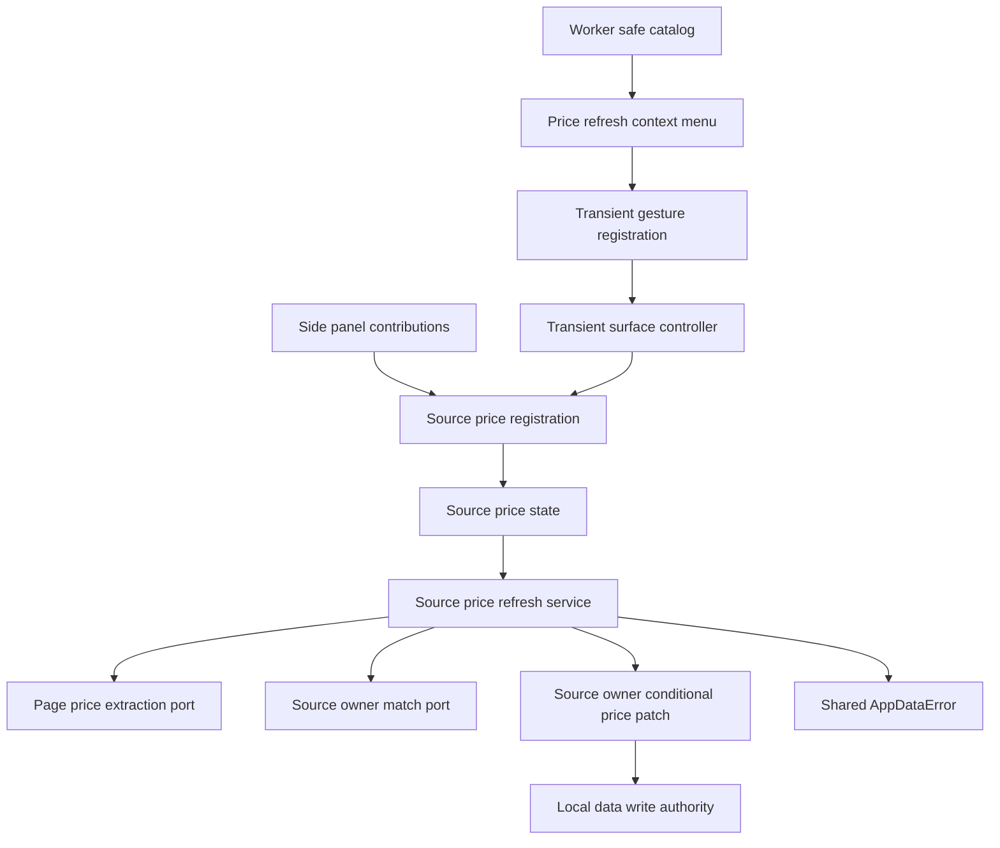
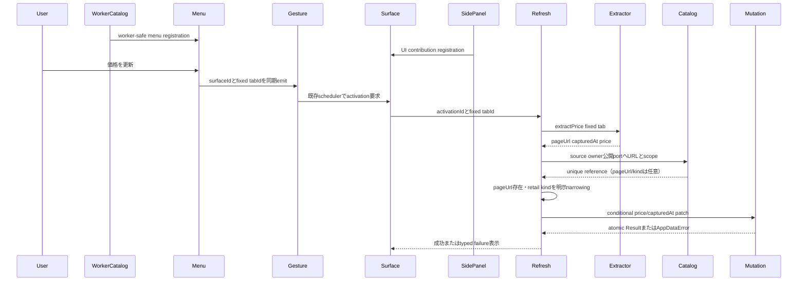
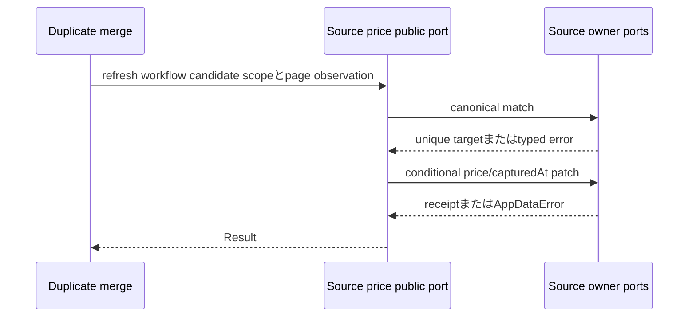

# 設計文書

## 概要

本機能は、保存済み販売ページのコンテキストメニューから一回の操作で価格を再取得し、source ownerの公開match portが一意に特定した `CandidateSource` の `price` と `capturedAt` だけを公開conditional patch portで更新する。一過性面は進行・成功・失敗を表示し、権限付与gestureと実行を分離しない。

価格取得workflowはcontext menu経路と同一URL再取り込み経路から共用する。URL identity・catalog matcher・ambiguity・conditional patch、共有data error、抽出規則、一過性起動storeはそれぞれの上流ownerが提供する狭いpublic portへ委譲する。

### 目標

- context menu clickから現行の固定tab・起動世代だけを自動更新する。
- source ownerのcanonical match結果で一意の販売sourceを特定し、曖昧さをfail closedにする。
- 商品取り込みと同じ価格抽出・正規化・provenanceを再利用する。
- source価格と取得日時を一回の候補aggregate mutationで更新する。
- primary projection、旧価格保全、権限・fixture・worker境界を自動検証する。

### 非目標

- 定期巡回、価格履歴、在庫監視、通貨換算。
- source追加・削除・primary決定、同一商品検知、merge UX。
- 抽出priority・price parser、一過性store/schedulerの再定義。
- manufacturer sourceやURL不一致ページからの価格更新。
- URL identity・source matcher/ambiguity・candidate mutation、共有`AppDataError`のcanonical定義、application shell composition。

## Change Integration

- **Change Brief**: `v0.5.0-boundary-reconciliation`
- **In scope**: source public match/conditional patch seamのconsumer化、`ManagementError` import撤去、共有`AppDataError` mapping、unit/contract/runtime/UI/E2E非回帰。
- **Out of scope**: canonical URL identity、source core/policy/ambiguity、candidate mutation、error vocabulary/mappingの意味・粒度、価格抽出/正規化、監視/履歴、shell production composition、UI layout。
- **Preserved behavior**: explicit action、activeTab、固定tab/世代、price-only patch、失敗時旧値保持、primary projection、transient result UI。

## 境界コミットメント

### 本specが所有するもの

- `source-price-refresh` featureの一過性登録、状態、表示、公開API。
- context menu項目のID、表示範囲、click sourceとproduction登録。
- source ownerの公開match/conditional patch portを順序付けるprice observation workflowとtyped error mapping。
- 共有`AppDataError`から既存`SourcePriceRefreshError`表示結果へのconsumer mapping。
- `contextMenus` permissionの限定追加とartifact permission gate更新。
- feature固有のunit、integration、runtime、DOM、E2E検証。

### 境界外

- URL identity、catalog/candidate scope、一意照合、ambiguity、source policy、conditional patchのcanonical実装と公開型はsource ownerが所有する。
- `AppDataError` vocabularyと低位errorからのcanonical mappingは`local-data-foundation`が所有する。
- application shellのside panel/worker production compositionと遅延proxyはshell ownerが所有する。
- `CandidateSource`、`CandidateSourceId`、`primarySourceId`、priceの形状と保存invariantは `candidate-source-bookmarks` が所有する。
- price抽出、rank、normalization、pageUrl provenanceは `product-page-capture` が所有する。
- gesture sequence、activation store、side panel open、tab失効、戻り先は `transient-feature-surface` が所有する。
- same-product判定とmerge提示は `duplicate-product-merge` が所有する。
- context menu以外の新しい起動gesture、履歴・通知・定期処理は所有しない。

### 許可する依存

- `application-shell/public.ts` 公開の `ActivationId`、`FeatureId`、`TargetTabId`、`parseTargetTabId`、`TransientActivationRequest`、`TransientSurfaceLifecyclePort`、`TransientGestureRegistrationPort`。
- `application-shell/worker-public.ts` 公開のworker-safeなgesture registration契約。worker consumerはUI向け `application-shell/public.ts` をruntime importしない。
- source owner公開入口の `CandidateSourceMatcherPort` と `SourcePricePatchContract`。candidate-managementのsource proxyまたは内部moduleへ依存しない。
- `local-data-foundation`のdomain公開入口から提供される`AppDataError`。`ManagementError`、`FoundationError`、owner-local mapperへ依存しない。
- `product-capture/public.ts` 公開の `ProductCapturePublicApi.pagePriceExtraction: PagePriceExtractionPort`。
- canonical `Result<T, E>`、`CandidatePartId`、`CandidateSourceId`、`SourcedValue<MoneyValue>`、`UtcTimestamp`。
- Chrome 116 MV3の `chrome.contextMenus`、既存 `activeTab` / `scripting` / `sidePanel`、標準 `URL`。
- React 19、TypeScript 7 strict、既存message catalog、Node test runner、Playwright。

### 確定済み上流契約

下流consumer向けの3つのseamは各producer specで定義・承認済みであり、いずれのspecも `ready_for_implementation: true` である。本specはこれらを解決済み依存として扱う。純粋なURL照合・use case・stateは確定済み契約のtest doubleで着手でき、production統合だけをproducer側実装タスクの完了後に行う。

1. source owner: catalog/candidate scopeを受ける公開`CandidateSourceMatcherPort`がcanonical URL identityと0/1/manyを判定して任意source referenceを返し、`SourcePricePatchContract`がraw `pageUrl`と`kind: "retail"`をpreconditionとしてprice/capturedAtだけを条件付き更新する。本featureの`SourcePublicPortAdapter`はunique referenceのpageUrl存在とretail kindを明示narrowingし、欠損・非retailを`ineligible-source`へfail closedにする。production cutover後、本featureはcandidate-management proxy、source reference走査、URL正規化を所有しない。
2. `transient-feature-surface`: `TransientGestureRegistrationPort.register(source)` と `TransientGestureSource.start(emit)` は同期 `Result<() => void, TransientGestureRegistrationError>` 契約であり、`parseTargetTabId` で検証した固定tabだけをemitする。store writer、sequence割当、panel openerは非公開である。
3. `product-page-capture`: `ProductCapturePublicApi.pagePriceExtraction` が `PagePriceExtractionPort.extractPrice(TargetTabId)` を公開し、page-derived URL、canonical取得時点、任意のprice provenanceを `PagePriceObservation` として返す。既存extractor/ranker/normalizerはproducer内部に留まる。

foundation root read、candidate-management source proxy、shell store、product-capture内部moduleへの迂回依存は禁止する。data operation failureはfoundation公開入口の`AppDataError`を直接消費する。

### 再検証トリガー

- 確定済み3portのshape、error union、ownerまたは公開入口が変わる場合。
- `CandidateSource` のURL、kind、price、capturedAt、ID、primary導出が変わる場合。
- source ownerのmatch/patch shape、URL identity、tracking key集合、query保持、scopeまたはambiguity規則が変わる場合。
- `AppDataError`のpublic union、variant payload、mappingまたは公開入口が変わる場合。
- transient gestureの同期性、`activeTab` 付与、activation payload、tab失効規則が変わる場合。
- manifest permission allowlist、Chrome contextMenus permission要件、worker composition ownerが変わる場合。
- `side-panel-contributions.ts` のUI contribution factory境界、または `feature-contribution-catalog.ts` のworker-safe制約が変わる場合。

### 依存方向

```text
canonical domain + source match/patch + AppDataError public contracts
    ↓
price refresh service + public API
    ↓
transient state + view + side panel registration

worker-safe menu adapter + worker composition
    ↓
transient gesture port
```

featureのUI/consumer graphはsource owner、foundation domain、product-capture、application-shellの各public入口だけをimportし、worker graphは `application-shell/worker-public.ts` だけをshell runtime入口としてimportする。本specはfeature contributionとworker-safe menu registrationを公開するだけで、`side-panel-contributions.ts`、`feature-contribution-catalog.ts`、production compositionを編集しない。context menu adapterはsource-price-refresh内に留まり、DOM/Reactへ依存しない。

## アーキテクチャ

### 既存アーキテクチャ分析

- product-captureの注入adapterは固定tabとpage-derived URLを照合し、extractor、normalizer、rankerを分離済みである。
- candidate-managementはsource aggregateを単一write authorityへ渡し、public mutation portがrevision contextをconsumerから隠す。
- transient surfaceはfeature registrationとactivation世代をapplication shellへ統合し、別gesture経路にも同じ起動規則を要求する。
- application shellはUI contributionの唯一の集約点を `side-panel-contributions.ts`、worker-safeなcontribution型・worker registrationの集約点を `feature-contribution-catalog.ts` として分離している。
- 現行manifestとartifact validatorは `storage / activeTab / scripting / sidePanel` だけを許可しており、`contextMenus` を同じexact allowlistへ加える必要がある。

### アーキテクチャパターンと境界マップ



**統合判断**:

- 選択パターンはfeature use case + ports and adaptersである。
- source-price-refreshは価格取得workflowと表示だけを所有し、URL同一性・source match/patch・永続domain・共有error・gesture lifecycleを上流へ戻す。
- source-price-refreshのUI registration factoryはside panel専用graphへ登録し、worker-safe catalogにはmenu worker registrationだけを載せる。
- context menu adapterはworker内でDOM/Reactをimportせず、click callback中にupstream gesture sourceへtabIdを同期emitする。
- 新規library、network、alarm、host permissionを追加しない。

### 技術スタック

| 層 | 選択・版 | 本機能での役割 | 備考 |
|---|---|---|---|
| UI | React 19 / 既存shell UI資産 | 一過性の進行・成功・失敗表示 | feature固有CSSなし、stateはReact外 |
| 言語 | TypeScript 7 strict / ESM NodeNext | URL brand、port、error union | `any`禁止 |
| Domain/Data | candidate source schema 2 / write authority | source priceとcapturedAtの原子的更新 | schema変更なし |
| Runtime | Chrome 116 MV3 contextMenus / activeTab / scripting / sidePanel | gesture、固定tab抽出、panel表示 | `contextMenus` permission追加 |
| 検証 | node:test / testing-library / Playwright | unit、contract、DOM、E2E | 架空 `.invalid` dataのみ |

## ファイル構成計画

### ディレクトリ構成

```text
src/
├── features/source-price-refresh/
│   ├── contracts.ts                    # receipt、workflow error、state契約
│   ├── source-port-adapter.ts          # canonical match/patchとAppDataErrorのconsumer adapter
│   ├── service.ts                      # extraction、stale gate、atomic update use case
│   ├── state.ts                        # activationごとのrunning/succeeded/failed
│   ├── view.tsx                        # 進行・結果・回復案内
│   ├── react-root.tsx                  # feature-owned mount/unmount
│   ├── context-menu-source.ts          # Chrome menu itemとgesture source adapter
│   ├── feature-id.ts                   # UI/workerで共有するFeatureId定数
│   ├── registration.ts                 # transient activation validatorとmount
│   ├── feature-contribution.ts         # portsを組み立てるfeature contribution
│   ├── public.ts                       # UI/隣接consumer向けprice refresh workflow公開入口
│   └── worker-public.ts                # worker consumer向けmenu registration唯一の公開入口
├── ui-messages/catalog/
    ├── ja/source-price-refresh.ts       # 日本語の進行・成功・失敗・menu label
    ├── en/source-price-refresh.ts       # 同一keyの英語文言
    ├── ja/index.ts
    └── en/index.ts

tests/
├── features/source-price-refresh/      # source consumer adapter、service、state、DOM、public contract
├── runtime/                            # context menu registration/click/worker非DOM
└── fixtures/                           # 架空sourceとpage price observation

e2e/
├── source-price-refresh.spec.ts        # production activation ingress後のsuccess/failure/失効
├── source-price-refresh.native-smoke.spec.ts # browser-native menu選択の手動/OS UI gate
├── models/source-price-refresh.ts      # source-price-refresh page model
├── support/source-price-refresh-fixture.ts # 架空HTTPS fixture support
└── locators.ts                         # transient status locator
```

### 変更対象ファイル

- `manifest.json` — `contextMenus`を既存permission集合へ追加し、host/optional permissionは追加しない。
- `scripts/validate-artifacts.mjs` — exact permission allowlistと診断文言を5権限へ更新する。
- `scripts/build.mjs` または既存entry catalog — 新featureのUIと必要な既存shell UI資産をproduction bundleへ含める。feature固有CSS entryは追加しない。
- application shellのcomposition fileは変更しない。本featureは`feature-contribution.ts`と`worker-public.ts`の公開契約だけを更新する。
- `src/ui-messages/catalog/{ja,en}/index.ts` — source-price-refresh catalogをschemaへ登録しparityを維持する。
- 既存のboundary、artifact、fixture、worker bundleテスト — 新しい公開入口、permission、非DOM規約を反映する。

## システムフロー

### context menuからの価格更新



menu click callbackからgesture emitまでは同期し、上流が同じcallback内でpanel openを開始できるようにする。source-price-refreshはactivation recordの書込み完了を待ってから `sidePanel.open` する経路を作らない。

### 公開portによる同一URL再取り込み



## 要件トレーサビリティ

| 要件 | 要約 | コンポーネント | インターフェース | フロー |
|---|---|---|---|---|
| 1.1, 1.2, 1.3, 1.4, 1.5, 1.6 | 一回完結のgesture起動 | PriceRefreshContextMenuSource、SourcePriceRefreshRegistration、SourcePriceRefreshState、SourcePriceRefreshView | `TransientGestureRegistrationPort`、activation payload | context menu更新 |
| 2.1, 2.2, 2.3, 2.4 | canonical URL受理と同一性の利用 | SourcePublicPortAdapter | `CandidateSourceMatcherPort` | 両フロー |
| 2.5, 2.6, 2.7, 2.8 | 一意source・retail制約の利用 | SourcePublicPortAdapter | `CandidateSourceMatcherPort` | 両フロー |
| 3.1, 3.2, 3.3, 3.4, 3.5, 3.6 | priceだけの抽出 | SourcePriceRefreshService | `PagePriceExtractionPort` | context menu更新 |
| 4.1, 4.2, 4.3, 4.4, 4.5 | 原子的反映とprojection | SourcePriceRefreshService | `CandidateSourceMutationPort.patchSourcePrice`、`refreshCapturedPrice` | 両フロー |
| 5.1, 5.2, 5.3, 5.4, 5.5, 5.6 | 保全と回復 | SourcePriceRefreshService、SourcePriceRefreshState、SourcePriceRefreshView | `SourcePriceRefreshError` | 両フロー |
| 6.1, 6.2, 6.5, 6.6 | permission/runtime境界 | PriceRefreshContextMenuSource、SourcePriceRefreshRegistration | manifest、artifact gate、gesture port | context menu更新 |
| 6.3 | adjacent再利用 | SourcePriceRefreshPublicApi | `SourcePriceRefreshPort` | 同一URL再取り込み |
| 6.4, 6.7 | 決定的・架空fixture検証 | 全コンポーネント | in-memory ports | test flows |
| 7.1, 7.5, 7.6 | canonical ownerとcomposition分離 | SourcePublicPortAdapter、feature contribution、worker public | source/foundation public ports | downstream composition |
| 7.2, 7.3, 7.4 | AppDataError consumer mappingと保全 | SourcePriceRefreshService、State、View | AppDataError / SourcePriceRefreshError | 両フロー |
| 7.7 | 境界変更の再検証 | contract/runtime/UI/E2E suites | consumer fixtures | 全フロー |

## コンポーネントとインターフェース

| コンポーネント | 層 | 意図 | 要件 | 主要依存 | 契約 |
|---|---|---|---|---|---|
| SourcePublicPortAdapter | Consumer adapter | source ownerのmatch/patchとAppDataErrorをworkflowへ適合 | 2.1–2.8, 4.1–5.4, 7.1–7.7 | Source owner P0、Foundation domain P0 | Service |
| SourcePriceRefreshService | Feature use case | price observationを検証してcanonical match/patchを順序付ける | 3.1–3.6, 4.1–4.5, 5.1–5.6 | Extraction P0、SourcePublicPortAdapter P0、Lifecycle P0 | Service |
| SourcePriceRefreshState | Feature state | activation世代ごとの進行・結果を保持 | 1.2–1.5, 5.5 | Service P0、Lifecycle P0 | State |
| SourcePriceRefreshView | UI | 進行、成功、回復案内を安全なtextで表示 | 1.2–1.4, 3.5, 5.1–5.4 | State P0、Messages P1 | State |
| SourcePriceRefreshRegistration | Side panel UI adapter | transient registrationとactivation validation | 1.1, 1.5, 1.6, 6.5 | Shell public P0、SidePanelContributions P0、ReactRoot P1 | Service |
| PriceRefreshContextMenuSource | Worker runtime adapter | menu itemを提供しtab gestureを同期emit | 1.1, 1.4, 6.1, 6.2, 6.6 | Chrome contextMenus P0、WorkerCatalog P0、Gesture P0 | Event |

### Source Owner Public Seam（参照契約）

以下のURL identityとsource reference型は過去に本featureが所有した設計記録であり、`v0.5.0-boundary-reconciliation`以後はsource ownerのpublic contractがcanonicalである。本featureは7.3完了後にこれらを再定義・再公開せず、`CandidateSourceMatcherPort.matchByPageUrl({ scope, pageUrl })`の結果だけを受け取る。

#### SourceUrlIdentity（source owner所有・本feature実装対象外）

| 項目 | 詳細 |
|---|---|
| 意図 | HTTP/HTTPS source URLを、tracking差を許容しつつ商品識別queryを保つ比較keyへ変換する |
| 要件 | 2.1, 2.2, 2.3, 2.4, 6.3 |

**契約**: Service [x]

```typescript
export type NormalizedSourcePageUrl = string & {
  readonly normalizedSourcePageUrlBrand: "NormalizedSourcePageUrl";
};

export type SourceUrlIdentityError = { readonly kind: "invalid-url" };

export function normalizeSourcePageUrl(
  value: string,
): Result<NormalizedSourcePageUrl, SourceUrlIdentityError>;

export function sameSourcePageUrl(left: string, right: string): boolean;
```

**正規化規則**:

- protocolは `http:` / `https:` だけを受理し、schemeは同一性へ含める。
- hostnameをASCII lower-caseへ正規化し、既定port、fragment、root以外の末尾slashを除く。
- `utm_*`、`gclid`、`dclid`、`fbclid`、`msclkid` のcase-insensitive keyだけを除く。
- 残るquery pairはvalueを変更せず、key、value、元indexの順で安定sortする。同じkeyの複数valueを保持する。
- decode/re-encodeは標準 `URL` / `URLSearchParams` のserializationだけを使用し、独自percent decodeを行わない。

#### StoredSourceLocator（source ownerのCandidateSourceMatcherPortへ移管）

| 項目 | 詳細 |
|---|---|
| 意図 | catalog全体または一候補からunique source IDを解決し、retail制約を適用する |
| 要件 | 2.5, 2.6, 2.7, 2.8, 4.5, 6.3 |

**契約**: Service [x]

```typescript
export type SourceMatchScope =
  | { readonly kind: "catalog" }
  | { readonly kind: "candidate"; readonly candidateId: CandidatePartId };

export interface MatchStoredSourceInput {
  readonly scope: SourceMatchScope;
  readonly pageUrl: string;
}

export interface MatchedCandidateSource {
  readonly candidateId: CandidatePartId;
  readonly sourceId: CandidateSourceId;
  readonly expectedPageUrl: string;
  readonly expectedKind: "retail";
  readonly isPrimary: boolean;
}

export interface CandidateSourceReference {
  readonly candidateId: CandidatePartId;
  readonly sourceId: CandidateSourceId;
  readonly pageUrl?: string;
  readonly kind?: CandidateSourceKind;
  readonly isPrimary: boolean;
}

export interface HistoricalCandidateSourceCatalogPort {
  listSourceReferences(input: {
    readonly candidateId?: CandidatePartId;
  }): Promise<Result<readonly CandidateSourceReference[], AppDataError>>;
  getSourceReference(input: {
    readonly candidateId: CandidatePartId;
    readonly sourceId: CandidateSourceId;
  }): Promise<Result<CandidateSourceReference, AppDataError>>;
}
```

`HistoricalCandidateSourceCatalogPort`とfeature-owned locator/normalizerはmigration確認専用であり、7.3完了後のproduction/consumer contractへexportしない。`MatchedCandidateSource`はduplicate consumerを含む二段階public workflowの恒久契約であり、`SourcePublicPortAdapter`がunique referenceの`pageUrl !== undefined`と`kind === "retail"`を検査した後、そのraw文字列を`expectedPageUrl`、control-flow narrowing済みliteralを`expectedKind`として保持する。source ownerの公開match portは0/1/複数一致をcanonicalに判定し、本featureは`no-match`、`ambiguous-match`、pageUrl欠損、non-retailを既存UI結果へ写像する。data operation failureは共有`AppDataError`の意味を保持する。

### Feature Use Case

#### SourcePriceRefreshService

| 項目 | 詳細 |
|---|---|
| 意図 | price observation、source再検証、atomic mutationを一つの公開use caseへまとめる |
| 要件 | 3.1–3.6, 4.1–4.5, 5.1–5.6, 6.3, 6.4 |

**依存**:

- Inbound: transient state、duplicate-product-merge public consumer（P0）
- Outbound: `PagePriceExtractionPort`、`CandidateSourceMatcherPort`、`SourcePricePatchContract`、`TransientSurfaceLifecyclePort`（P0）

**契約**: Service [x]

```typescript
export interface PagePriceObservation {
  readonly pageUrl: string;
  readonly capturedAt: UtcTimestamp;
  readonly price?: SourcedValue<MoneyValue>;
}

export type PagePriceExtractionError =
  | { readonly kind: "tab-unavailable" }
  | { readonly kind: "permission-lost" }
  | { readonly kind: "restricted-page" }
  | { readonly kind: "tab-changed" }
  | { readonly kind: "injection-failed" }
  | { readonly kind: "invalid-payload" };

export interface PagePriceExtractionPort {
  extractPrice(
    tabId: TargetTabId,
  ): Promise<Result<PagePriceObservation, PagePriceExtractionError>>;
}

export interface RefreshCapturedPriceInput {
  readonly target: Pick<
    MatchedCandidateSource,
    "candidateId" | "sourceId" | "expectedPageUrl" | "expectedKind"
  >;
  readonly observedPageUrl: string;
  readonly capturedAt: UtcTimestamp;
  readonly price?: SourcedValue<MoneyValue>;
}

export interface SourcePriceRefreshReceipt {
  readonly candidateId: CandidatePartId;
  readonly sourceId: CandidateSourceId;
  readonly price: SourcedValue<MoneyValue>;
  readonly capturedAt: UtcTimestamp;
  readonly isPrimary: boolean;
}

export type SourcePriceRefreshError =
  | SourceUrlIdentityError
  | { readonly kind: "no-match" }
  | { readonly kind: "ambiguous-match" }
  | { readonly kind: "ineligible-source" }
  | { readonly kind: "price-unavailable" }
  | { readonly kind: "stale-activation" }
  | { readonly kind: "stale-target" }
  | { readonly kind: "unexpected" }
  | PagePriceExtractionError
  | Extract<
      AppDataError,
      { readonly kind: "validation" | "conflict" | "maintenance" | "storage" | "quota" | "unsupported-data" }
    >;

export interface SourcePriceRefreshPort {
  matchSource(
    input: MatchStoredSourceInput,
  ): Promise<Result<MatchedCandidateSource, SourcePriceRefreshError>>;
  refreshCapturedPrice(
    input: RefreshCapturedPriceInput,
  ): Promise<Result<SourcePriceRefreshReceipt, SourcePriceRefreshError>>;
}
```

`PagePriceObservation`、`PagePriceExtractionError`、`PagePriceExtractionPort` は `product-page-capture/design.md` の確定済み契約を参照し、`ProductCapturePublicApi.pagePriceExtraction` から受け取る。本featureの所有契約は `RefreshCapturedPriceInput` 以降であり、価格抽出型やerror unionを再定義しない。

`matchSource` はsource ownerの`matchByPageUrl`でunique referenceを受け取り、`SourcePublicPortAdapter`がpageUrl存在とretail kindを検査した後、narrowing済み`MatchedCandidateSource`を返す。`refreshCapturedPrice`はpriceがconfirmed amount/currencyを持つ場合だけ`patchSourcePrice`へcandidate/source ID、targetが保持するraw `expectedPageUrl`、`expectedKind: "retail"`、price、capturedAtを渡す。URL identity、0/1/many、並行更新された非対象fieldの保持、precondition判定はsource ownerが所有し、retail eligibilityとprice availabilityのworkflow判断は本featureが所有する。本featureは`precondition-failed`を`stale-target`、共有`AppDataError`の各variantを同名の既存workflow errorへ意味を変えず写像する。context-menuのextract→match→patch one-shot orchestrationは公開portへ追加せず、内部`createSourcePriceRefreshWorkflow`の`runRefresh`としてこの二段階portを順序付ける。

7.2は既存production callerを各commitで型検査可能に保つため、legacy `createSourcePriceRefreshService` / `createSourcePriceRefreshContribution`を変更せず、`CandidateSourceMatcherPort` / `SourcePricePatchContract`だけを必須入力とする`createCanonicalSourcePriceRefreshService` / `createCanonicalSourcePriceRefreshContribution`を追加する。両service factoryは同じ`SourcePriceRefreshPort`（`matchSource` / `refreshCapturedPrice`）を返すが、canonical factoryはlegacy inputの有無を検査せず、旧branchへfallbackしない。二段階workflowが返す`MatchedCandidateSource`はnarrowing済み`expectedPageUrl`と`expectedKind: "retail"`を保持し、後段は観測URL、正規化値、再読込結果からpreconditionを再導出しない。application-shell 12.1が`createCanonicalSourcePriceRefreshContribution`をproductionへ接続した後、7.3でlegacy factory/inputとfeature-owned locator/identityだけを撤去し、canonical factory名と二段階public workflowは維持する。

context menu内部commandは次の順序を守る。

1. `isCurrent(activationId)` を確認する。
2. `extractPrice(tabId)` を実行する。
3. 完了後に再度 `isCurrent` を確認し、staleなら結果を破棄する。
4. source public portへcatalog scopeで `matchByPageUrl` を要求する。
5. unique referenceのpageUrl存在とretail kindを検査し、欠損・非retailなら`ineligible-source`で停止する。
6. narrowing済みreferenceのcandidate/source ID、raw page URL、retail kind preconditionで `patchSourcePrice` を要求する。
7. mutation完了後に再度世代を確認し、旧世代なら表示だけを変更しない。commit済みの有効な更新は巻き戻さない。

### State / UI

#### SourcePriceRefreshState

**契約**: State [x]

```typescript
export type SourcePriceRefreshStateValue =
  | {
      readonly status: "running";
      readonly activationId: ActivationId;
      readonly tabId: TargetTabId;
    }
  | {
      readonly status: "succeeded";
      readonly activationId: ActivationId;
      readonly receipt: SourcePriceRefreshReceipt;
    }
  | {
      readonly status: "failed";
      readonly activationId: ActivationId;
      readonly error: SourcePriceRefreshError;
      readonly recoverable: boolean;
    };
```

activation受理時に即座に `running` として自動実行する。新世代は旧stateを置換し、旧世代callbackはstateを変更しない。unmountはlistenerを解除し、view上に再実行buttonを残さない。

#### SourcePriceRefreshView

summary-only component。runningでは進行、succeededでは価格・通貨・取得時点・primary反映有無、failedでは安定した原因とcontext menu再実行またはsource整理の案内を表示する。URL、商品名、raw HTMLは表示しない。外部由来のprice originalをHTMLとして描画せず、confirmed moneyだけを既存formatterで表示する。

### Shell / Runtime

#### SourcePriceRefreshRegistration

**契約**: Service [x]

```typescript
export interface SourcePriceRefreshTransientActivation {
  readonly activationId: ActivationId;
  readonly surfaceId: FeatureId;
  readonly tabId: TargetTabId;
}

export type SourcePriceRefreshFeatureRegistration =
  TransientApplicationFeatureRegistration<
    SourcePriceRefreshPublicApi,
    SourcePriceRefreshTransientActivation
  >;
```

registrationはcanonical `TransientApplicationFeatureRegistration`を消費し、`presentation: "transient"`、feature ID `source-price-refresh`を明示する。navigation propertyは渡さず、常設navigation metadata/keyを持たない。`TransientActivationRequest`のactivationId/surfaceId/tabIdを境界検証し、mount後は `TransientSurfaceLifecyclePort.waitUntilCurrent(activationId)` を非同期に一度だけ待つ。trueかつ未unmountの場合だけstateへ渡し、false、拒否、unmount後のlate trueでは開始しない。mount自身はreadinessをawaitせず、shell内部のmicrotask/macrotask順序を隠れた依存にしない。

production UIへの登録は `side-panel-contributions.ts` だけが行い、source-price-refreshの `feature-contribution.ts` からregistration factoryとUI/consumer向けpublic APIをside panel module graphへ取り込む。`feature-contribution-catalog.ts` はこのUI factoryをimportせず、`worker-public.ts` だけを通じてmenu registrationを取得し、service workerから `side-panel-contributions.ts` へ到達する経路を作らない。

#### PriceRefreshContextMenuSource

| 項目 | 詳細 |
|---|---|
| 意図 | feature固有menu itemを提供し、clickを上流のgeneric gesture lifecycleへ渡す |
| 要件 | 1.1, 1.4, 6.1, 6.2, 6.5, 6.6 |

**契約**: Event [x]

```typescript
export interface TransientGestureSource {
  readonly id: string;
  readonly surfaceId: FeatureId;
  start(
    emit: (tabId: TargetTabId) => void,
  ): Result<() => void, TransientGestureRegistrationError>;
}

export interface TransientGestureRegistrationPort {
  register(
    source: TransientGestureSource,
  ): Result<() => void, TransientGestureRegistrationError>;
}
```

`TransientGestureSource`、`TransientGestureRegistrationPort`、`TransientGestureRegistrationError` は `transient-feature-surface/design.md` の確定済み同期契約を参照し、worker graphでは `application-shell/worker-public.ts` からimportする。context menu sourceはstable ID `source-price-refresh`、`contexts: ["page"]`、`documentUrlPatterns: ["http://*/*", "https://*/*"]` でitemを冪等登録する。click listenerはmenu IDと `parseTargetTabId` で検証したtab IDだけを受け、callback内で `emit` を同期実行する。`pageUrl`、link text、selection、frame dataをstoreやログへ渡さない。上流registration portがemitを既存scheduler、store、side panel openへ接続する。

menu sourceのproduction登録はworker-safeなcatalog項目として `production-worker-composition.ts` が合成する。この経路が参照できるのはDOM/React非依存のcontext menu adapterとworker registrationだけであり、UI registration、view、React root、UI資産は参照しない。

## データモデル

### ドメインモデル

新しい永続entity、schema version、history collectionは追加しない。

- 更新aggregate: 既存 `CandidatePart`。
- 更新entity: 既存 `CandidateSource`。
- 更新field: `price?: SourcedValue<MoneyValue>` と `capturedAt?: UtcTimestamp`。
- 識別子: `CandidatePartId + CandidateSourceId`。
- 不変条件: source配列、ID、primary参照、kind、URL、money validationはcandidate-source ownerが検証する。

### 一時データ

- `NormalizedSourcePageUrl` はprocess内の比較値で永続化しない。
- activation stateとprice observationはside panel sessionにだけ保持する。
- URL、price observation、activation payloadを `chrome.storage.session` へ追加保存しない。上流storeは既存どおりIDとtabだけを持つ。

## エラー処理

### エラー方針

- invalid URL、0件一致、複数一致、manufacturer source、price欠損はmutation前にfail closedにする。
- extraction・permission・tab changeは旧価格とcapturedAtを維持する。
- validation、conflict、maintenance、quota、storage、unsupported-dataは共有`AppDataError`のvariant/payloadを保持し、UI messageへ既存どおり安定mappingする。
- source、URL、価格、例外objectはログせず、必要な場合は `error.kind` だけを報告する。
- 上流portが `Result` 契約に反して例外を投げた場合は、context menu内部commandが実行全体を握って `unexpected` を返す。原因は本featureから判別できないため、ページ状態にも保存結果にも帰属させない。例外objectは束縛しない（`catch {`）。拡張の欠陥であり同じ操作を繰り返しても再現するため非recoverableとし、補償書き込みは行わない。

| エラー | mutation | 表示・回復 |
|---|---|---|
| `no-match` | 呼ばない | 保存済みsourceを確認する |
| `ambiguous-match` | 呼ばない | 重複sourceを整理する |
| `ineligible-source` | 呼ばない | retail sourceで再実行する |
| `price-unavailable` | 呼ばない | ページ価格を確認し再実行する |
| `permission-lost` / `tab-changed` | 呼ばない | context menuを再実行する |
| `stale-target` / `conflict` | commitしない | 最新候補を再読込して再実行する |
| `maintenance` | commitしない | 保守終了後に再実行する |
| `storage` / `quota` | commitしない | 保存領域を確認して再実行する |
| `unexpected` | 追加で呼ばない（補償書き込みもしない） | 拡張機能の更新を確認し、続く場合は開発元へ報告する |

## テスト戦略

### Unit tests

- source owner contract kitでHTTP/HTTPS、表記差、商品query差、0/1/複数一致、catalog/candidate scope、ineligible source、primary flagをcanonical match結果として検証し、本featureがURL規則を再実装しないことを確認する（2.1–2.8、7.1）。
- SourcePriceRefreshServiceでprice欠損、source match、owner-issued raw URL/retail kind precondition、price/capturedAt限定patch、`AppDataError` mappingを検証する（3.3–3.5、4.1–4.5、5.1–5.4、7.2–7.4）。
- Stateでactivationごとの自動開始、新世代置換、旧抽出・旧mutation完了無視、unmountを検証する（1.1–1.5、5.5）。

### Contract / integration tests

- `PagePriceExtractionPort` contract kitで固定tab、page-derived URL、既存rank/normalize provenance、invalid payloadを検証する（3.1–3.3、3.6）。
- canonical source match → conditional price patchをin-memory portsで接続し、一回のmutationで対象sourceだけが変わることを検証する（4.1–4.4、7.1）。
- registrationでmount後のone-shot readiness trueだけが開始し、任意macrotaskを挟んでも開始順序が変わらず、false・reject・unmount後のlate trueがno-opであることを検証する（1.1、1.5、5.5）。
- duplicate-product-merge consumer fixtureがcandidate scopeの同じsource public match/patch seamを利用し、同一URLをsource追加せず価格workflowへ渡すことを検証する（6.3）。
- `TransientGestureRegistrationPort` contract kitでmenu emitが既存activation schedulerへ一度だけ届き、別store writerを作らないことを検証する（1.1、6.6）。
- side panel contribution contractでUI registrationがcanonical transient branchとして`presentation: "transient"`を持ちnavigation不在のまま `side-panel-contributions.ts` から取得でき、worker catalogにはmenu registrationだけが存在することを検証する（1.1、1.2、6.6）。
- public consumer型検査でsource/foundationの公開入口だけを利用し、`ManagementError`、candidate-management source proxy、feature内部deep import、foundation root read、shell compositionが不要なことを検証する（7.1–7.7）。

### Runtime / DOM / E2E tests

- context menu itemがHTTP/HTTPSのpage contextだけでstable IDにより冪等登録され、別item click、tabId欠損、restricted URLを無視し、production composition上で既存schedulerへ一回だけ配送することをruntime integrationで検証する（1.1、1.4、6.1、6.2）。
- worker bundleが `side-panel-contributions.ts`、feature UI、DOM、Reactを含まず、manifest permissionがexact 5件でhost/optional permissionがないことをartifact gateで検証する（6.1、6.6）。
- viewがrunning/succeeded/errorを表示し、raw URLやHTMLを描画せず再実行buttonを残さない（1.2–1.5、5.6）。
- Playwrightはproduction activation transportへ正規形のactivationを投入した後段を担当し、架空HTTPSページとcanonical local rootでprimary成功、price欠損、URL不一致、複数一致、manufacturer、tab遷移、失効のcritical pathを検証する（1.2–1.5、2.5–2.8、3.5、3.6、6.5）。旧世代の遅延完了によるstate変更の抑止はdeterministicなstate/runtime integrationで検証する。この投入をnative menu clickの証拠とは称さない。
- browser-native context menu itemの選択はPlaywright/CDPの公開操作面に存在しないため、headed Chromiumの手動または承認済みOS-level UI gateで架空HTTPSページから「価格を更新」を一回選択し、runtime integrationとPlaywright後段の間を代表成功ケースで確認する（1.1、6.5）。

### 非回帰

- source price/capturedAtだけの変更でnormalized attributesとcompatibility結果が不変である（4.4）。
- primary updateでsummary priceが追従し、non-primary updateでは不変である（4.2、4.3）。
- fixture validatorが実サイトURL、HTML、画像、商品値を拒否する（6.7）。

## セキュリティ考慮事項

- `contextMenus` permissionはmenu item提供だけに使用し、host permissionを追加しない。
- activeTab accessはcontext menu user gestureの固定tab・現行activationだけに使用する。
- page payload、catalog output、runtime inputを `unknown` 境界で検証する。
- source IDを更新識別子とし、URL一致だけで配列indexや最初の候補を選ばない。
- workerではDOM、React、page value、完全URL、例外dumpを扱わない。
- 新しいstorage key、network送信、alarm、background pollingを導入しない。

## 移行戦略

1. source ownerのmatch/conditional patch、foundationの`AppDataError`、price extraction、transient gestureのowner・公開入口・exact signatureをpublic consumer contract testへ固定する。
2. canonical matcher/patchだけを必須入力とする`createCanonicalSourcePriceRefreshService` / `createCanonicalSourcePriceRefreshContribution`を加算的に公開し、adapterでpageUrl/kindを明示narrowingしてraw URL/retail kind preconditionを保持したままin-memory portで更新する。旧production caller用`createSourcePriceRefreshService` / `createSourcePriceRefreshContribution`は一時維持し、二段階public workflowは両factoryの恒久出力契約とする。
3. `product-page-capture`の公開price extraction port、transient registration、state、view、worker-safe menu registrationの利用者結果を維持し、canonical input contractをapplication-shell ownerへ引き渡す。
4. application-shell 12.1がcanonical catalog/matcher/mutationを一度だけ構築し、本featureのcanonical branchへproduction注入する。本specのtaskはshell composition fileを変更しない。
5. production切替後に旧URL identity/locator、candidate-management catalog/mutation import、legacy service/contribution factory/input、`ManagementError` importを撤去する。二段階public workflowはduplicate consumer向けcanonical-backed契約として残す。
6. `manifest.json` とartifact permission gateを同時に維持・検証する。
7. source public seamと共有error consumerをcontract、runtime、DOM、E2E、full validationで検証する。
8. 全ownerの最終production compositionはapplication-shell ownerへ委ね、本specのfeature contribution/worker public contractだけを引き渡す。

永続schema migrationと既存価格のbackfillは不要である。rollout失敗時はside panel UI registration、worker menu registration、`contextMenus` permissionを同一変更単位で戻し、保存済みsource dataは変更しない。
