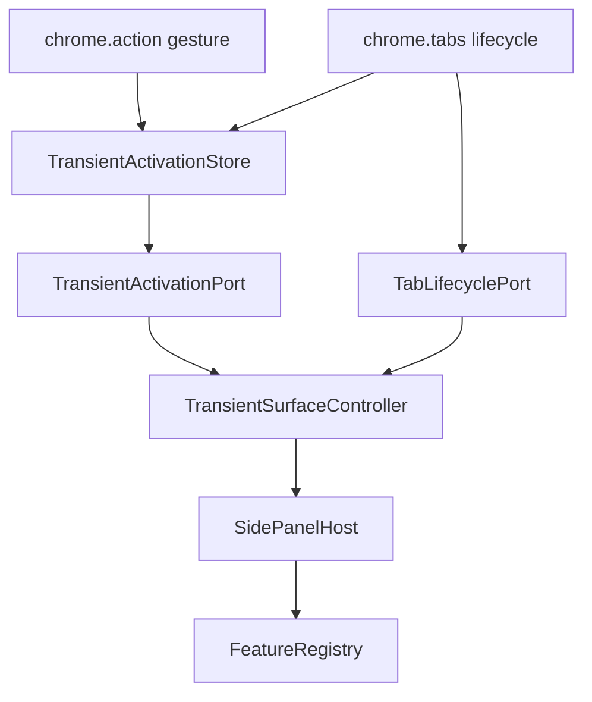

# 技術設計書

## Overview

本specはapplication shellへ一過性featureの汎用契約を導入する。一過性featureは常設ナビゲーションへ並ばず、権限付与ジェスチャー由来の起動要求でだけ表示され、固定対象タブの文書世代が失効すると終了する。

業務feature固有の状態やUIは所有しない。最初の利用者は下流spec `product-capture-transient-migration` であり、本specが公開する`ActivationId`、固定`TargetTabId`、`TransientSurfaceController`、`conclude`だけを利用する。

### Goals

- 常設と一過性の登録区分を既存feature非回帰で追加する
- 起動要求をMV3 workerのメモリ寿命へ依存せずpanelへ届ける
- 起動世代と対象タブを固定し、遷移・更新・閉鎖で確実に終了する
- 戻り先と型付き引き渡しを単一主表示領域の契約として提供する
- Chrome APIをruntime adapterへ閉じ、shellを決定的に検証する

### Non-Goals

- product-captureの状態・UI・抽出処理
- 候補管理のdraftと保存検証
- コンテキストメニュー項目の実登録
- 商品データの永続化

## Boundary Commitments

### This Spec Owns

- `ApplicationFeatureRegistration.presentation`
- `ActivationId`、`TargetTabId`、`TransientActivationRequest`
- `TransientSurfaceController`の起動、撤収、引き渡し、世代照合
- 下流featureへ世代照合と引き渡しだけを公開する`TransientSurfaceLifecyclePort`
- 起動要求storeとタブ寿命adapter
- 常設ナビ、初期選択、availability fallbackの一過性除外
- shell/runtimeの診断、失敗通知、検証fixture

### Out of Boundary

- 一過性面の業務payloadの意味
- 抽出結果の確認・補正・保存
- capture/candidateの文言とE2Eロケータ
- 永続データschema

### Dependency Direction

```text
application-shell contracts
    ↓
transient controller ports
    ↓
runtime adapters (chrome.storage.session / chrome.tabs / chrome.action)

downstream feature
    → application-shell/public.ts
```

下流featureはshellの内部moduleやChrome APIへ到達しない。shellは下流featureのpayloadを`unknown`として扱い、対象featureのactivation validatorへ委ねる。

下流featureへcontroller実装そのものは公開しない。`ApplicationComposition`がcontrollerから最小の`TransientSurfaceLifecyclePort`を作り、feature contribution factoryへ依存注入する。これによりmigration側はshell実装やglobal singletonを参照しない。

## Architecture



### Responsibilities

- **FeatureRegistry**: `presentation`を検証し、不正登録を隔離する
- **SidePanelHost**: 同時に一つのfeatureだけをmountし、既存transition/rollbackを維持する
- **TransientSurfaceController**: 起動世代、対象タブ、戻り先、監視解除を所有する
- **TransientActivationStore**: worker再生成を跨ぐ起動要求と失効状態を保持する
- **TabLifecycleAdapter**: ChromeイベントをURL非依存の寿命イベントへ変換する

## File Structure Plan

```text
src/application-shell/
  contracts.ts
  feature-registry.ts
  side-panel-host.ts
  application-composition.ts
  shell-view.tsx
  transient-surface-controller.ts       # new
  transient-surface-ports.ts            # new
  public.ts
src/runtime/
  service-worker.ts
  transient-activation-store.ts         # new
  tab-lifecycle-rules.ts                # new
  tab-lifecycle-adapter.ts              # new
scripts/
  validate-boundaries.mjs
tests/application-shell/
tests/runtime/
```

`StorageAccessGuard`には`src/runtime/transient-activation-store.ts`だけを限定追加する。featureから`chrome.storage`への直接到達は引き続き禁止する。

## Core Contracts

### Feature Registration

```typescript
export type FeaturePresentation = "persistent" | "transient";

export interface ApplicationFeatureRegistration<
  TPublic extends object = object,
  TActivation = never,
> {
  readonly id: FeatureId;
  readonly presentation?: FeaturePresentation;
  readonly navigation: {
    readonly labelKey: MessageKey;
    readonly order: number;
    readonly icon?: string;
  };
  readonly publicApi: TPublic;
  getAvailability(): Availability;
  subscribeAvailability(listener: (value: Availability) => void): () => void;
  mount(context: FeatureMountContext): Promise<FeatureMountHandle>;
  readonly activation?: FeatureActivationAdapter<TActivation>;
}

export const isPersistent = (
  registration: ApplicationFeatureRegistration,
): boolean => (registration.presentation ?? "persistent") === "persistent";
```

`isPersistent`をナビ構築、初期選択、fallback、controller検証の単一判定点とする。

### Transient Controller

```typescript
export type TargetTabId = number & { readonly __brand: "TargetTabId" };
export type ActivationId = string & { readonly __brand: "ActivationId" };

export interface TransientActivationRequest {
  readonly activationId: ActivationId;
  readonly surfaceId: FeatureId;
  readonly tabId: TargetTabId;
}

export type TransientDismissReason =
  | "navigated"
  | "tab-closed"
  | "persistent-selected";

export type TransientSurfaceState =
  | { readonly kind: "inactive" }
  | {
      readonly kind: "active";
      readonly activationId: ActivationId;
      readonly surfaceId: FeatureId;
      readonly tabId: TargetTabId;
      readonly returnTo: FeatureId | null;
    }
  | {
      readonly kind: "dismiss-failed";
      readonly activationId: ActivationId;
      readonly surfaceId: FeatureId;
      readonly returnTo: FeatureId | null;
    };

export interface TransientSurfaceController {
  start(): Promise<Result<void, TransientSurfaceError>>;
  request(value: TransientActivationRequest): Promise<Result<void, TransientSurfaceError>>;
  dismiss(
    activationId: ActivationId,
    reason: TransientDismissReason,
  ): Promise<Result<void, TransientSurfaceError>>;
  conclude(
    activationId: ActivationId,
    handoff: FeatureActivationIntent,
  ): Promise<Result<void, TransientSurfaceError>>;
  isCurrent(activationId: ActivationId): boolean;
  getSnapshot(): TransientSurfaceState;
  subscribe(listener: (state: TransientSurfaceState) => void): () => void;
  stop(): Promise<void>;
}

/** 下流の一過性featureへ注入する最小公開port。 */
export interface TransientSurfaceLifecyclePort {
  isCurrent(activationId: ActivationId): boolean;
  conclude(
    activationId: ActivationId,
    handoff: FeatureActivationIntent,
  ): Promise<Result<void, TransientSurfaceError>>;
}
```

controllerは自身のcommandをpromise chainで直列化する。全command入口で`activationId`を照合し、旧世代由来の終了、抽出完了、監視callbackをno-opにする。

`TransientSurfaceController`は`TransientSurfaceLifecyclePort`を実装する。`application-shell/public.ts`が型だけを公開し、composition rootが具体instanceを次の形で注入する。

```typescript
export interface TransientFeatureRuntimeDependencies {
  readonly transientSurface: TransientSurfaceLifecyclePort;
}

createProductCaptureFeatureContribution({
  transientSurface: controller,
});
```

具体feature名を知るのはcomposition rootだけであり、shell controllerはproduct-captureを知らない。

### Dismiss and Conclude

- `dismiss`: 一過性面をunmountし、記録した常設featureへ戻る
- `conclude`: 引き渡し先へのtyped activationをhostの一回のtransitionで実行し、戻り先へは戻らない
- activation失敗時はhostの既存rollbackで一過性面を維持する
- 戻り先が利用不可なら利用可能な常設featureと理由を提示する

## Activation Delivery

### Store Model

```typescript
export type ActivationStage =
  | "pending"
  | "received"
  | "activated"
  | "invalidated"
  | "write-failed";

export interface TransientActivationRecord {
  readonly activationId: ActivationId;
  readonly surfaceId: FeatureId;
  readonly tabId: TargetTabId;
  readonly stage: ActivationStage;
}

export interface TransientActivationStore {
  put(record: TransientActivationRecord): Promise<Result<void, ActivationStoreError>>;
  read(): Promise<Result<TransientActivationRecord | undefined, ActivationStoreError>>;
  requestAdvance(
    activationId: ActivationId,
    stage: "received" | "activated",
  ): Promise<Result<void, ActivationStoreError>>;
  invalidate(tabId: TargetTabId): Promise<Result<void, ActivationStoreError>>;
  subscribe(listener: (record: TransientActivationRecord | undefined) => void): () => void;
}
```

媒体は`chrome.storage.session`とし、商品値、URL、生HTMLを保持しない。panelは読み出しと購読だけを行い、変更要求はworkerへ送り、store変更のownerをruntimeへ集約する。

### Monitoring Handoff

監視責務は次の順で移管する。

1. workerがジェスチャーを受け、起動要求の記録を開始する
2. workerのトップレベル`tabs.onUpdated` / `onRemoved` listenerが未起動要求の失効を監視する
3. panelはrecordを受け取るが、この時点では業務featureをmountしない
4. panelが`TabLifecyclePort.watch`を設置し、watch-readyをworkerへ通知する
5. workerが未失効であることを最終照合し、activation許可を返す
6. controllerがfeatureをmountし、成功後にrecordを`activated`へ進める
7. 以後はpanel監視がcontrollerを撤収させる

worker監視とpanel監視には重複期間を設け、監視の空白を作らない。`invalidated`は終端であり、activation許可後であってもmount成功前の失効通知はcontrollerを撤収させる。

### Known Open Design Risk

`sidePanel.open()`はジェスチャー内で同期開始する必要があり、起動recordの非同期書き込み完了を待てない。完全な`chrome.storage.session`障害時に「アイコン操作」と「Chrome UIからの直接open」を区別する保証は未確定である。

本specをGOにする前に、次のいずれかを決定する。

- storageと独立した失敗通知経路を提供する
- Chrome UI側でジェスチャー起因openを識別可能にする
- 完全媒体障害を要件上の明示的な受容リスクへ変更する

この論点はcapture移行specへ持ち込まず、shell契約内で解決する。

## Tab Lifecycle

```typescript
export interface TabLifecyclePort {
  watch(
    activationId: ActivationId,
    tabId: TargetTabId,
    onEnded: (
      activationId: ActivationId,
      reason: Extract<TransientDismissReason, "navigated" | "tab-closed">,
    ) => void,
  ): () => void;
}
```

`chrome.tabs.onUpdated`の読み込み開始と`onRemoved`を使用する。URLは参照せず、追加の`tabs` / `webNavigation`権限を要求しない。同一origin遷移でも終了する過剰終了は、失敗操作を残さない安全側の挙動として受け入れる。

## Error Handling

- **記録なし**: Chrome UIから直接開かれた場合は常設表示に留まり通知しない
- **失効済み**: 一過性面を立てず再操作を案内する
- **起動拒否**: 常設表示に留まり安定コードで診断する
- **終了失敗**: 実行操作を隠した`dismiss-failed`として保持し再試行する
- **引き渡し失敗**: 一過性面を維持し、呼び出しfeatureへ判別可能な失敗を返す
- **store障害**: 商品値やURLをログせず、安定した媒体障害として提示する

## Requirements Traceability

| Requirement | Components | Verification |
|---|---|---|
| 1.1–1.6 | Registry, composition, host | contract/integration |
| 2.1–2.7 | Store, controller, service worker | runtime integration/E2E |
| 3.1–3.8 | Controller, host, tab adapter | unit/integration |
| 3.9–3.10 | Controller, activation router | integration |
| 4.1–4.4 | ports, in-memory adapters, existing shell fixtures | unit/integration |
| 4.5 | production build extension | Playwright E2E |
| 4.6 | synthetic fixtures | fixture validation |

## Testing Strategy

### Unit

- `isPersistent`の既定値と不正登録隔離
- controllerの起動、世代更新、3種のdismiss、conclude、stale callback
- tab lifecycle ruleのtabIdフィルタと最大1回通知
- `invalidated`終端と不正stage遷移拒否

### Integration

- panel閉状態・開状態の起動配送
- watch-ready前後の遷移・閉鎖で一過性面が立たないこと
- worker再生成後も未完了recordを回収すること
- store障害が無反応にならないこと
- persistent featureのナビ・選択・availability障害分離の非回帰
- conclude成功で引き渡し先が保持され、失敗で一過性面がrollbackされること

### E2E

- アイコン操作からsynthetic transient featureが立つ
- 対象タブ遷移で直前の常設featureへ戻る
- 常設ナビ選択で一過性面が終了する

## Security Considerations

- 権限は`storage` / `activeTab` / `scripting` / `sidePanel`の4つを維持する
- session storeは`TRUSTED_CONTEXTS`に限定する
- runtime/storage入力は`unknown`として境界検証する
- URL、抽出値、ページ由来文字列を記録・ログしない
- worker bundleをDOM/React非依存に保つ

## Migration Strategy

1. `presentation`と`isPersistent`を追加し既存常設featureの非回帰を通す
2. ナビと初期選択を常設限定へ変更する
3. controllerとin-memory portsを実装する
4. runtime storeとtab lifecycle adapterを実装する
5. synthetic transient featureでshell契約を検証する
6. 公開契約を`application-shell/public.ts`から提供する
7. composition rootから下流feature factoryへ`TransientSurfaceLifecyclePort`を注入できるcontract fixtureを追加する

業務featureへの適用は本spec完了後に`product-capture-transient-migration`で行う。
