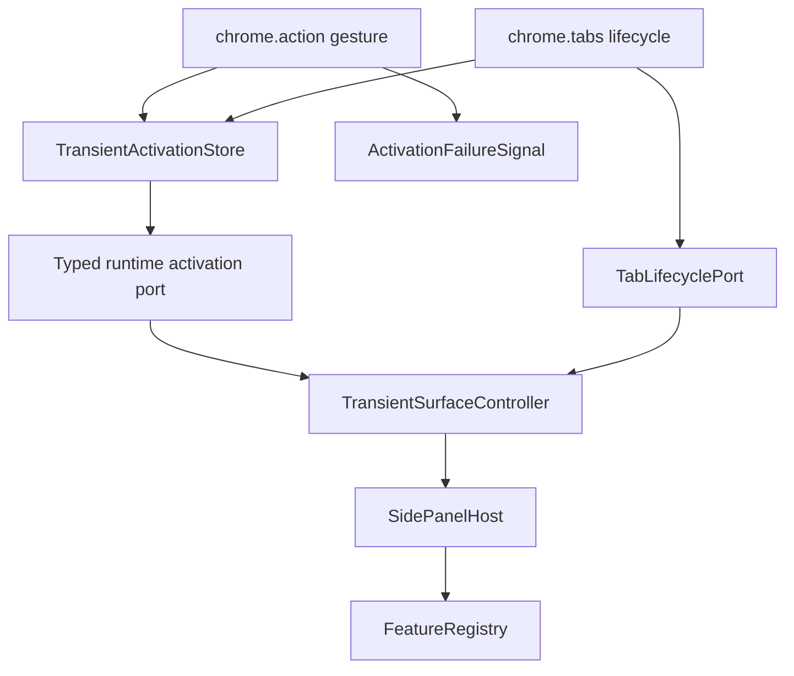

# 技術設計書

## Overview

本specはapplication shellへ一過性featureの汎用契約を導入する。一過性featureは常設ナビゲーションへ並ばず、権限付与ジェスチャー由来の起動要求でだけ表示され、固定対象タブの文書世代が失効すると終了する。

業務feature固有の状態やUIは所有しない。最初の利用者は下流spec `product-capture-transient-migration` であり、本specが公開する`ActivationId`、固定`TargetTabId`、`TransientSurfaceLifecyclePort`だけを利用する。controller実体はshell内部に留める。

### Goals

- 常設と一過性の登録区分を既存feature非回帰で追加する
- 起動要求をMV3 workerのメモリ寿命へ依存せずpanelへ届ける
- 起動世代と対象タブを固定し、遷移・更新・閉鎖で確実に終了する
- 戻り先と型付き引き渡しを単一主表示領域の契約として提供する
- Chrome APIをruntime adapterへ閉じ、shellを決定的に検証する

### Non-Goals

- product-captureの状態・UI・抽出処理
- 候補管理のdraftと保存検証
- コンテキストメニュー項目の実登録
- 商品データの永続化

## Boundary Commitments

### This Spec Owns

- `ApplicationFeatureRegistration.presentation`
- `ActivationId`、`TargetTabId`、`TransientActivationRequest`
- `TransientSurfaceController`の起動、撤収、引き渡し、世代照合
- 下流featureへ世代照合と引き渡しだけを公開する`TransientSurfaceLifecyclePort`
- 起動要求storeとタブ寿命adapter
- 常設ナビ、初期選択、availability fallbackの一過性除外
- shell/runtimeの診断、失敗通知、検証fixture

### Out of Boundary

- 一過性面の業務payloadの意味
- 抽出結果の確認・補正・保存
- capture/candidateの文言とE2Eロケータ
- 永続データschema

### Allowed Dependencies

- application shellの既存registration、host transition、typed activation契約
- canonical `Result<T, E>`と既存message catalog公開契約
- shell/runtime専用adapter内に限定した`chrome.action`、`chrome.sidePanel`、`chrome.tabs`、`chrome.storage.session`、`chrome.runtime` message
- 下流specは`application-shell/public.ts`の`TransientSurfaceLifecyclePort`だけを参照する

### Revalidation Triggers

- `ActivationId`、`TransientActivationRequest`、`TransientSurfaceLifecyclePort`のshapeまたは意味の変更
- `seq`割り当て、墓標優先、watch-ready最終許可の順序保証の変更
- session媒体、worker単一write owner、タブ寿命イベントの変更
- production E2Eの委譲先または実feature登録順の変更

### Existing Spec Revision Touchpoints

- `application-shell` 1.1 / 1.5 / 2.1を、常設featureだけをナビゲーション・初期選択・availability fallback・通常`select()`の対象にし、一過性featureを同じ単一主表示領域へ型付き登録できる契約へ改訂する
- `application-shell` 4.3 / 4.4を、常設featureを維持したまま一過性起動障害を安全なテキストの`transientNotice`で提示できる共通状態表示へ改訂する
- `application-shell` 7のtyped activationは`conclude`の引き渡し先として再利用し、既存rollback保証を変更しない

### Dependency Direction

```text
application-shell contracts
    ↓
transient controller ports
    ↓
runtime adapters (chrome.storage.session / chrome.tabs / chrome.action / chrome.runtime)

downstream feature
    → application-shell/public.ts
```

下流featureはshellの内部moduleやChrome APIへ到達しない。shellは下流featureのpayloadを`unknown`として扱い、対象featureのactivation validatorへ委ねる。

下流featureへcontroller実装そのものは公開しない。`ApplicationComposition`がcontrollerから最小の`TransientSurfaceLifecyclePort`を作り、feature contribution factoryへ依存注入する。これによりmigration側はshell実装やglobal singletonを参照しない。

## Architecture



### Responsibilities

- **FeatureRegistry**: `presentation`を検証し、不正登録を隔離する
- **SidePanelHost**: 同時に一つのfeatureだけをmountし、既存transition/rollbackを維持する
- **TransientSurfaceController**: 起動世代、対象タブ、戻り先、監視解除を所有する
- **TransientActivationStore**: worker再生成を跨ぐ起動要求、単調増加順序、失効墓標を保持する
- **TransientActivationPort**: panelのwatch-readyを型付きruntime messageでworkerの最終許可へ接続する
- **ActivationFailureSignal**: 起動record書き込み失敗をsession媒体と独立したChrome action表示で通知する
- **TabLifecycleAdapter**: ChromeイベントをURL非依存の寿命イベントへ変換する

## File Structure Plan

```text
src/application-shell/
  contracts.ts
  feature-registry.ts
  side-panel-host.ts
  application-composition.ts
  shell-view.tsx
  transient-surface-notice.ts            # new
  transient-surface-controller.ts       # new
  transient-surface-ports.ts            # new
  public.ts
src/runtime/
  service-worker.ts
  transient-activation-message.ts       # new
  transient-activation-panel-port.ts    # new
  transient-activation-failure-signal.ts # new
  transient-activation-store.ts         # new
  tab-lifecycle-rules.ts                # new
  tab-lifecycle-adapter.ts              # new
scripts/
  validate-boundaries.mjs
tests/application-shell/
tests/runtime/
```

`StorageAccessGuard`には`src/runtime/transient-activation-store.ts`だけを限定追加する。featureから`chrome.storage`への直接到達は引き続き禁止する。

## Core Contracts

### Feature Registration

```typescript
export type FeaturePresentation = "persistent" | "transient";

export interface ApplicationFeatureRegistration<
  TPublic extends object = object,
  TActivation = never,
> {
  readonly id: FeatureId;
  readonly presentation?: FeaturePresentation;
  readonly navigation: {
    readonly labelKey: MessageKey;
    readonly order: number;
    readonly icon?: string;
  };
  readonly publicApi: TPublic;
  getAvailability(): Availability;
  subscribeAvailability(listener: (value: Availability) => void): () => void;
  mount(context: FeatureMountContext): Promise<FeatureMountHandle>;
  readonly activation?: FeatureActivationAdapter<TActivation>;
}

export const isPersistent = (
  registration: ApplicationFeatureRegistration,
): boolean => (registration.presentation ?? "persistent") === "persistent";
```

`isPersistent`をナビ構築、初期選択、fallback、controller検証の単一判定点とする。

### Transient Controller

```typescript
export type TargetTabId = number & { readonly __brand: "TargetTabId" };
export type ActivationId = string & { readonly __brand: "ActivationId" };

export interface TransientActivationRequest {
  readonly activationId: ActivationId;
  readonly surfaceId: FeatureId;
  readonly tabId: TargetTabId;
}

export type TransientDismissReason =
  | "navigated"
  | "tab-closed"
  | "persistent-selected";

export type TransientSurfaceState =
  | { readonly kind: "inactive" }
  | {
      readonly kind: "active";
      readonly activationId: ActivationId;
      readonly surfaceId: FeatureId;
      readonly tabId: TargetTabId;
      readonly returnTo: FeatureId | null;
    }
  | {
      readonly kind: "dismiss-failed";
      readonly activationId: ActivationId;
      readonly surfaceId: FeatureId;
      readonly returnTo: FeatureId | null;
    };

export interface TransientSurfaceController {
  start(): Promise<Result<void, TransientSurfaceError>>;
  request(value: TransientActivationRequest): Promise<Result<void, TransientSurfaceError>>;
  dismiss(
    activationId: ActivationId,
    reason: TransientDismissReason,
  ): Promise<Result<void, TransientSurfaceError>>;
  conclude(
    activationId: ActivationId,
    handoff: FeatureActivationIntent,
  ): Promise<Result<void, TransientSurfaceError>>;
  isCurrent(activationId: ActivationId): boolean;
  getSnapshot(): TransientSurfaceState;
  subscribe(listener: (state: TransientSurfaceState) => void): () => void;
  stop(): Promise<void>;
}

/** 下流の一過性featureへ注入する最小公開port。 */
export interface TransientSurfaceLifecyclePort {
  isCurrent(activationId: ActivationId): boolean;
  conclude(
    activationId: ActivationId,
    handoff: FeatureActivationIntent,
  ): Promise<Result<void, TransientSurfaceError>>;
}
```

controllerは自身のcommandをpromise chainで直列化する。全command入口で`activationId`を照合し、旧世代由来の終了、抽出完了、監視callbackをno-opにする。

`TransientSurfaceController`は`TransientSurfaceLifecyclePort`を実装する。`application-shell/public.ts`が型だけを公開し、composition rootが具体instanceを次の形で注入する。

```typescript
export interface TransientFeatureRuntimeDependencies {
  readonly transientSurface: TransientSurfaceLifecyclePort;
}

createProductCaptureFeatureContribution({
  transientSurface: lateBoundLifecycle.port,
});
```

具体feature名を知るのはcomposition rootだけであり、shell controllerはproduct-captureを知らない。

### Late-Bound Composition

現行compositionはfeature contributionをregistry/hostより先に生成するため、controller実体をfeature factoryへ直接渡さない。composition rootは既存`ShellNavigator`と同じlate-bound proxyを先に作り、次の順序で循環を解く。

1. 未bind時に`not_started`を返す内部`TransientSurfaceLifecyclePort` proxyを生成する
2. proxyだけを`FeatureCompositionContext`経由で一過性feature contribution factoryへ渡す
3. registryとhost/integrationを構築してから`TransientSurfaceController`を生成する
4. host start前にproxyをcontrollerへbindし、host start成功後にcontrollerをstartする
5. cleanupではcontrollerをstopしてからproxyをunbindし、stale feature callbackを`not_started`へ閉じる

proxyとbind操作はapplication composition内部契約であり、`application-shell/public.ts`へ公開しない。下流featureが利用する値は常に同じ`TransientSurfaceLifecyclePort`参照で、bind前に一過性featureがmountされる経路は作らない。

### Dismiss and Conclude

- `dismiss`: 一過性面をunmountし、記録した常設featureへ戻る
- `conclude`: 引き渡し先へのtyped activationをhostの一回のtransitionで実行し、戻り先へは戻らない
- activation失敗時はhostの既存rollbackで一過性面を維持する
- 戻り先が利用不可なら利用可能な常設featureと理由を提示する

## Activation Delivery

### Store Model

```typescript
export type ActivationStage =
  | "pending"
  | "received"
  | "activated"
  | "invalidated";

export type ActivationSequence = number & {
  readonly __brand: "ActivationSequence";
};

export interface TransientActivationRecord {
  readonly activationId: ActivationId;
  readonly surfaceId: FeatureId;
  readonly tabId: TargetTabId;
  readonly seq: ActivationSequence;
  readonly stage: ActivationStage;
}

export interface TransientInvalidationTombstone {
  readonly tabId: TargetTabId;
  readonly seq: ActivationSequence;
}

export interface TransientActivationEnvelope {
  readonly lastSequence: ActivationSequence;
  readonly record?: TransientActivationRecord;
  readonly tombstones: readonly TransientInvalidationTombstone[];
}

export const MAX_TRANSIENT_TOMBSTONES = 128;

export type ActivationAuthorization =
  | { readonly kind: "authorized"; readonly record: TransientActivationRecord }
  | { readonly kind: "invalidated"; readonly record: TransientActivationRecord };

export interface TransientActivationStore {
  put(record: TransientActivationRecord): Promise<Result<void, ActivationStoreError>>;
  read(): Promise<Result<TransientActivationRecord | undefined, ActivationStoreError>>;
  requestAdvance(
    activationId: ActivationId,
    stage: "received" | "activated",
  ): Promise<Result<void, ActivationStoreError>>;
  invalidate(
    tombstone: TransientInvalidationTombstone,
  ): Promise<Result<void, ActivationStoreError>>;
  authorizeAfterWatchReady(
    activationId: ActivationId,
  ): Promise<Result<ActivationAuthorization, ActivationStoreError>>;
  subscribe(listener: (record: TransientActivationRecord | undefined) => void): () => void;
}
```

媒体は`chrome.storage.session`とし、商品値、URL、生HTMLを保持しない。panelは読み出しと購読だけを行い、変更要求はworkerへ送り、store変更のownerをruntimeへ集約する。

service workerは起動要求とタブ寿命イベントを単一スケジューラへ同期的にenqueueし、受信時点を論理順序の線形化点として単調増加`seq`を割り当てる。スケジューラは永続化mutationを`seq`順に直列適用する。worker再生成時はsession envelope内の最大`seq`から次値を復元してからcommandを適用し、workerメモリだけを順序の根拠にしない。`sidePanel.open()`自体はaction callback内で同期開始し、store完了は待たない。

`invalidate`は対象recordの有無を問わず、tabごとの最新墓標を保存する。`put`適用時に`墓標.seq > record.seq`ならrecordを`invalidated`として着地させ、後から同条件の墓標が適用された場合も既存recordを`invalidated`へ進める。`invalidated`は終端であり、`requestAdvance`とactivation許可はこれを上書きできない。新しいジェスチャーは既存墓標より大きい`seq`を持つため、同じtabでも新世代として開始できる。

墓標はtabごとに最新1件、envelope全体で最大128件に制限する。剪定はscheduler checkpointで、それ以前の`seq`を持つ全commandがcommit済みであることを確認してからだけ行う。現在recordより新しく、そのrecordがまだ`invalidated`へ着地していない間は支配中の墓標を保持し、それ以外を古い`seq`から除去する。checkpoint後に到着する`put`は必ず剪定対象より大きい`seq`を持つため、古い失効を復活させない。破損envelopeなどで支配墓標を保持したまま上限内へ剪定できなければ、古い墓標を強制evictせず`capacity-exceeded`として新規起動をfail closedにする。この上限と安全条件をstore unit testで固定する。

### Typed Runtime Transport

watch-readyは既存`WorkerRegistrationContext.addActionHandler`を流用しない。これはpayloadを持たず応答を`{ ok: boolean }`へ縮退させるためである。shell/runtime専用adapterが次のversioned messageを所有する。

```typescript
export interface TransientWatchReadyRequest {
  readonly version: 1;
  readonly kind: "transient-watch-ready";
  readonly activationId: ActivationId;
}

export type TransientWatchReadyResponse =
  | {
      readonly version: 1;
      readonly ok: true;
      readonly decision: ActivationAuthorization;
    }
  | {
      readonly version: 1;
      readonly ok: false;
      readonly code:
        | "invalid-message"
        | "store-unavailable"
        | "capacity-exceeded"
        | "not-started";
    };

export interface TransientActivationPort {
  authorizeAfterWatchReady(
    activationId: ActivationId,
  ): Promise<Result<ActivationAuthorization, ActivationTransportError>>;
}
```

panel adapterはrequestを送信し、`unknown` responseを上記unionへ検証してからcontrollerへ返す。worker adapterは既存`classifyCaller`規則で自拡張のpanel文脈だけを受理し、request shapeを検証して同じscheduler上の`authorizeAfterWatchReady`へ渡す。応答は`authorized | invalidated | typed error`を保持し、booleanへ縮退させない。listenerはservice workerのtop-level bootstrapで同期登録し、feature固有worker registrationへ委ねない。

### Monitoring Handoff

監視責務は次の順で移管する。

1. workerがジェスチャーを受け、その受信順`seq`を割り当てて起動要求をenqueueし、同じcallback内でpanel openを同期開始する
2. workerのトップレベル`tabs.onUpdated` / `onRemoved` listenerが、recordの有無を問わず後続`seq`の失効墓標をenqueueする
3. panelはrecordを受け取るが、この時点では業務featureをmountしない
4. panelが`TabLifecyclePort.watch`を設置し、watch-readyをworkerへ通知する
5. workerがwatch-readyを同じスケジューラへenqueueし、それ以前に受信した全mutationを適用してからrecordと墓標を最終照合し、activation許可または`invalidated`を返す
6. controllerがfeatureをmountし、成功後にrecordを`activated`へ進める
7. 以後はpanel監視がcontrollerを撤収させる

worker監視とpanel監視には重複期間を設け、監視の空白を作らない。workerがwatch-readyより前に受信した失効は墓標と最終照合で拒否し、watch設置後の失効はpanel監視でも捕捉する。recordが一時的に`pending`または`received`として観測されても実行可能ではなく、最終許可前にfeatureをmountしない。`invalidated`は終端であり、activation許可後であってもmount成功前の失効通知はcontrollerを撤収させる。

### Store Failure Decision

`sidePanel.open()`はジェスチャー内で同期開始する必要があり、起動recordの非同期書き込み完了を待てない。panelの`read()`が`err`を返した場合は、ジェスチャー起因openかChrome UIからの直接openかを識別せず、「セッション領域が利用不能なため一過性面を開始できない」という再操作可能な理由を共通表示する。

2.7が要求するのは安全に成立しない理由の提示であり、起動契機の識別ではない。媒体障害では起動候補自体を安全に保持できないため、feature固有の失敗ではなくshellの保存領域障害として扱う。

受容する残余リスクは、利用者がChrome UIから直接panelを開いた時点でsession媒体も障害中だった場合、本来は常設表示だけでよい場面にも保存領域障害が表示されることである。誤って一過性面を立てるより安全側であり、復旧案内も同一なので許容する。この判断はshell契約で閉じ、capture移行specへ起動契機判定を要求しない。

起動recordの`put()`が`err`を返した場合は、同じsession媒体へ`write-failed` recordを書こうとしない。workerは`chrome.action`のbadgeを`!`へ、titleを安定した「起動情報を保存できません。拡張アイコンを再操作してください」案内へ設定する`ActivationFailureSignal`を使用する。これはstorageと独立し、追加permissionを要求せず、worker再生成後もChrome管理のaction表示として残る。

signalはglobalなChrome action状態とし、publishとclearを起動mutationと同じschedulerへ載せる。次の起動recordがdurable `put()`に成功した後だけ、badgeを空文字へ戻し、titleを`chrome.runtime.getManifest().action.default_title`または拡張名から解決した通常値へ復元する。panelの`read()`成功、notice表示、side panel open成功、worker再生成はclear条件にしない。clear失敗は起動成功を巻き戻さず安定コードで診断し、次のdurable `put()`成功時に再試行する。

panelの`read()`失敗はglobalな`ShellViewState.error`へ遷移させない。`ready` / `maintenance`に選択中の常設featureと併存できる`transientNotice`を追加し、一過性面だけを開始せずsession媒体障害と再操作案内をbanner表示する。これによりChrome UIからの直接openで障害表示が出る受容リスクは維持しつつ、無関係な常設featureを失わない。

```typescript
export interface TransientNotice {
  readonly message: MessageDescriptor;
  readonly recoverable: true;
}

// application-shell改訂後の差分。loading/errorの意味は変更しない。
type NoticeCapableShellState =
  | { readonly kind: "ready"; readonly selected: FeatureId | null; readonly transientNotice?: TransientNotice }
  | { readonly kind: "maintenance"; readonly selected: FeatureId | null; readonly message: MessageDescriptor; readonly transientNotice?: TransientNotice };
```

`ShellPresentation.publish`はnoticeをnavigation・feature slotと独立したbannerへ渡し、`ShellView`は通常のJSX textとして描画する。session `read()`由来noticeは後続read成功または新しい有効activationの受理でclearするが、Chrome action signalのclear lifecycleとは結合しない。

## Tab Lifecycle

```typescript
export interface TabLifecyclePort {
  watch(
    activationId: ActivationId,
    tabId: TargetTabId,
    onEnded: (
      activationId: ActivationId,
      reason: Extract<TransientDismissReason, "navigated" | "tab-closed">,
    ) => void,
  ): () => void;
}
```

`chrome.tabs.onUpdated`の読み込み開始と`onRemoved`を使用する。URLは参照せず、追加の`tabs` / `webNavigation`権限を要求しない。同一origin遷移でも終了する過剰終了は、失敗操作を残さない安全側の挙動として受け入れる。

## Error Handling

- **記録なし**: Chrome UIから直接開かれた場合は常設表示に留まり通知しない
- **失効済み**: 一過性面を立てず再操作を案内する
- **起動拒否**: 常設表示に留まり安定コードで診断する
- **終了失敗**: 実行操作を隠した`dismiss-failed`として保持し再試行する
- **引き渡し失敗**: 一過性面を維持し、呼び出しfeatureへ判別可能な失敗を返す
- **store障害**: 商品値やURLをログせず、安定した媒体障害として提示する
- **起動record書き込み失敗**: sessionへ再書き込みせずaction badge/titleで理由と再操作を提示する
- **起動record読み出し失敗**: 常設面を維持した`transientNotice`として提示する
- **墓標容量を安全に剪定不能**: `capacity-exceeded`で起動を拒否し、再操作可能なstore障害として提示する

## Requirements Traceability

| Requirement | Components | Verification |
|---|---|---|
| 1.1, 1.2, 1.3, 1.4, 1.5, 1.6 | Registry, composition, host | contract/integration |
| 2.1, 2.2, 2.3, 2.4, 2.5, 2.6, 2.7 | Store, sequence/tombstone protocol, typed runtime port, failure signal, controller, service worker | runtime integration |
| 3.1, 3.2, 3.3, 3.4, 3.5, 3.6, 3.7, 3.8 | Controller, host, tab adapter | unit/integration |
| 3.9, 3.10 | Controller, activation router | integration |
| 4.1, 4.2, 4.3, 4.4 | ports, in-memory adapters, existing shell fixtures | unit/integration |
| 4.5 | downstream production feature registration | `product-capture-transient-migration` Playwright E2E |
| 4.6 | synthetic fixtures | fixture validation |

## Testing Strategy

### Unit

- `isPersistent`の既定値と不正登録隔離
- controllerの起動、世代更新、3種のdismiss、conclude、stale callback
- tab lifecycle ruleのtabIdフィルタと最大1回通知
- 単調増加`seq`、record不在時の墓標、`invalidated`終端と不正stage遷移拒否
- 墓標がtabごとに最新1件・全体128件以内で、安全checkpoint前の支配墓標を剪定しないこと
- 安全に128件以内へ剪定できない破損状態を`capacity-exceeded`でfail closedにすること

### Integration

- panel閉状態・開状態の起動配送
- `put()`保留中の失効が墓標に残り、watch-ready後の最終許可で拒否されること
- runtime messageのsender/request/response検証と`authorized | invalidated | error`保持
- watch-ready前後の遷移・閉鎖で一過性面が立たないこと
- worker再生成後も未完了recordを回収すること
- `put()`失敗がglobal action signalを残し、次のdurable `put()`成功後だけclearされること
- 古いpanelのread/notice完了やworker再生成が後発signalをclearしないこと
- `read()`失敗noticeと常設featureが同時に維持されること
- persistent featureのナビ・選択・availability障害分離の非回帰
- conclude成功で引き渡し先が保持され、失敗で一過性面がrollbackされること

### Cross-Spec E2E

- 本specはproduction bundleへテスト専用の一過性featureを登録しない
- shell単体ではin-memory registration fixtureによるcontract/runtime integrationまでを所有する
- Chrome 116以降のproduction buildにおけるアイコン起動、対象タブ失効、常設復帰は、最初の実featureを登録する下流`product-capture-transient-migration`の5.5 E2Eで本specの4.5も合わせて検証する

## Security Considerations

- 権限は`storage` / `activeTab` / `scripting` / `sidePanel`の4つを維持する
- session storeは`TRUSTED_CONTEXTS`に限定する
- runtime/storage入力は`unknown`として境界検証する
- URL、抽出値、ページ由来文字列を記録・ログしない
- worker bundleをDOM/React非依存に保つ

## Migration Strategy

1. `presentation`と`isPersistent`を追加し既存常設featureの非回帰を通す
2. ナビと初期選択を常設限定へ変更する
3. controllerとin-memory portsを実装する
4. runtime storeとtab lifecycle adapterを実装する
5. production compositionから隔離したin-memory registration fixtureでshell契約を検証する
6. 公開契約を`application-shell/public.ts`から提供する
7. composition rootから下流feature factoryへ`TransientSurfaceLifecyclePort`を注入できるcontract fixtureを追加する

業務featureへの適用とproduction MV3 E2Eは、本spec完了後に`product-capture-transient-migration`で行う。shell tasksはテスト専用featureをproduction catalogへ追加しない。
