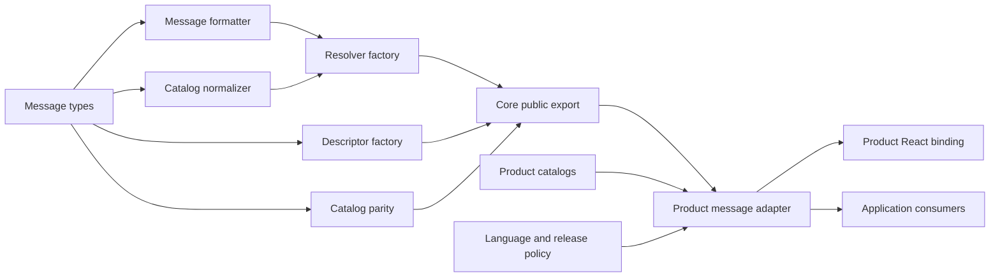
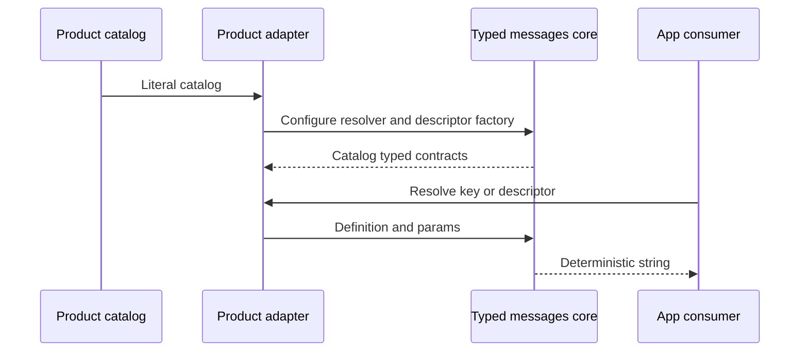
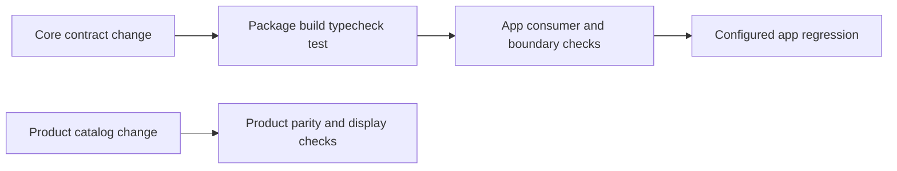
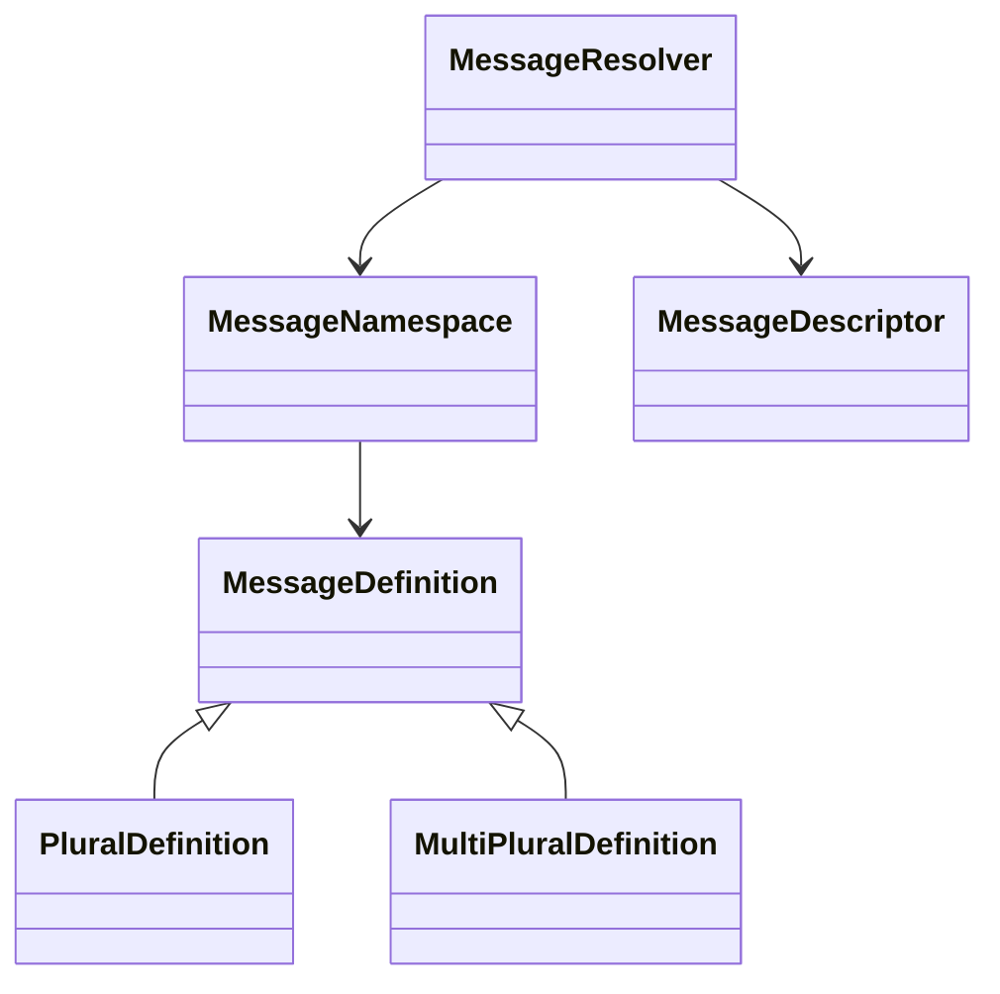
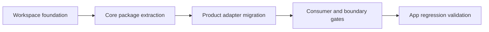

# Design Document

## Overview

typed messages coreは、カタログからmessage keyとparameter型を導出し、plain、interpolation、single plural、multi pluralを決定的に解決する汎用mechanismを、private workspace packageとして提供する。対象利用者は、PC Build Plannerおよび将来のChrome拡張・Webアプリconsumerを実装する開発者である。

既存`src/ui-messages`から製品非依存の型、format、namespace flattening、resolver factory、descriptor factory、catalog parity primitiveを抽出する。製品側はja/enカタログ、具体的な`MessageKey`、対応言語、fallback、release rule、configured resolver、React bindingを保持し、package公開APIだけを使うadapterへ変わる。既存利用者表示、言語切替、保存状態は変更しない。

### Goals

- catalog shapeからkey、placeholder、plural selectorの型付き呼び出し契約を導出する。
- React、Chrome、PCドメイン、製品catalog非依存のruntimeと公開型を確立する。
- package単独検証、export map、consumer contract、deep import gate、topological buildを再現可能にする。
- generic core変更と製品catalog-only変更の検証範囲を分離する。

### Non-Goals

- ja/enの文言、具体的な`MessageKey`、対応言語やfallback policyをpackageで所有しない。
- React Provider/hook、表示言語の選択・保存、browser language解決をpackage化しない。
- npmへ公開せず、stable APIやsemver互換を宣言しない。
- 3言語目の翻訳、UI layout、Chrome manifestやstore listingを変更しない。

## Boundary Commitments

### This Spec Owns

- `@pc-build-planner/typed-messages-core`のprivate workspace packageと唯一の公開export。
- `MessageDefinition`、key/definition/placeholder/parameter型導出、generic descriptor型。
- plain、interpolation、single plural、multi pluralの純粋format。
- nested namespaceのflat dot-key catalogへの正規化。
- catalog genericなresolver factoryとdescriptor factory。
- key・placeholderのcompile-time/runtime parity primitive。
- package単独build/typecheck/test、app consumer contract、package deep import gate、topological validation script。

### Out of Boundary

- `src/ui-messages/catalog/**`の値・namespace意味・具体`MessageKey`。
- `SUPPORTED_LANGUAGES`、`SOURCE_LANGUAGE`、`FALLBACK_LANGUAGE`、原語表記、resolver registry。
- required release key、bilingual hint、dead navigation keyなどの製品rule。
- `MessageProvider`、`useMessages`、React ContextとUI integration。
- `src/ui-language/**`のstate、永続化、browser language、切替workflow。
- npm publish、外部stable API、2番目のconsumer実装。

### Allowed Dependencies

- package runtimeはECMAScript標準APIだけを利用し、runtime dependencyを持たない。
- package developmentはNode.js 26.5.0、pnpm 11.13.1、TypeScript 7.0.2、tsx 4.23.1、`node:test`を利用する。
- app側`src/ui-messages`は`@pc-build-planner/typed-messages-core`のroot exportだけへ依存できる。
- root toolingはpackage manifest、export map、公開consumer fixture、boundary validatorへ依存できる。
- packageからroot `src/`、React、Chrome API、PCドメイン、製品catalogへの依存は禁止する。

### Revalidation Triggers

- `MessageDefinition`、placeholder構文、plural category、multi-selector combination規則の変更。
- `MessageResolver`、`MessageDescriptor`、factory、parity issueの公開shape変更。
- package export map、build output、module format、minimum Node/TypeScript条件の変更。
- app adapterが所有するcatalog flattening、configured resolver、release parity合成方法の変更。
- 2番目のconsumer追加またはnpm公開の検討開始。

## Architecture

### Existing Architecture Analysis

現行`src/ui-messages`は共有コアとして`public.ts`を唯一のapp公開入口にしているが、内部では汎用mechanismと製品policyが同居する。`contracts.ts`と`format.ts`はほぼ独立している一方、`resolver.ts`は日本語`MESSAGES`へ、`catalog-parity.ts`は具体`MessageKey`とv0.3 release ruleへ結合する。`languages.ts`と`message-context.ts`は製品側に残すべきconfigured adapterとpresentation adapterである。

既存consumerは引き続き`src/ui-messages/public.ts`または`worker-public.ts`を利用する。したがってpackage導入はapp公開APIを置換せず、その内部実装元を変更する。workspace packageの公開境界はroot appの公開境界より上流に位置する。

### Architecture Pattern & Boundary Map



**Architecture Integration**:

- **Selected pattern**: Pure core + configured app adapter。catalogに閉じた型付きfactoryをpackageが提供し、製品policyはapp adapterが設定する。
- **Dependency direction**: `types → formatter/normalizer/parity → resolver/descriptor → public export → app adapter → React/consumer`。右側から左側への逆依存を禁止する。
- **Existing patterns preserved**: app consumerは`src/ui-messages/public.ts`、worker consumerは`worker-public.ts`だけを利用し、catalog deep importを行わない。
- **New components rationale**: package公開面、workspace orchestration、consumer/boundary gateは最初のpackage運用を実証するために必要である。
- **Steering compliance**: strict TypeScript、NodeNext ESM、`any`禁止、remote/dynamic code禁止、機械的boundary gate、`node:test`を維持する。

### Technology Stack

| Layer | Choice / Version | Role in Feature | Notes |
|---|---|---|---|
| Package runtime | ESM / ES2024 | 純粋message mechanism | runtime dependencyなし |
| Type system | TypeScript 7.0.2 / NodeNext | literal catalogから公開型とdeclarationを生成 | strict、`any`禁止 |
| Workspace | pnpm 11.13.1 | `packages/*`登録、`workspace:*`解決、topological scripts | packageはprivate |
| Tests | Node 26.5.0 `node:test` + tsx 4.23.1 | package単独unit/type fixture | DOM環境不要 |
| App bundle | esbuild 0.28.1 | build済みpackage公開成果物をChrome 116向けbundleへ統合 | MV3/CSP維持 |

## File Structure Plan

### Directory Structure

```text
packages/
└── typed-messages-core/
    ├── package.json                 # private package metadata、exports、単独scripts
    ├── tsconfig.json                # ESM JavaScriptとdeclarationのbuild設定
    ├── src/
    │   ├── contracts.ts             # message definition、key、params、descriptor型
    │   ├── format.ts                # plural選択とinterpolation
    │   ├── catalog.ts               # namespace flatteningとflat catalog型
    │   ├── resolver.ts              # catalog generic resolver factory
    │   ├── descriptor.ts            # catalog generic descriptor factory
    │   ├── parity.ts                # compile-time/runtime key・placeholder parity
    │   └── index.ts                 # 唯一のpackage公開export
    └── tests/
        ├── contracts.test.ts        # compile-time positive/negative契約
        ├── format.test.ts           # plain、interpolation、plural fallback
        ├── resolver.test.ts         # nested catalog、unknown key、descriptor解決
        └── parity.test.ts           # key・placeholder issue
src/
└── ui-messages/
    ├── contracts.ts                 # package型を製品具体型へ設定して再公開
    ├── resolver.ts                  # MESSAGES configured resolver/descriptor
    ├── catalog-parity.ts            # generic parityと製品release ruleの合成
    ├── languages.ts                 # 現行language registryとfallbackを保持
    ├── message-context.ts           # 現行React bindingを保持
    ├── public.ts                    # 既存app公開APIを維持
    └── worker-public.ts             # 既存worker-safe公開APIを維持
tests/
└── tooling/
    ├── typed-messages-consumer.ts   # package root exportだけを使う型fixture
    ├── typed-messages-consumer.test.ts # 公開runtime contract
    └── public-boundaries.test.ts    # package deep importと逆依存のnegative fixture
scripts/
└── validate-boundaries.mjs          # workspace package boundary ruleを追加
```

### Modified Files

- `pnpm-workspace.yaml` — `packages/*`をworkspace package pathへ登録する。
- `package.json` — packageへの`workspace:*`依存とpackage/app/topological validation scriptsを追加し、既存`build`・`validate:ci`へ順序を統合する。
- `tsconfig.json` — app typecheckがbuild済みpackage公開型を利用し、package sourceをroot projectへ混在させない設定を維持する。
- `tsconfig.public-consumer.json` — typed messages app consumer fixtureを公開consumer型検査へ追加する。
- `scripts/build.mjs` — package build済みを前提にappをbundleする責務は維持し、package内部sourceを直接entryにしない。
- `tests/ui-messages/{contracts,format,resolver,catalog-parity,public}.test.ts` — 汎用期待値をpackage単独testへ移し、製品configured adapterとrelease policyの回帰へ絞る。
- `pnpm-lock.yaml` — workspace packageと`workspace:*`linkを記録する。

## System Flows



catalog値・言語選択はadapterより上流へ渡さない。coreは渡されたcatalogだけに閉じ、unknown runtime keyではkey文字列を返す。



変更種別別scriptは検証対象を省略するためではなく、core contract変更とproduct-only変更の責任範囲を明示する。完全検証`pnpm validate`は従来どおり両方を包含する。

## Requirements Traceability

| Requirement | Summary | Components | Interfaces | Flows |
|---|---|---|---|---|
| 1.1, 1.2, 1.3, 1.4, 1.5, 1.6 | key・parameter型導出 | MessageContracts, CatalogNormalizer, ResolverFactory | `MessageKeyOf`, `ParamsArgsFor` | catalog設定 |
| 2.1, 2.2, 2.3, 2.4, 2.5, 2.6 | 決定的formatとfallback | MessageFormatter, ResolverFactory | `formatMessage`, `MessageResolver` | message解決 |
| 3.1, 3.2, 3.3, 3.4, 3.5 | configured resolverとdescriptor | ResolverFactory, DescriptorFactory, AppMessageAdapter | `createMessageResolver`, `createMessageDescriptorFactory` | descriptor解決 |
| 4.1, 4.2, 4.3, 4.4, 4.5 | generic parity | CatalogParity, AppMessageAdapter | `validateCatalogParity`, parity型 | parity合成 |
| 5.1, 5.2, 5.3, 5.4, 5.5, 5.6 | package公開境界 | PackagePublicEntry, WorkspaceValidation | export map, consumer fixture | topological integration |
| 6.1, 6.2, 6.3, 6.4, 6.5, 6.6 | 独立検証と変更影響 | WorkspaceValidation, PackagePublicEntry | package scripts, root scripts | change-type validation |

## Components and Interfaces

| Component | Domain/Layer | Intent | Req Coverage | Key Dependencies | Contracts |
|---|---|---|---|---|---|
| MessageContracts | package types | catalogからkey、params、descriptor型を導出 | 1.1–1.6, 3.2, 3.4, 3.5 | なし | State |
| MessageFormatter | package runtime | definitionとparamsを文字列へ整形 | 2.1–2.5 | MessageContracts P0 | Service |
| CatalogNormalizer | package runtime | nested namespaceをflat catalogへ変換 | 1.1, 3.1 | MessageContracts P0 | Service |
| ResolverFactory | package runtime | catalog genericなcallable resolverを生成 | 1.2–1.6, 2.1–2.6, 3.1, 3.3 | Formatter P0, Normalizer P0 | Service |
| DescriptorFactory | package runtime/types | typedでserializableなdescriptorを生成 | 3.2–3.5 | MessageContracts P0 | Service |
| CatalogParity | package runtime/types | keyとplaceholderの構造差分を検出 | 4.1–4.5 | MessageContracts P0, Normalizer P1 | Service |
| PackagePublicEntry | package boundary | export mapから到達できる最小公開surfaceを定義 | 5.1–5.5, 6.3–6.4 | package core components P0 | API |
| AppMessageAdapter | app shared core | 製品catalogとpolicyをpackageへ設定し既存APIを維持 | 3.1–3.5, 4.5, 5.6, 6.5 | PackagePublicEntry P0, product catalog P0 | Service |
| WorkspaceValidation | tooling | package独立性、export、consumer、変更種別を検証 | 5.1–5.6, 6.1–6.6 | pnpm workspace P0, TypeScript P0 | Batch |

### Package Core

#### MessageContracts

| Field | Detail |
|---|---|
| Intent | literal catalogから全公開型を一貫して導出する |
| Requirements | 1.1–1.6, 3.2, 3.4, 3.5 |

**Responsibilities & Constraints**

- `MessageDefinition`はplain string、single plural、multi pluralの3形に限定する。
- `MessageKeyOf<Catalog>`と`DefinitionAt<Catalog, Key>`はnested catalogのliteral shapeを保持する。
- `ParamsArgsFor<Catalog, Key>`はplaceholder、`count`、multi selectorを必須化し、余分なpropertyを通常のobject literal検査で拒否する。
- `MessageDescriptor<Catalog>`はnominalな型安全性を持つ一方、runtime値は`key`と任意`params`だけにする。
- package公開型で`any`を使用しない。

**Dependencies**: なし。

**Contracts**: State [x]

```typescript
export type MessageDefinition =
  | string
  | PluralDefinition
  | MultiPluralDefinition;

export type MessageKeyOf<Catalog> = /* dot joined leaf keys */;

export type ParamsArgsFor<
  Catalog,
  Key extends MessageKeyOf<Catalog>,
> = /* placeholders and selectors derived from definition */;

export interface MessageDescriptor<Catalog> {
  readonly key: MessageKeyOf<Catalog>;
  readonly params?: MessageParams;
  readonly [MESSAGE_DESCRIPTOR_BRAND]: Catalog;
}
```

- Invariants: brandは列挙可能runtime propertyとして出力せず、JSON表現を変えない。
- Validation: compile-time fixtureで有効呼び出しと`@ts-expect-error`の無効呼び出しを両方固定する。

#### MessageFormatter

| Field | Detail |
|---|---|
| Intent | message definitionを例外なしで決定的に文字列化する |
| Requirements | 2.1–2.5 |

**Dependencies**

- Inbound: ResolverFactory — definition解決後の整形（P0）
- Outbound: MessageContracts — definition/params型（P0）
- External: なし

**Contracts**: Service [x]

```typescript
export function formatMessage(
  definition: MessageDefinition,
  params?: MessageParams,
): string;
```

- Preconditions: definitionはcatalog authorが型検査済みである。
- Postconditions: 常に文字列を返し、入力を変更しない。
- Invariants: `0 → zero`、`1 → one`、その他は`other`。専用form欠落、selector欠落、combination欠落は`other`へfallbackする。未提供placeholderは元の`{name}`を保持する。

#### CatalogNormalizer

| Field | Detail |
|---|---|
| Intent | nested catalogをresolver/parityが共有するflat表現へ正規化する |
| Requirements | 1.1, 3.1 |

**Dependencies**: MessageContracts（P0）。

**Contracts**: Service [x]

```typescript
export function flattenCatalog<const Catalog extends MessageNamespace>(
  catalog: Catalog,
): FlatCatalog<Catalog>;
```

- Invariants: leaf順序やobject identityを契約にせず、dot pathとdefinition値だけを保存する。
- Validation: nested namespace、structured definition、空namespaceをsynthetic catalogで検証する。

#### ResolverFactory

| Field | Detail |
|---|---|
| Intent | 任意catalogへ閉じたtyped callable resolverを生成する |
| Requirements | 1.2–1.6, 2.1–2.6, 3.1, 3.3 |

**Dependencies**

- Inbound: AppMessageAdapter、将来consumer（P0）
- Outbound: CatalogNormalizer、MessageFormatter、MessageContracts（P0）
- External: なし

**Contracts**: Service [x]

```typescript
export interface MessageResolver<Catalog> {
  <Key extends MessageKeyOf<Catalog>>(
    key: Key,
    ...params: ParamsArgsFor<Catalog, Key>
  ): string;
  resolveDescriptor(descriptor: MessageDescriptor<Catalog>): string;
}

export function createMessageResolver<
  const Catalog extends MessageNamespace,
>(catalog: Catalog): MessageResolver<Catalog>;
```

- Preconditions: catalog leafは`MessageDefinition`である。
- Postconditions: resolverはcatalog snapshotへ閉じ、同じ入力へ同じ文字列を返す。
- Invariants: runtime unknown keyはkey文字列へfallbackし、throwしない。

#### DescriptorFactory

| Field | Detail |
|---|---|
| Intent | logic層が表示文字列を解決せず型付きmessage intentを運べるようにする |
| Requirements | 3.2–3.5 |

**Dependencies**: MessageContracts（P0）。

**Contracts**: Service [x]

```typescript
export interface MessageDescriptorFactory<Catalog> {
  <Key extends MessageKeyOf<Catalog>>(
    key: Key,
    ...params: ParamsArgsFor<Catalog, Key>
  ): MessageDescriptor<Catalog>;
}

export function createMessageDescriptorFactory<Catalog>():
  MessageDescriptorFactory<Catalog>;
```

- Postconditions: parameterなしなら`{ key }`、ありなら`{ key, params }`を返す。
- Invariants: descriptorはJSON round-trip後もresolver入力としてapp境界で復元可能なplain data shapeを保つ。

#### CatalogParity

| Field | Detail |
|---|---|
| Intent | languageやrelease policyに依存せずcatalog構造の差分を検出する |
| Requirements | 4.1–4.5 |

**Dependencies**: MessageContracts、CatalogNormalizer（P0）。

**Contracts**: Service [x]

```typescript
export type CatalogParityIssue = Readonly<{
  code: "missing-key" | "excess-key" | "placeholder-mismatch";
  key: string;
}>;

export function validateCatalogParity(
  source: Readonly<Record<string, MessageDefinition>>,
  target: Readonly<Record<string, MessageDefinition>>,
): readonly CatalogParityIssue[];
```

- Invariants: issue順序はsource key、target excess keyの走査順で決定的にする。製品required keyや文字内容を判定しない。
- Validation: missing、excess、placeholder集合の順序差、plural全formのplaceholderを検証する。

#### PackagePublicEntry

| Field | Detail |
|---|---|
| Intent | package consumerが利用できるsymbolとmodule pathを一つに限定する |
| Requirements | 5.1, 5.2, 5.3, 5.4, 5.5, 6.3, 6.4 |

**Responsibilities & Constraints**

- `src/index.ts`はMessageContracts、MessageFormatter、CatalogNormalizer、ResolverFactory、DescriptorFactory、CatalogParityのconsumer向けsymbolだけをnamed exportする。
- `package.json`の`exports`は`.`だけを公開し、JavaScriptとdeclarationを同じ`dist/index`へ対応付ける。
- packageは`private: true`とし、publish設定やsubpath exportを持たない。
- package source、test、toolingをruntime exportへ含めない。

**Dependencies**: package core components（P0）。app、React、Chrome、製品catalogへの依存は禁止。

**Contracts**: API [x]

| Method | Endpoint | Request | Response | Errors |
|---|---|---|---|---|
| ESM import | `@pc-build-planner/typed-messages-core` | named import | `dist/index.js` / `dist/index.d.ts` | 未公開subpathはmodule resolution failure |

**Implementation Notes**

- Integration: root appは`workspace:*`でpackageをlinkし、topological build後にroot exportだけを解決する。
- Validation: export smoke test、consumer typecheck、deep import negative fixtureを同時に通す。
- Risks: source pathをexportsへ向けるとbuild済み境界を迂回するため禁止する。

### Integration

#### AppMessageAdapter

| Field | Detail |
|---|---|
| Intent | 製品catalog/policyをcoreへ設定し既存app公開APIを維持する |
| Requirements | 3.1–3.5, 4.5, 5.6, 6.5 |

**Responsibilities & Constraints**

- `MESSAGES`から具体`MessageKey`、`MessageResolver`、`MessageDescriptor`をtype aliasとして導出する。
- package factoryから`defaultMessageResolver`と既存`message()`を構成する。
- ja/en resolver registry、fallback、React bindingは現行と同じapp公開面に残す。
- generic parity issuesへrequired release keyとbilingual hint issuesをapp側で追加する。
- package内部moduleをdeep importせず、root exportだけを利用する。

**Contracts**: Service [x]

```typescript
export type MessageKey = CoreMessageKeyOf<typeof MESSAGES>;
export type MessageDescriptor = CoreMessageDescriptor<typeof MESSAGES>;
export type MessageResolver = CoreMessageResolver<typeof MESSAGES>;

export const defaultMessageResolver: MessageResolver;
export const message: CoreMessageDescriptorFactory<typeof MESSAGES>;
```

- Validation: app public consumer fixture、既存ui-messages unit/integration test、ja/en E2Eを変更なしの公開surfaceで通す。
- Risk: 型alias移行時にnominal descriptor互換が崩れるため、shellとfeature consumerを同じ変更でtypecheckする。

#### WorkspaceValidation

| Field | Detail |
|---|---|
| Intent | package単独性とapp統合をclean checkoutから再現可能に検証する |
| Requirements | 5.1–5.6, 6.1–6.6 |

**Dependencies**

- Inbound: repository maintainer、CI（P0）
- Outbound: pnpm workspace、package scripts、TypeScript、boundary scanner（P0）
- External: なし

**Contracts**: Batch [x]

- Trigger: package scripts、root`build`、`validate:ci`、変更種別別validation script。
- Input / validation: workspace manifest、package export map、package source/tests、app consumer fixture、source import graph。
- Output / destination: process exit codeとbuild済み`packages/typed-messages-core/dist`。
- Idempotency & recovery: build outputは毎回再生成し、失敗時は成功markerを残さない。

**Validation Hooks**

- `pnpm --filter @pc-build-planner/typed-messages-core build`
- `pnpm --filter @pc-build-planner/typed-messages-core typecheck`
- `pnpm --filter @pc-build-planner/typed-messages-core test`
- `pnpm validate:typed-messages-core` — package単独3gate + consumer typecheck + boundary gate。
- `pnpm validate:message-catalog` — 製品catalog parity、configured adapter、表示回帰。
- `pnpm build` / `pnpm validate:ci` — package buildを先行させapp consumerと既存gateを包含。

## Data Models

### Domain Model



- `MessageNamespace`は入れ子のreadonly recordで、leafだけが`MessageDefinition`になる。
- `PluralDefinition`は`count` selectorを暗黙に持ち、`other`を必須とする。
- `MultiPluralDefinition`は1個以上のselector名とcombination formsを持ち、`other`を必須とする。
- `MessageDescriptor`はcatalog型に結び付くが、runtimeではcatalog値や言語を保持しない。
- 永続化、schema migration、storage transactionは本specに存在しない。

### Data Contracts & Integration

- 公開runtime値はstring、number、readonly plain objectだけで構成し、JSON安全性を維持する。
- catalogはbuild-time/static importで供給され、coreはnetworkやruntime downloadを行わない。
- app adapterはpackage declarationから具体型を導出し、catalog値そのものをpackage singletonへ登録しない。

## Error Handling

### Error Strategy

- 型で検出できる未知key・parameter不一致はconsumer typecheckで拒否する。
- runtime unknown keyはkey文字列を返し、UIを例外で停止させない。
- runtime parameter欠落は`other` formと未解決placeholderを保持し、throwしない。
- parityは例外でなく安定codeのreadonly issue配列を返す。
- package build/typecheck/test/boundary failureはprocess non-zeroで検証を停止する。

### Error Categories and Responses

| Category | Condition | Response |
|---|---|---|
| Compile-time consumer error | key/params/selectors不一致 | TypeScript error、実行物を生成しない |
| Runtime lookup fallback | unknown key | key文字列を返す |
| Runtime format fallback | form/params不足 | `other`と未解決placeholderで決定的に返す |
| Catalog parity issue | missing/excess/placeholder mismatch | codeとkeyを収集して返す |
| Workspace validation failure | package/export/consumer/boundary不成立 | non-zero終了、下流成功を報告しない |

### Monitoring

runtime loggingは追加しない。メッセージ値やURLをログへ出さず、検証時はstable issue codeと対象keyだけを観測する。

## Testing Strategy

### Unit Tests

- MessageContracts: 1.1–1.6についてnested key、plain paramsなし、placeholder、single count、multi selectorsのpositive/negative型fixtureを検証する。
- MessageFormatter: 2.1–2.5についてplain、string/number interpolation、zero/one/other、multi combination、fallback、未解決placeholderを検証する。
- CatalogNormalizer/ResolverFactory: 1.1、2.6、3.1、3.3についてnested namespace解決、unknown key fallback、descriptorと直接呼び出しの同値性を検証する。
- DescriptorFactory: 3.2–3.5についてparameter型とJSON stringify/parse後のplain shapeを検証する。
- CatalogParity: 4.1–4.5についてmissing、excess、全form placeholder mismatch、製品rule不在を検証する。

### Integration and Contract Tests

- package root exportだけでcatalog設定、resolve、descriptor、parityが利用できるapp consumer fixtureをstrict typecheckする（5.1、5.6）。
- package subpath/deep import、packageからroot app/React/Chromeへのimportをboundary negative fixtureで拒否する（5.2、5.3）。
- app configured adapterが既存`MessageKey`、`message()`、`defaultMessageResolver`、`resolverFor()`、React bindingを維持する（3.1–3.5、6.5）。
- product parity adapterがgeneric issuesにrelease ruleだけを合成し、core packageに製品keyが含まれないことを検証する（4.5）。
- clean package outputからtopological buildを実行し、app bundleがpackage root exportを解決する（6.3、6.6）。

### E2E/UI Tests

新しいUI flowはない。既存のja/en critical pathを下流回帰として実行し、catalog抽出前後で表示と言語切替が変わらないことを確認する。package単独testではChromeを起動しない。

### Security Considerations

- package runtime dependencyを追加せず、dynamic evaluation、remote import、network、DOM、Chrome APIを使用しない。
- packageからroot appへの逆依存とconsumer deep importをsource boundary gateで拒否する。
- synthetic message fixtureだけを用い、製品データや実サイト由来値を含めない。
- app bundleには従来のMV3 CSPとartifact gateを適用する。

### Migration Strategy



1. package manifest、build/typecheck/test、export map、workspace registrationを先に確立する。
2. 汎用mechanismとpackage testを移し、package単独gateをgreenにする。
3. app adapterをpackage root exportへ切り替え、製品policyとReact bindingを残す。
4. consumer/deep import/topological gateを接続する。
5. app unit/integration/E2Eを実行し、旧汎用実装の重複を除去する。rollback時はapp adapterを旧内部moduleへ戻せる単一migration commit境界を保つ。
