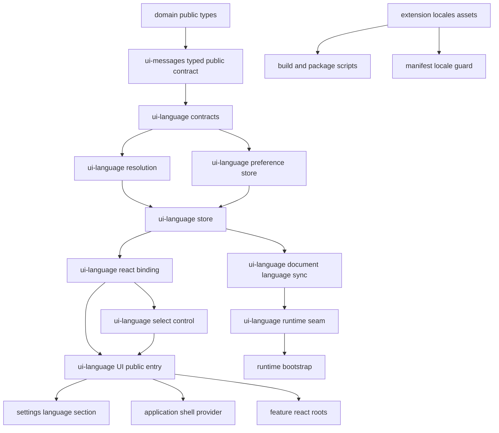
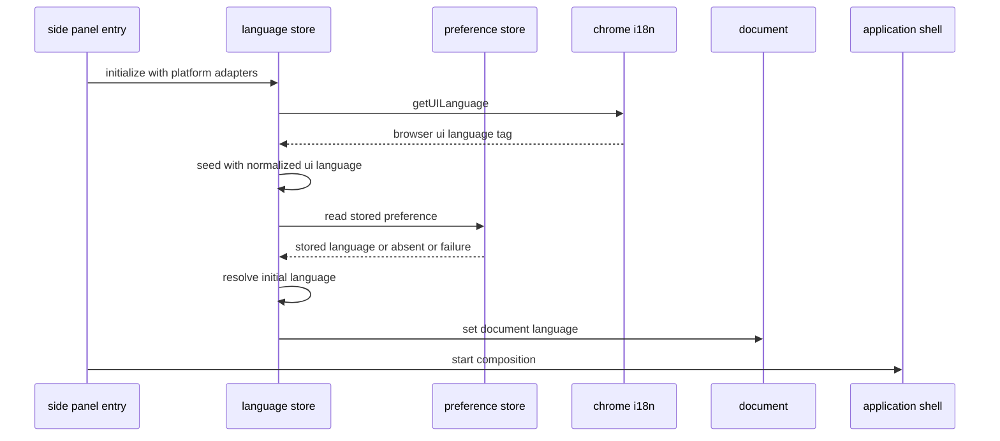
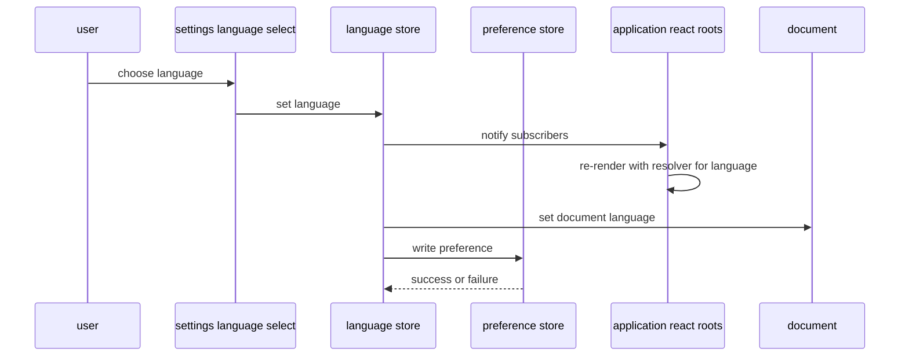
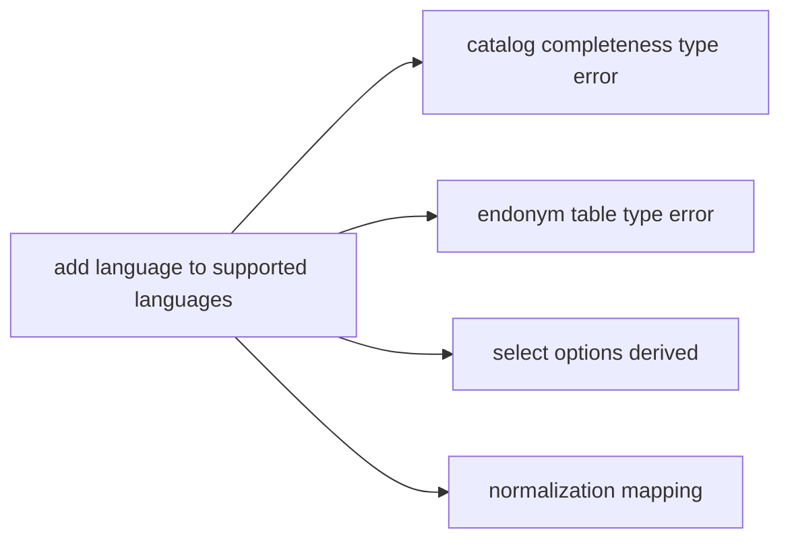

# Technical Design — ui-internationalization

## Overview

**Purpose**: 本 spec は、`ui-message-catalog` が確定させた11名前空間のja/en公開型付き契約へ **言語という次元** を接続する。対応言語の単一定義、言語状態の保持とresolver選択、設定画面へ埋め込める切り替えUI、文書の言語属性、拡張マニフェストのロケール別 `name` / `description` を導入し、利用者がブラウザや OS の設定を変えずに日本語と英語を行き来できる状態にする。

**Users**: 直接の利用者は日本語話者と非日本語話者の拡張利用者である。二次的な利用者として、3言語目を追加する開発者と、Chrome Web Store へロケール別掲載情報を入稿するリリース担当者がいる。

**Impact**: `ui-message-catalog` が対応言語registryと11名前空間の言語別resolverを公開契約として所有し、`src/ui-language/` がその契約を消費して言語状態・永続化・初期値決定・切り替えUIの公開能力を所有する。`settings-screen` は公開コントロールを表示言語区画へ配置し、`application-shell` は `LanguageProvider` とsettings navigationへの追随だけを維持する。`src/features/product-capture/` は日本語ロケール固有データを `locale/` へ隔離する。ビルド・パッケージ・マニフェスト検査は `_locales/` を配布物へ運ぶために拡張される。

### Goals

- 表示言語をアプリ内状態として持ち、ブラウザ再起動・ロケール環境変数の操作なしに切り替えられるようにする。
- `settings`を含む11名前空間でja/en parityを保証する上流の公開型付き契約を消費し、内部カタログへ依存しない。
- 表示言語の設定を、利用者のドメインデータおよびバックアップ交換形式から構造的に分離する。
- 拡張の `name` / `description` を Chrome の表示言語へ追従させ、ストア掲載のロケール別入稿を可能にする。
- 日本語ロケール向けの取り込み支援データ・ロジックを、翻訳対象の文言と構造上・機械検査上で区別する。
- 3言語目の追加が「対応言語集合への1件追加とカタログ1式の追加」に閉じる形を作る。

### Non-Goals

- UI 文言のカタログ化、スタイル・E2E ロケータの文言非依存化、view からの日本語リテラル除去。すべて `ui-message-catalog` が完了済みである。
- 日本語・英語以外の翻訳データ。基盤は追加可能な形にするが値は用意しない。
- `category-hint.ts` のキーワード辞書の多言語化。本 spec は ja 専用データとして隔離するところまでを行う。
- ロケール別の日付・数値・通貨の表示整形、通貨換算、為替レート取得。
- Chrome Web Store の詳細説明・スクリーンショットの英語版作成。
- i18n ライブラリの導入。動的な翻訳リソース読み込み。
- 表示文言の文面改善、UI の再デザイン、取り込み・保存・互換性判定の振る舞い変更。

## Boundary Commitments

### This Spec Owns

- **対応言語registry公開契約の消費** — `ui-message-catalog`が所有する`SUPPORTED_LANGUAGES`、その型、原語表記、ソース言語、フォールバック言語、言語別resolverを再定義せず利用する。本specはstatic registryを所有せず、言語state・保存・初期値解決・runtime接続を所有する。
- **カタログ公開契約の消費** — `ui-message-catalog` が公開する `MessageKey`、`MessageResolver`、`MessageProvider`、`useMessages` 等を唯一の接合面とし、11名前空間のja/en resolverを選択・供給する。
- **consumer側の契約検証** — 公開consumer型検査とresolver契約テストにより、`settings`を含む11名前空間のparity保証を受け入れ、内部カタログへの直接参照を拒否する。
- **言語状態** — 現在の表示言語、その変更、変更の通知。React 外の単一ストアとして所有する。
- **言語の初期値決定** — 保存値とブラウザ表示言語からの純関数的な解決。
- **言語設定の永続化** — `chrome.storage.local` のルート外専用キー1つに閉じた読み書き。
- **言語切り替えコントロールの振る舞い** — 選択肢の列挙、現在値の提示、切り替えの発火。
- **文書の言語属性の同期** — `document.documentElement.lang` を現在の表示言語に一致させる。
- **拡張マニフェストのロケール資産** — `_locales/{en,ja}/messages.json`、`default_locale`、`__MSG_*` 参照、およびその整合の機械検査。
- **日本語ロケール固有データの隔離** — `円` 表記の価格トークンと日本語カテゴリ推定キーワードの配置と翻訳対象外の明示。
- **配布物へのロケール資産の同梱** — ビルドとパッケージ経路。

### Out of Boundary

- **カタログの内容と構造** — キー、値、11名前空間の分割、`catalog/{ja,en}`配下のlocaleファイル、集約点、parity型・parityテスト、`MessageDescriptor` の形、`useMessages()` の参照経路。`ui-message-catalog` が所有し、本 spec は変更しない。
- **`MessageProvider` / `useMessages` の公開シグネチャ** — 変更しない。言語切り替えは Provider へ渡す resolver の差し替えだけで達成する。
- **`FeatureMountContext` と mount/unmount ライフサイクル** — 言語状態をこの経路で供給しない。上流の禁止事項をそのまま継承する。
- **切り替えUIの配置とsettings lifecycle** — `settings-screen` が表示言語区画への配置を、`application-shell` がpersistent navigation・機能搭載・エラー境界を所有する。本 spec は公開 `LanguageSelectControl` / `LanguageProvider` の契約だけを供給し、settings stateやshell stateを所有しない。
- **shell headerと状態別回復表示** — headerからのcontrol撤去、ready／maintenance／feature-local failureでのsettings到達、loading／global errorでの二言語案内は `settings-screen` と `application-shell` の責務である。本specは統合結果を受け入れ検証する。
- **`LocalDataRoot` と write authority** — 表示言語はルートへ入らない。`src/persistence/` に変更を加えない。
- **バックアップ交換形式** — `backup-restore` が所有する。表示言語は交換形式に現れない。
- **取り込み・正規化の振る舞い** — 抽出結果を1件も変えない。`locale/` への移動は配置の変更に限る。
- **Chrome Web Store ダッシュボードへの入稿作業** — リリース作業として別途扱う。

### Allowed Dependencies

- `src/ui-messages/` → `src/domain/public.js`（型のみ、上流のまま）、React 19（`createContext` / `useContext`）。
- `src/ui-language/` → `src/ui-messages/public.js`（唯一の経路）、React 19（`useSyncExternalStore` を含む）、`chrome.storage.local` / `chrome.i18n.getUILanguage`（**アダプタ1ファイルに限定**）。
- `src/features/settings/` → `src/ui-language/public.js`（`LanguageProvider` と `LanguageSelectControl` の公開能力を表示言語区画へ配置するためだけ）。
- `src/application-shell/` → `src/ui-language/public.js`（`LanguageProvider` のためだけ。`LanguageSelectControl` をheaderへ配置しない）。`src/runtime/` → `src/ui-language/runtime.js`（初期化・文書同期・platform factoryのcomposition seam）または`public.js`だけを許可する。
- `src/application-shell/side-panel.css` → `src/ui-language/language-select.css`（settings内controlを`dist/side-panel.css`へ束ねるCSS composition seamだけ）。layout ownershipはsettings/ui-languageに残し、shell header規則を置かない。
- `src/features/*/react-root.tsx`、`src/features/current-build/registration.ts` → `src/ui-language/public.js`（Provider の設置のみ）。
- `e2e/`、`tests/` → `src/ui-language/public.js`、`src/ui-messages/public.js`。
- **禁止**: `src/ui-messages/` → `src/ui-language/`。言語状態はカタログより下流であり、逆流させない。
- **禁止**: `src/ui-language/` → `src/application-shell/`、`src/features/`、`src/persistence/`。言語境界は葉である。
- **禁止**: `src/ui-language/preference-store.ts` 以外からの `chrome.storage` への到達、および同ファイルからの `localDataRoot` キーへの到達。
- **禁止**: `chrome.i18n` によるアプリ内表示文言の解決。`_locales/` は manifest の `name` / `description` にのみ用いる。

### Revalidation Triggers

- `SUPPORTED_LANGUAGES` の増減（選択肢、初期値決定、保存値の解釈、カタログ網羅性へ同時に波及する）。
- `SupportedLanguage` / `LanguageResolver` / `LanguageProvider` の公開シグネチャの変更。
- 言語設定の保存キー名、保存値の形式の変更。
- `default_locale` の変更、`_locales/` のキー追加・改称（Chrome Web Store の入稿内容へ波及する）。
- 言語切り替えコントロールの識別属性の変更（`styles.css` と E2E ヘルパへ波及する）。
- `settings-screen` の表示言語区画、`SettingsReactRoot` のmount identity、または `application-shell` のProvider設置点の変更。
- `src/application-shell/side-panel.css`から`ui-language/language-select.css`へのCSS composition seam、またはlanguage controlのproduction bundle到達経路の変更。
- 上流カタログの公開入口または内部配置の変更（公開consumer型検査とdeep import拒否規則を再検証する。内部配置そのものは本specで変更しない）。
- 上流 `MessageDefinition` の形状、`MultiPluralDefinition.selectors`、または selector 組み合わせキー構文の変更（英語カタログとカタログ整合テストへ波及する）。
- 上流の公開名前空間集合の増減、特にcanonical 11名前空間からの変更（公開consumer型検査、resolver契約、settings統合へ波及する）。

## Architecture

### Existing Architecture Analysis

- **React root は現行7本ある**。シェル1本、settingsを含むfeature 6本（専用`react-root.tsx`群 + `current-build/registration.ts` の `mountBuildView`）。上流はこの各点に Provider を張る規約を置いた。単一の React Context ではrootを横断できないため、**言語状態は React 外に置く必要がある**。これは `testing.md` が既定とする既存パターンと一致する。
- **カタログは葉の境界である**。`ui-messages` は誰にも依存しない（`domain` の型を除く）。言語状態はカタログを消費する側であり、`ui-messages` の下流に新しい葉を足すのが依存方向として自然である。
- **`chrome.storage.local` への到達点は現在1箇所**（`src/persistence/chrome-storage-adapter.ts`）であり、単一キー `localDataRoot` に閉じている。容量監視も同キーに閉じている。ルート外のキーを足しても既存の前提は動かない。
- **ビルドは個別ファイルの `copyFile` である**。ディレクトリの再帰コピーが無いため、`_locales/` は明示的に足さない限り配布物へ入らない。
- **`manifest.json` の構造は完全一致テストで固定されている**。構造変更は必ずテスト更新を伴う。

### Architecture Pattern & Boundary Map



**Architecture Integration**:

- **Selected pattern**: React 外の単一ストア + root ごとの Provider による表示直前解決。上流が用意した「Provider の resolver を差し替える」という唯一の接合点を、ストア購読で駆動する。
- **Domain/feature boundaries**: `ui-message-catalog`はキー・値・11名前空間・ja/en parityを所有し、`ui-language`はその公開型付き契約を消費して言語状態・永続化・初期値決定・resolver選択・切り替えUIを所有する。settings feature は公開Providerとcontrolを配置するだけで言語stateを複製せず、shellと他featureはProviderを受け取るだけで内部を知らない。
- **Existing patterns preserved**: UI consumerは`public.ts`、runtime compositionは`runtime.ts`の2 seamに限定する規約、React を表示 adapter に限定する方針、React 外 state + `useSyncExternalStore` の購読、規約を `scripts/validate-*.mjs` で機械化する慣行、`FeatureMountContext` を経由しない Provider 設置。
- **New components rationale**: `ui-language` は「言語状態」という新しい責務の canonical owner を確定させるために必要である。カタログ内部を再構成せず公開resolver契約を選択することで、カタログ（純粋データ）へ Chrome API 依存を混入させない。
- **Steering compliance**: 永続化ルートと write authority に触れない（`tech.md`）。`chrome.storage` への到達点をアダプタに限定し機械検査で守る（`security.md`）。翻訳リソースは静的 import でバンドルへ含める（MV3 / CSP）。`any` を使わず、境界からの値は `unknown` として受けて検証する。

### Dependency Direction

```text
domain public types (型のみ)
    ↓
ui-message-catalog public typed contract: MessageKey / MessageResolver / MessageProvider / useMessages
    ↓
ui-language: contracts → resolution / preference store → store → react binding → select control → public.ts (UI seam)
                                                                    document sync → runtime.ts (runtime seam)
    ↓
settings language section / application shell provider and runtime bootstrap / feature react roots
    ↓
styles.css / tests / e2e
```

左のレイヤーからのみ import する。`ui-messages` が `ui-language` を import した時点で違反とする。

### Technology Stack

| Layer | Choice / Version | Role in Feature | Notes |
|---|---|---|---|
| Frontend | React 19（`useSyncExternalStore`、`createContext` / `useContext`） | shellとsettingsを含む7本の React root が単一の言語ストアを購読する | 新規依存なし。既存 React をそのまま利用 |
| Frontend | TypeScript 7（`strict`、`exactOptionalPropertyTypes`、`noUncheckedIndexedAccess`） | キー集合の言語間一致をコンパイル時に保証 | マップ型の網羅性 + `satisfies` の余剰検査。プレースホルダ名の一致は単体テストが担う |
| Data / Storage | `chrome.storage.local` の専用キー `uiLanguage` | 表示言語の保持 | ルート外。write authority と交換形式に触れない |
| Runtime | `chrome.i18n.getUILanguage()` | 初期値決定の入力（同期 API） | アプリ内文言の解決には使用しない |
| Runtime | `_locales/{en,ja}/messages.json` + `default_locale` | 拡張の `name` / `description` の国際化とストア掲載 | `name` / `description` の2キーのみの最小構成 |
| Infrastructure | esbuild + `scripts/build.mjs` の資産コピー | `_locales/` を `dist/` と配布 zip へ運ぶ | 動的読み込みなし。CSP を弱めない |
| Tooling | Node 標準テストランナー、testing-library、Playwright | 初期値決定は単体、切り替えは DOM / E2E | 新しいテストツールを追加しない |
| Tooling | `scripts/validate-artifacts.mjs`（拡張）、`scripts/validate-ui-text.mjs`（除外更新） | ロケール整合と翻訳対象外データの機械検査 | 既存スクリプトの拡張であり新設しない |

## File Structure Plan

### Directory Structure

```
_locales/                              # 新規。manifest とストア掲載のためだけの最小構成
├── en/messages.json                   # default_locale。全キーを持つ最終フォールバック
└── ja/messages.json                   # 日本語の name / description

src/
├── ui-language/                       # 新規境界。言語状態とProvider選択の canonical owner
│   ├── contracts.ts                   # 対応言語、原語表記、言語設定ポート、解決入力、ストアの型
│   ├── resolve.ts                     # 純関数。言語タグ正規化と初期値決定
│   ├── preference-store.ts            # 専用キー1つに閉じた chrome.storage.local アダプタ
│   ├── store.ts                       # React 外の単一ストア。購読と初期化
│   ├── react.ts                       # LanguageProvider（MessageProvider を内包）/ useLanguage
│   ├── language-select.ts             # 切り替えコントロール（振る舞いの所有）
│   ├── language-select.css            # コントロールのスタイル
│   ├── document-language.ts           # documentElement.lang の同期
│   ├── public.ts                      # UI consumer向け公開入口
│   └── runtime.ts                     # runtime composition専用seam
└── features/product-capture/
    └── locale/                        # 新規。翻訳対象外の日本語ロケールデータ
        ├── ja-category-keywords.ts    # category-hint.ts から移設したキーワード辞書
        └── ja-price-tokens.ts         # normalizer.ts から移設した「円」表記の判定

e2e/
└── language-switching.spec.ts         # 新規。切り替え操作による英語UI検証と保持の検証

tests/
├── ui-language/                       # 新規。解決・保存・ストア・Provider・コントロール
│   ├── {resolve,preference-store,store,react,language-select}.test.ts(x)
│   └── public-consumer.test.ts        # 11名前空間の公開resolver契約とdeep import禁止を検証
```

### Modified Files

| ファイル | 変更内容 |
|---|---|
| `manifest.json` | `name` を `__MSG_extensionName__`、`description` を `__MSG_extensionDescription__` として追加、`default_locale: "en"` を追加 |
| `side-panel.html` | `<html lang="ja">` から `lang` 属性を除去する。値は bootstrap が設定する |
| `src/ui-messages/languages.ts` / `src/ui-messages/public.ts` | 対応言語・原語表記・resolver選択のcanonical registryを所有・公開する。カタログ内部は再公開しない |
| `src/ui-language/public.ts` / `src/ui-language/runtime.ts` | UI consumer能力とruntime初期化・文書同期のcomposition seamを分離し、カタログ内部を再公開しない |
| `src/ui-language/react.ts` | 選択言語に対応する公開`MessageResolver`を`MessageProvider`へ渡し、11名前空間を透過的に解決する |
| `src/features/settings/view.tsx` | `settings-screen` 所有の表示言語区画へ公開 `LanguageSelectControl` を一度だけ配置する。言語stateを複製しない |
| `src/features/settings/react-root.tsx` | `LanguageProvider` 配下にsettings viewを描画し、言語変更でsettings rootとsection hostのidentityを保持する |
| `src/application-shell/shell-view.tsx` | `settings-screen` / `application-shell` 契約に従いheaderの言語controlを撤去する。navigation不能時は操作不能selectを描画せず「設定 / Settings」案内を表示する |
| `src/application-shell/shell-view.css` | 旧header control配置規則を除去し、状態別settings案内を文言非依存セレクタで扱う |
| `src/application-shell/side-panel.css` | `ui-language/language-select.css`をsettings control用CSS composition seamとしてimportし、side-panel bundleへ到達させる |
| `src/application-shell/react-shell-root.tsx` | シェル root の Provider を `MessageProvider` から `LanguageProvider` へ置き換える |
| `src/runtime/side-panel-bootstrap.ts` | `src/ui-language/runtime.ts`だけから初期化・文書同期能力を受け、シェル起動前に実行する |
| `src/features/{candidate-management,product-capture,compatibility,backup-restore}/react-root.tsx` | Provider を `LanguageProvider` へ置き換える |
| `src/features/current-build/registration.ts` | `mountBuildView` の Provider を `LanguageProvider` へ置き換える |
| `src/features/product-capture/category-hint.ts` | キーワード辞書を `locale/ja-category-keywords.ts` から import する。推定ロジックと結果は不変 |
| `src/features/product-capture/normalizer.ts` | `円` 表記の判定を `locale/ja-price-tokens.ts` から import する。抽出結果は不変 |
| `scripts/build.mjs` | `_locales/` を `dist/` へ再帰コピーする |
| `scripts/validate-artifacts.mjs` | `__MSG_*` と `default_locale` と `_locales/` の整合を検査する規則を追加 |
| `scripts/validate-boundaries.mjs` | `chrome.storage.local`をfoundation/languageの2 adapter、`chrome.storage.session`をtransient専用adapterだけへ限定し、runtimeのui-language deep importも拒否する |
| `tests/setup-dom.ts` および DOM テストハーネス | Provider を `LanguageProvider` へ置き換え、`afterEach` で言語ストアを初期状態へ戻す |
| `scripts/validate-ui-text.mjs` | 本spec所有範囲では原語表記を持つ`src/ui-language/contracts.ts`と`src/features/product-capture/locale/`だけを除外へ追加し、`category-hint.ts`を除外から外す。catalog除外は`ui-message-catalog`所有のまま変更しない |
| `tests/runtime/manifest.test.ts` | 完全一致対象へ `description` / `default_locale` / `__MSG_*` を反映。`_locales/` の実在と全キー充足、`<html>` の `lang` 非固定を検査 |
| `tests/tooling/package.test.ts` | 合成配布物へ `_locales/` を含め、配布 zip へロケール資産が入ることを検査 |
| `e2e/locators.ts` | 言語コントロールのロケータと、公開型付き契約による言語別の期待値解決を追加 |
| `package.json` | 変更不要（新しい script を追加しない）。検査は既存 `validate:artifacts` / `validate:ui-text` の内部で強化する |

## System Flows

### 起動時の言語決定



保存値の読み取りは非同期であるため、ストアはまず同期取得できるブラウザ表示言語で確定し、その後に保存値があれば置き換える。シェルの起動は初期化の解決を待ってから行い、最初の描画が確定言語で行われるようにする。読み取りに失敗した場合は保存値なしと同じ経路へ落ち、起動を止めない。

### 言語切り替えの伝播



通知は同期的に行い、保存は非同期で追随する。保存が失敗してもストアの値は戻さず、その回の表示は選択された言語のまま継続する。ストアの更新は **root の生成・破棄を伴わない**。購読による再レンダーのみであるため、表示中の機能・選択・入力途中の内容は保持される。

### 言語追加時の波及



対応言語の追加は、カタログ網羅性と原語表記の型エラーとして即座に検出される。選択肢と初期値決定は同じ集合から導出されるため、追加の手当てを要しない。

## Requirements Traceability

| Requirement | Summary | Components | Interfaces | Flows |
|---|---|---|---|---|
| 1.1, 1.6 | settings表示言語区画の切り替え操作面、原語表記と現在値の提示 | LanguageSelectControl, SettingsLanguageIntegration, LanguageRegistry | `useLanguage()`, `languageEndonym` | 言語切り替えの伝播 |
| 1.2 | 再起動なしの即時反映 | LanguageStore, LanguageReactBinding | `subscribe` / `getSnapshot` | 言語切り替えの伝播 |
| 1.3 | settings root・区画・入力・スクロール位置の保持 | LanguageReactBinding, SettingsLanguageIntegration | `LanguageProvider`, `SettingsReactRoot` | 言語切り替えの伝播 |
| 1.4 | 保存データと判定結果の不変 | LanguagePreferenceStore | 専用キーのみの読み書き | — |
| 1.5 | maintenance中のsettingsで切り替え可能 | SettingsLanguageIntegration | `LanguageSelectControl`, `OperationPolicy`から独立した言語state | 言語切り替えの伝播 |
| 1.7, 1.8 | header非常設と到達不能時の二言語案内 | SettingsLanguageIntegration | settings navigation, shell status message | — |
| 2.1, 2.2, 2.6 | 保存値優先、無ければブラウザ表示言語 | LanguageResolution, LanguageStore | `resolveInitialLanguage` | 起動時の言語決定 |
| 2.3 | 地域付きタグの正規化 | LanguageResolution | `normalizeLanguageTag` | 起動時の言語決定 |
| 2.4 | 未対応言語は英語へ | LanguageResolution | `FALLBACK_LANGUAGE` | 起動時の言語決定 |
| 2.5 | 壊れた保存値でも起動する | LanguagePreferenceStore, LanguageResolution | `Result` による失敗表現 | 起動時の言語決定 |
| 3.1 | 再起動をまたぐ保持 | LanguagePreferenceStore, LanguageStore | `LanguagePreferencePort` | 言語切り替えの伝播 |
| 3.2, 3.3, 3.4, 3.6 | ドメインデータからの分離 | LanguagePreferenceStore, StorageAccessGuard | 専用キー定数、到達点の機械検査 | — |
| 3.5 | 保存失敗でも操作を中断しない | LanguageStore | 保存結果を表示へ反映しない | 言語切り替えの伝播 |
| 4.1 | 11名前空間のja/enキーparityを持つ公開契約の消費 | UiMessagesPublicContract, LanguageCatalogConsumer | `MessageKey`, `MessageResolver` | 言語追加時の波及 |
| 4.2 | パラメータparity済み公開resolverだけを利用 | UiMessagesPublicContract, LanguageCatalogConsumer | `MessageResolver` | 言語追加時の波及 |
| 4.3, 4.6, 4.7 | 全画面の英語表示、共有語彙、外部由来文字列の非翻訳 | LanguageCatalogConsumer, LanguageRegistry | `resolverFor` | 言語切り替えの伝播 |
| 4.4 | 単一件数の単複表現を公開resolverから受け入れる | LanguageCatalogConsumer | `MessageResolver` | — |
| 4.5 | 複数件数を含む1文を公開resolverから受け入れる | LanguageCatalogConsumer | `MessageResolver` | — |
| 5.1, 5.2, 5.3 | 文書の言語属性 | DocumentLanguageSync, LanguageRuntimeBootstrap | `syncDocumentLanguage` | 起動時の言語決定 / 言語切り替えの伝播 |
| 6.1, 6.2, 6.3, 6.4 | manifest とストア掲載の国際化 | ExtensionLocaleAssets | `_locales/{en,ja}/messages.json`, `default_locale` | — |
| 6.5, 6.6 | ロケール整合と既存セキュリティ検査の維持 | ManifestLocaleGuard | `validateManifest` 拡張 | — |
| 7.1, 7.2 | 翻訳対象外データの構造上・文書上の明示 | JapaneseLocaleData | `locale/` 配下の専用モジュール | — |
| 7.3, 7.4 | 抽出結果の不変と言語非依存 | JapaneseLocaleData | 既存の抽出関数シグネチャ | — |
| 7.5 | 誤って文言扱いされた場合の検出 | UiTextGuardExclusions | `validate:ui-text` | — |
| 8.1, 8.2 | settings経由で行うブラウザ言語非依存の英語UI検証 | LanguageE2ESpec | `e2e/locators.ts` | 言語切り替えの伝播 |
| 8.3 | 初期値決定は実ブラウザ非依存の検証 | LanguageResolution | 純関数の単体テスト | 起動時の言語決定 |
| 8.4 | 配布物へのロケール資産同梱 | BuildLocaleCopy | `scripts/build.mjs` | — |
| 8.5, 8.6 | 検査の受け入れと検証フロー全段の成功 | ManifestLocaleGuard, ExtensionLocaleAssets | `pnpm validate` | — |
| 9.1 | 参照側を触らない言語追加 | LanguageRegistry, LanguageReactBinding | `resolverFor` | 言語追加時の波及 |
| 9.2 | キー不足を上流公開型で検出 | UiMessagesPublicContract, LanguageCatalogConsumer | 公開consumer型検査 | 言語追加時の波及 |
| 9.3 | 対応言語の単一定義からの導出 | LanguageRegistry, LanguageSelectControl, LanguageResolution | `SUPPORTED_LANGUAGES` | 言語追加時の波及 |
| 9.4 | 本specで翻訳データを追加しない | LanguageCatalogConsumer | — | — |
| 9.5 | 静的同梱 | LanguageRegistry | 静的 import のみ | — |

## Components and Interfaces

| Component | Domain/Layer | Intent | Req Coverage | Key Dependencies (P0/P1) | Contracts |
|---|---|---|---|---|---|
| UiMessagesPublicContract | ui-message-catalog（外部所有） | 11名前空間のキー・ja/en値・parity済みresolverを型付きで公開 | 4.1, 4.2, 9.1, 9.2 | — | Service |
| LanguageCatalogConsumer | ui-language | 公開契約から言語別resolverを選択しProviderへ供給。catalog内部を参照しない | 4.1〜4.7, 9.1, 9.2, 9.4, 9.5 | UiMessagesPublicContract (P0) | Service |
| LanguageRegistry | ui-message-catalog（外部所有） | 対応言語の単一定義、原語表記、言語別 resolver の選択を公開契約として提供 | 1.6, 4.3, 9.1, 9.3, 9.5 | UiMessagesPublicContract (P0) | Service, State |
| LanguageContracts | ui-language | 言語状態・保存ポート・解決入力の型 | 2.1, 3.1, 9.3 | UiMessagesPublicContract (P0) | State |
| LanguageResolution | ui-language | 言語タグ正規化と初期値決定の純関数 | 2.1〜2.6, 8.3, 9.3 | LanguageContracts (P0) | Service |
| LanguagePreferenceStore | ui-language | ルート外専用キーへの読み書き | 1.4, 2.5, 3.1〜3.6 | LanguageContracts (P0), chrome.storage.local (P0) | Service |
| LanguageStore | ui-language | React 外の単一ストアと初期化 | 1.2, 2.1, 2.6, 3.1, 3.5 | LanguageResolution (P0), LanguagePreferenceStore (P0) | Service, State |
| LanguageReactBinding | ui-language | root ごとの Provider とフック | 1.2, 1.3, 9.1 | LanguageStore (P0), MessageReactContext (P0) | Service |
| LanguageSelectControl | ui-language | 切り替えコントロールの振る舞い | 1.1, 1.6, 9.3 | LanguageReactBinding (P0), LanguageRegistry (P0) | — |
| DocumentLanguageSync | ui-language | 文書の言語属性の同期 | 5.1, 5.2, 5.3 | LanguageStore (P0) | Service |
| UiLanguagePublicEntry | ui-language | UI consumer向け公開入口（runtimeは専用`runtime.ts` seam） | 9.1 | 上記UI能力 (P0) | Service |
| SettingsLanguageIntegration | settings-screen / application-shell | 公開controlをsettingsだけへ配置し、shellのProvider追随・状態別到達を受け入れる統合seam | 1.1, 1.3, 1.5〜1.8 | UiLanguagePublicEntry (P0), settings-screen public contract (P0), application-shell public contract (P0) | State |
| LanguageRuntimeBootstrap | runtime / application-shell | 起動前の初期化と文書同期の開始 | 2.1, 2.6, 5.1 | LanguageStore (P0), DocumentLanguageSync (P0) | Service |
| FeatureRootLanguageBinding | features | 5本の feature root の Provider 置き換え | 1.2, 1.3 | UiLanguagePublicEntry (P0) | — |
| JapaneseLocaleData | features / product-capture | 翻訳対象外の日本語ロケールデータの隔離 | 7.1〜7.4 | — | State |
| ExtensionLocaleAssets | manifest | ロケール別 `name` / `description` | 6.1〜6.4 | — | State |
| ManifestLocaleGuard | scripts | ロケール整合の機械検査 | 6.5, 6.6, 8.5 | ExtensionLocaleAssets (P0) | Batch |
| BuildLocaleCopy | scripts | 配布物へのロケール資産同梱 | 8.4 | ExtensionLocaleAssets (P0) | Batch |
| UiTextGuardExclusions | scripts | 除外パスの更新と翻訳対象外データの保護 | 7.5 | JapaneseLocaleData (P0) | Batch |
| StorageAccessGuard | scripts | `chrome.storage` 到達点の限定 | 3.2, 3.4 | LanguagePreferenceStore (P0) | Batch |
| LanguageE2ESpec | e2e | settings表示言語区画の切り替え操作による英語UI検証 | 8.1, 8.2 | LanguageSelectControl (P0), SettingsLanguageIntegration (P0) | — |

### ui-message-catalog公開契約

#### LanguageRegistry

| Field | Detail |
|---|---|
| Intent | 対応言語の集合を単一定義として持ち、言語ごとの resolver と原語表記を供給する |
| Requirements | 1.6, 4.3, 9.1, 9.3, 9.5 |

**Responsibilities & Constraints**

- 対応言語の集合は`src/ui-messages/languages.ts`の `SUPPORTED_LANGUAGES` **のみ**を出典とし、`src/ui-messages/public.ts`から公開する。選択肢・初期値決定・保存値の解釈・カタログ網羅性はすべてこの1定義から導出する。
- **ソース言語**（`SOURCE_LANGUAGE = "ja"`）と**フォールバック言語**（`FALLBACK_LANGUAGE = "en"`）を別々の概念として持つ。前者はカタログの「形」の源であり上流の既定 resolver と一致する。後者は初期値決定で対応言語へ対応付けられなかった場合の帰着先である。両者が異なる理由をモジュール内へ明記する。
- 原語表記（`日本語` / `English`）は翻訳対象ではない。言語に依存しないデータとして本モジュールが持ち、カタログのキーにはしない。**本ファイルは `validate:ui-text` の除外対象へ加える**（CJK リテラルを含むため）。
- resolver は言語ごとにモジュール生成時に1つだけ作り、以後は同一参照を返す。切り替えのたびに resolver を作り直さない。
- resolverは`ui-message-catalog`内でカタログを静的importして一度だけ生成し、公開入口からregistry/resolver能力だけを公開する。`ui-language`は`src/ui-messages/public.ts`だけをimportし、カタログ内部やlocaleファイルをimportしない。動的読み込みを行わない。

**Dependencies**

- Outbound: ui-message-catalog内部のcatalog/resolver（P0、静的依存）
- Inbound: LanguageContracts, LanguageStore, LanguageSelectControl

**Contracts**: Service [x] / State [x]

##### State Management

```typescript
export const SUPPORTED_LANGUAGES = ["ja", "en"] as const;
export type SupportedLanguage = (typeof SUPPORTED_LANGUAGES)[number];

/** カタログの形の源。上流の defaultMessageResolver と同一言語。 */
export const SOURCE_LANGUAGE: SupportedLanguage = "ja";
/** 初期値決定で対応言語へ対応付けられなかった場合の帰着先。 */
export const FALLBACK_LANGUAGE: SupportedLanguage = "en";

/** 各言語の原語表記。翻訳対象ではないためカタログへ入れない。 */
export const languageEndonym: Readonly<Record<SupportedLanguage, string>>;
```

##### Service Interface

```typescript
export const resolverFor: (language: SupportedLanguage) => MessageResolver;
```

- Preconditions: `language` は `SupportedLanguage` である。
- Postconditions: 同一言語に対して常に同一参照の resolver を返す。
- Invariants: モジュール定数であり実行時に変更されない。

**Implementation Notes**

- Integration: 上流の `defaultMessageResolver` は `resolverFor(SOURCE_LANGUAGE)` と同一の resolver を指すようにし、Provider 未設置時の表示が現行と変わらないことを維持する。
- Validation: `languageEndonym` を `Record<SupportedLanguage, string>` として定義し、言語追加時に欠落が型エラーになることを最小例で確認する。
- Risks: `SUPPORTED_LANGUAGES` の重複定義がどこかに生まれると 9.3 が崩れる。`ui-messages/public.ts`からのみ参照させ、ui-language、settings、shellで再定義しない。

#### UiMessagesPublicContract

| Field | Detail |
|---|---|
| Intent | 上流が所有する11名前空間のja/enメッセージを型付きresolverとして受け取る |
| Requirements | 4.1〜4.7, 9.4 |

**Responsibilities & Constraints**

- canonical集合は`common`、`category`、`persistenceError`、`nav`、`shell`、`candidate`、`build`、`compatibility`、`capture`、`backup`、`settings`の11名前空間である。
- キー、値、localeファイル、名前空間集約、ja/en parityは`ui-message-catalog`が所有する。本specはそれらを追加・改称・削除しない。
- `MessageKey`、`MessageResolver`、`MessageProvider`、`useMessages`等の公開型付き契約だけを利用し、`src/ui-messages/catalog/**`を直接importしない。
- 単複表現、複数件数を含む文、共有語彙、外部由来文字列は公開resolverの結果として受け入れ、consumer側で文片を再構成しない。

**Dependencies**

- Outbound: `src/ui-messages/public.ts`（P0）
- Inbound: LanguageRegistry, LanguageReactBinding

**Contracts**: Service [x]

##### Service Interface

```typescript
type CatalogResolverFor = (language: SupportedLanguage) => MessageResolver;
```

- Preconditions: 上流の型検査とparity gateが11名前空間のja/en一致を保証している。
- Postconditions: consumerは選択言語に対応する`MessageResolver`だけを受け取り、カタログ実体を露出しない。
- Invariants: catalog内部へのdeep importは行わない。

**Implementation Notes**

- Integration: `LanguageProvider`は選択言語の公開resolverを`MessageProvider`へ渡すだけとする。
- Validation: 公開consumer型検査で11名前空間のja/en resolverを利用できることを確認し、`settings.title`等のsettings keyが選択言語で解決されることを契約テストで固定する。
- Risks: 上流の名前空間追加をconsumerが固定列挙で隠すこと。旧固定数の記述とcatalog deep importを完全検証gateで拒否する。

#### LanguageCatalogConsumer

| Field | Detail |
|---|---|
| Intent | 上流のparity済み公開契約からresolverを選択し、言語stateに応じてProviderへ供給する |
| Requirements | 4.1, 9.2 |

**Responsibilities & Constraints**

- キー集合・placeholder・数量定義のparityを再実装しない。上流の公開型が不成立ならconsumer型検査を失敗させる。
- `settings`を含む11名前空間を公開resolverから透過的に解決し、名前空間ごとのswitchやaliasを持たない。
- `MessageProvider`へresolverを渡し、カタログ定数・localeファイル・parity型を公開または保持しない。

**Dependencies**

- Outbound: UiMessagesPublicContract（P0）
- Inbound: LanguageRegistry, LanguageReactBinding

**Contracts**: Service [x]

##### Service Interface

```typescript
export const resolverFor: (language: SupportedLanguage) => MessageResolver;
```

- Preconditions: `language`は`SupportedLanguage`であり、上流公開契約が型検査を通過している。
- Postconditions: ja/enのどちらでも11名前空間を解決できるresolverを返す。
- Invariants: resolver以外のcatalog実体をconsumerへ漏らさない。

**Implementation Notes**

- Integration: `LanguageReactBinding`が現在言語に対応するresolverを取得し、各rootの`MessageProvider`へ供給する。
- Validation: `public-consumer.test.ts`でja/en双方の`settings.title`を含む代表keyを解決し、公開consumer型検査と境界検査を通す。
- Risks: catalog内部型をconsumer側に複製すると所有権が分裂するため、公開型以外のimportを違反とする。

### ui-language

#### LanguageResolution

| Field | Detail |
|---|---|
| Intent | 言語タグの正規化と初期値決定を、環境に依存しない純関数として提供する |
| Requirements | 2.1〜2.6, 8.3, 9.3 |

**Responsibilities & Constraints**

- `normalizeLanguageTag` は BCP 47 風のタグを受け取り、`-` / `_` 区切りの先頭サブタグを小文字化して対応言語と照合する。`ja-JP` / `ja_JP` / `JA` はいずれも `ja` へ解決する。
- 対応言語へ対応付けられないタグ、空文字、`undefined` は `undefined` を返す。推測しない。
- `resolveInitialLanguage` は「保存値 → ブラウザ表示言語 → フォールバック言語」の優先順で決定する。保存値が対応言語として解釈できない場合は保存値なしと同じ扱いにする。
- 例外を投げない。入力はすべて `unknown` として受け、境界で検証する。
- 対応言語の集合は `ui-messages` の `SUPPORTED_LANGUAGES` から導き、本モジュールで再定義しない。

**Dependencies**

- Outbound: LanguageContracts（P0）、ui-message-catalog公開LanguageRegistry（P0、`SUPPORTED_LANGUAGES` / `FALLBACK_LANGUAGE`）
- Inbound: LanguageStore

**Contracts**: Service [x]

##### Service Interface

```typescript
export const normalizeLanguageTag: (tag: unknown) => SupportedLanguage | undefined;

export interface LanguageResolutionInput {
  readonly stored: unknown;
  readonly browserUiLanguage: unknown;
}

export const resolveInitialLanguage: (
  input: LanguageResolutionInput,
) => SupportedLanguage;
```

- Preconditions: なし。任意の値を受け付ける。
- Postconditions: 返り値は常に `SupportedLanguage` である。
- Invariants: 副作用を持たない。同じ入力に対して同じ出力を返す。

**Implementation Notes**

- Integration: `chrome.i18n.getUILanguage()` の呼び出しは本モジュールでは行わない。呼び出し結果を入力として受け取ることで、実ブラウザを起動せずに全分岐を単体テストできる（8.3）。
- Validation: `ja`, `ja-JP`, `ja_JP`, `JA`, `en`, `en-US`, `en-GB`, `fr`, `zh-CN`, `""`, `undefined`, 非文字列の各入力に対する期待値を表として固定する。
- Risks: 地域差の扱いを将来 `pt-BR` のように区別する必要が出た場合、先頭サブタグ照合では足りなくなる。対応言語が地域を持つまでは不要であり、その時点で正規化規則を差し替える。

#### LanguagePreferenceStore

| Field | Detail |
|---|---|
| Intent | 表示言語を `chrome.storage.local` のルート外専用キー1つへ読み書きする |
| Requirements | 1.4, 2.5, 3.1〜3.6 |

**Responsibilities & Constraints**

- **保存先は `chrome.storage.local` の専用キー `uiLanguage` とし、`localDataRoot` へは一切触れない。** アダプタは自分のキー名を定数として1つだけ持ち、キーを引数で受け取らない。
- **local data foundation の write authority を経由しない。** その理由と非違反性は下記「保存先の判断」に記す。
- 読み書きの失敗は例外ではなく `Result` で返す。失敗コードは安定した英字コードのみとし、保存値そのものをログへ出さない。
- 読み取り値は `unknown` として受け、`normalizeLanguageTag` を通してから内部型へ変換する。
- 書き込みは最後の選択のみを保持する上書きであり、履歴を持たない。値は言語コード1つの文字列であり、容量監視の前提に影響しない。

**保存先の判断**（要件 3.2 / 3.4 と `tech.md` の単一 write authority 規約の関係）

`tech.md` は「local data foundation を単一の信頼済み write authority とし、すべての永続化 mutation をそこへルーティングする」と定めている。この規約が守っている対象は、隣接する記述（バージョン付き保存ルート、原子的 root mutation、参照修復、maintenance fencing、容量監視）が示すとおり **`LocalDataRoot` というドメインデータのルート**である。実装上もそれは明確であり、`src/persistence/chrome-storage-adapter.ts` は単一キー `localDataRoot` のみを読み書きし、容量計測も同キーに閉じている。

表示言語をこのルートへ入れた場合、次の3つの具体的な害が生じる。

1. **交換形式への混入**。`src/features/backup-restore/exchange.ts` は `LocalDataRoot` の内容を交換形式へ写像する。表示言語がルートに入れば、バックアップに UI 設定が含まれ、他端末で作成したファイルの復元が利用者の表示言語を書き換える。これは要件 3.2 / 3.3 に真正面から反する。
2. **保守中に変更できなくなる**。復元は原子的置換であり maintenance fencing の下で行われる。ルート経由の書き込みは fencing に従うため、要件 1.5（保守中・エラー中も切り替え可能）を満たせない。
3. **容量監視の前提が動く**。`bytesInUse` はルートキー単独の計測である。ドメインデータでない値をそこへ混ぜると、10MB 上限に対する監視の意味が濁る。

したがって表示言語は**ルート外の専用キー**へ置く。この判断が「単一 write authority」を破らないことは、次の3点で構造的に担保する。

- アダプタはキー名を定数として1つだけ持ち、`localDataRoot` を参照する経路を持たない。ルートに対する第二の書き込み口は生まれない。
- `chrome.storage.local` への到達点を `src/persistence/chrome-storage-adapter.ts` と `src/ui-language/preference-store.ts` の2ファイルに限定する。後続`transient-feature-surface`が所有する`chrome.storage.session`は`src/runtime/transient-activation-store.ts`だけに限定し、それ以外からの到達を **StorageAccessGuard** が機械検査で失敗させる（3.2, 3.4）。feature が直接 Chrome Storage を呼ぶ経路は引き続き存在しない。
- storage area の access level（`TRUSTED_CONTEXTS`）は area 全体に対する設定であり、キーを増やしても content script からの到達可能性は変わらない。`security.md` の前提を崩さない。

**Dependencies**

- Outbound: LanguageContracts（P0）、`chrome.storage.local`（P0、External）
- Inbound: LanguageStore

**Contracts**: Service [x]

##### Service Interface

```typescript
export type LanguagePreferenceError =
  | { readonly code: "storage-unavailable" }
  | { readonly code: "storage-write-failed" };

export interface LanguagePreferencePort {
  read(): Promise<Result<SupportedLanguage | undefined, LanguagePreferenceError>>;
  write(language: SupportedLanguage): Promise<Result<void, LanguagePreferenceError>>;
}

/** 読み書きに必要な最小面だけを受ける。storage area 全体を渡さない。 */
export interface LanguagePreferenceStorageApi {
  get(key: string): Promise<Record<string, unknown>>;
  set(items: Record<string, unknown>): Promise<void>;
}

export const createLanguagePreferencePort: (
  storage: LanguagePreferenceStorageApi,
) => LanguagePreferencePort;

/** テストと非 Chrome 実行環境のための実装。 */
export const createInMemoryLanguagePreferencePort: (
  initial?: SupportedLanguage,
) => LanguagePreferencePort;
```

- Preconditions: `storage` は `chrome.storage.local` 相当の最小面を満たす。
- Postconditions: `read` は保存値が無い場合と解釈できない場合の双方で `ok(undefined)` を返す。
- Invariants: 触れるキーは1つだけであり、実行時に変わらない。

**Implementation Notes**

- Integration: 実装は `src/persistence/chrome-storage-adapter.ts` の `Result` の扱いに揃える。ただし `Result` 型は `src/domain/public.js` の canonical 定義を用い、再定義しない。
- Validation: 保存値が壊れている（数値・オブジェクト・未対応言語）場合に `ok(undefined)` へ落ちること、書き込み失敗が `Result` で返ること、いずれの経路でも例外が漏れないことを単体テストで固定する。
- Risks: 将来 UI 設定が増えたときに本ポートが汎用設定ストアへ肥大化する。本 spec では表示言語のみを扱い、汎用化しない。

#### LanguageStore

| Field | Detail |
|---|---|
| Intent | 現在の表示言語を React 外の単一ストアとして保持し、shellとsettingsを含む7本の React root へ通知する |
| Requirements | 1.2, 2.1, 2.6, 3.1, 3.5 |

**Responsibilities & Constraints**

- **モジュール単一インスタンス**として公開する。`FeatureMountContext` を介して配らないという上流の規約を守りつつ、7本の root が同じ値を見る唯一の方法である。
- 初期化前のシードは `SOURCE_LANGUAGE` とする。これは上流の既定 resolver と一致し、Provider 未設置・未初期化の DOM テストの前提を壊さないためである。**製品としての初期値は必ず `initialize` が決定する**旨をモジュール内へ明記する。
- `initialize` は同期取得できるブラウザ表示言語で即座に確定させたうえで、保存値の読み取り結果があればそれで置き換える。解決の完了は Promise として返し、シェル起動はこれを待つ。
- `setLanguage` は同期的に値を更新して購読者へ通知し、保存は非同期に追随させる。**保存の失敗で値を巻き戻さない**（3.5）。
- 既に選択中の言語と同じ値が渡された場合は通知も保存も行わない。
- `initialize` は冪等とする。二度目以降は既存の解決結果を返し、明示的な選択を上書きしない（2.6）。

**Dependencies**

- Outbound: LanguageResolution（P0）、LanguagePreferencePort（P0）、LanguageRegistry（P0）
- Inbound: LanguageReactBinding, DocumentLanguageSync, LanguageRuntimeBootstrap

**Contracts**: Service [x] / State [x]

##### Service Interface

```typescript
export interface LanguageStore {
  getSnapshot(): SupportedLanguage;
  subscribe(listener: (language: SupportedLanguage) => void): () => void;
  setLanguage(language: SupportedLanguage): void;
}

export interface LanguagePlatform {
  readonly preferences: LanguagePreferencePort;
  /** chrome.i18n.getUILanguage の呼び出し結果。取得できない環境では undefined。 */
  readonly browserUiLanguage: () => unknown;
}

/** shellとsettingsを含む7本の root が共有する単一インスタンス。 */
export const uiLanguageStore: LanguageStore;

/** 起動時に一度だけ呼ぶ。解決完了を待てる。 */
export const initializeUiLanguage: (
  platform: LanguagePlatform,
) => Promise<SupportedLanguage>;

/** テスト専用。ストアを初期状態へ戻す。 */
export const resetUiLanguageForTest: () => void;
```

- Preconditions: `initialize` は起動経路から一度だけ呼ばれる。
- Postconditions: `getSnapshot` は常に `SupportedLanguage` を返す。購読解除関数は冪等である。
- Invariants: 通知は同期的であり、購読者は通知時点で `getSnapshot` から新しい値を得られる。

##### State Management

- State model: 単一の `SupportedLanguage` 値と購読者集合、初期化の解決状態。
- Persistence & consistency: 表示の真実はメモリ上の値であり、保存は追随に過ぎない。保存失敗時もメモリ上の値を正とする。
- Concurrency strategy: MV3 side panel は単一文書であり、複数文書からの同時更新を想定しない。`chrome.storage.onChanged` の購読は行わない（他文書からの変更経路が存在しないため）。

**Implementation Notes**

- Integration: `useSyncExternalStore` から直接使える形（`subscribe` / `getSnapshot`）に揃える。
- Validation: 初期化前後の値、同値設定時の無通知、保存失敗時に値が戻らないこと、購読解除後に通知が来ないこと、`initialize` の冪等性を単体テストで固定する。
- Risks: モジュール単一インスタンスはテスト間で状態が漏れる。`--test-isolation=none` で実行しているため、`resetUiLanguageForTest` をテストハーネスの `afterEach` へ組み込む。

#### LanguageReactBinding

| Field | Detail |
|---|---|
| Intent | 各 React root で言語ストアを購読し、対応する resolver を `MessageProvider` へ供給する |
| Requirements | 1.2, 1.3, 9.1 |

**Responsibilities & Constraints**

- `LanguageProvider` は `useSyncExternalStore` でストアを購読し、`resolverFor(language)` を上流の `MessageProvider` へ渡す。**上流の `MessageProvider` / `useMessages` のシグネチャを変更しない。**
- shell、settings、5 featureの7本の root すべてがこの Provider を張る。上流が `MessageProvider` を張っていた位置をそのまま置き換える。
- 言語の変更は **再レンダーのみ**を引き起こす。root の生成・破棄・`unmount` を伴わない。これにより表示中の機能・選択・入力途中の内容・スクロール位置が保持される（1.3）。
- `useLanguage` は現在の言語・切り替え関数・選択可能な言語の一覧を返す。カタログそのものを露出しない。
- テストのために `store` を props で差し替えられるようにするが、既定は単一インスタンスとする。

**Dependencies**

- Outbound: LanguageStore（P0）、MessageReactContext（P0、上流）、LanguageRegistry（P0）
- Inbound: FeatureRootLanguageBinding, SettingsLanguageIntegration, application-shell ReactShellRoot, LanguageSelectControl

**Contracts**: Service [x]

##### Service Interface

```typescript
export const LanguageProvider: (props: {
  readonly store?: LanguageStore;
  readonly children: ReactNode;
}) => ReactElement;

export interface LanguageSelection {
  readonly language: SupportedLanguage;
  readonly available: readonly SupportedLanguage[];
  readonly setLanguage: (language: SupportedLanguage) => void;
}

export const useLanguage: () => LanguageSelection;
```

- Preconditions: `useLanguage` は `LanguageProvider` の内側でのみ呼べる。
- Postconditions: `LanguageProvider` の内側では `useMessages()` が現在の言語の resolver を返す。
- Invariants: Context の値は言語の選択面のみであり、カタログを露出しない。

**Implementation Notes**

- Integration: `testing.md` の `renderView` ハーネスの Provider を `MessageProvider` から `LanguageProvider` へ置き換える。既定言語はシード（`SOURCE_LANGUAGE`）であり、既存 DOM テストの期待値は変わらない。
- Validation: 言語切り替えで root が再マウントされないこと（入力途中の値が保持されること）を DOM テストで固定する。7本の root が同時に追随することは統合テストで確認する。
- Risks: Provider の張り忘れが英語表示時にだけ顕在化する。E2E で全機能画面を英語で1度ずつ表示し、検出可能にする。

#### LanguageSelectControl

| Field | Detail |
|---|---|
| Intent | 言語切り替え操作の振る舞いを所有する表示コンポーネント |
| Requirements | 1.1, 1.6, 9.3 |

**Implementation Notes**

- 選択肢は `useLanguage().available` から導出する。ハードコードした言語一覧を持たない（9.3）。
- 表示は各言語の原語表記（`languageEndonym`）を用い、翻訳しない。現在選択中の言語が判別できる状態を持たせる。
- コントロール自身のアクセシブル名は**カタログ由来**とする（`common` 名前空間の既存キーを使い、無ければ上流のキー体系に沿った1キーを追加する）。原語表記だけが翻訳対象外である。
- 要素の識別は上流が確立した `data-region` / `data-action` の規約に従い、文言に依存しない属性で行う。`styles.css` と E2E ヘルパはこの属性を使う。
- 状態を自前で持たない。`useLanguage().setLanguage` を呼ぶだけの薄い表示 adapter とする。
- `src/ui-language/public.ts` から公開し、`settings-screen` の `SettingsView` が唯一のproduction配置consumerとなる。settings側へpropsで言語codeや保存portを渡さない。

#### DocumentLanguageSync

| Field | Detail |
|---|---|
| Intent | 文書の言語属性を現在の表示言語に一致させ続ける |
| Requirements | 5.1, 5.2, 5.3 |

**Contracts**: Service [x]

##### Service Interface

```typescript
export const syncDocumentLanguage: (
  document: Pick<Document, "documentElement">,
  store?: LanguageStore,
) => () => void;
```

- Preconditions: `document.documentElement` が存在する。
- Postconditions: 呼び出し直後に属性が現在の言語へ設定され、以後の変更へ追随する。返り値は購読解除関数である。
- Invariants: 属性値は常に `SupportedLanguage` のいずれかである。

**Implementation Notes**

- Integration: `src/runtime/side-panel.ts` が初期化直後に呼ぶ。`side-panel.html` は `lang` 属性を持たない状態で出荷し、静的な既定言語という誤った事実を作らない（5.3）。
- Validation: 属性の初期設定と切り替え追随を jsdom の DOM テストで固定する。`side-panel.html` に `lang` がハードコードされていないことを `tests/runtime/manifest.test.ts` の HTML 検査へ追加する。
- Risks: 属性設定が最初の描画より後になると読み上げの言語が一瞬ずれる。`getUILanguage()` が同期 API であることを利用し、シェル起動前に設定する。

### application-shell / runtime

#### SettingsLanguageIntegration

| Field | Detail |
|---|---|
| Intent | ui-languageの公開能力をsettings表示言語区画へだけ配置し、shellとsettingsのlifecycleを変更せず言語追随させる |
| Requirements | 1.1, 1.3, 1.5, 1.6, 1.7, 1.8 |

**Implementation Notes**

- `settings-screen` の `SettingsView` が `src/ui-language/public.js` の `LanguageSelectControl` を `data-region="language"` 区画へ一度だけ配置する。settings側へ言語code、store、保存結果を複製しない。
- `SettingsReactRoot` は `LanguageProvider` 配下でviewを描画し、切り替え時にsettings root、表示中の区画、backup section hostを再mount・置換しない。言語controlの状態はcanonical `LanguageStore` だけから得る。
- `application-shell` の `ReactShellRoot` は `LanguageProvider` を維持し、navigationと状態文言を同じresolverへ追随させる。Provider更新でmount中のsettings feature rootを再mountしない。
- shell headerから `LanguageSelectControl` を撤去する。ready／maintenance／feature-local failureではpersistent settings navigationを維持し、loading／global startup errorでは操作不能なselectを描画せず、catalog解決済みの「設定 / Settings」案内と既存回復操作を同じstatusへ表示する。
- settings-screenは配置とlifecycle合成、application-shellはnavigationとProvider設置、本specは言語state・保存・公開controlをそれぞれ単独で所有する。相互の内部moduleをimportしない。
- DOM／E2E locatorはsettings root配下の `data-region="language-select"` を用い、自然言語やheader構造に依存しない。

#### LanguageRuntimeBootstrap

| Field | Detail |
|---|---|
| Intent | シェル起動前に言語ランタイムを初期化し、文書の言語同期を開始する |
| Requirements | 2.1, 2.6, 5.1 |

**Contracts**: Service [x]

**Implementation Notes**

- `src/ui-language/runtime.ts` がplatform factory、`initializeUiLanguage`、`syncDocumentLanguage`をruntime composition能力として公開し、`src/runtime/side-panel-bootstrap.ts`はこのseamだけをimportして初期化後にシェルの `start()` を実行する。runtimeから`ui-language`内部moduleへのdeep importは禁止する。
- Chrome API が存在しない実行環境（DOM テスト）では、`browserUiLanguage` が `undefined` を返し、runtime seamの`createInMemoryLanguagePreferencePort`を使う。`chrome.storage.local`への直接参照は`preference-store.ts`に限る。
- 初期化の失敗は起動を止めない。`initializeUiLanguage` は常に `SupportedLanguage` へ解決する。
- Validation: 初期化がシェル起動より前に完了することと、初期化が失敗しても `start()` が呼ばれることを `tests/runtime/` の bootstrap テストで固定する。

### features

#### FeatureRootLanguageBinding

| Field | Detail |
|---|---|
| Intent | 5本の feature React root の Provider を差し替える |
| Requirements | 1.2, 1.3 |

**Implementation Notes**

- 対象は `react-root.tsx` 4件（candidate-management / product-capture / compatibility / backup-restore）と `current-build/registration.ts` の `mountBuildView`。
- 上流が `MessageProvider` を張った位置をそのまま `LanguageProvider` へ置き換える。**それ以外の変更を行わない。**
- feature は `src/ui-language/public.js` だけを import する。ストアの実体・保存経路・解決ロジックを知らない。
- `FeatureMountContext` の形と mount/unmount ライフサイクルへ触れない。

#### JapaneseLocaleData

| Field | Detail |
|---|---|
| Intent | 日本語ロケール向けの取り込み支援データ・ロジックを、翻訳対象の文言と構造上・文書上で区別する |
| Requirements | 7.1〜7.4 |

**Responsibilities & Constraints**

- `src/features/product-capture/locale/` を新設し、`ja-category-keywords.ts`（カテゴリ推定キーワード辞書）と `ja-price-tokens.ts`（`円` 表記の価格トークンと通貨対応付け）を置く。
- 各ファイル冒頭に、(a) これは表示文言ではなく日本語ロケール向けの取り込み支援データであること、(b) 翻訳対象外であること、(c) 他ロケールでの動作を妨げない加算的な最適化であること（`product.md` の方針に対応）、(d) 多言語化は本 spec の対象外であることを記す。
- **抽出・正規化の振る舞いを一切変更しない。** 移動と import の付け替えのみを行う。キーワードの順序（最も具体的なものが先）と一致規則を維持する。
- `category-hint.ts` と `normalizer.ts` は、ロケール別データを参照する**ロジック**として残る。両ファイルには日本語リテラルを残さない。

**Contracts**: State [x]

**Implementation Notes**

- Integration: `normalizer.ts` の `円` 分岐は正規表現と通貨コードの対応付けのみを `locale/` へ出す。パースの制御構造は `normalizer.ts` に残す。
- Validation: 移設の前後で `tests/features/product-capture/` の既存テストを**無改変のまま**通すことを完了条件とする。これが振る舞い不変性の証拠になる（7.3）。
- Risks: 移設のついでに辞書を「整理」してしまうと 7.3 が壊れる。差分は移動のみに限る。

### manifest / tooling

#### ExtensionLocaleAssets

| Field | Detail |
|---|---|
| Intent | 拡張の `name` / `description` をロケール別に提供する |
| Requirements | 6.1〜6.4 |

**Responsibilities & Constraints**

- `_locales/en/messages.json` と `_locales/ja/messages.json` を新設し、キーは `extensionName` と `extensionDescription` の**2つだけ**とする。
- `default_locale` は `"en"` とする。国・言語に依存しない汎用ツールとしての位置づけ（`product.md`）に沿い、最終フォールバックを英語に置く。
- **`default_locale` のカタログは全キーを欠落なく持つ**（最終フォールバック先であるため）。他ロケールは部分翻訳でも読み込みに失敗しないが、本 spec では両ロケールとも全キーを揃える。
- ロケールディレクトリ名は Chrome の規約に従いアンダースコア形式とする。本 spec の対象は `en` / `ja` であり地域サブタグを持たない。
- キー名に `@@` 始まりを使わない（予約語）。キーは大文字小文字を区別しないため、大小違いの重複キーを作らない。
- `manifest.json` の `name` / `description` は `__MSG_extensionName__` / `__MSG_extensionDescription__` を参照する。
- **アプリ内の表示文言に `chrome.i18n` を使わない**（6.4）。`_locales/` の用途は manifest とストア掲載に限る。
- 権限、`minimum_chrome_version`、CSP を変更しない（6.6）。
- `messages.json` に URL を含めない（`validate:fixtures` の `non-synthetic-url` 検出を避けるため、かつ不要であるため）。

**Contracts**: State [x]

**Implementation Notes**

- Integration: `description` は現在 manifest に存在しないため新規追加である。Chrome Web Store の掲載文と整合する簡潔な1文とする。
- Validation: `_locales/` があるのに `default_locale` が無い、または逆の状態にならないことを ManifestLocaleGuard が検査する。
- Risks: `default_locale` の変更はストア掲載の既定言語に影響する。Revalidation Trigger に登録済みである。

#### ManifestLocaleGuard

| Field | Detail |
|---|---|
| Intent | manifest とロケール資産の整合を機械的に検査する |
| Requirements | 6.5, 6.6, 8.5 |

**Contracts**: Batch [x]

##### Batch / Job Contract

- Trigger: `scripts/validate-artifacts.mjs` の `validateManifest` / `validateArtifactDirectory` の一部として、`pnpm validate:artifacts` と `pnpm validate:final-build` から実行される。新しい npm script を増やさない。
- Input / validation:
  - manifest のいずれかの値が `__MSG_*__` を参照している場合、`default_locale` が宣言されていること。
  - `default_locale` が宣言されている場合、`_locales/<default_locale>/messages.json` が実在すること。
  - `_locales/` が存在する場合、`default_locale` が宣言されていること。
  - manifest が参照する全ての `__MSG_*__` キーが、`default_locale` のカタログに存在すること（大文字小文字を区別せず照合する）。
  - `_locales/` 配下の各 `messages.json` が、キーごとに `message` を持つオブジェクトであること。
  - 既存の検査（権限集合、`manifest_version`、`minimum_chrome_version`、CSP、host permissions の不在）を引き続き適用すること。
- Output / destination: 違反時は既存の `Artifact validation failed: ...` と同じ形式で失敗させる。
- Idempotency & recovery: 読み取り専用。冪等。

**Implementation Notes**

- Integration: `validateManifest` は現在同期関数でありディレクトリを見ない。ロケール資産の実在確認は `validateArtifactDirectory` 側へ置き、`validateManifest` は「`__MSG_*` を使うなら `default_locale` が要る」という manifest 内部の整合だけを見る。既存の単体テストが `validateManifest` を単独で呼んでいるため、この分割が既存テストの前提を壊さない。
- Validation: `default_locale` だけ宣言してロケール資産が無い、キーが1件欠落している、の2ケースで検査が失敗することをテストで固定する。
- Risks: 検査の追加が `tests/tooling/package.test.ts` の合成配布物を落とす。同一タスクで `writeValidBuildOutput` にロケール資産を加える。

#### BuildLocaleCopy / UiTextGuardExclusions / StorageAccessGuard

| Field | Detail |
|---|---|
| Intent | ロケール資産の配布と、翻訳対象・保存経路の境界の機械的保護 |
| Requirements | 3.2, 3.4, 7.5, 8.4 |

**Contracts**: Batch [x]

**Implementation Notes**

- **BuildLocaleCopy**: `scripts/build.mjs` が `_locales/` を `dist/` へ再帰コピーする。`scripts/package.mjs` は `dist` 全体をステージングし、除外は basename が `.` で始まるものだけであるため、追加変更は不要である。この事実をタスクで実測して確認する（8.4）。
- **UiTextGuardExclusions**: 本spec所有範囲では、`scripts/validate-ui-text.mjs`の除外へ原語表記を持つ`src/ui-language/contracts.ts`と`src/features/product-capture/locale/`だけを加える。`src/features/product-capture/category-hint.ts`は除外から外す。catalog除外は`ui-message-catalog`所有の既存規則として変更せず、追加・削除の理由をコメントへ残す（7.5）。
- **StorageAccessGuard**: `chrome.storage.local`への到達をfoundation/languageの2 adapterへ、`chrome.storage.session`への到達を後続`transient-feature-surface`所有の`src/runtime/transient-activation-store.ts`へ限定する。source adapterではarea未修飾の`chrome.storage` alias/destructuringも拒否し、直接area-qualified accessだけを許可する。bundleは複数adapterを統合するためarea混在を許容するが、許可pathはexact `dist/{foundation,side-panel,service-worker}.js`だけとし、同名basenameへ拡張しない。生成物側にも同じ検査が効くことを確認する（3.2, 3.4）。
- Validation: 3つとも「意図的に違反を1件作ると非ゼロ終了する」ことを確認する。
- Risks: 除外リストが緩むと 7.5 と 3.4 の保証が空洞化する。除外の追加には理由コメントを必須とする。

## Error Handling

### Error Strategy

本 spec が追加する失敗経路は「言語設定の読み取り失敗」「言語設定の書き込み失敗」の2つだけである。いずれも**表示を止めない**方針で扱う。表示言語は利便性の設定であり、失敗しても利用者のデータと操作を妨げてはならない。

### Error Categories and Responses

- **保存値の読み取り失敗 / 解釈不能**: 保存値なしと同じ経路で初期値を決定する。利用者への通知を行わない（要件 2.5）。診断ログには安定した英字コードのみを出し、保存値そのものを出さない（`security.md`）。
- **保存の書き込み失敗**: その回の表示は選択された言語のまま継続する。値を巻き戻さず、操作を中断しない（要件 3.5）。次回起動時は保存されていない状態として初期値決定へ落ちる。
- **未知のキーまたは未解決プレースホルダ**: 上流の既定挙動（キー文字列を返す・プレースホルダを残す）をそのまま用いる。画面を落とさない。型でほぼ到達不能である。
- **`chrome.i18n` / `chrome.storage` が存在しない実行環境**: `browserUiLanguage` が `undefined`、保存ポートがメモリ実装となり、フォールバック言語で動作する。例外を投げない。

### Monitoring

既存の `reportError` / `console.error` 経路をそのまま使う。出力は安定した英字コードのみとし、言語コード以外の値を出さない。

## Testing Strategy

### Unit Tests

1. `normalizeLanguageTag` が `ja` / `ja-JP` / `ja_JP` / `JA` / `en-US` を対応言語へ、`fr` / `zh-CN` / 空文字 / 非文字列を `undefined` へ解決すること（2.3, 2.4）。
2. `resolveInitialLanguage` が「保存値 → ブラウザ表示言語 → フォールバック」の優先順で解決し、壊れた保存値では保存値なしと同じ結果になること（2.1, 2.2, 2.4, 2.5, 8.3）。
3. `LanguagePreferencePort` が壊れた保存値に対して `ok(undefined)` を返し、書き込み失敗を `Result` で返し、いずれの経路でも例外を漏らさないこと（2.5, 3.5）。
4. `LanguageStore` が同値設定で通知せず、保存失敗で値を巻き戻さず、`initialize` が冪等であり明示的な選択を上書きしないこと（1.2, 2.6, 3.5）。
5. 英語カタログの単複が `count` の 0 / 1 / 2 に対して期待どおりのフォームを返すこと（4.4）。
6. ja / en の各キーについて、全フォームのプレースホルダ名集合が一致し、`MultiPluralDefinition` では selector 名・順序も一致すること（単体テストが唯一の検証手段）（4.2）。
7. カタログのキーを1件落とす、対応言語を1つ足して原語表記を書かない、の2ケースが**型検査で失敗する**ことを最小例で確認すること（4.1, 9.2, 9.3）。
8. ja/enのresolverを切り替えても互換性判定serviceの入力と結果が同一であり、言語依存が表示解決に閉じることを直接比較する（1.4）。

### Integration Tests

1. `LanguageProvider` の下で言語を切り替えると、`useMessages()` の解決結果が同一の React ツリー内で英語へ切り替わること（1.2）。
2. settings表示言語区画で切り替えても `SettingsReactRoot` とbackup section hostが再マウントされず、表示中の区画、入力途中の値、選択状態、スクロール位置が保持されること（1.3）。
3. 言語コントロールがsettings表示言語区画だけに存在し、maintenance中も操作できること。shell header、loading、global errorにはcontrolがなく、後二者では「設定 / Settings」案内が表示されること（1.1, 1.5, 1.7, 1.8）。
4. `syncDocumentLanguage` が初期設定と切り替え追随の双方で `documentElement.lang` を更新すること（5.1, 5.2）。
5. 起動経路が言語の解決を待ってからシェルを起動し、解決に失敗しても起動が続行すること（2.1, 2.6）。
6. `category-hint.ts` / `normalizer.ts` の移設前後で、既存テストを無改変のまま抽出結果が一致すること（7.3, 7.4）。
7. `validateManifest` と `validateArtifactDirectory` が、`default_locale` 欠落・ロケール資産欠落・キー欠落の各ケースで失敗すること（6.5, 8.5）。
8. 配布 zip に `_locales/en/messages.json` と `_locales/ja/messages.json` が含まれること（8.4）。

### E2E Tests

1. persistent navigationからsettingsへ移動し、表示言語区画のコントロールで英語へ切り替えると、settings、ナビゲーション、状態文言が英語カタログの解決値と一致すること。**ブラウザ再起動・ロケール環境変数・起動オプションを一切用いない**（8.1, 8.2, 4.3）。
2. 英語のまま全対象面を順に表示し、各画面の主要文言が英語で表示されること（Provider 張り忘れの検出を兼ねる）（4.3）。
3. 英語へ切り替えた後にサイドパネルを開き直すと、`chrome.storage.local` production portから復元され英語のまま表示されること（3.1）。これは同一ブラウザプロセス内のpanel再生成を証明し、ブラウザプロセス再起動を直接主張しない。
4. 英語表示のままバックアップから復元し、復元完了通知が英語の1文として表示され、復元の前後で表示言語が変わらないこと（3.3, 4.5）。
5. 言語切り替え後も候補の作成・編集・削除が現行と同じ結果になること（1.4）。

### Validation Gate

- `pnpm validate` の全段（型検査、公開consumer型検査、静的検査、公開境界検査、fixture検査、文言検査、最終ビルドゲート、単体・統合テスト、Playwright E2E）が成功すること（8.6）。
- `pnpm validate:artifacts` がロケール整合を含めて成功すること（8.5）。
- 移行前後で `pnpm typecheck` の所要時間に顕著な悪化がないこと（4.1 のキー集合の型保証のみが対象。4.2 のプレースホルダ照合は最初から単体テストで検証する）。

## Security Considerations

- **保存経路の追加は最小面に閉じる**。`chrome.storage.local` への到達点は既存のfoundation adapterと `src/ui-language/preference-store.ts` の2ファイルのみとし、後続の`chrome.storage.session` adapterとは区別して機械検査で固定する。storage area の access level（`TRUSTED_CONTEXTS`）は area 全体に適用されるため、キーの追加で content script からの到達可能性は変わらない。
- **保存値は未信頼入力として扱う**。`chrome.storage` から読んだ値は `unknown` として受け、`normalizeLanguageTag` を通してからのみ内部型へ変換する。解釈できない値は破棄し、推測で補わない（fail closed）。
- **診断へ機微値を出さない**。言語設定の失敗は安定した英字コードのみをログへ出し、保存内容・例外オブジェクトのダンプを出さない。
- **カタログは静的データである**。英語カタログも開発者が管理する静的データであり、外部入力を含まない。`formatMessage` は `string` を返すのみでマークアップを生成せず、外部由来文字列は通常の JSX child として描画される。`innerHTML` / `dangerouslySetInnerHTML` を導入しない。
- **CSP と権限を変更しない**。翻訳リソースは静的 import でバンドルへ含め、`_locales/` は Chrome が読む静的 JSON である。動的コード評価もリモート読み込みも増えない。宣言する権限集合は不変であり、既存の生成物検査がそのまま有効である。
- **`_locales/` に実サイト由来の値や URL を含めない**。`validate:fixtures` の検出対象と衝突させない。
