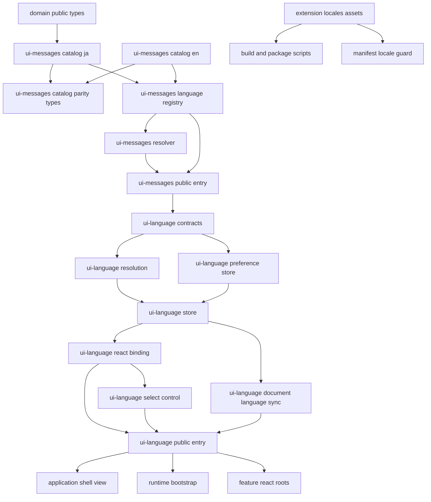
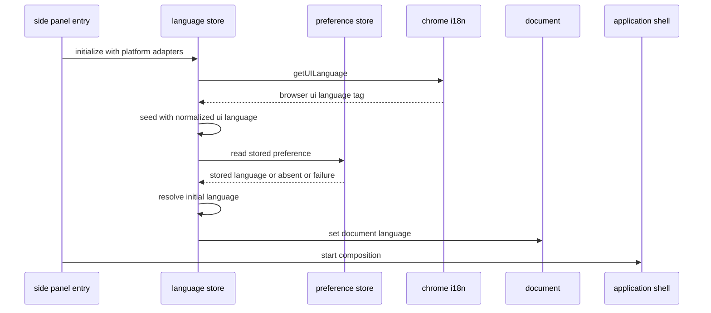
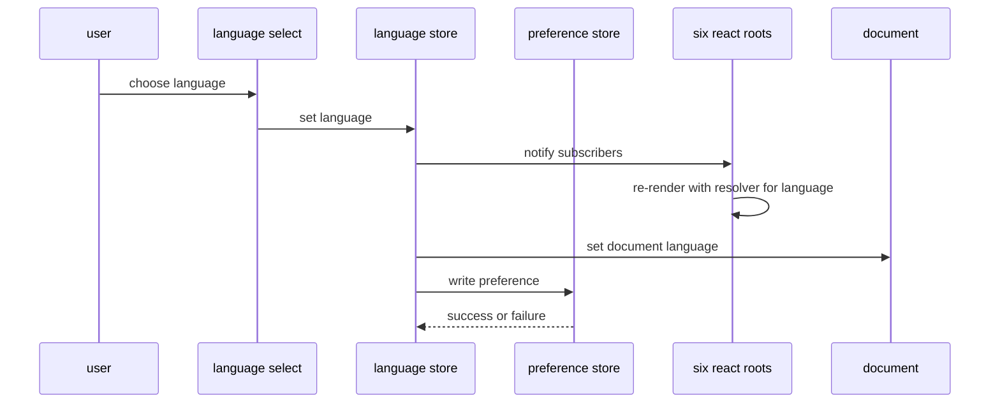
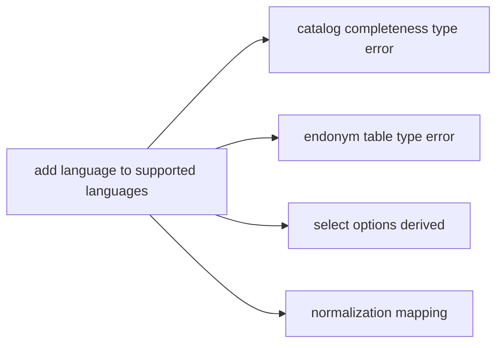

# Technical Design — ui-internationalization

## Overview

**Purpose**: 本 spec は、`ui-message-catalog` が確定させたキー体系の上へ **言語という次元** を追加する。英語カタログ、対応言語の単一定義、言語状態の保持と解決、サイドパネル内の切り替えUI、文書の言語属性、拡張マニフェストのロケール別 `name` / `description` を導入し、利用者がブラウザや OS の設定を変えずに日本語と英語を行き来できる状態にする。

**Users**: 直接の利用者は日本語話者と非日本語話者の拡張利用者である。二次的な利用者として、3言語目を追加する開発者と、Chrome Web Store へロケール別掲載情報を入稿するリリース担当者がいる。

**Impact**: `src/ui-messages/` はカタログを言語別に分岐させ、対応言語のレジストリを持つ境界へ拡張される。新しい葉の境界 `src/ui-language/` が言語状態・永続化・初期値決定・切り替えUIを所有する。`application-shell` は切り替えUIの**配置**だけを引き受ける。`src/features/product-capture/` は日本語ロケール固有データを `locale/` へ隔離する。ビルド・パッケージ・マニフェスト検査は `_locales/` を配布物へ運ぶために拡張される。

### Goals

- 表示言語をアプリ内状態として持ち、ブラウザ再起動・ロケール環境変数の操作なしに切り替えられるようにする。
- ja / en のカタログが同一のキー集合と同一のパラメータ名を持つことを、実行時ではなくコンパイル時に保証する。
- 表示言語の設定を、利用者のドメインデータおよびバックアップ交換形式から構造的に分離する。
- 拡張の `name` / `description` を Chrome の表示言語へ追従させ、ストア掲載のロケール別入稿を可能にする。
- 日本語ロケール向けの取り込み支援データ・ロジックを、翻訳対象の文言と構造上・機械検査上で区別する。
- 3言語目の追加が「対応言語集合への1件追加とカタログ1式の追加」に閉じる形を作る。

### Non-Goals

- UI 文言のカタログ化、スタイル・E2E ロケータの文言非依存化、view からの日本語リテラル除去。すべて `ui-message-catalog` が完了済みである。
- 日本語・英語以外の翻訳データ。基盤は追加可能な形にするが値は用意しない。
- `category-hint.ts` のキーワード辞書の多言語化。本 spec は ja 専用データとして隔離するところまでを行う。
- ロケール別の日付・数値・通貨の表示整形、通貨換算、為替レート取得。
- Chrome Web Store の詳細説明・スクリーンショットの英語版作成。
- i18n ライブラリの導入。動的な翻訳リソース読み込み。
- 表示文言の文面改善、UI の再デザイン、取り込み・保存・互換性判定の振る舞い変更。

## Boundary Commitments

### This Spec Owns

- **対応言語の単一定義** — `SUPPORTED_LANGUAGES` とその型、原語表記（endonym）、ソース言語とフォールバック言語の指定。
- **英語カタログ** — `ui-message-catalog` が確定させた全キーに対する英語の値。既存キーの追加・改称は行わない。
- **カタログの言語間整合の保証** — キー集合の双方向一致は型で、プレースホルダ名の一致は単体テストで検証する。
- **言語状態** — 現在の表示言語、その変更、変更の通知。React 外の単一ストアとして所有する。
- **言語の初期値決定** — 保存値とブラウザ表示言語からの純関数的な解決。
- **言語設定の永続化** — `chrome.storage.local` のルート外専用キー1つに閉じた読み書き。
- **言語切り替えコントロールの振る舞い** — 選択肢の列挙、現在値の提示、切り替えの発火。
- **文書の言語属性の同期** — `document.documentElement.lang` を現在の表示言語に一致させる。
- **拡張マニフェストのロケール資産** — `_locales/{en,ja}/messages.json`、`default_locale`、`__MSG_*` 参照、およびその整合の機械検査。
- **日本語ロケール固有データの隔離** — `円` 表記の価格トークンと日本語カテゴリ推定キーワードの配置と翻訳対象外の明示。
- **配布物へのロケール資産の同梱** — ビルドとパッケージ経路。

### Out of Boundary

- **カタログのキー体系そのもの** — キー名、名前空間分割、`MessageDescriptor` の形、`useMessages()` の参照経路。`ui-message-catalog` が所有し、本 spec は変更しない。
- **`MessageProvider` / `useMessages` の公開シグネチャ** — 変更しない。言語切り替えは Provider へ渡す resolver の差し替えだけで達成する。
- **`FeatureMountContext` と mount/unmount ライフサイクル** — 言語状態をこの経路で供給しない。上流の禁止事項をそのまま継承する。
- **画面上のどこに切り替えUIを置くか以外の UI composition** — `application-shell` が所有し続ける。本 spec はシェルへ配置点を1つ追加するだけで、ナビゲーション・機能搭載・エラー境界の責務へ触れない。
- **`LocalDataRoot` と write authority** — 表示言語はルートへ入らない。`src/persistence/` に変更を加えない。
- **バックアップ交換形式** — `backup-restore` が所有する。表示言語は交換形式に現れない。
- **取り込み・正規化の振る舞い** — 抽出結果を1件も変えない。`locale/` への移動は配置の変更に限る。
- **Chrome Web Store ダッシュボードへの入稿作業** — リリース作業として別途扱う。

### Allowed Dependencies

- `src/ui-messages/` → `src/domain/public.js`（型のみ、上流のまま）、React 19（`createContext` / `useContext`）。
- `src/ui-language/` → `src/ui-messages/public.js`（唯一の経路）、React 19（`useSyncExternalStore` を含む）、`chrome.storage.local` / `chrome.i18n.getUILanguage`（**アダプタ1ファイルに限定**）。
- `src/application-shell/` → `src/ui-language/public.js`（切り替えコントロールの配置と bootstrap のためだけ）。
- `src/features/*/react-root.tsx`、`src/features/current-build/registration.ts` → `src/ui-language/public.js`（Provider の設置のみ）。
- `e2e/`、`tests/` → `src/ui-language/public.js`、`src/ui-messages/public.js`。
- **禁止**: `src/ui-messages/` → `src/ui-language/`。言語状態はカタログより下流であり、逆流させない。
- **禁止**: `src/ui-language/` → `src/application-shell/`、`src/features/`、`src/persistence/`。言語境界は葉である。
- **禁止**: `src/ui-language/preference-store.ts` 以外からの `chrome.storage` への到達、および同ファイルからの `localDataRoot` キーへの到達。
- **禁止**: `chrome.i18n` によるアプリ内表示文言の解決。`_locales/` は manifest の `name` / `description` にのみ用いる。

### Revalidation Triggers

- `SUPPORTED_LANGUAGES` の増減（選択肢、初期値決定、保存値の解釈、カタログ網羅性へ同時に波及する）。
- `SupportedLanguage` / `LanguageResolver` / `LanguageProvider` の公開シグネチャの変更。
- 言語設定の保存キー名、保存値の形式の変更。
- `default_locale` の変更、`_locales/` のキー追加・改称（Chrome Web Store の入稿内容へ波及する）。
- 言語切り替えコントロールの識別属性の変更（`styles.css` と E2E ヘルパへ波及する）。
- カタログのディレクトリ配置の変更（`scripts/validate-ui-text.mjs` の除外パスへ波及する）。

## Architecture

### Existing Architecture Analysis

- **React root が6本ある**。シェル1本（`react-shell-root.tsx`）と feature 5本（`react-root.tsx` 4件 + `current-build/registration.ts` の `mountBuildView`）。上流はこの各点に `MessageProvider` を張る規約を置いた。単一の React Context では6本を横断できないため、**言語状態は React 外に置く必要がある**。これは `testing.md` が既定とする既存パターンと一致する。
- **カタログは葉の境界である**。`ui-messages` は誰にも依存しない（`domain` の型を除く）。言語状態はカタログを消費する側であり、`ui-messages` の下流に新しい葉を足すのが依存方向として自然である。
- **`chrome.storage.local` への到達点は現在1箇所**（`src/persistence/chrome-storage-adapter.ts`）であり、単一キー `localDataRoot` に閉じている。容量監視も同キーに閉じている。ルート外のキーを足しても既存の前提は動かない。
- **ビルドは個別ファイルの `copyFile` である**。ディレクトリの再帰コピーが無いため、`_locales/` は明示的に足さない限り配布物へ入らない。
- **`manifest.json` の構造は完全一致テストで固定されている**。構造変更は必ずテスト更新を伴う。

### Architecture Pattern & Boundary Map



**Architecture Integration**:

- **Selected pattern**: React 外の単一ストア + root ごとの Provider による表示直前解決。上流が用意した「Provider の resolver を差し替える」という唯一の接合点を、ストア購読で駆動する。
- **Domain/feature boundaries**: `ui-messages`（言語別の値と対応言語の定義）と `ui-language`（言語状態・永続化・初期値決定・切り替えUI）を分ける。前者は「何を表示するか」、後者は「いま何語か」を所有する。feature は後者から Provider を受け取るだけで、いずれの内部も知らない。
- **Existing patterns preserved**: 公開入口を `public.ts` に限定する規約、React を表示 adapter に限定する方針、React 外 state + `useSyncExternalStore` の購読、規約を `scripts/validate-*.mjs` で機械化する慣行、`FeatureMountContext` を経由しない Provider 設置。
- **New components rationale**: `ui-language` は「言語状態」という新しい責務の canonical owner を確定させるために必要である。`ui-messages` 側の言語レジストリは、対応言語の集合とカタログの網羅性を1箇所へ束ねるために必要である。両者を1つにまとめると、カタログ（純粋データ）に Chrome API 依存が混入する。
- **Steering compliance**: 永続化ルートと write authority に触れない（`tech.md`）。`chrome.storage` への到達点をアダプタに限定し機械検査で守る（`security.md`）。翻訳リソースは静的 import でバンドルへ含める（MV3 / CSP）。`any` を使わず、境界からの値は `unknown` として受けて検証する。

### Dependency Direction

```text
domain public types (型のみ)
    ↓
ui-messages: contracts → catalog(ja|en) → parity → language registry → resolver → react context → public.ts
    ↓
ui-language: contracts → resolution / preference store → store → react binding → select control / document sync → public.ts
    ↓
application shell (shell view / runtime bootstrap) / feature react roots
    ↓
styles.css / tests / e2e
```

左のレイヤーからのみ import する。`ui-messages` が `ui-language` を import した時点で違反とする。

### Technology Stack

| Layer | Choice / Version | Role in Feature | Notes |
|---|---|---|---|
| Frontend | React 19（`useSyncExternalStore`、`createContext` / `useContext`） | 6本の React root が単一の言語ストアを購読する | 新規依存なし。既存 React をそのまま利用 |
| Frontend | TypeScript 7（`strict`、`exactOptionalPropertyTypes`、`noUncheckedIndexedAccess`） | キー集合の言語間一致をコンパイル時に保証 | マップ型の網羅性 + `satisfies` の余剰検査。プレースホルダ名の一致は単体テストが担う |
| Data / Storage | `chrome.storage.local` の専用キー `uiLanguage` | 表示言語の保持 | ルート外。write authority と交換形式に触れない |
| Runtime | `chrome.i18n.getUILanguage()` | 初期値決定の入力（同期 API） | アプリ内文言の解決には使用しない |
| Runtime | `_locales/{en,ja}/messages.json` + `default_locale` | 拡張の `name` / `description` の国際化とストア掲載 | `name` / `description` の2キーのみの最小構成 |
| Infrastructure | esbuild + `scripts/build.mjs` の資産コピー | `_locales/` を `dist/` と配布 zip へ運ぶ | 動的読み込みなし。CSP を弱めない |
| Tooling | Node 標準テストランナー、testing-library、Playwright | 初期値決定は単体、切り替えは DOM / E2E | 新しいテストツールを追加しない |
| Tooling | `scripts/validate-artifacts.mjs`（拡張）、`scripts/validate-ui-text.mjs`（除外更新） | ロケール整合と翻訳対象外データの機械検査 | 既存スクリプトの拡張であり新設しない |

## File Structure Plan

### Directory Structure

```
_locales/                              # 新規。manifest とストア掲載のためだけの最小構成
├── en/messages.json                   # default_locale。全キーを持つ最終フォールバック
└── ja/messages.json                   # 日本語の name / description

src/
├── ui-messages/                       # 既存境界の拡張（上流所有の契約は変更しない）
│   ├── languages.ts                   # 新規。SUPPORTED_LANGUAGES / SupportedLanguage /
│   │                                  #   SOURCE_LANGUAGE / FALLBACK_LANGUAGE / endonym /
│   │                                  #   resolverFor(language)
│   ├── catalog-parity.ts              # 新規。キー集合の型レベル整合検査
│   ├── catalog/
│   │   ├── index.ts                   # 変更。ja / en の集約と言語レジストリへの供給
│   │   ├── ja/                        # 移動。既存10名前空間ファイルをそのまま格納
│   │   │   ├── index.ts               # ja の集約。カタログの「形」の源
│   │   │   └── {common,category,persistence-error,nav,shell,
│   │   │      candidate,build,compatibility,capture,backup}.ts
│   │   └── en/                        # 新規。ja と同一のファイル分割
│   │       ├── index.ts
│   │       └── {同上10ファイル}
│   └── public.ts                      # 変更。言語レジストリ関連の公開面を追加
├── ui-language/                       # 新規境界。言語状態の canonical owner
│   ├── contracts.ts                   # 言語設定ポート、解決入力、ストアの型
│   ├── resolve.ts                     # 純関数。言語タグ正規化と初期値決定
│   ├── preference-store.ts            # 専用キー1つに閉じた chrome.storage.local アダプタ
│   ├── store.ts                       # React 外の単一ストア。購読と初期化
│   ├── react.tsx                      # LanguageProvider（MessageProvider を内包）/ useLanguage
│   ├── language-select.tsx            # 切り替えコントロール（振る舞いの所有）
│   ├── language-select.css            # コントロールのスタイル
│   ├── document-language.ts           # documentElement.lang の同期
│   └── public.ts                      # 唯一の公開入口
└── features/product-capture/
    └── locale/                        # 新規。翻訳対象外の日本語ロケールデータ
        ├── ja-category-keywords.ts    # category-hint.ts から移設したキーワード辞書
        └── ja-price-tokens.ts         # normalizer.ts から移設した「円」表記の判定

e2e/
└── language-switching.spec.ts         # 新規。切り替え操作による英語UI検証と保持の検証

tests/
├── ui-language/                       # 新規。解決・保存・ストア・Provider・コントロール
│   └── {resolve,preference-store,store,react,language-select}.test.ts(x)
└── ui-messages/
    └── catalog-parity.test.ts         # 新規。パラメータ名と複数形定義の言語間整合
```

### Modified Files

| ファイル | 変更内容 |
|---|---|
| `manifest.json` | `name` を `__MSG_extensionName__`、`description` を `__MSG_extensionDescription__` として追加、`default_locale: "en"` を追加 |
| `side-panel.html` | `<html lang="ja">` から `lang` 属性を除去する。値は bootstrap が設定する |
| `src/ui-messages/catalog/index.ts` | ja / en の2系統を集約し、言語レジストリへ渡す形へ変更 |
| `src/ui-messages/public.ts` | `SupportedLanguage` / `SUPPORTED_LANGUAGES` / `languageEndonym` / `resolverFor` を追加公開。`MessageProvider` / `useMessages` / `MessageDescriptor` の形は変更しない |
| `src/application-shell/shell-view.tsx` | シェルの共通ヘッダ領域を追加し、全状態（読み込み中・エラー・保守中・通常）で言語コントロールを描画する |
| `src/application-shell/shell-view.css` | ヘッダ領域とコントロール配置のスタイル。文言に依存しないセレクタのみ |
| `src/application-shell/react-shell-root.tsx` | シェル root の Provider を `MessageProvider` から `LanguageProvider` へ置き換える |
| `src/runtime/side-panel.ts` | シェル起動前に言語ランタイムを初期化し、文書の言語属性同期を開始する |
| `src/features/{candidate-management,product-capture,compatibility,backup-restore}/react-root.tsx` | Provider を `LanguageProvider` へ置き換える |
| `src/features/current-build/registration.ts` | `mountBuildView` の Provider を `LanguageProvider` へ置き換える |
| `src/features/product-capture/category-hint.ts` | キーワード辞書を `locale/ja-category-keywords.ts` から import する。推定ロジックと結果は不変 |
| `src/features/product-capture/normalizer.ts` | `円` 表記の判定を `locale/ja-price-tokens.ts` から import する。抽出結果は不変 |
| `scripts/build.mjs` | `_locales/` を `dist/` へ再帰コピーする |
| `scripts/validate-artifacts.mjs` | `__MSG_*` と `default_locale` と `_locales/` の整合を検査する規則を追加 |
| `scripts/validate-boundaries.mjs` | `chrome.storage` への到達点を許可2ファイルへ限定する規則を追加する |
| `tests/setup-dom.ts` および DOM テストハーネス | Provider を `LanguageProvider` へ置き換え、`afterEach` で言語ストアを初期状態へ戻す |
| `scripts/validate-ui-text.mjs` | 除外パスを `src/ui-messages/catalog/`（ja / en 両方）、`src/ui-messages/languages.ts`、`src/features/product-capture/locale/` へ更新し、`category-hint.ts` を除外から外す |
| `tests/runtime/manifest.test.ts` | 完全一致対象へ `description` / `default_locale` / `__MSG_*` を反映。`_locales/` の実在と全キー充足、`<html>` の `lang` 非固定を検査 |
| `tests/tooling/package.test.ts` | 合成配布物へ `_locales/` を含め、配布 zip へロケール資産が入ることを検査 |
| `e2e/locators.ts` | 言語コントロールのロケータと、言語別の期待値解決（`resolverFor`）を追加 |
| `package.json` | 変更不要（新しい script を追加しない）。検査は既存 `validate:artifacts` / `validate:ui-text` の内部で強化する |

## System Flows

### 起動時の言語決定



保存値の読み取りは非同期であるため、ストアはまず同期取得できるブラウザ表示言語で確定し、その後に保存値があれば置き換える。シェルの起動は初期化の解決を待ってから行い、最初の描画が確定言語で行われるようにする。読み取りに失敗した場合は保存値なしと同じ経路へ落ち、起動を止めない。

### 言語切り替えの伝播



通知は同期的に行い、保存は非同期で追随する。保存が失敗してもストアの値は戻さず、その回の表示は選択された言語のまま継続する。ストアの更新は **root の生成・破棄を伴わない**。購読による再レンダーのみであるため、表示中の機能・選択・入力途中の内容は保持される。

### 言語追加時の波及



対応言語の追加は、カタログ網羅性と原語表記の型エラーとして即座に検出される。選択肢と初期値決定は同じ集合から導出されるため、追加の手当てを要しない。

## Requirements Traceability

| Requirement | Summary | Components | Interfaces | Flows |
|---|---|---|---|---|
| 1.1, 1.6 | 全状態で使える切り替え操作面、原語表記と現在値の提示 | LanguageSelectControl, ShellLanguageSurface, LanguageRegistry | `useLanguage()`, `languageEndonym` | 言語切り替えの伝播 |
| 1.2 | 再起動なしの即時反映 | LanguageStore, LanguageReactBinding | `subscribe` / `getSnapshot` | 言語切り替えの伝播 |
| 1.3 | 機能・選択・入力・スクロール位置の保持 | LanguageReactBinding, FeatureRootLanguageBinding | `LanguageProvider` | 言語切り替えの伝播 |
| 1.4 | 保存データと判定結果の不変 | LanguagePreferenceStore | 専用キーのみの読み書き | — |
| 1.5 | 保守中・エラー時も切り替え可能 | ShellLanguageSurface | シェル共通ヘッダ領域 | — |
| 2.1, 2.2, 2.6 | 保存値優先、無ければブラウザ表示言語 | LanguageResolution, LanguageStore | `resolveInitialLanguage` | 起動時の言語決定 |
| 2.3 | 地域付きタグの正規化 | LanguageResolution | `normalizeLanguageTag` | 起動時の言語決定 |
| 2.4 | 未対応言語は英語へ | LanguageResolution | `FALLBACK_LANGUAGE` | 起動時の言語決定 |
| 2.5 | 壊れた保存値でも起動する | LanguagePreferenceStore, LanguageResolution | `Result` による失敗表現 | 起動時の言語決定 |
| 3.1 | 再起動をまたぐ保持 | LanguagePreferenceStore, LanguageStore | `LanguagePreferencePort` | 言語切り替えの伝播 |
| 3.2, 3.3, 3.4, 3.6 | ドメインデータからの分離 | LanguagePreferenceStore, StorageAccessGuard | 専用キー定数、到達点の機械検査 | — |
| 3.5 | 保存失敗でも操作を中断しない | LanguageStore | 保存結果を表示へ反映しない | 言語切り替えの伝播 |
| 4.1 | キー集合の言語間一致（型検査） | CatalogParityTypes, EnglishCatalog | `LocalizedCatalog`, `AssertCatalogParity` | 言語追加時の波及 |
| 4.2 | パラメータ名の言語間一致（単体テスト） | EnglishCatalog | `catalog-parity.test.ts` | 言語追加時の波及 |
| 4.3, 4.6, 4.7 | 全画面の英語表示、共有語彙、外部由来文字列の非翻訳 | EnglishCatalog, LanguageRegistry | `resolverFor` | 言語切り替えの伝播 |
| 4.4 | 単一件数の単複表現 | EnglishCatalog | `PluralDefinition` | — |
| 4.5 | 複数件数を含む1文 | EnglishCatalog | ラベル併記形の文型 | — |
| 5.1, 5.2, 5.3 | 文書の言語属性 | DocumentLanguageSync, LanguageRuntimeBootstrap | `syncDocumentLanguage` | 起動時の言語決定 / 言語切り替えの伝播 |
| 6.1, 6.2, 6.3, 6.4 | manifest とストア掲載の国際化 | ExtensionLocaleAssets | `_locales/{en,ja}/messages.json`, `default_locale` | — |
| 6.5, 6.6 | ロケール整合と既存セキュリティ検査の維持 | ManifestLocaleGuard | `validateManifest` 拡張 | — |
| 7.1, 7.2 | 翻訳対象外データの構造上・文書上の明示 | JapaneseLocaleData | `locale/` 配下の専用モジュール | — |
| 7.3, 7.4 | 抽出結果の不変と言語非依存 | JapaneseLocaleData | 既存の抽出関数シグネチャ | — |
| 7.5 | 誤って文言扱いされた場合の検出 | UiTextGuardExclusions | `validate:ui-text` | — |
| 8.1, 8.2 | ブラウザ言語に依存しない英語UI検証 | LanguageE2ESpec | `e2e/locators.ts` | 言語切り替えの伝播 |
| 8.3 | 初期値決定は実ブラウザ非依存の検証 | LanguageResolution | 純関数の単体テスト | 起動時の言語決定 |
| 8.4 | 配布物へのロケール資産同梱 | BuildLocaleCopy | `scripts/build.mjs` | — |
| 8.5, 8.6 | 検査の受け入れと検証フロー全段の成功 | ManifestLocaleGuard, ExtensionLocaleAssets | `pnpm validate` | — |
| 9.1 | 参照側を触らない言語追加 | LanguageRegistry, LanguageReactBinding | `resolverFor` | 言語追加時の波及 |
| 9.2 | キー不足の型検査失敗 | CatalogParityTypes | `LocalizedCatalog` | 言語追加時の波及 |
| 9.3 | 対応言語の単一定義からの導出 | LanguageRegistry, LanguageSelectControl, LanguageResolution | `SUPPORTED_LANGUAGES` | 言語追加時の波及 |
| 9.4 | 翻訳データを追加しない | EnglishCatalog | — | — |
| 9.5 | 静的同梱 | LanguageRegistry | 静的 import のみ | — |

## Components and Interfaces

| Component | Domain/Layer | Intent | Req Coverage | Key Dependencies (P0/P1) | Contracts |
|---|---|---|---|---|---|
| LanguageRegistry | ui-messages | 対応言語の単一定義と言語別 resolver の供給 | 1.6, 4.3, 9.1, 9.3, 9.5 | MessageResolver (P0), EnglishCatalog (P0) | Service, State |
| EnglishCatalog | ui-messages | 全キーに対する英語の値 | 4.1〜4.7, 9.4 | CatalogParityTypes (P0) | State |
| CatalogParityTypes | ui-messages | キー集合の言語間一致を型で保証。パラメータ名の一致は単体テストの責務 | 4.1, 9.2 | MessageContracts (P0) | State |
| LanguageContracts | ui-language | 言語状態・保存ポート・解決入力の型 | 2.1, 3.1, 9.3 | LanguageRegistry (P0) | State |
| LanguageResolution | ui-language | 言語タグ正規化と初期値決定の純関数 | 2.1〜2.6, 8.3, 9.3 | LanguageContracts (P0) | Service |
| LanguagePreferenceStore | ui-language | ルート外専用キーへの読み書き | 1.4, 2.5, 3.1〜3.6 | LanguageContracts (P0), chrome.storage.local (P0) | Service |
| LanguageStore | ui-language | React 外の単一ストアと初期化 | 1.2, 2.1, 2.6, 3.1, 3.5 | LanguageResolution (P0), LanguagePreferenceStore (P0) | Service, State |
| LanguageReactBinding | ui-language | root ごとの Provider とフック | 1.2, 1.3, 9.1 | LanguageStore (P0), MessageReactContext (P0) | Service |
| LanguageSelectControl | ui-language | 切り替えコントロールの振る舞い | 1.1, 1.6, 9.3 | LanguageReactBinding (P0), LanguageRegistry (P0) | — |
| DocumentLanguageSync | ui-language | 文書の言語属性の同期 | 5.1, 5.2, 5.3 | LanguageStore (P0) | Service |
| UiLanguagePublicEntry | ui-language | 境界の唯一の公開入口 | 9.1 | 上記全て (P0) | Service |
| ShellLanguageSurface | application-shell | コントロールの配置点をシェルへ1つ追加 | 1.1, 1.5 | UiLanguagePublicEntry (P0) | — |
| LanguageRuntimeBootstrap | runtime / application-shell | 起動前の初期化と文書同期の開始 | 2.1, 2.6, 5.1 | LanguageStore (P0), DocumentLanguageSync (P0) | Service |
| FeatureRootLanguageBinding | features | 5本の feature root の Provider 置き換え | 1.2, 1.3 | UiLanguagePublicEntry (P0) | — |
| JapaneseLocaleData | features / product-capture | 翻訳対象外の日本語ロケールデータの隔離 | 7.1〜7.4 | — | State |
| ExtensionLocaleAssets | manifest | ロケール別 `name` / `description` | 6.1〜6.4 | — | State |
| ManifestLocaleGuard | scripts | ロケール整合の機械検査 | 6.5, 6.6, 8.5 | ExtensionLocaleAssets (P0) | Batch |
| BuildLocaleCopy | scripts | 配布物へのロケール資産同梱 | 8.4 | ExtensionLocaleAssets (P0) | Batch |
| UiTextGuardExclusions | scripts | 除外パスの更新と翻訳対象外データの保護 | 7.5 | JapaneseLocaleData (P0) | Batch |
| StorageAccessGuard | scripts | `chrome.storage` 到達点の限定 | 3.2, 3.4 | LanguagePreferenceStore (P0) | Batch |
| LanguageE2ESpec | e2e | 切り替え操作による英語UI検証 | 8.1, 8.2 | LanguageSelectControl (P0) | — |

### ui-messages

#### LanguageRegistry

| Field | Detail |
|---|---|
| Intent | 対応言語の集合を単一定義として持ち、言語ごとの resolver と原語表記を供給する |
| Requirements | 1.6, 4.3, 9.1, 9.3, 9.5 |

**Responsibilities & Constraints**

- 対応言語の集合は本モジュールの `SUPPORTED_LANGUAGES` **のみ**を出典とする。選択肢・初期値決定・保存値の解釈・カタログ網羅性はすべてこの1定義から導出する。
- **ソース言語**（`SOURCE_LANGUAGE = "ja"`）と**フォールバック言語**（`FALLBACK_LANGUAGE = "en"`）を別々の概念として持つ。前者はカタログの「形」の源であり上流の既定 resolver と一致する。後者は初期値決定で対応言語へ対応付けられなかった場合の帰着先である。両者が異なる理由をモジュール内へ明記する。
- 原語表記（`日本語` / `English`）は翻訳対象ではない。言語に依存しないデータとして本モジュールが持ち、カタログのキーにはしない。**本ファイルは `validate:ui-text` の除外対象へ加える**（CJK リテラルを含むため）。
- resolver は言語ごとにモジュール生成時に1つだけ作り、以後は同一参照を返す。切り替えのたびに resolver を作り直さない。
- カタログは全言語とも静的 import で束ねる。動的読み込みを行わない。

**Dependencies**

- Outbound: MessageResolver（P0、`createMessageResolver`）、JapaneseCatalog / EnglishCatalog（P0）
- Inbound: UiMessagesPublicEntry, LanguageContracts, LanguageStore, LanguageSelectControl

**Contracts**: Service [x] / State [x]

##### State Management

```typescript
export const SUPPORTED_LANGUAGES = ["ja", "en"] as const;
export type SupportedLanguage = (typeof SUPPORTED_LANGUAGES)[number];

/** カタログの形の源。上流の defaultMessageResolver と同一言語。 */
export const SOURCE_LANGUAGE: SupportedLanguage = "ja";
/** 初期値決定で対応言語へ対応付けられなかった場合の帰着先。 */
export const FALLBACK_LANGUAGE: SupportedLanguage = "en";

/** 各言語の原語表記。翻訳対象ではないためカタログへ入れない。 */
export const languageEndonym: Readonly<Record<SupportedLanguage, string>>;
```

##### Service Interface

```typescript
export const resolverFor: (language: SupportedLanguage) => MessageResolver;
```

- Preconditions: `language` は `SupportedLanguage` である。
- Postconditions: 同一言語に対して常に同一参照の resolver を返す。
- Invariants: モジュール定数であり実行時に変更されない。

**Implementation Notes**

- Integration: 上流の `defaultMessageResolver` は `resolverFor(SOURCE_LANGUAGE)` と同一の resolver を指すようにし、Provider 未設置時の表示が現行と変わらないことを維持する。
- Validation: `languageEndonym` を `Record<SupportedLanguage, string>` として定義し、言語追加時に欠落が型エラーになることを最小例で確認する。
- Risks: `SUPPORTED_LANGUAGES` の重複定義がどこかに生まれると 9.3 が崩れる。公開入口からのみ参照させ、`ui-language` 側で再定義しない。

#### EnglishCatalog

| Field | Detail |
|---|---|
| Intent | 上流が確定させた全キーに対する英語の値を保持する |
| Requirements | 4.1〜4.7, 9.4 |

**Responsibilities & Constraints**

- ファイル分割は日本語カタログと**同一の10名前空間**に揃える。差分レビューが名前空間単位で成立する状態を保つ。
- **キーの追加・改称・削除を行わない**。英語化のために文構造の変更が必要になった場合も、上流が用意したパラメータの範囲で解く。
- **単一件数のメッセージ**は `PluralDefinition` を用い、`one` / `other` を定義する。日本語側は単純文字列のままとし、フォームを作らない。
- **複数件数を1文に含むメッセージ**（復元完了通知）は、数の一致を要求しないラベル併記形の文型で解く。断片の連結や、件数ごとの部分メッセージの合成を行わない。
- パーツカテゴリ名など共有名前空間の語彙は、機能をまたいで単一の英語表記を用いる。
- 外部由来文字列（商品名、プロジェクト名、取得元、ファイル位置）はパラメータであり、英語カタログでも翻訳しない。
- 文面は日本語の直訳ではなく、英語として自然な表現を採る。ただし上流が確定させた**意味**は変えない。

**Dependencies**

- Outbound: CatalogParityTypes（P0）、MessageContracts（P0）
- Inbound: LanguageRegistry

**Contracts**: State [x]

##### State Management

```typescript
// src/ui-messages/catalog/en/index.ts
export const EN_MESSAGES = {
  common: { /* ... */ },
  category: { /* ... */ },
  // ja と同一の10名前空間
} as const satisfies LocalizedCatalogInput;
```

- Preconditions: `as const satisfies` により、リテラル型を保ったままキーの欠落と余剰が検出される。
- Postconditions: 平坦化した結果が `LocalizedCatalog`（`Record<MessageKey, MessageDefinition>`）を満たす。
- Invariants: モジュール定数であり実行時に変更されない。

**Implementation Notes**

- Integration: 名前空間ごとに独立して投入できるため、機能単位の並行作業が可能である。集約点（`catalog/en/index.ts`）だけは先に確定させる。
- Validation: 単複が必要なキーの一覧を単体テストで固定し、`count` の 0 / 1 / 2 に対する英語の出力を検証する。
- Risks: 直訳による不自然な英語。レビューでは「日本語との1対1対応」ではなく「英語として読めるか」を判断基準にする。

#### CatalogParityTypes

| Field | Detail |
|---|---|
| Intent | 言語間のキー集合の一致をコンパイル時に保証する。プレースホルダ名の一致は単体テストの責務とし、この型には含めない。 |
| Requirements | 4.1, 9.2 |

**Responsibilities & Constraints**

- **キー集合の一致は双方向に塞ぐ**。欠落はマップ型 `Record<MessageKey, ...>` の網羅性で、余剰は `satisfies` の余剰プロパティ検査で検出する。
- **プレースホルダ名の一致は型で扱わない。** union の双方向条件型（`[A] extends [B] ? [B] extends [A] : ...`)は、不一致時の型エラーメッセージが実用に耐えず、`pnpm typecheck` の所要時間も悪化させる。パラメータ名と個数の言語間一致（要件4.2）は `catalog-parity.test.ts`（単体テスト）が唯一の検証手段とする。
- キー集合の不一致は「どのキーが不一致か」を型として表出させ、コンパイルエラーのメッセージから対象キーを特定できるようにする。

**Dependencies**

- Outbound: MessageContracts（P0、`MessageKeyOf` / `DefinitionAt`）
- Inbound: EnglishCatalog, LanguageRegistry

**Contracts**: State [x]

##### State Management

```typescript
/** 平坦化した言語別カタログ。キーの欠落は型エラーになる。 */
export type LocalizedCatalog = {
  readonly [K in MessageKey]: MessageDefinition;
};

/** 名前空間の入れ子のまま受ける入力形。平坦化前の宣言に使う。 */
export type LocalizedCatalogInput = MessageNamespace;

/** 不一致のキーだけを union として残す。全て一致していれば never。 */
export type CatalogParityViolations<TTarget extends LocalizedCatalog> = {
  [K in MessageKey]: TTarget[K] extends DefinitionAt<SourceCatalog, K> ? never : K;
}[MessageKey];

/** 各言語カタログの宣言直後に置くコンパイル時表明。 */
export type AssertCatalogParity<TTarget extends LocalizedCatalog> =
  [CatalogParityViolations<TTarget>] extends [never] ? true : CatalogParityViolations<TTarget>;
```

- Preconditions: 両言語のカタログが `as const` でリテラル型を保持していること。
- Postconditions: キー集合に不一致がある限り表明の型が `true` に解決されず、コンパイルが失敗する。プレースホルダ名の不一致はこの表明では検出されない。
- Invariants: 型は値を持たない。実行時コストはゼロである。

**Implementation Notes**

- Integration: 表明は言語カタログの集約点に置く。言語が増えるたびに同じ表明を1行追加する。
- Validation: 意図的にキーを1件落とし、型検査が失敗することを最小例で確認する。プレースホルダ名の不一致は `catalog-parity.test.ts` で検証する（要件4.2、複数形の各フォーム間の一致を含む）。
- Risks: プレースホルダ名の不一致は型検査ではなく単体テストの実行時にしか検出されない。CI がテストを必ず実行することが前提になる。

### ui-language

#### LanguageResolution

| Field | Detail |
|---|---|
| Intent | 言語タグの正規化と初期値決定を、環境に依存しない純関数として提供する |
| Requirements | 2.1〜2.6, 8.3, 9.3 |

**Responsibilities & Constraints**

- `normalizeLanguageTag` は BCP 47 風のタグを受け取り、`-` / `_` 区切りの先頭サブタグを小文字化して対応言語と照合する。`ja-JP` / `ja_JP` / `JA` はいずれも `ja` へ解決する。
- 対応言語へ対応付けられないタグ、空文字、`undefined` は `undefined` を返す。推測しない。
- `resolveInitialLanguage` は「保存値 → ブラウザ表示言語 → フォールバック言語」の優先順で決定する。保存値が対応言語として解釈できない場合は保存値なしと同じ扱いにする。
- 例外を投げない。入力はすべて `unknown` として受け、境界で検証する。
- 対応言語の集合は `ui-messages` の `SUPPORTED_LANGUAGES` から導き、本モジュールで再定義しない。

**Dependencies**

- Outbound: LanguageContracts（P0）、LanguageRegistry（P0、`SUPPORTED_LANGUAGES` / `FALLBACK_LANGUAGE`）
- Inbound: LanguageStore

**Contracts**: Service [x]

##### Service Interface

```typescript
export const normalizeLanguageTag: (tag: unknown) => SupportedLanguage | undefined;

export interface LanguageResolutionInput {
  readonly stored: unknown;
  readonly browserUiLanguage: unknown;
}

export const resolveInitialLanguage: (
  input: LanguageResolutionInput,
) => SupportedLanguage;
```

- Preconditions: なし。任意の値を受け付ける。
- Postconditions: 返り値は常に `SupportedLanguage` である。
- Invariants: 副作用を持たない。同じ入力に対して同じ出力を返す。

**Implementation Notes**

- Integration: `chrome.i18n.getUILanguage()` の呼び出しは本モジュールでは行わない。呼び出し結果を入力として受け取ることで、実ブラウザを起動せずに全分岐を単体テストできる（8.3）。
- Validation: `ja`, `ja-JP`, `ja_JP`, `JA`, `en`, `en-US`, `en-GB`, `fr`, `zh-CN`, `""`, `undefined`, 非文字列の各入力に対する期待値を表として固定する。
- Risks: 地域差の扱いを将来 `pt-BR` のように区別する必要が出た場合、先頭サブタグ照合では足りなくなる。対応言語が地域を持つまでは不要であり、その時点で正規化規則を差し替える。

#### LanguagePreferenceStore

| Field | Detail |
|---|---|
| Intent | 表示言語を `chrome.storage.local` のルート外専用キー1つへ読み書きする |
| Requirements | 1.4, 2.5, 3.1〜3.6 |

**Responsibilities & Constraints**

- **保存先は `chrome.storage.local` の専用キー `uiLanguage` とし、`localDataRoot` へは一切触れない。** アダプタは自分のキー名を定数として1つだけ持ち、キーを引数で受け取らない。
- **local data foundation の write authority を経由しない。** その理由と非違反性は下記「保存先の判断」に記す。
- 読み書きの失敗は例外ではなく `Result` で返す。失敗コードは安定した英字コードのみとし、保存値そのものをログへ出さない。
- 読み取り値は `unknown` として受け、`normalizeLanguageTag` を通してから内部型へ変換する。
- 書き込みは最後の選択のみを保持する上書きであり、履歴を持たない。値は言語コード1つの文字列であり、容量監視の前提に影響しない。

**保存先の判断**（要件 3.2 / 3.4 と `tech.md` の単一 write authority 規約の関係）

`tech.md` は「local data foundation を単一の信頼済み write authority とし、すべての永続化 mutation をそこへルーティングする」と定めている。この規約が守っている対象は、隣接する記述（バージョン付き保存ルート、原子的 root mutation、参照修復、maintenance fencing、容量監視）が示すとおり **`LocalDataRoot` というドメインデータのルート**である。実装上もそれは明確であり、`src/persistence/chrome-storage-adapter.ts` は単一キー `localDataRoot` のみを読み書きし、容量計測も同キーに閉じている。

表示言語をこのルートへ入れた場合、次の3つの具体的な害が生じる。

1. **交換形式への混入**。`src/features/backup-restore/exchange.ts` は `LocalDataRoot` の内容を交換形式へ写像する。表示言語がルートに入れば、バックアップに UI 設定が含まれ、他端末で作成したファイルの復元が利用者の表示言語を書き換える。これは要件 3.2 / 3.3 に真正面から反する。
2. **保守中に変更できなくなる**。復元は原子的置換であり maintenance fencing の下で行われる。ルート経由の書き込みは fencing に従うため、要件 1.5（保守中・エラー中も切り替え可能）を満たせない。
3. **容量監視の前提が動く**。`bytesInUse` はルートキー単独の計測である。ドメインデータでない値をそこへ混ぜると、10MB 上限に対する監視の意味が濁る。

したがって表示言語は**ルート外の専用キー**へ置く。この判断が「単一 write authority」を破らないことは、次の3点で構造的に担保する。

- アダプタはキー名を定数として1つだけ持ち、`localDataRoot` を参照する経路を持たない。ルートに対する第二の書き込み口は生まれない。
- `chrome.storage` への到達点を `src/persistence/chrome-storage-adapter.ts` と `src/ui-language/preference-store.ts` の2ファイルに限定し、それ以外からの到達を **StorageAccessGuard** が機械検査で失敗させる（3.2, 3.4）。feature が直接 Chrome Storage を呼ぶ経路は引き続き存在しない。
- storage area の access level（`TRUSTED_CONTEXTS`）は area 全体に対する設定であり、キーを増やしても content script からの到達可能性は変わらない。`security.md` の前提を崩さない。

**Dependencies**

- Outbound: LanguageContracts（P0）、`chrome.storage.local`（P0、External）
- Inbound: LanguageStore

**Contracts**: Service [x]

##### Service Interface

```typescript
export type LanguagePreferenceError =
  | { readonly code: "storage-unavailable" }
  | { readonly code: "storage-write-failed" };

export interface LanguagePreferencePort {
  read(): Promise<Result<SupportedLanguage | undefined, LanguagePreferenceError>>;
  write(language: SupportedLanguage): Promise<Result<void, LanguagePreferenceError>>;
}

/** 読み書きに必要な最小面だけを受ける。storage area 全体を渡さない。 */
export interface LanguagePreferenceStorageApi {
  get(key: string): Promise<Record<string, unknown>>;
  set(items: Record<string, unknown>): Promise<void>;
}

export const createLanguagePreferencePort: (
  storage: LanguagePreferenceStorageApi,
) => LanguagePreferencePort;

/** テストと非 Chrome 実行環境のための実装。 */
export const createInMemoryLanguagePreferencePort: (
  initial?: SupportedLanguage,
) => LanguagePreferencePort;
```

- Preconditions: `storage` は `chrome.storage.local` 相当の最小面を満たす。
- Postconditions: `read` は保存値が無い場合と解釈できない場合の双方で `ok(undefined)` を返す。
- Invariants: 触れるキーは1つだけであり、実行時に変わらない。

**Implementation Notes**

- Integration: 実装は `src/persistence/chrome-storage-adapter.ts` の `Result` の扱いに揃える。ただし `Result` 型は `src/domain/public.js` の canonical 定義を用い、再定義しない。
- Validation: 保存値が壊れている（数値・オブジェクト・未対応言語）場合に `ok(undefined)` へ落ちること、書き込み失敗が `Result` で返ること、いずれの経路でも例外が漏れないことを単体テストで固定する。
- Risks: 将来 UI 設定が増えたときに本ポートが汎用設定ストアへ肥大化する。本 spec では表示言語のみを扱い、汎用化しない。

#### LanguageStore

| Field | Detail |
|---|---|
| Intent | 現在の表示言語を React 外の単一ストアとして保持し、6本の React root へ通知する |
| Requirements | 1.2, 2.1, 2.6, 3.1, 3.5 |

**Responsibilities & Constraints**

- **モジュール単一インスタンス**として公開する。`FeatureMountContext` を介して配らないという上流の規約を守りつつ、6本の root が同じ値を見る唯一の方法である。
- 初期化前のシードは `SOURCE_LANGUAGE` とする。これは上流の既定 resolver と一致し、Provider 未設置・未初期化の DOM テストの前提を壊さないためである。**製品としての初期値は必ず `initialize` が決定する**旨をモジュール内へ明記する。
- `initialize` は同期取得できるブラウザ表示言語で即座に確定させたうえで、保存値の読み取り結果があればそれで置き換える。解決の完了は Promise として返し、シェル起動はこれを待つ。
- `setLanguage` は同期的に値を更新して購読者へ通知し、保存は非同期に追随させる。**保存の失敗で値を巻き戻さない**（3.5）。
- 既に選択中の言語と同じ値が渡された場合は通知も保存も行わない。
- `initialize` は冪等とする。二度目以降は既存の解決結果を返し、明示的な選択を上書きしない（2.6）。

**Dependencies**

- Outbound: LanguageResolution（P0）、LanguagePreferencePort（P0）、LanguageRegistry（P0）
- Inbound: LanguageReactBinding, DocumentLanguageSync, LanguageRuntimeBootstrap

**Contracts**: Service [x] / State [x]

##### Service Interface

```typescript
export interface LanguageStore {
  getSnapshot(): SupportedLanguage;
  subscribe(listener: (language: SupportedLanguage) => void): () => void;
  setLanguage(language: SupportedLanguage): void;
}

export interface LanguagePlatform {
  readonly preferences: LanguagePreferencePort;
  /** chrome.i18n.getUILanguage の呼び出し結果。取得できない環境では undefined。 */
  readonly browserUiLanguage: () => unknown;
}

/** 6本の root が共有する単一インスタンス。 */
export const uiLanguageStore: LanguageStore;

/** 起動時に一度だけ呼ぶ。解決完了を待てる。 */
export const initializeUiLanguage: (
  platform: LanguagePlatform,
) => Promise<SupportedLanguage>;

/** テスト専用。ストアを初期状態へ戻す。 */
export const resetUiLanguageForTest: () => void;
```

- Preconditions: `initialize` は起動経路から一度だけ呼ばれる。
- Postconditions: `getSnapshot` は常に `SupportedLanguage` を返す。購読解除関数は冪等である。
- Invariants: 通知は同期的であり、購読者は通知時点で `getSnapshot` から新しい値を得られる。

##### State Management

- State model: 単一の `SupportedLanguage` 値と購読者集合、初期化の解決状態。
- Persistence & consistency: 表示の真実はメモリ上の値であり、保存は追随に過ぎない。保存失敗時もメモリ上の値を正とする。
- Concurrency strategy: MV3 side panel は単一文書であり、複数文書からの同時更新を想定しない。`chrome.storage.onChanged` の購読は行わない（他文書からの変更経路が存在しないため）。

**Implementation Notes**

- Integration: `useSyncExternalStore` から直接使える形（`subscribe` / `getSnapshot`）に揃える。
- Validation: 初期化前後の値、同値設定時の無通知、保存失敗時に値が戻らないこと、購読解除後に通知が来ないこと、`initialize` の冪等性を単体テストで固定する。
- Risks: モジュール単一インスタンスはテスト間で状態が漏れる。`--test-isolation=none` で実行しているため、`resetUiLanguageForTest` をテストハーネスの `afterEach` へ組み込む。

#### LanguageReactBinding

| Field | Detail |
|---|---|
| Intent | 各 React root で言語ストアを購読し、対応する resolver を `MessageProvider` へ供給する |
| Requirements | 1.2, 1.3, 9.1 |

**Responsibilities & Constraints**

- `LanguageProvider` は `useSyncExternalStore` でストアを購読し、`resolverFor(language)` を上流の `MessageProvider` へ渡す。**上流の `MessageProvider` / `useMessages` のシグネチャを変更しない。**
- 6本の root すべてがこの Provider を張る。上流が `MessageProvider` を張っていた位置をそのまま置き換える。
- 言語の変更は **再レンダーのみ**を引き起こす。root の生成・破棄・`unmount` を伴わない。これにより表示中の機能・選択・入力途中の内容・スクロール位置が保持される（1.3）。
- `useLanguage` は現在の言語・切り替え関数・選択可能な言語の一覧を返す。カタログそのものを露出しない。
- テストのために `store` を props で差し替えられるようにするが、既定は単一インスタンスとする。

**Dependencies**

- Outbound: LanguageStore（P0）、MessageReactContext（P0、上流）、LanguageRegistry（P0）
- Inbound: FeatureRootLanguageBinding, ShellLanguageSurface, LanguageSelectControl

**Contracts**: Service [x]

##### Service Interface

```typescript
export const LanguageProvider: (props: {
  readonly store?: LanguageStore;
  readonly children: ReactNode;
}) => ReactElement;

export interface LanguageSelection {
  readonly language: SupportedLanguage;
  readonly available: readonly SupportedLanguage[];
  readonly setLanguage: (language: SupportedLanguage) => void;
}

export const useLanguage: () => LanguageSelection;
```

- Preconditions: `useLanguage` は `LanguageProvider` の内側でのみ呼べる。
- Postconditions: `LanguageProvider` の内側では `useMessages()` が現在の言語の resolver を返す。
- Invariants: Context の値は言語の選択面のみであり、カタログを露出しない。

**Implementation Notes**

- Integration: `testing.md` の `renderView` ハーネスの Provider を `MessageProvider` から `LanguageProvider` へ置き換える。既定言語はシード（`SOURCE_LANGUAGE`）であり、既存 DOM テストの期待値は変わらない。
- Validation: 言語切り替えで root が再マウントされないこと（入力途中の値が保持されること）を DOM テストで固定する。6本の root が同時に追随することは統合テストで確認する。
- Risks: Provider の張り忘れが英語表示時にだけ顕在化する。E2E で全機能画面を英語で1度ずつ表示し、検出可能にする。

#### LanguageSelectControl

| Field | Detail |
|---|---|
| Intent | 言語切り替え操作の振る舞いを所有する表示コンポーネント |
| Requirements | 1.1, 1.6, 9.3 |

**Implementation Notes**

- 選択肢は `useLanguage().available` から導出する。ハードコードした言語一覧を持たない（9.3）。
- 表示は各言語の原語表記（`languageEndonym`）を用い、翻訳しない。現在選択中の言語が判別できる状態を持たせる。
- コントロール自身のアクセシブル名は**カタログ由来**とする（`common` 名前空間の既存キーを使い、無ければ上流のキー体系に沿った1キーを追加する）。原語表記だけが翻訳対象外である。
- 要素の識別は上流が確立した `data-region` / `data-action` の規約に従い、文言に依存しない属性で行う。`styles.css` と E2E ヘルパはこの属性を使う。
- 状態を自前で持たない。`useLanguage().setLanguage` を呼ぶだけの薄い表示 adapter とする。

#### DocumentLanguageSync

| Field | Detail |
|---|---|
| Intent | 文書の言語属性を現在の表示言語に一致させ続ける |
| Requirements | 5.1, 5.2, 5.3 |

**Contracts**: Service [x]

##### Service Interface

```typescript
export const syncDocumentLanguage: (
  document: Pick<Document, "documentElement">,
  store?: LanguageStore,
) => () => void;
```

- Preconditions: `document.documentElement` が存在する。
- Postconditions: 呼び出し直後に属性が現在の言語へ設定され、以後の変更へ追随する。返り値は購読解除関数である。
- Invariants: 属性値は常に `SupportedLanguage` のいずれかである。

**Implementation Notes**

- Integration: `src/runtime/side-panel.ts` が初期化直後に呼ぶ。`side-panel.html` は `lang` 属性を持たない状態で出荷し、静的な既定言語という誤った事実を作らない（5.3）。
- Validation: 属性の初期設定と切り替え追随を jsdom の DOM テストで固定する。`side-panel.html` に `lang` がハードコードされていないことを `tests/runtime/manifest.test.ts` の HTML 検査へ追加する。
- Risks: 属性設定が最初の描画より後になると読み上げの言語が一瞬ずれる。`getUILanguage()` が同期 API であることを利用し、シェル起動前に設定する。

### application-shell / runtime

#### ShellLanguageSurface

| Field | Detail |
|---|---|
| Intent | 言語コントロールの配置点をシェルへ1つ追加する |
| Requirements | 1.1, 1.5 |

**Implementation Notes**

- `shell-view.tsx` にシェル共通のヘッダ領域を追加し、**全ての状態**（`loading` / `ready` / `error` / `maintenance`）で描画する。現行のナビゲーションは `loading` 時に非表示になるため、ヘッダ領域はナビゲーションと別の領域として設ける（1.5）。
- シェルは `LanguageSelect` を**配置するだけ**であり、言語の意味・保存・解決を知らない。`ShellViewState` と `ShellNavigationItem` の形を変更しない。
- `react-shell-root.tsx` の Provider を `LanguageProvider` へ置き換える。シェルのエラー境界と feature mount コンテナの構造は変更しない。
- スタイルは `shell-view.css` に閉じ、`data-region` セレクタのみを使う。文言に依存するセレクタを作らない。

#### LanguageRuntimeBootstrap

| Field | Detail |
|---|---|
| Intent | シェル起動前に言語ランタイムを初期化し、文書の言語同期を開始する |
| Requirements | 2.1, 2.6, 5.1 |

**Contracts**: Service [x]

**Implementation Notes**

- `src/runtime/side-panel.ts` が、`chrome.i18n.getUILanguage` と `chrome.storage.local` を包んだ `LanguagePlatform` を組み立てて `initializeUiLanguage` を `await` し、続けて `syncDocumentLanguage` を呼び、その後にシェルの `start()` を実行する。
- Chrome API が存在しない実行環境（DOM テスト）では、`browserUiLanguage` が `undefined` を返し、`createInMemoryLanguagePreferencePort` を使う経路を用意する。**Chrome API への直接参照は本ファイルと `preference-store.ts` に限る。**
- 初期化の失敗は起動を止めない。`initializeUiLanguage` は常に `SupportedLanguage` へ解決する。
- Validation: 初期化がシェル起動より前に完了することと、初期化が失敗しても `start()` が呼ばれることを `tests/runtime/` の bootstrap テストで固定する。

### features

#### FeatureRootLanguageBinding

| Field | Detail |
|---|---|
| Intent | 5本の feature React root の Provider を差し替える |
| Requirements | 1.2, 1.3 |

**Implementation Notes**

- 対象は `react-root.tsx` 4件（candidate-management / product-capture / compatibility / backup-restore）と `current-build/registration.ts` の `mountBuildView`。
- 上流が `MessageProvider` を張った位置をそのまま `LanguageProvider` へ置き換える。**それ以外の変更を行わない。**
- feature は `src/ui-language/public.js` だけを import する。ストアの実体・保存経路・解決ロジックを知らない。
- `FeatureMountContext` の形と mount/unmount ライフサイクルへ触れない。

#### JapaneseLocaleData

| Field | Detail |
|---|---|
| Intent | 日本語ロケール向けの取り込み支援データ・ロジックを、翻訳対象の文言と構造上・文書上で区別する |
| Requirements | 7.1〜7.4 |

**Responsibilities & Constraints**

- `src/features/product-capture/locale/` を新設し、`ja-category-keywords.ts`（カテゴリ推定キーワード辞書）と `ja-price-tokens.ts`（`円` 表記の価格トークンと通貨対応付け）を置く。
- 各ファイル冒頭に、(a) これは表示文言ではなく日本語ロケール向けの取り込み支援データであること、(b) 翻訳対象外であること、(c) 他ロケールでの動作を妨げない加算的な最適化であること（`product.md` の方針に対応）、(d) 多言語化は本 spec の対象外であることを記す。
- **抽出・正規化の振る舞いを一切変更しない。** 移動と import の付け替えのみを行う。キーワードの順序（最も具体的なものが先）と一致規則を維持する。
- `category-hint.ts` と `normalizer.ts` は、ロケール別データを参照する**ロジック**として残る。両ファイルには日本語リテラルを残さない。

**Contracts**: State [x]

**Implementation Notes**

- Integration: `normalizer.ts` の `円` 分岐は正規表現と通貨コードの対応付けのみを `locale/` へ出す。パースの制御構造は `normalizer.ts` に残す。
- Validation: 移設の前後で `tests/features/product-capture/` の既存テストを**無改変のまま**通すことを完了条件とする。これが振る舞い不変性の証拠になる（7.3）。
- Risks: 移設のついでに辞書を「整理」してしまうと 7.3 が壊れる。差分は移動のみに限る。

### manifest / tooling

#### ExtensionLocaleAssets

| Field | Detail |
|---|---|
| Intent | 拡張の `name` / `description` をロケール別に提供する |
| Requirements | 6.1〜6.4 |

**Responsibilities & Constraints**

- `_locales/en/messages.json` と `_locales/ja/messages.json` を新設し、キーは `extensionName` と `extensionDescription` の**2つだけ**とする。
- `default_locale` は `"en"` とする。国・言語に依存しない汎用ツールとしての位置づけ（`product.md`）に沿い、最終フォールバックを英語に置く。
- **`default_locale` のカタログは全キーを欠落なく持つ**（最終フォールバック先であるため）。他ロケールは部分翻訳でも読み込みに失敗しないが、本 spec では両ロケールとも全キーを揃える。
- ロケールディレクトリ名は Chrome の規約に従いアンダースコア形式とする。本 spec の対象は `en` / `ja` であり地域サブタグを持たない。
- キー名に `@@` 始まりを使わない（予約語）。キーは大文字小文字を区別しないため、大小違いの重複キーを作らない。
- `manifest.json` の `name` / `description` は `__MSG_extensionName__` / `__MSG_extensionDescription__` を参照する。
- **アプリ内の表示文言に `chrome.i18n` を使わない**（6.4）。`_locales/` の用途は manifest とストア掲載に限る。
- 権限、`minimum_chrome_version`、CSP を変更しない（6.6）。
- `messages.json` に URL を含めない（`validate:fixtures` の `non-synthetic-url` 検出を避けるため、かつ不要であるため）。

**Contracts**: State [x]

**Implementation Notes**

- Integration: `description` は現在 manifest に存在しないため新規追加である。Chrome Web Store の掲載文と整合する簡潔な1文とする。
- Validation: `_locales/` があるのに `default_locale` が無い、または逆の状態にならないことを ManifestLocaleGuard が検査する。
- Risks: `default_locale` の変更はストア掲載の既定言語に影響する。Revalidation Trigger に登録済みである。

#### ManifestLocaleGuard

| Field | Detail |
|---|---|
| Intent | manifest とロケール資産の整合を機械的に検査する |
| Requirements | 6.5, 6.6, 8.5 |

**Contracts**: Batch [x]

##### Batch / Job Contract

- Trigger: `scripts/validate-artifacts.mjs` の `validateManifest` / `validateArtifactDirectory` の一部として、`pnpm validate:artifacts` と `pnpm validate:final-build` から実行される。新しい npm script を増やさない。
- Input / validation:
  - manifest のいずれかの値が `__MSG_*__` を参照している場合、`default_locale` が宣言されていること。
  - `default_locale` が宣言されている場合、`_locales/<default_locale>/messages.json` が実在すること。
  - `_locales/` が存在する場合、`default_locale` が宣言されていること。
  - manifest が参照する全ての `__MSG_*__` キーが、`default_locale` のカタログに存在すること（大文字小文字を区別せず照合する）。
  - `_locales/` 配下の各 `messages.json` が、キーごとに `message` を持つオブジェクトであること。
  - 既存の検査（権限集合、`manifest_version`、`minimum_chrome_version`、CSP、host permissions の不在）を引き続き適用すること。
- Output / destination: 違反時は既存の `Artifact validation failed: ...` と同じ形式で失敗させる。
- Idempotency & recovery: 読み取り専用。冪等。

**Implementation Notes**

- Integration: `validateManifest` は現在同期関数でありディレクトリを見ない。ロケール資産の実在確認は `validateArtifactDirectory` 側へ置き、`validateManifest` は「`__MSG_*` を使うなら `default_locale` が要る」という manifest 内部の整合だけを見る。既存の単体テストが `validateManifest` を単独で呼んでいるため、この分割が既存テストの前提を壊さない。
- Validation: `default_locale` だけ宣言してロケール資産が無い、キーが1件欠落している、の2ケースで検査が失敗することをテストで固定する。
- Risks: 検査の追加が `tests/tooling/package.test.ts` の合成配布物を落とす。同一タスクで `writeValidBuildOutput` にロケール資産を加える。

#### BuildLocaleCopy / UiTextGuardExclusions / StorageAccessGuard

| Field | Detail |
|---|---|
| Intent | ロケール資産の配布と、翻訳対象・保存経路の境界の機械的保護 |
| Requirements | 3.2, 3.4, 7.5, 8.4 |

**Contracts**: Batch [x]

**Implementation Notes**

- **BuildLocaleCopy**: `scripts/build.mjs` が `_locales/` を `dist/` へ再帰コピーする。`scripts/package.mjs` は `dist` 全体をステージングし、除外は basename が `.` で始まるものだけであるため、追加変更は不要である。この事実をタスクで実測して確認する（8.4）。
- **UiTextGuardExclusions**: `scripts/validate-ui-text.mjs` の除外パスを更新する。除外へ加えるのは `src/ui-messages/catalog/`（ja / en 両方）、`src/ui-messages/languages.ts`（原語表記のため）、`src/features/product-capture/locale/`。除外から**外す**のは `src/features/product-capture/category-hint.ts`（辞書を移設したためロジックのみが残り、日本語リテラルがあってはならない）。除外の追加・削除の理由をスクリプト内のコメントへ残す（7.5）。
- **StorageAccessGuard**: `chrome.storage` への到達を `src/persistence/chrome-storage-adapter.ts` と `src/ui-language/preference-store.ts` の2ファイルに限定する検査を、既存の `scripts/validate-boundaries.mjs` へ規則として追加する。生成物側にも同じ検査が効くことを確認する（3.2, 3.4）。
- Validation: 3つとも「意図的に違反を1件作ると非ゼロ終了する」ことを確認する。
- Risks: 除外リストが緩むと 7.5 と 3.4 の保証が空洞化する。除外の追加には理由コメントを必須とする。

## Error Handling

### Error Strategy

本 spec が追加する失敗経路は「言語設定の読み取り失敗」「言語設定の書き込み失敗」の2つだけである。いずれも**表示を止めない**方針で扱う。表示言語は利便性の設定であり、失敗しても利用者のデータと操作を妨げてはならない。

### Error Categories and Responses

- **保存値の読み取り失敗 / 解釈不能**: 保存値なしと同じ経路で初期値を決定する。利用者への通知を行わない（要件 2.5）。診断ログには安定した英字コードのみを出し、保存値そのものを出さない（`security.md`）。
- **保存の書き込み失敗**: その回の表示は選択された言語のまま継続する。値を巻き戻さず、操作を中断しない（要件 3.5）。次回起動時は保存されていない状態として初期値決定へ落ちる。
- **未知のキーまたは未解決プレースホルダ**: 上流の既定挙動（キー文字列を返す・プレースホルダを残す）をそのまま用いる。画面を落とさない。型でほぼ到達不能である。
- **`chrome.i18n` / `chrome.storage` が存在しない実行環境**: `browserUiLanguage` が `undefined`、保存ポートがメモリ実装となり、フォールバック言語で動作する。例外を投げない。

### Monitoring

既存の `reportError` / `console.error` 経路をそのまま使う。出力は安定した英字コードのみとし、言語コード以外の値を出さない。

## Testing Strategy

### Unit Tests

1. `normalizeLanguageTag` が `ja` / `ja-JP` / `ja_JP` / `JA` / `en-US` を対応言語へ、`fr` / `zh-CN` / 空文字 / 非文字列を `undefined` へ解決すること（2.3, 2.4）。
2. `resolveInitialLanguage` が「保存値 → ブラウザ表示言語 → フォールバック」の優先順で解決し、壊れた保存値では保存値なしと同じ結果になること（2.1, 2.2, 2.4, 2.5, 8.3）。
3. `LanguagePreferencePort` が壊れた保存値に対して `ok(undefined)` を返し、書き込み失敗を `Result` で返し、いずれの経路でも例外を漏らさないこと（2.5, 3.5）。
4. `LanguageStore` が同値設定で通知せず、保存失敗で値を巻き戻さず、`initialize` が冪等であり明示的な選択を上書きしないこと（1.2, 2.6, 3.5）。
5. 英語カタログの単複が `count` の 0 / 1 / 2 に対して期待どおりのフォームを返すこと（4.4）。
6. ja / en の各キーのプレースホルダ名集合が一致すること（単体テストが唯一の検証手段。複数形フォーム間の一致を含む）（4.2）。
7. カタログのキーを1件落とす、対応言語を1つ足して原語表記を書かない、の2ケースが**型検査で失敗する**ことを最小例で確認すること（4.1, 9.2, 9.3）。

### Integration Tests

1. `LanguageProvider` の下で言語を切り替えると、`useMessages()` の解決結果が同一の React ツリー内で英語へ切り替わること（1.2）。
2. 言語切り替えで React root が再マウントされず、入力途中のフォーム値と選択状態が保持されること（1.3）。
3. シェルの `loading` / `error` / `maintenance` / `ready` の全状態で言語コントロールが描画され、操作できること（1.1, 1.5）。
4. `syncDocumentLanguage` が初期設定と切り替え追随の双方で `documentElement.lang` を更新すること（5.1, 5.2）。
5. 起動経路が言語の解決を待ってからシェルを起動し、解決に失敗しても起動が続行すること（2.1, 2.6）。
6. `category-hint.ts` / `normalizer.ts` の移設前後で、既存テストを無改変のまま抽出結果が一致すること（7.3, 7.4）。
7. `validateManifest` と `validateArtifactDirectory` が、`default_locale` 欠落・ロケール資産欠落・キー欠落の各ケースで失敗すること（6.5, 8.5）。
8. 配布 zip に `_locales/en/messages.json` と `_locales/ja/messages.json` が含まれること（8.4）。

### E2E Tests

1. 言語コントロールで英語へ切り替えると、ナビゲーションと表示中の機能画面が英語カタログの解決値と一致すること。**ブラウザ再起動・ロケール環境変数・起動オプションを一切用いない**（8.1, 8.2, 4.3）。
2. 英語のまま5機能を順に表示し、各画面の主要文言が英語で表示されること（Provider 張り忘れの検出を兼ねる）（4.3）。
3. 英語へ切り替えた後にサイドパネルを開き直すと、英語のまま表示されること（3.1）。
4. 英語表示のままバックアップから復元し、復元完了通知が英語の1文として表示され、復元の前後で表示言語が変わらないこと（3.3, 4.5）。
5. 言語切り替え後も候補の作成・編集・削除が現行と同じ結果になること（1.4）。

### Validation Gate

- `pnpm validate` の全段（型検査、公開consumer型検査、静的検査、公開境界検査、fixture検査、文言検査、最終ビルドゲート、単体・統合テスト、Playwright E2E）が成功すること（8.6）。
- `pnpm validate:artifacts` がロケール整合を含めて成功すること（8.5）。
- 移行前後で `pnpm typecheck` の所要時間に顕著な悪化がないこと（4.1 のキー集合の型保証のみが対象。4.2 のプレースホルダ照合は最初から単体テストで検証する）。

## Security Considerations

- **保存経路の追加は最小面に閉じる**。`chrome.storage.local` への到達点は既存の1ファイルに加えて `src/ui-language/preference-store.ts` の1ファイルのみとし、機械検査で固定する。storage area の access level（`TRUSTED_CONTEXTS`）は area 全体に適用されるため、キーの追加で content script からの到達可能性は変わらない。
- **保存値は未信頼入力として扱う**。`chrome.storage` から読んだ値は `unknown` として受け、`normalizeLanguageTag` を通してからのみ内部型へ変換する。解釈できない値は破棄し、推測で補わない（fail closed）。
- **診断へ機微値を出さない**。言語設定の失敗は安定した英字コードのみをログへ出し、保存内容・例外オブジェクトのダンプを出さない。
- **カタログは静的データである**。英語カタログも開発者が管理する静的データであり、外部入力を含まない。`formatMessage` は `string` を返すのみでマークアップを生成せず、外部由来文字列は通常の JSX child として描画される。`innerHTML` / `dangerouslySetInnerHTML` を導入しない。
- **CSP と権限を変更しない**。翻訳リソースは静的 import でバンドルへ含め、`_locales/` は Chrome が読む静的 JSON である。動的コード評価もリモート読み込みも増えない。宣言する権限集合は不変であり、既存の生成物検査がそのまま有効である。
- **`_locales/` に実サイト由来の値や URL を含めない**。`validate:fixtures` の検出対象と衝突させない。
