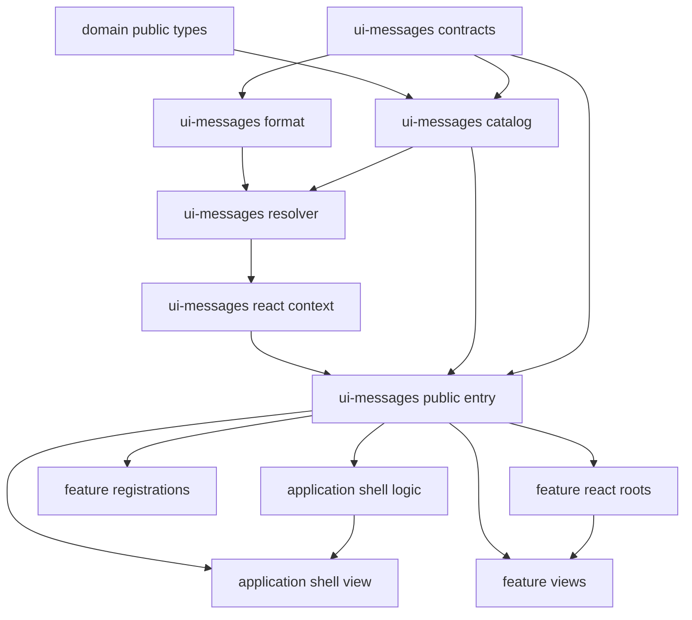
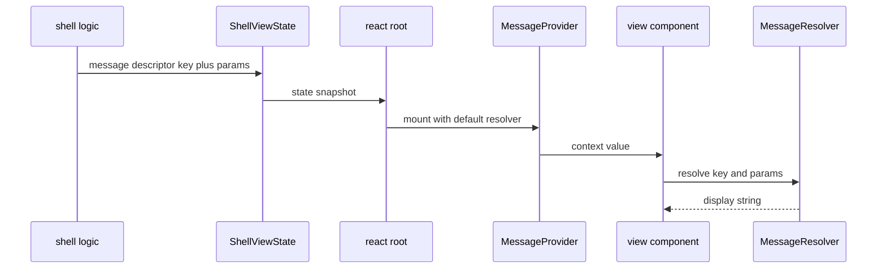
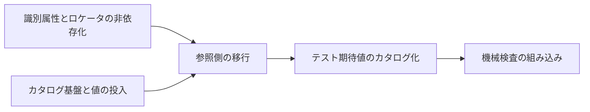

# Technical Design — ui-message-catalog

## Overview

**Purpose**: 本 spec は、UI に表示される全ての文言を単一のカタログから解決する構造へ移行し、あわせて文言が担っていた「スタイルの識別子」「テストの識別子」という役割を剥がす。振る舞い不変のリファクタであり、利用者から見た表示・操作結果は一切変化しない。

**Users**: 直接の利用者は拡張の開発者である。エンドユーザーにとって本変更は不可視でなければならない。

**Impact**: `src/ui-messages/` を新しい境界として追加し、5つの feature view・アプリケーションシェルの view とロジック層・5つの機能登録・2つのスタイルシート・4つの E2E 仕様・単体/統合テスト群が参照側として追随する。`ApplicationFeatureRegistration.navigation` と `ShellViewState` 系の型が契約変更を受ける。

### Goals

- 表示文言の唯一の定義箇所を `src/ui-messages/` に確定する。
- 参照方法（キー体系・パラメータ表現・解決経路）を、後続 `ui-internationalization` 導入後と同一の形にする。参照箇所を二度触らない。
- スタイル定義とテストから、表示文言を識別子として使う構造を除去する。
- 上記を、表示文言・DOM 構造・操作結果を1文字も変えずに達成する。
- 「文言が view に戻ってくる」ことを機械検査で恒久的に防ぐ。

### Non-Goals

- 言語の追加、翻訳、言語切り替え、言語の永続化。カタログは完了時点で日本語1言語のみを持つ。
- `_locales/`、`chrome.i18n`、拡張マニフェストの国際化。
- ロケール別の日付・数値・通貨フォーマット。
- 表示文言の文面改善（誤字修正・言い回し・表記ゆれの統一を含む）。
- 商品カテゴリ推定のキーワード辞書、価格表記のパースロジック。ロケール別データ・ロジックであり文言ではない。
- ドメイン層および互換性判定ルールへの変更。既に列挙コードで結果を返しており文言を持たない。

## Boundary Commitments

### This Spec Owns

- `src/ui-messages/` 境界の全て — メッセージ値の型、キー空間、日本語のメッセージ値、プレースホルダ展開、複数形選択、メッセージ記述子、React Context による供給。
- 表示文言の参照側の書き換え — 5つの feature view、シェル view、シェルのロジック層、5つの機能登録。
- 表示経路のメッセージ表現の契約 — `ShellViewState`、`ShellMaintenanceState`、`StartupError`、`SelectionError`、`CompositionError` が運ぶ値の形。
- ナビゲーションラベルの契約 — `ApplicationFeatureRegistration.navigation` が文言ではなくキーを持つこと。
- 文言に依存しない要素識別の規約 — `data-region` / `data-action` の命名と付与範囲、それを用いる `styles.css` の書き換え。
- E2E の要素特定ヘルパ `e2e/locators.ts`。
- 文言リテラルの再混入を検出する機械検査 `scripts/validate-ui-text.mjs` と、その `validate:ci` への組み込み。

### Out of Boundary

- 言語解決層、ロケール選択、言語切り替え UI、言語の永続化 — 全て `ui-internationalization` が所有する。本 spec はそれらを載せられる形を用意するだけで、実装しない。
- 各 feature の機能要件・受け入れ条件・ドメインロジック・永続化契約。触るのは表示文言と要素識別属性のみ。
- `FeatureMountContext` および mount/unmount ライフサイクルの責務。**カタログを `FeatureMountContext` 経由で供給しない**。
- `Result<T, E>` の定義。エラーのメッセージ識別子化にあたって同等型を再定義しない。
- `src/domain/`、`src/persistence/`、`src/features/compatibility/rules.ts`。文言を持たないため変更しない。
- `src/features/product-capture/category-hint.ts` および `normalizer.ts`。ロケール別データ・ロジックであり移行対象外。
- `tests/fixtures/` の架空商品名など日本語のデータ値、および `test()` / `describe()` のテスト名。表示文言ではない。

### Allowed Dependencies

- `src/ui-messages/` → `src/domain/public.js`（**型のみ**。`PartCategory` に対するカテゴリ表示名の網羅性を型で保証するため）。
- `src/ui-messages/` → React 19（`createContext` / `useContext` のみ）。
- `src/application-shell/`、`src/features/*/` → `src/ui-messages/public.js`（唯一の公開入口）。
- `e2e/`、`tests/` → `src/ui-messages/public.js`。
- **禁止**: `src/ui-messages/` から `src/application-shell/`、`src/features/`、`src/persistence/` への依存。カタログは葉であり、参照は常に片方向。
- **禁止**: view からの `src/ui-messages/catalog/` 配下の直接 import。view は `useMessages()` だけを経路とする。

### Revalidation Triggers

以下の変更は下流（`ui-internationalization`）および全参照箇所の再確認を要する。

- キーの命名規約、名前空間の分割方針の変更。
- プレースホルダ構文（`{name}`）または `MessageDefinition` の3形状（単純文字列・単一数量・複数数量）と selector 組み合わせ構文の変更。本設計で `MultiPluralDefinition` を追加したため、下流 `ui-internationalization` のカタログ整合検証を再確認する。
- `MessageResolver` / `MessageDescriptor` / `MessageProvider` の公開シグネチャの変更。
- `ApplicationFeatureRegistration.navigation` の形状変更。
- `data-region` / `data-action` の命名規約の変更（`styles.css` と E2E ヘルパの双方へ波及する）。

## Architecture

### Existing Architecture Analysis

- 縦割り（feature-first）を維持しつつ、共有責務は `domain` / `persistence` / `application-shell` / `runtime` の明示的な境界に置く方針が確立済みである。表示文言は既存のどの境界にも属さない横断的な表示層の関心であり、新しい葉の境界を追加するのが最も歪みが小さい。
- ドメイン層と互換性判定は既に「識別コード + 表示側での解決」の分離ができている。本 spec はこの既存パターンを表示層全体へ拡張するものであり、新しい思想を持ち込まない。
- 各 feature は自前の React root を生成する（`src/features/*/react-root.tsx`、および `current-build/registration.ts` 内の `mountBuildView`）。シェルの React ツリーとは分離しているため、Context の供給点は root ごとに必要になる。
- 検証は `pnpm validate` に一本化されており、規約は `scripts/validate-*.mjs` として機械化する慣行がある。本 spec の「view に文言が残っていないこと」も同じ形で機械化する。

### Architecture Pattern & Boundary Map



**Architecture Integration**:

- **Selected pattern**: 中央カタログ + 表示直前解決（late resolution）。値の保持と解決の実行を分離し、解決は必ず表示の直前に React Context 経由で行う。
- **Domain/feature boundaries**: `ui-messages` は葉であり誰にも依存しない（`domain` の型を除く）。参照は常に `ui-messages` へ向かう片方向。feature 間の依存は増えない。
- **Existing patterns preserved**: 公開入口を `public.ts` に限定する規約、`Result<T, E>` の canonical 所有、`FeatureMountContext` の責務、`structure.md` の依存方向。
- **New components rationale**: カタログ本体は文言の canonical owner を確定するため。React Context は「参照箇所を二度触らない」という分割の前提条件を満たすため。機械検査は規約をレビュー依存にしないため。
- **Steering compliance**: React を表示 adapter に限定する（`tech.md`）。ログには安定コードのみを出す（`security.md`）。規約は script で守る（`security.md`）。`data-*` を `querySelector` で引く既存のテスト作法（`testing.md`）をそのまま踏襲する。

### Dependency Direction

```text
domain public types (型のみ)
    ↓
ui-messages contracts → format → catalog → resolver → react context → public.ts
    ↓
application shell (logic → view) / feature (registration → react root → view)
    ↓
styles.css / tests / e2e （識別属性とカタログを参照する側）
```

左のレイヤーからのみ import する。`ui-messages` が右側のいずれかを import した時点で違反とする。

### Technology Stack

| Layer | Choice / Version | Role in Feature | Notes |
|---|---|---|---|
| Frontend | React 19（`createContext` / `useContext`） | カタログの供給と表示直前解決 | 新規依存なし。既存の React をそのまま利用 |
| Frontend | TypeScript 7（`strict`, `exactOptionalPropertyTypes`, `noUncheckedIndexedAccess`） | キーとパラメータの型による保護 | 定数オブジェクトからのキー union 導出とテンプレートリテラル型を使用 |
| Infrastructure / Runtime | esbuild による静的バンドル | カタログを配布物へ同梱 | MV3/CSP により動的読み込みは不可。全て静的 import |
| Tooling | Node 標準テストランナー、testing-library、Playwright | 振る舞い不変性の検証 | 既存構成のまま。新しいテストツールを追加しない |
| Tooling | `scripts/validate-ui-text.mjs`（TypeScript `createScanner`） | 文言リテラル再混入の機械検査 | 既存の `validate-*.mjs` と同じトークン走査方式 |

## File Structure Plan

### Directory Structure

```
src/
├── ui-messages/                 # 新規境界。表示文言の canonical owner
│   ├── contracts.ts             # メッセージ値・パラメータ・記述子の型、キー導出の型ユーティリティ
│   ├── catalog/                 # 名前空間ごとに1ファイル。並行編集の衝突面を作らない
│   │   ├── index.ts             # 10個の名前空間を束ねる唯一の集約点
│   │   ├── common.ts            # 機能横断の短語
│   │   ├── category.ts          # パーツカテゴリ表示名（PartCategory を網羅）
│   │   ├── persistence-error.ts # 永続化失敗の文言
│   │   ├── nav.ts               # ナビゲーションラベル
│   │   ├── shell.ts             # シェルの状態表示と起動・搭載失敗
│   │   ├── candidate.ts         # 候補管理
│   │   ├── build.ts             # 現在構成
│   │   ├── compatibility.ts     # 互換性確認
│   │   ├── capture.ts           # 商品取り込み
│   │   └── backup.ts            # バックアップ・復元
│   ├── format.ts                # プレースホルダ展開と複数形選択（純粋関数）
│   ├── resolver.ts              # カタログから resolver を組み立てる
│   ├── react.tsx                # MessageProvider と useMessages
│   └── public.ts                # 唯一の公開入口
scripts/
└── validate-ui-text.mjs         # 新規。文言リテラルの再混入と文言依存セレクタを検出
e2e/
└── locators.ts                  # 新規。data-* に基づく要素特定ヘルパを集約
```

### Modified Files

| ファイル | 変更内容 |
|---|---|
| `src/features/candidate-management/view.tsx` | 文言リテラル（約60件）と `categoryLabels` / `errorMessages` / `fieldErrorMessages` の表をカタログ参照へ。`data-region` の付与。テンプレート合成の文単位メッセージ化 |
| `src/features/current-build/view.tsx` | 同上（`categoryLabels` / `errorMessages` を含む）。`data-region` の付与 |
| `src/features/product-capture/view.tsx` | 同上（`FIELD_LABELS` / `CATEGORY_HINT_LABELS` / `SOURCE_LABELS` / 失敗文言表を含む） |
| `src/features/compatibility/view.tsx` | 同上（`RULE_LABELS` / `REASON_LABELS` / `AGGREGATE_LABELS` / `EMPTY_MESSAGES` / `FAILURE_MESSAGES`、および助詞連結2箇所） |
| `src/features/backup-restore/view.tsx` | 同上（診断メッセージ表、件数を含む完了メッセージ） |
| `src/features/{candidate-management,product-capture,compatibility,backup-restore}/react-root.tsx` | `MessageProvider` で view を包む |
| `src/features/current-build/registration.ts` | `mountBuildView` で `MessageProvider` を張る。`navigation` をキー申告へ |
| `src/features/{candidate-management,product-capture,compatibility,backup-restore}/registration.ts` | `navigation` をキー申告へ |
| `src/application-shell/contracts.ts` | `ShellViewState` / `ShellMaintenanceState` / `StartupError` / `SelectionError` / `CompositionError` の `message` を `MessageDescriptor` へ。`ApplicationFeatureRegistration.navigation.label` を `labelKey` へ |
| `src/application-shell/shell-view.tsx` | 状態表示・再試行ラベルをカタログ参照へ。記述子とナビゲーションキーを解決 |
| `src/application-shell/react-shell-root.tsx` | シェルの React root に `MessageProvider` を張る |
| `src/application-shell/side-panel-host.ts` | 表示経路を記述子化。診断経路を安定コードへ |
| `src/application-shell/maintenance-projection.ts` | 保守メッセージを記述子へ |
| `src/application-shell/{composition-root,application-composition,application-shell-integration}.ts` | 起動系メッセージを記述子へ。重複していた起動失敗文言を単一キーへ |
| `src/application-shell/feature-registry.ts` | `navigation` の検証を `labelKey` に合わせる |
| `src/features/candidate-management/styles.css` | 日本語属性セレクタ6箇所を `data-region` セレクタへ |
| `src/features/current-build/styles.css` | 同4箇所 |
| `e2e/{backup-restore,candidate-management,current-build,product-capture}.spec.ts` | 文言ロケータを `e2e/locators.ts` 経由の識別子ベースへ。文言の期待値はカタログ解決へ |
| `tests/**` | ロケータと期待値の追随（`tests/application-shell/side-panel-host.test.ts` の診断文字列を含む） |
| `package.json` | `validate:ci` に `validate:ui-text` を追加 |

## System Flows

### 表示文言の解決経路



ロジック層は文言を組み立てない。解決は表示の直前に一度だけ行われるため、後続 spec が Provider の値を差し替えるだけで表示言語が切り替わる。

### 移行順序と検証の関係



P1 を先に済ませることで、テストの修正が「ロケータ」と「期待値」で二度重ならない。P3 の時点でテストの**文言リテラルは無改変のまま残す**。これが緑であることが「表示文言が1文字も変わっていない」ことの証拠になる（下記「転記の検証装置」）。証拠を得たあとで P4 が期待値をカタログ解決へ置き換える。

## Requirements Traceability

| Requirement | Summary | Components | Interfaces | Flows |
|---|---|---|---|---|
| 1.1, 1.2, 1.3, 1.4 | 名前空間化されたキー、型による保護、プレースホルダ | MessageContracts, MessageCatalog | `MessageKey`, `ParamsFor`, `MessageResolver` | 表示文言の解決経路 |
| 1.5 | 静的バンドル | MessageCatalog | 静的 import のみ | — |
| 1.6 | 未検証文字列の安全な描画 | MessageFormatter, FeatureViewAdapters | `format` は文字列を返し JSX child として描画 | — |
| 2.1, 2.2, 2.3 | 表示・DOM・操作結果の同一性 | 全参照側コンポーネント | — | 移行順序と検証の関係 |
| 2.4 | 検証フローの成功 | UiTextGuard, 既存 validate フロー | `pnpm validate` | — |
| 2.5 | 文面改善を行わない | MessageCatalog | — | — |
| 3.1, 3.2, 3.5 | view のテキストと属性値のカタログ化 | FeatureViewAdapters, MessageReactContext | `useMessages()` | 表示文言の解決経路 |
| 3.3 | シェル状態表示のカタログ化 | ShellViewAdapter | `useMessages()` | 表示文言の解決経路 |
| 3.4 | view に文言が残っていないことの検出 | UiTextGuard | `validate:ui-text` | — |
| 4.1, 4.2, 4.3, 4.4 | 文単位メッセージへの再設計 | MessageCatalog, FeatureViewAdapters | `ParamsFor` | — |
| 4.5 | 単一または複数の件数を含む文 | MessageContracts, MessageFormatter | `PluralDefinition`, `MultiPluralDefinition` | — |
| 5.1, 5.2, 5.3, 5.4, 5.5 | 重複定義の単一化 | MessageCatalog | `CategoryLabelMap` の網羅型 | — |
| 6.1, 6.2, 6.3, 6.5 | ロジック層のメッセージ識別子化 | ShellMessageContracts, ShellMessageEmitters, ShellViewAdapter | `MessageDescriptor` | 表示文言の解決経路 |
| 6.4 | 診断への機微値の非混入 | ShellMessageEmitters | 安定コードのみ | — |
| 7.1, 7.2, 7.3, 7.4 | ナビゲーションラベルのカタログ化 | FeatureNavigationRegistrations, ShellMessageContracts, ShellViewAdapter | `navigation.labelKey` | — |
| 8.1, 8.2, 8.3, 8.4 | スタイルの文言非依存化 | ElementIdentityConvention | `data-region` | — |
| 8.5 | 文言依存セレクタの検出 | UiTextGuard | `validate:ui-text` | — |
| 9.1, 9.5 | E2E の識別子化 | E2ELocatorHelpers | `e2e/locators.ts` | 移行順序と検証の関係 |
| 9.2, 9.3, 9.4 | 単体・統合テストの追随 | E2ELocatorHelpers, MessageResolver | `createMessageResolver` | 移行順序と検証の関係 |
| 10.1, 10.2, 10.3, 10.4 | 国際化への前方互換性 | MessageContracts, MessageCatalog, MessageReactContext | `MessageCatalog` 型, `MessageProvider` | 表示文言の解決経路 |
| 10.5 | 単一言語に留める | MessageCatalog | — | — |

## Components and Interfaces

| Component | Domain/Layer | Intent | Req Coverage | Key Dependencies (P0/P1) | Contracts |
|---|---|---|---|---|---|
| MessageContracts | ui-messages | メッセージ値・パラメータ・記述子の型とキー導出 | 1.1, 1.2, 1.3, 4.5, 10.1, 10.2, 10.4 | domain public types (P1) | State |
| MessageCatalog | ui-messages | 全キーと日本語の値を単一定義として保持 | 1.1, 1.5, 2.5, 4.1, 4.4, 5.1〜5.5, 10.5 | MessageContracts (P0) | State |
| MessageFormatter | ui-messages | プレースホルダ展開と複数形選択 | 1.4, 1.6, 4.5 | MessageContracts (P0) | Service |
| MessageResolver | ui-messages | カタログと記述子から表示文字列を得る | 1.2, 1.3, 9.3, 10.3 | MessageCatalog (P0), MessageFormatter (P0) | Service |
| MessageReactContext | ui-messages | 表示直前解決のための供給経路 | 3.1, 3.5, 10.3 | MessageResolver (P0), React (P0) | Service |
| UiMessagesPublicEntry | ui-messages | 唯一の公開入口 | 1.1, 3.5 | 上記全て (P0) | Service |
| ShellMessageContracts | application-shell | 表示経路が運ぶ値とナビゲーション申告の形 | 6.1, 7.1, 7.4 | MessageContracts (P0) | State |
| ShellMessageEmitters | application-shell | ロジック層が記述子と安定コードを出す | 6.1, 6.3, 6.4, 6.5, 5.3 | ShellMessageContracts (P0) | Service |
| ShellViewAdapter | application-shell | シェルの表示文言解決とナビゲーション描画 | 3.3, 6.2, 7.2, 7.3 | MessageReactContext (P0), ShellMessageContracts (P0) | — |
| FeatureViewAdapters | features | 各 view のカタログ参照化と識別属性の付与 | 3.1, 3.2, 4.2, 4.3, 8.2, 8.3 | MessageReactContext (P0) | — |
| FeatureNavigationRegistrations | features | ナビゲーションラベルのキー申告 | 7.1, 7.3 | ShellMessageContracts (P0) | — |
| ElementIdentityConvention | features / styles | 文言に依存しない要素識別の規約とスタイル移行 | 8.1, 8.2, 8.4 | FeatureViewAdapters (P0) | — |
| E2ELocatorHelpers | e2e | 要素特定手順の集約 | 9.1, 9.3, 9.5 | ElementIdentityConvention (P0), MessageResolver (P1) | Service |
| UiTextGuard | scripts | 文言リテラルと文言依存セレクタの機械検査 | 2.4, 3.4, 8.5 | — | Batch |

### ui-messages

#### MessageContracts

| Field | Detail |
|---|---|
| Intent | メッセージ値・パラメータ・記述子の型を定義し、カタログ定数からキー空間とパラメータ型を導出する |
| Requirements | 1.1, 1.2, 1.3, 4.5, 10.1, 10.2, 10.4 |

**Responsibilities & Constraints**

- 値の表現を「単純文字列」「単一数量フォーム」「複数数量フォーム」の判別可能な3形とする。構造化フォームは `forms` の有無で単純文字列と区別し、複数数量フォームは `selectors` の有無で単一数量フォームと区別する。
- プレースホルダ構文を `{name}` に固定する。`name` は英字始まりの英数字とする。
- カタログ定数から、ドット区切りのキー union と、キーごとの必須パラメータ型を導出する。
- **言語を型に持ち込まない。** カタログの「形」（キー集合とパラメータ）は言語から独立した型として定義し、言語ごとの値集合はその型を満たす実体として与える。後続 spec は同じ型を満たす `en` の実体を追加するだけでよく、キーの不足は型検査で失敗する。

**Dependencies**

- Outbound: `src/domain/public.js` — `PartCategory` の網羅性保証（P1、型のみ）
- Inbound: MessageCatalog, MessageFormatter, MessageResolver, ShellMessageContracts

**Contracts**: State [x]

##### State Management

```typescript
/** 数量に応じて表現を切り替えるメッセージ。日本語は使わないが、形式として塞がない。 */
export interface PluralDefinition {
  readonly selectors?: never;
  readonly forms: {
    readonly other: string;
    readonly one?: string;
    readonly zero?: string;
  };
}

/** 複数の独立した数量に応じて、完結した1文を切り替えるメッセージ。 */
export interface MultiPluralDefinition<
  Selectors extends readonly [string, ...string[]] = readonly [string, ...string[]],
> {
  readonly selectors: Selectors;
  readonly forms: {
    readonly other: string;
    /** selector順の zero / one / other を `|` で連結したキー。 */
    readonly [combination: string]: string;
  };
}

export type MessageDefinition = string | PluralDefinition | MultiPluralDefinition;

export type MessageParamValue = string | number;
export type MessageParams = Readonly<Record<string, MessageParamValue>>;

/** 名前空間の入れ子。葉は MessageDefinition。 */
export interface MessageNamespace {
  readonly [segment: string]: MessageDefinition | MessageNamespace;
}

/** `{name}` を抽出する。値が as const で保持されていることが前提。 */
export type PlaceholderNames<S extends string> =
  S extends `${string}{${infer Name}}${infer Rest}`
    ? Name | PlaceholderNames<Rest>
    : never;

/** ドット区切りのキー union。葉に到達したら連結を止める。 */
export type MessageKeyOf<T> = {
  [K in keyof T & string]: T[K] extends MessageDefinition
    ? K
    : `${K}.${MessageKeyOf<T[K]>}`;
}[keyof T & string];

/** キーに対応する定義。 */
export type DefinitionAt<T, K extends string> =
  K extends `${infer Head}.${infer Rest}`
    ? Head extends keyof T
      ? DefinitionAt<T[Head], Rest>
      : never
    : K extends keyof T
      ? T[K]
      : never;

/** 記述子。ロジック層が表示層へ渡す唯一の形。 */
export interface MessageDescriptor {
  readonly key: string;
  readonly params?: MessageParams;
}
```

- Preconditions: カタログ定数は `as const` で宣言され、値がリテラル型として保持されていること。
- Postconditions: `MessageKeyOf` はカタログに実在するキーだけを含む。存在しないキーは型として構築できない。`ParamsArgsFor` は `PluralDefinition` の `count`、または `MultiPluralDefinition.selectors` の全名称を数値として必須にし、全フォームのプレースホルダも必須にする。
- Invariants: 型は言語に依存しない。カタログの実体が増えても型定義は変わらない。

**Implementation Notes**

- Integration: `noUncheckedIndexedAccess` 下でも安全なように、解決は動的な添字アクセスではなく型付きの経路探索で行う。実行時の探索は `unknown` 経由で受けて葉に到達したことを検査する。
- Validation: `PlaceholderNames` によるパラメータ型導出はキーごとに `void` 引数（パラメータ無し）と必須オブジェクト引数を切り替える。パラメータ無しのキーに引数を渡す呼び出しは型エラーになる。
- Validation: `MultiPluralDefinition` は全 selector と全フォームのプレースホルダが呼び出し型で必須になることを型検査で固定する。組み合わせキーは可変長 selector に対する文字列契約とし、誤記・未定義のキーには到達せず `other` へ後退することを実行時テストで固定する。
- Risks: 型レベル文字列処理のコンパイル負荷。キー数は約200・値は短文であり実害は小さい見込みだが、`pnpm typecheck` 所要時間を移行前後で比較する。

#### MessageCatalog

| Field | Detail |
|---|---|
| Intent | 全キーと現行の日本語文言を単一定義として保持する |
| Requirements | 1.1, 1.5, 2.5, 4.1, 4.4, 5.1〜5.5, 10.5 |

**Responsibilities & Constraints**

- **名前空間ごとに1ファイルへ分割し、`catalog/index.ts` だけが集約する。** これにより機能ごとの値投入が並行して行え、単一ファイルへの編集衝突が生じない。集約点は基盤タスクで一度だけ作り、以降は各名前空間ファイルのみを編集する。
- 名前空間は次のとおり。共有名前空間を先に置き、機能名前空間を続ける。
  | 名前空間 | 対象 | 概数 |
  |---|---|---|
  | `common` | 未入力・未選択・保存・削除・取消・キャンセルなど機能横断の短語 | 約12 |
  | `category` | パーツカテゴリ12種の表示名（3箇所の重複を統合） | 12 |
  | `persistenceError` | 永続化失敗の文言。**文面が完全一致するものだけを共有キーにする** | 約12 |
  | `nav` | 5機能のナビゲーションラベル | 5 |
  | `shell` | 読み込み中・エラー・保守中・機能なし・再試行・機能表示失敗・起動失敗・機能搭載失敗など | 約14 |
  | `candidate` | 候補管理の画面文言 | 約55 |
  | `build` | 現在構成の画面文言 | 約12 |
  | `compatibility` | 互換性確認の画面文言 | 約28 |
  | `capture` | 商品取り込みの画面文言 | 約45 |
  | `backup` | バックアップ・復元の画面文言 | 約35 |
- **値は現行の文字列をそのまま転記する。** 誤字・表記ゆれを含めて改変しない（2.5）。
- **統合の判定基準は文字列の完全一致のみ。** コード名が同じでも文面が異なるものは feature 名前空間の個別キーとして保持する（5.5）。具体的には `persistenceError` において、`validation` / `maintenance` / `quota` / `conflict` / `snapshotRestoreFailed` は共有キーへ統合できるが、`storage` / `notFound` / `unsupportedData` / `corruptData` は feature ごとに文面が異なるため個別キーとする。
- カテゴリ表示名は `PartCategory` を網羅する型として定義し、カテゴリの増減が型検査で検出されるようにする（5.4）。
- **助詞連結・テンプレート合成の再設計**（4.1, 4.4）。既存の合成箇所は次のとおり文単位のキーへ置き換える。合成後の文字列は現行と一致させる。
  | 現行の合成 | 再設計 |
  |---|---|
  | `{側ラベル}` + `"が選択されていません。"` / `"の値が未確認です。"` | 条件ごとに独立キーを与え、側ラベルを `{side}` パラメータで受ける完結した文にする |
  | `` `${側ラベル}（未選択）` `` | `{side}` を受ける1つの文 |
  | `` `${name}を編集` `` / `` `${name}を削除` `` | `{name}` を受ける2つの独立キー |
  | `` `${field}（自由入力）` `` | `{field}` を受ける1つの文 |
  | 「プロジェクト「{name}」と〜」「候補「{name}」を〜」の JSX 子要素列 | 種別ごとに独立キーを与え `{name}` を受ける完結した文にする |
  | `` `推定: ${label}（詳細編集の初期選択になります）` `` | `{label}` を受ける1つの文。推定不能時は別キー |
  | `` `候補を保存しました（保存先: ${projectName}）。` `` | `{projectName}` を受ける1つの文。保存先不明時は別キー |
  | `` `${base}（位置: ${path}）` `` | 位置情報を伴う場合の独立キーとし、`{message}` と `{path}` を受ける |
  | 「復元が完了しました（プロジェクト{n}件、候補{n}件、現在構成{n}件）。」 | `{projectCount}` `{partCount}` `{currentBuildCount}` を受ける1つの文 |
  | `value.join("、")` による列挙結合 | 区切り文字を `common` 名前空間のキーとして持ち、結合は表示層のユーティリティが行う |

**Dependencies**

- Outbound: MessageContracts（P0）、`src/domain/public.js` の `PartCategory`（P1、型のみ）
- Inbound: MessageResolver, UiMessagesPublicEntry

**Contracts**: State [x]

##### State Management

```typescript
// src/ui-messages/catalog/index.ts — 各名前空間ファイルを束ねる唯一の集約点
export const MESSAGES = {
  common: { /* ... */ },
  category: { /* PartCategory を網羅 */ },
  persistenceError: { /* ... */ },
  nav: { /* ... */ },
  shell: { /* ... */ },
  candidate: { /* ... */ },
  build: { /* ... */ },
  compatibility: { /* ... */ },
  capture: { /* ... */ },
  backup: { /* ... */ },
} as const satisfies MessageNamespace;

export type MessageKey = MessageKeyOf<typeof MESSAGES>;

/** 言語から独立した「カタログの形」。後続 spec の en はこの型を満たす。 */
export type MessageCatalogShape = {
  readonly [K in MessageKey]: MessageDefinition;
};
```

- Invariants: カタログはモジュール定数であり、実行時に変更されない。

**Implementation Notes**

- Integration: 値の転記は feature 単位で行い、その feature の既存テスト（文言リテラルを含むもの）を無改変で通すことを完了条件にする。
- Validation: `MessageCatalogShape` は「キー集合を平坦化した Record」であり、後続 spec が `en` を追加する際にキー不足を型検査で検出させるための接合面である。
- Risks: 統合の誤り（文面が異なるものを統合する）は表示の変更を招く。統合対象は上表に限定し、それ以外は個別キーとする。

#### MessageFormatter

| Field | Detail |
|---|---|
| Intent | メッセージ定義とパラメータから表示文字列を組み立てる純粋関数 |
| Requirements | 1.4, 1.6, 4.5 |

**Responsibilities & Constraints**

- `{name}` をパラメータ値へ置換する。数値は既定の文字列化を用いる（ロケール別数値整形は Out of Boundary）。
- `PluralDefinition` の場合は `count` パラメータでフォームを選ぶ。`one` / `zero` が未定義なら `other` を使う。
- `MultiPluralDefinition` の場合は、`selectors` の順に各数値を `zero` / `one` / `other` へ分類して `|` で連結した組み合わせキーを選ぶ。selector 不足、組み合わせ未定義、組み合わせキーの誤記はいずれも `forms.other` へ後退する。
- 対応するパラメータが存在しないプレースホルダは置換せずそのまま残す。**例外を投げない**（表示中の画面を落とさない）。
- 返り値は常に `string` である。マークアップを生成しない。呼び出し側は通常の JSX child として描画するため、外部由来文字列がマークアップとして解釈されることはない（1.6）。

**Contracts**: Service [x]

##### Service Interface

```typescript
export const formatMessage = (
  definition: MessageDefinition,
  params?: MessageParams,
): string;
```

- Preconditions: `definition` は `MessageDefinition` を満たす。
- Postconditions: 返り値は `string`。`definition` が単純文字列でプレースホルダを含まない場合、返り値は入力と同一。
- Invariants: 副作用を持たない。同じ入力に対して同じ出力を返す。

**Implementation Notes**

- Integration: 数量フォームの分岐は日本語カタログでは一度も通らない。単体テストで単一・複数 selector の動作を固定し、後続 spec が英語値を入れた時点で caller を変更せず機能することを保証する。復元完了の caller は既に `projectCount` / `partCount` / `currentBuildCount` を渡している。
- Validation: プレースホルダ未解決時の挙動（そのまま残す）を単体テストで固定する。
- Risks: 値に `{` が文字として含まれる場合の誤置換。現行の文言に `{` は存在しないことを移行時に確認する。

#### MessageResolver

| Field | Detail |
|---|---|
| Intent | カタログを閉じ込めた解決関数を生成する |
| Requirements | 1.2, 1.3, 9.3, 10.3 |

**Contracts**: Service [x]

##### Service Interface

```typescript
export interface MessageResolver {
  /** キーによる解決。パラメータの過不足はコンパイルエラーになる。 */
  <K extends MessageKey>(key: K, ...params: ParamsArgs<K>): string;
  /** 記述子による解決。ロジック層が渡した値を表示層が解く経路。 */
  readonly resolveDescriptor: (descriptor: MessageDescriptor) => string;
}

export const createMessageResolver = (
  catalog: MessageCatalogShape,
): MessageResolver;

/** 型安全に記述子を作る唯一の手段。パラメータの検査はここで効く。 */
export const message = <K extends MessageKey>(
  key: K,
  ...params: ParamsArgs<K>
): MessageDescriptor;
```

- Preconditions: `catalog` は `MessageCatalogShape` を満たす。
- Postconditions: 実在するキーに対して必ず `string` を返す。
- Invariants: resolver はカタログを閉じ込めた不変オブジェクトである。

**Implementation Notes**

- Integration: `message()` を通さない記述子の直接構築は禁止する。これによりロジック層でもパラメータの型検査が効く。
- Validation: `resolveDescriptor` はキーが実在しない場合にキー文字列そのものを返す（画面を落とさない）。この経路は `message()` 経由では到達不能であり、防御的な既定として単体テストで固定する。
- Risks: なし。

#### MessageReactContext

| Field | Detail |
|---|---|
| Intent | 表示直前解決のための供給経路。後続 spec の言語切り替えの唯一の差し替え点 |
| Requirements | 3.1, 3.5, 10.3 |

**Responsibilities & Constraints**

- 既定値は同梱カタログに対する resolver とする。Provider を張り忘れても現行と同じ表示になるが、**Provider を張ることを規約とする**（後続 spec の差し替え点を確保するため）。
- Provider は各 React root の生成箇所で張る。シェル1箇所、feature 5箇所。**`FeatureMountContext` を経由して供給しない。**

**Contracts**: Service [x]

##### Service Interface

```typescript
export const MessageProvider: (props: {
  readonly resolver?: MessageResolver;
  readonly children: ReactNode;
}) => ReactElement;

export const useMessages: () => MessageResolver;
```

- Preconditions: `useMessages` は React ツリー内でのみ呼べる。
- Postconditions: Provider 未設置でも既定 resolver が返る。
- Invariants: Context の値は resolver そのものであり、言語コードやカタログを露出しない。

**Implementation Notes**

- Integration: 各 feature の root 生成箇所（`react-root.tsx` 4件と `current-build/registration.ts` の `mountBuildView`）で `MessageProvider` を張る。DOM テストの `render` も同様に包む必要があるため、`testing.md` の `renderView` ハーネスに Provider を組み込む。
- Validation: Provider を張った状態と張らない状態で同一の表示になることを DOM テストで確認する。
- Risks: 張り忘れが後続 spec で初めて顕在化する。機械検査で「React root 生成箇所に Provider があること」までは検査せず、移行タスクのチェック項目として扱う。

#### UiMessagesPublicEntry

| Field | Detail |
|---|---|
| Intent | 境界の唯一の公開入口 |
| Requirements | 1.1, 3.5 |

**Implementation Notes**

- 公開するもの: `MessageKey`, `MessageDescriptor`, `MessageParams`, `MessageResolver`, `MessageCatalogShape`, `createMessageResolver`, `message`, `MessageProvider`, `useMessages`。
- 公開しないもの: `MESSAGES` 定数そのもの。ただしテストと E2E が期待値を解決するために `createMessageResolver` を引数なしで使えるよう、既定 resolver を `defaultMessageResolver` として公開する。view からのカタログ直接参照を防ぐ意図は機械検査で担保する。

### application-shell

#### ShellMessageContracts

| Field | Detail |
|---|---|
| Intent | 表示経路が運ぶ値とナビゲーション申告の形を定義する |
| Requirements | 6.1, 7.1, 7.4 |

**Responsibilities & Constraints**

- 表示経路の `message: string` を `MessageDescriptor` へ置き換える。対象は `ShellViewState`（`error` / `maintenance`）、`ShellMaintenanceState`（`active`）、`StartupError`、`SelectionError`、`CompositionError`。
- `ApplicationFeatureRegistration.navigation` の `label: string` を `labelKey: MessageKey` へ置き換える。`order` と `icon` は変更しない。
- `ShellNavigationItem` も同様に `labelKey` を持つ。
- **変更しないもの**: `FeatureActivationError.detail`、`FeatureMountContext.reportError`、`WorkerRegistrationContext.reportError`。いずれも描画経路を持たない診断であり、表示文言ではない。

**Contracts**: State [x]

##### State Management

```typescript
export type ShellMaintenanceState =
  | { readonly status: "inactive"; readonly cursor: MaintenanceCursor }
  | {
      readonly status: "active";
      readonly cursor: MaintenanceCursor;
      readonly message: MessageDescriptor;
    };

export type ShellViewState =
  | { readonly kind: "loading" }
  | { readonly kind: "ready"; readonly selected: FeatureId | null }
  | {
      readonly kind: "maintenance";
      readonly selected: FeatureId | null;
      readonly message: MessageDescriptor;
    }
  | {
      readonly kind: "error";
      readonly message: MessageDescriptor;
      readonly recoverable: boolean;
    };

export type StartupError = {
  readonly kind: "startup_failed";
  readonly message: MessageDescriptor;
};

export type SelectionError = {
  readonly kind: "unavailable" | "mount_failed";
  readonly message: MessageDescriptor;
};

export type CompositionError = {
  readonly kind: "missing_dependency" | "startup_failed";
  readonly message: MessageDescriptor;
};

export interface ApplicationFeatureRegistration<
  TPublic extends object = object,
  TActivation = never,
> {
  readonly id: FeatureId;
  readonly navigation: {
    readonly labelKey: MessageKey;
    readonly order: number;
    readonly icon?: string;
  };
  // 以下は現行のまま
}
```

**Implementation Notes**

- Integration: この契約変更は全 feature の `registration.ts` と `feature-registry.ts` の検証ロジックに同時に波及する。部分適用状態を作らず、単一の統合タスクとして適用する。
- Validation: `feature-registry.ts` の `navigation` 検証は `labelKey` が空でない文字列であることの検査へ置き換える。
- Risks: `tests/contracts/application-shell-contract-kit.test.ts` が契約形状を検証している。同時に更新する。

#### ShellMessageEmitters

| Field | Detail |
|---|---|
| Intent | ロジック層が表示用の記述子と診断用の安定コードを別々に出す |
| Requirements | 5.3, 6.1, 6.3, 6.4, 6.5 |

**Responsibilities & Constraints**

- `side-panel-host.ts` は表示へ渡す値を `message(...)` で構築する。診断（`reportDiagnostic`）へは `feature-unmount-failed` のような**安定した英字コード**と機能 ID を渡す。日本語文言を診断へ出さない。
- 機能が申告した利用不可理由（`Availability.reason`、自由文字列）は翻訳対象ではなく、記述子の**パラメータ**として扱う（6.5）。
- `maintenance-projection.ts` の保守メッセージ、`application-shell-integration.ts` の起動失敗メッセージ、`composition-root.ts` / `application-composition.ts` の起動失敗メッセージを記述子化する。
- **重複していた起動失敗文言を単一キーへ統合する**（5.3）。`composition-root.ts` の `STARTUP_FAILED` と `application-composition.ts` の `STARTUP_ERROR` は文面が完全一致するため統合可能。
- 診断ログに機微値（閲覧履歴・検討内容に相当する値）を含めない（6.4）。機能 ID と安定コードのみを出す。

**Contracts**: Service [x]

**Implementation Notes**

- Integration: 表示経路と診断経路が同じ文字列を共有している箇所（`side-panel-host.ts` の複数箇所）を、記述子とコードの2つへ分ける。
- Validation: 記述子を解決した結果が現行の文字列と一致することを、シェルの DOM テストで既存の文言リテラルのまま確認する。
- Risks: `tests/application-shell/side-panel-host.test.ts` は診断文字列を検証している。これは表示の検証ではないため安定コードへ書き換えるが、書き換え前に「表示を検証しているつもりのアサーションが混ざっていないか」を1件ずつ確認する。

#### ShellViewAdapter

| Field | Detail |
|---|---|
| Intent | シェルの状態表示とナビゲーションを、記述子とキーから解決して描画する |
| Requirements | 3.3, 6.2, 7.2, 7.3 |

**Implementation Notes**

- `shell-view.tsx` は `useMessages()` を用い、`state.message`（記述子）を `resolveDescriptor` で、`ShellNavigationItem.labelKey` をキー解決で表示文字列にする。
- ナビゲーションの `aria-label` と `title` は現行どおり解決後のラベル文字列を用いる。順序とアクセシブル名は変更しない（7.3）。
- `react-shell-root.tsx` がシェルの React root に `MessageProvider` を張る。
- 読み込み中・エラー見出し・保守中見出し・機能なし・再試行・機能表示失敗の各文言を `shell` 名前空間へ移す。

### features

#### FeatureViewAdapters

| Field | Detail |
|---|---|
| Intent | 5つの view から文言リテラルを除去し、識別属性を付与する |
| Requirements | 3.1, 3.2, 4.2, 4.3, 8.2, 8.3 |

**Responsibilities & Constraints**

- 各 view は `useMessages()` の resolver だけを経路とし、カタログ定数を直接 import しない。
- モジュールスコープの文言テーブル（`categoryLabels`、`errorMessages`、`fieldErrorMessages`、`RULE_LABELS`、`REASON_LABELS`、`AGGREGATE_LABELS`、`EMPTY_MESSAGES`、`FAILURE_MESSAGES`、`FIELD_LABELS`、`CATEGORY_HINT_LABELS`、`SOURCE_LABELS`、診断メッセージ表）は、コードからキーへの写像に置き換える。**写像はカタログのキーを返すだけであり、文言を持たない。**
- 表示属性（`aria-label` / `placeholder` / `title`）も resolver 経由にする（3.2）。
- `aria-label` の値は変更しない。`data-*` は追加であって置き換えではない（8.3）。
- 文字列連結・テンプレート合成で文言を組み立てない（4.2）。パラメータはカタログのプレースホルダで受ける。
- 各 feature の React root 生成箇所で `MessageProvider` を張る。

**Implementation Notes**

- Integration: feature 単位で移行し、その feature の既存テスト（文言リテラルを含む）を**無改変で通す**ことを完了条件とする。
- Validation: 移行前後で DOM テストの `container.textContent` に対する既存の正規表現マッチが全て成立すること。
- Risks: `product-capture` と `backup-restore` は文言量が多く合成箇所も多い。1タスクに詰め込まず、画面フェーズ単位に分ける。

#### FeatureNavigationRegistrations

| Field | Detail |
|---|---|
| Intent | 5つの `registration.ts` がラベル文言ではなくキーを申告する |
| Requirements | 7.1, 7.3 |

**Implementation Notes**

- `navigation: { label: "候補管理", ... }` を `navigation: { labelKey: "nav.candidateManagement", ... }` へ置き換える。`order` と `icon` は変更しない。
- `ShellMessageContracts` の契約変更と同時に適用する。契約と全登録が同期する単一の統合タスクとする。

#### ElementIdentityConvention

| Field | Detail |
|---|---|
| Intent | 文言に依存しない要素識別の規約を定め、スタイルを移行する |
| Requirements | 8.1, 8.2, 8.4 |

**Responsibilities & Constraints**

- **規約**:
  - `data-region="<kebab-case-english>"` — 画面内の領域を識別する。既存の feature ルートクラス（`.candidate-management` / `.current-build` など）で名前空間が切れるため、feature 間で同名を使ってよい。
  - `data-action="<kebab-case-english>"` — 操作ボタンを識別する。既に `data-select-candidate-id` など ID 付き属性がある箇所はそれを継続利用し、新設しない。
  - いずれも英字のみ。日本語を含む値を作らない。
- **移行対象**（実測10箇所）:
  | ファイル | 現行セレクタ | 置換後 |
  |---|---|---|
  | `candidate-management/styles.css:57` | `nav[aria-label="プロジェクト"] > span` | `[data-region="projects"] > span` |
  | `candidate-management/styles.css:83,88` | `form[aria-label="プロジェクト編集"]` | `[data-region="project-form"]` |
  | `candidate-management/styles.css:101` | `ul[aria-label="候補一覧"]` | `[data-region="candidate-list"]` |
  | `candidate-management/styles.css:142,152` | `form[aria-label="候補編集"]` | `[data-region="candidate-form"]` |
  | `current-build/styles.css:55,64,74,79` | `ul[aria-label="候補一覧"]` | `[data-region="candidate-list"]` |
- 対応する要素へ `data-region` を追加する。既存の `aria-label` は残す。
- セレクタの詳細度が変わる可能性があるため、`.candidate-management` などのルートクラスとの結合を維持し、要素型セレクタ（`nav` / `form` / `ul`）は必要に応じて残す。

**Implementation Notes**

- Validation: 移行後に視覚差分が出ないことを、既存の E2E とスクリーン表示で確認する。詳細度の変化はセレクタの構造を維持することで抑える。
- Risks: 属性セレクタの詳細度は要素型セレクタより高い。単純置換で詳細度が下がる場合はルートクラスとの結合を明示して維持する。

### tooling

#### E2ELocatorHelpers

| Field | Detail |
|---|---|
| Intent | E2E の要素特定手順を集約し、各仕様ファイルから識別子の組み立て規約を無くす |
| Requirements | 9.1, 9.3, 9.5 |

**Contracts**: Service [x]

##### Service Interface

```typescript
/** feature ルートと領域名から領域を特定する。 */
export const region: (scope: Locator | Page, name: string) => Locator;
/** 操作ボタンを特定する。 */
export const action: (scope: Locator | Page, name: string) => Locator;
/** ナビゲーションの機能ボタンを特定する。 */
export const navItem: (page: Page, featureId: string) => Locator;
/** 文言そのものを検証する箇所で期待値を得る。 */
export const expectedText: MessageResolver;
```

**Implementation Notes**

- Integration: `expectedText` は `src/ui-messages/public.js` の既定 resolver を再輸出する。Playwright のトランスフォームが NodeNext 流の `.js` 指定子を解決できるかを、最初の E2E タスクで最小の import 1件により確認する。
- Validation: 4つの spec ファイルから文言ベースのロケータが消え、`e2e/locators.ts` 経由になること。
- Risks: 解決できない場合、E2E はロケータのみ識別子化し、文言の期待値はリテラルのまま残す。この場合 E2E は文言変更の検出装置として残り、要件9.3 は単体・統合テストの範囲で満たす。この後退を採る場合は design の追記ではなくタスクの詳細として記録する。

#### UiTextGuard

| Field | Detail |
|---|---|
| Intent | 文言リテラルと文言依存セレクタの再混入を機械的に検出する |
| Requirements | 2.4, 3.4, 8.5 |

**Contracts**: Batch [x]

##### Batch / Job Contract

- Trigger: `pnpm validate:ui-text`。`validate:ci` の一部として `pnpm test` の前に実行する。
- Input / validation:
  - `src/features/*/view.tsx`、`src/features/*/registration.ts`、`src/features/*/react-root.tsx`、`src/application-shell/**/*.ts(x)` を TypeScript の `createScanner` でトークン化し、**文字列リテラル・テンプレートリテラルに自然言語（CJK）が含まれる場合を違反とする**。コメントと JSDoc はトークン走査により自然に除外される。
  - `src/features/*/styles.css`、`src/application-shell/*.css` を走査し、**属性セレクタの値に自然言語が含まれる場合を違反とする**。
  - `src/features/*/view.tsx` が `ui-messages/catalog/index.js` を直接 import している場合を違反とする。
- Output / destination: 違反があれば違反ごとにファイル・行・規則名を出力し、非ゼロ終了する。
- Idempotency & recovery: 読み取り専用。冪等。

**Implementation Notes**

- Integration: 既存の `scripts/validate-boundaries.mjs` と同じ TypeScript scanner ベースの実装方式を踏襲する。
- Validation: 走査対象外（`src/ui-messages/catalog/`、`src/features/product-capture/category-hint.ts`、`tests/`、`src/domain/`、`src/persistence/`）を明示的に除外し、除外理由をスクリプト内のコメントに残す。
- Risks: 過検出により正当な日本語（`category-hint.ts` のキーワード辞書など）を弾く。除外リストを明示し、除外の追加には理由を要求する。

## Error Handling

### Error Strategy

本 spec はエラーの**分類と発生条件を一切変更しない**。変更するのはエラーが表示文言へ変換される場所だけである。

### Error Categories and Responses

- **利用者向けエラー表示**: 現行と同じ分岐・同じ文言。表現手段だけが記述子経由になる。
- **カタログ解決の失敗**: 型で防がれるため到達不能。防御的な既定として、未知キーはキー文字列を返し、未解決プレースホルダはそのまま残す。いずれも画面を落とさない。
- **診断ログ**: 安定した英字コードのみ。機微値と例外オブジェクトのダンプを出さない（`security.md`）。

### Monitoring

既存の `reportError` 経路をそのまま使う。出力内容が文言からコードへ変わるだけである。

## Testing Strategy

### Unit Tests

1. `formatMessage` が単純文字列のプレースホルダを置換し、未対応のプレースホルダをそのまま残すこと（1.4）。
2. `formatMessage` が `PluralDefinition` に対し `count` でフォームを選び、`one` / `zero` 未定義時に `other` へ落ちること（4.5）。
3. `formatMessage` が `MultiPluralDefinition` の全 selector を `zero` / `one` / `other` に分類して組み合わせフォームを選び、selector 不足・未定義・誤記キーでは `other` へ落ちること。型検査では全 selector と全フォームのプレースホルダが必須になること（4.5, 10.4）。
4. `createMessageResolver` が実在キーに対して値を返し、`resolveDescriptor` が未知キーに対してキー文字列を返すこと（1.2）。
5. カタログの `category` 名前空間が `PartCategory` を網羅していること（5.4）。
6. `persistenceError` の共有キーと feature 固有キーの値が、移行前の各 view の表と1件ずつ一致すること（5.5, 2.1）。

### Integration Tests

1. 各 feature の DOM テストが、`MessageProvider` の有無にかかわらず現行と同一のテキストを描画すること（3.1, 3.5）。
2. シェルのエラー・保守・起動失敗の各状態が、記述子から現行と同一の文言へ解決されること（6.2, 6.3）。
3. ナビゲーションが `labelKey` から現行と同一のラベル・順序・アクセシブル名を生成すること（7.2, 7.3）。
4. 再設計した文単位メッセージ（削除確認、互換性の不足項目、取り込み完了、復元完了）が、現行と同一の文字列を生成すること（4.3）。
5. 未検証の外部由来文字列をパラメータに含む描画で、`querySelector("img")` が `null` であること（1.6）。

### E2E Tests

1. 候補管理: プロジェクト作成 → 候補作成 → 編集 → 削除の一連が、識別子ベースのロケータで現行と同じ結果になること（9.1, 2.3）。
2. 現在構成: カテゴリ切替 → 選択 → 数量確定 → 解除の一連（9.1, 2.3）。
3. 商品取り込み: 取り込み → 確認 → 保存の一連（9.1, 2.3）。
4. バックアップ・復元: 作成 → ファイル選択 → 確認 → 復元確定の一連（9.1, 2.3）。
5. 上記4本を通じて、`styles.css` の移行後も画面が現行と同じ構造で描画されること（8.4）。

### Validation Gate

- `pnpm validate:ui-text` が違反ゼロで通ること（3.4, 8.5）。
- `pnpm validate` の全段が成功すること（2.4）。

## Security Considerations

- カタログの値は開発者が管理する静的データであり、外部入力を含まない。パラメータには外部由来文字列（商品名、プロジェクト名、ファイルパス）が入りうるが、`formatMessage` は `string` を返すのみでマークアップを生成せず、呼び出し側は通常の JSX child として描画する。`innerHTML` / `dangerouslySetInnerHTML` を導入しない（`security.md` の既存規約と生成物検査をそのまま満たす）。
- 診断ログの出力を日本語文言から安定コードへ変えることで、「ログへ出すのはエラーコードに限る」という `security.md` の規約への適合が進む。機能 ID 以外の識別値をログへ出さない。
- カタログは静的にバンドルされ、動的読み込みを行わない。MV3 の CSP を弱めない。
